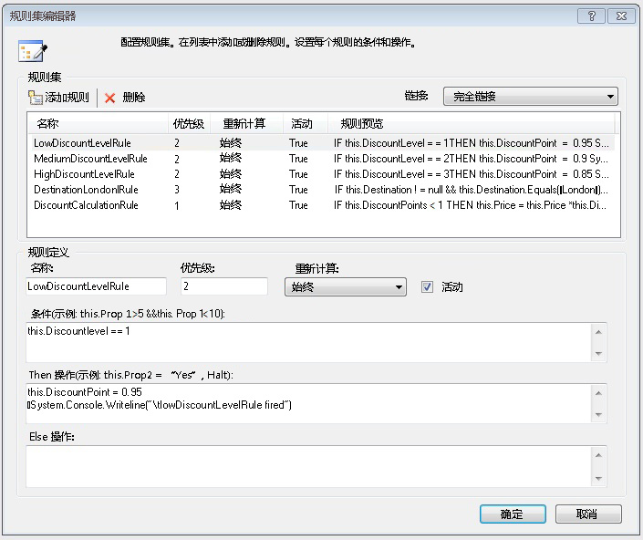
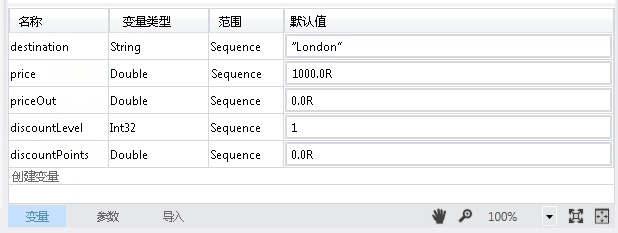
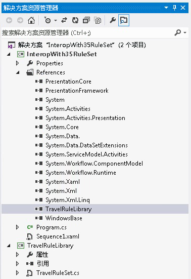
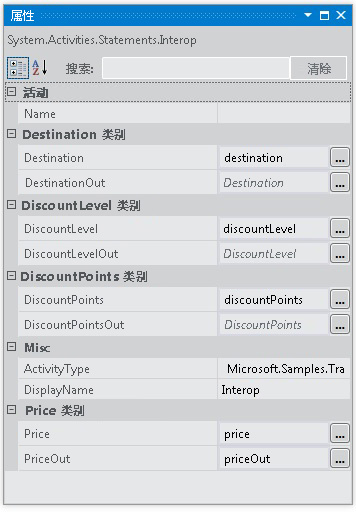

# <a name="interop-with-35-rule-set"></a>与 3.5 规则集交互
此示例演示如何使用<xref:System.Activities.Statements.Interop>活动中的自定义活动集成[!INCLUDE[netfx35_short](../../../../includes/netfx35-short-md.md)]使用<!--zz <xref:System.Workflow.Activities.Policy> -->`System.Workflow.Activities.Policy`和规则。 此示例通过将 [!INCLUDE[netfx_current_long](../../../../includes/netfx-current-long-md.md)] 变量绑定到由自定义活动公开的依赖项属性，将数据传递给自定义活动。  
  
## <a name="requirements"></a>要求  
  
1.  [!INCLUDE[vs_current_long](../../../../includes/vs-current-long-md.md)]  
  
2.  [!INCLUDE[netfx_current_long](../../../../includes/netfx-current-long-md.md)]  
  
3.  [!INCLUDE[netfx35_long](../../../../includes/netfx35-long-md.md)]  
  
## <a name="demonstrates"></a>演示  
 <xref:System.Activities.Statements.Interop> 活动中， <!--zz <xref:System.Workflow.Activities.Policy> --> `System.Workflow.Activities.Policy`中的活动[!INCLUDE[netfx35_short](../../../../includes/netfx35-short-md.md)]与依赖关系属性  
  
## <a name="discussion"></a>讨论  
 此示例演示与 [!INCLUDE[netfx35_short](../../../../includes/netfx35-short-md.md)] 活动集成的集成方案之一。 此示例包括[!INCLUDE[netfx35_short](../../../../includes/netfx35-short-md.md)]调用的自定义活动<!--zz <xref:System.Workflow.Activities.Policy> -->`System.Workflow.Activities.Policy`活动。  
  
## <a name="travelrulelibrary"></a>TravelRuleLibrary  
 在设计器中打开 TravelRuleSet.cs 将会显示一个包含 Policy 活动的自定义顺序活动，如下所示。  
  
   
  
 双击**DiscountPolicy**策略活动以检查规则。 规则编辑器将会出现并显示规则。  
  
   
  
 右键单击**DiscountPolicy**活动，然后选择**查看代码**选项以检查的代码旁置 C# 代码，用此活动。 观察 `DiscountLevel` 的依赖项属性设置。 这等效于 <xref:System.Activities.Argument> 中的 [!INCLUDE[netfx_current_short](../../../../includes/netfx-current-short-md.md)]。  
  
```  
public static DependencyProperty DiscountLevelProperty = DependencyProperty.Register("DiscountLevel", typeof(int), typeof(TravelRuleSet));  
  
[DescriptionAttribute("DiscountLevel")]  
[CategoryAttribute("DiscountLevel Category")]  
[BrowsableAttribute(true)]  
[DesignerSerializationVisibilityAttribute(DesignerSerializationVisibility.Visible)]  
public int DiscountLevel  
{  
   get  
   {  
return ((int)base.GetValue(TravelRuleSet.DiscountLevelProperty)));  
   }  
   set  
   {  
base.SetValue(TravelRuleSet.DiscountLevelProperty, value);  
   }  
}  
```  
  
## <a name="interopwith35ruleset"></a>InteropWith35RuleSet  
 这是一个 [!INCLUDE[netfx_current_short](../../../../includes/netfx-current-short-md.md)] 顺序工作流项目，该项目使用 <xref:System.Activities.Statements.Interop> 活动与在 TravelRuleLibrary 项目中创建的自定义规则集进行集成。 变量是在顶级 <xref:System.Activities.Statements.Sequence> 上创建的，如下所示。  
  
   
  
   
  
 最后，<xref:System.Activities.Statements.Interop> 活动用于与 TravelRuleSet 进行集成。 前面在 <xref:System.Activities.Statements.Sequence> 上声明的变量用于绑定到依赖项属性。  
  
   
  
   
  
   
  
> [!IMPORTANT]
>  您的计算机上可能已安装这些示例。 在继续操作之前，请先检查以下（默认）目录：  
>   
>  `<InstallDrive>:\WF_WCF_Samples`  
>   
>  如果此目录不存在，请转到[Windows Communication Foundation (WCF) 和.NET Framework 4 的 Windows Workflow Foundation (WF) 示例](https://go.microsoft.com/fwlink/?LinkId=150780)若要下载所有 Windows Communication Foundation (WCF) 和[!INCLUDE[wf1](../../../../includes/wf1-md.md)]示例。 此示例位于以下目录：  
>   
>  `<InstallDrive>:\WF_WCF_Samples\WF\Basic\Built-InActivities\InteropWith35RuleSet`
