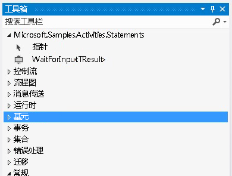

# 等待输入活动Wait For Input Activity
此示例演示如何在工作流中创建命名书签。This sample demonstrates how to create named bookmarks in a workflow. [!INCLUDE[wf](../../../../includes/wf-md.md)] 没有提供用于创建声明性书签的活动。 does not provide an activity for declarative bookmark creation. 因此，当您需要在工作流中创建书签时，必须编写一个创建书签的自定义活动。Therefore, when you want to create a bookmark in your workflow, you must write a custom activity that creates it. 此示例中定义的 `WaitForInput` 活动提供了此项功能，以便用户可以通过声明方式在工作流内创建书签。The `WaitForInput` activity defined in this sample provides this functionality, so that users can create bookmarks declaratively within a workflow.  
  
## 此示例中的项目Projects in this sample  
  
|**项目名称****Project Name**|**描述****Description**|**主要文件****Main Files**|  
|-|-|-|  
|WaitForInputWaitForInput|包含 `WaitForInput` 活动及其设计器Contains `WaitForInput` activity and its designer|WaitForInput.csWaitForInput.cs   `WaitForInput` 活动定义。`WaitForInput` activity definition.|  
|||WaitForInputDesigner.xamlWaitForInputDesigner.xaml   `WaitForInput` 活动的自定义设计器。Custom designer for the `WaitForInput` activity.|  
|||TypeToFirstGenericArgumentConverter.csTypeToFirstGenericArgumentConverter.cs   用于更新设计器中活动的泛型类型的 WPF 类型转换器。WPF type converter used to update the generic type of the activity in the designer.|  
|WaitForInputTestClientWaitForInputTestClient|示例客户端应用程序，它可通过工作流设计器使用一些 WaitForInput 活动来配置和运行工作流。Sample client application that configures and runs a workflow using several WaitForInput activities using the workflow designer.|Sequence1.xamlSequence1.xaml   使用 `WaitForInput` 活动的顺序工作流。A sequential workflow that uses the `WaitForInput` activity.|  
|||Program.csProgram.cs   运行在 Sequence1.xaml 中定义的工作流的实例。Runs an instance of the workflow defined in Sequence1.xaml.|  
  
## WaitForInput 活动WaitForInput Activity  
 `WaitForInput` 活动在工作流中创建一个命名书签。The `WaitForInput` activity creates a named bookmark in a workflow. 该书签等待一个信号，然后接收它的所配置的类型的数据。The bookmark waits for a signal and receives data of its configured type. 当书签恢复之后，将可以通过 `Result` 属性使用传入到工作流中的数据。After the bookmark is resumed the data passed into the workflow is available through the `Result` property.  
  
 `WaitForInput` 活动派生自 <xref:System.Activities.NativeActivity> 类，因为它必须创建只能通过 <xref:System.Activities.NativeActivityContext> 类访问的书签。The `WaitForInput` activity derives from the <xref:System.Activities.NativeActivity> class because it must create bookmarks, which are only accessible through the <xref:System.Activities.NativeActivityContext> class.  
  
 该活动应用了三个特性，分别用于绑定设计器、添加可更新的泛型参数功能以及将默认泛型类型设置为 string。The activity has three attributes applied to it for binding a designer, adding the generic argument feature that can be updated, and setting the default generic type to string. 该活动还具有下表中列出的自变量。The activity also has the arguments  listed in the following table.  
  
|**Name****Name**|**类型****Type**|**描述****Description**|  
|-|-|-|  
|TResultTResult|泛型参数 (TResult)Generic argument (TResult)|书签的类型。Type of the bookmark. 这是在书签恢复时要传给书签的数据的类型。This is the type of the data to be passed to the bookmark when resumed.|  
|BookmarkNameBookmarkName|InArgument\<字符串 >InArgument\<string>|书签的名称。Name of the bookmark.|  
|结果Result|InArgument\<TResult >InArgument\<TResult>|书签恢复时要传递到活动的数据。Data passed to the activity when the bookmark is resumed.|  
  
## WaitForInput 活动设计器WaitForInput activity designer  
 `WaitForInput` 活动设计器在 WaitForInputDesigner.xaml 文件中实现。The `WaitForInput` activity designer is implemented in the WaitForInputDesigner.xaml file. `WaitForInput` 活动及其设计器包含在同一个程序集中。The `WaitForInput` activity and its designer are included in the same assembly. 下图显示了工具箱中与程序集具有相同名称的类别中的 `WaitForInput` 活动。The following graphic shows the `WaitForInput` activity in the toolbox within a category that has the same name as the assembly.  
  
   
  
 下图显示了 `WaitForInput` 设计器。The following graphic shows the `WaitForInput` designer. 因为 `WaitForInput` 活动是最基本的，所以设计器允许在设计器图面上直接设置它的所有参数。Because, the `WaitForInput` activity is very basic, the designer allows setting all its arguments directly in the designer surface.  
  
   
  
#### 使用此示例To use this sample  
  
1.  使用 [!INCLUDE[vs2010](../../../../includes/vs2010-md.md)] 打开 WaitForInput.sln 文件。Using [!INCLUDE[vs2010](../../../../includes/vs2010-md.md)], open the WaitForInput.sln file.  
  
2.  要生成解决方案，按 Ctrl+Shift+B。To build the solution, press CTRL+SHIFT+B.  
  
3.  若要启用示例而不进行调试，请按 Ctrl+F5。To start the sample without debugging, press CTRL+F5.  
  
> [!IMPORTANT]
>  您的计算机上可能已安装这些示例。The samples may already be installed on your machine. 在继续操作之前，请先检查以下（默认）目录：Check for the following (default) directory before continuing.  
>   
>  `<InstallDrive>:\WF_WCF_Samples`  
>   
>  如果此目录不存在，请访问 [针对 .NET Framework 4 的 Windows Communication Foundation (WCF) 和 Windows Workflow Foundation (WF) 示例](http://go.microsoft.com/fwlink/?LinkId=150780) 以下载所有 [!INCLUDE[indigo1](../../../../includes/indigo1-md.md)] 和 [!INCLUDE[wf1](../../../../includes/wf1-md.md)] 示例。If this directory does not exist, go to [Windows Communication Foundation (WCF) and Windows Workflow Foundation (WF) Samples for .NET Framework 4](http://go.microsoft.com/fwlink/?LinkId=150780) to download all [!INCLUDE[indigo1](../../../../includes/indigo1-md.md)] and [!INCLUDE[wf1](../../../../includes/wf1-md.md)] samples. 此示例位于以下目录：This sample is located in the following directory.  
>   
>  `<InstallDrive>:\WF_WCF_Samples\WF\Scenario\ActivityLibrary\WaitForInput`  
  
## 另请参阅See Also
