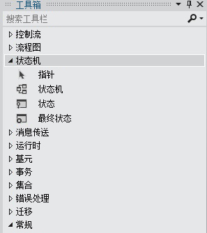

# 状态机工作流
状态机是用于开发程序的已知范例。<xref:System.Activities.Statements.StateMachine> 与 <xref:System.Activities.Statements.State> 和 <xref:System.Activities.Statements.Transition> 以及其他的活动均可用于生成状态机工作流程序。本主题提供了创建状态机工作流的概述。  
  
## 状态机工作流概述  
 状态机工作流提供建模类型，使用该类型可以以对事件驱动的方式对您的工作流进行建模。<xref:System.Activities.Statements.StateMachine> 活动包含状态和组成的状态机逻辑的转换，可以在活动可以使用的任何地方使用。 状态机运行时有若干类：  
  
-   <xref:System.Activities.Statements.StateMachine>  
  
-   <xref:System.Activities.Statements.State>  
  
-   <xref:System.Activities.Statements.Transition>  
  
 若要创建状态机工作流，状态将被添加到 <xref:System.Activities.Statements.StateMachine> 活动，并且将使用转换控制状态间的流。 以下从 [入门教程](../../../docs/framework/windows-workflow-foundation//getting-started-tutorial.md) 步骤到 [如何：创建状态机工作流](../../../docs/framework/windows-workflow-foundation//how-to-create-a-state-machine-workflow.md) 的屏幕快照，显示了具有三个状态和三个转换的状态机工作流。**“初始化目标”**是初始状态，表示工作流中的第一个状态。这是由从指定**“启动”**节点导致的线所指定的。工作流中的最终状态被命名为 **FinalState**，表示工作流完成的时间点。  
  
   
  
 状态机工作流必须有且只有一个初始状态，并且至少有一个最终的状态。每个状态不是最终状态，但必须至少具有一个转换。以下各节包括创建和配置状态和转换。  
  
## 创建和配置状态  
 <xref:System.Activities.Statements.State> 表示状态机可具有的状态。要将 <xref:System.Activities.Statements.State> 添加到工作流，请将**“状态”**活动设计器从**“工具箱”**的**“状态机”**部分拖到 [!INCLUDE[wfd1](../../../includes/wfd1-md.md)] 图面上的<xref:System.Activities.Statements.StateMachine> 活动。  
  
   
  
 若要将状态配置为**“初始状态”**，请右键单击状态，然后选择**“设置为初始状态”**。此外，如果无当前初始状态，初始状态可以通过将线从工作流顶部的**“启动”**节点拖到所需的状态的线来指定。当 <xref:System.Activities.Statements.StateMachine> 活动拖放到工作流设计器时，它预配置了名为**“State1”**的初始状态。状态机工作流必须有且只有一个初始状态。  
  
 表示状态机中的终止状态的状态称为最终状态。最终状态是其将 <xref:System.Activities.Statements.State.IsFinal%2A> 属性集设置为 `true` 的状态，无 <xref:System.Activities.Statements.State.Exit%2A> 活动和也没有始于它的转换。 若要将最终状态添加到工作流，请将**“FinalState”**活动设计器从**“工具箱”**的**“状态机”**部分拖到 [!INCLUDE[wfd1](../../../includes/wfd1-md.md)] 图面上的 <xref:System.Activities.Statements.StateMachine> 活动。  状态机工作流必须至少有一个最终状态。  
  
### 配置条目和退出操作  
 状态可以有 <xref:System.Activities.Statements.State.Entry%2A> 和 <xref:System.Activities.Statements.State.Exit%2A> 操作。 （配置为最终状态的状态可能只有一个输入操作）。当工作流实例输入状态时，将执行输入操作中的任何活动。输入操作完成时，将安排状态转换的触发器。 当向另一状态的转换完成时，即使该状态转换返回到相同状态，也将执行退出操作中的活动。退出操作完成后，执行转换操作中的活动，然后转给新的状态，并将安排其输入操作。  
  
> [!NOTE]
>  当调试状态机工作流，可以将断点放置在根状态机活动上和状态机工作流中的状态。断点不能直接放在转换上, 但它们可以放在包含在状态和转换中的任何活动上。  
  
## 创建和配置转换  
 所有状态必须均具有至少一个转换，除了不可能具有任何转换的最终状态。状态添加到状态机工作流后可能添加转换，或者他们可以在状态放置时进行创建。  
  
 若要在一个步骤中添加 <xref:System.Activities.Statements.State> 和创建转换，请将**“状态”**活动从**“工具箱”**的**“状态机”**部分拖动，并将鼠标悬停在工作流设计器中的另一状态上。当在另一 <xref:System.Activities.Statements.State> 上拖动了 <xref:System.Activities.Statements.State> 时，四个三角形会出现在 <xref:System.Activities.Statements.State> 周围。如果 <xref:System.Activities.Statements.State> 拖动到其中四个三角形之一，则其将添加到状态机，而且转换将从源 <xref:System.Activities.Statements.State> 创建到放置目标 <xref:System.Activities.Statements.State>。有关更多信息，请参见 [事务活动设计器](../Topic/Transition%20Activity%20Designer.md)。  
  
 若要在状态添加后创建转换，有两种方法。第一个方法就是将状态从工作流设计器图面进行拖动，将鼠标悬停在现有状态并将其放置在其中一个放置点上。这种方法非常类似于上一节中描述的方法。您也可以将鼠标悬停在所需的源状态上，并将线拖到所需的目标状态。  
  
> [!NOTE]
>  状态机中的单个状态使用工作流设计器可以创建多达 76 种转换。对在设计器外创建的工作流中的状态转换的限制只受系统资源限制。  
  
 转型期可以具有 <xref:System.Activities.Statements.Transition.Trigger%2A>、<xref:System.Activities.Statements.Transition.Condition%2A> 和 <xref:System.Activities.Statements.Transition.Action%2A>。在转换源状态的 <xref:System.Activities.Statements.State.Entry%2A> 操作完成时安排转换的 <xref:System.Activities.Statements.Transition.Trigger%2A>。 通常，<xref:System.Activities.Statements.Transition.Trigger%2A> 是一种等待某种类型的事件发生的活动，但它可以是任何活动或没有活动。一旦 <xref:System.Activities.Statements.Transition.Trigger%2A> 活动完成，如果存在，将对 <xref:System.Activities.Statements.Transition.Condition%2A> 进行计算。如果没有 <xref:System.Activities.Statements.Transition.Trigger%2A> 活动，那么立即对 <xref:System.Activities.Statements.Transition.Condition%2A> 进行计算。如果条件计算结果为 `false`，取消转换，而<xref:System.Activities.Statements.Transition.Trigger%2A> 所有在此状态的活动将重新安排。如果有将相同源状态作为当前转换而共享的其他转换，则那些 <xref:System.Activities.Statements.Transition.Trigger%2A> 操作被取消和重新安排。如果 <xref:System.Activities.Statements.Transition.Condition%2A> 的计算结果为 `true`，或有没有条件，那么将执行源状态的 <xref:System.Activities.Statements.State.Exit%2A> 操作，然后执行转换的 <xref:System.Activities.Statements.Transition.Action%2A>。当 <xref:System.Activities.Statements.Transition.Action%2A> 完成后，控件将传递给**“目标”**状态  
  
 共享常见触发器的转换称为共享的触发器转换。共享触发器转换组中的每个转换均具有同一触发器，但 <xref:System.Activities.Statements.Transition.Condition%2A> 和操作是唯一的。若要将其他操作添加到转换和创建共享转换，请单击圆圈，以指示所需转换的开始，并将它拖动到所需的状态。新转换将以初始转换的形式共享同一触发器，但它将具有一个唯一的条件和操作。也可以通过单击转换设计器底部的**“添加共享的触发器转换”**，再选择**“连接的可用状态”**下列表中的所需目标状态，在转换设计器中创建共享转换。  
  
> [!NOTE]
>  注意，如果转换的 <xref:System.Activities.Statements.Transition.Condition%2A> 计算结果为 `False`（或所有的共享触发转换的计算结果为 `False`），转换将不发生并且此状态下的所有转换的所有触发将被重新计划。  
  
 有关创建状态机工作流的更多信息，请参见 [如何：创建状态机工作流](../../../docs/framework/windows-workflow-foundation//how-to-create-a-state-machine-workflow.md)、[StateMachine 活动设计器](../Topic/StateMachine%20Activity%20Designer.md), [状态活动设计器](../Topic/State%20Activity%20Designer.md)、[FinalState 活动设计器](../Topic/FinalState%20Activity%20Designer.md) 以及 [事务活动设计器](../Topic/Transition%20Activity%20Designer.md)。  
  
## 状态机术语  
 本节定义本主题中使用的状态机词汇。  
  
 State  
 组成状态机的基本单位。任何特定时间状态都可处于一个状态。  
  
 输入操作  
 输入状态时执行的活动  
  
 退出操作  
 退出状态时执行的活动  
  
 转换  
 两个状态间的定向关系，表示状态机对特定类型事件的出现的完整响应。  
  
 共享的转换  
 与一个或多个转换共享源状态和触发器的转换，但状态和操作是唯一的。  
  
 触发器  
 导致转换发生的触发活动。  
  
 条件  
 触发器出现后，约束的计算结果必须为 `true`，以便转换完成。  
  
 转换操作  
 执行特定转换时执行的活动。  
  
 条件转换  
 具有显式条件的转换。  
  
 自行转换  
 从状态转换到它本身的转换。  
  
 初始状态  
 表示状态机起始点的状态。  
  
 最终状态  
 表示状态机完成的状态。  
  
## 请参阅  
 [如何：创建状态机工作流](../../../docs/framework/windows-workflow-foundation//how-to-create-a-state-machine-workflow.md)   
 [StateMachine 活动设计器](../Topic/StateMachine%20Activity%20Designer.md)   
 [状态活动设计器](../Topic/State%20Activity%20Designer.md)   
 [FinalState 活动设计器](../Topic/FinalState%20Activity%20Designer.md)   
 [事务活动设计器](../Topic/Transition%20Activity%20Designer.md)