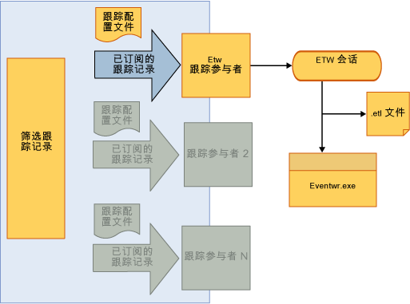

# <a name="tracking-participants"></a>跟踪参与者
跟踪参与者是扩展点，允许工作流开发人员访问 <xref:System.Activities.Tracking.InteropTrackingRecord.TrackingRecord%2A> 对象并对其进行处理。 [!INCLUDE[netfx_current_long](../../../includes/netfx-current-long-md.md)] 包括一个标准跟踪参与者，可将跟踪记录作为 Windows 事件跟踪 (ETW) 事件写入。 如果这不能满足您的要求，您还可以编写自定义跟踪参与者。  
  
## <a name="tracking-participants"></a>跟踪参与者  
 跟踪基础结构允许对传出跟踪记录应用筛选器，以便参与者可订阅该记录的子集。 应用筛选器的机制是通过跟踪配置文件来实现的。  
  
 中的 Windows Workflow Foundation (WF)[!INCLUDE[netfx_current_short](../../../includes/netfx-current-short-md.md)]提供跟踪参与者的跟踪记录写入 ETW 会话。 通过在配置文件中添加特定于跟踪的行为，可以对工作流服务配置参与者。 通过启用 ETW 跟踪参与者，可以在事件查看器中查看跟踪记录。 基于 ETW 的跟踪的 SDK 示例是一种很好的方法，可使用基于 ETW 的跟踪参与者来熟悉 WF 跟踪。  
  
## <a name="etw-tracking-participant"></a>ETW 跟踪参与者  
 [!INCLUDE[netfx_current_short](../../../includes/netfx-current-short-md.md)] 包括一个 ETW 跟踪参与者，可将跟踪记录写入 ETW 会话。 它的实现方式非常高效，对应用程序的性能或对服务器的吞吐量影响非常小。 使用标准 ETW 跟踪参与者的一个优点是，它接收的跟踪记录可以在 Windows 事件查看器中与其他应用程序日志及系统日志一起查看。  
  
 在 Web.config 文件中配置标准 ETW 跟踪参与者，如下例所示。  
  
```xml  
<configuration>  
  <system.web>  
    <compilation debug="true" targetFramework="4.0" />  
  </system.web>  
  <system.serviceModel>  
    <behaviors>  
      <serviceBehaviors>  
        <behavior>  
          <etwTracking profileName="Sample Tracking Profile"/>  
        </behavior>  
      </serviceBehaviors>  
    </behaviors>  
   <tracking>  
      <profiles>  
        <trackingProfile name="Sample Tracking Profile">  
        ….  
       </trackingProfile>  
      </profiles>  
    </tracking>  
  </system.serviceModel>  
</configuration>  
```  
  
> [!NOTE]
>  如果未指定 `trackingProfile` 名称，例如只使用 `<etwTracking/>` 或 `<etwTracking profileName=""/>`，则使用 Machine.config 文件中随 [!INCLUDE[netfx_current_short](../../../includes/netfx-current-short-md.md)] 安装的默认跟踪配置文件。  
  
 在 Machine.config 文件中，默认跟踪配置文件订阅工作流实例记录和错误。  
  
 在 ETW 中，事件通过提供程序 ID 写入 ETW 会话中。 ETW 跟踪参与者用于将跟踪记录写入 ETW 的提供程序 ID 在 Web.config 文件的 diagnostics 节（`<system.serviceModel><diagnostics>` 下）中定义。 默认情况下，未指定提供程序 ID 时，ETW 跟踪参与者使用默认提供程序 ID，如下例所示。  
  
```xml  
<system.serviceModel>  
        <diagnostics etwProviderId="52A3165D-4AD9-405C-B1E8-7D9A257EAC9F" />  
```  
  
 下图显示了通过 ETW 跟踪参与者的跟踪数据流。 跟踪数据到达 ETW 会话后，可以采用多种方法进行访问。 访问这些事件最有用的方法之一是通过事件查看器，这是一个常用的 Windows 工具，用于查看来自应用程序和服务的日志和跟踪。  
  
   
  
## <a name="tracking-participant-event-data"></a>跟踪参与者事件数据  
 跟踪参与者将跟踪的事件数据序列化为 ETW 会话，格式为每个跟踪记录一个事件。  标识事件所使用的 ID 在从 100 到 199 的范围内。 有关跟踪事件的定义记录发出的跟踪参与者，请参阅[跟踪事件参考](../../../docs/framework/windows-workflow-foundation/tracking-events-reference.md)主题。  
  
 ETW 事件的大小受到 ETW 缓冲区大小或 ETW 事件最大负载的限制，以二者中较小的值为限。 如果事件的大小超出其中任何一个 ETW 限制，则事件将被截断，其内容将以任意方式移除。 不可有选择性地移除变量、参数、批注和自定义数据。 发生截断时，所有这些内容都将被截断，无论导致事件大小超出 ETW 限制的是哪个值。  移除的数据用 `<item>..<item>` 代替。  
  
 变量、 参数中的复杂类型和自定义数据项都序列化为 ETW 事件记录使用[NetDataContractSerializer 类](https://go.microsoft.com/fwlink/?LinkId=177537)。 此类在序列化的 XML 流中包括 CLR 类型的信息。  
  
 由于 ETW 限制而截断负载数据可导致向同一 ETW 会话发送重复的跟踪记录。 如果多个会话在侦听事件，而且这些会话对事件有不同的负载限制，则会发生上述情况。  
  
 对于具有较低限制的会话，可能会截断事件。 ETW 跟踪参与者不知道侦听事件的会话的数量；如果某个会话截断了一个事件，则 ETW 参与者会重新尝试发送一次该事件。 在这种情况下，配置为可接受较大负载大小的会话将获取该事件两次（未截断的和已截断的事件）。 通过将所有 ETW 会话配置为具有相同的缓冲区大小限制，即可防止重复的情况。  
  
## <a name="accessing-tracking-data-from-an-etw-participant-in-the-event-viewer"></a>在事件查看器中访问 ETW 跟踪参与者的跟踪数据  
 由 ETW 跟踪参与者写入 ETW 会话的事件可通过事件查看器进行访问（用于使用默认提供程序 ID 时）。 这可以快速查看工作流已发出的跟踪记录。  
  
> [!NOTE]
>  向 ETW 会话发出的跟踪记录事件使用从 100 到 199 范围内的事件 ID。  
  
#### <a name="to-enable-viewing-the-tracking-records-in-event-viewer"></a>启用在事件查看器中查看跟踪记录  
  
1.  启动事件查看器 (EVENTVWR.EXE)  
  
2.  选择**事件查看器、 应用程序和服务日志 Microsoft，Windows，应用程序服务器-应用程序**。  
  
3.  右击并确保**视图，显示分析和调试日志**处于选中状态。 如果未选中，请选中它以使选中标记显示在它旁边。 这将显示**Analytic**，**性能**，并**调试**日志。  
  
4.  右键单击**Analytic**日志，然后选择**启用日志**。 该日志将存在于 %SystemRoot%\System32\Winevt\Logs\Microsoft-Windows-Application Server-Applications%4Analytic.etl 文件中。  
  
## <a name="custom-tracking-participant"></a>自定义跟踪参与者  
 跟踪参与者 API 允许以用户提供的跟踪参与者扩展跟踪运行时，该用户提供的跟踪参与者可包括用于对工作流运行时发出的跟踪记录进行处理的自定义逻辑。 若要编写自定义跟踪参与者，开发人员必须对 `Track` 类实现 <xref:System.Activities.Tracking.TrackingParticipant> 方法。 此方法在工作流运行时发出跟踪记录时调用。  
  
 跟踪参与者从 <xref:System.Activities.Tracking.TrackingParticipant> 类派生。 系统提供的 <xref:System.Activities.Tracking.EtwTrackingParticipant> 为每个收到的跟踪记录发出一个 Windows 事件跟踪 (ETW) 事件。 若要创建自定义跟踪参与者，应创建从 <xref:System.Activities.Tracking.TrackingParticipant> 派生的类。 若要提供基本跟踪功能，应重写 <xref:System.Activities.Tracking.TrackingParticipant.Track%2A>。 <xref:System.Activities.Tracking.TrackingParticipant.Track%2A> 在运行时发出跟踪记录时调用，并可按所需的方式进行处理。 在以下示例中，定义了自定义跟踪参与者类，该类将所有跟踪记录发到控制台窗口。 还可以实现一个 <xref:System.Activities.Tracking.TrackingParticipant> 对象，该对象使用其 `BeginTrack` 和 `EndTrack` 方法异步处理跟踪记录。  
  
```csharp  
class ConsoleTrackingParticipant : TrackingParticipant  
{  
    protected override void Track(TrackingRecord record, TimeSpan timeout)  
    {  
        if (record != null)  
        {  
            Console.WriteLine("=================================");  
            Console.WriteLine(record);  
        }  
    }  
}  
```  
  
 若要使用特定跟踪参与者，应将其注册到要跟踪的工作流实例，如下例所示。  
  
```csharp  
myInstance.Extensions.Add(new ConsoleTrackingParticipant());  
```  
  
 在以下示例中，创建了一个由包含 <xref:System.Activities.Statements.Sequence> 活动的 <xref:System.Activities.Statements.WriteLine> 活动组成的工作流。 向扩展添加 `ConsoleTrackingParticipant` 并调用工作流。  
  
```csharp  
Activity activity= new Sequence()  
{  
    Activities =  
    {  
        new WriteLine()  
        {  
            Text = "Hello World."  
        }  
    }  
};  
  
WorkflowApplication instance = new WorkflowApplication(activity);  
  
instance.Extensions.Add(new ConsoleTrackingParticipant());  
  instance.Completed = delegate(WorkflowApplicationCompletedEventArgs e)  
            {  
                Console.WriteLine("workflow instance completed, Id = " + instance.Id);  
                resetEvent.Set();  
            };  
            instance.Run();  
            Console.ReadLine();  
```  
  
## <a name="see-also"></a>请参阅  
 [Windows Server App Fabric 监视](https://go.microsoft.com/fwlink/?LinkId=201273)  
 [使用 App Fabric 监视应用程序](https://go.microsoft.com/fwlink/?LinkId=201275)
