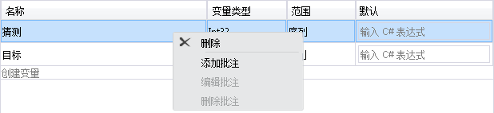
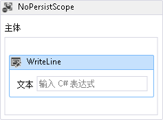
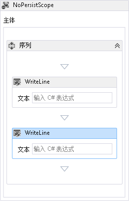
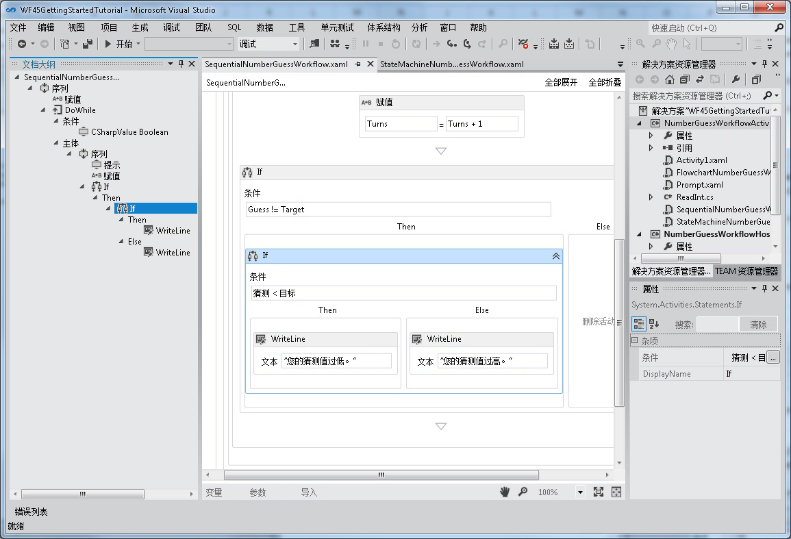
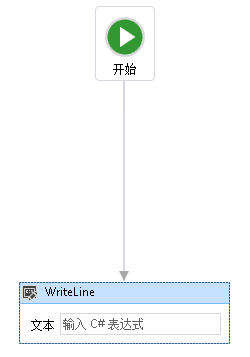
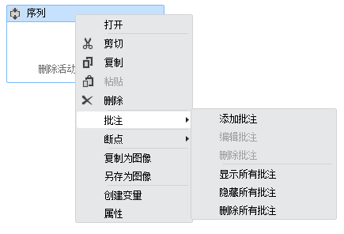
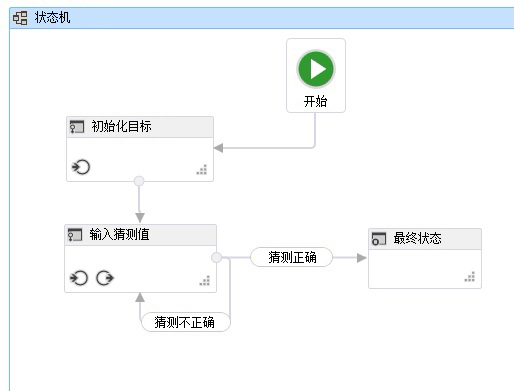

# <a name="whats-new-in-windows-workflow-foundation-in-net-45"></a><span data-ttu-id="71efa-102">.NET 4.5 中的 Windows Workflow Foundation 中的新增功能</span><span class="sxs-lookup"><span data-stu-id="71efa-102">What's New in Windows Workflow Foundation in .NET 4.5</span></span>

<span data-ttu-id="71efa-103">中的 Windows Workflow Foundation (WF)[!INCLUDE[net_v45](../../../includes/net-v45-md.md)]引入了许多新功能，如新活动、 设计器功能和工作流开发模型。</span><span class="sxs-lookup"><span data-stu-id="71efa-103">Windows Workflow Foundation (WF) in [!INCLUDE[net_v45](../../../includes/net-v45-md.md)] introduces many new features, such as new activities, designer capabilities, and workflow development models.</span></span> <span data-ttu-id="71efa-104">重新承载的工作流设计器支持 [!INCLUDE[net_v45](../../../includes/net-v45-md.md)] 中引入的许多（但不是全部）新工作流功能。</span><span class="sxs-lookup"><span data-stu-id="71efa-104">Many, but not all, of the new workflow features introduced in [!INCLUDE[net_v45](../../../includes/net-v45-md.md)] are supported in the re-hosted workflow designer.</span></span> <span data-ttu-id="71efa-105">有关支持的新功能的详细信息，请参阅[重新承载工作流设计器中新 Workflow Foundation 4.5 功能的支持](wf-features-in-the-rehosted-workflow-designer.md)。</span><span class="sxs-lookup"><span data-stu-id="71efa-105">For more information about the new features that are supported, see [Support for New Workflow Foundation 4.5 Features in the Rehosted Workflow Designer](wf-features-in-the-rehosted-workflow-designer.md).</span></span> <span data-ttu-id="71efa-106">有关迁移.NET 3.0 和.NET 3.5 工作流应用程序以使用最新版本的详细信息，请参阅[迁移指南](migration-guidance.md)。</span><span class="sxs-lookup"><span data-stu-id="71efa-106">For more information about migrating .NET 3.0 and .NET 3.5 workflow applications to use the latest version, see [Migration Guidance](migration-guidance.md).</span></span> <span data-ttu-id="71efa-107">本主题概述了 [!INCLUDE[net_v45](../../../includes/net-v45-md.md)] 中引入的新工作流功能。</span><span class="sxs-lookup"><span data-stu-id="71efa-107">This topic provides an overview of the new workflow features introduced in [!INCLUDE[net_v45](../../../includes/net-v45-md.md)].</span></span>

> [!WARNING]
> <span data-ttu-id="71efa-108">中引入的新 Windows Workflow Foundation 功能[!INCLUDE[net_v45](../../../includes/net-v45-md.md)]对于面向以前版本的 framework 的项目不可用。</span><span class="sxs-lookup"><span data-stu-id="71efa-108">The new Windows Workflow Foundation features introduced in [!INCLUDE[net_v45](../../../includes/net-v45-md.md)] are not available for projects that target previous versions of the framework.</span></span> <span data-ttu-id="71efa-109">如果面向 [!INCLUDE[net_v45](../../../includes/net-v45-md.md)] 的项目重新面向以前版本的框架，则可能会发生多个问题。</span><span class="sxs-lookup"><span data-stu-id="71efa-109">If a project that targets [!INCLUDE[net_v45](../../../includes/net-v45-md.md)] is re-targeted to a previous version of the framework, several issues can occur.</span></span>
>
> - <span data-ttu-id="71efa-110">C# 表达式将替换为在设计器中的消息**值在 XAML 中设置**。</span><span class="sxs-lookup"><span data-stu-id="71efa-110">C# expressions will be replaced in the designer with the message **Value was set in XAML**.</span></span>
> - <span data-ttu-id="71efa-111">将发生许多生成错误，包括以下错误。</span><span class="sxs-lookup"><span data-stu-id="71efa-111">Many build errors will occur, including the following error.</span></span>
>
> <span data-ttu-id="71efa-112">**文件格式不是与当前目标框架兼容的。若要转换文件格式，请显式保存文件。保存该文件并重新打开设计器之后，此错误消息将消失。**</span><span class="sxs-lookup"><span data-stu-id="71efa-112">**The file format is not compatible with current targeting framework. To convert the file format, please explicitly save the file. This error message will go away after you save the file and reopen the designer.**</span></span>

## <a name="BKMK_Versioning"></a> <span data-ttu-id="71efa-113">工作流版本控制</span><span class="sxs-lookup"><span data-stu-id="71efa-113">Workflow Versioning</span></span>

[!INCLUDE[net_v45](../../../includes/net-v45-md.md)] <span data-ttu-id="71efa-114">引入了几个基于新的 <xref:System.Activities.WorkflowIdentity> 类的工作流版本控制功能。</span><span class="sxs-lookup"><span data-stu-id="71efa-114">introduced several new versioning features based around the new <xref:System.Activities.WorkflowIdentity> class.</span></span> <span data-ttu-id="71efa-115"><xref:System.Activities.WorkflowIdentity> 为工作流应用程序提供了一种通过定义来映射持久化工作流实例的机制。</span><span class="sxs-lookup"><span data-stu-id="71efa-115"><xref:System.Activities.WorkflowIdentity> provides workflow application authors a mechanism for mapping a persisted workflow instance with its definition.</span></span>

- <span data-ttu-id="71efa-116">使用 <xref:System.Activities.WorkflowApplication> 承载的开发人员可以使用 <xref:System.Activities.WorkflowIdentity> 来启用并行承载多个版本的工作流。</span><span class="sxs-lookup"><span data-stu-id="71efa-116">Developers using <xref:System.Activities.WorkflowApplication> hosting can use <xref:System.Activities.WorkflowIdentity> to enable hosting multiple versions of a workflow side-by-side.</span></span> <span data-ttu-id="71efa-117">可以使用新的 <xref:System.Activities.WorkflowApplicationInstance> 类来加载持久化工作流实例，然后，主机可以使用 <xref:System.Activities.WorkflowApplicationInstance.DefinitionIdentity%2A> 在实例化 <xref:System.Activities.WorkflowApplication> 时提供工作流定义的正确版本。</span><span class="sxs-lookup"><span data-stu-id="71efa-117">Persisted workflow instances can be loaded using the new <xref:System.Activities.WorkflowApplicationInstance> class, and then the <xref:System.Activities.WorkflowApplicationInstance.DefinitionIdentity%2A> can be used by the host to provide the correct version of the workflow definition when instantiating the <xref:System.Activities.WorkflowApplication>.</span></span> <span data-ttu-id="71efa-118">有关详细信息，请参阅[使用 WorkflowIdentity 和版本控制](using-workflowidentity-and-versioning.md)和[如何：承载多个版本的工作流的并排方案](how-to-host-multiple-versions-of-a-workflow-side-by-side.md)。</span><span class="sxs-lookup"><span data-stu-id="71efa-118">For more information, see [Using WorkflowIdentity and Versioning](using-workflowidentity-and-versioning.md) and [How to: Host Multiple Versions of a Workflow Side-by-Side](how-to-host-multiple-versions-of-a-workflow-side-by-side.md).</span></span>

- <span data-ttu-id="71efa-119"><xref:System.ServiceModel.WorkflowServiceHost> 现在是多版本主机。</span><span class="sxs-lookup"><span data-stu-id="71efa-119"><xref:System.ServiceModel.WorkflowServiceHost> is now a multi-version host.</span></span> <span data-ttu-id="71efa-120">在部署工作流服务的新版本时，将使用新的服务创建新实例，但会使用以前的版本来完成现有实例。</span><span class="sxs-lookup"><span data-stu-id="71efa-120">When a new version of a workflow service is deployed, new instances are created using the new service, but existing instances complete using the previous version.</span></span> <span data-ttu-id="71efa-121">有关详细信息，请参阅[WorkflowServiceHost 中的并行版本控制](../wcf/feature-details/side-by-side-versioning-in-workflowservicehost.md)。</span><span class="sxs-lookup"><span data-stu-id="71efa-121">For more information, see [Side by Side Versioning in WorkflowServiceHost](../wcf/feature-details/side-by-side-versioning-in-workflowservicehost.md).</span></span>

- <span data-ttu-id="71efa-122">引入了动态更新，其提供了一种更新持久化工作流实例定义的机制。</span><span class="sxs-lookup"><span data-stu-id="71efa-122">Dynamic update is introduced which provides a mechanism for updating the definition of a persisted workflow instance.</span></span> <span data-ttu-id="71efa-123">有关详细信息，请参阅[动态更新](dynamic-update.md)和[如何：更新正在运行的工作流实例的定义](how-to-update-the-definition-of-a-running-workflow-instance.md)。</span><span class="sxs-lookup"><span data-stu-id="71efa-123">For more information, see [Dynamic Update](dynamic-update.md) and [How to: Update the Definition of a Running Workflow Instance](how-to-update-the-definition-of-a-running-workflow-instance.md).</span></span>

- <span data-ttu-id="71efa-124">SqlWorkflowInstanceStoreSchemaUpgrade.sql 数据库脚本旨在用于升级使用 [!INCLUDE[netfx40_short](../../../includes/netfx40-short-md.md)] 数据库脚本创建的持久性数据库。</span><span class="sxs-lookup"><span data-stu-id="71efa-124">A SqlWorkflowInstanceStoreSchemaUpgrade.sql database script is provided to upgrade persistence databases created using the [!INCLUDE[netfx40_short](../../../includes/netfx40-short-md.md)] database scripts.</span></span> <span data-ttu-id="71efa-125">此脚本会更新 [!INCLUDE[netfx40_short](../../../includes/netfx40-short-md.md)] 持久性数据库以支持 [!INCLUDE[net_v45](../../../includes/net-v45-md.md)] 中引入的版本控制功能。</span><span class="sxs-lookup"><span data-stu-id="71efa-125">This script updates [!INCLUDE[netfx40_short](../../../includes/netfx40-short-md.md)] persistence databases to support the new versioning capabilities introduced in [!INCLUDE[net_v45](../../../includes/net-v45-md.md)].</span></span> <span data-ttu-id="71efa-126">数据库中的持久化工作流实例将获得默认的版本控制值，然后就可以参与并行执行和动态更新。</span><span class="sxs-lookup"><span data-stu-id="71efa-126">The persisted workflow instances in the database are given default versioning values, and can participate in side-by-side execution and dynamic update.</span></span> <span data-ttu-id="71efa-127">有关详细信息，请参阅[升级.NET Framework 4 持久性数据库支持工作流版本控制](using-workflowidentity-and-versioning.md#UpdatingWF4PersistenceDatabases)。</span><span class="sxs-lookup"><span data-stu-id="71efa-127">For more information, see [Upgrading .NET Framework 4 Persistence Databases to Support Workflow Versioning](using-workflowidentity-and-versioning.md#UpdatingWF4PersistenceDatabases).</span></span>

## <a name="BKMK_NewActivities"></a> <span data-ttu-id="71efa-128">活动</span><span class="sxs-lookup"><span data-stu-id="71efa-128">Activities</span></span>

<span data-ttu-id="71efa-129">内置活动库包含新活动和现有活动的新功能。</span><span class="sxs-lookup"><span data-stu-id="71efa-129">The built-in activity library contains new activities and new features for existing activities.</span></span>

### <a name="BKMK_NoPersistScope"></a> <span data-ttu-id="71efa-130">NoPersist 范围</span><span class="sxs-lookup"><span data-stu-id="71efa-130">NoPersist Scope</span></span>

<span data-ttu-id="71efa-131"><xref:System.Activities.Statements.NoPersistScope> 是一个在执行 NoPersistScope 的子活动时防止工作流持久保存的新容器活动。</span><span class="sxs-lookup"><span data-stu-id="71efa-131"><xref:System.Activities.Statements.NoPersistScope> is a new container activity that prevents a workflow from being persisted when the NoPersistScope’s child activities are executing.</span></span> <span data-ttu-id="71efa-132">此活动在工作流不适合持久保存的方案中十分有用，例如，当工作流使用计算机特定资源（如文件句柄）时或在执行数据库事务期间。</span><span class="sxs-lookup"><span data-stu-id="71efa-132">This is useful in scenarios where it is not appropriate for the workflow to be persisted, such as when the workflow is using machine-specific resources such as file handles, or during database transactions.</span></span> <span data-ttu-id="71efa-133">以前，为防止在活动执行期间出现持久性，需要一个使用 <xref:System.Activities.NativeActivity> 的自定义 <xref:System.Activities.NoPersistHandle>。</span><span class="sxs-lookup"><span data-stu-id="71efa-133">Previously, to prevent persistence from occurring during an activity's execution, a custom <xref:System.Activities.NativeActivity> that used a <xref:System.Activities.NoPersistHandle> was required.</span></span>

### <a name="BKMK_NewFlowchartCapabilities"></a> <span data-ttu-id="71efa-134">新流程图功能</span><span class="sxs-lookup"><span data-stu-id="71efa-134">New Flowchart Capabilities</span></span>

<span data-ttu-id="71efa-135">流程图将针对 [!INCLUDE[net_v45](../../../includes/net-v45-md.md)] 进行更新，并具有以下新功能：</span><span class="sxs-lookup"><span data-stu-id="71efa-135">Flowcharts are updated for [!INCLUDE[net_v45](../../../includes/net-v45-md.md)] and have the following new capabilities:</span></span>

- <span data-ttu-id="71efa-136">`DisplayName` 或 <xref:System.Activities.Statements.FlowSwitch%601> 活动的 <xref:System.Activities.Statements.FlowDecision> 属性是可编辑的。</span><span class="sxs-lookup"><span data-stu-id="71efa-136">The `DisplayName` property of a <xref:System.Activities.Statements.FlowSwitch%601> or <xref:System.Activities.Statements.FlowDecision> activity is editable.</span></span> <span data-ttu-id="71efa-137">这样，活动设计器就可以显示有关该活动的用途的详细信息。</span><span class="sxs-lookup"><span data-stu-id="71efa-137">This will let the activity designer show more information about the activity's purpose.</span></span>

- <span data-ttu-id="71efa-138">流程图具有一个名为 <xref:System.Activities.Statements.Flowchart.ValidateUnconnectedNodes%2A> 的新属性；此属性的默认值为 `False`。</span><span class="sxs-lookup"><span data-stu-id="71efa-138">Flowcharts have a new property called <xref:System.Activities.Statements.Flowchart.ValidateUnconnectedNodes%2A>; the default for this property is `False`.</span></span> <span data-ttu-id="71efa-139">如果此属性设置为 `True`，则未连接的流程图节点将产生验证错误。</span><span class="sxs-lookup"><span data-stu-id="71efa-139">If this property is set to `True`, then unconnected flowchart nodes will produce validation errors.</span></span>

## <a name="support-for-partial-trust"></a><span data-ttu-id="71efa-140">支持部分信任</span><span class="sxs-lookup"><span data-stu-id="71efa-140">Support for Partial Trust</span></span>

<span data-ttu-id="71efa-141">在 [!INCLUDE[netfx40_long](../../../includes/netfx40-long-md.md)] 中的工作流需要完全信任的应用程序域。</span><span class="sxs-lookup"><span data-stu-id="71efa-141">Workflows in [!INCLUDE[netfx40_long](../../../includes/netfx40-long-md.md)] required a fully trusted application domain.</span></span> <span data-ttu-id="71efa-142">在 [!INCLUDE[net_v45](../../../includes/net-v45-md.md)] 中，工作流可以在部分信任环境中运行。</span><span class="sxs-lookup"><span data-stu-id="71efa-142">In [!INCLUDE[net_v45](../../../includes/net-v45-md.md)], workflows can operate in a partial trust environment.</span></span> <span data-ttu-id="71efa-143">在部分信任环境中，可以使用第三方组件而无需为其授予主机资源的完全访问权限。</span><span class="sxs-lookup"><span data-stu-id="71efa-143">In a partial trust environment, third-party components can be used without granting them full access to the resources of the host.</span></span> <span data-ttu-id="71efa-144">关于在部分信任中运行的工作流，请注意以下几点：</span><span class="sxs-lookup"><span data-stu-id="71efa-144">Some concerns about running workflows in partial trust are as follows:</span></span>

1. <span data-ttu-id="71efa-145">在部分信任下，不支持使用 <xref:System.Activities.Statements.Interop> 活动中包含的旧组件（包括规则）。</span><span class="sxs-lookup"><span data-stu-id="71efa-145">Using legacy components (including Rules) contained in the <xref:System.Activities.Statements.Interop> activity is not supported under partial trust.</span></span>

2. <span data-ttu-id="71efa-146">不支持 <xref:System.ServiceModel.WorkflowServiceHost> 中在部分信任下运行的工作流。</span><span class="sxs-lookup"><span data-stu-id="71efa-146">Running workflows in partial trust in <xref:System.ServiceModel.WorkflowServiceHost> is not supported.</span></span>

3. <span data-ttu-id="71efa-147">在部分信任方案中持久保留异常是一种潜在安全威胁。</span><span class="sxs-lookup"><span data-stu-id="71efa-147">Persisting exceptions in a partial-trust scenario is a potential security threat.</span></span> <span data-ttu-id="71efa-148">若要禁用异常的持久保留，必须将扩展类型 <xref:System.Activities.ExceptionPersistenceExtension> 添加至项目，以便取消持久化异常。</span><span class="sxs-lookup"><span data-stu-id="71efa-148">To disable persisting of exceptions, an extension of type <xref:System.Activities.ExceptionPersistenceExtension> must be added to the project in order to opt out of persisting exceptions.</span></span> <span data-ttu-id="71efa-149">下面的代码示例演示如何实现此类型。</span><span class="sxs-lookup"><span data-stu-id="71efa-149">The following code example demonstrates how to implement this type.</span></span>

    ```csharp
    public class ExceptionPersistenceExtension
    {
        public ExceptionPersistenceExtension()
        {
            this.PersistExceptions = false;
        }
        public bool PersistExceptions { get; set; }
    }
    ```

     <span data-ttu-id="71efa-150">如果无需对异常进行序列化，请确保在 <xref:System.Activities.Statements.NoPersistScope> 内使用异常。</span><span class="sxs-lookup"><span data-stu-id="71efa-150">If exceptions are not to be serialized, ensure that exceptions are used within a <xref:System.Activities.Statements.NoPersistScope>.</span></span>

4. <span data-ttu-id="71efa-151">活动作者应重写 <xref:System.Activities.Activity.CacheMetadata%2A> 以避免让工作流运行时针对该类型自动执行反射。</span><span class="sxs-lookup"><span data-stu-id="71efa-151">Activity authors should override <xref:System.Activities.Activity.CacheMetadata%2A> to avoid having the workflow runtime automatically execute reflection against the type.</span></span> <span data-ttu-id="71efa-152">参数和子活动必须为非 null，并且 <xref:System.Activities.ActivityMetadata.Bind%2A> 必须被显式调用。</span><span class="sxs-lookup"><span data-stu-id="71efa-152">Arguments and child activities must be non-null, and <xref:System.Activities.ActivityMetadata.Bind%2A> must be called explicitly.</span></span> <span data-ttu-id="71efa-153">有关详细信息重写<xref:System.Activities.Activity.CacheMetadata%2A>，请参阅[使用 CacheMetadata 公开数据](exposing-data-with-cachemetadata.md)。</span><span class="sxs-lookup"><span data-stu-id="71efa-153">For more information on overriding <xref:System.Activities.Activity.CacheMetadata%2A>, see [Exposing data with CacheMetadata](exposing-data-with-cachemetadata.md).</span></span> <span data-ttu-id="71efa-154">此外，实例的参数类型不是`internal`或**专用**必须显式创建于<xref:System.Activities.Activity.CacheMetadata%2A>以避免由反射创建。</span><span class="sxs-lookup"><span data-stu-id="71efa-154">Also, instances of arguments that are of a type that is `internal` or **private** must be explicitly created in  <xref:System.Activities.Activity.CacheMetadata%2A> to avoid being created by reflection.</span></span>

5. <span data-ttu-id="71efa-155">这些类型不会使用 <xref:System.Runtime.Serialization.ISerializable> 或 <xref:System.SerializableAttribute> 来进行序列化；要进行序列化的类型必须支持 <xref:System.Runtime.Serialization.DataContractSerializer>。</span><span class="sxs-lookup"><span data-stu-id="71efa-155">Types will not use <xref:System.Runtime.Serialization.ISerializable> or <xref:System.SerializableAttribute> for serialization; types that are to be serialized must support <xref:System.Runtime.Serialization.DataContractSerializer>.</span></span>

6. <span data-ttu-id="71efa-156">使用 <xref:System.Activities.Expressions.LambdaValue%601> 的表达式需要 <xref:System.Security.Permissions.ReflectionPermissionAttribute.RestrictedMemberAccess%2A>，因此不能在部分信任下使用。</span><span class="sxs-lookup"><span data-stu-id="71efa-156">Expressions that use <xref:System.Activities.Expressions.LambdaValue%601> require <xref:System.Security.Permissions.ReflectionPermissionAttribute.RestrictedMemberAccess%2A>, and thus will not work under partial trust.</span></span> <span data-ttu-id="71efa-157">使用 <xref:System.Activities.Expressions.LambdaValue%601> 的工作流应将这些表达式替换为派生自 <xref:System.Activities.CodeActivity%601> 的活动。</span><span class="sxs-lookup"><span data-stu-id="71efa-157">Workflows that use <xref:System.Activities.Expressions.LambdaValue%601> should replace those expressions with activities that derive from <xref:System.Activities.CodeActivity%601>.</span></span> <span data-ttu-id="71efa-158">.</span><span class="sxs-lookup"><span data-stu-id="71efa-158">.</span></span>

7. <span data-ttu-id="71efa-159">在部分信任下，不能使用 <xref:System.Activities.XamlIntegration.TextExpressionCompiler> 或 Visual Basic 承载的编译器来编译表达式，但是可以运行以前编译的表达式。</span><span class="sxs-lookup"><span data-stu-id="71efa-159">Expressions cannot be compiled using <xref:System.Activities.XamlIntegration.TextExpressionCompiler> or the Visual Basic hosted compiler in partial trust, but previously compiled expressions can be run.</span></span>

8. <span data-ttu-id="71efa-160">使用的单个程序集[2 级透明度](https://aka.ms/Level2Transparency)不能用于[!INCLUDE[netfx40_short](../../../includes/netfx40-short-md.md)]，[!INCLUDE[netfx_current_short](../../../includes/netfx-current-short-md.md)]以完全信任和[!INCLUDE[netfx_current_short](../../../includes/netfx-current-short-md.md)]在部分信任环境中。</span><span class="sxs-lookup"><span data-stu-id="71efa-160">A single assembly that uses [Level 2 Transparency](https://aka.ms/Level2Transparency) cannot be used in [!INCLUDE[netfx40_short](../../../includes/netfx40-short-md.md)], [!INCLUDE[netfx_current_short](../../../includes/netfx-current-short-md.md)] in full trust, and [!INCLUDE[netfx_current_short](../../../includes/netfx-current-short-md.md)] in partial trust.</span></span>

## <a name="BKMK_NewDesignerCapabilites"></a> <span data-ttu-id="71efa-161">新设计器功能</span><span class="sxs-lookup"><span data-stu-id="71efa-161">New Designer Capabilities</span></span>

### <a name="BKMK_DesignerSearch"></a> <span data-ttu-id="71efa-162">设计器搜索</span><span class="sxs-lookup"><span data-stu-id="71efa-162">Designer Search</span></span>

<span data-ttu-id="71efa-163">为了使较大的工作流程更易于管理，现在可以按关键字来搜索工作流。</span><span class="sxs-lookup"><span data-stu-id="71efa-163">To make larger workflows more manageable, workflows can now be searched by keyword.</span></span> <span data-ttu-id="71efa-164">此功能目前仅在 Visual Studio 中;此功能不是重新承载设计器中可用。</span><span class="sxs-lookup"><span data-stu-id="71efa-164">This feature is only available in Visual Studio; this feature is not available in a rehosted designer.</span></span> <span data-ttu-id="71efa-165">提供了两种搜索：</span><span class="sxs-lookup"><span data-stu-id="71efa-165">There are two kinds of searches available:</span></span>

- <span data-ttu-id="71efa-166">快速查找，使用发起**Ctrl + F**或**编辑**，**查找和替换**，**快速查找**。</span><span class="sxs-lookup"><span data-stu-id="71efa-166">Quick Find, initiated with either **Ctrl+F** or **Edit**, **Find and Replace**, **Quick Find**.</span></span>

- <span data-ttu-id="71efa-167">在文件中，查找与发起**Ctrl + Shift + F**或**编辑**，**查找和替换**，**在文件中查找**。</span><span class="sxs-lookup"><span data-stu-id="71efa-167">Find in Files, initiated with either **Ctrl+Shift+F** or **Edit**, **Find and Replace**, **Find in Files**.</span></span>

<span data-ttu-id="71efa-168">请注意，不支持替换。</span><span class="sxs-lookup"><span data-stu-id="71efa-168">Note that Replace is not supported.</span></span>

#### <a name="BKMK_QuickFind"></a> <span data-ttu-id="71efa-169">快速查找</span><span class="sxs-lookup"><span data-stu-id="71efa-169">Quick Find</span></span>

<span data-ttu-id="71efa-170">在工作流中搜索的关键字将匹配下列设计器项：</span><span class="sxs-lookup"><span data-stu-id="71efa-170">Keywords searched in workflows will match the following designer items:</span></span>

- <span data-ttu-id="71efa-171"><xref:System.Activities.Activity> 对象、<xref:System.Activities.Statements.FlowNode> 对象、<xref:System.Activities.Statements.State> 对象、<xref:System.Activities.Statements.Transition> 对象以及其他自定义流控制项的属性。</span><span class="sxs-lookup"><span data-stu-id="71efa-171">Properties of <xref:System.Activities.Activity> objects, <xref:System.Activities.Statements.FlowNode> objects, <xref:System.Activities.Statements.State> objects, <xref:System.Activities.Statements.Transition> objects, and other custom flow-control items.</span></span>

- <span data-ttu-id="71efa-172">变量</span><span class="sxs-lookup"><span data-stu-id="71efa-172">Variables</span></span>

- <span data-ttu-id="71efa-173">自变量</span><span class="sxs-lookup"><span data-stu-id="71efa-173">Arguments</span></span>

- <span data-ttu-id="71efa-174">表达式</span><span class="sxs-lookup"><span data-stu-id="71efa-174">Expressions</span></span>

<span data-ttu-id="71efa-175">在设计器上的 <xref:System.Activities.Presentation.Model.ModelItem> 树上执行快速查找。</span><span class="sxs-lookup"><span data-stu-id="71efa-175">Quick Find is performed on the designer's <xref:System.Activities.Presentation.Model.ModelItem> tree.</span></span> <span data-ttu-id="71efa-176">快速查找不会查找在工作流定义中导入的命名空间。</span><span class="sxs-lookup"><span data-stu-id="71efa-176">Quick Find will not locate namespaces imported in the workflow definition.</span></span>

#### <a name="BKMK_FindInFiles"></a> <span data-ttu-id="71efa-177">在文件中查找</span><span class="sxs-lookup"><span data-stu-id="71efa-177">Find in Files</span></span>

<span data-ttu-id="71efa-178">在工作流中搜索的关键字将匹配工作流文件的实际内容。</span><span class="sxs-lookup"><span data-stu-id="71efa-178">Keywords searched in workflows will match the actual content of the workflow files.</span></span> <span data-ttu-id="71efa-179">搜索结果将显示在 Visual Studio 查找结果视图窗格中。</span><span class="sxs-lookup"><span data-stu-id="71efa-179">The search results will be shown in Visual Studio Find Results view pane.</span></span> <span data-ttu-id="71efa-180">双击结果项将会定位到包含工作流设计器中的匹配项的活动。</span><span class="sxs-lookup"><span data-stu-id="71efa-180">Double-clicking the result item will navigate to the activity which contains the match in workflow designer.</span></span>

### <a name="BKMK_VariableDeleteContextMenu"></a> <span data-ttu-id="71efa-181">删除变量和自变量设计器中的上下文菜单项</span><span class="sxs-lookup"><span data-stu-id="71efa-181">Delete context menu item in variable and argument designer</span></span>

<span data-ttu-id="71efa-182">在 [!INCLUDE[netfx40_short](../../../includes/netfx40-short-md.md)] 中，只能使用键盘来删除设计器中的变量和自变量。</span><span class="sxs-lookup"><span data-stu-id="71efa-182">In [!INCLUDE[netfx40_short](../../../includes/netfx40-short-md.md)], variables and arguments could only be deleted in the designer using the keyboard.</span></span> <span data-ttu-id="71efa-183">从 [!INCLUDE[net_v45](../../../includes/net-v45-md.md)] 开始，可以使用上下文菜单来删除变量和自变量。</span><span class="sxs-lookup"><span data-stu-id="71efa-183">Starting with [!INCLUDE[net_v45](../../../includes/net-v45-md.md)], variables and arguments can be deleted using the context menu.</span></span>

<span data-ttu-id="71efa-184">以下屏幕快照显示了变量和自变量设计器的上下文菜单。</span><span class="sxs-lookup"><span data-stu-id="71efa-184">The following screenshot shows the variable and argument designer context menu.</span></span>

<span data-ttu-id="71efa-185"></span><span class="sxs-lookup"><span data-stu-id="71efa-185"></span></span>

### <a name="BKMK_AutoSurround"></a> <span data-ttu-id="71efa-186">自动环绕序列</span><span class="sxs-lookup"><span data-stu-id="71efa-186">Auto-surround with Sequence</span></span>

<span data-ttu-id="71efa-187">由于工作流或特定容器活动（如 <xref:System.Activities.Statements.NoPersistScope>）只能包含单个主体活动，因此添加第二个活动需要开发人员删除第一个活动，请添加一个 <xref:System.Activities.Statements.Sequence> 活动，然后将两个活动都添加到该顺序活动中。</span><span class="sxs-lookup"><span data-stu-id="71efa-187">Since a workflow or certain container activities (such as <xref:System.Activities.Statements.NoPersistScope>) can only contain a single body activity, adding a second activity required the developer to delete the first activity, add a <xref:System.Activities.Statements.Sequence> activity, and then add both activities to the sequence activity.</span></span> <span data-ttu-id="71efa-188">从 [!INCLUDE[net_v45](../../../includes/net-v45-md.md)] 开始，向设计器图面添加第二个活动时，将会自动创建 `Sequence` 活动以包装两个活动。</span><span class="sxs-lookup"><span data-stu-id="71efa-188">Starting with [!INCLUDE[net_v45](../../../includes/net-v45-md.md)], when adding a second activity to the designer surface, a `Sequence` activity will be automatically created to wrap both activities.</span></span>

<span data-ttu-id="71efa-189">以下屏幕快照显示了 `WriteLine` 的 `Body` 中的 `NoPersistScope` 活动。</span><span class="sxs-lookup"><span data-stu-id="71efa-189">The following screenshot shows a `WriteLine` activity in the `Body` of a `NoPersistScope`.</span></span>

<span data-ttu-id="71efa-190"></span><span class="sxs-lookup"><span data-stu-id="71efa-190"></span></span>

<span data-ttu-id="71efa-191">以下屏幕快照显示了在第一个 `Sequence` 下面丢弃第二个时在 `Body` 中自动创建的 `WriteLine` 活动。</span><span class="sxs-lookup"><span data-stu-id="71efa-191">The following screenshot shows the automatically created `Sequence` activity in the `Body` when a second `WriteLine` is dropped below the first.</span></span>

<span data-ttu-id="71efa-192"></span><span class="sxs-lookup"><span data-stu-id="71efa-192"></span></span>

### <a name="BKMK_PanMode"></a> <span data-ttu-id="71efa-193">平移模式</span><span class="sxs-lookup"><span data-stu-id="71efa-193">Pan Mode</span></span>

<span data-ttu-id="71efa-194">若要更轻松地在设计器中浏览大型工作流，可以启用平移模式；通过此模式，开发人员可以单击并拖动工作流的可见部分将其移动，而无需使用滚动条。</span><span class="sxs-lookup"><span data-stu-id="71efa-194">To more easily navigate a large workflow in the designer, pan mode can be enabled, allowing the developer to click and drag to move the visible portion of the workflow, rather than needing to use the scroll bars.</span></span> <span data-ttu-id="71efa-195">用于激活平移模式的按钮位于设计器的右下角。</span><span class="sxs-lookup"><span data-stu-id="71efa-195">The button to activate pan mode is in the lower right corner of the designer.</span></span>

<span data-ttu-id="71efa-196">下面的屏幕快照显示了位于工作流设计器右下角的平移按钮。</span><span class="sxs-lookup"><span data-stu-id="71efa-196">The following screenshot shows the pan button which is located at the bottom right corner of the workflow designer.</span></span>

<span data-ttu-id="71efa-197"></span><span class="sxs-lookup"><span data-stu-id="71efa-197"></span></span>

<span data-ttu-id="71efa-198">也可以使用鼠标中键或空格键来平移工作流设计器。</span><span class="sxs-lookup"><span data-stu-id="71efa-198">The middle mouse button or space bar can also be used to pan the workflow designer.</span></span>

### <a name="BKMK_MultiSelect"></a> <span data-ttu-id="71efa-199">多重选择</span><span class="sxs-lookup"><span data-stu-id="71efa-199">Multi-select</span></span>

<span data-ttu-id="71efa-200">通过拖动围绕活动的矩形（未启用平移模式时）或通过按住 Ctrl 键并逐一单击所需的活动，可以一次选择多个活动。</span><span class="sxs-lookup"><span data-stu-id="71efa-200">Multiple activities can be selected at one time, either by dragging a rectangle around them (when pan mode is not enabled), or by holding down Ctrl and click the desired activities one by one.</span></span>

<span data-ttu-id="71efa-201">也可以在设计器中拖动并放置多个选择的活动，并使用上下文菜单与这些活动交互。</span><span class="sxs-lookup"><span data-stu-id="71efa-201">Multiple activity selections can also be dragged and dropped within the designer, and can also be interacted with using the context menu.</span></span>

### <a name="BKMK_DocumentOutline"></a> <span data-ttu-id="71efa-202">大纲视图的工作流项</span><span class="sxs-lookup"><span data-stu-id="71efa-202">Outline view of workflow items</span></span>

<span data-ttu-id="71efa-203">为了更加方便地浏览分层工作流，工作流的组件显示在树样式的大纲视图中。</span><span class="sxs-lookup"><span data-stu-id="71efa-203">In order to make hierarchical workflows easier to navigate, components of a workflow are shown in a tree-style outline view.</span></span> <span data-ttu-id="71efa-204">大纲视图将显示在**文档大纲**视图。</span><span class="sxs-lookup"><span data-stu-id="71efa-204">The outline view is displayed in the **Document Outline** view.</span></span> <span data-ttu-id="71efa-205">若要打开此视图中，从顶部菜单中，选择**视图**，**其他 Windows**，**文档大纲**，或按 Ctrl W、 u。</span><span class="sxs-lookup"><span data-stu-id="71efa-205">To open this view, from the top menu, select **View**, **Other Windows**, **Document Outline**, or press Ctrl W,U.</span></span> <span data-ttu-id="71efa-206">单击大纲视图中的节点将会定位到工作流设计器中的相应活动，并且该大纲视图将会更新以显示在设计器中选择的活动。</span><span class="sxs-lookup"><span data-stu-id="71efa-206">Clicking on a node in outline view will navigate to the corresponding activity in the workflow designer, and the outline view will be updated to show activities that are selected in the designer.</span></span>

<span data-ttu-id="71efa-207">以下屏幕截图中的已完成工作流[入门教程](getting-started-tutorial.md)显示大纲视图中的，顺序工作流。</span><span class="sxs-lookup"><span data-stu-id="71efa-207">The following screenshot of the completed workflow from the [Getting Started Tutorial](getting-started-tutorial.md) shows the outline view with a sequential workflow.</span></span>

<span data-ttu-id="71efa-208"></span><span class="sxs-lookup"><span data-stu-id="71efa-208"></span></span>

### <a name="BKMK_CSharpExpressions"></a> <span data-ttu-id="71efa-209">C# 表达式</span><span class="sxs-lookup"><span data-stu-id="71efa-209">C# Expressions</span></span>

<span data-ttu-id="71efa-210">在 [!INCLUDE[net_v45](../../../includes/net-v45-md.md)] 之前，工作流中的所有表达式只能用 Visual Basic 来编写。</span><span class="sxs-lookup"><span data-stu-id="71efa-210">Prior to [!INCLUDE[net_v45](../../../includes/net-v45-md.md)], all expressions in workflows could only be written in Visual Basic.</span></span> <span data-ttu-id="71efa-211">在 [!INCLUDE[net_v45](../../../includes/net-v45-md.md)] 中，Visual Basic 表达式仅用于使用 Visual Basic 创建的项目。</span><span class="sxs-lookup"><span data-stu-id="71efa-211">In [!INCLUDE[net_v45](../../../includes/net-v45-md.md)], Visual Basic expressions are only used for projects created using Visual Basic.</span></span> <span data-ttu-id="71efa-212">Visual C# 项目现在将 C# 用于表达式。</span><span class="sxs-lookup"><span data-stu-id="71efa-212">Visual C# projects now use C# for expressions.</span></span> <span data-ttu-id="71efa-213">提供了功能完全的 C# 表达式编辑器，包括语法突出显示和 Intellisense 等功能。</span><span class="sxs-lookup"><span data-stu-id="71efa-213">A fully functional C# expression editor is provided which capabilities such as grammar highlighting and intellisense.</span></span> <span data-ttu-id="71efa-214">在使用 Visual Basic 表达式的以前版本中创建的 C# 工作流项目仍可继续使用。</span><span class="sxs-lookup"><span data-stu-id="71efa-214">C# workflow projects created in previous versions that use Visual Basic expressions will continue to work.</span></span>

<span data-ttu-id="71efa-215">将在设计时对 C# 表达式进行验证。</span><span class="sxs-lookup"><span data-stu-id="71efa-215">C# expressions are validated at design-time.</span></span> <span data-ttu-id="71efa-216">C# 表达式中的错误将标有红色波浪形下划线。</span><span class="sxs-lookup"><span data-stu-id="71efa-216">Errors in C# expressions will be marked with a red wavy underline.</span></span>

<span data-ttu-id="71efa-217">有关 C# 表达式的详细信息，请参阅[C# 表达式](csharp-expressions.md)。</span><span class="sxs-lookup"><span data-stu-id="71efa-217">For more information about C# expressions, see [C# Expressions](csharp-expressions.md).</span></span>

### <a name="BKMK_Visibility"></a> <span data-ttu-id="71efa-218">Shell 栏和标头的可见性的更多控制项</span><span class="sxs-lookup"><span data-stu-id="71efa-218">More control of visibility of shell bar and header items</span></span>

<span data-ttu-id="71efa-219">在重新承载的设计器中，某些标准 UI 控件可能对于给定的工作流没有意义，并可能已关闭。</span><span class="sxs-lookup"><span data-stu-id="71efa-219">In a rehosted designer, some of the standard UI controls may not have meaning for a given workflow, and may be turned off.</span></span> <span data-ttu-id="71efa-220">在 [!INCLUDE[netfx40_short](../../../includes/netfx40-short-md.md)] 中，此自定义仅受设计器底部的 shell 栏支持。</span><span class="sxs-lookup"><span data-stu-id="71efa-220">In [!INCLUDE[netfx40_short](../../../includes/netfx40-short-md.md)], this customization is only supported by the shell bar at the bottom of the designer.</span></span> <span data-ttu-id="71efa-221">在 [!INCLUDE[net_v45](../../../includes/net-v45-md.md)] 中，可通过用合适的 <xref:System.Activities.Presentation.View.DesignerView.WorkflowShellHeaderItemsVisibility%2A> 值设置 <xref:System.Activities.Presentation.View.ShellHeaderItemsVisibility> 来调整设计器顶部 shell 标头项的可见性。</span><span class="sxs-lookup"><span data-stu-id="71efa-221">In [!INCLUDE[net_v45](../../../includes/net-v45-md.md)], the visibility of shell header items at the top of the designer can be adjusted by setting <xref:System.Activities.Presentation.View.DesignerView.WorkflowShellHeaderItemsVisibility%2A> with the appropriate <xref:System.Activities.Presentation.View.ShellHeaderItemsVisibility> value.</span></span>

### <a name="BKMK_AutoConnect"></a> <span data-ttu-id="71efa-222">自动连接和流程图和状态机工作流中的自动插入</span><span class="sxs-lookup"><span data-stu-id="71efa-222">Auto-connect and auto-insert in Flowchart and State Machine workflows</span></span>

<span data-ttu-id="71efa-223">在 [!INCLUDE[netfx40_short](../../../includes/netfx40-short-md.md)] 中，必须手动添加流程图工作流中节点之间的连接。</span><span class="sxs-lookup"><span data-stu-id="71efa-223">In [!INCLUDE[netfx40_short](../../../includes/netfx40-short-md.md)], connections between nodes in a Flowchart workflow had to be added manually.</span></span> <span data-ttu-id="71efa-224">在 [!INCLUDE[net_v45](../../../includes/net-v45-md.md)] 中，流程图和状态机节点具有自动连接点，这些自动连接点会在将一个活动从工具箱拖到设计器图面上时变为可见。</span><span class="sxs-lookup"><span data-stu-id="71efa-224">In [!INCLUDE[net_v45](../../../includes/net-v45-md.md)], Flowchart and State Machine nodes have auto-connect points that become visible when an activity is dragged from the toolbox onto the designer surface.</span></span> <span data-ttu-id="71efa-225">将活动放置在这些点中的一个点上会自动添加该活动以及必要的连接。</span><span class="sxs-lookup"><span data-stu-id="71efa-225">Dropping an activity on one of these points automatically adds the activity along with the necessary connection.</span></span>

<span data-ttu-id="71efa-226">下面的屏幕快照显示了从工具箱中拖动活动时变为可见的附属点。</span><span class="sxs-lookup"><span data-stu-id="71efa-226">The following screenshot shows the attachment points that become visible when an activity is dragged from the toolbox.</span></span>

<span data-ttu-id="71efa-227"></span><span class="sxs-lookup"><span data-stu-id="71efa-227"></span></span>

<span data-ttu-id="71efa-228">也可以将活动拖动到流程图节点和状态之间的连接上，以在两个其他节点之间自动插入该节点。</span><span class="sxs-lookup"><span data-stu-id="71efa-228">Activities can also be dragged onto connections between flowchart nodes and states to auto-insert the node between two other nodes.</span></span> <span data-ttu-id="71efa-229">以下屏幕快照显示了突出显示的连接线，可在此连接线处从工具箱拖动并放置活动。</span><span class="sxs-lookup"><span data-stu-id="71efa-229">The following screenshot shows the highlighted connecting line where activities can be dragged from the toolbox and dropped.</span></span>

<span data-ttu-id="71efa-230"></span><span class="sxs-lookup"><span data-stu-id="71efa-230"></span></span>

### <a name="BKMK_Annotations"></a> <span data-ttu-id="71efa-231">设计器批注</span><span class="sxs-lookup"><span data-stu-id="71efa-231">Designer Annotations</span></span>

<span data-ttu-id="71efa-232">为促进开发较大型的工作流，设计器现在支持添加批注以帮助跟踪设计过程。</span><span class="sxs-lookup"><span data-stu-id="71efa-232">To facilitate developing larger workflows, the designer now supports adding annotations to help keep track of the design process.</span></span> <span data-ttu-id="71efa-233">可以向活动、状态、流程图节点、变量和自变量添加批注。</span><span class="sxs-lookup"><span data-stu-id="71efa-233">Annotation can be added to activities, states, flowchart nodes, variables and arguments.</span></span> <span data-ttu-id="71efa-234">以下屏幕快照显示了用于将批注添加到设计器的上下文菜单。</span><span class="sxs-lookup"><span data-stu-id="71efa-234">The following screenshot shows the context menu used to add annotations to the designer.</span></span>

<span data-ttu-id="71efa-235"></span><span class="sxs-lookup"><span data-stu-id="71efa-235"></span></span>

### <a name="debugging-states"></a><span data-ttu-id="71efa-236">调试状态</span><span class="sxs-lookup"><span data-stu-id="71efa-236">Debugging states</span></span>

<span data-ttu-id="71efa-237">在 [!INCLUDE[netfx40_short](../../../includes/netfx40-short-md.md)] 中，非活动元素不支持调试断点，因为这些元素不是执行单位。</span><span class="sxs-lookup"><span data-stu-id="71efa-237">In [!INCLUDE[netfx40_short](../../../includes/netfx40-short-md.md)], non-activity elements could not support debug breakpoints since they were not units of execution.</span></span> <span data-ttu-id="71efa-238">此版本提供了一种向 <xref:System.Activities.Statements.State> 对象添加断点的机制。</span><span class="sxs-lookup"><span data-stu-id="71efa-238">This release provides a mechanism for adding breakpoints to <xref:System.Activities.Statements.State> objects.</span></span> <span data-ttu-id="71efa-239">若在 <xref:System.Activities.Statements.State> 上设置了断点，则执行将在计划了状态入口活动或触发器之前、状态发生转换时中断。</span><span class="sxs-lookup"><span data-stu-id="71efa-239">When a breakpoint is set on a <xref:System.Activities.Statements.State>, execution will break when the state is transitioned to, before its entry activities or triggers are scheduled.</span></span>

### <a name="BKMK_ActivityDelegates"></a> <span data-ttu-id="71efa-240">定义和使用 ActivityDelegate 对象在设计器</span><span class="sxs-lookup"><span data-stu-id="71efa-240">Define and consume ActivityDelegate objects in the designer</span></span>

<span data-ttu-id="71efa-241">[!INCLUDE[netfx40_short](../../../includes/netfx40-short-md.md)] 中的活动使用 <xref:System.Activities.ActivityDelegate> 对象来公开执行点，在这些执行点处，工作流的其他部分可与工作流的执行交互；但是，使用这些执行点通常需要数量相当大的代码。</span><span class="sxs-lookup"><span data-stu-id="71efa-241">Activities in [!INCLUDE[netfx40_short](../../../includes/netfx40-short-md.md)] used <xref:System.Activities.ActivityDelegate> objects to expose execution points where other parts of the workflow could interact with a workflow's execution, but using these execution points usually required a fair amount of code.</span></span> <span data-ttu-id="71efa-242">在此版本中，开发人员可以使用工作流设计器来定义和使用活动委托。</span><span class="sxs-lookup"><span data-stu-id="71efa-242">In this release, developers can define and consume activity delegates using the workflow designer.</span></span> <span data-ttu-id="71efa-243">有关详细信息，请参阅[如何：定义和使用工作流设计器中的活动委托](/visualstudio/workflow-designer/how-to-define-and-consume-activity-delegates-in-the-workflow-designer)。</span><span class="sxs-lookup"><span data-stu-id="71efa-243">For more information, see [How to: Define and consume activity delegates in the Workflow Designer](/visualstudio/workflow-designer/how-to-define-and-consume-activity-delegates-in-the-workflow-designer).</span></span>

### <a name="BKMK_BuildTimeValidation"></a> <span data-ttu-id="71efa-244">生成时验证</span><span class="sxs-lookup"><span data-stu-id="71efa-244">Build-time validation</span></span>

<span data-ttu-id="71efa-245">在 [!INCLUDE[netfx40_short](../../../includes/netfx40-short-md.md)] 中，不会将生成工作流项目期间的工作流验证错误计为生成错误。</span><span class="sxs-lookup"><span data-stu-id="71efa-245">In [!INCLUDE[netfx40_short](../../../includes/netfx40-short-md.md)], workflow validation errors weren’t counted as build errors during the build of a workflow project.</span></span> <span data-ttu-id="71efa-246">这意味着即使存在工作流验证错误，工作流项目的生成也可能成功。</span><span class="sxs-lookup"><span data-stu-id="71efa-246">This meant that building a workflow project could succeed even when there were workflow validation errors.</span></span> <span data-ttu-id="71efa-247">在 [!INCLUDE[net_v45](../../../includes/net-v45-md.md)] 中，工作流验证错误会导致生成失败。</span><span class="sxs-lookup"><span data-stu-id="71efa-247">In [!INCLUDE[net_v45](../../../includes/net-v45-md.md)], workflow validation errors cause the build to fail.</span></span>

### <a name="BKMK_DesignTimeValidation"></a> <span data-ttu-id="71efa-248">设计时后台验证</span><span class="sxs-lookup"><span data-stu-id="71efa-248">Design-time background validation</span></span>

<span data-ttu-id="71efa-249">在 [!INCLUDE[netfx40_short](../../../includes/netfx40-short-md.md)] 中，会把工作流作为前台进程进行验证，这可能会在复杂或耗时的验证过程中将 UI 挂起。</span><span class="sxs-lookup"><span data-stu-id="71efa-249">In [!INCLUDE[netfx40_short](../../../includes/netfx40-short-md.md)], workflows were validated as a foreground process, which could potentially hang the UI during complex or time-consuming validation processes.</span></span> <span data-ttu-id="71efa-250">工作流验证现在发生在后台线程上，因此不会阻止 UI。</span><span class="sxs-lookup"><span data-stu-id="71efa-250">Workflow validation now takes place on a background thread, so that the UI is not blocked.</span></span>

### <a name="BKMK_ViewState"></a> <span data-ttu-id="71efa-251">位于单独的位置在 XAML 文件中的视图状态</span><span class="sxs-lookup"><span data-stu-id="71efa-251">View state located in a separate location in XAML files</span></span>

<span data-ttu-id="71efa-252">在 [!INCLUDE[netfx40_short](../../../includes/netfx40-short-md.md)] 中，工作流的视图状态信息存储在 XAML 文件中的许多不同位置。</span><span class="sxs-lookup"><span data-stu-id="71efa-252">In [!INCLUDE[netfx40_short](../../../includes/netfx40-short-md.md)], the view state information for a workflow is stored across the XAML file in many different locations.</span></span> <span data-ttu-id="71efa-253">这对于想直接读取 XAML 或编写用于删除视图状态信息的代码的开发人员来说很不方便。</span><span class="sxs-lookup"><span data-stu-id="71efa-253">This is inconvenient for developers who want to read XAML directly, or write code to remove the view state information.</span></span> <span data-ttu-id="71efa-254">在[!INCLUDE[net_v45](../../../includes/net-v45-md.md)]，XAML 文件中的视图状态信息序列化为 XAML 文件中的单独元素。</span><span class="sxs-lookup"><span data-stu-id="71efa-254">In [!INCLUDE[net_v45](../../../includes/net-v45-md.md)], the view state information in the XAML file is serialized as a separate element in the XAML file.</span></span> <span data-ttu-id="71efa-255">开发人员可以轻松地查找和编辑活动，该活动的视图状态信息或完全删除的视图状态。</span><span class="sxs-lookup"><span data-stu-id="71efa-255">Developers can easily locate and edit the view state information of an activity, or remove the view state altogether.</span></span>

### <a name="BKMK_ExpressionExtensibility"></a> <span data-ttu-id="71efa-256">表达式扩展性</span><span class="sxs-lookup"><span data-stu-id="71efa-256">Expression extensibility</span></span>

<span data-ttu-id="71efa-257">在 [!INCLUDE[net_v45](../../../includes/net-v45-md.md)] 中，我们为开发人员提供了一种创建自己的表达式并可将表达式创作体验插入到工作流设计器中的方法。</span><span class="sxs-lookup"><span data-stu-id="71efa-257">In [!INCLUDE[net_v45](../../../includes/net-v45-md.md)], we provide a way for developers to create their own expression and expression authoring experience that can be plugged into the workflow designer.</span></span>

### <a name="BKMK_BackwardCompatRehostedDesigner"></a> <span data-ttu-id="71efa-258">参加有关重新承载设计器中 Workflow 4.5 功能</span><span class="sxs-lookup"><span data-stu-id="71efa-258">Opt-in for Workflow 4.5 features in rehosted designer</span></span>

<span data-ttu-id="71efa-259">为保留向后兼容性，默认情况下，包括在 [!INCLUDE[net_v45](../../../includes/net-v45-md.md)] 中的一些新功能不会在重新承载的设计器中启用。</span><span class="sxs-lookup"><span data-stu-id="71efa-259">To preserve backward compatibility, some new features included in [!INCLUDE[net_v45](../../../includes/net-v45-md.md)] are not enabled by default in the rehosted designer.</span></span> <span data-ttu-id="71efa-260">这是为了确保使用重新承载的设计器的现有应用程序不会由于更新至最新版本而中断。</span><span class="sxs-lookup"><span data-stu-id="71efa-260">This is to ensure that existing applications that use the rehosted designer are not broken by updating to the latest version.</span></span> <span data-ttu-id="71efa-261">若要启用重新承载的设计器中的新功能，可将 <xref:System.Activities.Presentation.DesignerConfigurationService.TargetFrameworkName%2A> 设置为“.NET Framework 4.5”，或设置 <xref:System.Activities.Presentation.DesignerConfigurationService> 的各成员以启用各个功能。</span><span class="sxs-lookup"><span data-stu-id="71efa-261">To enable new features in the rehosted designer, either set <xref:System.Activities.Presentation.DesignerConfigurationService.TargetFrameworkName%2A> to ".NET Framework 4.5", or set individual members of <xref:System.Activities.Presentation.DesignerConfigurationService> to enable individual features.</span></span>

## <a name="BKMK_NewWFModels"></a> <span data-ttu-id="71efa-262">新工作流开发模型</span><span class="sxs-lookup"><span data-stu-id="71efa-262">New Workflow Development Models</span></span>

<span data-ttu-id="71efa-263">除流程图和顺序工作流开发模型外，此版本还包括状态机工作流和协定优先工作流服务。</span><span class="sxs-lookup"><span data-stu-id="71efa-263">In addition to flowchart and sequential workflow development models, this release includes State Machine workflows, and contract-first workflow services.</span></span>

### <a name="BKMK_StateMachine"></a> <span data-ttu-id="71efa-264">状态机工作流</span><span class="sxs-lookup"><span data-stu-id="71efa-264">State machine workflows</span></span>

<span data-ttu-id="71efa-265">状态机工作流引入提升以.NET Framework 4，版本 4.0.1 的一部分[Microsoft.NET Framework 4 平台更新 1](https://go.microsoft.com/fwlink/?LinkID=215092)。</span><span class="sxs-lookup"><span data-stu-id="71efa-265">State machine workflows were introduced as part of the .NET Framework 4, version 4.0.1 in the [Microsoft .NET Framework 4 Platform Update 1](https://go.microsoft.com/fwlink/?LinkID=215092).</span></span> <span data-ttu-id="71efa-266">此更新包括多个新类和活动，允许开发人员创建状态机工作流。</span><span class="sxs-lookup"><span data-stu-id="71efa-266">This update included several new classes and activities which allowed developers to create state machine workflows.</span></span> <span data-ttu-id="71efa-267">这些类和活动已针对 [!INCLUDE[net_v45](../../../includes/net-v45-md.md)] 进行更新。</span><span class="sxs-lookup"><span data-stu-id="71efa-267">These classes and activities have been updated for [!INCLUDE[net_v45](../../../includes/net-v45-md.md)].</span></span> <span data-ttu-id="71efa-268">更新包括：</span><span class="sxs-lookup"><span data-stu-id="71efa-268">Updates include:</span></span>

1. <span data-ttu-id="71efa-269">能够对状态设置断点</span><span class="sxs-lookup"><span data-stu-id="71efa-269">The ability to set breakpoints on states</span></span>

2. <span data-ttu-id="71efa-270">能够在工作流设计器中复制和粘贴转换</span><span class="sxs-lookup"><span data-stu-id="71efa-270">The ability to copy and paste transitions in the workflow designer</span></span>

3. <span data-ttu-id="71efa-271">设计器支持共享触发器转换创建</span><span class="sxs-lookup"><span data-stu-id="71efa-271">Designer support for shared trigger transition creation</span></span>

4. <span data-ttu-id="71efa-272">用于创建状态机工作流的活动，包括：<xref:System.Activities.Statements.StateMachine>、<xref:System.Activities.Statements.State> 和 <xref:System.Activities.Statements.Transition></span><span class="sxs-lookup"><span data-stu-id="71efa-272">Activities used to create State Machine workflows, including: <xref:System.Activities.Statements.StateMachine>, <xref:System.Activities.Statements.State>, and <xref:System.Activities.Statements.Transition></span></span>

<span data-ttu-id="71efa-273">以下屏幕截图显示完成的状态机工作流从[入门教程](getting-started-tutorial.md)步骤[如何：创建状态机工作流](how-to-create-a-state-machine-workflow.md)。</span><span class="sxs-lookup"><span data-stu-id="71efa-273">The following screenshot shows the completed state machine workflow from the [Getting Started Tutorial](getting-started-tutorial.md) step [How to: Create a State Machine Workflow](how-to-create-a-state-machine-workflow.md).</span></span>

<span data-ttu-id="71efa-274"></span><span class="sxs-lookup"><span data-stu-id="71efa-274"></span></span>

<span data-ttu-id="71efa-275">有关创建状态机工作流的详细信息，请参阅[状态机工作流](state-machine-workflows.md)。</span><span class="sxs-lookup"><span data-stu-id="71efa-275">For more information on creating state machine workflows, see [State Machine Workflows](state-machine-workflows.md).</span></span>

### <a name="BKMK_ContractFirst"></a> <span data-ttu-id="71efa-276">协定优先工作流开发</span><span class="sxs-lookup"><span data-stu-id="71efa-276">Contract-first workflow development</span></span>

<span data-ttu-id="71efa-277">协定优先工作流开发工具，开发人员可设计为先，在代码中的协定，然后在 Visual Studio 中单击几下，自动生成的活动模板在工具箱中表示每个操作。</span><span class="sxs-lookup"><span data-stu-id="71efa-277">The contract-first workflow development tool allows the developer to design a contract in code first, then, with a few clicks in Visual Studio, automatically generate an activity template in the toolbox representing each operation.</span></span> <span data-ttu-id="71efa-278">这些活动随后用于创建实现由该协定定义的操作的工作流。</span><span class="sxs-lookup"><span data-stu-id="71efa-278">These activities are then used to create a workflow that implements the operations defined by the contract.</span></span> <span data-ttu-id="71efa-279">工作流设计器将对该工作流服务进行验证，以确保实现这些操作并且工作流的签名与协定签名匹配。</span><span class="sxs-lookup"><span data-stu-id="71efa-279">The workflow designer will validate the workflow service to ensure that these operations are implemented and the signature of the workflow matches the contract signature.</span></span> <span data-ttu-id="71efa-280">开发人员还可以将工作流服务与所实现的协定的集合进行关联。</span><span class="sxs-lookup"><span data-stu-id="71efa-280">The developer can also associate a workflow service with a collection of implemented contracts.</span></span> <span data-ttu-id="71efa-281">协定优先工作流服务开发的详细信息，请参阅[如何：创建使用现有服务协定的工作流服务](how-to-create-a-workflow-service-that-consumes-an-existing-service-contract.md)。</span><span class="sxs-lookup"><span data-stu-id="71efa-281">For more information on contract-first workflow service development, see [How to: Create a workflow service that consumes an existing service contract](how-to-create-a-workflow-service-that-consumes-an-existing-service-contract.md).</span></span>
