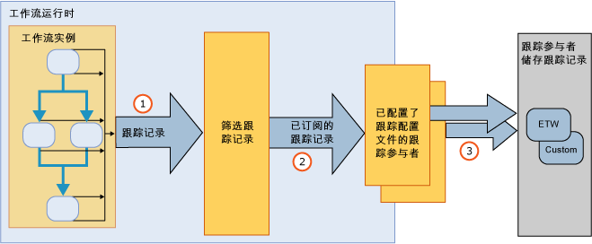

# 工作流跟踪Workflow Tracking and Tracing
Windows 工作流跟踪是专为查看工作流执行情况而设计的一个 [!INCLUDE[netfx_current_long](../../../includes/netfx-current-long-md.md)] 功能。Windows Workflow tracking is a [!INCLUDE[netfx_current_long](../../../includes/netfx-current-long-md.md)] feature designed to provide visibility into workflow execution. 它提供一个跟踪基础结构，用于跟踪工作流实例的执行。It provides a tracking infrastructure to track the execution of a workflow instance. WF 跟踪基础结构透明地检测工作流以发出反应执行期间关键事件的记录。The WF tracking infrastructure transparently instruments a workflow to emit records reflecting key events during the execution. 默认情况下，任何 [!INCLUDE[netfx_current_short](../../../includes/netfx-current-short-md.md)] 工作流都可以使用此功能。This functionality is available by default for any [!INCLUDE[netfx_current_short](../../../includes/netfx-current-short-md.md)] workflow. 不需要对 [!INCLUDE[netfx_current_long](../../../includes/netfx-current-long-md.md)]工作流进行任何更改即可进行跟踪。No changes are required to be made to a [!INCLUDE[netfx_current_long](../../../includes/netfx-current-long-md.md)] workflow for tracking to occur. 只需确定要接收的跟踪数据量。It is just a matter of deciding how much tracking data you want to receive. 工作流实例开始或完成之后，会发出其处理跟踪记录。When a workflow instance starts or completes, its processing tracking records are emitted. 跟踪还可以提取与工作流变量关联的相关业务数据。Tracking can also extract business-relevant data associated with the workflow variables. 例如，如果工作流表示一个订单处理系统，则可以提取 <xref:System.Activities.Tracking.TrackingRecord> 对象以及订单 ID。For example, if the workflow represents an order processing system, the order ID can be extracted along with the <xref:System.Activities.Tracking.TrackingRecord> object. 一般来讲，启用 WF 跟踪便于访问工作流执行的诊断数据或业务分析数据。In general, enabling WF tracking facilitates diagnostics or business analytics data to be accessed from a workflow execution.  
  
 这些跟踪组件相当于 [!INCLUDE[vstecwinfx](../../../includes/vstecwinfx-md.md)] 中的跟踪服务。These tracking components are equivalent to the tracking service in [!INCLUDE[vstecwinfx](../../../includes/vstecwinfx-md.md)]. 在 [!INCLUDE[netfx_current_short](../../../includes/netfx-current-short-md.md)] 中，WF 跟踪功能的性能已改进，其编程模型也已简化。In [!INCLUDE[netfx_current_short](../../../includes/netfx-current-short-md.md)], the performance has been improved and the programming model simplified for the WF tracking feature. 跟踪运行时会检测工作流实例以发出与工作流生命周期和工作流活动有关的事件以及自定义事件。The tracking runtime instruments a workflow instance to emit events related to the workflow life cycle, workflow activities and custom events.  
  
 Windows Server App Fabric 还提供了监视 WCF 和工作流服务的执行的功能。Windows Server App Fabric also provides the ability to monitor the execution of a WCF and workflow services. 有关详细信息，请参阅[Windows Server App Fabric 监视](https://go.microsoft.com/fwlink/?LinkId=201273)和[使用 Windows Server AppFabric 监视应用程序](https://go.microsoft.com/fwlink/?LinkId=201287)For more information, see [Windows Server App Fabric Monitoring](https://go.microsoft.com/fwlink/?LinkId=201273) and [Monitoring Applications with Windows Server AppFabric](https://go.microsoft.com/fwlink/?LinkId=201287)  
  
 若要对工作流运行时进行故障排除，则可以启用诊断工作流跟踪。To troubleshoot the workflow runtime, you can turn on diagnostic workflow tracing. 有关详细信息，请参阅[工作流跟踪](../../../docs/framework/windows-workflow-foundation/workflow-tracing.md)。For more information, see [Workflow Tracing](../../../docs/framework/windows-workflow-foundation/workflow-tracing.md).  
  
 为了了解编程模型，本主题中介绍了跟踪基础结构的主要组件：To understand the programming model, the primary components of the tracking infrastructure are discussed in this topic:  
  
-   从工作流运行时发出的 <xref:System.Activities.Tracking.TrackingRecord> 对象。<xref:System.Activities.Tracking.TrackingRecord> objects emitted from the workflow runtime. 有关详细信息，请参阅[跟踪记录](../../../docs/framework/windows-workflow-foundation/tracking-records.md)。For more information, see [Tracking Records](../../../docs/framework/windows-workflow-foundation/tracking-records.md).  
  
-   <xref:System.Activities.Tracking.TrackingParticipant> 对象订阅 <xref:System.Activities.Tracking.TrackingRecord> 对象。<xref:System.Activities.Tracking.TrackingParticipant> objects subscribe to <xref:System.Activities.Tracking.TrackingRecord> objects. 跟踪参与者包含用于处理 <xref:System.Activities.Tracking.TrackingRecord> 对象中负载的逻辑（例如，它们可以选择向某个文件写入）。The tracking participants contain the logic to process the payload from the <xref:System.Activities.Tracking.TrackingRecord> objects (for example, they could choose to write to a file). 有关详细信息，请参阅[跟踪参与者](../../../docs/framework/windows-workflow-foundation/tracking-participants.md)。For more information, see [Tracking Participants](../../../docs/framework/windows-workflow-foundation/tracking-participants.md).  
  
-   <xref:System.Activities.Tracking.TrackingProfile> 对象筛选从工作流实例发出的跟踪记录。<xref:System.Activities.Tracking.TrackingProfile> objects filter tracking records emitted from a workflow instance. 有关详细信息，请参阅[跟踪配置文件](../../../docs/framework/windows-workflow-foundation/tracking-profiles.md)。For more information, see [Tracking Profiles](../../../docs/framework/windows-workflow-foundation/tracking-profiles.md).  
  
## 工作流跟踪基础结构Workflow Tracking Infrastructure  
 工作流跟踪基础结构遵循一个范例，即发布和订阅范例。The workflow tracking infrastructure follows a publish-and-subscribe paradigm. 工作流实例是跟踪记录的发布者，而跟踪记录的订阅者注册为工作流的扩展。The workflow instance is the publisher of tracking records, while subscribers of the tracking records are registered as extensions to the workflow. 订阅 <xref:System.Activities.Tracking.TrackingRecord> 对象的这些扩展称为跟踪参与者。These extensions that subscribe to <xref:System.Activities.Tracking.TrackingRecord> objects are called tracking participants. 跟踪参与者是一些扩展点，这些扩展点按照编写的目的来访问 <xref:System.Activities.Tracking.TrackingRecord> 对象和处理对象。Tracking participants are extensibility points that access <xref:System.Activities.Tracking.TrackingRecord> objects and process them in whatever manner they are written to do so. 跟踪基础结构允许对传出跟踪记录应用筛选器，以便参与者可订阅该记录的子集。The tracking infrastructure allows the application of a filter on the outgoing tracking records to allow a participant to subscribe to a subset of the records. 此筛选机制是通过跟踪配置文件来实现的。This filtering mechanism is accomplished through a tracking profile file.  
  
 下图显示了跟踪基础结构的整体概况。A high level view of the tracking infrastructure is shown in the following illustration.  
  
   
  
## 本节内容In This Section  
 [跟踪记录Tracking Records](../../../docs/framework/windows-workflow-foundation/tracking-records.md)  
 介绍工作流运行时发出的跟踪记录。Describes the tracking records that the workflow runtime emits.  
  
 [跟踪配置文件Tracking Profiles](../../../docs/framework/windows-workflow-foundation/tracking-profiles.md)  
 介绍如何使用跟踪配置文件。Discusses how tracking profiles are used.  
  
 [跟踪参与者Tracking Participants](../../../docs/framework/windows-workflow-foundation/tracking-participants.md)  
 介绍如何使用系统提供的跟踪参与者或如何创建自定义的跟踪参与者。Describes how to use system-provided tracking participant or how to create custom tracking participants.  
  
 [配置工作流跟踪Configuring Tracking for a Workflow](../../../docs/framework/windows-workflow-foundation/configuring-tracking-for-a-workflow.md)  
 介绍如何为工作流配置跟踪。Describes how to configure tracking for a workflow.  
  
 [工作流跟踪Workflow Tracing](../../../docs/framework/windows-workflow-foundation/workflow-tracing.md)  
 介绍为工作流启用调试跟踪的两种方法。Describes the two ways to enable debug tracing for a workflow.  
  
## 请参阅See also
- [SQL 跟踪SQL Tracking](../../../docs/framework/windows-workflow-foundation/samples/sql-tracking.md)
