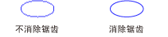

# 用直线和曲线抗锯齿
当你使用[!INCLUDE[ndptecgdiplus](../../../../includes/ndptecgdiplus-md.md)]若要绘制一条线，提供的起始点和终点的行，但不是需要在行中提供有关单个像素的任何信息。 [!INCLUDE[ndptecgdiplus](../../../../includes/ndptecgdiplus-md.md)] 显示驱动程序软件，以确定哪些像素将打开特定显示设备上显示行结合工作。  
  
## 别名  
 请考虑从点 （4，2） 转到 （16，10） 的点的垂直红线。 假定在左上角的坐标系统的原点和度量值的单位是像素。 另外，假设 x 轴向下指到右边，y 轴点。 下图显示彩色背景上绘制的红色线条的放大的视图。  
  
   
  
 用于呈现行红色像素都是不透明的。 在行中有任何部分透明的像素为单位。 这种类型的一行的呈现提供行锯齿状的外观，并在行看起来有点像楼梯。 表示一个行，其中楼梯的这一技术称为别名;楼梯是理论的线条的别名。  
  
## 抗锯齿  
 用于呈现行更复杂的方法是使用部分透明像素和不透明的像素为单位。 像素为单位设置为纯红色，或到某种形式的红色和背景色组合，具体取决于如何关闭到行。 这种类型的呈现称为抗锯齿功能，导致人眼感知作为更平滑的行。 下图显示了如何将特定的像素混合和背景来生成抗锯齿的直线。  
  
   
  
 抗锯齿功能，也称为平滑处理，也可以应用于曲线。 下图显示了平滑椭圆的放大的视图。  
  
   
  
 下图显示的实际大小，一次没有抗锯齿功能，一次使用抗锯齿的同一个椭圆。  
  
   
  
 若要绘制的直线和曲线使用抗锯齿效果，创建的实例<xref:System.Drawing.Graphics>类，然后设置其<xref:System.Drawing.Graphics.SmoothingMode%2A>属性设置为<xref:System.Drawing.Drawing2D.SmoothingMode.AntiAlias>或<xref:System.Drawing.Drawing2D.SmoothingMode.HighQuality>。 然后调用绘制方法之一的同一<xref:System.Drawing.Graphics>类。  
  
 [!code-csharp[LinesCurvesAndShapes#81](~/samples/snippets/csharp/VS_Snippets_Winforms/LinesCurvesAndShapes/CS/Class1.cs#81)]
 [!code-vb[LinesCurvesAndShapes#81](~/samples/snippets/visualbasic/VS_Snippets_Winforms/LinesCurvesAndShapes/VB/Class1.vb#81)]  
  
## 请参阅
- <xref:System.Drawing.Drawing2D.SmoothingMode?displayProperty=nameWithType>
- [直线、曲线和形状](lines-curves-and-shapes.md)
- [如何：对文本使用抗锯齿效果](how-to-use-antialiasing-with-text.md)
