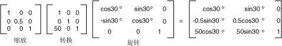

# 全局变换和局部变换Global and Local Transformations
全局转换是适用于由绘制每个项的转换给定<xref:System.Drawing.Graphics>对象。A global transformation is a transformation that applies to every item drawn by a given <xref:System.Drawing.Graphics> object. 与此相反，本地转换是适用于特定项要绘制的转换。In contrast, a local transformation is a transformation that applies to a specific item to be drawn.  
  
## 全局转换Global Transformations  
 若要创建全局转换，请构造<xref:System.Drawing.Graphics>对象，并处理其<xref:System.Drawing.Graphics.Transform%2A>属性。To create a global transformation, construct a <xref:System.Drawing.Graphics> object, and then manipulate its <xref:System.Drawing.Graphics.Transform%2A> property. <xref:System.Drawing.Graphics.Transform%2A>属性是<xref:System.Drawing.Drawing2D.Matrix>对象，因此它可以保存任何仿射转换的序列。The <xref:System.Drawing.Graphics.Transform%2A> property is a <xref:System.Drawing.Drawing2D.Matrix> object, so it can hold any sequence of affine transformations. 转换存储在<xref:System.Drawing.Graphics.Transform%2A>属性称为世界转换。The transformation stored in the <xref:System.Drawing.Graphics.Transform%2A> property is called the world transformation. <xref:System.Drawing.Graphics>类提供了构建复合世界转换的几种方法： <xref:System.Drawing.Graphics.MultiplyTransform%2A>， <xref:System.Drawing.Graphics.RotateTransform%2A>， <xref:System.Drawing.Graphics.ScaleTransform%2A>，和<xref:System.Drawing.Graphics.TranslateTransform%2A>。The <xref:System.Drawing.Graphics> class provides several methods for building up a composite world transformation: <xref:System.Drawing.Graphics.MultiplyTransform%2A>, <xref:System.Drawing.Graphics.RotateTransform%2A>, <xref:System.Drawing.Graphics.ScaleTransform%2A>, and <xref:System.Drawing.Graphics.TranslateTransform%2A>. 下面的示例绘制一个椭圆两次： 一次之前创建世界转换和之后的一次。The following example draws an ellipse twice: once before creating a world transformation and once after. 转换首先按 y 方向的 0.5 的比例缩放然后将为 50 个单位 x 方向，然后将旋转 30 度。The transformation first scales by a factor of 0.5 in the y direction, then translates 50 units in the x direction, and then rotates 30 degrees.  
  
 [!code-csharp[System.Drawing.CoordinateSystems#21](~/samples/snippets/csharp/VS_Snippets_Winforms/System.Drawing.CoordinateSystems/CS/Class1.cs#21)]
 [!code-vb[System.Drawing.CoordinateSystems#21](~/samples/snippets/visualbasic/VS_Snippets_Winforms/System.Drawing.CoordinateSystems/VB/Class1.vb#21)]  
  
 下图显示矩阵涉及在转换中。The following illustration shows the matrices involved in the transformation.  
  
   
  
> [!NOTE]
>  在前面的示例中，椭圆围绕位于工作区的左上角的坐标系的原点。In the preceding example, the ellipse is rotated about the origin of the coordinate system, which is at the upper-left corner of the client area. 这将产生比旋转椭圆围绕其自身中心不同的结果。This produces a different result than rotating the ellipse about its own center.  
  
## 本地转换Local Transformations  
 本地转换应用到要绘制的特定项。A local transformation applies to a specific item to be drawn. 例如，<xref:System.Drawing.Drawing2D.GraphicsPath>对象具有<xref:System.Drawing.Drawing2D.GraphicsPath.Transform%2A>，可以将该路径的数据点的方法。For example, a <xref:System.Drawing.Drawing2D.GraphicsPath> object has a <xref:System.Drawing.Drawing2D.GraphicsPath.Transform%2A> method that allows you to transform the data points of that path. 下面的示例绘制一个具有任何转换的矩形和具有旋转转换的路径。The following example draws a rectangle with no transformation and a path with a rotation transformation. （假定没有任何世界转换。）(Assume that there is no world transformation.)  
  
 [!code-csharp[System.Drawing.CoordinateSystems#22](~/samples/snippets/csharp/VS_Snippets_Winforms/System.Drawing.CoordinateSystems/CS/Class1.cs#22)]
 [!code-vb[System.Drawing.CoordinateSystems#22](~/samples/snippets/visualbasic/VS_Snippets_Winforms/System.Drawing.CoordinateSystems/VB/Class1.vb#22)]  
  
 你可以组合使用本地转换，以实现各种结果的世界转换。You can combine the world transformation with local transformations to achieve a variety of results. 例如，可以使用世界转换修改坐标系统，并使用本地转换来旋转和缩放新的坐标系统上绘制的对象。For example, you can use the world transformation to revise the coordinate system and use local transformations to rotate and scale objects drawn on the new coordinate system.  
  
 假设您希望具有其源为 200 像素从工作区左边缘和从客户端区域的顶部 150 像素坐标系统。Suppose you want a coordinate system that has its origin 200 pixels from the left edge of the client area and 150 pixels from the top of the client area. 此外，假定您需要的度量单位为像素，且 x 轴指向右，y 轴指向上方。Furthermore, assume that you want the unit of measure to be the pixel, with the x-axis pointing to the right and the y-axis pointing up. 默认坐标系统具有 y 轴指向下方，因此您需要在水平轴上执行反射。The default coordinate system has the y-axis pointing down, so you need to perform a reflection across the horizontal axis. 下图显示了此类反射的矩阵。The following illustration shows the matrix of such a reflection.  
  
   
  
 接下来，假定您需要执行转换 200 个单位的向右和向下的 150 个单位。Next, assume you need to perform a translation 200 units to the right and 150 units down.  
  
 下面的示例建立刚刚介绍通过设置世界转换的坐标系统<xref:System.Drawing.Graphics>对象。The following example establishes the coordinate system just described by setting the world transformation of a <xref:System.Drawing.Graphics> object.  
  
 [!code-csharp[System.Drawing.CoordinateSystems#23](~/samples/snippets/csharp/VS_Snippets_Winforms/System.Drawing.CoordinateSystems/CS/Class1.cs#23)]
 [!code-vb[System.Drawing.CoordinateSystems#23](~/samples/snippets/visualbasic/VS_Snippets_Winforms/System.Drawing.CoordinateSystems/VB/Class1.vb#23)]  
  
 下面的代码 （放在上面的示例末尾） 创建包含新的坐标系统的原点位于其左下角的一个矩形的路径。The following code (placed at the end of the preceding example) creates a path that consists of a single rectangle with its lower-left corner at the origin of the new coordinate system. 与任何本地转换和局部转换一次，一次填充矩形。The rectangle is filled once with no local transformation and once with a local transformation. 水平缩放到原来的 2 的 30 度旋转后跟包含本地转换。The local transformation consists of a horizontal scaling by a factor of 2 followed by a 30-degree rotation.  
  
 [!code-csharp[System.Drawing.CoordinateSystems#24](~/samples/snippets/csharp/VS_Snippets_Winforms/System.Drawing.CoordinateSystems/CS/Class1.cs#24)]
 [!code-vb[System.Drawing.CoordinateSystems#24](~/samples/snippets/visualbasic/VS_Snippets_Winforms/System.Drawing.CoordinateSystems/VB/Class1.vb#24)]  
  
 下图显示了新的坐标系统和两个矩形。The following illustration shows the new coordinate system and the two rectangles.  
  
   
  
## 请参阅See also

- [坐标系统和转换Coordinate Systems and Transformations](coordinate-systems-and-transformations.md)
- [在托管 GDI+ 中使用转换Using Transformations in Managed GDI+](using-transformations-in-managed-gdi.md)
