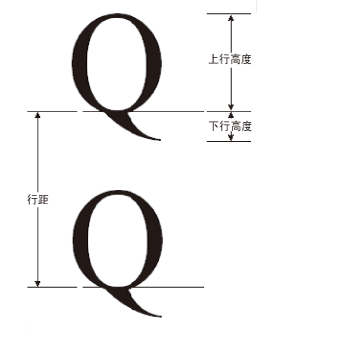
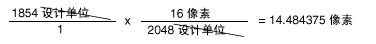

# 如何：获取字体规格
<xref:System.Drawing.FontFamily>类提供了检索特定系列/样式组合的各种度量值的以下方法：  
  
-   <xref:System.Drawing.FontFamily.GetEmHeight%2A>(FontStyle)  
  
-   <xref:System.Drawing.FontFamily.GetCellAscent%2A>(FontStyle)  
  
-   <xref:System.Drawing.FontFamily.GetCellDescent%2A>(FontStyle)  
  
-   <xref:System.Drawing.FontFamily.GetLineSpacing%2A>(FontStyle)  
  
 这些方法返回的数字都是采用字体设计单位，因此它们将独立的大小和单位的特定于<xref:System.Drawing.Font>对象。  
  
 下图显示了各种指标。  
  
   
  
## 示例  
 以下示例显示 Arial 字体系列的正则样式的度量值。 该代码还创建<xref:System.Drawing.Font>具有大小为 16 像素和显示的度量值 （以像素为单位） 对该特定对象 （基于 Arial 系列）<xref:System.Drawing.Font>对象。  
  
 下图显示了示例代码的输出。  
  
   
  
 请注意上图中的输出的前两行。 <xref:System.Drawing.Font>对象返回的大小为 16，和<xref:System.Drawing.FontFamily>对象返回 2,048 全身高度。 这两个数字 （16 和 2,048） 是字体设计单位和的单位 （在本例中为像素） 之间进行转换的关键<xref:System.Drawing.Font>对象。  
  
 例如，您可以将转换上移量从设计单位为像素，如下所示：  
  
   
  
 下面的代码定位文本垂直通过设置<xref:System.Drawing.PointF.Y%2A>的数据成员<xref:System.Drawing.PointF>对象。 Y 坐标为增量进行递增`font.Height`的每一行新文本。 <xref:System.Drawing.Font.Height%2A>的属性<xref:System.Drawing.Font>对象返回的行间距 （以像素为单位） 对该特定<xref:System.Drawing.Font>对象。 在此示例中，返回的号<xref:System.Drawing.Font.Height%2A>为 19。 请注意，这是通过将行间距度量值转换为像素中获取的编号 （向上舍入为整数） 相同。  
  
 请注意，全身高度 （也称为大小或 em 大小） 不是上升和下降的总和。 上升和下降的总和被调用单元格的高度。 单元格的高度减去内部间隙等于全身高度。 单元格高度加外部间隙等于行间距。  
  
 [!code-csharp[System.Drawing.FontsAndText#71](~/samples/snippets/csharp/VS_Snippets_Winforms/System.Drawing.FontsAndText/CS/Class1.cs#71)]
 [!code-vb[System.Drawing.FontsAndText#71](~/samples/snippets/visualbasic/VS_Snippets_Winforms/System.Drawing.FontsAndText/VB/Class1.vb#71)]  
  
## 编译代码  
 前面的示例专用于 Windows 窗体，它需要 <xref:System.Windows.Forms.PaintEventArgs> `e`，这是 <xref:System.Windows.Forms.PaintEventHandler> 的参数。  
  
## 请参阅
- [Windows 窗体中的图形和绘制](graphics-and-drawing-in-windows-forms.md)
- [使用字体和文本](using-fonts-and-text.md)
