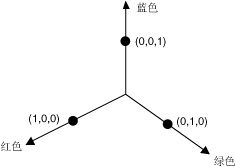
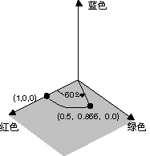
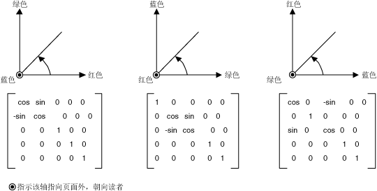
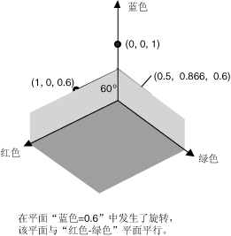

# 如何：旋转颜色
四维颜色空间中的旋转很难直观显示。 我们可以轻松地实现旋转同意接受保持一个固定的颜色组件的可视化效果。 假设我们同意将 alpha 分量固定在 1 （完全不透明）。 然后我们可以直观显示三维颜色空间具有红色、 绿色和蓝色的轴，如下图中所示。  
  
   
  
 一种颜色可视为在三维空间中点。 例如，空间中的点 （1，0，0） 表示的颜色为红色，并在空间中的点 （0、 1、 0） 表示绿色。  
  
 下图通过红-绿平面中的 60 度的角度显示旋转的颜色 （1，0，0） 意味着什么。 在平面平行于红-绿平面旋转可以看作围绕蓝色轴的旋转。  
  
   
  
 下图显示了如何初始化颜色矩阵执行三个坐标轴 （红色、 绿色、 蓝色） 的每个旋转。  
  
   
  
## 示例  
 下面的示例将是一种颜色 （1，0，0.6） 和顺蓝色轴旋转 60 度的映像。 中对红-绿平面平行的平面上旋转的角度扫出。  
  
 下图显示在左侧和右侧的颜色旋转图像的原始图像。  
  
   
  
 下图显示了执行下面的代码中的颜色旋转的可视化效果。  
  
   
  
 [!code-csharp[System.Drawing.RotateColors#1](../../../../samples/snippets/csharp/VS_Snippets_Winforms/System.Drawing.RotateColors/CS/Form1.cs#1)]
 [!code-vb[System.Drawing.RotateColors#1](../../../../samples/snippets/visualbasic/VS_Snippets_Winforms/System.Drawing.RotateColors/VB/Form1.vb#1)]  
  
## 编译代码  
 前面的示例专用于 Windows 窗体，并且它需要<xref:System.Windows.Forms.PaintEventArgs> `e`，这是一个参数的<xref:System.Windows.Forms.Control.Paint>事件处理程序。 替换为`RotationInput.bmp`与图像文件名称和你的系统上有效的路径。  
  
## 请参阅
- <xref:System.Drawing.Imaging.ColorMatrix>
- <xref:System.Drawing.Imaging.ImageAttributes>
- [Windows 窗体中的图形和绘制](../../../../docs/framework/winforms/advanced/graphics-and-drawing-in-windows-forms.md)
- [对图像重新着色](../../../../docs/framework/winforms/advanced/recoloring-images.md)
