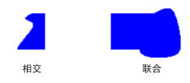

# GDI+ 中的区域Regions in GDI+
区域是输出设备的显示区域的一部分。A region is a portion of the display area of an output device. 区域可以是简单 （一个矩形） 或复杂 （多边形和闭合的曲线的组合）。Regions can be simple (a single rectangle) or complex (a combination of polygons and closed curves). 下图显示了两个区域： 一个从一个矩形、 构造和路径中的其他构造。The following illustration shows two regions: one constructed from a rectangle, and the other constructed from a path.  
  
   
  
## 使用区域Using Regions  
 区域通常用于剪辑和命中测试。Regions are often used for clipping and hit testing. 剪辑涉及到将绘制限制到特定的区域的显示区域中，通常需要更新的部分。Clipping involves restricting drawing to a certain region of the display area, usually the portion that needs to be updated. 命中测试涉及到检查以确定光标是否在某些区域中的屏幕时按下鼠标按钮。Hit testing involves checking to determine whether the cursor is in a certain region of the screen when a mouse button is pressed.  
  
 您可以构造从一个矩形或路径的区域。You can construct a region from a rectangle or a path. 此外可以通过合并现有的区域来创建复杂的区域。You can also create complex regions by combining existing regions. <xref:System.Drawing.Region>类提供了以下用于组合区域的方法： <xref:System.Drawing.Region.Intersect%2A>， <xref:System.Drawing.Region.Union%2A>， <xref:System.Drawing.Region.Xor%2A>， <xref:System.Drawing.Region.Exclude%2A>，并<xref:System.Drawing.Region.Complement%2A>。The <xref:System.Drawing.Region> class provides the following methods for combining regions: <xref:System.Drawing.Region.Intersect%2A>, <xref:System.Drawing.Region.Union%2A>, <xref:System.Drawing.Region.Xor%2A>, <xref:System.Drawing.Region.Exclude%2A>, and <xref:System.Drawing.Region.Complement%2A>.  
  
 两个区域的交集是属于这两个区域的所有点的集合。The intersection of two regions is the set of all points belonging to both regions. 联合是属于一个或另一个或两个区域中的所有点的集合。The union is the set of all points belonging to one or the other or both regions. 区域的补数是不在区域中的所有点的集合。The complement of a region is the set of all points that are not in the region. 下图显示了上图中所示的两个区域的并集和相交处。The following illustration shows the intersection and union of the two regions shown in the preceding illustration.  
  
   
  
 <xref:System.Drawing.Region.Xor%2A>方法，适用于一对区域，会生成包含对一个区域或另一个，但不是能同时属于的所有点的区域。The <xref:System.Drawing.Region.Xor%2A> method, applied to a pair of regions, produces a region that contains all points that belong to one region or the other, but not both. <xref:System.Drawing.Region.Exclude%2A>方法，适用于一对区域，会生成包含不在第二个区域中的第一个区域中的所有点的区域。The <xref:System.Drawing.Region.Exclude%2A> method, applied to a pair of regions, produces a region that contains all points in the first region that are not in the second region. 下图显示了通过应用生成的区域<xref:System.Drawing.Region.Xor%2A>和<xref:System.Drawing.Region.Exclude%2A>本主题开头所示的两个区域的方法。The following illustration shows the regions that result from applying the <xref:System.Drawing.Region.Xor%2A> and <xref:System.Drawing.Region.Exclude%2A> methods to the two regions shown at the beginning of this topic.  
  
   
  
 若要填充一个区域，需要<xref:System.Drawing.Graphics>对象，<xref:System.Drawing.Brush>对象，和一个<xref:System.Drawing.Region>对象。To fill a region, you need a <xref:System.Drawing.Graphics> object, a <xref:System.Drawing.Brush> object, and a <xref:System.Drawing.Region> object. <xref:System.Drawing.Graphics>对象提供<xref:System.Drawing.Graphics.FillRegion%2A>方法，和<xref:System.Drawing.Brush>对象将存储的填充，如颜色或图案的特性。The <xref:System.Drawing.Graphics> object provides the <xref:System.Drawing.Graphics.FillRegion%2A> method, and the <xref:System.Drawing.Brush> object stores attributes of the fill, such as color or pattern. 下面的示例填充用一种颜色的区域。The following example fills a region with a solid color.  
  
 [!code-csharp[LinesCurvesAndShapes#61](~/samples/snippets/csharp/VS_Snippets_Winforms/LinesCurvesAndShapes/CS/Class1.cs#61)]
 [!code-vb[LinesCurvesAndShapes#61](~/samples/snippets/visualbasic/VS_Snippets_Winforms/LinesCurvesAndShapes/VB/Class1.vb#61)]  
  
## 请参阅See also

- <xref:System.Drawing.Region?displayProperty=nameWithType>
- [直线、曲线和形状Lines, Curves, and Shapes](lines-curves-and-shapes.md)
- [使用区域Using Regions](using-regions.md)
