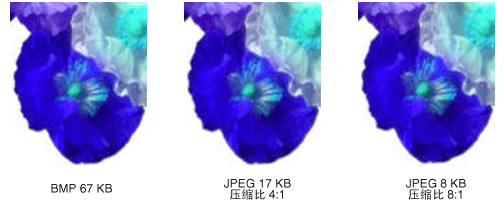

# 位图类型
位图是位的数组，它指定了像素矩阵中各像素的颜色。  专用于单个像素的位数决定了可分配到该像素的颜色数。  例如，如果用 4 位来呈现每个像素，那么一个给定的像素就可以分配到 16 \(2^4 \= 16\) 种颜色中的一种。  下表中的几个示例显示了可分配到由给定位数代表的像素的颜色数量。  
  
|每像素的位数|一个像素可分配到的颜色数量|  
|------------|-------------------|  
|1|2^1 \= 2|  
|2|2^2 \= 4|  
|4|2^4 \= 16|  
|8|2^8 \= 256|  
|16|2^16 \= 65,536|  
|24|2^24 \= 16,777,216|  
  
 存储位图的磁盘文件通常包含一个或多个信息块，信息块中存储了如每像素位数、每行的像素数以及数组中的行数等信息。  这样一个文件也可能包含颜色表（有时称为调色板）。  颜色表将位图中的数值映射到特定的颜色。  下面的插图显示了一幅放大的图像以及它的位图和颜色表。  每个像素用一个 4 位数表示，那么颜色表中有 2^4 \= 16 种颜色。  表中的每种颜色用一个 24 位数表示：8 位用于红色，8 位用于绿色，8 位用于蓝色。  数字以十六进制（基 16）形式显示：A \= 10，B \= 11，C \= 12，D \= 13，E \= 14，F \= 15。  
  
   
  
 请看位于该图像第 3 行、第 5 列的像素。  位图中对应的数字为 1。  颜色表告诉我们 1 表示红色，因此该像素是红色的。  该位图最上面一行中所有的项都是 3。  颜色表告知我们 3 表示蓝色，因此该图像最上面一行中的所有像素都是蓝色。  
  
> [!NOTE]
>  一些位图是以上下颠倒的格式存储的；位图首行中的数值对应于图像末行中的像素。  
  
 在颜色表中存储索引的位图称为“调色板索引位图”。  有些位图不需要颜色表。  例如，如果位图使用每像素 24 位的格式，那么该位图就可以将颜色本身（而不是索引）存储到颜色表中。  下面的插图显示了一个直接存储颜色（24 位\/像素）而不使用颜色表的位图。  该插图也显示了相应图像的放大视图。  在位图中，FFFFFF 表示白色，FF0000 表示红色，00FF00 表示绿色，0000FF 表示蓝色。  
  
   
  
## 图形文件格式  
 有许多将位图存储到磁盘文件的标准格式。  [!INCLUDE[ndptecgdiplus](../../../../includes/ndptecgdiplus-md.md)] 支持下面段落中所描述的图形文件格式。  
  
### BMP  
 BMP 是 Windows 使用的一种标准格式，用于存储设备无关和应用程序无关的图像。  一个给定 BMP 文件的每像素位数值（1、4、8、15、24、32 或 64）在文件头中指定。  每像素 24 位的 BMP 文件是通用的。  BMP 文件通常是不压缩的，因此，不太适合通过 Internet 传输。  
  
### 可交换图像文件格式 \(GIF\)  
 GIF 是一种用于在网页中显示图像的通用格式。  GIF 文件适用于画线、有纯色块的图片和在颜色之间有清晰边界的图片。  GIF 文件是压缩的，但是在压缩过程中没有信息丢失；解压缩的图像与原始图像完全一样。  GIF 文件中的一种颜色可以被指定为透明，这样，图像将具有显示它的任何网页的背景色。  在单个文件中存储一系列 GIF 图像可以形成一个动画 GIF。  GIF 文件每像素最多能存储 8 位，所以它们只限于使用 256 种颜色。  
  
### 联合摄影专家组 \(JPEG\)  
 JPEG 是一种适应于自然景观（如扫描的照片）的压缩方案。  一些信息会在压缩过程中丢失，但是这些丢失人眼是察觉不到的。  JPEG 文件每像素存储 24 位，因此它们能够显示超过 16,000,000 种颜色。  JPEG 文件不支持透明或动画。  
  
 JPEG 图像中的压缩级别是可以控制的，但是较高的压缩级别（较小的文件）会导致丢失更多的信息。  对于一幅以 20:1 压缩比生成的图像，人眼难以把它和原始图像区别开来。  下面的插图显示了一幅 BMP 图像和用这幅 BMP 图像压缩而得的两幅 JPEG 图像。  第一幅 JPEG 的压缩比是 4:1，第二幅 JPEG 的压缩比是 8:1。  
  
   
  
 JPEG 压缩不适用于线条图形、纯色块和清晰边界。  下面的插图显示了一幅 BMP 图像，以及两幅 JPEG 图像和一幅 GIF 图像。  JPEG 和 GIF 图像从 BMP 图像压缩而得。  GIF 的压缩比是 4:1，较小 JPEG 的压缩比是 4:1，较大 JPEG 的压缩比是 8:3。  请注意，GIF 图像沿线条保持着清晰的边界，而 JPEG 图像则趋向于模糊边界。  
  
   
  
 JPEG 是一种压缩方案，不是一种文件格式。  “JPEG 文件交换格式 \(JFIF\)”是一种文件格式，常用于存储和传输已根据 JPEG 方案压缩的图像。  Web 浏览器显示的 JFIF 文件使用 .jpg 扩展名。  
  
### 可交换图像文件 \(EXIF\)  
 EXIF 是一种适用于数码相机拍摄的照片的文件格式。  EXIF 文件中含有根据 JPEG 规格压缩的图像。  EXIF 文件中还包含了有关照片的信息（拍摄日期、快门速度、曝光时间，等等）和相机信息（制造商、型号，等等）。  
  
### 可迁移网络图形 \(PNG\)  
 PNG 格式不但保留了许多 GIF 格式的优点，还提供了超出 GIF 的功能。  像 GIF 文件一样，PNG 文件在压缩时也不损失信息。  PNG 文件能以每像素 8、24 或 48 位来存储颜色，并以每像素 1、2、4、8 或 16 位来存储灰度。  相比之下，GIF 文件只能使用每像素 1、2、4 或 8 位。  PNG 文件还可为每个像素存储一个 alpha 值，该值指定了该像素颜色与背景颜色混合的程度。  
  
 PNG 优于 GIF 之处在于，它能渐进地显示一幅图像（也就是说，在图像通过网络连接传递的过程中，显示的图像将越来越完整）。  PNG 文件可包含灰度校正和颜色校正信息，以便图像可在各种各样的显示设备上精确地呈现。  
  
### 标签图像文件格式 \(TIFF\)  
 TIFF 是一种灵活的和可扩展的格式，各种各样的平台和图像处理应用程序都支持这种格式。  TIFF 文件能以每像素任意位来存储图像，并可以使用各种各样的压缩算法。  单个的多页 TIFF 文件可以存储数幅图像。  可以把与图像相关的信息（扫描仪制造商、主机、压缩类型、打印方向和每像素采样，等等）存储在文件中并使用标签来排列这些信息。  可以根据需要通过批准和添加新标签来扩展 TIFF 格式。  
  
## 请参阅  
 <xref:System.Drawing.Image?displayProperty=fullName>   
 <xref:System.Drawing.Bitmap?displayProperty=fullName>   
 <xref:System.Drawing.Imaging.PixelFormat?displayProperty=fullName>   
 [图像、位图和图元文件](../../../../docs/framework/winforms/advanced/images-bitmaps-and-metafiles.md)   
 [使用图像、位图、图标和图元文件](../../../../docs/framework/winforms/advanced/working-with-images-bitmaps-icons-and-metafiles.md)