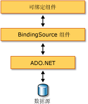

# BindingSource 组件概述
<xref:System.Windows.Forms.BindingSource> 组件旨在简化将控件绑定到基础数据源的过程。 <xref:System.Windows.Forms.BindingSource> 组件同时充当管道和其他控件可以绑定的数据源。 将命令传递到基础数据列表时，它提供窗体数据连接的抽象。 此外，可以直接向其添加数据，以便组件本身可用作数据源。  
  
## 作为中介的 BindingSource 组件  
 <xref:System.Windows.Forms.BindingSource> 组件为窗体上的某些或全部控件充当数据源。 在 Visual Studio 中，<xref:System.Windows.Forms.BindingSource>可以绑定到通过控件`DataBindings`属性，它是从可访问**属性**窗口。 另请参阅[如何：将 Windows 窗体控件与 BindingSource 组件使用设计器绑定](bind-wf-controls-with-the-bindingsource.md)。  
  
 可以将 <xref:System.Windows.Forms.BindingSource> 组件同时绑定到两个简单的数据源（如一个对象或一个基本集合（如 <xref:System.Collections.ArrayList>）的单个属性）和复杂的数据源（如数据库表）。 <xref:System.Windows.Forms.BindingSource> 组件充当提供绑定和货币管理服务的中介。 在设计时或运行时中，通过将 <xref:System.Windows.Forms.BindingSource> 组件的 <xref:System.Windows.Forms.BindingSource.DataSource%2A> 和 <xref:System.Windows.Forms.BindingSource.DataMember%2A> 属性分别设置为数据库和表，可将其绑定到复杂的数据源。 下图演示 <xref:System.Windows.Forms.BindingSource> 组件在何处能够融入现有的绑定数据的体系结构。  
  
   
  
> [!NOTE]
>  在设计时，某些操作（如将数据库表从数据窗口拖到空白的窗体中）会创建 <xref:System.Windows.Forms.BindingSource> 组件，将其绑定到基础数据源，并添加数据识别控件，而这些只需通过一个操作即可完成。 另请参阅[在 Visual Studio 中将 Windows 窗体控件绑定到数据](/visualstudio/data-tools/bind-windows-forms-controls-to-data-in-visual-studio)。  
  
## 作为数据源的 BindingSource 组件  
 如果开始将项添加到 <xref:System.Windows.Forms.BindingSource> 组件，而不先指定一个用于绑定的列表，则该组件将充当列表样式的数据源并接受这些添加的项。  
  
 此外，通过 <xref:System.Windows.Forms.BindingSource.AddingNew> 事件，可以编写代码来提供自定义的“AddNew”功能，此事件在添加项到列表之前调用 <xref:System.Windows.Forms.BindingSource.AddNew%2A> 方法时引发。 有关详细信息，请参阅 [BindingSource 组件体系结构](bindingsource-component-architecture.md)。  
  
## 导航  
 对于需要为窗体上的数据进行导航的用户，<xref:System.Windows.Forms.BindingNavigator> 组件与 <xref:System.Windows.Forms.BindingSource> 组件配合使用可使你导航和处理数据。 有关详细信息，请参阅 [BindingNavigator 控件](bindingnavigator-control-windows-forms.md)。  
  
## 数据操作  
 <xref:System.Windows.Forms.BindingSource> 为其所有绑定充当 <xref:System.Windows.Forms.CurrencyManager>，因此可提供对有关数据源的货币和位置信息的访问。 下表显示 <xref:System.Windows.Forms.BindingSource> 组件提供的用于访问和操作基础数据的组件成员。  
  
|成员|描述|  
|------------|-----------------|  
|<xref:System.Windows.Forms.BindingSource.Current%2A> 属性|获取数据源的当前项。|  
|<xref:System.Windows.Forms.BindingSource.Position%2A> 属性|获取或设置基础列表中的当前位置。|  
|<xref:System.Windows.Forms.BindingSource.List%2A> 属性|获取 <xref:System.Windows.Forms.BindingSource.DataSource%2A> 和 <xref:System.Windows.Forms.BindingSource.DataMember%2A> 计算的计算列表。 如果未设置 <xref:System.Windows.Forms.BindingSource.DataMember%2A>，返回由 <xref:System.Windows.Forms.BindingSource.DataSource%2A> 指定的列表。|  
|<xref:System.Windows.Forms.BindingSource.Insert%2A> 方法|在列表中指定索引的位置插入项。|  
|<xref:System.Windows.Forms.BindingSource.RemoveCurrent%2A> 方法|从列表中移除当前项。|  
|<xref:System.Windows.Forms.BindingSource.EndEdit%2A> 方法|将挂起的更改应用于基础数据源。|  
|<xref:System.Windows.Forms.BindingSource.CancelEdit%2A> 方法|取消当前的编辑操作。|  
|<xref:System.Windows.Forms.BindingSource.AddNew%2A> 方法|在基础列表中添加一个新项。 如果数据源实现 <xref:System.ComponentModel.IBindingList> 并从 <xref:System.Windows.Forms.BindingSource.AddingNew> 事件返回一个项，则添加此项。 否则，该请求将传递给此列表的 <xref:System.ComponentModel.IBindingList.AddNew%2A> 方法。 如果基础列表不是 <xref:System.ComponentModel.IBindingList>，则通过该项的公共默认构造函数自动创建该项。|  
  
## 排序与筛选  
 通常，应使用数据源的已排序或已筛选视图。 下表显示 <xref:System.Windows.Forms.BindingSource> 组件数据源提供的成员。  
  
|成员|描述|  
|------------|-----------------|  
|<xref:System.Windows.Forms.BindingSource.Sort%2A> 属性|如果数据源是 <xref:System.ComponentModel.IBindingList>，则获取或设置用于排序的列名称并对顺序信息进行排序。 如果数据源是 <xref:System.ComponentModel.IBindingListView> 并支持高级排序，则获取用于排序的多个列名称并对顺序信息进行排序|  
|<xref:System.Windows.Forms.BindingSource.Filter%2A> 属性|如果数据源是 <xref:System.ComponentModel.IBindingListView>，则获取或设置用于筛选已查看的行的表达式。|  
  
## 请参阅

- <xref:System.Windows.Forms.BindingSource>
- <xref:System.Windows.Forms.BindingNavigator>
- [BindingSource 组件体系结构](bindingsource-component-architecture.md)
- [BindingSource 组件](bindingsource-component.md)
- [BindingNavigator 控件](bindingnavigator-control-windows-forms.md)
- [Windows 窗体数据绑定](../windows-forms-data-binding.md)
- [在 Windows 窗体上使用的控件](controls-to-use-on-windows-forms.md)
