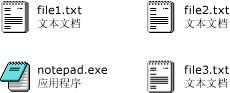

# <a name="how-to-enable-tile-view-in-a-windows-forms-listview-control"></a>如何：在 Windows 窗体 ListView 控件中启用平铺视图
使用 <xref:System.Windows.Forms.ListView> 控件的磁贴视图功能，可以在图形和文本信息之间提供一种视觉平衡。 磁贴视图中，为项目显示的文本信息与为详细信息视图定义的列信息相同。 磁贴视图与 <xref:System.Windows.Forms.ListView> 控件中的分组或插入标记功能配合使用。  
  
 磁贴视图使用 32 x 32 像素的图标和若干行文本，如以下图像中所示。  
  
   
磁贴视图图标和文本  
  
 若要启用磁贴视图，请将 <xref:System.Windows.Forms.ListView.View%2A> 属性设置为 <xref:System.Windows.Forms.View.Tile>。 可以通过设置 <xref:System.Windows.Forms.ListView.TileSize%2A> 属性来调整平铺大小，并通过调整 <xref:System.Windows.Forms.ListView.Columns%2A> 集合，来调整磁贴中显示的文本行数。  
  
> [!NOTE]
>  当应用程序调用 <xref:System.Windows.Forms.Application.EnableVisualStyles%2A?displayProperty=nameWithType> 方法时，磁贴视图仅适用于 [!INCLUDE[WinXpFamily](../../../../includes/winxpfamily-md.md)]。 在早期的操作系统上，任何与磁贴视图相关的代码都不起作用，且 <xref:System.Windows.Forms.ListView> 控件将显示在大图标视图中。 有关详细信息，请参阅<xref:System.Windows.Forms.ListView.View%2A?displayProperty=nameWithType>。  
  
### <a name="to-set-tile-view-programmatically"></a>若要以编程方式设置磁贴视图  
  
1.  使用 <xref:System.Windows.Forms.ListView> 控件的 <xref:System.Windows.Forms.View> 枚举。  
  
    ```vb  
    ListView1.View = View.Tile  
    ```  
  
    ```csharp  
    listView1.View = View.Tile;  
    ```  
  
## <a name="example"></a>示例  
 以下完整的代码示例演示了修改磁贴以显示三行文本的磁贴视图。 已经调整了磁贴大小，以防止自动换行。  
  
 [!code-cpp[System.Windows.Forms.ListView.Tiling#1](../../../../samples/snippets/cpp/VS_Snippets_Winforms/System.Windows.Forms.ListView.Tiling/CPP/listviewtilingexample.cpp#1)]
 [!code-csharp[System.Windows.Forms.ListView.Tiling#1](../../../../samples/snippets/csharp/VS_Snippets_Winforms/System.Windows.Forms.ListView.Tiling/CS/listviewtilingexample.cs#1)]
 [!code-vb[System.Windows.Forms.ListView.Tiling#1](../../../../samples/snippets/visualbasic/VS_Snippets_Winforms/System.Windows.Forms.ListView.Tiling/VB/listviewtilingexample.vb#1)]  
  
## <a name="compiling-the-code"></a>编译代码  
 此示例需要：  
  
-   对 System 和 System.Windows.Forms 程序集的引用。  
  
-   在执行文件相同的目录中的一个名为 book.ico 的图标文件。  
  
 为 Visual Basic 或 Visual C# 中生成此示例从命令行有关的信息，请参阅[从命令行生成](~/docs/visual-basic/reference/command-line-compiler/building-from-the-command-line.md)或[命令行上使用 csc.exe 生成](~/docs/csharp/language-reference/compiler-options/command-line-building-with-csc-exe.md)。 还可以通过将代码粘贴到新项目，在 [!INCLUDE[vsprvs](../../../../includes/vsprvs-md.md)] 中生成此示例。  另请参阅 [如何：使用 Visual Studio 编译和运行完整的 Windows 窗体代码示例](http://msdn.microsoft.com/library/Bb129228\(v=vs.110\))。  
  
## <a name="see-also"></a>请参阅  
 <xref:System.Windows.Forms.ListView>  
 <xref:System.Windows.Forms.ListView.TileSize%2A>  
 [ListView 控件](../../../../docs/framework/winforms/controls/listview-control-windows-forms.md)  
 [ListView 控件概述](../../../../docs/framework/winforms/controls/listview-control-overview-windows-forms.md)  
 [Windows XP 功能和 Windows 窗体控件](http://msdn.microsoft.com/library/bc7fab94-fce9-4bf1-a8ad-a5837c91c3c0)
