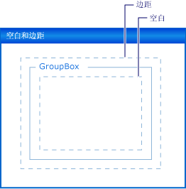

# 演练：使用 Padding、Margins 和 AutoSize 属性对 Windows 窗体控件进行布局Walkthrough: Laying Out Windows Forms Controls with Padding, Margins, and the AutoSize Property
在窗体上精确地放置控件对于许多应用程序而言是高优先级。Precise placement of controls on your form is a high priority for many applications. **Windows 窗体设计器**为你提供许多布局工具实现此目的。The **Windows Forms Designer** gives you many layout tools to accomplish this. 三个最重要的是<xref:System.Windows.Forms.Control.Margin%2A>， <xref:System.Windows.Forms.Control.Padding%2A>，和<xref:System.Windows.Forms.Control.AutoSize%2A>是存在于所有 Windows 窗体控件上的属性。Three of the most important are the <xref:System.Windows.Forms.Control.Margin%2A>, <xref:System.Windows.Forms.Control.Padding%2A>, and <xref:System.Windows.Forms.Control.AutoSize%2A> properties, which are present on all Windows Forms controls.  
  
 <xref:System.Windows.Forms.Control.Margin%2A> 属性定义控件周围的空间，该空间使其他控件与该控件的边框保持指定的距离。The <xref:System.Windows.Forms.Control.Margin%2A> property defines the space around the control that keeps other controls a specified distance from the control's borders.  
  
 <xref:System.Windows.Forms.Control.Padding%2A> 属性定义控件内部的空间，该空间使控件的内容（例如，其 <xref:System.Windows.Forms.Control.Text%2A> 属性的值）与该控件的边框保持指定的距离。The <xref:System.Windows.Forms.Control.Padding%2A> property defines the space in the interior of a control that keeps the control's content (for example, the value of its <xref:System.Windows.Forms.Control.Text%2A> property) a specified distance from the control's borders.  
  
 下图显示控件上的 <xref:System.Windows.Forms.Control.Padding%2A> 和 <xref:System.Windows.Forms.Control.Margin%2A> 属性。The following illustration shows the <xref:System.Windows.Forms.Control.Padding%2A> and <xref:System.Windows.Forms.Control.Margin%2A> properties on a control.  
  
   
  
 <xref:System.Windows.Forms.Control.AutoSize%2A>属性告诉控件对其内容自动调整大小。The <xref:System.Windows.Forms.Control.AutoSize%2A> property tells a control to automatically size itself to its contents. 它将调整自身大小要小于其原始值<xref:System.Windows.Forms.Control.Size%2A>属性，它将体现的值及其<xref:System.Windows.Forms.Control.Padding%2A>属性。It will not resize itself to be smaller than the value of its original <xref:System.Windows.Forms.Control.Size%2A> property, and it will account for the value of its <xref:System.Windows.Forms.Control.Padding%2A> property.  
  
 本演练涉及以下任务：Tasks illustrated in this walkthrough include:  
  
-   创建 Windows 窗体项目Creating a Windows Forms project  
  
-   边距设置为您的控件Setting Margins for Your Controls  
  
-   设置控件的填充Setting Padding for Your Controls  
  
-   自动调整控件大小Automatically Sizing Your Controls  
  
 完成上述操作后，你将会了解这些重要布局功能所发挥的作用。When you are finished, you will have an understanding of the role played by these important layout features.  
  
> [!NOTE]
>  显示的对话框和菜单命令可能会与“帮助”中的描述不同，具体取决于你现用的设置或版本。The dialog boxes and menu commands you see might differ from those described in Help depending on your active settings or edition. 若要更改设置，请在 **“工具”** 菜单上选择 **“导入和导出设置”** 。To change your settings, choose **Import and Export Settings** on the **Tools** menu. 有关详细信息，请参阅[个性化设置 Visual Studio IDE](/visualstudio/ide/personalizing-the-visual-studio-ide)。For more information, see [Personalize the Visual Studio IDE](/visualstudio/ide/personalizing-the-visual-studio-ide).  
  
## 系统必备Prerequisites  
 若要完成本演练，你将需要：In order to complete this walkthrough, you will need:  
  
-   若要能够创建和安装 Visual Studio 的计算机上运行 Windows 窗体应用程序项目的足够权限。Sufficient permissions to be able to create and run Windows Forms application projects on the computer where Visual Studio is installed.  
  
## 创建项目Creating the Project  
 第一步是创建项目并设置窗体。The first step is to create the project and set up the form.  
  
#### 要创建项目To create the project  
  
1.  创建**Windows 应用程序**名为项目`LayoutExample`。Create a **Windows Application** project called `LayoutExample`. 有关详细信息，请参阅[如何： 创建 Windows 应用程序项目](https://msdn.microsoft.com/library/b2f93fed-c635-4705-8d0e-cf079a264efa)。For more information, see [How to: Create a Windows Application Project](https://msdn.microsoft.com/library/b2f93fed-c635-4705-8d0e-cf079a264efa) .  
  
2.  选择中的窗体**Windows 窗体设计器**。Select the form in the **Windows Forms Designer**.  
  
## 边距设置为您的控件Setting Margins for Your Controls  
 可以使用在控件之间设置的默认距离<xref:System.Windows.Forms.Control.Margin%2A>属性。You can set the default distance between your controls using the <xref:System.Windows.Forms.Control.Margin%2A> property. 时将控件移到另一个控件得足够近，你将看到显示了两个控件的边距的对齐线。When you move a control close enough to another control, you will see a snapline that shows the margins for the two controls. 要移动的控件还将对齐到定义的边距的距离。The control you are moving will also snap to the distance defined by the margins.  
  
#### 若要在你使用的 Margin 属性的窗体上排列控件To arrange controls on your form using the Margin property  
  
1.  将两个<xref:System.Windows.Forms.Button>控件从**工具箱**拖动到窗体。Drag two <xref:System.Windows.Forms.Button> controls from the **Toolbox** onto your form.  
  
2.  选择其中一个<xref:System.Windows.Forms.Button>控制并将其移近另一个，直到它们几乎触摸。Select one of the <xref:System.Windows.Forms.Button> controls and move it close to the other, until they are almost touching.  
  
     观察它们之间出现对齐线。Observe the snapline that appears between them. 此距离是两个控件的总和<xref:System.Windows.Forms.Control.Margin%2A>值。This distance is the sum of the two controls' <xref:System.Windows.Forms.Control.Margin%2A> values. 控件要移动此距离处对齐。The control you are moving snaps to this distance. 有关详细信息，请参阅[演练： Windows 窗体使用对齐线上排列控件](../../../../docs/framework/winforms/controls/walkthrough-arranging-controls-on-windows-forms-using-snaplines.md)。For details, see [Walkthrough: Arranging Controls on Windows Forms Using Snaplines](../../../../docs/framework/winforms/controls/walkthrough-arranging-controls-on-windows-forms-using-snaplines.md).  
  
3.  更改<xref:System.Windows.Forms.Control.Margin%2A>之一的展开的控件的属性<xref:System.Windows.Forms.Control.Margin%2A>中的条目**属性**窗口和设置<xref:System.Windows.Forms.Padding.All%2A>属性设置为 20。Change the <xref:System.Windows.Forms.Control.Margin%2A> property of one of the controls by expanding the <xref:System.Windows.Forms.Control.Margin%2A> entry in the **Properties** window and setting the <xref:System.Windows.Forms.Padding.All%2A> property to 20.  
  
4.  选择其中一个<xref:System.Windows.Forms.Button>控制并将其移近另。Select one of the <xref:System.Windows.Forms.Button> controls and move it close to the other.  
  
     对齐线定义的边距值之和的长度，并该控件从其他控件对齐更远的距离。The snapline defining the sum of the margin values is longer and that the control snaps to a greater distance from the other control.  
  
5.  更改<xref:System.Windows.Forms.Control.Margin%2A>展开所选控件的属性<xref:System.Windows.Forms.Control.Margin%2A>中的条目**属性**窗口和设置<xref:System.Windows.Forms.Padding.Top%2A>属性设置为 5。Change the <xref:System.Windows.Forms.Control.Margin%2A> property of the selected control by expanding the <xref:System.Windows.Forms.Control.Margin%2A> entry in the **Properties** window and setting the <xref:System.Windows.Forms.Padding.Top%2A> property to 5.  
  
6.  移动其他控件的下方所选的控件，并观察对齐线是较短。Move the selected control below the other control and observe that the snapline is shorter. 左侧的另一个控件移动所选的控件，并观察对齐线将保留在步骤 4 中观察到的值。Move the selected control to the left of the other control and observe that the snapline retains the value observed in step 4.  
  
7.  您可以将每个的方面<xref:System.Windows.Forms.Control.Margin%2A>属性， <xref:System.Windows.Forms.Padding.Left%2A>， <xref:System.Windows.Forms.Padding.Top%2A>， <xref:System.Windows.Forms.Padding.Right%2A>， <xref:System.Windows.Forms.Padding.Bottom%2A>、 到不同的值，也可以将其设置为相同的值与所有<xref:System.Windows.Forms.Padding.All%2A>属性。You can set each of the aspects of the <xref:System.Windows.Forms.Control.Margin%2A> property, <xref:System.Windows.Forms.Padding.Left%2A>, <xref:System.Windows.Forms.Padding.Top%2A>, <xref:System.Windows.Forms.Padding.Right%2A>, <xref:System.Windows.Forms.Padding.Bottom%2A>, to different values, or you can set them all to the same value with the <xref:System.Windows.Forms.Padding.All%2A> property.  
  
## 设置控件的填充Setting Padding for Your Controls  
 若要实现应用程序所需的精确布局，您的控件通常将包含子控件。To achieve the precise layout required for your application, your controls will often contain child controls. 当你想要指定子控件的边框的邻近到父控件的边框时，使用父控件的<xref:System.Windows.Forms.Control.Padding%2A>属性结合使用的子控件的<xref:System.Windows.Forms.Control.Margin%2A>属性。When you want to specify the proximity of the child control's border to the parent control's border, use the parent control's <xref:System.Windows.Forms.Control.Padding%2A> property in conjunction with the child control's <xref:System.Windows.Forms.Control.Margin%2A> property. <xref:System.Windows.Forms.Control.Padding%2A>属性还用来控制控件的内容的临近程度 (例如，<xref:System.Windows.Forms.Button>控件的<xref:System.Windows.Forms.Control.Text%2A>属性) 为其边界。The <xref:System.Windows.Forms.Control.Padding%2A> property is also used to control the proximity of a control's content (for example, a <xref:System.Windows.Forms.Button> control's <xref:System.Windows.Forms.Control.Text%2A> property) to its borders.  
  
#### 若要在使用填充窗体上排列控件To arrange controls on your form using padding  
  
1.  拖动<xref:System.Windows.Forms.Button>控件从**工具箱**拖动到窗体。Drag a <xref:System.Windows.Forms.Button> control from the **Toolbox** onto your form.  
  
2.  将 <xref:System.Windows.Forms.Button> 控件的 <xref:System.Windows.Forms.Control.AutoSize%2A> 属性值更改为 `true`。Change the value of the <xref:System.Windows.Forms.Button> control's <xref:System.Windows.Forms.Control.AutoSize%2A> property to `true`.  
  
3.  更改<xref:System.Windows.Forms.Control.Padding%2A>展开属性<xref:System.Windows.Forms.Control.Padding%2A>中的条目**属性**窗口和设置<xref:System.Windows.Forms.Padding.All%2A>属性设置为 5。Change the <xref:System.Windows.Forms.Control.Padding%2A> property by expanding the <xref:System.Windows.Forms.Control.Padding%2A> entry in the **Properties** window and setting the <xref:System.Windows.Forms.Padding.All%2A> property to 5.  
  
     控件扩展以提供新的填充的空间。The control expands to provide room for the new padding.  
  
4.  拖动<xref:System.Windows.Forms.GroupBox>控件从**工具箱**拖动到窗体。Drag a <xref:System.Windows.Forms.GroupBox> control from the **Toolbox** onto your form. 拖动<xref:System.Windows.Forms.Button>控件从**工具箱**到<xref:System.Windows.Forms.GroupBox>控件。Drag a <xref:System.Windows.Forms.Button> control from the **Toolbox** into the <xref:System.Windows.Forms.GroupBox> control. 位置<xref:System.Windows.Forms.Button>控件使其与的右下角对齐<xref:System.Windows.Forms.GroupBox>控件。Position the <xref:System.Windows.Forms.Button> control so it is flush with the lower-right corner of the <xref:System.Windows.Forms.GroupBox> control.  
  
     观察显示为线对齐<xref:System.Windows.Forms.Button>控件接近下边框和右边框的<xref:System.Windows.Forms.GroupBox>控件。Observe the snaplines that appear as the <xref:System.Windows.Forms.Button> control approaches the bottom and right borders of the <xref:System.Windows.Forms.GroupBox> control. 这些对齐线对应于<xref:System.Windows.Forms.Control.Margin%2A>属性的<xref:System.Windows.Forms.Button>。These snaplines correspond to the <xref:System.Windows.Forms.Control.Margin%2A> property of the <xref:System.Windows.Forms.Button>.  
  
5.  更改<xref:System.Windows.Forms.GroupBox>控件的<xref:System.Windows.Forms.Control.Padding%2A>展开属性<xref:System.Windows.Forms.Control.Padding%2A>中的条目**属性**窗口和设置<xref:System.Windows.Forms.Padding.All%2A>属性设置为 20。Change the <xref:System.Windows.Forms.GroupBox> control's <xref:System.Windows.Forms.Control.Padding%2A> property by expanding the <xref:System.Windows.Forms.Control.Padding%2A> entry in the **Properties** window and setting the <xref:System.Windows.Forms.Padding.All%2A> property to 20.  
  
6.  选择<xref:System.Windows.Forms.Button>内控制<xref:System.Windows.Forms.GroupBox>控件并将它移向的中心<xref:System.Windows.Forms.GroupBox>。Select the <xref:System.Windows.Forms.Button> control within the <xref:System.Windows.Forms.GroupBox> control and move it toward the center of the <xref:System.Windows.Forms.GroupBox>.  
  
     对齐线显示在更大的距离与的边框<xref:System.Windows.Forms.GroupBox>控件。The snaplines appear at a greater distance from the borders of the <xref:System.Windows.Forms.GroupBox> control. 此距离是总和<xref:System.Windows.Forms.Button>控件的<xref:System.Windows.Forms.Control.Margin%2A>属性和<xref:System.Windows.Forms.GroupBox>控件的<xref:System.Windows.Forms.Control.Padding%2A>属性。This distance is the sum of the <xref:System.Windows.Forms.Button> control's <xref:System.Windows.Forms.Control.Margin%2A> property and the <xref:System.Windows.Forms.GroupBox> control's <xref:System.Windows.Forms.Control.Padding%2A> property.  
  
## 自动调整控件大小Automatically Sizing Your Controls  
 在某些应用程序，控件的大小不会相同在运行时在设计时一样。In some applications, the size of a control will not be the same at run time as it was at design time. 文本<xref:System.Windows.Forms.Button>控件，例如，可能来自一个数据库，并将无法预先知道它的长度。The text of a <xref:System.Windows.Forms.Button> control, for example, may be taken from a database, and its length will not be known in advance.  
  
 当<xref:System.Windows.Forms.Control.AutoSize%2A>属性设置为`true`，控件将自行对其内容。When the <xref:System.Windows.Forms.Control.AutoSize%2A> property is set to `true`, the control will size itself to its content. 有关详细信息，请参阅[AutoSize 属性概述](../../../../docs/framework/winforms/controls/autosize-property-overview.md)。For more information, see [AutoSize Property Overview](../../../../docs/framework/winforms/controls/autosize-property-overview.md).  
  
#### 若要在使用 AutoSize 属性在窗体上排列控件To arrange controls on your form using the AutoSize property  
  
1.  拖动<xref:System.Windows.Forms.Button>控件从**工具箱**拖动到窗体。Drag a <xref:System.Windows.Forms.Button> control from the **Toolbox** onto your form.  
  
2.  将 <xref:System.Windows.Forms.Button> 控件的 <xref:System.Windows.Forms.Control.AutoSize%2A> 属性值更改为 `true`。Change the value of the <xref:System.Windows.Forms.Button> control's <xref:System.Windows.Forms.Control.AutoSize%2A> property to `true`.  
  
3.  更改<xref:System.Windows.Forms.Button>控件的<xref:System.Windows.Forms.Control.Text%2A>属性设置为"**其 Text 属性的长字符串，该按钮才**。"Change the <xref:System.Windows.Forms.Button> control's <xref:System.Windows.Forms.Control.Text%2A> property to "**This button has a long string for its Text property**."  
  
     当您提交更改时<xref:System.Windows.Forms.Button>控件自行调整大小以适应新的文本。When you commit the change, the <xref:System.Windows.Forms.Button> control resizes itself to fit the new text.  
  
4.  将另一个<xref:System.Windows.Forms.Button>控件从**工具箱**拖动到窗体。Drag another <xref:System.Windows.Forms.Button> control from the **Toolbox** onto your form.  
  
5.  更改<xref:System.Windows.Forms.Button>控件的<xref:System.Windows.Forms.Control.Text%2A>属性设置为"**其 Text 属性的长字符串，该按钮才。**"Change the <xref:System.Windows.Forms.Button> control's <xref:System.Windows.Forms.Control.Text%2A> property to "**This button has a long string for its Text property.**"  
  
     当您提交更改时<xref:System.Windows.Forms.Button>控件不会调整自身大小，并由该控件的右边缘剪裁文本。When you commit the change, the <xref:System.Windows.Forms.Button> control does not resize itself, and the text is clipped by the right edge of the control.  
  
6.  更改<xref:System.Windows.Forms.Control.Padding%2A>展开属性<xref:System.Windows.Forms.Control.Padding%2A>中的条目**属性**窗口和设置<xref:System.Windows.Forms.Padding.All%2A>属性设置为 5。Change the <xref:System.Windows.Forms.Control.Padding%2A> property by expanding the <xref:System.Windows.Forms.Control.Padding%2A> entry in the **Properties** window and setting the <xref:System.Windows.Forms.Padding.All%2A> property to 5.  
  
     在控件的内部文本被截断所有四个边。The text in the control's interior is clipped on all four sides.  
  
7.  更改<xref:System.Windows.Forms.Button>控件的<xref:System.Windows.Forms.Control.AutoSize%2A>属性设置为`true`。Change the <xref:System.Windows.Forms.Button> control's <xref:System.Windows.Forms.Control.AutoSize%2A> property to `true`.  
  
     <xref:System.Windows.Forms.Button>控件自行调整大小以容纳整个字符串。The <xref:System.Windows.Forms.Button> control resizes itself to encompass the entire string. 此外，将填充添加鼠标按钮，从而导致<xref:System.Windows.Forms.Button>要展开所有四个方向中的控件。Also, padding has been added around the text, causing the <xref:System.Windows.Forms.Button> control to expand in all four directions.  
  
8.  拖动<xref:System.Windows.Forms.Button>控件从**工具箱**拖动到窗体。Drag a <xref:System.Windows.Forms.Button> control from the **Toolbox** onto your form. 将其定位在窗体右下角附近。Position it near the lower-right corner of the form.  
  
9. 将 <xref:System.Windows.Forms.Button> 控件的 <xref:System.Windows.Forms.Control.AutoSize%2A> 属性值更改为 `true`。Change the value of the <xref:System.Windows.Forms.Button> control's <xref:System.Windows.Forms.Control.AutoSize%2A> property to `true`.  
  
10. 设置<xref:System.Windows.Forms.Button>控件的<xref:System.Windows.Forms.Control.Anchor%2A>属性设置为<xref:System.Windows.Forms.AnchorStyles.Right>， <xref:System.Windows.Forms.AnchorStyles.Bottom>。Set the <xref:System.Windows.Forms.Button> control's <xref:System.Windows.Forms.Control.Anchor%2A> property to <xref:System.Windows.Forms.AnchorStyles.Right>, <xref:System.Windows.Forms.AnchorStyles.Bottom>.  
  
11. 更改<xref:System.Windows.Forms.Button>控件的<xref:System.Windows.Forms.Control.Text%2A>属性设置为"**其 Text 属性的长字符串，该按钮才。**"Change the <xref:System.Windows.Forms.Button> control's <xref:System.Windows.Forms.Control.Text%2A> property to "**This button has a long string for its Text property.**"  
  
     当您提交更改时<xref:System.Windows.Forms.Button>控件调整自身大小朝向左侧。When you commit the change, the <xref:System.Windows.Forms.Button> control resizes itself toward the left. 一般情况下，自动调整大小将增加相反的方向中的控件的大小及其<xref:System.Windows.Forms.Control.Anchor%2A>属性设置。In general, automatic sizing will increase the size of a control in the direction opposite its <xref:System.Windows.Forms.Control.Anchor%2A> property setting.  
  
## AutoSize 和 AutoSizeMode 属性AutoSize and AutoSizeMode Properties  
 某些控件支持`AutoSizeMode`属性，这将使您更加精细地控制控件的自动调整大小行为。Some controls support the `AutoSizeMode` property, which gives you more fine-grained control over the automatic sizing behavior of a control.  
  
#### 若要使用 AutoSizeMode 属性To use the AutoSizeMode property  
  
1.  拖动<xref:System.Windows.Forms.Panel>控件从**工具箱**拖动到窗体。Drag a <xref:System.Windows.Forms.Panel> control from the **Toolbox** onto your form.  
  
2.  设置的值<xref:System.Windows.Forms.Panel>控件的<xref:System.Windows.Forms.Control.AutoSize%2A>属性设置为`true`。Set the value of the <xref:System.Windows.Forms.Panel> control's <xref:System.Windows.Forms.Control.AutoSize%2A> property to `true`.  
  
3.  拖动<xref:System.Windows.Forms.Button>控件从**工具箱**到<xref:System.Windows.Forms.Panel>控件。Drag a <xref:System.Windows.Forms.Button> control from the **Toolbox** into the <xref:System.Windows.Forms.Panel> control.  
  
4.  位置<xref:System.Windows.Forms.Button>控件的右下角附近<xref:System.Windows.Forms.Panel>控件。Place the <xref:System.Windows.Forms.Button> control near the lower-right corner of the <xref:System.Windows.Forms.Panel> control.  
  
5.  选择<xref:System.Windows.Forms.Panel>控件并抓住右下角调整大小控点。Select the <xref:System.Windows.Forms.Panel> control and grab the lower-right sizing handle. 重设大小<xref:System.Windows.Forms.Panel>控件，使其更大和变小。Resize the <xref:System.Windows.Forms.Panel> control to be larger and smaller.  
  
    > [!NOTE]
    >  你可以自由地调整大小<xref:System.Windows.Forms.Panel>控件，但您不能将其大小小于的位置<xref:System.Windows.Forms.Button>控件的右下角。You can freely resize the <xref:System.Windows.Forms.Panel> control, but you cannot size it smaller than the position of the <xref:System.Windows.Forms.Button> control's lower-right corner. 默认值指定了此行为`AutoSizeMode`属性，它是<xref:System.Windows.Forms.AutoSizeMode.GrowOnly>。This behavior is specified by the default value of the `AutoSizeMode` property, which is <xref:System.Windows.Forms.AutoSizeMode.GrowOnly>.  
  
6.  设置的值<xref:System.Windows.Forms.Panel>控件的`AutoSizeMode`属性设置为<xref:System.Windows.Forms.AutoSizeMode.GrowAndShrink>。Set the value of the <xref:System.Windows.Forms.Panel> control's `AutoSizeMode` property to <xref:System.Windows.Forms.AutoSizeMode.GrowAndShrink>.  
  
     <xref:System.Windows.Forms.Panel>控件自行调整大小以环绕<xref:System.Windows.Forms.Button>控件。The <xref:System.Windows.Forms.Panel> control sizes itself to surround the <xref:System.Windows.Forms.Button> control. 不能调整大小<xref:System.Windows.Forms.Panel>控件。You cannot resize the <xref:System.Windows.Forms.Panel> control.  
  
7.  拖动<xref:System.Windows.Forms.Button>控件的左上角向<xref:System.Windows.Forms.Panel>控件。Drag the <xref:System.Windows.Forms.Button> control toward the upper-left corner of the <xref:System.Windows.Forms.Panel> control.  
  
     <xref:System.Windows.Forms.Panel>控件的大小调整为<xref:System.Windows.Forms.Button>控件的新位置。The <xref:System.Windows.Forms.Panel> control resizes to the <xref:System.Windows.Forms.Button> control's new position.  
  
## 后续步骤Next Steps  
 有许多其他布局功能，用于在 Windows 窗体应用程序排列控件。There are many other layout features for arranging controls in your Windows Forms applications. 下面是可以尝试一些组合：Here are some combinations you might try:  
  
-   生成窗体使用<xref:System.Windows.Forms.TableLayoutPanel>控件。Build a form using a <xref:System.Windows.Forms.TableLayoutPanel> control. 有关详细信息，请参阅[演练： 在 Windows 窗体使用 TableLayoutPanel 排列控件](../../../../docs/framework/winforms/controls/walkthrough-arranging-controls-on-windows-forms-using-a-tablelayoutpanel.md)。For details, see [Walkthrough: Arranging Controls on Windows Forms Using a TableLayoutPanel](../../../../docs/framework/winforms/controls/walkthrough-arranging-controls-on-windows-forms-using-a-tablelayoutpanel.md). 请尝试更改的值<xref:System.Windows.Forms.TableLayoutPanel>控件的<xref:System.Windows.Forms.Control.Padding%2A>属性，并将<xref:System.Windows.Forms.Control.Margin%2A>上子控件的属性。Try changing the values of the <xref:System.Windows.Forms.TableLayoutPanel> control's <xref:System.Windows.Forms.Control.Padding%2A> property, as well as the <xref:System.Windows.Forms.Control.Margin%2A> property on its child controls.  
  
-   请尝试相同的试验使用<xref:System.Windows.Forms.FlowLayoutPanel>控件。Try the same experiment using a <xref:System.Windows.Forms.FlowLayoutPanel> control. 有关详细信息，请参阅[演练： 在 Windows 窗体使用 FlowLayoutPanel 排列控件](../../../../docs/framework/winforms/controls/walkthrough-arranging-controls-on-windows-forms-using-a-flowlayoutpanel.md)。For details, see [Walkthrough: Arranging Controls on Windows Forms Using a FlowLayoutPanel](../../../../docs/framework/winforms/controls/walkthrough-arranging-controls-on-windows-forms-using-a-flowlayoutpanel.md).  
  
-   通过停靠子控件中的实验<xref:System.Windows.Forms.Panel>控件。Experiment with docking child controls in a <xref:System.Windows.Forms.Panel> control. <xref:System.Windows.Forms.Control.Padding%2A>属性是的更多常规实现<xref:System.Windows.Forms.ScrollableControl.DockPadding%2A>属性，并且可以使自己这种情况，通过将子控件放入<xref:System.Windows.Forms.Panel>控件和设置子控件的<xref:System.Windows.Forms.Control.Dock%2A>属性设置为<xref:System.Windows.Forms.DockStyle.Fill>.The <xref:System.Windows.Forms.Control.Padding%2A> property is a more general realization of the <xref:System.Windows.Forms.ScrollableControl.DockPadding%2A> property, and you can satisfy yourself that this is the case by putting a child control in a <xref:System.Windows.Forms.Panel> control and setting the child control's <xref:System.Windows.Forms.Control.Dock%2A> property to <xref:System.Windows.Forms.DockStyle.Fill>. 设置<xref:System.Windows.Forms.Panel>控件的<xref:System.Windows.Forms.Control.Padding%2A>到各种值并记下影响的属性。Set the <xref:System.Windows.Forms.Panel> control's <xref:System.Windows.Forms.Control.Padding%2A> property to various values and note the effect.  
  
## 请参阅See Also  
 <xref:System.Windows.Forms.Control.AutoSize%2A>  
 <xref:System.Windows.Forms.ScrollableControl.DockPadding%2A>  
 <xref:System.Windows.Forms.Control.Margin%2A>  
 <xref:System.Windows.Forms.Control.Padding%2A>  
 [AutoSize 属性概述AutoSize Property Overview](../../../../docs/framework/winforms/controls/autosize-property-overview.md)  
 [演练：使用 TableLayoutPanel 在 Windows 窗体上排列控件Walkthrough: Arranging Controls on Windows Forms Using a TableLayoutPanel](../../../../docs/framework/winforms/controls/walkthrough-arranging-controls-on-windows-forms-using-a-tablelayoutpanel.md)  
 [演练：使用 FlowLayoutPanel 在 Windows 窗体上排列控件Walkthrough: Arranging Controls on Windows Forms Using a FlowLayoutPanel](../../../../docs/framework/winforms/controls/walkthrough-arranging-controls-on-windows-forms-using-a-flowlayoutpanel.md)  
 [演练：使用对齐线在 Windows 窗体上排列控件Walkthrough: Arranging Controls on Windows Forms Using Snaplines](../../../../docs/framework/winforms/controls/walkthrough-arranging-controls-on-windows-forms-using-snaplines.md)
