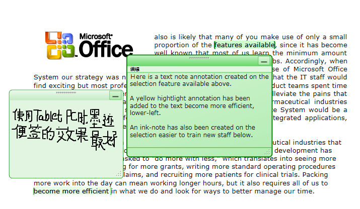
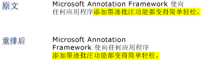

# 批注概述Annotations Overview
在纸质文档上编写说明或注释毫不稀奇，我们几乎认为这是理所当然的。Writing notes or comments on paper documents is such a commonplace activity that we almost take it for granted. 这些说明或注释就是“批注”，我们将其添加到文档，用于标注信息或突出显示兴趣项以供日后参考。These notes or comments are "annotations" that we add to a document to flag information or to highlight items of interest for later reference. 虽然在打印文档上编写注释很简单也很平常，但是就算在所有电子文档上添加个人注释，功能上却通常有很多限制。Although writing notes on printed documents is easy and commonplace, the ability to add personal comments to electronic documents is typically very limited, if available at all.  
  
 本主题介绍几种常见类型的批注，重点介绍便笺和突出显示，并举例说明 [!INCLUDE[TLA#tla_caf](../../../../includes/tlasharptla-caf-md.md)] 如何通过 [!INCLUDE[TLA#tla_wpf](../../../../includes/tlasharptla-wpf-md.md)] 文档查看控件简化在应用程序中使用这些类型的批注。This topic reviews several common types of annotations, specifically sticky notes and highlights, and illustrates how the [!INCLUDE[TLA#tla_caf](../../../../includes/tlasharptla-caf-md.md)] facilitates these types of annotations in applications through the [!INCLUDE[TLA#tla_wpf](../../../../includes/tlasharptla-wpf-md.md)] document viewing controls.  [!INCLUDE[TLA2#tla_wpf](../../../../includes/tla2sharptla-wpf-md.md)]支持注释的文档查看控件包括<xref:System.Windows.Controls.FlowDocumentReader>和<xref:System.Windows.Controls.FlowDocumentScrollViewer>、 以及控件派生自<xref:System.Windows.Controls.Primitives.DocumentViewerBase>如<xref:System.Windows.Controls.DocumentViewer>和<xref:System.Windows.Controls.FlowDocumentPageViewer>。 document viewing controls that support annotations include <xref:System.Windows.Controls.FlowDocumentReader> and <xref:System.Windows.Controls.FlowDocumentScrollViewer>, as well as controls derived from <xref:System.Windows.Controls.Primitives.DocumentViewerBase> such as <xref:System.Windows.Controls.DocumentViewer> and <xref:System.Windows.Controls.FlowDocumentPageViewer>.  
  
  
   
## 便笺Sticky Notes  
 平常的便笺是将信息写在小块彩纸上，随后将这张彩纸“粘贴”到文档。A typical sticky note contains information written on a small piece of colored paper that is then "stuck" to a document. 数字便笺为电子文档提供类似的功能，但灵活性更高，可包括许多其他类型的内容，如键入文本、手写注释（如 [!INCLUDE[TLA#tla_tpc](../../../../includes/tlasharptla-tpc-md.md)]“墨迹”笔划）或 Web 链接。Digital sticky notes provide similar functionality for electronic documents, but with the added flexibility to include many other types of content such as typed text, handwritten notes (for example, [!INCLUDE[TLA#tla_tpc](../../../../includes/tlasharptla-tpc-md.md)] "ink" strokes), or Web links.  
  
 下图显示了突出显示、文本便笺以及墨迹便笺批注的一些示例。The following illustration shows some examples of highlight, text sticky note, and ink sticky note annotations.  
  
   
  
 下面的示例演示了可用于在应用程序中启用批注支持的方法。The following example shows the method that you can use to enable annotation support in your application.  
  
 [!code-csharp[DocViewerAnnotationsXml#DocViewXmlStartAnnotations](../../../../samples/snippets/csharp/VS_Snippets_Wpf/DocViewerAnnotationsXml/CSharp/Window1.xaml.cs#docviewxmlstartannotations)]
 [!code-vb[DocViewerAnnotationsXml#DocViewXmlStartAnnotations](../../../../samples/snippets/visualbasic/VS_Snippets_Wpf/DocViewerAnnotationsXml/visualbasic/window1.xaml.vb#docviewxmlstartannotations)]  
  
   
## 突出显示Highlights  
 当人们在纸质文档上作标记时，往往使用创造性的方法来突出显示兴趣项，例如对于句子中的某些字词，加下划线、高亮显示、圈出，或者将在空白的地方绘制标记或符号。People use creative methods to draw attention to items of interest when they mark up a paper document, such as underlining, highlighting, circling words in a sentence, or drawing marks or notations in the margin.  [!INCLUDE[TLA#tla_caf](../../../../includes/tlasharptla-caf-md.md)] 中的突出显示批注具有类似的功能，用于标记在 [!INCLUDE[TLA2#tla_wpf](../../../../includes/tla2sharptla-wpf-md.md)] 文档查看控件中显示的信息。Highlight annotations in [!INCLUDE[TLA#tla_caf](../../../../includes/tlasharptla-caf-md.md)] provide a similar feature for marking up information displayed in [!INCLUDE[TLA2#tla_wpf](../../../../includes/tla2sharptla-wpf-md.md)] document viewing controls.  
  
 下图演示了一个突出显示批注的示例。The following illustration shows an example of a highlight annotation.  
  
   
  
 用户通常通过首先选择一些文本或感兴趣的项，然后右键单击以显示创建批注<xref:System.Windows.Controls.ContextMenu>的批注选项。Users typically create annotations by first selecting some text or an item of interest, and then right-clicking to display a <xref:System.Windows.Controls.ContextMenu> of annotation options.  下面的示例演示[!INCLUDE[TLA#tla_xaml](../../../../includes/tlasharptla-xaml-md.md)]可用于声明<xref:System.Windows.Controls.ContextMenu>使用用户可以访问创建和管理批注的路由命令。The following example shows the [!INCLUDE[TLA#tla_xaml](../../../../includes/tlasharptla-xaml-md.md)] you can use to declare a <xref:System.Windows.Controls.ContextMenu> with routed commands that users can access to create and manage annotations.  
  
 [!code-xaml[DocViewerAnnotationsXps#CreateDeleteAnnotations](../../../../samples/snippets/csharp/VS_Snippets_Wpf/DocViewerAnnotationsXps/CSharp/Window1.xaml#createdeleteannotations)]  
  
   
## 数据锚定Data Anchoring  
 [!INCLUDE[TLA2#tla_caf](../../../../includes/tla2sharptla-caf-md.md)] 将批注与用户选择的数据绑定，而不仅仅是绑定到显示视图中的某个位置。The [!INCLUDE[TLA2#tla_caf](../../../../includes/tla2sharptla-caf-md.md)] binds annotations to the data that the user selects, not just to a position on the display view. 因此，如果文档视图更改（例如，当用户滚动显示窗口或者调整其大小时），批注将仍然跟随它绑定到的所选数据。Therefore, if the document view changes, such as when the user scrolls or resizes the display window, the annotation stays with the data selection to which it is bound. 例如，下图显示了用户在所选文本上做的批注。For example, the following graphic illustrates an annotation that the user has made on a text selection. 当文档视图更改时（滚动、调整大小、缩放或者移动），突出显示批注将与最初所选数据一起移动。When the document view changes (scrolls, resizes, scales, or otherwise moves), the highlight annotation moves with the original data selection.  
  
   
  
   
## 匹配批注与批注对象Matching Annotations with Annotated Objects  
 你可以将批注与对应的批注对象匹配。You can match annotations with the corresponding annotated objects. 以具有注释窗格的简单文档读取器应用程序为例。For example, consider a simple document reader application that has a comments pane. 注释窗格可能是一个列表框，用于显示锚定到文档的批注列表的文本。The comments pane might be a list box that displays the text from a list of annotations that are anchored to a document. 如果用户在列表框中选择一项，应用程序将显示相应的批注对象所锚定到的文档段落。If the user selects an item in the list box, then the application brings into view the paragraph in the document that the corresponding annotation object is anchored to.  
  
 下面的示例演示如何实现充当注释窗格的此类列表框的事件处理程序。The following example demonstrates how to implement the event handler of such a list box that serves as the comments pane.  
  
 [!code-csharp[FlowDocumentAnnotatedViewer#Handler](../../../../samples/snippets/csharp/VS_Snippets_Wpf/FlowDocumentAnnotatedViewer/CSharp/Window1.xaml.cs#handler)]
 [!code-vb[FlowDocumentAnnotatedViewer#Handler](../../../../samples/snippets/visualbasic/VS_Snippets_Wpf/FlowDocumentAnnotatedViewer/visualbasic/window1.xaml.vb#handler)]  
  
 另一个示例方案涉及到实现的批注和粘滞便笺文档通过电子邮件的读取者之间交换的应用程序。Another example scenario involves applications that enable the exchange of annotations and sticky notes between document readers through email. 凭借此功能，这些应用程序可以将读取器导航到包含要交换的批注的页面。This feature enables these applications to navigate the reader to the page that contains the annotation that is being exchanged.  
  
## 请参阅See Also  
 <xref:System.Windows.Controls.Primitives.DocumentViewerBase>  
 <xref:System.Windows.Controls.DocumentViewer>  
 <xref:System.Windows.Controls.FlowDocumentPageViewer>  
 <xref:System.Windows.Controls.FlowDocumentScrollViewer>  
 <xref:System.Windows.Controls.FlowDocumentReader>  
 <xref:System.Windows.Annotations.IAnchorInfo>  
 [注释架构Annotations Schema](../../../../docs/framework/wpf/advanced/annotations-schema.md)  
 [ContextMenu 概述ContextMenu Overview](../../../../docs/framework/wpf/controls/contextmenu-overview.md)  
 [命令概述Commanding Overview](../../../../docs/framework/wpf/advanced/commanding-overview.md)  
 [流文档概述Flow Document Overview](../../../../docs/framework/wpf/advanced/flow-document-overview.md)  
 [如何：将命令添加到菜单项How to: Add a Command to a MenuItem](http://msdn.microsoft.com/library/013d68a0-5373-4a68-bd91-5de574307370)
