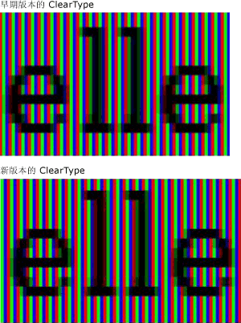
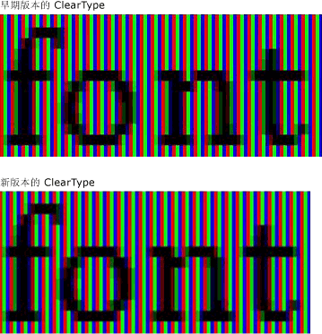
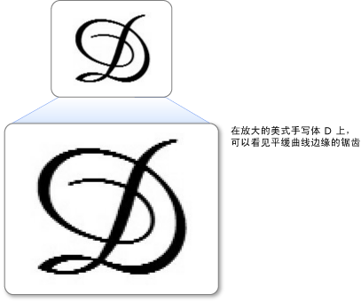
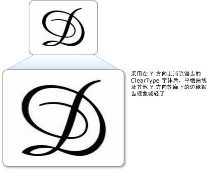

# ClearType 概述
本主题对 [!INCLUDE[TLA#tla_winclient](../../../../includes/tlasharptla-winclient-md.md)] 中的 [!INCLUDE[TLA#tla_ct](../../../../includes/tlasharptla-ct-md.md)] 技术进行了概述。  
  
  
   
## 技术概述  
 [!INCLUDE[TLA2#tla_ct](../../../../includes/tla2sharptla-ct-md.md)] 是一种由 [!INCLUDE[TLA#tla_ms](../../../../includes/tlasharptla-ms-md.md)] 开发的软件技术，可提高现有 LCD（液晶显示器，如笔记本电脑屏幕、Pocket PC 屏幕和平板显示器）上文本的可读性。  [!INCLUDE[TLA2#tla_ct](../../../../includes/tla2sharptla-ct-md.md)] 在工作时访问 LCD 屏幕中每个像素的各个垂直色条元素。 在 [!INCLUDE[TLA2#tla_ct](../../../../includes/tla2sharptla-ct-md.md)] 之前，计算机可以显示的最小级别的细节是一个像素，但是有了在 LCD 显示器上运行的 [!INCLUDE[TLA2#tla_ct](../../../../includes/tla2sharptla-ct-md.md)]，我们现在显示的文本特征可以小到一个像素宽度的一部分。 超高的分辨率增加了文本显示中细节的清晰度，使其更便于长时间阅读。  
  
 [!INCLUDE[TLA#tla_winclient](../../../../includes/tlasharptla-winclient-md.md)] 中提供的 [!INCLUDE[TLA2#tla_ct](../../../../includes/tla2sharptla-ct-md.md)] 是最新一代的 [!INCLUDE[TLA2#tla_ct](../../../../includes/tla2sharptla-ct-md.md)]，该版本相对于 [!INCLUDE[TLA#tla_gdi](../../../../includes/tlasharptla-gdi-md.md)] 中提供的版本有了若干项改进。  
  
   
## 子像素定位  
 与之前的 [!INCLUDE[TLA2#tla_ct](../../../../includes/tla2sharptla-ct-md.md)] 版本相比，该版本的一项重大改进是使用了子像素定位。 与 [!INCLUDE[TLA2#tla_gdi](../../../../includes/tla2sharptla-gdi-md.md)] 中找到的 [!INCLUDE[TLA2#tla_ct](../../../../includes/tla2sharptla-ct-md.md)] 实现不同，[!INCLUDE[TLA#tla_winclient](../../../../includes/tlasharptla-winclient-md.md)] 中找到的 [!INCLUDE[TLA2#tla_ct](../../../../includes/tla2sharptla-ct-md.md)] 允许字形在像素内启动，而不仅仅是像素的起始边界。 由于在定位字形时的这种超高的分辨率，字形的间距和比例更加精确和一致。  
  
 以下两个示例演示了使用子像素定位时，字形如何从任意子像素边界处开始。 左侧示例使用的是较早版本的 [!INCLUDE[TLA2#tla_ct](../../../../includes/tla2sharptla-ct-md.md)] 呈现器，该呈现器没有采用子像素定位。 右侧示例使用的是新版本的 [!INCLUDE[TLA2#tla_ct](../../../../includes/tla2sharptla-ct-md.md)] 呈现器，该呈现器使用了子像素定位。 请注意右侧图像中的每个 **e** 和 **l** 的呈现方式稍有不同，因为每一个字母都开始于一个不同的子像素。 在屏幕上以正常尺寸查看文本时，由于字形图像的高对比度，这种差异并不明显。 因为 [!INCLUDE[TLA2#tla_ct](../../../../includes/tla2sharptla-ct-md.md)] 中采用了复杂的颜色筛选，所以才能看出此差异。  
  
   
使用较早和较晚版本的 ClearType 显示的文本  
  
 以下两个示例将较早的 [!INCLUDE[TLA2#tla_ct](../../../../includes/tla2sharptla-ct-md.md)] 呈现器与新版本的 [!INCLUDE[TLA2#tla_ct](../../../../includes/tla2sharptla-ct-md.md)] 呈现器的输出进行比较。 右侧显示的子像素定位显著改善了屏幕上的字体间距，尤其是在较小尺寸处，子像素与整个像素之间的差异在很大程度上代表了字形宽度。 请注意，第二张图中字母之间的间距更均匀。 子像素定位不断提升文本屏幕的整体外观效果，代表了 [!INCLUDE[TLA2#tla_ct](../../../../includes/tla2sharptla-ct-md.md)] 技术的重大进步。  
  
   
使用较早和较晚版本的 ClearType 显示的文本  
  
   
## Y 方向抗锯齿功能  
 [!INCLUDE[TLA#tla_winclient](../../../../includes/tlasharptla-winclient-md.md)] 中的 [!INCLUDE[TLA2#tla_ct](../../../../includes/tla2sharptla-ct-md.md)] 的另一个改进是 y 方向抗锯齿功能。 [!INCLUDE[TLA2#tla_gdi](../../../../includes/tla2sharptla-gdi-md.md)] 中的 [!INCLUDE[TLA2#tla_ct](../../../../includes/tla2sharptla-ct-md.md)] 没有 y 方向抗锯齿功能，它能在 x 轴方向提供更好的分辨率，但在 y 轴方向不行。 在平缓曲线的顶部和底部，锯齿状边缘会降低其可读性。  
  
 以下示例演示了没有 y 方向抗锯齿功能的效果。 在这个示例中，字母顶部和底部的锯齿状边缘非常明显。  
  
   
平缓曲线上有粗糙边缘的文本  
  
 [!INCLUDE[TLA#tla_winclient](../../../../includes/tlasharptla-winclient-md.md)] 中的 [!INCLUDE[TLA2#tla_ct](../../../../includes/tla2sharptla-ct-md.md)] 提供 y 方向的抗锯齿功能，可以使任何锯齿状边缘变得平滑。 这对于提高东亚语言的可读性特别重要，在东亚语言中，表意文字的水平和垂直平缓曲线几乎同样多。  
  
 以下示例演示了 y 方向抗锯齿功能的效果。 在这个示例中，字母顶部和底部对曲线较为平滑。  
  
   
采用 ClearType y 向抗锯齿的文本  
  
   
## 硬件加速  
 [!INCLUDE[TLA#tla_winclient](../../../../includes/tlasharptla-winclient-md.md)] 中的 [!INCLUDE[TLA2#tla_ct](../../../../includes/tla2sharptla-ct-md.md)] 可以利用硬件加速来提高性能，并减少 CPU 负载和系统内存需求。 通过使用像素着色器和图形卡的视频内存，[!INCLUDE[TLA2#tla_ct](../../../../includes/tla2sharptla-ct-md.md)] 可以更快呈现文本，特别是使用动画时。  
  
 [!INCLUDE[TLA#tla_winclient](../../../../includes/tlasharptla-winclient-md.md)] 中的 [!INCLUDE[TLA2#tla_ct](../../../../includes/tla2sharptla-ct-md.md)] 不会修改系统范围的 [!INCLUDE[TLA2#tla_ct](../../../../includes/tla2sharptla-ct-md.md)] 设置。 在 [!INCLUDE[TLA#tla_mswin](../../../../includes/tlasharptla-mswin-md.md)] 中禁用 [!INCLUDE[TLA2#tla_ct](../../../../includes/tla2sharptla-ct-md.md)] 会将 [!INCLUDE[TLA#tla_winclient](../../../../includes/tlasharptla-winclient-md.md)] 抗锯齿功能设置为灰度模式。 此外，[!INCLUDE[TLA#tla_winclient](../../../../includes/tlasharptla-winclient-md.md)] 中的 [!INCLUDE[TLA2#tla_ct](../../../../includes/tla2sharptla-ct-md.md)] 不会修改 [ClearType 调谐器 PowerToy](https://www.microsoft.com/typography/ClearTypePowerToy.mspx) 的设置。  
  
 [!INCLUDE[TLA#tla_winclient](../../../../includes/tlasharptla-winclient-md.md)] 体系结构设计决策之一是让不依赖于分辨率的布局更好地支持较高分辨率的 DPI 显示器，这种显示器正在日益普及。 此决策的后果是 [!INCLUDE[TLA#tla_winclient](../../../../includes/tlasharptla-winclient-md.md)] 不支持某些东亚字体中抗锯齿的文本呈现或位图，因为它们都依赖于分辨率。  
  
   
## 其他信息  
 [ClearType 信息](https://www.microsoft.com/typography/ClearTypeInfo.mspx)  
  
 [ClearType 调谐器 PowerToy](https://www.microsoft.com/typography/ClearTypePowerToy.mspx)  
  
## 请参阅  
 [ClearType 注册表设置](../../../../docs/framework/wpf/advanced/cleartype-registry-settings.md)
