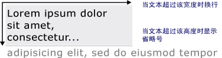

# 绘制格式化文本Drawing Formatted Text
本主题提供的功能的概述<xref:System.Windows.Media.FormattedText>对象。This topic provides an overview of the features of the <xref:System.Windows.Media.FormattedText> object. 此对象为在 [!INCLUDE[TLA#tla_winclient](../../../../includes/tlasharptla-winclient-md.md)] 应用程序中绘制文本提供低级别控制。This object provides low-level control for drawing text in [!INCLUDE[TLA#tla_winclient](../../../../includes/tlasharptla-winclient-md.md)] applications.  
  
  
## 技术概述Technology Overview  
 <xref:System.Windows.Media.FormattedText>对象允许你绘制多行文本，在其中每个字符文本中的可以单独设置格式。The <xref:System.Windows.Media.FormattedText> object allows you to draw multi-line text, in which each character in the text can be individually formatted. 下例演示应用了多种格式的文本。The following example shows text that has several formats applied to it.  
  
   
使用 FormattedText 方法显示的文本Displayed text using FormattedText method  
  
> [!NOTE]
>  对于从 [!INCLUDE[TLA#tla_win32](../../../../includes/tlasharptla-win32-md.md)] API 迁移的开发人员，[Win32 迁移](#win32_migration)一节中的表列出了 [!INCLUDE[TLA#tla_win32](../../../../includes/tlasharptla-win32-md.md)] DrawText 标志和 [!INCLUDE[TLA#tla_winclient](../../../../includes/tlasharptla-winclient-md.md)] 中的近似等效项。For those developers migrating from the [!INCLUDE[TLA#tla_win32](../../../../includes/tlasharptla-win32-md.md)] API, the table in the [Win32 Migration](#win32_migration) section lists the [!INCLUDE[TLA#tla_win32](../../../../includes/tlasharptla-win32-md.md)] DrawText flags and the approximate equivalent in [!INCLUDE[TLA#tla_winclient](../../../../includes/tlasharptla-winclient-md.md)].  
  
### 使用格式化文本的原因Reasons for Using Formatted Text  
 [!INCLUDE[TLA2#tla_winclient](../../../../includes/tla2sharptla-winclient-md.md)] 包括多个用于在屏幕中绘制文本的控件。 includes multiple controls for drawing text to the screen. 每个控件都面向不同的方案，并具有自己的功能和限制列表。Each control is targeted to a different scenario and has its own list of features and limitations. 一般情况下，<xref:System.Windows.Controls.TextBlock>有限的文本支持是必需的如中的简短句子时应使用元素[!INCLUDE[TLA#tla_ui](../../../../includes/tlasharptla-ui-md.md)]。In general, the <xref:System.Windows.Controls.TextBlock> element should be used when limited text support is required, such as a brief sentence in a [!INCLUDE[TLA#tla_ui](../../../../includes/tlasharptla-ui-md.md)]. <xref:System.Windows.Controls.Label>可在时极少的文字支持是必需的。<xref:System.Windows.Controls.Label> can be used when minimal text support is required. 有关详细信息，请参阅 [WPF 中的文档](../../../../docs/framework/wpf/advanced/documents-in-wpf.md)。For more information, see [Documents in WPF](../../../../docs/framework/wpf/advanced/documents-in-wpf.md).  
  
 <xref:System.Windows.Media.FormattedText>对象提供了更大的文本格式功能比[!INCLUDE[TLA#tla_winclient](../../../../includes/tlasharptla-winclient-md.md)]文本控件，并在你想要将文本用作装饰性元素的情况下可能很有用。The <xref:System.Windows.Media.FormattedText> object provides greater text formatting features than [!INCLUDE[TLA#tla_winclient](../../../../includes/tlasharptla-winclient-md.md)] text controls, and can be useful in cases where you want to use text as a decorative element. 有关详细信息，请参阅下一节[将格式化文本转换为几何图形](#converting_formatted_text)。For more information, see the following section [Converting Formatted Text to a Geometry](#converting_formatted_text).  
  
 此外，<xref:System.Windows.Media.FormattedText>对象可用于创建面向文本的<xref:System.Windows.Media.DrawingVisual>-派生的对象。In addition, the <xref:System.Windows.Media.FormattedText> object is useful for creating text-oriented <xref:System.Windows.Media.DrawingVisual>-derived objects. <xref:System.Windows.Media.DrawingVisual>是用于呈现形状、 图像或文本的轻量绘制类。<xref:System.Windows.Media.DrawingVisual> is a lightweight drawing class that is used to render shapes, images, or text. 有关详细信息，请参阅[使用 DrawingVisuals 执行测试示例](http://go.microsoft.com/fwlink/?LinkID=159994)。For more information, see [Hit Test Using DrawingVisuals Sample](http://go.microsoft.com/fwlink/?LinkID=159994).  
  
## 使用 FormattedText 对象Using the FormattedText Object  
 若要创建带格式的文本，请调用<xref:System.Windows.Media.FormattedText.%23ctor%2A>构造函数来创建<xref:System.Windows.Media.FormattedText>对象。To create formatted text, call the <xref:System.Windows.Media.FormattedText.%23ctor%2A> constructor to create a <xref:System.Windows.Media.FormattedText> object. 创建初始格式化文本字符串后，便可应用某一范围的格式样式。Once you have created the initial formatted text string, you can apply a range of formatting styles.  
  
 使用<xref:System.Windows.Media.FormattedText.MaxTextWidth%2A>属性可以将约束到特定的宽度的文本。Use the <xref:System.Windows.Media.FormattedText.MaxTextWidth%2A> property to constrain the text to a specific width. 文本将自动换行，避免超过指定宽度。The text will automatically wrap to avoid exceeding the specified width. 使用<xref:System.Windows.Media.FormattedText.MaxTextHeight%2A>属性来限制为特定高度的文本。Use the <xref:System.Windows.Media.FormattedText.MaxTextHeight%2A> property to constrain the text to a specific height. 超过指定高度的文本将显示一个省略号“…”。The text will display an ellipsis, "…" for the text that exceeds the specified height.  
  
   
显示自动换行和省略号的文本Displayed text showing wordwrapping and ellipsis  
  
 可向一个或多个字符应用多种格式样式。You can apply multiple formatting styles to one or more characters. 例如，您可以调用<xref:System.Windows.Media.FormattedText.SetFontSize%2A>和<xref:System.Windows.Media.FormattedText.SetForegroundBrush%2A>方法来更改格式设置的文本中的前五个字符。For example, you could call both the <xref:System.Windows.Media.FormattedText.SetFontSize%2A> and <xref:System.Windows.Media.FormattedText.SetForegroundBrush%2A> methods to change the formatting of the first five characters in the text.  
  
 下面的代码示例创建<xref:System.Windows.Media.FormattedText>对象，然后将几种格式设置样式应用于的文本。The following code example creates a <xref:System.Windows.Media.FormattedText> object and then applies several formatting styles to the text.  
  
 [!code-csharp[FormattedTextSnippets#FormattedTextSnippets1](../../../../samples/snippets/csharp/VS_Snippets_Wpf/FormattedTextSnippets/CSharp/Window1.xaml.cs#formattedtextsnippets1)]
 [!code-vb[FormattedTextSnippets#FormattedTextSnippets1](../../../../samples/snippets/visualbasic/VS_Snippets_Wpf/FormattedTextSnippets/visualbasic/window1.xaml.vb#formattedtextsnippets1)]  
  
### 字号度量单位Font Size Unit of Measure  
 中的其他文本对象与[!INCLUDE[TLA#tla_winclient](../../../../includes/tlasharptla-winclient-md.md)]应用程序，<xref:System.Windows.Media.FormattedText>对象使用作为度量单位的独立于设备的像素为单位。As with other text objects in [!INCLUDE[TLA#tla_winclient](../../../../includes/tlasharptla-winclient-md.md)] applications, the <xref:System.Windows.Media.FormattedText> object uses device-independent pixels as the unit of measure. 但是，大多数 [!INCLUDE[TLA#tla_win32](../../../../includes/tlasharptla-win32-md.md)] 应用程序使用点作为度量单位。However, most [!INCLUDE[TLA#tla_win32](../../../../includes/tlasharptla-win32-md.md)] applications use points as the unit of measure. 如果要在 [!INCLUDE[TLA#tla_winclient](../../../../includes/tlasharptla-winclient-md.md)] 应用程序中以点为单位显示文本，需要将 [!INCLUDE[TLA#tla_dipixel#plural](../../../../includes/tlasharptla-dipixelsharpplural-md.md)] 转换为点。If you want to use display text in units of points in [!INCLUDE[TLA#tla_winclient](../../../../includes/tlasharptla-winclient-md.md)] applications, you need to convert [!INCLUDE[TLA#tla_dipixel#plural](../../../../includes/tlasharptla-dipixelsharpplural-md.md)] to points. 以下代码示例演示如何执行此转换。The following code example shows how to perform this conversion.  
  
 [!code-csharp[FormattedTextSnippets#FormattedTextSnippets2](../../../../samples/snippets/csharp/VS_Snippets_Wpf/FormattedTextSnippets/CSharp/Window1.xaml.cs#formattedtextsnippets2)]
 [!code-vb[FormattedTextSnippets#FormattedTextSnippets2](../../../../samples/snippets/visualbasic/VS_Snippets_Wpf/FormattedTextSnippets/visualbasic/window1.xaml.vb#formattedtextsnippets2)]  
  
   
### 将格式化文本转换为几何图形Converting Formatted Text to a Geometry  
 你可以将转换到的格式化的文本<xref:System.Windows.Media.Geometry>对象，使你可以创建其他类型的直观地关注的文本。You can convert formatted text into <xref:System.Windows.Media.Geometry> objects, allowing you to create other types of visually interesting text. 例如，你可以创建<xref:System.Windows.Media.Geometry>对象基于轮廓的文本字符串。For example, you could create a <xref:System.Windows.Media.Geometry> object based on the outline of a text string.  
  
   
使用线性渐变画笔的文本轮廓Text outline using a linear gradient brush  
  
 以下示例说明了几种通过修改已转换文本的笔划、填充和突出显示来创建悦目的视觉效果的方法。The following examples illustrate several ways of creating interesting visual effects by modifying the stroke, fill, and highlight of converted text.  
  
   
将笔划和填充设置为不同颜色的示例Example of setting stroke and fill to different colors  
  
   
笔划应用了图像画笔的示例Example of an image brush applied to the stroke  
  
   
笔划和突出显示应用了图像画笔的示例Example of an image brush applied to the stroke and highlight  
  
 当文本转换为<xref:System.Windows.Media.Geometry>对象，它不再是字符的集合，无法修改的文本字符串中的字符。When text is converted to a <xref:System.Windows.Media.Geometry> object, it is no longer a collection of characters—you cannot modify the characters in the text string. 但是，可修改已转换文本的笔划和填充属性，以此来影响该文本的外观。However, you can affect the appearance of the converted text by modifying its stroke and fill properties. 笔划是指已转换文本的轮廓；填充是指已转换文本的轮廓的内部区域。The stroke refers to the outline of the converted text; the fill refers to the area inside the outline of the converted text. 有关详细信息，请参阅[创建轮廓文本](../../../../docs/framework/wpf/advanced/how-to-create-outlined-text.md)。For more information, see [Create Outlined Text](../../../../docs/framework/wpf/advanced/how-to-create-outlined-text.md).  
  
 此外可以将转换到的格式化的文本<xref:System.Windows.Media.PathGeometry>对象，并突出显示文本中使用此对象。You can also convert formatted text to a <xref:System.Windows.Media.PathGeometry> object, and use the object for highlighting the text. 例如，可以应用到动画<xref:System.Windows.Media.PathGeometry>对象，以便让此动画沿着轮廓的带格式的文本。For example, you could apply an animation to the <xref:System.Windows.Media.PathGeometry> object so that the animation follows the outline of the formatted text.  
  
 下面的示例演示已转换为的格式化的文本<xref:System.Windows.Media.PathGeometry>对象。The following example shows formatted text that has been converted to a <xref:System.Windows.Media.PathGeometry> object. 经过动画处理的椭圆会沿着所呈现文本的笔划路径显示。An animated ellipse follows the path of the strokes of the rendered text.  
  
   
沿着文本路径几何图形运动的球Sphere following the path geometry of text  
  
 有关详细信息，请参阅[如何：为文本创建 PathGeometry 动画](http://msdn.microsoft.com/en-us/29f8051e-798a-463f-a926-a099a99e9c67)。For more information, see [How to: Create a PathGeometry Animation for Text](http://msdn.microsoft.com/en-us/29f8051e-798a-463f-a926-a099a99e9c67).  
  
 已转换为后，你可以创建其他有趣用于格式化文本<xref:System.Windows.Media.PathGeometry>对象。You can create other interesting uses for formatted text once it has been converted to a <xref:System.Windows.Media.PathGeometry> object. 例如，可剪辑视频，以便在格式化文本中显示。For example, you can clip video to display inside it.  
  
   
文本路径几何图形中的视频显示Video displaying in the path geometry of text  
  
   
## Win32 迁移Win32 Migration  
 功能<xref:System.Windows.Media.FormattedText>绘制文本的相近的功能的[!INCLUDE[TLA#tla_win32](../../../../includes/tlasharptla-win32-md.md)]DrawText 函数。The features of <xref:System.Windows.Media.FormattedText> for drawing text are similar to the features of the [!INCLUDE[TLA#tla_win32](../../../../includes/tlasharptla-win32-md.md)] DrawText function. 对于从 [!INCLUDE[TLA#tla_win32](../../../../includes/tlasharptla-win32-md.md)] API 迁移的开发人员，下表列出了 [!INCLUDE[TLA#tla_win32](../../../../includes/tlasharptla-win32-md.md)] DrawText 标志和 [!INCLUDE[TLA#tla_winclient](../../../../includes/tlasharptla-winclient-md.md)] 中的近似等效项。For those developers migrating from the [!INCLUDE[TLA#tla_win32](../../../../includes/tlasharptla-win32-md.md)] API, the following table lists the [!INCLUDE[TLA#tla_win32](../../../../includes/tlasharptla-win32-md.md)] DrawText flags and the approximate equivalent in [!INCLUDE[TLA#tla_winclient](../../../../includes/tlasharptla-winclient-md.md)].  
  
|DrawText 标志DrawText flag|WPF 等效项WPF equivalent|说明Notes|  
|-------------------|--------------------|-----------|  
|DT_BOTTOMDT_BOTTOM|<xref:System.Windows.Media.FormattedText.Height%2A>|使用<xref:System.Windows.Media.FormattedText.Height%2A>属性来计算适当[!INCLUDE[TLA#tla_win32](../../../../includes/tlasharptla-win32-md.md)]DrawText y 位置。Use the <xref:System.Windows.Media.FormattedText.Height%2A> property to compute an appropriate [!INCLUDE[TLA#tla_win32](../../../../includes/tlasharptla-win32-md.md)] DrawText 'y' position.|  
|DT_CALCRECTDT_CALCRECT|<xref:System.Windows.Media.FormattedText.Height%2A>, <xref:System.Windows.Media.FormattedText.Width%2A><xref:System.Windows.Media.FormattedText.Height%2A>, <xref:System.Windows.Media.FormattedText.Width%2A>|使用<xref:System.Windows.Media.FormattedText.Height%2A>和<xref:System.Windows.Media.FormattedText.Width%2A>属性来计算输出矩形。Use the <xref:System.Windows.Media.FormattedText.Height%2A> and <xref:System.Windows.Media.FormattedText.Width%2A> properties to calculate the output rectangle.|  
|DT_CENTERDT_CENTER|<xref:System.Windows.Media.FormattedText.TextAlignment%2A>|使用<xref:System.Windows.Media.FormattedText.TextAlignment%2A>属性值设置为<xref:System.Windows.TextAlignment.Center>。Use the <xref:System.Windows.Media.FormattedText.TextAlignment%2A> property with the value set to <xref:System.Windows.TextAlignment.Center>.|  
|DT_EDITCONTROLDT_EDITCONTROL|无None|不要求。Not required. 间距宽度和最后一行的呈现与框架编辑控件中的相同。Space width and last line rendering are the same as in the framework edit control.|  
|DT_END_ELLIPSISDT_END_ELLIPSIS|<xref:System.Windows.Media.FormattedText.Trimming%2A>|使用<xref:System.Windows.Media.FormattedText.Trimming%2A>属性的值<xref:System.Windows.TextTrimming.CharacterEllipsis>。Use the <xref:System.Windows.Media.FormattedText.Trimming%2A> property with the value <xref:System.Windows.TextTrimming.CharacterEllipsis>.   使用<xref:System.Windows.TextTrimming.WordEllipsis>获取[!INCLUDE[TLA#tla_win32](../../../../includes/tlasharptla-win32-md.md)]与 DT_WORD_ELIPSIS DT_END_ELLIPSIS 结束省略号 — 在这种情况下，字符省略号仅出现在单独的行不适合的单词。Use <xref:System.Windows.TextTrimming.WordEllipsis> to get [!INCLUDE[TLA#tla_win32](../../../../includes/tlasharptla-win32-md.md)] DT_END_ELLIPSIS with DT_WORD_ELIPSIS end ellipsis—in this case, character ellipsis only occurs on words that do not fit on a single line.|  
|DT_EXPAND_TABSDT_EXPAND_TABS|无None|不要求。Not required. 制表符自动扩展为在每 4 个 em 后停止，这大约为 8 个与语言无关的字符的宽度。Tabs are automatically expanded to stops every 4 ems, which is approximately the width of 8 language-independent characters.|  
|DT_EXTERNALLEADINGDT_EXTERNALLEADING|无None|不要求。Not required. 行距中始终包括外部间隙。External leading is always included in line spacing. 使用<xref:System.Windows.Media.FormattedText.LineHeight%2A>属性来创建用户定义的行距。Use the <xref:System.Windows.Media.FormattedText.LineHeight%2A> property to create user-defined line spacing.|  
|DT_HIDEPREFIXDT_HIDEPREFIX|无None|不支持。Not supported. 构造之前，删除 & 从字符串<xref:System.Windows.Media.FormattedText>对象。Remove the '&' from the string before constructing the <xref:System.Windows.Media.FormattedText> object.|  
|DT_LEFTDT_LEFT|<xref:System.Windows.Media.FormattedText.TextAlignment%2A>|这是默认文本对齐方式。This is the default text alignment. 使用<xref:System.Windows.Media.FormattedText.TextAlignment%2A>属性值设置为<xref:System.Windows.TextAlignment.Left>。Use the <xref:System.Windows.Media.FormattedText.TextAlignment%2A> property with the value set to <xref:System.Windows.TextAlignment.Left>. （仅限 WPF）(WPF only)|  
|DT_MODIFYSTRINGDT_MODIFYSTRING|无None|不支持。Not supported.|  
|DT_NOCLIPDT_NOCLIP|<xref:System.Windows.Media.Visual.VisualClip%2A>|剪辑不会自动发生。Clipping does not happen automatically. 如果你愿意剪辑文本，请使用<xref:System.Windows.Media.Visual.VisualClip%2A>属性。If you want to clip text, use the <xref:System.Windows.Media.Visual.VisualClip%2A> property.|  
|DT_NOFULLWIDTHCHARBREAKDT_NOFULLWIDTHCHARBREAK|无None|不支持。Not supported.|  
|DT_NOPREFIXDT_NOPREFIX|无None|不要求。Not required. 字符串中的“&”字符始终作为正常字符处理。The '&' character in strings is always treated as a normal character.|  
|DT_PATHELLIPSISDT_PATHELLIPSIS|无None|使用<xref:System.Windows.Media.FormattedText.Trimming%2A>属性的值<xref:System.Windows.TextTrimming.WordEllipsis>。Use the <xref:System.Windows.Media.FormattedText.Trimming%2A> property with the value <xref:System.Windows.TextTrimming.WordEllipsis>.|  
|DT_PREFIXDT_PREFIX|无None|不支持。Not supported. 如果你想要使用下划线的文本，快捷键或链接，例如使用<xref:System.Windows.Media.FormattedText.SetTextDecorations%2A>方法。If you want to use underscores for text, such as an accelerator key or link, use the <xref:System.Windows.Media.FormattedText.SetTextDecorations%2A> method.|  
|DT_PREFIXONLYDT_PREFIXONLY|无None|不支持。Not supported.|  
|DT_RIGHTDT_RIGHT|<xref:System.Windows.Media.FormattedText.TextAlignment%2A>|使用<xref:System.Windows.Media.FormattedText.TextAlignment%2A>属性值设置为<xref:System.Windows.TextAlignment.Right>。Use the <xref:System.Windows.Media.FormattedText.TextAlignment%2A> property with the value set to <xref:System.Windows.TextAlignment.Right>. （仅限 WPF）(WPF only)|  
|DT_RTLREADINGDT_RTLREADING|<xref:System.Windows.Media.FormattedText.FlowDirection%2A>|将 <xref:System.Windows.Media.FormattedText.FlowDirection%2A> 属性设置为 <xref:System.Windows.FlowDirection.RightToLeft>。Set the <xref:System.Windows.Media.FormattedText.FlowDirection%2A> property to <xref:System.Windows.FlowDirection.RightToLeft>.|  
|DT_SINGLELINEDT_SINGLELINE|无None|不要求。Not required. <xref:System.Windows.Media.FormattedText>对象的行为作为单个行控件，除非任一<xref:System.Windows.Media.FormattedText.MaxTextWidth%2A>设置属性或文本包含回车符/换行符 (CR/LF)。<xref:System.Windows.Media.FormattedText> objects behave as a single line control, unless either the <xref:System.Windows.Media.FormattedText.MaxTextWidth%2A> property is set or the text contains a carriage return/line feed (CR/LF).|  
|DT_TABSTOPDT_TABSTOP|无None|不支持用户定义的制表位位置。No support for user-defined tab stop positions.|  
|DT_TOPDT_TOP|<xref:System.Windows.Media.FormattedText.Height%2A>|不要求。Not required. 上对齐是默认设置。Top justification is the default. 可以使用定义其他垂直定位值<xref:System.Windows.Media.FormattedText.Height%2A>属性来计算适当[!INCLUDE[TLA#tla_win32](../../../../includes/tlasharptla-win32-md.md)]DrawText y 位置。Other vertical positioning values can be defined by using the <xref:System.Windows.Media.FormattedText.Height%2A> property to compute an appropriate [!INCLUDE[TLA#tla_win32](../../../../includes/tlasharptla-win32-md.md)] DrawText 'y' position.|  
|DT_VCENTERDT_VCENTER|<xref:System.Windows.Media.FormattedText.Height%2A>|使用<xref:System.Windows.Media.FormattedText.Height%2A>属性来计算适当[!INCLUDE[TLA#tla_win32](../../../../includes/tlasharptla-win32-md.md)]DrawText y 位置。Use the <xref:System.Windows.Media.FormattedText.Height%2A> property to compute an appropriate [!INCLUDE[TLA#tla_win32](../../../../includes/tlasharptla-win32-md.md)] DrawText 'y' position.|  
|DT_WORDBREAKDT_WORDBREAK|无None|不要求。Not required. 断字进行自动处理<xref:System.Windows.Media.FormattedText>对象。Word breaking happens automatically with <xref:System.Windows.Media.FormattedText> objects. 无法禁用它。You cannot disable it.|  
|DT_WORD_ELLIPSISDT_WORD_ELLIPSIS|<xref:System.Windows.Media.FormattedText.Trimming%2A>|使用<xref:System.Windows.Media.FormattedText.Trimming%2A>属性的值<xref:System.Windows.TextTrimming.WordEllipsis>。Use the <xref:System.Windows.Media.FormattedText.Trimming%2A> property with the value <xref:System.Windows.TextTrimming.WordEllipsis>.|  
  
## 请参阅See Also  
 <xref:System.Windows.Media.FormattedText>  
 [WPF 中的文档Documents in WPF](../../../../docs/framework/wpf/advanced/documents-in-wpf.md)  
 [WPF 中的版式Typography in WPF](../../../../docs/framework/wpf/advanced/typography-in-wpf.md)  
 [创建空心文本Create Outlined Text](../../../../docs/framework/wpf/advanced/how-to-create-outlined-text.md)  
 [如何：为文本创建 PathGeometry 动画How to: Create a PathGeometry Animation for Text](http://msdn.microsoft.com/en-us/29f8051e-798a-463f-a926-a099a99e9c67)
