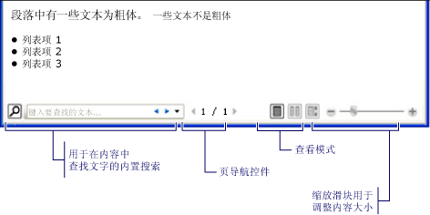
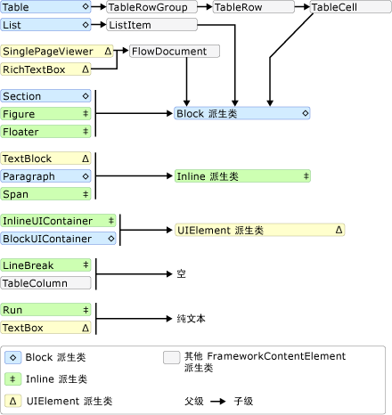
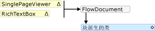
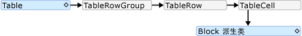
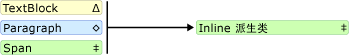

# 流文档概述Flow Document Overview
流文档旨在优化查看和可读性。Flow documents are designed to optimize viewing and readability. 流文档根据运行时变量（例如，窗口大小、设备分辨率和可选的用户首选项）来动态调整和重新排列内容，而不是设置为一个预定义的布局。Rather than being set to one predefined layout, flow documents dynamically adjust and reflow their content based on run-time variables such as window size, device resolution, and optional user preferences. 此外，流文档还提供一些高级文档功能，例如分页和分栏。In addition, flow documents offer advanced document features, such as pagination and columns. 本主题概述了流文档及其创建方式。This topic provides an overview of flow documents and how to create them.  

   
## 什么是流文档？What is a Flow Document  
 流文档旨在根据窗口大小、设备分辨率和其他环境变量来“重排内容”。A flow document is designed to "reflow content" depending on window size, device resolution, and other environment variables. 此外，流文档还具有很多内置功能，包括搜索、能够优化可读性的查看模式以及更改字体大小和外观的功能。In addition, flow documents have a number of built in features including search, viewing modes that optimize readability, and the ability to change the size and appearance of fonts. 当易读性是文档的主要使用要求时，最适合使用流文档。Flow Documents are best utilized when ease of reading is the primary document consumption scenario. 相反，固定文档旨在提供静态表示形式。In contrast, Fixed Documents are designed to have a static presentation. 当源内容的保真度至关重要时，就适合使用固定文档。Fixed Documents are useful when fidelity of the source content is essential. 请参阅[WPF 中的文档](documents-in-wpf.md)为不同类型的文档的详细信息。See [Documents in WPF](documents-in-wpf.md) for more information on different types of documents.  
  
 下图演示在多个不同大小的窗口中查看同一个示例流文档的情况。The following illustration shows a sample flow document viewed in several windows of different sizes. 随着显示区域的变化，内容将重新布局，以充分利用可用空间。As the display area changes, the content reflows to make the best use of the available space.  
  
   
  
 如上图所示，流内容可包括多个组成部分，包括段落、列表、图像等等。As seen in the image above, flow content can include many components including paragraphs, lists, images, and more. 这些组成部分对应于标记中的元素和程序代码中的对象。These components correspond to elements in markup and objects in procedural code. 我们将详细阐述中详细介绍这些类在更高版本[流相关的类](#flow_related_classes)本概述的部分。We will go over these classes in detail later in the [Flow Related Classes](#flow_related_classes) section of this overview. 现在，下面是一个简单的代码示例，创建一个包含部分粗体文本和列表的段落的流文档。For now, here is a simple code example that creates a flow document consisting of a paragraph with some bold text and a list.
  
 [!code-xaml[FlowOvwSnippets_snip#SimpleFlowExampleWholePage](~/samples/snippets/csharp/VS_Snippets_Wpf/FlowOvwSnippets_snip/CS/SimpleFlowExample.xaml#simpleflowexamplewholepage)]  
  
 [!code-csharp[FlowOvwSnippets_procedural_snip#SimpleFlowCodeOnlyExampleWholePage](~/samples/snippets/csharp/VS_Snippets_Wpf/FlowOvwSnippets_procedural_snip/CSharp/SimpleFlowExample.cs#simpleflowcodeonlyexamplewholepage)]
 [!code-vb[FlowOvwSnippets_procedural_snip#SimpleFlowCodeOnlyExampleWholePage](~/samples/snippets/visualbasic/VS_Snippets_Wpf/FlowOvwSnippets_procedural_snip/VisualBasic/SimpleFlowExample.vb#simpleflowcodeonlyexamplewholepage)]  
  
 下图显示了此代码片段。The illustration below shows what this code snippet looks like.  
  
   
  
 在此示例中，<xref:System.Windows.Controls.FlowDocumentReader>控件用于托管流内容。In this example, the <xref:System.Windows.Controls.FlowDocumentReader> control is used to host the flow content. 请参阅[流文档类型](#flow_document_types)有关流内容托管控件的详细信息。See [Flow Document Types](#flow_document_types) for more information on flow content hosting controls. <xref:System.Windows.Documents.Paragraph><xref:System.Windows.Documents.List>， <xref:System.Windows.Documents.ListItem>，和<xref:System.Windows.Documents.Bold>元素用于控制内容格式，根据其在标记中的顺序。, <xref:System.Windows.Documents.List>, <xref:System.Windows.Documents.ListItem>, and <xref:System.Windows.Documents.Bold> elements are used to control content formatting, based on their order in markup. 例如，<xref:System.Windows.Documents.Bold>元素跨越仅的段落中的文本的一部分; 因此，只有这一部分文本为粗体。For example, the <xref:System.Windows.Documents.Bold> element spans across only part of the text in the paragraph; as a result, only that part of the text is bold. 如果使用过 HTML，你就会了解这一点。If you have used HTML, this will be familiar to you.  
  
 上图中突出显示，有多个流文档中内置的功能：As highlighted in the illustration above, there are several features built into Flow Documents:
  
-   搜索:允许用户执行的整个文档的全文搜索。Search: Allows the user to perform a full text search of an entire document.  
  
-   查看模式：用户可以选择喜欢的查看模式包括单页 （页--一次） 查看模式、 两个---a-次一页 （书本阅读格式） 查看模式和连续滚动 （无界限） 查看模式。Viewing Mode: The user can select their preferred viewing mode including a single-page (page-at-a-time) viewing mode, a two-page-at-a-time (book reading format) viewing mode, and a continuous scrolling (bottomless) viewing mode.  有关这些查看模式的详细信息，请参阅<xref:System.Windows.Controls.FlowDocumentReaderViewingMode>。For more information about these viewing modes, see <xref:System.Windows.Controls.FlowDocumentReaderViewingMode>.  
  
-   页导航控件：如果文档的查看模式使用页面，页面导航控件包含一个按钮，用于跳转到下一页 （向下箭头） 或上一页 （向上箭头），以及当前页码和总页数的指示器。Page Navigation Controls: If the viewing mode of the document uses pages, the page navigation controls include a button to jump to the next page (the down arrow) or previous page (the up arrow), as well as indicators for the current page number and total number of pages. 也可使用键盘上的箭头键来实现翻页操作。Flipping through pages can also be accomplished using the keyboard arrow keys.  
  
-   缩放：缩放控件使用户能够增加或减少的缩放级别，单击加号或减号按钮，分别。Zoom: The zoom controls enable the user to increase or decrease the zoom level by clicking the plus or minus buttons, respectively. 缩放控件还包括一个用于调整缩放级别的滑块。The zoom controls also include a slider for adjusting the zoom level. 有关详细信息，请参阅 <xref:System.Windows.Controls.FlowDocumentReader.Zoom%2A>。For more information, see <xref:System.Windows.Controls.FlowDocumentReader.Zoom%2A>.  
  
 这些功能可根据用于托管流内容的控件进行修改。These features can be modified based upon the control used to host the flow content. 下一节介绍了各种控件。The next section describes the different controls.  
  
   
## 流文档类型Flow Document Types  
 流文档内容的显示和外观依赖于用于托管流内容的对象。Display of flow document content and how it appears is dependent upon what object is used to host the flow content. 有四个支持查看流内容的控件： <xref:System.Windows.Controls.FlowDocumentReader>， <xref:System.Windows.Controls.FlowDocumentPageViewer>， <xref:System.Windows.Controls.RichTextBox>，和<xref:System.Windows.Controls.FlowDocumentScrollViewer>。There are four controls that support viewing of flow content: <xref:System.Windows.Controls.FlowDocumentReader>, <xref:System.Windows.Controls.FlowDocumentPageViewer>, <xref:System.Windows.Controls.RichTextBox>, and <xref:System.Windows.Controls.FlowDocumentScrollViewer>. 下面简要介绍了这些控件。These controls are briefly described below.  
  
 **注意：** <xref:System.Windows.Documents.FlowDocument> ，则需要直接托管流内容，因此所有这些查看控件使用<xref:System.Windows.Documents.FlowDocument>若要启用流内容托管。**Note:**  <xref:System.Windows.Documents.FlowDocument> is required to directly host flow content, so all of these viewing controls consume a <xref:System.Windows.Documents.FlowDocument> to enable flow content hosting.
  
### FlowDocumentReaderFlowDocumentReader  
 <xref:System.Windows.Controls.FlowDocumentReader> 包括功能，让用户能够动态选择各种查看模式，包括单页 （页--一次） 查看模式、 两个---a-次一页 （书本阅读格式） 查看模式和连续滚动 （无界限） 查看模式。includes features that enable the user to dynamically choose between various viewing modes, including a single-page (page-at-a-time) viewing mode, a two-page-at-a-time (book reading format) viewing mode, and a continuous scrolling (bottomless) viewing mode. 有关这些查看模式的详细信息，请参阅<xref:System.Windows.Controls.FlowDocumentReaderViewingMode>。For more information about these viewing modes, see <xref:System.Windows.Controls.FlowDocumentReaderViewingMode>. 如果不需要进行不同查看模式之间动态切换的功能<xref:System.Windows.Controls.FlowDocumentPageViewer>和<xref:System.Windows.Controls.FlowDocumentScrollViewer>提供的轻量级流内容查看器中使用特定查看模式修复。If you do not need the ability to dynamically switch between different viewing modes, <xref:System.Windows.Controls.FlowDocumentPageViewer> and <xref:System.Windows.Controls.FlowDocumentScrollViewer> provide lighter-weight flow content viewers that are fixed in a particular viewing mode.  
  
### FlowDocumentPageViewer 和 FlowDocumentScrollViewerFlowDocumentPageViewer and FlowDocumentScrollViewer  
 <xref:System.Windows.Controls.FlowDocumentPageViewer> 显示的内容一次一页中查看模式，尽管<xref:System.Windows.Controls.FlowDocumentScrollViewer>以连续滚动模式显示内容。shows content in page-at-a-time viewing mode, while <xref:System.Windows.Controls.FlowDocumentScrollViewer> shows content in continuous scrolling mode. 这两<xref:System.Windows.Controls.FlowDocumentPageViewer>和<xref:System.Windows.Controls.FlowDocumentScrollViewer>都固定使用特定查看模式。Both <xref:System.Windows.Controls.FlowDocumentPageViewer> and <xref:System.Windows.Controls.FlowDocumentScrollViewer> are fixed to a particular viewing mode. 相比<xref:System.Windows.Controls.FlowDocumentReader>，包含的功能使用户能够动态选择各种查看模式 (由提供<xref:System.Windows.Controls.FlowDocumentReaderViewingMode>枚举)，但代价是多个资源占用量比<xref:System.Windows.Controls.FlowDocumentPageViewer>或<xref:System.Windows.Controls.FlowDocumentScrollViewer>。Compare to <xref:System.Windows.Controls.FlowDocumentReader>, which includes features that enable the user to dynamically choose between various viewing modes (as provided by the <xref:System.Windows.Controls.FlowDocumentReaderViewingMode> enumeration), at the cost of being more resource intensive than <xref:System.Windows.Controls.FlowDocumentPageViewer> or <xref:System.Windows.Controls.FlowDocumentScrollViewer>.  
  
 默认情况下，总是显示垂直滚动条，而水平滚动条则在需要时显示。By default, a vertical scrollbar is always shown, and a horizontal scrollbar becomes visible if needed. 默认值为 UI<xref:System.Windows.Controls.FlowDocumentScrollViewer>不包括工具栏; 但是，<xref:System.Windows.Controls.FlowDocumentScrollViewer.IsToolBarVisible%2A>属性可以用于启用内置工具栏。The default UI for <xref:System.Windows.Controls.FlowDocumentScrollViewer> does not include a toolbar; however, the <xref:System.Windows.Controls.FlowDocumentScrollViewer.IsToolBarVisible%2A> property can be used to enable a built-in toolbar.  
  
### RichTextBoxRichTextBox  
 您使用<xref:System.Windows.Controls.RichTextBox>当你想要允许用户编辑流内容。You use a <xref:System.Windows.Controls.RichTextBox> when you want to allow the user to edit flow content. 例如，如果你想要创建一种编辑器，允许用户处理表、 斜体和粗体格式等，将使用<xref:System.Windows.Controls.RichTextBox>。For example, if you wanted to create an editor that allowed a user to manipulate things like tables, italic and bold formatting, etc, you would use a <xref:System.Windows.Controls.RichTextBox>. 请参阅[RichTextBox 概述](../controls/richtextbox-overview.md)有关详细信息。See [RichTextBox Overview](../controls/richtextbox-overview.md) for more information.  
  
 **注意：** 内部的流内容<xref:System.Windows.Controls.RichTextBox>不符的其他控件中包含的流内容与完全相同。**Note:** Flow content inside a <xref:System.Windows.Controls.RichTextBox> does not behave exactly like flow content contained in other controls. 例如，有中的没有列<xref:System.Windows.Controls.RichTextBox>并因此没有自动调整大小行为。For example, there are no columns in a <xref:System.Windows.Controls.RichTextBox> and hence no automatic resizing behavior. 另外，通常内置的功能，例如搜索、 查看模式、 页面导航和缩放的流内容的不能在<xref:System.Windows.Controls.RichTextBox>。Also, the typically built in features of flow content like search, viewing mode, page navigation, and zoom are not available within a <xref:System.Windows.Controls.RichTextBox>.  
  
   
## 创建流内容Creating Flow Content  
 流内容可能很复杂并包含各种元素，包括文本、 图像、 表、 甚至<xref:System.Windows.UIElement>派生的类，如控件。Flow content can be complex, consisting of various elements including text, images, tables, and even <xref:System.Windows.UIElement> derived classes like controls. 若要了解如何创建复杂流内容，掌握下列知识点非常关键：To understand how to create complex flow content, the following points are critical:  
  
-   **与流相关的类**:在流内容中使用每个类都有特定用途。**Flow-related Classes**: Each class used in flow content has a specific purpose. 此外，了解各种流类之间的层次关系有助于了解其使用方式。In addition, the hierarchical relation between flow classes helps you understand how they are used. 例如，类派生自<xref:System.Windows.Documents.Block>类用于包含其他对象，而类派生自<xref:System.Windows.Documents.Inline>包含显示的对象。For example, classes derived from the <xref:System.Windows.Documents.Block> class are used to contain other objects while classes derived from <xref:System.Windows.Documents.Inline> contain objects that are displayed.  
  
-   **内容架构**:流文档可能需要大量嵌套元素。**Content Schema**: A flow document can require a substantial number of nested elements. 内容架构指定了元素之间可能存在的父/子关系。The content schema specifies possible parent/child relationships between elements.  
  
 以下各节详细介绍了上述每个方面。The following sections will go over each of these areas in more detail.  
  
   
## 与流相关的类Flow Related Classes  
 下图演示了流内容中最常使用的对象：The diagram below shows the objects most typically used with flow content:  
  
   
  
 根据流内容的用途，可分为两个重要类别：For the purposes of flow content, there are two important categories:  
  
1.  **Block 派生类**:也称为"Block 内容元素"或简称为"块元素"。**Block-derived classes**: Also called "Block content elements" or just "Block Elements". 继承元素<xref:System.Windows.Documents.Block>可以在一个公共父级下的元素进行分组或将公用特性应用于组。Elements that inherit from <xref:System.Windows.Documents.Block> can be used to group elements under a common parent or to apply common attributes to a group.  
  
2.  **Inline 派生类**:也称为"Inline 内容元素"或简称为"内联元素"。**Inline-derived classes**: Also called "Inline content elements" or just "Inline Elements". 继承元素<xref:System.Windows.Documents.Inline>或者包含在是块元素或另一个 Inline 元素。Elements that inherit from <xref:System.Windows.Documents.Inline> are either contained within a Block Element or another Inline Element. Inline 元素通常用作在屏幕上呈现的内容的直接容器。Inline Elements are often used as the direct container of content that is rendered to the screen. 例如， <xref:System.Windows.Documents.Paragraph> （Block 元素） 可以包含<xref:System.Windows.Documents.Run>（Inline 元素），但<xref:System.Windows.Documents.Run>实际包含屏幕呈现的文本。For example, a <xref:System.Windows.Documents.Paragraph> (Block Element) can contain a <xref:System.Windows.Documents.Run> (Inline Element) but the <xref:System.Windows.Documents.Run> actually contains the text that is rendered on the screen.  
  
 下面简要介绍了这两个类别中的每个类。Each class in these two categories is briefly described below.  
  
### Block 派生类Block-derived Classes  
 **段落Paragraph**  
  
 <xref:System.Windows.Documents.Paragraph> 常用于将内容分组到一个段落。is typically used to group content into a paragraph. Paragraph 的最简单且最常见的用途是创建文本段落。The simplest and most common use of Paragraph is to create a paragraph of text.  
  
 [!code-xaml[FlowOvwSnippets_snip#ParagraphExampleWholePage](~/samples/snippets/csharp/VS_Snippets_Wpf/FlowOvwSnippets_snip/CS/ParagraphExample.xaml#paragraphexamplewholepage)]  
  
 [!code-csharp[FlowOvwSnippets_procedural_snip#ParagraphCodeOnlyExampleWholePage](~/samples/snippets/csharp/VS_Snippets_Wpf/FlowOvwSnippets_procedural_snip/CSharp/ParagraphExample.cs#paragraphcodeonlyexamplewholepage)]
 [!code-vb[FlowOvwSnippets_procedural_snip#ParagraphCodeOnlyExampleWholePage](~/samples/snippets/visualbasic/VS_Snippets_Wpf/FlowOvwSnippets_procedural_snip/VisualBasic/ParagraphExample.vb#paragraphcodeonlyexamplewholepage)]  
  
 但是，正如您将看到如下，还可以包含其他 inline 派生元素。However, you can also contain other inline-derived elements as you will see below. 
  
 **节Section**  
  
 <xref:System.Windows.Documents.Section> 仅用于包含其他<xref:System.Windows.Documents.Block>-派生元素。is used only to contain other <xref:System.Windows.Documents.Block>-derived elements. 它不会向其中包含的元素应用任何默认格式。It does not apply any default formatting to the elements it contains. 但是，任何属性值集上<xref:System.Windows.Documents.Section>适用于其子元素。However, any property values set on a <xref:System.Windows.Documents.Section> applies to its child elements. 使用节能够以编程方式循环访问其子集合。A section also enables you to programmatically iterate through its child collection. <xref:System.Windows.Documents.Section> 中到类似的方式使用\<d i V > 以 html 格式的标记。is used in a similar manner to the \
 tag in HTML.  
  
 在下面的示例中，三个段落定义一个下<xref:System.Windows.Documents.Section>。In the example below, three paragraphs are defined under one <xref:System.Windows.Documents.Section>. 本部分包含<xref:System.Windows.Documents.TextElement.Background%2A>属性值 Red，因此段落的背景色也是红色。The section has a <xref:System.Windows.Documents.TextElement.Background%2A> property value of Red, therefore the background color of the paragraphs is also red.  
  
 [!code-xaml[FlowOvwSnippets_snip#SectionExampleWholePage](~/samples/snippets/csharp/VS_Snippets_Wpf/FlowOvwSnippets_snip/CS/SectionExample.xaml#sectionexamplewholepage)]  
  
 [!code-csharp[FlowOvwSnippets_procedural_snip#SectionCodeOnlyExampleWholePage](~/samples/snippets/csharp/VS_Snippets_Wpf/FlowOvwSnippets_procedural_snip/CSharp/SectionExample.cs#sectioncodeonlyexamplewholepage)]
 [!code-vb[FlowOvwSnippets_procedural_snip#SectionCodeOnlyExampleWholePage](~/samples/snippets/visualbasic/VS_Snippets_Wpf/FlowOvwSnippets_procedural_snip/VisualBasic/SectionExample.vb#sectioncodeonlyexamplewholepage)]  
  
 **BlockUIContainerBlockUIContainer**  
  
 <xref:System.Windows.Documents.BlockUIContainer> 使<xref:System.Windows.UIElement>元素 (即<xref:System.Windows.Controls.Button>) 能够嵌入到区块派生的流内容。enables <xref:System.Windows.UIElement> elements (i.e. a <xref:System.Windows.Controls.Button>) to be embedded  in block-derived flow content. <xref:System.Windows.Documents.InlineUIContainer> （见下文） 用于将嵌入<xref:System.Windows.UIElement>内联派生的流内容中的元素。(see below) is used to embed <xref:System.Windows.UIElement> elements in inline-derived flow content. <xref:System.Windows.Documents.BlockUIContainer> 并<xref:System.Windows.Documents.InlineUIContainer>非常重要，因为没有其他方法来使用<xref:System.Windows.UIElement>在流内容，除非它包含在这两个元素之一中。and <xref:System.Windows.Documents.InlineUIContainer> are important because there is no other way to use a <xref:System.Windows.UIElement> in flow content unless it is contained within one of these two elements.  
  
 下面的示例演示如何使用<xref:System.Windows.Documents.BlockUIContainer>元素来承载<xref:System.Windows.UIElement>流内容内的对象。The following example shows how to use the <xref:System.Windows.Documents.BlockUIContainer> element to host <xref:System.Windows.UIElement> objects within flow content.  
  
 [!code-xaml[SpanSnippets#_BlockUIXAML](~/samples/snippets/csharp/VS_Snippets_Wpf/SpanSnippets/CSharp/Window1.xaml#_blockuixaml)]  
  
 下图显示了此示例的呈现效果：The following figure shows how this example renders:  
  
   
  
 **列表List**  
  
 <xref:System.Windows.Documents.List> 用于创建项目符号列表或数值列表。is used to create a bulleted or numeric list. 设置<xref:System.Windows.Documents.List.MarkerStyle%2A>属性设置为<xref:System.Windows.TextMarkerStyle>枚举值，以确定列表的样式。Set the <xref:System.Windows.Documents.List.MarkerStyle%2A> property to a <xref:System.Windows.TextMarkerStyle> enumeration value to determine the style of the list. 下例演示了如何创建简单列表。The example below shows how to create a simple list.  
  
 [!code-xaml[FlowOvwSnippets_snip#ListExampleWholePage](~/samples/snippets/csharp/VS_Snippets_Wpf/FlowOvwSnippets_snip/CS/ListExample.xaml#listexamplewholepage)]  
  
 [!code-csharp[FlowOvwSnippets_procedural_snip#ListCodeOnlyExampleWholePage](~/samples/snippets/csharp/VS_Snippets_Wpf/FlowOvwSnippets_procedural_snip/CSharp/ListExample.cs#listcodeonlyexamplewholepage)]
 [!code-vb[FlowOvwSnippets_procedural_snip#ListCodeOnlyExampleWholePage](~/samples/snippets/visualbasic/VS_Snippets_Wpf/FlowOvwSnippets_procedural_snip/VisualBasic/ListExample.vb#listcodeonlyexamplewholepage)]  
  
 **注意：** <xref:System.Windows.Documents.List>是使用的唯一流元素<xref:System.Windows.Documents.ListItemCollection>来管理子元素。**Note:** <xref:System.Windows.Documents.List> is the only flow element that uses the <xref:System.Windows.Documents.ListItemCollection> to manage child elements.  
  
 **表Table**  
  
 <xref:System.Windows.Documents.Table> 用于创建表。is used to create a table. <xref:System.Windows.Documents.Table> 类似于<xref:System.Windows.Controls.Grid>元素，但它会提供更多功能，因此，需要更大的资源开销。is similar to the <xref:System.Windows.Controls.Grid> element but it has more capabilities and, therefore, requires greater resource overhead. 因为<xref:System.Windows.Controls.Grid>是<xref:System.Windows.UIElement>，除非它包含在不能在流内容中使用它<xref:System.Windows.Documents.BlockUIContainer>或<xref:System.Windows.Documents.InlineUIContainer>。Because <xref:System.Windows.Controls.Grid> is a <xref:System.Windows.UIElement>, it cannot be used in flow content unless it is contained in a <xref:System.Windows.Documents.BlockUIContainer> or <xref:System.Windows.Documents.InlineUIContainer>. 有关详细信息<xref:System.Windows.Documents.Table>，请参阅[表概述](table-overview.md)。For more information on <xref:System.Windows.Documents.Table>, see [Table Overview](table-overview.md).  
  
### Inline 派生类Inline-derived Classes  
 **运行Run**  
  
 <xref:System.Windows.Documents.Run> 用于包含无格式的文本。is used to contain unformatted text. 您所料<xref:System.Windows.Documents.Run>对象中广泛使用流内容。You might expect <xref:System.Windows.Documents.Run> objects to be used extensively in flow content. 但是，在标记中，<xref:System.Windows.Documents.Run>元素不需要显式使用。However, in markup, <xref:System.Windows.Documents.Run> elements are not required to be used explicitly. <xref:System.Windows.Documents.Run> 需要创建或使用代码操作流文档时使用。is required to be used when creating or manipulating flow documents by using code. 例如，在以下第一个标记<xref:System.Windows.Documents.Paragraph>指定<xref:System.Windows.Documents.Run>不明确时第二个元素。For example, in the markup below, the first <xref:System.Windows.Documents.Paragraph> specifies the <xref:System.Windows.Documents.Run> element explicitly while the second does not. 这两个段落生成相同的输出。Both paragraphs generate identical output.  
  
 [!code-xaml[FlowOvwSnippets_snip#RunExample1](~/samples/snippets/csharp/VS_Snippets_Wpf/FlowOvwSnippets_snip/CS/RunSnippetsExample.xaml#runexample1)]  
  
 **注意：** 在中启动[!INCLUDE[net_v40_short](../../../../includes/net-v40-short-md.md)]，则<xref:System.Windows.Documents.Run.Text%2A>属性的<xref:System.Windows.Documents.Run>对象是依赖项属性。**Note:**  Starting in the [!INCLUDE[net_v40_short](../../../../includes/net-v40-short-md.md)], the <xref:System.Windows.Documents.Run.Text%2A> property of the <xref:System.Windows.Documents.Run> object is a dependency property. 可以将绑定<xref:System.Windows.Documents.Run.Text%2A>属性设置为数据源，如<xref:System.Windows.Controls.TextBlock>。You can bind the <xref:System.Windows.Documents.Run.Text%2A> property to a data source, such as a <xref:System.Windows.Controls.TextBlock>. <xref:System.Windows.Documents.Run.Text%2A>属性完全支持单向绑定。The <xref:System.Windows.Documents.Run.Text%2A> property fully supports one-way binding. <xref:System.Windows.Documents.Run.Text%2A>属性还支持双向绑定，除<xref:System.Windows.Controls.RichTextBox>。The <xref:System.Windows.Documents.Run.Text%2A> property also supports two-way binding, except for <xref:System.Windows.Controls.RichTextBox>. 有关示例，请参见 <xref:System.Windows.Documents.Run.Text%2A?displayProperty=nameWithType>。For an example, see <xref:System.Windows.Documents.Run.Text%2A?displayProperty=nameWithType>.  
  
 **s p a nSpan**  
  
 <xref:System.Windows.Documents.Span> 其他内联内容元素组合在一起。groups other inline content elements together. 中的内容应用任何继承呈现<xref:System.Windows.Documents.Span>元素。No inherent rendering is applied to content within a <xref:System.Windows.Documents.Span> element. 但是，元素的继承自<xref:System.Windows.Documents.Span>包括<xref:System.Windows.Documents.Hyperlink>， <xref:System.Windows.Documents.Bold>，<xref:System.Windows.Documents.Italic>和<xref:System.Windows.Documents.Underline>是否将格式应用于文本。However, elements that inherit from <xref:System.Windows.Documents.Span> including <xref:System.Windows.Documents.Hyperlink>, <xref:System.Windows.Documents.Bold>, <xref:System.Windows.Documents.Italic> and <xref:System.Windows.Documents.Underline> do apply formatting to text.  
  
 下面是举例<xref:System.Windows.Documents.Span>正在用于包含内联内容包括文本、<xref:System.Windows.Documents.Bold>元素，和一个<xref:System.Windows.Controls.Button>。Below is an example of a <xref:System.Windows.Documents.Span> being used to contain inline content including text, a <xref:System.Windows.Documents.Bold> element, and a <xref:System.Windows.Controls.Button>.  
  
 [!code-xaml[FlowOvwSnippets_snip#SpanExampleWholePage](~/samples/snippets/csharp/VS_Snippets_Wpf/FlowOvwSnippets_snip/CS/SpanExample.xaml#spanexamplewholepage)]  
  
 下面的屏幕截图显示了此示例的呈现效果。The following screenshot shows how this example renders.  
  
   
  
 **InlineUIContainerInlineUIContainer**  
  
 <xref:System.Windows.Documents.InlineUIContainer> 使<xref:System.Windows.UIElement>元素 (即控件喜欢<xref:System.Windows.Controls.Button>) 能够嵌入到<xref:System.Windows.Documents.Inline>内容元素。enables <xref:System.Windows.UIElement> elements (i.e. a control like <xref:System.Windows.Controls.Button>) to be embedded in an <xref:System.Windows.Documents.Inline> content element. 此元素是等效的 inline<xref:System.Windows.Documents.BlockUIContainer>上面所述。This element is the inline equivalent to <xref:System.Windows.Documents.BlockUIContainer> described above. 下面是使用一个示例<xref:System.Windows.Documents.InlineUIContainer>插入<xref:System.Windows.Controls.Button>中的以内联方式<xref:System.Windows.Documents.Paragraph>。Below is an example that uses <xref:System.Windows.Documents.InlineUIContainer> to insert a <xref:System.Windows.Controls.Button> inline in a <xref:System.Windows.Documents.Paragraph>.  
  
 [!code-xaml[FlowOvwSnippets_snip#InlineUIContainerExampleWholePage](~/samples/snippets/csharp/VS_Snippets_Wpf/FlowOvwSnippets_snip/CS/InlineUIContainerExample.xaml#inlineuicontainerexamplewholepage)]  
  
 [!code-csharp[FlowOvwSnippets_procedural_snip#InlineUIContainerCodeOnlyExampleWholePage](~/samples/snippets/csharp/VS_Snippets_Wpf/FlowOvwSnippets_procedural_snip/CSharp/InlineUIContainerExample.cs#inlineuicontainercodeonlyexamplewholepage)]
 [!code-vb[FlowOvwSnippets_procedural_snip#InlineUIContainerCodeOnlyExampleWholePage](~/samples/snippets/visualbasic/VS_Snippets_Wpf/FlowOvwSnippets_procedural_snip/VisualBasic/InlineUIContainerExample.vb#inlineuicontainercodeonlyexamplewholepage)]  
  
 **注意：** <xref:System.Windows.Documents.InlineUIContainer>不需要在标记中显式使用。**Note:** <xref:System.Windows.Documents.InlineUIContainer> does not need to be used explicitly in markup. 如果省略，<xref:System.Windows.Documents.InlineUIContainer>仍将创建编译代码。If you omit it, an <xref:System.Windows.Documents.InlineUIContainer> will be created anyway when the code is compiled.  
  
 **Figure 和 FloaterFigure and Floater**  
  
 <xref:System.Windows.Documents.Figure> 和<xref:System.Windows.Documents.Floater>用于在流文档中嵌入内容，带有可进行自定义独立于主内容流的位置属性。and <xref:System.Windows.Documents.Floater> are used to embed content in Flow Documents with placement properties that can be customized independent of the primary content flow. <xref:System.Windows.Documents.Figure> 或<xref:System.Windows.Documents.Floater>元素通常用于突出显示或强调部分的内容，到主机的支持图像或其他内容中的主内容流，或用于插入松散相关内容，例如广告。or <xref:System.Windows.Documents.Floater> elements are often used to highlight or accentuate portions of content, to host supporting images or other content within the main content flow, or to inject loosely related content such as advertisements.  
  
 下面的示例演示如何嵌入<xref:System.Windows.Documents.Figure>到一个段落的文本。The following example shows how to embed a <xref:System.Windows.Documents.Figure> into a paragraph of text.  
  
 [!code-xaml[FlowOvwSnippets_snip#FigureExampleWholePage](~/samples/snippets/csharp/VS_Snippets_Wpf/FlowOvwSnippets_snip/CS/FigureExample.xaml#figureexamplewholepage)]  
  
 [!code-csharp[FlowOvwSnippets_procedural_snip#FigureCodeOnlyExampleWholePage](~/samples/snippets/csharp/VS_Snippets_Wpf/FlowOvwSnippets_procedural_snip/CSharp/FigureExample.cs#figurecodeonlyexamplewholepage)]
 [!code-vb[FlowOvwSnippets_procedural_snip#FigureCodeOnlyExampleWholePage](~/samples/snippets/visualbasic/VS_Snippets_Wpf/FlowOvwSnippets_procedural_snip/VisualBasic/FigureExample.vb#figurecodeonlyexamplewholepage)]  
  
 下图显示了此示例的呈现效果。The following illustration shows how this example renders.  
  
   
  
 <xref:System.Windows.Documents.Figure> 和<xref:System.Windows.Documents.Floater>在几个方面存在差异，并可用于不同的方案。and <xref:System.Windows.Documents.Floater> differ in several ways and are used for different scenarios.  
  
 **图：Figure:**  
  
-   可定位：您可以设置其水平和垂直定位点，以停放它相对于页面、 内容、 列或段落。Can be positioned: You can set its horizontal and vertical anchors to dock it relative to the page, content, column or paragraph. 此外可以使用其<xref:System.Windows.Documents.Figure.HorizontalOffset%2A>和<xref:System.Windows.Documents.Figure.VerticalOffset%2A>属性以指定任意偏移量。You can also use its <xref:System.Windows.Documents.Figure.HorizontalOffset%2A> and <xref:System.Windows.Documents.Figure.VerticalOffset%2A> properties to specify arbitrary offsets.  
  
-   是到多个列可调整大小：可以设置<xref:System.Windows.Documents.Figure>高度和宽度设置为页面、 内容或列的高度或宽度的倍数。Is sizable to more than one column: You can set <xref:System.Windows.Documents.Figure> height and width to multiples of page, content or column height or width. 请注意，对于页面和内容，倍数不能大于 1。Note that in the case of page and content, multiples greater than 1 are not allowed. 例如，可以设置的宽度<xref:System.Windows.Documents.Figure>"页面的 0.5"或"0.25 content"或"2 列"。For example, you can set the width of a <xref:System.Windows.Documents.Figure> to be "0.5 page" or "0.25 content" or "2 Column". 还可将高度和宽度设置为绝对像素值。You can also set height and width to absolute pixel values.  
  
-   不分页：如果中的内容<xref:System.Windows.Documents.Figure>不适合在<xref:System.Windows.Documents.Figure>，它会呈现能够容纳的内容和其余内容将丢失Does not paginate: If the content inside a <xref:System.Windows.Documents.Figure> does not fit inside the <xref:System.Windows.Documents.Figure>, it will render whatever content does fit and the remaining content is lost  
  
 **浮标：Floater:**  
  
-   无法定位，可在能够为其提供空间的任何位置呈现。Cannot be positioned and will render wherever space can be made available for it. 不能设置偏移量或定位点<xref:System.Windows.Documents.Floater>。You cannot set the offset or anchor a <xref:System.Windows.Documents.Floater>.  
  
-   不能进行大小调整为多个列：默认情况下，<xref:System.Windows.Documents.Floater>在一列的大小。Cannot be sized to more than one column: By default, <xref:System.Windows.Documents.Floater> sizes at one column. 它具有<xref:System.Windows.Documents.Floater.Width%2A>一列大小为可以设置为绝对像素值，但如果此值大于一个列宽忽略它并将浮动对象的属性。It has a <xref:System.Windows.Documents.Floater.Width%2A> property that can be set to an absolute pixel value, but if this value is greater than one column width it is ignored and the floater is sized at one column. 您可以其大小设置为小于 1 个列宽设置正确的像素宽度，但大小不是列相关，因此"0.5 倍栏宽"不是有效的表达式<xref:System.Windows.Documents.Floater>宽度。You can size it to less than one column by setting the correct pixel width, but sizing is not column-relative, so "0.5Column" is not a valid expression for <xref:System.Windows.Documents.Floater> width. <xref:System.Windows.Documents.Floater> 没有高度属性，因此它无法设置高度、 其高度取决于内容has no height property and it's height cannot be set, it’s height depends on the content  
  
-   <xref:System.Windows.Documents.Floater> 对此进行分页：如果指定宽度其内容扩展到多个列高度，浮标会断开，并显示下一列、 下一页等。paginates: If its content at its specified width extends to more than 1 column height, floater breaks and paginates to the next column, the next page, etc.  
  
 <xref:System.Windows.Documents.Figure> 是的最好的独立内容你想要控制的大小和定位，并且可以确信内容适合指定的大小。is a good place to put standalone content where you want to control the size and positioning, and are confident that the content will fit in the specified size. <xref:System.Windows.Documents.Floater> 是将更多自由流动的内容流类似于主页面内容，但相分离的好时机。is a good place to put more free-flowing content that flows similar to the main page content, but is separated from it.  
  
 **LineBreakLineBreak**  
  
 <xref:System.Windows.Documents.LineBreak> 导致换行符在流内容中发生。causes a line break to occur in flow content. 以下示例演示了 <xref:System.Windows.Documents.LineBreak> 的用法。The following example demonstrates the use of <xref:System.Windows.Documents.LineBreak>.  
  
 [!code-xaml[FlowOvwSnippets_snip#LineBreakExampleWholePage](~/samples/snippets/csharp/VS_Snippets_Wpf/FlowOvwSnippets_snip/CS/LineBreakExample.xaml#linebreakexamplewholepage)]  
  
 下面的屏幕截图显示了此示例的呈现效果。The following screenshot shows how this example renders.  
  
   
  
### 流集合元素Flow Collection Elements  
 中的许多示例以上<xref:System.Windows.Documents.BlockCollection>和<xref:System.Windows.Documents.InlineCollection>用于以编程方式构造流内容。In many of the examples above, the <xref:System.Windows.Documents.BlockCollection> and <xref:System.Windows.Documents.InlineCollection> are used to construct flow content programmatically. 例如，若要将元素添加到<xref:System.Windows.Documents.Paragraph>，可以使用语法：For example, to add elements to a <xref:System.Windows.Documents.Paragraph>, you can use the syntax:  
  
 `…`  
  
 `myParagraph.Inlines.Add(new Run("Some text"));`  
  
 `…`  
  
 这将添加<xref:System.Windows.Documents.Run>到<xref:System.Windows.Documents.InlineCollection>的<xref:System.Windows.Documents.Paragraph>。This adds a <xref:System.Windows.Documents.Run> to the <xref:System.Windows.Documents.InlineCollection> of the <xref:System.Windows.Documents.Paragraph>.  这是相同的隐式<xref:System.Windows.Documents.Run>内找到<xref:System.Windows.Documents.Paragraph>标记中：This is the same as the implicit <xref:System.Windows.Documents.Run> found inside a <xref:System.Windows.Documents.Paragraph> in markup:  
  
 `…`  
  
 `<Paragraph>`  
  
 `Some Text`  
  
 `</Paragraph>`  
  
 `…`  
  
 例如，使用<xref:System.Windows.Documents.BlockCollection>，下面的示例创建一个新<xref:System.Windows.Documents.Section>，然后使用**添加**方法将添加一个新<xref:System.Windows.Documents.Paragraph>到<xref:System.Windows.Documents.Section>内容。As an example of using the <xref:System.Windows.Documents.BlockCollection>, the following example creates a new <xref:System.Windows.Documents.Section> and then uses the **Add** method to add a new <xref:System.Windows.Documents.Paragraph> to the <xref:System.Windows.Documents.Section> contents.  
  
 [!code-csharp[FlowDocumentSnippets#_SectionBlocksAdd](~/samples/snippets/csharp/VS_Snippets_Wpf/FlowDocumentSnippets/CSharp/Window1.xaml.cs#_sectionblocksadd)]
 [!code-vb[FlowDocumentSnippets#_SectionBlocksAdd](~/samples/snippets/visualbasic/VS_Snippets_Wpf/FlowDocumentSnippets/visualbasic/window1.xaml.vb#_sectionblocksadd)]  
  
 除向流集合中添加项之外，还可以移除项。In addition to adding items to a flow collection, you can remove items as well.  以下示例删除上次<xref:System.Windows.Documents.Inline>中的元素<xref:System.Windows.Documents.Span>。The following example deletes the last <xref:System.Windows.Documents.Inline> element in the <xref:System.Windows.Documents.Span>.  
  
 [!code-csharp[SpanSnippets#_SpanInlinesRemoveLast](~/samples/snippets/csharp/VS_Snippets_Wpf/SpanSnippets/CSharp/Window1.xaml.cs#_spaninlinesremovelast)]
 [!code-vb[SpanSnippets#_SpanInlinesRemoveLast](~/samples/snippets/visualbasic/VS_Snippets_Wpf/SpanSnippets/visualbasic/window1.xaml.vb#_spaninlinesremovelast)]  
  
 以下示例清除所有内容 (<xref:System.Windows.Documents.Inline>元素) 从<xref:System.Windows.Documents.Span>。The following example clears all of the contents (<xref:System.Windows.Documents.Inline> elements) from the <xref:System.Windows.Documents.Span>.  
  
 [!code-csharp[SpanSnippets#_SpanInlinesClear](~/samples/snippets/csharp/VS_Snippets_Wpf/SpanSnippets/CSharp/Window1.xaml.cs#_spaninlinesclear)]
 [!code-vb[SpanSnippets#_SpanInlinesClear](~/samples/snippets/visualbasic/VS_Snippets_Wpf/SpanSnippets/visualbasic/window1.xaml.vb#_spaninlinesclear)]  
  
 以编程方式使用流内容时，可能会广泛使用这些集合。When working with flow content programmatically, you will likely make extensive use of these collections.  
  
 流元素是使用是否<xref:System.Windows.Documents.InlineCollection>（内联） 或<xref:System.Windows.Documents.BlockCollection>（块） 来包含其子元素取决于子元素的类型 (<xref:System.Windows.Documents.Block>或<xref:System.Windows.Documents.Inline>) 可以包含在父级。Whether a flow element uses an <xref:System.Windows.Documents.InlineCollection> (Inlines) or <xref:System.Windows.Documents.BlockCollection> (Blocks) to contain its child elements depends on what type of child elements (<xref:System.Windows.Documents.Block> or <xref:System.Windows.Documents.Inline>) can be contained by the parent. 下一节中的内容架构中概述了流内容元素的包容规则。Containment rules for flow content elements are summarized in the content schema in the next section.  
  
 **注意：** 没有一种类型的集合可用于流内容<xref:System.Windows.Documents.ListItemCollection>，但此集合仅适用于<xref:System.Windows.Documents.List>。**Note:** There is a third type of collection used with flow content, the <xref:System.Windows.Documents.ListItemCollection>, but this collection is only used with a <xref:System.Windows.Documents.List>. 此外，还有多个集合可用于<xref:System.Windows.Documents.Table>。In addition, there are several collections used with <xref:System.Windows.Documents.Table>. 请参阅[表概述](table-overview.md)有关详细信息。See [Table Overview](table-overview.md) for more information.  
  
   
## 内容架构Content Schema  
 不同流内容元素的数量是如此之多，因此了解某个元素可包含的子元素类型非常困难。Given the number of different flow content elements, it can be overwhelming to keep track of what type of child elements an element can contain. 下面的关系图概述了流元素的包容规则。The diagram below summarizes the containment rules for flow elements. 箭头表示可能存在的父/子关系。The arrows represent the possible parent/child relationships.  
  
   
  
 从上面的关系图可以看出，元素的子级不一定由它是否<xref:System.Windows.Documents.Block>元素或<xref:System.Windows.Documents.Inline>元素。As can be seen from the diagram above, the children allowed for an element are not necessarily determined by whether it is a <xref:System.Windows.Documents.Block> element or an <xref:System.Windows.Documents.Inline> element. 例如， <xref:System.Windows.Documents.Span> (<xref:System.Windows.Documents.Inline>元素) 只能有<xref:System.Windows.Documents.Inline>子元素，而<xref:System.Windows.Documents.Figure>(还<xref:System.Windows.Documents.Inline>元素) 只能有<xref:System.Windows.Documents.Block>子元素。For example, a <xref:System.Windows.Documents.Span> (an <xref:System.Windows.Documents.Inline> element) can only have <xref:System.Windows.Documents.Inline> child elements while a <xref:System.Windows.Documents.Figure> (also an <xref:System.Windows.Documents.Inline> element) can only have <xref:System.Windows.Documents.Block> child elements. 因此，关系图可用于快速确定哪些元素可以包含在其他元素中。Therefore, a diagram is useful for quickly determining what element can be contained in another. 例如，让我们使用关系图来确定如何构造流内容的<xref:System.Windows.Controls.RichTextBox>。As an example, let's use the diagram to determine how to construct the flow content of a <xref:System.Windows.Controls.RichTextBox>.  
  
 **1.** 一个<xref:System.Windows.Controls.RichTextBox>必须包含<xref:System.Windows.Documents.FlowDocument>又必须包含<xref:System.Windows.Documents.Block>-派生的对象。**1.** A <xref:System.Windows.Controls.RichTextBox> must contain a <xref:System.Windows.Documents.FlowDocument> which in turn must contain a <xref:System.Windows.Documents.Block>-derived object. 下面是上述关系图中的对应部分。Below is the corresponding segment from the diagram above.  
  
   
  
 到此为止，标记可能类似于所示内容。Thus far, this is what the markup might look like.  
  
 [!code-xaml[FlowOvwSnippets_snip#SchemaWalkThrough1](~/samples/snippets/csharp/VS_Snippets_Wpf/FlowOvwSnippets_snip/CS/MiscSnippets.xaml#schemawalkthrough1)]  
  
 **2.** 根据关系图中，有几个<xref:System.Windows.Documents.Block>元素可供选择包括<xref:System.Windows.Documents.Paragraph>， <xref:System.Windows.Documents.Section>， <xref:System.Windows.Documents.Table>， <xref:System.Windows.Documents.List>，并<xref:System.Windows.Documents.BlockUIContainer>（请参阅上面的 Block 派生类）。**2.** According to the diagram, there are several <xref:System.Windows.Documents.Block> elements to choose from including <xref:System.Windows.Documents.Paragraph>, <xref:System.Windows.Documents.Section>, <xref:System.Windows.Documents.Table>, <xref:System.Windows.Documents.List>, and <xref:System.Windows.Documents.BlockUIContainer> (see Block-derived classes above). 假设我们想<xref:System.Windows.Documents.Table>。Let's say we want a <xref:System.Windows.Documents.Table>. 按照上面，该关系图<xref:System.Windows.Documents.Table>包含<xref:System.Windows.Documents.TableRowGroup>包含<xref:System.Windows.Documents.TableRow>元素，其中包含<xref:System.Windows.Documents.TableCell>元素包含<xref:System.Windows.Documents.Block>-派生的对象。According to the diagram above, a <xref:System.Windows.Documents.Table> contains a <xref:System.Windows.Documents.TableRowGroup> containing <xref:System.Windows.Documents.TableRow> elements, which contain <xref:System.Windows.Documents.TableCell> elements which contain a <xref:System.Windows.Documents.Block>-derived object. 下面是有关的对应部分<xref:System.Windows.Documents.Table>取自上述关系图。Below is the corresponding segment for <xref:System.Windows.Documents.Table> taken from the diagram above.  
  
   
  
 下面是对应的标记。Below is the corresponding markup.  
  
 [!code-xaml[FlowOvwSnippets_snip#SchemaWalkThrough2](~/samples/snippets/csharp/VS_Snippets_Wpf/FlowOvwSnippets_snip/CS/MiscSnippets.xaml#schemawalkthrough2)]  
  
 **3.** 同样，一个或多个<xref:System.Windows.Documents.Block>下需要元素<xref:System.Windows.Documents.TableCell>。**3.** Again, one or more <xref:System.Windows.Documents.Block> elements are required underneath a <xref:System.Windows.Documents.TableCell>. 为简单起见，在单元格内部放置一些文本。To make it simple, let's place some text inside the cell. 我们可以使用执行此类情况的操作<xref:System.Windows.Documents.Paragraph>与<xref:System.Windows.Documents.Run>元素。We can do this using a <xref:System.Windows.Documents.Paragraph> with a <xref:System.Windows.Documents.Run> element. 下面是显示的关系图中的对应部分<xref:System.Windows.Documents.Paragraph>花费<xref:System.Windows.Documents.Inline>元素，而<xref:System.Windows.Documents.Run>(<xref:System.Windows.Documents.Inline>元素) 只能采用纯文本。Below is the corresponding segments from the diagram showing that a <xref:System.Windows.Documents.Paragraph> can take an <xref:System.Windows.Documents.Inline> element and that a <xref:System.Windows.Documents.Run> (an <xref:System.Windows.Documents.Inline> element) can only take plain text.  
  
   
  
   
  
 下面是标记中的完整示例。Below is the entire example in markup.  
  
 [!code-xaml[FlowOvwSnippets_snip#SchemaExampleWholePage](~/samples/snippets/csharp/VS_Snippets_Wpf/FlowOvwSnippets_snip/CS/SchemaExample.xaml#schemaexamplewholepage)]  
  
   
## 自定义文本Customizing Text  
 通常，文本是流文档中最普遍的内容类型。Usually text is the most prevalent type of content in a flow document. 尽管上面介绍的对象可用于控制文本呈现方式的大多数方面，但本文还介绍了其他一些自定义文本的方法。Although the objects introduced above can be used to control most aspects of how text is rendered, there are some other methods for customizing text that is covered in this section.  
  
### 文本修饰Text Decorations  
 使用文本修饰，可向文本应用下划线、上划线、基线和删除线效果（请参见下图）。Text decorations allow you to apply the underline, overline, baseline, and strikethrough effects to text (see pictures below). 使用添加这些修饰<xref:System.Windows.Documents.Inline.TextDecorations%2A>由多个包括的对象公开的属性<xref:System.Windows.Documents.Inline>， <xref:System.Windows.Documents.Paragraph>， <xref:System.Windows.Controls.TextBlock>，和<xref:System.Windows.Controls.TextBox>。These decorations are added using the <xref:System.Windows.Documents.Inline.TextDecorations%2A> property that is exposed by a number of objects including <xref:System.Windows.Documents.Inline>, <xref:System.Windows.Documents.Paragraph>, <xref:System.Windows.Controls.TextBlock>, and <xref:System.Windows.Controls.TextBox>.  
  
 以下示例演示如何设置 <xref:System.Windows.Documents.Paragraph.TextDecorations%2A> 的 <xref:System.Windows.Documents.Paragraph> 属性。The following example shows how to set the <xref:System.Windows.Documents.Paragraph.TextDecorations%2A> property of a <xref:System.Windows.Documents.Paragraph>.  
  
 [!code-xaml[InlineSnippets#_Paragraph_TextDecXAML](~/samples/snippets/csharp/VS_Snippets_Wpf/InlineSnippets/CSharp/Window1.xaml#_paragraph_textdecxaml)]  
  
 [!code-csharp[InlineSnippets#_Paragraph_TextDec](~/samples/snippets/csharp/VS_Snippets_Wpf/InlineSnippets/CSharp/Window1.xaml.cs#_paragraph_textdec)]
 [!code-vb[InlineSnippets#_Paragraph_TextDec](~/samples/snippets/visualbasic/VS_Snippets_Wpf/InlineSnippets/visualbasic/window1.xaml.vb#_paragraph_textdec)]  
  
 下图显示了此示例的呈现效果。The following figure shows how this example renders.  
  
   
  
 下图显示如何**上划线**，**基线**，并**用下划线标出**修饰的呈现效果，分别。The following figures show how the **Overline**, **Baseline**, and **Underline** decorations render, respectively.  
  
   
  
   
  
   
  
### 版式Typography  
 <xref:System.Windows.Documents.TextElement.Typography%2A>属性由大多数与流相关内容包括<xref:System.Windows.Documents.TextElement>， <xref:System.Windows.Documents.FlowDocument>， <xref:System.Windows.Controls.TextBlock>，和<xref:System.Windows.Controls.TextBox>。The <xref:System.Windows.Documents.TextElement.Typography%2A> property is exposed by most flow-related content including <xref:System.Windows.Documents.TextElement>, <xref:System.Windows.Documents.FlowDocument>, <xref:System.Windows.Controls.TextBlock>, and <xref:System.Windows.Controls.TextBox>. 此属性用于控制文本的版式特征/变体（即小型大写字母或大型大写字母、设置上标和下标等）。This property is used to control typographical characteristics/variations of text (i.e. small or large caps, making superscripts and subscripts, etc).  
  
 下面的示例演示如何设置<xref:System.Windows.Documents.TextElement.Typography%2A>属性，使用<xref:System.Windows.Documents.Paragraph>作为示例元素。The following example shows how to set the <xref:System.Windows.Documents.TextElement.Typography%2A> attribute, using <xref:System.Windows.Documents.Paragraph> as the example element.  
  
 [!code-xaml[TextElementSnippets#_TextElement_TypogXAML](~/samples/snippets/csharp/VS_Snippets_Wpf/TextElementSnippets/CSharp/Window1.xaml#_textelement_typogxaml)]  
  
 下图显示了此示例的呈现效果。The following figure shows how this example renders.  
  
   
  
 与此相反，下图显示了一个具有默认版式属性的类似示例的呈现效果。In contrast, the following figure shows how a similar example with default typographic properties renders.  
  
   
  
 下面的示例演示如何设置<xref:System.Windows.Controls.TextBox.Typography%2A>属性以编程方式。The following example shows how to set the <xref:System.Windows.Controls.TextBox.Typography%2A> property programmatically.  
  
 [!code-csharp[TextElementSnippets#_TextElement_Typog](~/samples/snippets/csharp/VS_Snippets_Wpf/TextElementSnippets/CSharp/Window1.xaml.cs#_textelement_typog)]
 [!code-vb[TextElementSnippets#_TextElement_Typog](~/samples/snippets/visualbasic/VS_Snippets_Wpf/TextElementSnippets/visualbasic/window1.xaml.vb#_textelement_typog)]  
  
 请参阅[WPF 中的版式](typography-in-wpf.md)有关版式的详细信息。See [Typography in WPF](typography-in-wpf.md) for more information on typography.  
  
## 请参阅See also

- [TextText](optimizing-performance-text.md)
- [WPF 中的版式Typography in WPF](typography-in-wpf.md)
- [帮助主题How-to Topics](flow-content-elements-how-to-topics.md)
- [TextElement 内容模型概述TextElement Content Model Overview](textelement-content-model-overview.md)
- [RichTextBox 概述RichTextBox Overview](../controls/richtextbox-overview.md)
- [WPF 中的文档Documents in WPF](documents-in-wpf.md)
- [表概述Table Overview](table-overview.md)
- [批注概述Annotations Overview](annotations-overview.md)
