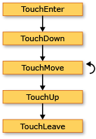
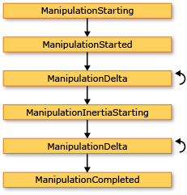
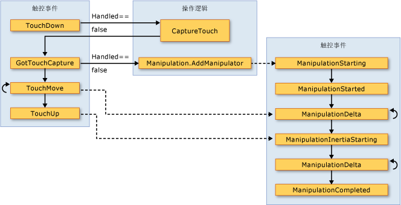

# 输入概述
[!INCLUDE[TLA#tla_winclient](../../../../includes/tlasharptla-winclient-md.md)]子系统提供了一项强大[!INCLUDE[TLA#tla_api](../../../../includes/tlasharptla-api-md.md)]用于获取输入从各种设备，包括鼠标、 键盘、 触控和笔针。 本主题描述由提供的服务[!INCLUDE[TLA2#tla_winclient](../../../../includes/tla2sharptla-winclient-md.md)]，并解释了输入系统的体系结构。  
  
  
   
## 输入 API  
 主要输入[!INCLUDE[TLA2#tla_api](../../../../includes/tla2sharptla-api-md.md)]基元素类上找到公开︰ <xref:System.Windows.UIElement>， <xref:System.Windows.ContentElement>， <xref:System.Windows.FrameworkElement>，和<xref:System.Windows.FrameworkContentElement>。  有关基元素的详细信息，请参阅[基元素概述](../../../../docs/framework/wpf/advanced/base-elements-overview.md)。  这些类提供相关的键击、 鼠标按钮、 滚动鼠标滚轮、 鼠标移动、 焦点管理和鼠标捕获，仅举几例的输入事件的功能。 通过将输入放[!INCLUDE[TLA2#tla_api](../../../../includes/tla2sharptla-api-md.md)]基元素，而不是将所有输入事件作为一项服务，该输入体系结构启用由特定对象在 UI 中，指明其出处和支持事件路由方案，从而使得多个元素有机会处理输入的事件的输入的事件。 许多输入的事件具有与之关联的事件的对。  例如，与关联键按下事件<xref:System.Windows.Input.Keyboard.KeyDown>和<xref:System.Windows.Input.Keyboard.PreviewKeyDown>事件。  在这些事件中的差别是如何将其传送到目标元素。  从根元素到目标元素在元素树向下预览事件隧道。  冒泡事件从目标元素浮现出来与根元素。  事件路由的[!INCLUDE[TLA2#tla_winclient](../../../../includes/tla2sharptla-winclient-md.md)]更高版本在本概述和更详细地讨论[路由事件概述](../../../../docs/framework/wpf/advanced/routed-events-overview.md)。  
  
### 键盘和鼠标类  
 除了输入[!INCLUDE[TLA2#tla_api](../../../../includes/tla2sharptla-api-md.md)]基元素类上<xref:System.Windows.Input.Keyboard>类和<xref:System.Windows.Input.Mouse>类提供了其他[!INCLUDE[TLA2#tla_api](../../../../includes/tla2sharptla-api-md.md)]用于处理键盘和鼠标输入。  
  
 示例输入[!INCLUDE[TLA2#tla_api](../../../../includes/tla2sharptla-api-md.md)]上<xref:System.Windows.Input.Keyboard>类<xref:System.Windows.Input.Keyboard.Modifiers%2A>属性，它返回<xref:System.Windows.Input.ModifierKeys>当前按下和<xref:System.Windows.Input.Keyboard.IsKeyDown%2A>方法，这可确定是否按下使用指定的项。  
  
 下面的示例使用<xref:System.Windows.Input.Keyboard.GetKeyStates%2A>方法可确定<xref:System.Windows.Input.Key>处于关闭状态。  
  
 [!code-csharp[keyargssnippetsample#KeyEventArgsKeyBoardGetKeyStates](../../../../samples/snippets/csharp/VS_Snippets_Wpf/KeyArgsSnippetSample/CSharp/Window1.xaml.cs#keyeventargskeyboardgetkeystates)]
 [!code-vb[keyargssnippetsample#KeyEventArgsKeyBoardGetKeyStates](../../../../samples/snippets/visualbasic/VS_Snippets_Wpf/KeyArgsSnippetSample/visualbasic/window1.xaml.vb#keyeventargskeyboardgetkeystates)]  
  
 示例输入[!INCLUDE[TLA2#tla_api](../../../../includes/tla2sharptla-api-md.md)]上<xref:System.Windows.Input.Mouse>类<xref:System.Windows.Input.Mouse.MiddleButton%2A>，从中获取鼠标中键的状态和<xref:System.Windows.Input.Mouse.DirectlyOver%2A>，后者将获取该元素在鼠标指针位于当前。  
  
 下面的示例确定是否<xref:System.Windows.Input.Mouse.LeftButton%2A>鼠标上处于<xref:System.Windows.Input.MouseButtonState>状态。  
  
 [!code-csharp[mouserelatedsnippets#MouseRelatedSnippetsGetLeftButtonMouse](../../../../samples/snippets/csharp/VS_Snippets_Wpf/MouseRelatedSnippets/CSharp/Window1.xaml.cs#mouserelatedsnippetsgetleftbuttonmouse)]
 [!code-vb[mouserelatedsnippets#MouseRelatedSnippetsGetLeftButtonMouse](../../../../samples/snippets/visualbasic/VS_Snippets_Wpf/MouseRelatedSnippets/visualbasic/window1.xaml.vb#mouserelatedsnippetsgetleftbuttonmouse)]  
  
 <xref:System.Windows.Input.Mouse>和<xref:System.Windows.Input.Keyboard>类详见本概述的更多详细信息。  
  
### 触笔输入  
 [!INCLUDE[TLA2#tla_winclient](../../../../includes/tla2sharptla-winclient-md.md)]已经集成了对支持<xref:System.Windows.Input.Stylus>。  <xref:System.Windows.Input.Stylus>是变得流行起来通过笔输入[!INCLUDE[TLA#tla_tpc](../../../../includes/tlasharptla-tpc-md.md)]。  [!INCLUDE[TLA2#tla_winclient](../../../../includes/tla2sharptla-winclient-md.md)]应用程序可以通过使用鼠标以鼠标形式将触笔[!INCLUDE[TLA2#tla_api](../../../../includes/tla2sharptla-api-md.md)]，但[!INCLUDE[TLA2#tla_winclient](../../../../includes/tla2sharptla-winclient-md.md)]还公开了使用键盘和鼠标与类似的模型的触笔设备抽象。  所有与笔针相关[!INCLUDE[TLA2#tla_api#plural](../../../../includes/tla2sharptla-apisharpplural-md.md)]包含单词"笔针"。  
  
 由于触笔可以充当鼠标，因此仅支持鼠标输入的应用程序仍可以自动获得一定程度的触笔支持。 当以这种方式使用触笔时，应用程序都有机会对相应的触笔事件进行处理，然后处理相应的鼠标事件。 此外，如手写输入的较高级别的服务，还提供通过触笔设备抽象。  作为输入手写内容的详细信息，请参阅[墨迹入门](../../../../docs/framework/wpf/advanced/getting-started-with-ink.md)。  
  
   
## 事件路由  
 一个<xref:System.Windows.FrameworkElement>作为其内容模型，从而形成一个树元素中的子元素可以包含其他元素。  在[!INCLUDE[TLA2#tla_winclient](../../../../includes/tla2sharptla-winclient-md.md)]，父元素可以参与到及其子元素或其他子代定向通过处理事件的输入。 这是特别适合生成控制的较小的控件，该过程称为"控件组合"或"组合"。 有关元素树和元素树与事件路由的相关详细信息，请参阅[WPF 中的树](../../../../docs/framework/wpf/advanced/trees-in-wpf.md)。  
  
 事件路由是将事件转发到多个元素的过程，以便将特定对象或该路线沿途的元素可以选择提供大量响应 （通过处理） 事件，它可能源自由不同的元素。  路由的事件使用三种路由机制之一︰ 直接、 冒泡和隧道。  在直接路由中，源元素时得到通知，请的唯一元素，该事件不会路由至任何其他元素。 但是，直接的路由的事件仍提供对于路由事件而不是标准才存在一些其他功能[!INCLUDE[TLA2#tla_clr](../../../../includes/tla2sharptla-clr-md.md)]事件。 元素树中的第一个通知然后源自该事件，该元素的父元素中，依次类推向上冒泡配合工作。  隧道元素树的根开始，向下进行，以原始的源元素结束。  有关路由事件的详细信息，请参阅[路由事件概述](../../../../docs/framework/wpf/advanced/routed-events-overview.md)。  
  
 [!INCLUDE[TLA2#tla_winclient](../../../../includes/tla2sharptla-winclient-md.md)]输入的事件通常隧道事件和冒泡事件组成的成对出现。  隧道事件而有别于冒泡事件使用"预览"前缀。  例如， <xref:System.Windows.Input.Mouse.PreviewMouseMove>是鼠标移动事件的隧道版本和<xref:System.Windows.Input.Mouse.MouseMove>是此事件冒泡版本。 此事件配对是一种约定，实现在元素级别并不是一种固有的功能[!INCLUDE[TLA2#tla_winclient](../../../../includes/tla2sharptla-winclient-md.md)]事件系统。 有关详细信息，请参阅中的 WPF 输入事件部分[路由事件概述](../../../../docs/framework/wpf/advanced/routed-events-overview.md)。  
  
   
## 处理输入的事件  
 若要接收的输入元素上的，事件处理程序必须与该特定事件相关联。  在[!INCLUDE[TLA2#tla_xaml](../../../../includes/tla2sharptla-xaml-md.md)]这是简单的︰ 将侦听此事件的元素的特性作为引用的事件名称。  然后，将该属性的值为您定义基于委托的事件处理程序的名称。  事件处理程序必须如在代码中编写[!INCLUDE[TLA#tla_cshrp](../../../../includes/tlasharptla-cshrp-md.md)]，并且可以包括在代码隐藏文件中。  
  
 键盘事件发生时，操作系统报告的键盘焦点位于某个元素上时发生按键操作。 鼠标和笔针事件每个分为两类︰ 报告的变化相对于的元素的指针位置的事件和报告的设备按钮的状态变化的事件。  
  
### 键盘输入的事件示例  
 下面的示例侦听左的箭头键按键。  一个<xref:System.Windows.Controls.StackPanel>将创建一个具有<xref:System.Windows.Controls.Button>。  事件处理程序用于向左的箭头键按下连接到侦听<xref:System.Windows.Controls.Button>实例。  
  
 该示例的第一部分创建<xref:System.Windows.Controls.StackPanel>和<xref:System.Windows.Controls.Button>，并将附加的事件处理程序<xref:System.Windows.UIElement.KeyDown>。  
  
 [!code-xml[InputOvw#Input_OvwKeyboardExampleXAML](../../../../samples/snippets/csharp/VS_Snippets_Wpf/InputOvw/CSharp/Page1.xaml#input_ovwkeyboardexamplexaml)]  
  
 [!code-csharp[InputOvw#Input_OvwKeyboardExampleUICodeBehind](../../../../samples/snippets/csharp/VS_Snippets_Wpf/InputOvw/CSharp/Page1.xaml.cs#input_ovwkeyboardexampleuicodebehind)]
 [!code-vb[InputOvw#Input_OvwKeyboardExampleUICodeBehind](../../../../samples/snippets/visualbasic/VS_Snippets_Wpf/InputOvw/VisualBasic/Page1.xaml.vb#input_ovwkeyboardexampleuicodebehind)]  
  
 第二部分用代码编写，并定义事件处理程序。  按向左的箭头键时与<xref:System.Windows.Controls.Button>具有键盘焦点，处理程序将运行与<xref:System.Windows.Controls.Control.Background%2A>颜色<xref:System.Windows.Controls.Button>更改。  按下了键，但这并不是向左的箭头键，<xref:System.Windows.Controls.Control.Background%2A>颜色<xref:System.Windows.Controls.Button>将变回为其开始颜色。  
  
 [!code-csharp[InputOvw#Input_OvwKeyboardExampleHandlerCodeBehind](../../../../samples/snippets/csharp/VS_Snippets_Wpf/InputOvw/CSharp/Page1.xaml.cs#input_ovwkeyboardexamplehandlercodebehind)]
 [!code-vb[InputOvw#Input_OvwKeyboardExampleHandlerCodeBehind](../../../../samples/snippets/visualbasic/VS_Snippets_Wpf/InputOvw/VisualBasic/Page1.xaml.vb#input_ovwkeyboardexamplehandlercodebehind)]  
  
### 鼠标输入的事件示例  
 在下面的示例中，<xref:System.Windows.Controls.Control.Background%2A>颜色<xref:System.Windows.Controls.Button>当鼠标指针进入更改<xref:System.Windows.Controls.Button>。  <xref:System.Windows.Controls.Control.Background%2A>颜色将还原当鼠标离开<xref:System.Windows.Controls.Button>。  
  
 该示例的第一部分创建<xref:System.Windows.Controls.StackPanel>和<xref:System.Windows.Controls.Button>控制，并将附加的事件处理程序<xref:System.Windows.UIElement.MouseEnter>和<xref:System.Windows.UIElement.MouseLeave>事件，以便将<xref:System.Windows.Controls.Button>。  
  
 [!code-xml[InputOvw#Input_OvwMouseExampleXAML](../../../../samples/snippets/csharp/VS_Snippets_Wpf/InputOvw/CSharp/Page1.xaml#input_ovwmouseexamplexaml)]  
  
 [!code-csharp[InputOvw#Input_OvwMouseExampleUICodeBehind](../../../../samples/snippets/csharp/VS_Snippets_Wpf/InputOvw/CSharp/Page1.xaml.cs#input_ovwmouseexampleuicodebehind)]
 [!code-vb[InputOvw#Input_OvwMouseExampleUICodeBehind](../../../../samples/snippets/visualbasic/VS_Snippets_Wpf/InputOvw/VisualBasic/Page1.xaml.vb#input_ovwmouseexampleuicodebehind)]  
  
 该示例的第二部分用代码编写，并定义事件处理程序。  当鼠标进入<xref:System.Windows.Controls.Button>、<xref:System.Windows.Controls.Control.Background%2A>颜色<xref:System.Windows.Controls.Button>更改为<xref:System.Windows.Media.Brushes.SlateGray%2A>。  当鼠标离开<xref:System.Windows.Controls.Button>、<xref:System.Windows.Controls.Control.Background%2A>颜色<xref:System.Windows.Controls.Button>更改回<xref:System.Windows.Media.Brushes.AliceBlue%2A>。  
  
 [!code-csharp[InputOvw#Input_OvwMouseExampleEneterHandler](../../../../samples/snippets/csharp/VS_Snippets_Wpf/InputOvw/CSharp/Page1.xaml.cs#input_ovwmouseexampleeneterhandler)]
 [!code-vb[InputOvw#Input_OvwMouseExampleEneterHandler](../../../../samples/snippets/visualbasic/VS_Snippets_Wpf/InputOvw/VisualBasic/Page1.xaml.vb#input_ovwmouseexampleeneterhandler)]  
  
 [!code-csharp[InputOvw#Input_OvwMouseExampleLeaveHandler](../../../../samples/snippets/csharp/VS_Snippets_Wpf/InputOvw/CSharp/Page1.xaml.cs#input_ovwmouseexampleleavehandler)]
 [!code-vb[InputOvw#Input_OvwMouseExampleLeaveHandler](../../../../samples/snippets/visualbasic/VS_Snippets_Wpf/InputOvw/VisualBasic/Page1.xaml.vb#input_ovwmouseexampleleavehandler)]  
  
   
## 文本输入  
 <xref:System.Windows.ContentElement.TextInput>事件可以让您以与设备无关的方式侦听文本输入。 键盘是文本输入，但语音，手写内容，并且其他输入的设备可以生成的文本也输入。  
  
 键盘输入[!INCLUDE[TLA2#tla_winclient](../../../../includes/tla2sharptla-winclient-md.md)]首先发送相应<xref:System.Windows.ContentElement.KeyDown>/<xref:System.Windows.ContentElement.KeyUp>事件。 如果不处理这些事件，并且键是文本而不是 （如方向箭头的控制键） 或功能键，则<xref:System.Windows.ContentElement.TextInput>引发事件。  并不总是之间简单的一对一映射<xref:System.Windows.ContentElement.KeyDown>/<xref:System.Windows.ContentElement.KeyUp>和<xref:System.Windows.ContentElement.TextInput>事件因为多个键击可以生成单个字符的文本输入并一次击键可以生成多字符的字符串。  这尤其适用于中文、 日语和韩语等语言使用该对话框[!INCLUDE[TLA#tla_ime#plural](../../../../includes/tlasharptla-imesharpplural-md.md)]以在其对应的字母组成中生成上千个字符。  
  
 当[!INCLUDE[TLA2#tla_winclient](../../../../includes/tla2sharptla-winclient-md.md)]发送<xref:System.Windows.ContentElement.KeyUp>/<xref:System.Windows.ContentElement.KeyDown>事件，<xref:System.Windows.Input.KeyEventArgs.Key%2A>设置为<xref:System.Windows.Input.Key?displayProperty=fullName>如果击键可以成为的一部分<xref:System.Windows.ContentElement.TextInput>事件 （如 ALT + S 按下时，例如）。 这使得代码都在<xref:System.Windows.ContentElement.KeyDown>事件处理程序来检查<xref:System.Windows.Input.Key?displayProperty=fullName> ј ¬ 如果能找到，则将保留对随后引发的处理程序处理<xref:System.Windows.ContentElement.TextInput>事件。 在这些情况下，各属性的<xref:System.Windows.Input.TextCompositionEventArgs>参数可以用于确定原始击键。 同样，如果[!INCLUDE[TLA2#tla_ime](../../../../includes/tla2sharptla-ime-md.md)]处于活动状态，<xref:System.Windows.Input.Key>的值为<xref:System.Windows.Input.Key?displayProperty=fullName>，和<xref:System.Windows.Input.KeyEventArgs.ImeProcessedKey%2A>提供原始击键。  
  
 下面的示例定义一个处理程序<xref:System.Windows.Controls.Primitives.ButtonBase.Click>事件和处理程序<xref:System.Windows.UIElement.KeyDown>事件。  
  
 代码或标记的第一个段创建用户界面。  
  
 [!code-xml[InputOvw#Input_OvwTextInputXAML](../../../../samples/snippets/csharp/VS_Snippets_Wpf/InputOvw/CSharp/Page1.xaml#input_ovwtextinputxaml)]  
  
 [!code-csharp[InputOvw#Input_OvwTextInputUICodeBehind](../../../../samples/snippets/csharp/VS_Snippets_Wpf/InputOvw/CSharp/Page1.xaml.cs#input_ovwtextinputuicodebehind)]
 [!code-vb[InputOvw#Input_OvwTextInputUICodeBehind](../../../../samples/snippets/visualbasic/VS_Snippets_Wpf/InputOvw/VisualBasic/Page1.xaml.vb#input_ovwtextinputuicodebehind)]  
  
 第二个代码段包含的事件处理程序。  
  
 [!code-csharp[InputOvw#Input_OvwTextInputHandlersCodeBehind](../../../../samples/snippets/csharp/VS_Snippets_Wpf/InputOvw/CSharp/Page1.xaml.cs#input_ovwtextinputhandlerscodebehind)]
 [!code-vb[InputOvw#Input_OvwTextInputHandlersCodeBehind](../../../../samples/snippets/visualbasic/VS_Snippets_Wpf/InputOvw/VisualBasic/Page1.xaml.vb#input_ovwtextinputhandlerscodebehind)]  
  
 因为输入的事件激起事件路由<xref:System.Windows.Controls.StackPanel>接收的输入无论哪个元素具有键盘焦点。 <xref:System.Windows.Controls.TextBox>第一次向控件的通知和`OnTextInputKeyDown`才调用处理程序<xref:System.Windows.Controls.TextBox>未处理输入。 如果<xref:System.Windows.UIElement.PreviewKeyDown>而不是使用事件<xref:System.Windows.UIElement.KeyDown>事件，`OnTextInputKeyDown`第一次调用处理程序。  
  
 在此示例中，处理逻辑写入了两次 — 一次针对 CTRL + O，再为按钮的单击事件。 这可以简化使用命令，而不是直接处理输入的事件。  本概述中并在将讨论这些命令[发出命令概述](../../../../docs/framework/wpf/advanced/commanding-overview.md)。  
  
   
## 触控和操作  
 新的硬件和 API 在 Windows 7 操作系统中的提供的应用程序能够同时接收来自多个触控输入。 [!INCLUDE[TLA2#tla_winclient](../../../../includes/tla2sharptla-winclient-md.md)]使应用程序检测并做出响应触控的方式类似于对其他输入时，例如鼠标或键盘，触摸发生时引发事件的响应。  
  
 [!INCLUDE[TLA2#tla_winclient](../../../../includes/tla2sharptla-winclient-md.md)]公开两种类型的事件发生触控时︰ 触控事件和操作事件。 触控事件提供有关每个手指的原始数据在触摸屏和其移动。 操作事件将解释为特定操作的输入。 本部分将讨论这两种类型的事件。  
  
### 先决条件  
 您需要以下组件来开发响应触控的应用程序。  
  
-   [!INCLUDE[vs_dev10_ext](../../../../includes/vs-dev10-ext-md.md)]。  
  
-   Windows 7。  
  
-   例如，支持 Windows 触摸屏的触摸屏设备。  
  
### 术语  
 讨论触控时使用了以下术语。  
  
-   **触摸**是一种识别的 Windows 7 的用户输入。 通常情况下，由将手指放在触敏式屏幕启动触摸屏输入。 请注意设备，例如便携式计算机很常见的触摸板是否手指的位置和鼠标输入作为移动设备只是将转换不会支持触控。  
  
-   **多点触控**是指同时从多个点进行的触控。 Windows 7 和[!INCLUDE[TLA2#tla_winclient](../../../../includes/tla2sharptla-winclient-md.md)]支持多点触控。 每当文档中讨论触控[!INCLUDE[TLA2#tla_winclient](../../../../includes/tla2sharptla-winclient-md.md)]的概念适用于多点触控。  
  
-   一个**操作**触控解释为应用于对象的实际操作时发生。 在[!INCLUDE[TLA2#tla_winclient](../../../../includes/tla2sharptla-winclient-md.md)]，操作事件将解释为翻译、 扩展或旋转操作的输入。  
  
-   一个`touch device`表示生成触控输入，如触摸屏上的一根手指的设备。  
  
### 响应触控的控件  
 以下控件可以在控件之间拖动手指，如果它具有滚动出视野之外的内容滚动。  
  
-   <xref:System.Windows.Controls.ComboBox>  
  
-   <xref:System.Windows.Controls.ContextMenu>  
  
-   <xref:System.Windows.Controls.DataGrid>  
  
-   <xref:System.Windows.Controls.ListBox>  
  
-   <xref:System.Windows.Controls.ListView>  
  
-   <xref:System.Windows.Controls.MenuItem>  
  
-   <xref:System.Windows.Controls.TextBox>  
  
-   <xref:System.Windows.Controls.ToolBar>  
  
-   <xref:System.Windows.Controls.TreeView>  
  
 <xref:System.Windows.Controls.ScrollViewer>定义<xref:System.Windows.Controls.ScrollViewer.PanningMode%2A?displayProperty=fullName>附加属性，使您能够指定是否触控平移启用了水平、 垂直、 两者，还是两者皆否。 <xref:System.Windows.Controls.ScrollViewer.PanningDeceleration%2A?displayProperty=fullName>属性指定如何快速滚动减慢当用户将手指从触摸屏。 <xref:System.Windows.Controls.ScrollViewer.PanningRatio%2A?displayProperty=fullName>附加的属性指定滚动偏移量转换操作偏移的比例。  
  
### 触控事件  
 基类， <xref:System.Windows.UIElement>， <xref:System.Windows.UIElement3D>，和<xref:System.Windows.ContentElement>，定义您可以订阅以便您的应用程序将响应触控的事件。 当您的应用程序将触控解释为以外的操作对象，触控事件非常有用。 例如，使用户能够使用一个或多个手指绘制应用程序将订阅触控事件。  
  
 所有三个类定义的行为类似，而不考虑定义的类的以下事件。  
  
-   <xref:System.Windows.UIElement.TouchDown>  
  
-   <xref:System.Windows.UIElement.TouchMove>  
  
-   <xref:System.Windows.UIElement.TouchUp>  
  
-   <xref:System.Windows.UIElement.TouchEnter>  
  
-   <xref:System.Windows.UIElement.TouchLeave>  
  
-   <xref:System.Windows.UIElement.PreviewTouchDown>  
  
-   <xref:System.Windows.UIElement.PreviewTouchMove>  
  
-   <xref:System.Windows.UIElement.PreviewTouchUp>  
  
-   <xref:System.Windows.UIElement.GotTouchCapture>  
  
-   <xref:System.Windows.UIElement.LostTouchCapture>  
  
 键盘和鼠标与事件类似，触控事件是路由的事件。 开头的事件`Preview`事件和事件以开头的隧道`Touch`是冒泡事件。 有关路由事件的详细信息，请参阅[路由事件概述](../../../../docs/framework/wpf/advanced/routed-events-overview.md)。 在处理这些事件时，您可以获取的输入，相对于任何元素的位置，通过调用<xref:System.Windows.Input.TouchEventArgs.GetTouchPoint%2A>或<xref:System.Windows.Input.TouchEventArgs.GetIntermediateTouchPoints%2A>方法。  
  
 若要了解触控事件之间的交互，请考虑用户将一个手指放在元素上，在元素中，移动手指，然后抬起手指从元素的方案。 下图显示了冒泡事件 （为了简单起见将忽略隧道事件） 的执行。  
  
   
触控事件  
  
 以下列表描述在上图中的事件的顺序。  
  
1.  <xref:System.Windows.UIElement.TouchEnter>事件发生一次当用户将手指放在元素。  
  
2.  <xref:System.Windows.UIElement.TouchDown>事件发生一次。  
  
3.  <xref:System.Windows.UIElement.TouchMove>事件发生多次，当用户移动的元素中的手指。  
  
4.  <xref:System.Windows.UIElement.TouchUp>事件发生时在用户抬起手指从该元素的一次。  
  
5.  <xref:System.Windows.UIElement.TouchLeave>事件发生一次。  
  
 当使用两个以上手指时，对每个手指发生的事件。  
  
### 操作事件  
 其中一个应用程序使用户能够的对象执行操作的情况下<xref:System.Windows.UIElement>类定义操作事件。 与不同的触控事件只是报告触控的位置，操作事件报告可以解释输入的方式。 有三种类型的操作、 翻译、 扩展和旋转。 下面介绍了如何调用操作的三种类型。  
  
-   将手指放在一个对象，并将手指在触摸屏以调用转换操作。 这通常会移动对象。  
  
-   将两个手指放在对象上，并将手指移靠拢或相互分开以调用扩展操作。 这通常会调整大小的对象。  
  
-   将两个手指放在对象上并旋转手指相对于其他以调用旋转操作。 此操作通常会旋转对象。  
  
 可以同时发生多个类型的操作。  
  
 当您使对象响应操作时，您可以显示为具有延时的对象。 这会使您模拟真实的世界的对象。 例如，如果推送硬跨一个表，推动一本书时足够簿将继续移动后您将其释放。 [!INCLUDE[TLA2#tla_winclient](../../../../includes/tla2sharptla-winclient-md.md)]使您能够通过引发操作事件在用户的手指释放对象后，可模拟此行为。  
  
 有关如何创建的应用程序使用户可以移动、 调整大小和旋转对象的信息，请参阅[演练︰ 创建您的第一个触控应用](../../../../docs/framework/wpf/advanced/walkthrough-creating-your-first-touch-application.md)。  
  
 <xref:System.Windows.UIElement>定义下面的操作事件。  
  
-   <xref:System.Windows.UIElement.ManipulationStarting>  
  
-   <xref:System.Windows.UIElement.ManipulationStarted>  
  
-   <xref:System.Windows.UIElement.ManipulationDelta>  
  
-   <xref:System.Windows.UIElement.ManipulationInertiaStarting>  
  
-   <xref:System.Windows.UIElement.ManipulationCompleted>  
  
-   <xref:System.Windows.UIElement.ManipulationBoundaryFeedback>  
  
 默认情况下， <xref:System.Windows.UIElement>不会接收这些操作事件。 若要在接收操作事件<xref:System.Windows.UIElement>，请设置<xref:System.Windows.UIElement.IsManipulationEnabled%2A?displayProperty=fullName>到`true`。  
  
#### 操作事件执行路径  
 假设其中用户"引发"对象。 用户将手指放在该对象，在短距离，触摸屏移动手指并移动的同时，然后抬起手指。 此操作的结果是该对象将在用户的手指移动并继续移动用户抬起手指后。  
  
 下图显示操作事件和有关每个事件的重要信息的执行的路径。  
  
   
操作事件  
  
 以下列表描述在上图中的事件的顺序。  
  
1.  <xref:System.Windows.UIElement.ManipulationStarting>当用户将手指放在对象上发生的事件。 除此之外，此事件，可以设置<xref:System.Windows.Input.ManipulationStartingEventArgs.ManipulationContainer%2A>属性。 在后续事件中，操作的位置将相对于<xref:System.Windows.Input.ManipulationStartingEventArgs.ManipulationContainer%2A>。 以外的其他事件中<xref:System.Windows.UIElement.ManipulationStarting>，此属性是只读的因此<xref:System.Windows.UIElement.ManipulationStarting>事件是唯一一次，您可以设置此属性。  
  
2.  <xref:System.Windows.UIElement.ManipulationStarted>事件发生下一步。 此事件报告操作的原点。  
  
3.  <xref:System.Windows.UIElement.ManipulationDelta>事件发生多次作为触摸屏上的用户的手指移动。 <xref:System.Windows.Input.ManipulationDeltaEventArgs.DeltaManipulation%2A>属性<xref:System.Windows.Input.ManipulationDeltaEventArgs>类报告操作被解释为移动、 扩展或翻译。 这是工作的执行大部分操作对象位置。  
  
4.  <xref:System.Windows.UIElement.ManipulationInertiaStarting>事件发生时在用户的手指失去与对象的联系。 此事件使您可以指定的操作期间延时减速度。 这样，如果您选择，对象将能够模拟不同的物理空间或属性。 例如，假设您的应用程序包含表示现实世界中的项的两个对象，一个是比其他更大。 您可以比轻对象更快地减速的更大对象。  
  
5.  <xref:System.Windows.UIElement.ManipulationDelta>延时发生时，事件发生多次。 请注意在用户的手指移动在触摸屏和时，会发生此事件[!INCLUDE[TLA2#tla_winclient](../../../../includes/tla2sharptla-winclient-md.md)]模拟延时。 换而言之， <xref:System.Windows.UIElement.ManipulationDelta>发生之前和之后<xref:System.Windows.UIElement.ManipulationInertiaStarting>事件。 <xref:System.Windows.Input.ManipulationDeltaEventArgs.IsInertial%2A?displayProperty=fullName>属性报告是否<xref:System.Windows.UIElement.ManipulationDelta>事件发生期间延时，因此您可以检查该属性并执行不同的操作，具体取决于它的值。  
  
6.  <xref:System.Windows.UIElement.ManipulationCompleted>事件发生的操作和任何延时结束时。 也就是说，之后所有<xref:System.Windows.UIElement.ManipulationDelta>事件发生， <xref:System.Windows.UIElement.ManipulationCompleted>发生事件发送信号的操作已完成。  
  
 <xref:System.Windows.UIElement>还定义了<xref:System.Windows.UIElement.ManipulationBoundaryFeedback>事件。 此事件发生时<xref:System.Windows.Input.ManipulationDeltaEventArgs.ReportBoundaryFeedback%2A>中调用方法<xref:System.Windows.UIElement.ManipulationDelta>事件。 <xref:System.Windows.UIElement.ManipulationBoundaryFeedback>事件可以让应用程序或组件来提供可视反馈，当对象达到边界。 例如，<xref:System.Windows.Window>类句柄<xref:System.Windows.UIElement.ManipulationBoundaryFeedback>事件，以使窗口轻微移动时遇到其边缘。  
  
 可以通过致电取消操作<xref:System.Windows.Input.ManipulationStartingEventArgs.Cancel%2A>中除以外的任何操作事件的事件参数的方法<xref:System.Windows.UIElement.ManipulationBoundaryFeedback>事件。 当您调用<xref:System.Windows.Input.ManipulationStartingEventArgs.Cancel%2A>、 不再引发操作事件和鼠标事件发生的触摸屏输入。 下表描述了取消操作的时间和所发生的鼠标事件之间的关系。  
  
|取消此事件时调用|针对已发生输入发生的鼠标事件|  
|----------------------------------------|-----------------------------------------------------------------|  
|<xref:System.Windows.UIElement.ManipulationStarting>和<xref:System.Windows.UIElement.ManipulationStarted>|鼠标按下事件。|  
|<xref:System.Windows.UIElement.ManipulationDelta>|鼠标按下的和鼠标移动事件。|  
|<xref:System.Windows.UIElement.ManipulationInertiaStarting>和<xref:System.Windows.UIElement.ManipulationCompleted>|鼠标按下、 鼠标移动和鼠标弹起事件。|  
  
 请注意，如果您调用<xref:System.Windows.Input.ManipulationStartingEventArgs.Cancel%2A>惯性操作时，该方法返回`false`输入不会引发鼠标事件。  
  
### 触摸和操作事件之间的关系  
 一个<xref:System.Windows.UIElement>始终可以接收触控事件。 当<xref:System.Windows.UIElement.IsManipulationEnabled%2A>属性设置为`true`、 <xref:System.Windows.UIElement>可以接收触控和操作事件。  如果<xref:System.Windows.UIElement.TouchDown>未处理事件 (即， <xref:System.Windows.RoutedEventArgs.Handled%2A>属性是`false`)，则操作逻辑到元素触摸屏输入捕获并生成操作事件。 如果<xref:System.Windows.RoutedEventArgs.Handled%2A>属性设置为`true`中<xref:System.Windows.UIElement.TouchDown>事件，则操作逻辑不会生成操作事件。 下图显示触控事件和操作事件之间的关系。  
  
   
触控和操作事件  
  
 以下列表描述了在上图中所示的触控和操作事件之间的关系。  
  
-   当第一个触摸设备生成<xref:System.Windows.UIElement.TouchDown>上的事件<xref:System.Windows.UIElement>，操作逻辑调用<xref:System.Windows.UIElement.CaptureTouch%2A>方法，后者生成<xref:System.Windows.UIElement.GotTouchCapture>事件。  
  
-   当<xref:System.Windows.UIElement.GotTouchCapture>发生时，操作逻辑调用<xref:System.Windows.Input.Manipulation.AddManipulator%2A?displayProperty=fullName>方法，后者生成<xref:System.Windows.UIElement.ManipulationStarting>事件。  
  
-   当<xref:System.Windows.UIElement.TouchMove>事件发生时，将操作逻辑生成<xref:System.Windows.UIElement.ManipulationDelta>前允许发生的事件<xref:System.Windows.UIElement.ManipulationInertiaStarting>事件。  
  
-   该元素的最后一个触摸设备时将引发<xref:System.Windows.UIElement.TouchUp>事件，则操作逻辑生成<xref:System.Windows.UIElement.ManipulationInertiaStarting>事件。  
  
   
## 焦点  
 有两个主要概念适用于中的焦点[!INCLUDE[TLA2#tla_winclient](../../../../includes/tla2sharptla-winclient-md.md)]︰ 键盘焦点和逻辑焦点。  
  
### 键盘焦点  
 键盘焦点指接收键盘输入的元素。  可以有一个元素在整个桌面上具有键盘焦点。  在[!INCLUDE[TLA2#tla_winclient](../../../../includes/tla2sharptla-winclient-md.md)]，具有键盘焦点的元素将具有<xref:System.Windows.IInputElement.IsKeyboardFocused%2A>设置为`true`。  静态<xref:System.Windows.Input.Keyboard>方法<xref:System.Windows.Input.Keyboard.FocusedElement%2A>返回当前具有键盘焦点的元素。  
  
 可以通过 tab 键移到一个元素或通过单击鼠标上的某些元素，如获取键盘焦点<xref:System.Windows.Controls.TextBox>。  键盘焦点也可以获得以编程方式使用<xref:System.Windows.Input.Keyboard.Focus%2A>方法<xref:System.Windows.Input.Keyboard>类。  <xref:System.Windows.Input.Keyboard.Focus%2A>尝试为指定的元素提供键盘焦点。  返回的元素<xref:System.Windows.Input.Keyboard.Focus%2A>是当前具有键盘焦点的元素。  
  
 若要获取键盘焦点的元素顺序<xref:System.Windows.UIElement.Focusable%2A>属性和<xref:System.Windows.UIElement.IsVisible%2A>属性必须设置为**true**。  一些类，如<xref:System.Windows.Controls.Panel>，具有<xref:System.Windows.UIElement.Focusable%2A>设置为`false`默认; 因此，您可能需要将此属性设置为`true`如果您希望该元素，以便可以获得焦点。  
  
 下面的示例使用<xref:System.Windows.Input.Keyboard.Focus%2A>上设置键盘焦点<xref:System.Windows.Controls.Button>。  若要将初始焦点设置在应用程序的建议的位置是在<xref:System.Windows.FrameworkElement.Loaded>事件处理程序。  
  
 [!code-csharp[focussample#FocusSampleSetFocus](../../../../samples/snippets/csharp/VS_Snippets_Wpf/FocusSample/CSharp/Window1.xaml.cs#focussamplesetfocus)]
 [!code-vb[focussample#FocusSampleSetFocus](../../../../samples/snippets/visualbasic/VS_Snippets_Wpf/FocusSample/visualbasic/window1.xaml.vb#focussamplesetfocus)]  
  
 有关键盘焦点的详细信息，请参阅[焦点概述](../../../../docs/framework/wpf/advanced/focus-overview.md)。  
  
### 逻辑焦点  
 逻辑焦点指<xref:System.Windows.Input.FocusManager.FocusedElement%2A?displayProperty=fullName>焦点作用域中。  可以有多个元素具有逻辑焦点的应用程序，但只能有一个元素具有特定焦点作用域中的逻辑焦点。  
  
 焦点作用域是一个容器元素，用于跟踪<xref:System.Windows.Input.FocusManager.FocusedElement%2A>其作用域内。  当焦点离开焦点范围时，具有焦点的元素会失去键盘焦点，但是将保留逻辑焦点。  当焦点返回到焦点范围时，具有焦点的元素将获取键盘焦点。  这使得键盘焦点，更改多个焦点范围之间，但可确保焦点返回时，焦点范围内具有焦点的元素，仍具有焦点的元素。  
  
 元素可以转换为焦点作用域内[!INCLUDE[TLA#tla_xaml](../../../../includes/tlasharptla-xaml-md.md)]通过设置<xref:System.Windows.Input.FocusManager>附加属性<xref:System.Windows.Input.FocusManager.IsFocusScope%2A>到`true`，或通过使用设置附加的属性的代码中<xref:System.Windows.Input.FocusManager.SetIsFocusScope%2A>方法。  
  
 下面的示例使<xref:System.Windows.Controls.StackPanel>转变通过设置为焦点范围<xref:System.Windows.Input.FocusManager.IsFocusScope%2A>附加属性。  
  
 [!code-xml[MarkupSnippets#MarkupIsFocusScopeXAML](../../../../samples/snippets/csharp/VS_Snippets_Wpf/MarkupSnippets/CSharp/Window1.xaml#markupisfocusscopexaml)]  
  
 [!code-csharp[FocusSnippets#FocusSetIsFocusScope](../../../../samples/snippets/csharp/VS_Snippets_Wpf/FocusSnippets/CSharp/Window1.xaml.cs#focussetisfocusscope)]
 [!code-vb[FocusSnippets#FocusSetIsFocusScope](../../../../samples/snippets/visualbasic/VS_Snippets_Wpf/FocusSnippets/visualbasic/window1.xaml.vb#focussetisfocusscope)]  
  
 中的类[!INCLUDE[TLA2#tla_winclient](../../../../includes/tla2sharptla-winclient-md.md)]即为默认情况下的焦点范围是<xref:System.Windows.Window>，<xref:System.Windows.Controls.Menu>，<xref:System.Windows.Controls.ToolBar>，和<xref:System.Windows.Controls.ContextMenu>。  
  
 具有键盘焦点的元素，还将为其所属; 焦点作用域的逻辑焦点因此，将焦点设置到具有元素<xref:System.Windows.Input.Keyboard.Focus%2A>方法<xref:System.Windows.Input.Keyboard>类或基元素类将尝试给予元素键盘焦点和逻辑焦点。  
  
 若要确定焦点作用域中具有焦点的元素，请使用<xref:System.Windows.Input.FocusManager.GetFocusedElement%2A>。 若要更改为焦点作用域具有焦点的元素，使用<xref:System.Windows.Input.FocusManager.SetFocusedElement%2A>。  
  
 有关逻辑焦点详细信息，请参阅[焦点概述](../../../../docs/framework/wpf/advanced/focus-overview.md)。  
  
   
## 鼠标指针位置  
 [!INCLUDE[TLA2#tla_winclient](../../../../includes/tla2sharptla-winclient-md.md)]输入[!INCLUDE[TLA2#tla_api](../../../../includes/tla2sharptla-api-md.md)]提供了与坐标空间有关的有用信息。  例如，坐标`(0,0)`左上角的坐标，但左上方的树中的哪些元素？ 是输入的目标元素？ 附加到事件处理程序的元素？ 还是其他内容？ 为了避免混淆，[!INCLUDE[TLA2#tla_winclient](../../../../includes/tla2sharptla-winclient-md.md)]输入[!INCLUDE[TLA2#tla_api](../../../../includes/tla2sharptla-api-md.md)]要求时使用通过鼠标获得的坐标指定您的参考框架。 <xref:System.Windows.Input.Mouse.GetPosition%2A>方法返回与指定元素相对的鼠标指针的坐标。  
  
   
## 鼠标捕获  
 鼠标设备专门保留模式的特征称为鼠标捕获。 鼠标捕获用于转换的输入的状态时保持启动拖放操作，以便其他操作涉及标称屏幕上鼠标指针的位置不一定会。 在拖动过程用户不能单击未终止拖放，这将使得大多数 mouseover 提示不合适，而在拖动来源拥有鼠标捕获。 输入的系统公开[!INCLUDE[TLA2#tla_api#plural](../../../../includes/tla2sharptla-apisharpplural-md.md)]，可以确定鼠标捕获状态，以及[!INCLUDE[TLA2#tla_api#plural](../../../../includes/tla2sharptla-apisharpplural-md.md)]，可以强制鼠标捕获到的特定元素，或清除鼠标捕获状态。 拖放操作的详细信息，请参阅[拖放概述](../../../../docs/framework/wpf/advanced/drag-and-drop-overview.md)。  
  
   
## 命令  
 命令后，在更高的语义级别设备输入比输入的处理。  命令是简单的指令，如`Cut`， `Copy`， `Paste`，或`Open`。  命令可用于集中命令逻辑。  相同的命令可能会访问从<xref:System.Windows.Controls.Menu>，请在<xref:System.Windows.Controls.ToolBar>，或通过键盘快捷键。 命令还提供一种机制，该命令变得不可用时禁用控件。  
  
 <xref:System.Windows.Input.RoutedCommand>是[!INCLUDE[TLA2#tla_winclient](../../../../includes/tla2sharptla-winclient-md.md)]实现<xref:System.Windows.Input.ICommand>。  当<xref:System.Windows.Input.RoutedCommand>执行时， <xref:System.Windows.Input.CommandManager.PreviewExecuted>和<xref:System.Windows.Input.CommandManager.Executed>对命令目标，哪些隧道和向上遍历元素树与其他输入一样引发事件。  如果未设置命令目标，具有键盘焦点的元素将是命令目标。  执行此命令的逻辑附加到<xref:System.Windows.Input.CommandBinding>。  当<xref:System.Windows.Input.CommandManager.Executed>事件到达<xref:System.Windows.Input.CommandBinding>该特定命令<xref:System.Windows.Input.ExecutedRoutedEventHandler>上<xref:System.Windows.Input.CommandBinding>调用。  此处理程序执行该命令的操作。  
  
 发出命令的详细信息，请参阅[发出命令概述](../../../../docs/framework/wpf/advanced/commanding-overview.md)。  
  
 [!INCLUDE[TLA2#tla_winclient](../../../../includes/tla2sharptla-winclient-md.md)]提供了常用的命令组成的库<xref:System.Windows.Input.ApplicationCommands>， <xref:System.Windows.Input.MediaCommands>， <xref:System.Windows.Input.ComponentCommands>， <xref:System.Windows.Input.NavigationCommands>，和<xref:System.Windows.Documents.EditingCommands>，也可以定义您自己。  
  
 下面的示例演示如何设置<xref:System.Windows.Controls.MenuItem> ，以便在单击时它将会调用<xref:System.Windows.Input.ApplicationCommands.Paste%2A>命令<xref:System.Windows.Controls.TextBox>，假定采用<xref:System.Windows.Controls.TextBox>具有键盘焦点。  
  
 [!code-xml[CommandingOverviewSnippets#CommandingOverviewSimpleCommand](../../../../samples/snippets/csharp/VS_Snippets_Wpf/CommandingOverviewSnippets/CSharp/Window1.xaml#commandingoverviewsimplecommand)]  
  
 [!code-csharp[CommandingOverviewSnippets#CommandingOverviewCommandTargetCodeBehind](../../../../samples/snippets/csharp/VS_Snippets_Wpf/CommandingOverviewSnippets/CSharp/Window1.xaml.cs#commandingoverviewcommandtargetcodebehind)]
 [!code-vb[CommandingOverviewSnippets#CommandingOverviewCommandTargetCodeBehind](../../../../samples/snippets/visualbasic/VS_Snippets_Wpf/CommandingOverviewSnippets/visualbasic/window1.xaml.vb#commandingoverviewcommandtargetcodebehind)]  
  
 有关详细信息中的命令[!INCLUDE[TLA2#tla_winclient](../../../../includes/tla2sharptla-winclient-md.md)]，请参阅[发出命令概述](../../../../docs/framework/wpf/advanced/commanding-overview.md)。  
  
   
## 输入的系统和基元素  
 输入事件定义的附加事件如<xref:System.Windows.Input.Mouse>，<xref:System.Windows.Input.Keyboard>，和<xref:System.Windows.Input.Stylus>的类引发由输入系统，并将其注入到对象模型基于命中测试在运行时的可视树中的特定位置。  
  
 每个事件，<xref:System.Windows.Input.Mouse>，<xref:System.Windows.Input.Keyboard>，和<xref:System.Windows.Input.Stylus>定义如附加的事件也重新由基元素类<xref:System.Windows.UIElement>和<xref:System.Windows.ContentElement>作为新的路由事件。 基元素路由事件由处理原始的附加的事件和重用事件数据类生成。  
  
 与通过其基元素输入的事件实现特定的源元素关联的输入的事件时，则可以通过基于逻辑和可视化树对象的组合，由应用程序代码进行处理的事件路由的其余部分进行路由。  通常情况下，它是处理使用路由的事件在这些设备相关的输入的事件更为方便<xref:System.Windows.UIElement>和<xref:System.Windows.ContentElement>，这是因为您可以使用更为直观事件处理程序中的语法这两个[!INCLUDE[TLA2#tla_xaml](../../../../includes/tla2sharptla-xaml-md.md)]和代码中。 您可以选择要处理的附加的事件，而是启动过程，但将会面临的几个问题︰ 附加的事件被标记由基元素类处理，处理，并且您需要使用访问器方法，而不是真正的事件语法，以便将附加的附加事件处理程序。  
  
   
## 下一步  
 您现在有多种方法来处理输入中的[!INCLUDE[TLA2#tla_winclient](../../../../includes/tla2sharptla-winclient-md.md)]。  还应有进一步的了解各种类型的输入的事件和路由的事件机制使用[!INCLUDE[TLA2#tla_winclient](../../../../includes/tla2sharptla-winclient-md.md)]。  
  
 其他资源是可用于解释[!INCLUDE[TLA2#tla_winclient](../../../../includes/tla2sharptla-winclient-md.md)]框架元素和事件路由的更多详细信息。 请参阅下面有关详细信息，概述[发出命令概述](../../../../docs/framework/wpf/advanced/commanding-overview.md)，[焦点概述](../../../../docs/framework/wpf/advanced/focus-overview.md)，[基元素概述](../../../../docs/framework/wpf/advanced/base-elements-overview.md)， [WPF 中的树](../../../../docs/framework/wpf/advanced/trees-in-wpf.md)，和[路由事件概述](../../../../docs/framework/wpf/advanced/routed-events-overview.md)。  
  
## 另请参阅  
 [焦点概述](../../../../docs/framework/wpf/advanced/focus-overview.md)   
 [命令概述](../../../../docs/framework/wpf/advanced/commanding-overview.md)   
 [路由的事件概述](../../../../docs/framework/wpf/advanced/routed-events-overview.md)   
 [基元素概述](../../../../docs/framework/wpf/advanced/base-elements-overview.md)   
 [属性](../../../../docs/framework/wpf/advanced/properties-wpf.md)