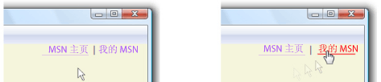

# 优化性能：文本Optimizing Performance: Text
[!INCLUDE[TLA2#tla_winclient](../../../../includes/tla2sharptla-winclient-md.md)] 支持通过使用功能丰富的 [!INCLUDE[TLA#tla_ui](../../../../includes/tlasharptla-ui-md.md)] 控件实现的文本内容演示。 includes support for the presentation of text content through the use of feature-rich [!INCLUDE[TLA#tla_ui](../../../../includes/tlasharptla-ui-md.md)] controls. 通常可以将文本呈现分为三层：In general you can divide text rendering in three layers:  
  
1.  使用<xref:System.Windows.Documents.Glyphs>和<xref:System.Windows.Media.GlyphRun>直接对象。Using the <xref:System.Windows.Documents.Glyphs> and <xref:System.Windows.Media.GlyphRun> objects directly.  
  
2.  使用<xref:System.Windows.Media.FormattedText>对象。Using the <xref:System.Windows.Media.FormattedText> object.  
  
3.  使用高级控件，如<xref:System.Windows.Controls.TextBlock>和<xref:System.Windows.Documents.FlowDocument>对象。Using high-level controls, such as the <xref:System.Windows.Controls.TextBlock> and <xref:System.Windows.Documents.FlowDocument> objects.  
  
 本主题提供文本呈现性能方面的建议。This topic provides text rendering performance recommendations.  
  
  
   
## 字形级别的呈现文本Rendering Text at the Glyph Level  
 [!INCLUDE[TLA#tla_winclient](../../../../includes/tlasharptla-winclient-md.md)] 提供高级的文本支持包括直接访问的标志符号级标记<xref:System.Windows.Documents.Glyphs>的用户想要截获并保存在格式化后的文本。 provides advanced text support including glyph-level markup with direct access to <xref:System.Windows.Documents.Glyphs> for customers who want to intercept and persist text after formatting. 这些功能为以下每种方案中不同的文本呈现要求提供关键支持。These features provide critical support for the different text rendering requirements in each of the following scenarios.  
  
-   固定格式文档的屏幕显示。Screen display of fixed-format documents.  
  
-   打印方案。Print scenarios.  
  
    -   [!INCLUDE[TLA#tla_xaml](../../../../includes/tlasharptla-xaml-md.md)] 作为设备打印机语言。 as a device printer language.  
  
    -   [!INCLUDE[TLA#tla_mxdw](../../../../includes/tlasharptla-mxdw-md.md)]。.  
  
    -   以前的打印机驱动程序，从 [!INCLUDE[TLA#tla_win32](../../../../includes/tlasharptla-win32-md.md)] 应用程序输出为固定格式。Previous printer drivers, output from [!INCLUDE[TLA#tla_win32](../../../../includes/tlasharptla-win32-md.md)] applications to the fixed format.  
  
    -   打印后台处理格式。Print spool format.  
  
-   固定格式的文档演示，包括以前版本的 [!INCLUDE[TLA#tla_mswin](../../../../includes/tlasharptla-mswin-md.md)] 客户端和其他计算设备。Fixed-format document representation, including clients for previous versions of [!INCLUDE[TLA#tla_mswin](../../../../includes/tlasharptla-mswin-md.md)] and other computing devices.  
  
> [!NOTE]
>  <xref:System.Windows.Documents.Glyphs> 和<xref:System.Windows.Media.GlyphRun>旨在固定格式的文档演示文稿和打印方案。<xref:System.Windows.Documents.Glyphs> and <xref:System.Windows.Media.GlyphRun> are designed for fixed-format document presentation and print scenarios. [!INCLUDE[TLA#tla_winclient](../../../../includes/tlasharptla-winclient-md.md)] 为常规布局提供了多个元素和[!INCLUDE[TLA#tla_ui](../../../../includes/tlasharptla-ui-md.md)]如方案<xref:System.Windows.Controls.Label>和<xref:System.Windows.Controls.TextBlock>。 provides several elements for general layout and [!INCLUDE[TLA#tla_ui](../../../../includes/tlasharptla-ui-md.md)] scenarios such as <xref:System.Windows.Controls.Label> and <xref:System.Windows.Controls.TextBlock>. 有关布局和 [!INCLUDE[TLA2#tla_ui](../../../../includes/tla2sharptla-ui-md.md)] 方案的详细信息，请参阅 [WPF 中的版式](../../../../docs/framework/wpf/advanced/typography-in-wpf.md)。For more information on layout and [!INCLUDE[TLA2#tla_ui](../../../../includes/tla2sharptla-ui-md.md)] scenarios, see the [Typography in WPF](../../../../docs/framework/wpf/advanced/typography-in-wpf.md).  
  
 下面的示例演示如何定义属性<xref:System.Windows.Documents.Glyphs>对象在[!INCLUDE[TLA#tla_xaml](../../../../includes/tlasharptla-xaml-md.md)]。The following examples show how to define properties for a <xref:System.Windows.Documents.Glyphs> object in [!INCLUDE[TLA#tla_xaml](../../../../includes/tlasharptla-xaml-md.md)]. <xref:System.Windows.Documents.Glyphs>对象表示的输出<xref:System.Windows.Media.GlyphRun>中[!INCLUDE[TLA2#tla_xaml](../../../../includes/tla2sharptla-xaml-md.md)]。The <xref:System.Windows.Documents.Glyphs> object represents the output of a <xref:System.Windows.Media.GlyphRun> in [!INCLUDE[TLA2#tla_xaml](../../../../includes/tla2sharptla-xaml-md.md)]. 示例假定本地计算机上的 **C:\WINDOWS\Fonts** 文件夹中安装了 Arial、Courier New 和 Times New Roman 字体。The examples assume that the Arial, Courier New, and Times New Roman fonts are installed in the **C:\WINDOWS\Fonts** folder on the local computer.  
  
 [!code-xaml[GlyphsOvwSample1#1](../../../../samples/snippets/csharp/VS_Snippets_Wpf/GlyphsOvwSample1/CS/default.xaml#1)]  
  
### 使用 DrawGlyphRunUsing DrawGlyphRun  
 如果你必须自定义控件，你想要呈现标志符号，请使用<xref:System.Windows.Media.DrawingContext.DrawGlyphRun%2A>方法。If you have custom control and you want to render glyphs, use the <xref:System.Windows.Media.DrawingContext.DrawGlyphRun%2A> method.  
  
 [!INCLUDE[TLA2#tla_winclient](../../../../includes/tla2sharptla-winclient-md.md)] 此外提供了使用格式设置的自定义文本的较低级别服务<xref:System.Windows.Media.FormattedText>对象。 also provides lower-level services for custom text formatting through the use of the <xref:System.Windows.Media.FormattedText> object. 中的呈现文本的最高效方式[!INCLUDE[TLA#tla_winclient](../../../../includes/tlasharptla-winclient-md.md)]是通过生成标志符号级别使用的文本内容<xref:System.Windows.Documents.Glyphs>和<xref:System.Windows.Media.GlyphRun>。The most efficient way of rendering text in [!INCLUDE[TLA#tla_winclient](../../../../includes/tlasharptla-winclient-md.md)] is by generating text content at the glyph level using <xref:System.Windows.Documents.Glyphs> and <xref:System.Windows.Media.GlyphRun>. 但是，此效率的成本是易于使用丰富文本格式，这是内置的功能的损失的[!INCLUDE[TLA#tla_winclient](../../../../includes/tlasharptla-winclient-md.md)]控件，如<xref:System.Windows.Controls.TextBlock>和<xref:System.Windows.Documents.FlowDocument>。However, the cost of this efficiency is the loss of easy to use rich text formatting, which are built-in features of [!INCLUDE[TLA#tla_winclient](../../../../includes/tlasharptla-winclient-md.md)] controls, such as <xref:System.Windows.Controls.TextBlock> and <xref:System.Windows.Documents.FlowDocument>.  
  
   
## FormattedText 对象FormattedText Object  
 <xref:System.Windows.Media.FormattedText>对象允许你绘制多行文本，在其中每个字符文本中的可以单独设置格式。The <xref:System.Windows.Media.FormattedText> object allows you to draw multi-line text, in which each character in the text can be individually formatted. 有关详细信息，请参阅[绘制格式化文本](../../../../docs/framework/wpf/advanced/drawing-formatted-text.md)。For more information, see [Drawing Formatted Text](../../../../docs/framework/wpf/advanced/drawing-formatted-text.md).  
  
 若要创建带格式的文本，请调用<xref:System.Windows.Media.FormattedText.%23ctor%2A>构造函数来创建<xref:System.Windows.Media.FormattedText>对象。To create formatted text, call the <xref:System.Windows.Media.FormattedText.%23ctor%2A> constructor to create a <xref:System.Windows.Media.FormattedText> object. 创建初始格式化文本字符串后，便可应用某一范围的格式样式。Once you have created the initial formatted text string, you can apply a range of formatting styles. 如果你的应用程序想要实现其自己的布局，则<xref:System.Windows.Media.FormattedText>对象是更好的选择比使用一个控件，如<xref:System.Windows.Controls.TextBlock>。If your application wants to implement its own layout, then the <xref:System.Windows.Media.FormattedText> object is better choice than using a control, such as <xref:System.Windows.Controls.TextBlock>. 有关详细信息<xref:System.Windows.Media.FormattedText>对象，请参阅[绘制格式的文本](../../../../docs/framework/wpf/advanced/drawing-formatted-text.md)。For more information on the <xref:System.Windows.Media.FormattedText> object, see [Drawing Formatted Text](../../../../docs/framework/wpf/advanced/drawing-formatted-text.md) .  
  
 <xref:System.Windows.Media.FormattedText>对象提供低级别的文本格式设置功能。The <xref:System.Windows.Media.FormattedText> object provides low-level text formatting capability. 可向一个或多个字符应用多种格式样式。You can apply multiple formatting styles to one or more characters. 例如，您可以调用<xref:System.Windows.Media.FormattedText.SetFontSize%2A>和<xref:System.Windows.Media.FormattedText.SetForegroundBrush%2A>方法来更改格式设置的文本中的前五个字符。For example, you could call both the <xref:System.Windows.Media.FormattedText.SetFontSize%2A> and <xref:System.Windows.Media.FormattedText.SetForegroundBrush%2A> methods to change the formatting of the first five characters in the text.  
  
 下面的代码示例创建<xref:System.Windows.Media.FormattedText>对象并将其呈现。The following code example creates a <xref:System.Windows.Media.FormattedText> object and renders it.  
  
 [!code-csharp[formattedtextsnippets#FormattedTextSnippets1](../../../../samples/snippets/csharp/VS_Snippets_Wpf/FormattedTextSnippets/CSharp/Window1.xaml.cs#formattedtextsnippets1)]
 [!code-vb[formattedtextsnippets#FormattedTextSnippets1](../../../../samples/snippets/visualbasic/VS_Snippets_Wpf/FormattedTextSnippets/visualbasic/window1.xaml.vb#formattedtextsnippets1)]  
  
   
## FlowDocument、TextBlock 和 Label 控件FlowDocument, TextBlock, and Label Controls  
 [!INCLUDE[TLA2#tla_winclient](../../../../includes/tla2sharptla-winclient-md.md)] 包括多个用于在屏幕中绘制文本的控件。 includes multiple controls for drawing text to the screen. 每个控件都面向不同的方案，并具有自己的功能和限制列表。Each control is targeted to a different scenario and has its own list of features and limitations.  
  
### FlowDocument 对性能的影响比 TextBlock 或 Label 大FlowDocument Impacts Performance More than TextBlock or Label  
 一般情况下，<xref:System.Windows.Controls.TextBlock>有限的文本支持是必需的如中的简短句子时应使用元素[!INCLUDE[TLA#tla_ui](../../../../includes/tlasharptla-ui-md.md)]。In general, the <xref:System.Windows.Controls.TextBlock> element should be used when limited text support is required, such as a brief sentence in a [!INCLUDE[TLA#tla_ui](../../../../includes/tlasharptla-ui-md.md)]. <xref:System.Windows.Controls.Label> 可在时极少的文字支持是必需的。<xref:System.Windows.Controls.Label> can be used when minimal text support is required. <xref:System.Windows.Documents.FlowDocument>元素是支持的内容，丰富演示文稿的可重流动文档的容器，因此，包括性能影响最大比使用<xref:System.Windows.Controls.TextBlock>或<xref:System.Windows.Controls.Label>控件。The <xref:System.Windows.Documents.FlowDocument> element is a container for re-flowable documents that support rich presentation of content, and therefore, has a greater performance impact than using the <xref:System.Windows.Controls.TextBlock> or <xref:System.Windows.Controls.Label> controls.  
  
 有关详细信息<xref:System.Windows.Documents.FlowDocument>，请参阅[流文档概述](../../../../docs/framework/wpf/advanced/flow-document-overview.md)。For more information on <xref:System.Windows.Documents.FlowDocument>, see [Flow Document Overview](../../../../docs/framework/wpf/advanced/flow-document-overview.md).  
  
### 避免在 FlowDocument 中使用 TextBlockAvoid Using TextBlock in FlowDocument  
 <xref:System.Windows.Controls.TextBlock>元素派生自<xref:System.Windows.UIElement>。The <xref:System.Windows.Controls.TextBlock> element is derived from <xref:System.Windows.UIElement>. <xref:System.Windows.Documents.Run>元素派生自<xref:System.Windows.Documents.TextElement>，这是比使用成本较低<xref:System.Windows.UIElement>-派生对象。The <xref:System.Windows.Documents.Run> element is derived from <xref:System.Windows.Documents.TextElement>, which is less costly to use than a <xref:System.Windows.UIElement>-derived object. 如果可能，请使用<xref:System.Windows.Documents.Run>而非<xref:System.Windows.Controls.TextBlock>用于显示文本中的内容<xref:System.Windows.Documents.FlowDocument>。When possible, use <xref:System.Windows.Documents.Run> rather than <xref:System.Windows.Controls.TextBlock> for displaying text content in a <xref:System.Windows.Documents.FlowDocument>.  
  
 以下的标记示例阐释了两种方法中设置文本内容<xref:System.Windows.Documents.FlowDocument>:The following markup sample illustrates two ways of setting text content within a <xref:System.Windows.Documents.FlowDocument>:  
  
 [!code-xaml[Performance#PerformanceSnippet13](../../../../samples/snippets/csharp/VS_Snippets_Wpf/Performance/CSharp/FlowDocument.xaml#performancesnippet13)]  
  
### 避免使用 Run 来设置文本属性Avoid Using Run to Set Text Properties  
 一般情况下，使用<xref:System.Windows.Documents.Run>内<xref:System.Windows.Controls.TextBlock>是更好的性能比不使用显式密集型<xref:System.Windows.Documents.Run>根本对象。In general, using a <xref:System.Windows.Documents.Run> within a <xref:System.Windows.Controls.TextBlock> is more performance intensive than not using an explicit <xref:System.Windows.Documents.Run> object at all. 如果你使用<xref:System.Windows.Documents.Run>才能设置文本属性，直接在上设置这些属性<xref:System.Windows.Controls.TextBlock>相反。If you are using a <xref:System.Windows.Documents.Run> in order to set text properties, set those properties directly on the <xref:System.Windows.Controls.TextBlock> instead.  
  
 以下的标记示例阐释了这两种方式的 text 属性，在这种情况下，设置<xref:System.Windows.Controls.TextBlock.FontWeight%2A>属性：The following markup sample illustrates these two ways of setting a text property, in this case, the <xref:System.Windows.Controls.TextBlock.FontWeight%2A> property:  
  
 [!code-xaml[Performance#PerformanceSnippet12](../../../../samples/snippets/csharp/VS_Snippets_Wpf/Performance/CSharp/Window1.xaml#performancesnippet12)]  
  
 下表显示显示 1000 个的成本<xref:System.Windows.Controls.TextBlock>对象具有和没有显式<xref:System.Windows.Documents.Run>。The following table shows the cost of displaying 1000 <xref:System.Windows.Controls.TextBlock> objects with and without an explicit <xref:System.Windows.Documents.Run>.  
  
|**TextBlock 类型****TextBlock type**|**创建时间 (ms)****Creation time (ms)**|**呈现时间 (ms)****Render time (ms)**|  
|------------------------|------------------------------|----------------------------|  
|运行设置文本属性Run setting text properties|146146|540540|  
|TextBlock 设置文本属性TextBlock setting text properties|4343|453453|  
  
### 避免对 Label.Content 属性进行数据绑定Avoid Databinding to the Label.Content Property  
 假设你有<xref:System.Windows.Controls.Label>从经常更新的对象<xref:System.String>源。Imagine a scenario where you have a <xref:System.Windows.Controls.Label> object that is updated frequently from a <xref:System.String> source. 当数据绑定<xref:System.Windows.Controls.Label>元素的<xref:System.Windows.Controls.ContentControl.Content%2A>属性<xref:System.String>源对象，你可能会遇到性能不佳。When data binding the <xref:System.Windows.Controls.Label> element's <xref:System.Windows.Controls.ContentControl.Content%2A> property to the <xref:System.String> source object, you may experience poor performance. 每次源<xref:System.String>更新时，旧<xref:System.String>对象是放弃，并且新<xref:System.String>重新创建-因为<xref:System.String>对象是不可变的不能修改它。Each time the source <xref:System.String> is updated, the old <xref:System.String> object is discarded and a new <xref:System.String> is recreated—because a <xref:System.String> object is immutable, it cannot be modified. 这反过来会导致<xref:System.Windows.Controls.ContentPresenter>的<xref:System.Windows.Controls.Label>对象以放弃其旧内容，并重新生成新的内容，以显示新<xref:System.String>。This, in turn, causes the <xref:System.Windows.Controls.ContentPresenter> of the <xref:System.Windows.Controls.Label> object to discard its old content and regenerate the new content to display the new <xref:System.String>.  
  
 此问题的解决方法很简单。The solution to this problem is simple. 如果<xref:System.Windows.Controls.Label>未设置为自定义<xref:System.Windows.Controls.ContentControl.ContentTemplate%2A>值时，请替换<xref:System.Windows.Controls.Label>与<xref:System.Windows.Controls.TextBlock>和数据绑定其<xref:System.Windows.Controls.TextBlock.Text%2A>的源字符串的属性。If the <xref:System.Windows.Controls.Label> is not set to a custom <xref:System.Windows.Controls.ContentControl.ContentTemplate%2A> value, replace the <xref:System.Windows.Controls.Label> with a <xref:System.Windows.Controls.TextBlock> and data bind its <xref:System.Windows.Controls.TextBlock.Text%2A> property to the source string.  
  
|**数据绑定属性****Data bound property**|**更新时间 (ms)****Update time (ms)**|  
|-----------------------------|----------------------------|  
|Label.ContentLabel.Content|835835|  
|TextBlock.TextTextBlock.Text|242242|  
  
   
## 超链接Hyperlink  
 <xref:System.Windows.Documents.Hyperlink>对象是允许你在流内容中承载超链接的内联级别流内容元素。The <xref:System.Windows.Documents.Hyperlink> object is an inline-level flow content element that allows you to host hyperlinks within the flow content.  
  
### 在一个 TextBlock 对象中合并超链接Combine Hyperlinks in One TextBlock Object  
 你可以优化使用多个<xref:System.Windows.Documents.Hyperlink>通过将它们组合在一起在同一元素<xref:System.Windows.Controls.TextBlock>。You can optimize the use of multiple <xref:System.Windows.Documents.Hyperlink> elements by grouping them together within the same <xref:System.Windows.Controls.TextBlock>. 这有助于最小化在应用程序中创建的对象的数量。This helps to minimize the number of objects you create in your application. 例如，可显示多个超链接，如下所示：For example, you may want to display multiple hyperlinks, such as the following:  
  
 MSN 主页 &#124; 我的 MSNMSN Home &#124; My MSN  
  
 下面的标记示例演示多个<xref:System.Windows.Controls.TextBlock>元素用于显示这些超链接：The following markup example shows multiple <xref:System.Windows.Controls.TextBlock> elements used to display the hyperlinks:  
  
 [!code-xaml[Performance#PerformanceSnippet9](../../../../samples/snippets/csharp/VS_Snippets_Wpf/Performance/CSharp/Hyperlink.xaml#performancesnippet9)]  
  
 下面的标记示例演示更有效的方式显示的超链接，此时，使用单个<xref:System.Windows.Controls.TextBlock>:The following markup example shows a more efficient way of displaying the hyperlinks, this time, using a single <xref:System.Windows.Controls.TextBlock>:  
  
 [!code-xaml[Performance#PerformanceSnippet10](../../../../samples/snippets/csharp/VS_Snippets_Wpf/Performance/CSharp/Hyperlink.xaml#performancesnippet10)]  
  
### 仅在 MouseEnter 事件的超链接中显示下划线Showing Underlines on Hyperlinks Only on MouseEnter Events  
 A<xref:System.Windows.TextDecoration>对象是你可以将其添加到文本的视觉装饰; 但是，可将其实例化大幅降低性能。A <xref:System.Windows.TextDecoration> object is a visual ornamentation that you can add to text; however, it can be performance intensive to instantiate. 如果你进行大量使用<xref:System.Windows.Documents.Hyperlink>元素，请考虑仅当如触发事件时，才显示下划线<xref:System.Windows.ContentElement.MouseEnter>事件。If you make extensive use of <xref:System.Windows.Documents.Hyperlink> elements, consider showing an underline only when triggering an event, such as the <xref:System.Windows.ContentElement.MouseEnter> event. 有关详细信息，请参阅[指定是否为超链接添加下划线](../../../../docs/framework/wpf/advanced/how-to-specify-whether-a-hyperlink-is-underlined.md)。For more information, see [Specify Whether a Hyperlink is Underlined](../../../../docs/framework/wpf/advanced/how-to-specify-whether-a-hyperlink-is-underlined.md).  
  
   
MouseEnter 上显示的超链接Hyperlink appearing on MouseEnter  
  
 下面的标记示例演示<xref:System.Windows.Documents.Hyperlink>使用和未使用下划线定义：The following markup sample shows a <xref:System.Windows.Documents.Hyperlink> defined with and without an underline:  
  
 [!code-xaml[Performance#PerformanceSnippet11](../../../../samples/snippets/csharp/VS_Snippets_Wpf/Performance/CSharp/Hyperlink.xaml#performancesnippet11)]  
  
 下表显示显示 1000 个的性能成本<xref:System.Windows.Documents.Hyperlink>元素与和未使用下划线。The following table shows the performance cost of displaying 1000 <xref:System.Windows.Documents.Hyperlink> elements with and without an underline.  
  
|**超链接****Hyperlink**|**创建时间 (ms)****Creation time (ms)**|**呈现时间 (ms)****Render time (ms)**|  
|-------------------|------------------------------|----------------------------|  
|使用下划线With underline|289289|11301130|  
|不使用下划线Without underline|299299|776776|  
  
   
## 文本格式设置功能Text Formatting Features  
 [!INCLUDE[TLA2#tla_winclient](../../../../includes/tla2sharptla-winclient-md.md)] 提供丰富的文本格式设置服务，如自动断字。 provides rich text formatting services, such as automatic hyphenations. 这些服务可能会影响应用程序性能，应仅在需要时使用。These services may impact application performance and should only be used when needed.  
  
### 避免不必要地使用断字Avoid Unnecessary Use of Hyphenation  
 自动断字功能发现连字符断点行文本，并允许其他中断位置中的行<xref:System.Windows.Controls.TextBlock>和<xref:System.Windows.Documents.FlowDocument>对象。Automatic hyphenation finds hyphen breakpoints for lines of text, and allows additional break positions for lines in <xref:System.Windows.Controls.TextBlock> and <xref:System.Windows.Documents.FlowDocument> objects. 默认禁用这些对象中的自动断字功能。By default, the automatic hyphenation feature is disabled in these objects. 通过将该对象的 IsHyphenationEnabled 属性设置为 `true`，可以启用此功能。You can enable this feature by setting the object's IsHyphenationEnabled property to `true`. 但是，启用此功能会导致 [!INCLUDE[TLA2#tla_winclient](../../../../includes/tla2sharptla-winclient-md.md)] 启动 [!INCLUDE[TLA#tla_com](../../../../includes/tlasharptla-com-md.md)] 互操作性，这可能会影响应用程序的性能。However, enabling this feature causes [!INCLUDE[TLA2#tla_winclient](../../../../includes/tla2sharptla-winclient-md.md)] to initiate [!INCLUDE[TLA#tla_com](../../../../includes/tlasharptla-com-md.md)] interoperability, which can impact application performance. 除非需要，否则不建议使用自动断字功能。It is recommended that you do not use automatic hyphenation unless you need it.  
  
### 谨慎使用图形Use Figures Carefully  
 A<xref:System.Windows.Documents.Figure>元素表示可以是绝对定位的内容页中的流内容的一部分。A <xref:System.Windows.Documents.Figure> element represents a portion of flow content that can be absolutely-positioned within a page of content. 在某些情况下，<xref:System.Windows.Documents.Figure>可能会导致整个页面自动重新设置格式的如果其位置与内容已经过布局的冲突。可以通过组合在一起的不必要重新格式化的可能性降至<xref:System.Windows.Documents.Figure>旁边，或者将它们声明在固定的页大小方案中的内容的顶部附近的元素。In some cases, a <xref:System.Windows.Documents.Figure> may cause an entire page to automatically reformat if its position collides with content that has already been laid-out. You can minimize the possibility of unnecessary reformatting by either grouping <xref:System.Windows.Documents.Figure> elements next to each other, or declaring them near the top of content in a fixed page size scenario.  
  
### 最佳段落Optimal Paragraph  
 最佳段落功能<xref:System.Windows.Documents.FlowDocument>对象布局在段落，以便尽可能均匀地分发的空白区域。The optimal paragraph feature of the <xref:System.Windows.Documents.FlowDocument> object lays out paragraphs so that white space is distributed as evenly as possible. 默认禁用最佳段落功能。By default, the optimal paragraph feature is disabled. 你可以启用此功能，通过设置对象的<xref:System.Windows.Documents.FlowDocument.IsOptimalParagraphEnabled%2A>属性`true`。You can enable this feature by setting the object's <xref:System.Windows.Documents.FlowDocument.IsOptimalParagraphEnabled%2A> property to `true`. 但是，启用此功能会影响应用程序的性能。However, enabling this feature impacts application performance. 除非需要，否则不建议使用最佳段落功能。It is recommended that you do not use the optimal paragraph feature unless you need it.  
  
## 请参阅See Also  
 [优化 WPF 应用程序性能Optimizing WPF Application Performance](../../../../docs/framework/wpf/advanced/optimizing-wpf-application-performance.md)  
 [规划应用程序性能Planning for Application Performance](../../../../docs/framework/wpf/advanced/planning-for-application-performance.md)  
 [利用硬件Taking Advantage of Hardware](../../../../docs/framework/wpf/advanced/optimizing-performance-taking-advantage-of-hardware.md)  
 [布局和示例Layout and Design](../../../../docs/framework/wpf/advanced/optimizing-performance-layout-and-design.md)  
 [2D 图形和图像处理2D Graphics and Imaging](../../../../docs/framework/wpf/advanced/optimizing-performance-2d-graphics-and-imaging.md)  
 [对象行为Object Behavior](../../../../docs/framework/wpf/advanced/optimizing-performance-object-behavior.md)  
 [应用程序资源Application Resources](../../../../docs/framework/wpf/advanced/optimizing-performance-application-resources.md)  
 [数据绑定Data Binding](../../../../docs/framework/wpf/advanced/optimizing-performance-data-binding.md)  
 [其他性能建议Other Performance Recommendations](../../../../docs/framework/wpf/advanced/optimizing-performance-other-recommendations.md)
