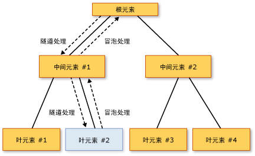

# 路由事件概述
本主题描述 [!INCLUDE[TLA#tla_winclient](../../../../includes/tlasharptla-winclient-md.md)] 中路由事件的概念。 本主题定义路由事件术语、描述路由事件如何通过元素树来路由、概述如何处理路由事件，并介绍如何创建你自己的自定义路由事件。
  
   
## 系统必备  
 本主题假定你对如下内容有基本了解：[!INCLUDE[TLA#tla_clr](../../../../includes/tlasharptla-clr-md.md)]、面向对象的编程以及如何将 [!INCLUDE[TLA2#tla_winclient](../../../../includes/tla2sharptla-winclient-md.md)] 元素之间的关系概念化为树。 若要理解本主题中的示例，你还应当了解 [!INCLUDE[TLA#tla_xaml](../../../../includes/tlasharptla-xaml-md.md)] 并知道如何编写非常基本的 [!INCLUDE[TLA2#tla_winclient](../../../../includes/tla2sharptla-winclient-md.md)] 应用程序或页。 有关详细信息，请参见[演练：我第一个 WPF 桌面应用程序](../getting-started/walkthrough-my-first-wpf-desktop-application.md)并[XAML 概述 (WPF)](xaml-overview-wpf.md)。  
  
   
## 什么是路由事件？  
 可以从功能或实现的角度来理解路由事件。 此处对这两种定义均进行了说明，因为有的用户认为前者更有用，有的用户认为后者更有用。  
  
 功能定义：路由的事件是事件的一种可以调用处理程序在元素树中，多个侦听器，而不是事件的只是事件的在引发事件的对象上。  
  
 实现定义：路由的事件是[!INCLUDE[TLA2#tla_clr](../../../../includes/tla2sharptla-clr-md.md)]由的实例提供支持的事件<xref:System.Windows.RoutedEvent>类，并由处理[!INCLUDE[TLA#tla_winclient](../../../../includes/tlasharptla-winclient-md.md)]事件系统。  
  
 典型的 [!INCLUDE[TLA2#tla_winclient](../../../../includes/tla2sharptla-winclient-md.md)] 应用程序中包含许多元素。 无论这些元素是在代码中创建还是在 [!INCLUDE[TLA2#tla_xaml](../../../../includes/tla2sharptla-xaml-md.md)] 中声明，它们存在于彼此关联的元素树关系中。 根据事件的定义，事件路由可以按两种方向之一传播，但是通常会在元素树中从源元素向上“浮升”，直到它到达元素树的根（通常是页面或窗口）。 如果你以前用过 DHTML 对象模型，则可能会熟悉这个浮升概念。  
  
 请思考下面的简单元素树：  
  
 [!code-xaml[EventOvwSupport#GroupButton](~/samples/snippets/csharp/VS_Snippets_Wpf/EventOvwSupport/CSharp/default.xaml#groupbutton)]  
  
 此元素树生成类似如下的内容：  
  
   
  
 在此简化的元素树中，源<xref:System.Windows.Controls.Primitives.ButtonBase.Click>事件是之一<xref:System.Windows.Controls.Button>元素，而所<xref:System.Windows.Controls.Button>单击的是有机会处理事件的第一个元素。 但是，如果没有处理程序附加到<xref:System.Windows.Controls.Button>处理的事件，则该事件将向上冒泡到<xref:System.Windows.Controls.Button>在元素树中，这是父<xref:System.Windows.Controls.StackPanel>。 可能的事件冒泡到<xref:System.Windows.Controls.Border>，然后会到达元素树 （未显示） 的页面根。  
  
 换而言之，此事件路由<xref:System.Windows.Controls.Primitives.ButtonBase.Click>事件：  
  
 Button-->StackPanel-->Border-->...  
  
### 路由事件的顶级方案  
 下面简要概述了需运用路由事件的方案，以及为什么典型的 [!INCLUDE[TLA2#tla_clr](../../../../includes/tla2sharptla-clr-md.md)] 事件不适合这些方案：  
  
 **控件的撰写和封装：** 中的各个控件[!INCLUDE[TLA2#tla_winclient](../../../../includes/tla2sharptla-winclient-md.md)]具有丰富内容模型。 例如，可以将内部的图像<xref:System.Windows.Controls.Button>，这会有效地扩展按钮的可视化树。 但是，所添加的图像不得中断命中测试行为，会使按钮响应<xref:System.Windows.Controls.Primitives.ButtonBase.Click>其内容，即使在用户单击的像素在技术上的图像的一部分。  
  
 **单一处理程序附加点：** 在[!INCLUDE[TLA#tla_winforms](../../../../includes/tlasharptla-winforms-md.md)]，您将不得不多次的同一处理程序附加到处理可能从多个元素引发的事件。 借助路由事件，可以只附加该处理程序一次（如上例中所示），并在必要时使用处理程序逻辑来确定该事件的源位置。 例如，这可以是前面显示的 [!INCLUDE[TLA2#tla_xaml](../../../../includes/tla2sharptla-xaml-md.md)] 的处理程序：  
  
 [!code-csharp[EventOvwSupport#GroupButtonCodeBehind](~/samples/snippets/csharp/VS_Snippets_Wpf/EventOvwSupport/CSharp/default.xaml.cs#groupbuttoncodebehind)]
 [!code-vb[EventOvwSupport#GroupButtonCodeBehind](~/samples/snippets/visualbasic/VS_Snippets_Wpf/EventOvwSupport/visualbasic/default.xaml.vb#groupbuttoncodebehind)]  
  
 **类处理方式：** 路由事件允许由类定义一个静态处理程序。 此类处理程序能够抢在任何附加的实例处理程序之前处理事件。  
  
 **引用事件，而不反射：** 某些代码和标记技术需要采用某种方式来标识特定事件。 路由的事件创建<xref:System.Windows.RoutedEvent>字段作为标识符，它提供一种可靠的事件标识技术，不需要静态或运行时反射。  
  
### 路由事件的实现方式  
 路由的事件是[!INCLUDE[TLA2#tla_clr](../../../../includes/tla2sharptla-clr-md.md)]由的实例提供支持的事件<xref:System.Windows.RoutedEvent>类，并使用注册[!INCLUDE[TLA2#tla_winclient](../../../../includes/tla2sharptla-winclient-md.md)]事件系统。 <xref:System.Windows.RoutedEvent>从注册中获取的实例通常保留为`public` `static` `readonly`字段成员的类的注册，并因此"拥有"路由的事件。 与同名 [!INCLUDE[TLA2#tla_clr](../../../../includes/tla2sharptla-clr-md.md)] 事件（有时称为“包装器”事件）的连接是通过替代 [!INCLUDE[TLA2#tla_clr](../../../../includes/tla2sharptla-clr-md.md)] 事件的 `add` 和 `remove` 实现来完成的。 通常，`add` 和 `remove` 保留为隐式默认值，该默认值使用特定于语言的相应事件语法来添加和删除该事件的处理程序。 路由的事件支持和连接机制是从概念上讲类似于依赖项属性的方式[!INCLUDE[TLA2#tla_clr](../../../../includes/tla2sharptla-clr-md.md)]支持的属性<xref:System.Windows.DependencyProperty>类，并使用注册[!INCLUDE[TLA2#tla_winclient](../../../../includes/tla2sharptla-winclient-md.md)]属性系统。  
  
 下面的示例演示了自定义的声明`Tap`路由的事件，包括注册和公开<xref:System.Windows.RoutedEvent>标识符字段，并`add`并`remove`实现`Tap` [!INCLUDE[TLA2#tla_clr](../../../../includes/tla2sharptla-clr-md.md)]事件。  
  
 [!code-csharp[RoutedEventCustom#AddRemoveHandler](~/samples/snippets/csharp/VS_Snippets_Wpf/RoutedEventCustom/CSharp/SDKSampleLibrary/class1.cs#addremovehandler)]
 [!code-vb[RoutedEventCustom#AddRemoveHandler](~/samples/snippets/visualbasic/VS_Snippets_Wpf/RoutedEventCustom/VB/SDKSampleLibrary/Class1.vb#addremovehandler)]  
  
### 路由事件处理程序和 XAML  
 若要使用 [!INCLUDE[TLA2#tla_xaml](../../../../includes/tla2sharptla-xaml-md.md)] 为事件添加处理程序，可将该事件的名称声明为用作事件侦听器的元素的属性。 该属性的值是所实现的处理程序方法的名称，该方法必须存在于代码隐藏文件的分部类中。  
  
 [!code-xaml[EventOvwSupport#SimplestSyntax](~/samples/snippets/csharp/VS_Snippets_Wpf/EventOvwSupport/CSharp/default.xaml#simplestsyntax)]  
  
 用来添加标准 [!INCLUDE[TLA2#tla_clr](../../../../includes/tla2sharptla-clr-md.md)] 事件处理程序的 [!INCLUDE[TLA2#tla_xaml](../../../../includes/tla2sharptla-xaml-md.md)] 语法与用来添加路由事件处理程序的语法相同，因为实际上是向底层具有路由事件实现的 [!INCLUDE[TLA2#tla_clr](../../../../includes/tla2sharptla-clr-md.md)] 事件包装器添加处理程序。 有关在 [!INCLUDE[TLA2#tla_xaml](../../../../includes/tla2sharptla-xaml-md.md)] 中添加事件处理程序的详细信息，请参阅 [XAML 概述 (WPF)](xaml-overview-wpf.md)。  
  
   
## 路由策略  
 路由事件使用以下三种路由策略之一：  
  
- **浮升：** 调用事件源的事件处理程序。 路由事件随后会路由到后续的父级元素，直到到达元素树的根。 大多数路由事件都使用浮升路由策略。 浮升路由事件通常用于报告来自不同控件或其他 UI 元素的输入或状态变化。  
  
- **直接：** 仅源元素本身才有机会调用处理程序来响应。 这与 [!INCLUDE[TLA#tla_winforms](../../../../includes/tlasharptla-winforms-md.md)] 用于事件的“路由”相似。 但是，与标准不同[!INCLUDE[TLA2#tla_clr](../../../../includes/tla2sharptla-clr-md.md)]事件，直接路由的事件支持类处理 （下一节中介绍类处理） 和可由<xref:System.Windows.EventSetter>和<xref:System.Windows.EventTrigger>。  
  
- **隧道：** 最初，调用元素树的根处的事件处理程序。 随后，路由事件将朝着路由事件的源节点元素（即引发路由事件的元素）方向，沿路由线路传播到后续的子元素。 合成控件的过程中通常会使用或处理隧道路由事件，通过这种方式，可以有意地禁止复合部件中的事件，或者将其替换为特定于整个控件的事件。 在 [!INCLUDE[TLA2#tla_winclient](../../../../includes/tla2sharptla-winclient-md.md)] 中提供的输入事件通常是以隧道/浮升对实现的。 隧道事件有时又称作预览事件，这是由该对所使用的命名约定决定的。  
  
   
## 为什么使用路由事件？  
 作为应用程序开发人员，你不需要始终了解或关注要处理的事件是否作为路由事件实现。 路由事件具有特殊的行为，但是，如果在引发该行为的元素上处理事件，则该行为通常会不可见。  
  
 如果使用以下任一建议方案，路由事件的功能将得到充分发挥：在公用根处定义公用处理程序、合成自己的控件或者定义自己的自定义控件类。  
  
 路由事件侦听器和路由事件源不必在其层次结构中共享公用事件。 任何<xref:System.Windows.UIElement>或<xref:System.Windows.ContentElement>可以是任一路由事件的事件侦听器。 因此，可以将有效的 [!INCLUDE[TLA2#tla_api](../../../../includes/tla2sharptla-api-md.md)] 集中可用的全套路由事件用作概念“接口”，应用程序中的不同元素通过这个接口来交换事件信息。 路由事件的这个“接口”概念特别适用于输入事件。  
  
 路由事件还可以用于通过元素树进行通信，因为事件的事件数据会保留到路由中的每个元素中。 一个元素可以更改事件数据中的某些内容，该更改将用于路由中的下一个元素。  
  
 之所以将任何给定的 [!INCLUDE[TLA2#tla_winclient](../../../../includes/tla2sharptla-winclient-md.md)] 事件作为路由事件实现（而不是作为标准 [!INCLUDE[TLA2#tla_clr](../../../../includes/tla2sharptla-clr-md.md)] 事件实现），除了路由方面的原因，还有两个其他原因。 如果要实现自己的事件，则可能也需要考虑这些原则：  
  
- 某些[!INCLUDE[TLA2#tla_winclient](../../../../includes/tla2sharptla-winclient-md.md)]样式和模板化功能，如<xref:System.Windows.EventSetter>和<xref:System.Windows.EventTrigger>需要被引用的事件是路由的事件。 前面提到的事件标识符方案就是这样的。  
  
- 路由事件支持类处理机制，类可以通过该机制来指定静态方法，这些静态方法能够在任何已注册的实例处理程序访问路由事件之前，处理这些路由事件。 这在控件设计中非常有用，因为类可以强制执行事件驱动的类行为，以防它们在处理实例上的事件时被意外禁止。  
  
 本主题将用单独的章节来讨论上述每个因素。  
  
   
## 为路由事件添加和实现事件处理程序  
 若要在 [!INCLUDE[TLA2#tla_xaml](../../../../includes/tla2sharptla-xaml-md.md)] 中添加事件处理程序，只需将事件名称作为属性添加到元素中，并将属性值设置为用来实现相应委托的事件处理程序的名称，如下面的示例中所示。  
  
 [!code-xaml[EventOvwSupport#SimplestSyntax](~/samples/snippets/csharp/VS_Snippets_Wpf/EventOvwSupport/CSharp/default.xaml#simplestsyntax)]  
  
 `b1SetColor` 包含用于处理的代码实现的处理程序的名称<xref:System.Windows.Controls.Primitives.ButtonBase.Click>事件。 `b1SetColor` 必须具有相同的签名<xref:System.Windows.RoutedEventHandler>委托，委托是事件处理程序委托的<xref:System.Windows.Controls.Primitives.ButtonBase.Click>事件。 所有路由事件处理程序委托的第一个参数都指定要向其中添加事件处理程序的元素，第二个参数指定事件的数据。  
  
[!code-csharp[EventOvwSupport#SimpleHandlerA](~/samples/snippets/csharp/VS_Snippets_Wpf/EventOvwSupport/CSharp/default.xaml.cs#simplehandlera)]
[!code-vb[EventOvwSupport#SimpleHandlerA](~/samples/snippets/visualbasic/VS_Snippets_Wpf/EventOvwSupport/visualbasic/default.xaml.vb#simplehandlera)]  
  
 <xref:System.Windows.RoutedEventHandler> 是基本的路由的事件处理程序委托。 对于针对某些控件或方案的专用路由事件，要用于路由事件处理程序的委托还可能会变得更加专用化，以便可以传输专用的事件数据。 例如，在常见的输入方案中，可能需要处理<xref:System.Windows.UIElement.DragEnter>路由的事件。 您的处理程序应实现<xref:System.Windows.DragEventHandler>委托。 通过使用更具体的委托，可以处理<xref:System.Windows.DragEventArgs>中的处理程序和读取<xref:System.Windows.DragEventArgs.Data%2A>属性，其中包含拖动操作的剪贴板有效负载。  
  
 有关如何使用 [!INCLUDE[TLA2#tla_xaml](../../../../includes/tla2sharptla-xaml-md.md)] 向元素中添加事件处理程序的完整示例，请参阅[处理路由事件](how-to-handle-a-routed-event.md)。  
  
 在用代码创建的应用程序中为路由事件添加处理程序非常简单。 路由的事件处理程序始终可通过一个帮助器方法添加<xref:System.Windows.UIElement.AddHandler%2A>(它是现有支持进行调用的相同方法`add`。)但是，现有的 [!INCLUDE[TLA2#tla_winclient](../../../../includes/tla2sharptla-winclient-md.md)] 路由事件通常借助于支持机制来实现 `add` 和 `remove` 逻辑，这些实现允许使用特定于语言的事件语法来添加路由事件的处理程序，特定于语言的事件语法比 Helper 方法更直观。 下面是 Helper 方法的示例用法：  
  
 [!code-csharp[EventOvwSupport#AddHandlerCode](~/samples/snippets/csharp/VS_Snippets_Wpf/EventOvwSupport/CSharp/default.xaml.cs#addhandlercode)]
 [!code-vb[EventOvwSupport#AddHandlerCode](~/samples/snippets/visualbasic/VS_Snippets_Wpf/EventOvwSupport/visualbasic/default.xaml.vb#addhandlercode)]  
  
 下面的示例说明C#运算符 （Visual Basic 原因是其处理的取消引用具有略有不同的运算符语法） 的语法：  
  
 [!code-csharp[EventOvwSupport#AddHandlerPlusEquals](~/samples/snippets/csharp/VS_Snippets_Wpf/EventOvwSupport/CSharp/default.xaml.cs#addhandlerplusequals)]
 [!code-vb[EventOvwSupport#AddHandlerPlusEquals](~/samples/snippets/visualbasic/VS_Snippets_Wpf/EventOvwSupport/visualbasic/default.xaml.vb#addhandlerplusequals)]  
  
 有关如何在代码中添加事件处理程序的示例，请参阅[使用代码添加事件处理程序](how-to-add-an-event-handler-using-code.md)。  
  
 如果使用的 Visual Basic，您还可以使用`Handles`关键字作为处理程序声明的一部分添加处理程序。 有关详细信息，请参阅 [Visual Basic 和 WPF 事件处理](visual-basic-and-wpf-event-handling.md)。  
  
   
### “已处理”概念  
 所有路由的事件都共享一个公共事件数据基类， <xref:System.Windows.RoutedEventArgs>。 <xref:System.Windows.RoutedEventArgs> 定义<xref:System.Windows.RoutedEventArgs.Handled%2A>属性，它采用一个布尔值。 目的<xref:System.Windows.RoutedEventArgs.Handled%2A>属性是启用的路由将为该路由的事件标记任何事件处理程序*处理*，通过设置的值<xref:System.Windows.RoutedEventArgs.Handled%2A>到`true`。 处理程序在路由上的某个元素处对共享事件数据进行处理之后，这些数据将再次报告给路由上的每个侦听器。  
  
 值<xref:System.Windows.RoutedEventArgs.Handled%2A>影响如何路由的事件的报告或处理传输时进一步路由。 如果<xref:System.Windows.RoutedEventArgs.Handled%2A>是`true`在事件路由的事件，则侦听该路由事件在其他元素上的处理程序的数据通常不会再调用为该特定事件实例。 这条规则对以下两类处理程序均适用：在 [!INCLUDE[TLA2#tla_xaml](../../../../includes/tla2sharptla-xaml-md.md)] 中附加的处理程序；由特定于语言的事件处理程序附加语法（如 `+=` 或 `Handles`）添加的处理程序。 对于最常见的处理程序方案，事件标记为已处理通过设置<xref:System.Windows.RoutedEventArgs.Handled%2A>到`true`将"停止"路由隧道路由或浮升路由，以及可由类处理程序处理的路由中的某个位置的任何事件。  
  
 但是，没有"handledEventsToo"机制，侦听器仍可运行处理程序响应路由事件在其中<xref:System.Windows.RoutedEventArgs.Handled%2A>是`true`事件数据中。 换言之，将事件数据标记为“已处理”并不会真的停止事件路由。 在代码中，或在只能使用 handledEventsToo 机制<xref:System.Windows.EventSetter>:  
  
- 在代码中，而不是使用常规的工作方式的特定于语言的事件语法[!INCLUDE[TLA2#tla_clr](../../../../includes/tla2sharptla-clr-md.md)]事件，调用[!INCLUDE[TLA2#tla_winclient](../../../../includes/tla2sharptla-winclient-md.md)]方法<xref:System.Windows.UIElement.AddHandler%28System.Windows.RoutedEvent%2CSystem.Delegate%2CSystem.Boolean%29>来添加处理程序。 请将 `handledEventsToo` 的值指定为 `true`。  
  
- 在中<xref:System.Windows.EventSetter>，将<xref:System.Windows.EventSetter.HandledEventsToo%2A>属性不存在`true`。  
  
 除了行为的<xref:System.Windows.RoutedEventArgs.Handled%2A>路由事件，这一概念在生成状态<xref:System.Windows.RoutedEventArgs.Handled%2A>牵涉到将应用程序设计和编写事件处理程序代码的方式。 从概念上讲<xref:System.Windows.RoutedEventArgs.Handled%2A>作为路由事件公开的简单协议。 具体使用此协议负责，但如何进行概念设计的值<xref:System.Windows.RoutedEventArgs.Handled%2A>应使用如下所示：  
  
- 如果路由事件标记为“已处理”，则它不必由该路由中的其他元素再次处理。  
  
- 如果路由的事件未标记为已处理，则路由中前面的其他侦听器已选择不进行注册处理程序或已注册的选择不操作事件数据和设置的处理程序<xref:System.Windows.RoutedEventArgs.Handled%2A>到`true`。 （或者，当前侦听器很可能是路由中的第一个点。）当前侦听器上的处理程序现在有三个可能的操作过程：  
  
    - 不执行任何操作；该事件保持未处理状态，该事件将路由到下一个侦听器。  
  
    - 执行代码以响应该事件，但是所执行的操作被视为不足以保证将事件标记为“已处理”。 该事件将路由到下一个侦听器。  
  
    - 执行代码以响应该事件。 在传递到处理程序的事件数据中将该事件标记为“已处理”，因为所执行的操作被视为不足以保证将该事件标记为“已处理”。 该事件仍将路由到下一个侦听器，但<xref:System.Windows.RoutedEventArgs.Handled%2A> = `true`在其事件数据，因此，只有`handledEventsToo`侦听器都有机会进一步调用处理程序。  
  
 此概念设计通过前面所述的路由行为得到增强： 会更加困难 （尽管仍可以在代码或样式） 来调用即使路由前面的处理程序已设置路由事件附加处理程序<xref:System.Windows.RoutedEventArgs.Handled%2A>到`true`。  
  
 有关详细信息<xref:System.Windows.RoutedEventArgs.Handled%2A>、 的类处理路由事件和有关时建议适当的标记作为路由的事件<xref:System.Windows.RoutedEventArgs.Handled%2A>，请参阅[路由事件标记为已处理，和类处理](marking-routed-events-as-handled-and-class-handling.md)。  
  
 在应用程序中，相当常见的做法是只针对引发浮升路由事件的对象来处理该事件，而根本不考虑事件的路由特征。 但是，在事件数据中将路由事件标记为“已处理”仍是一个不错的做法，因为这样可以防止元素树中位置更高的元素也对同一个路由事件附加了处理程序而出现意外的副作用。  
  
   
## 类处理程序  
 如果定义派生的类以某种方式从<xref:System.Windows.DependencyObject>，还可以定义并附加路由事件是您的类声明或继承事件成员的类处理程序。 每当路由事件到达其路由中的元素实例时，都会先调用类处理程序，然后再调用附加到该类某个实例的任何实例侦听器处理程序。  
  
 有些 [!INCLUDE[TLA2#tla_winclient](../../../../includes/tla2sharptla-winclient-md.md)] 控件对某些路由事件具有固有的类处理。 路由事件可能看起来从未引发过，但实际上正对其进行类处理，如果使用某些技术，路由事件还是可以由实例处理程序进行处理。 此外，许多基类和控件会公开可用来替代类处理行为的虚拟方法。 若要深入了解如何解决不需要的类处理以及如何在自定义类中定义自己的类处理，请参阅[将路由事件标记为“已处理”和类处理](marking-routed-events-as-handled-and-class-handling.md)。  
  
   
## WPF 中的附加事件  
 [!INCLUDE[TLA2#tla_xaml](../../../../includes/tla2sharptla-xaml-md.md)] 语言还定义了一个名为附加事件的特殊类型的事件。 使用附加事件，可以将特定事件的处理程序添加到任意元素中。 处理事件的元素不必定义或继承附加事件，可能引发事件的对象和用来处理实例的目标也都不必将该事件定义为类成员，或将其作为类成员来“拥有”。  
  
 [!INCLUDE[TLA2#tla_winclient](../../../../includes/tla2sharptla-winclient-md.md)] 输入系统广泛使用附加事件。 但是，几乎所有的附加事件都是通过基本元素转发的。 输入事件随后会显示为作为基本元素类成员的等效非附加路由事件。 例如，基础附加事件<xref:System.Windows.Input.Mouse.MouseDown?displayProperty=nameWithType>可以更方便地处理针对任何给定<xref:System.Windows.UIElement>通过使用<xref:System.Windows.UIElement.MouseDown>上的<xref:System.Windows.UIElement>而不是可以处理附加的事件语法中[!INCLUDE[TLA2#tla_xaml](../../../../includes/tla2sharptla-xaml-md.md)]或代码。  
  
 有关 [!INCLUDE[TLA2#tla_winclient](../../../../includes/tla2sharptla-winclient-md.md)] 中附加事件的详细信息，请参阅[附加事件概述](attached-events-overview.md)。  
  
   
## XAML 中的限定事件名称  
 为子元素所引发的路由事件附加处理程序是另一个语法用法，它与 typename.eventname 附加事件语法相似，但它并非严格意义上的附加事件用法。 可以向公用父级附加处理程序以利用事件路由，即使公用父级可能没有作为成员的相关路由事件，也是如此。 请再次思考下面的示例：  
  
 [!code-xaml[EventOvwSupport#GroupButton](~/samples/snippets/csharp/VS_Snippets_Wpf/EventOvwSupport/CSharp/default.xaml#groupbutton)]  
  
 在这里，添加了处理程序的父元素侦听器是<xref:System.Windows.Controls.StackPanel>。 但是，它添加声明时，将通过引发的路由事件处理程序<xref:System.Windows.Controls.Button>类 (<xref:System.Windows.Controls.Primitives.ButtonBase>实际上，但是可以由<xref:System.Windows.Controls.Button>通过继承)。 <xref:System.Windows.Controls.Button> "拥有"该事件，但是路由的事件系统允许处理程序附加到任何任何路由事件<xref:System.Windows.UIElement>或<xref:System.Windows.ContentElement>实例侦听器，否则无法附加侦听器[!INCLUDE[TLA#tla_clr](../../../../includes/tlasharptla-clr-md.md)]事件。 对于这些限定的事件特性名来说，默认的 xmlns 命名空间通常是默认的 [!INCLUDE[TLA2#tla_winclient](../../../../includes/tla2sharptla-winclient-md.md)] xmlns 命名空间，但是还可以为自定义路由事件指定带有前缀的命名空间。 有关 xmlns 的详细信息，请参阅 [WPF XAML 的 XAML 命名空间和命名空间映射](xaml-namespaces-and-namespace-mapping-for-wpf-xaml.md)。  
  
   
## WPF 输入事件  
 路由事件在 [!INCLUDE[TLA2#tla_winclient](../../../../includes/tla2sharptla-winclient-md.md)] 平台中的常见应用之一是用于事件输入。 在 [!INCLUDE[TLA2#tla_winclient](../../../../includes/tla2sharptla-winclient-md.md)] 中，按照约定，隧道路由事件的名称以单词“Preview”开头。 输入事件通常成对出现，一个是浮升事件，另一个是隧道事件。 例如，<xref:System.Windows.ContentElement.KeyDown>事件和<xref:System.Windows.ContentElement.PreviewKeyDown>事件具有相同的签名，前者是浮升输入的事件，后者是隧道输入事件。 偶尔，输入事件只有浮升版本，或者有可能只有直接路由版本。 在文档中，路由事件主题交叉引用具有备用路由策略的类似路由事件（如果存在这类路由事件），托管的引用页面中的相关部分阐明每个路由事件的路由策略。  
  
 实现成对出现的 [!INCLUDE[TLA2#tla_winclient](../../../../includes/tla2sharptla-winclient-md.md)] 输入事件，使来自输入的单个用户操作（如按鼠标按钮）按顺序引发该对中的两个路由事件。 首先引发隧道事件并沿路由传播。 然后引发浮升事件并沿路由传播。 两个事件按字面意思共享相同的事件数据实例，因为<xref:System.Windows.UIElement.RaiseEvent%2A>引发浮升事件在实现类中的方法调用侦听隧道事件中的事件数据，并在新引发的事件中重用它。 具有隧道事件处理程序的侦听器首先获得将路由事件标记为“已处理”的机会（首先是类处理程序，然后是实例处理程序）。 如果隧道路由中的某个元素将路由事件标记为“已处理”，则会针对浮升事件发送已处理的事件数据，而且将不调用等效的浮升输入事件的附加典型处理程序。 已处理的浮升事件看起来好像尚未引发。 此处理行为对于控件合成非常有用，因为在此情况下你可能希望所有基于命中测试的输入事件或者所有基于焦点的输入事件都由最终的控件（而不是它的复合部件）报告。 作为可支持控件类的代码的一部分，最后一个控件元素靠近合成中的根，因此将有机会首先对隧道事件进行类处理，或者有机会将该路由事件“替换”为更针对控件的事件。  
  
 为了说明输入事件处理的工作方式，请思考下面的输入事件示例。 在下面的树插图中，`leaf element #2` 是先后发生的 `PreviewMouseDown` 事件和 `MouseDown` 事件的源。  
  
   
输入事件的浮升和隧道  
  
 事件的处理顺序如下所述：  
  
1. 针对根元素处理 `PreviewMouseDown`（隧道）。  
  
2. 针对中间元素 #1 处理 `PreviewMouseDown`（隧道）。  
  
3. 针对源元素 #2 处理 `PreviewMouseDown`（隧道）。  
  
4. 针对源元素 #2 处理 `MouseDown`（浮升）。  
  
5. 针对中间元素 #1 处理 `MouseDown`（浮升）。  
  
6. 针对根元素处理 `MouseDown`（浮升）。  
  
 路由事件处理程序委托提供对以下两个对象的引用：引发该事件的对象以及在其中调用处理程序的对象。 在其中调用处理程序的对象是由 `sender` 参数报告的对象。 首先引发该事件的对象报告的<xref:System.Windows.RoutedEventArgs.Source%2A>事件数据中的属性。 路由的事件仍可以引发并由同一个对象，在这种情况下处理`sender`和<xref:System.Windows.RoutedEventArgs.Source%2A>是相同的 （这是与步骤 3 和 4 中的事件处理示例列表的情况）。  
  
 由于存在隧道和浮升，父元素接收输入的事件其中<xref:System.Windows.RoutedEventArgs.Source%2A>是一个及其子元素。 必须了解源元素时，您可以通过访问来标识源元素<xref:System.Windows.RoutedEventArgs.Source%2A>属性。  
  
 通常情况下，输入的事件标记后<xref:System.Windows.RoutedEventArgs.Handled%2A>，进一步不调用处理程序。 通常，一旦调用了用来对输入事件的含义进行特定于应用程序的逻辑处理的处理程序，就应当将输入事件标记为“已处理”。  
  
 有关此通用声明异常<xref:System.Windows.RoutedEventArgs.Handled%2A>状态是输入的事件处理程序注册为有意忽略<xref:System.Windows.RoutedEventArgs.Handled%2A>事件数据的状态仍会调用路由。 有关详细信息，请参阅[预览事件](preview-events.md)或[将路由事件标记为“已处理”和类处理](marking-routed-events-as-handled-and-class-handling.md)。  
  
 通常，隧道事件和浮升事件之间的共享事件数据模型以及先引发隧道事件后引发浮升事件的顺序引发并非适用于所有的路由事件的概念。 该行为的实现取决于 [!INCLUDE[TLA2#tla_winclient](../../../../includes/tla2sharptla-winclient-md.md)] 输入设备选择引发和连接输入事件对的具体方式。 实现你自己的输入事件是一个高级方案，但是你也可以选择针对自己的输入事件遵循该模型。  
  
 一些类选择对某些输入事件进行类处理，其目的通常是重新定义用户驱动的特定输入事件在该控件中的含义并引发新事件。 有关详细信息，请参阅[将路由事件标记为“已处理”和类处理](marking-routed-events-as-handled-and-class-handling.md)。  
  
 有关输入以及在典型的应用程序方案中输入和事件如何交互的详细信息，请参阅[输入概述](input-overview.md)。  
  
   
## EventSetter 和 EventTrigger  
 在样式中，您可以添加一些预先声明[!INCLUDE[TLA2#tla_xaml](../../../../includes/tla2sharptla-xaml-md.md)]事件处理的标记中的语法使用<xref:System.Windows.EventSetter>。 在应用样式时，所引用的处理程序会添加到带样式的实例中。 您可以声明<xref:System.Windows.EventSetter>仅为路由事件。 下面是一个示例。 请注意，此处引用的 `b1SetColor` 方法位于代码隐藏文件中。  
  
 [!code-xaml[EventOvwSupport#XAML2](~/samples/snippets/csharp/VS_Snippets_Wpf/EventOvwSupport/CSharp/page2.xaml#xaml2)]  
  
 好处是，样式有可能包含大量的其他信息，可应用到你的应用程序中任何按钮和具有<xref:System.Windows.EventSetter>属于该样式将提升甚至在标记级别的代码重用。 此外，<xref:System.Windows.EventSetter>抽象化处理程序进一步从常规的应用程序和页面标记的方法名称。  
  
 路由的事件和动画功能组合在一起的另一个专用的语法[!INCLUDE[TLA2#tla_winclient](../../../../includes/tla2sharptla-winclient-md.md)]是<xref:System.Windows.EventTrigger>。 如同<xref:System.Windows.EventSetter>，只有路由的事件可用于<xref:System.Windows.EventTrigger>。 通常情况下，<xref:System.Windows.EventTrigger>声明为样式的一部分，但<xref:System.Windows.EventTrigger>也可以声明的一部分在页级别的元素<xref:System.Windows.FrameworkElement.Triggers%2A>集合，或在<xref:System.Windows.Controls.ControlTemplate>。 <xref:System.Windows.EventTrigger> ，可指定<xref:System.Windows.Media.Animation.Storyboard>运行每当路由的事件到达其路由中的某个元素声明<xref:System.Windows.EventTrigger>该事件。 利用<xref:System.Windows.EventTrigger>转移只需处理事件并使其启动现有情节提要是<xref:System.Windows.EventTrigger>提供更好地控制情节提要和其运行时行为。 有关详细信息，请参阅[在情节提要启动之后使用事件触发器来控制情节提要](../graphics-multimedia/how-to-use-event-triggers-to-control-a-storyboard-after-it-starts.md)。  
  
   
## 有关路由事件的更多信息  
 本主题主要从以下角度讨论路由事件：描述基本概念；就如何以及何时响应各种基元素和控件中已经存在的路由事件提供指南。 但是，你可以在自定义类上创建自己的路由事件以及所有必要的支持（如专用的事件数据类和委托）。 路由的事件的所有者可以是任何类，但必须由引发并由处理路由的事件<xref:System.Windows.UIElement>或<xref:System.Windows.ContentElement>这样才可供派生类。 有关自定义事件的详细信息，请参阅[创建自定义路由事件](how-to-create-a-custom-routed-event.md)。  
  
## 请参阅

- <xref:System.Windows.EventManager>
- <xref:System.Windows.RoutedEvent>
- <xref:System.Windows.RoutedEventArgs>
- [将路由事件标记为“已处理”和“类处理”](marking-routed-events-as-handled-and-class-handling.md)
- [输入概述](input-overview.md)
- [命令概述](commanding-overview.md)
- [自定义依赖属性](custom-dependency-properties.md)
- [WPF 中的树](trees-in-wpf.md)
- [弱事件模式](weak-event-patterns.md)
