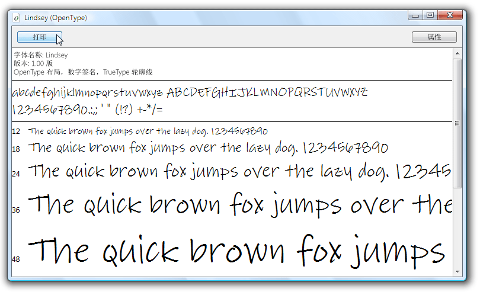

# 示例 OpenType 字体包
本主题概述随 [!INCLUDE[TLA2#tla_wcsdk](../../../../includes/tla2sharptla-wcsdk-md.md)] 一起分发的示例 [!INCLUDE[TLA#tla_opentype](../../../../includes/tlasharptla-opentype-md.md)] 字体。 这些示例字体支持可供 [!INCLUDE[TLA#tla_winclient](../../../../includes/tlasharptla-winclient-md.md)] 应用程序使用的扩展的 [!INCLUDE[TLA#tla_opentype](../../../../includes/tlasharptla-opentype-md.md)] 功能。  
  
  
   
## OpenType 字体包中的字体  
 [!INCLUDE[TLA2#tla_wcsdk](../../../../includes/tla2sharptla-wcsdk-md.md)] 提供一组可用来创建 [!INCLUDE[TLA#tla_winclient](../../../../includes/tlasharptla-winclient-md.md)] 应用程序的示例 [!INCLUDE[TLA#tla_opentype](../../../../includes/tlasharptla-opentype-md.md)] 字体。 这些示例字体在 Ascender Corporation 的许可下提供。 它们仅实现由 [!INCLUDE[TLA#tla_opentype](../../../../includes/tlasharptla-opentype-md.md)] 格式所定义的全部功能的一部分。 下表列出了示例 [!INCLUDE[TLA#tla_opentype](../../../../includes/tlasharptla-opentype-md.md)] 字体的名称。  
  
|**名称**|**文件**|  
|--------------|--------------|  
|Kootenay|Kooten.ttf|  
|Lindsey|Linds.ttf|  
|Miramonte|Miramo.ttf|  
|Miramonte Bold|Miramob.ttf|  
|Pericles|Peric.ttf|  
|Pericles Light|Pericl.ttf|  
|Pescadero|Pesca.ttf|  
|Pescadero Bold|Pescab.ttf|  
  
 下图展示了示例 [!INCLUDE[TLA#tla_opentype](../../../../includes/tlasharptla-opentype-md.md)] 字体。  
  
   
OpenType 字体包中的字体  
  
 这些示例字体在 Ascender Corporation 的许可下提供。 Ascender 是一家高级字体产品提供商。 若要对示例字体的扩展版本或自定义版本进行授权，请参阅 [Ascender Corporation 的网站](https://go.microsoft.com/fwlink/?LinkId=182627)。  
  
> [!NOTE]
>  开发人员有责任确保自己具备必要的许可权，可以在应用程序中嵌入相应的字体或者以其他方式重新分布。  
  
   
## 安装字体  
 可以选择将示例 [!INCLUDE[TLA#tla_opentype](../../../../includes/tlasharptla-opentype-md.md)] 字体安装到默认 [!INCLUDE[TLA#tla_mswin](../../../../includes/tlasharptla-mswin-md.md)] 字体目录：**\WINDOWS\Fonts**。 使用“字体”控制面板安装字体。 在计算机上安装这些字体后，引用默认 [!INCLUDE[TLA#tla_mswin](../../../../includes/tlasharptla-mswin-md.md)] 字体的所有应用程序都可访问这些字体。 可以通过双击字体文件以多种字体大小来显示具有代表性的字符集。 下面的屏幕截图显示 Lindsey 字体文件 Linds.ttf。  
  
   
显示 Lindsey 字体  
  
   
## 使用字体  
 可以通过两种方法在应用程序中使用字体。 可以将字体作为项目内容项添加到应用程序中，这些项目内容项不会作为资源嵌入到程序集中。 此外，还可以将字体作为嵌入到应用程序程序集文件中的项目资源项添加到应用程序中。 有关详细信息，请参阅[将字体与应用程序一起打包](../../../../docs/framework/wpf/advanced/packaging-fonts-with-applications.md)。  
  
## 请参阅  
 <xref:System.Windows.Documents.Typography>  
 [OpenType 字体功能](../../../../docs/framework/wpf/advanced/opentype-font-features.md)  
 [将字体与应用程序一起打包](../../../../docs/framework/wpf/advanced/packaging-fonts-with-applications.md)
