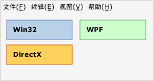
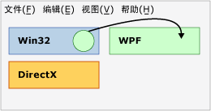
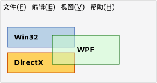
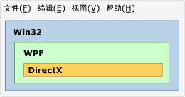
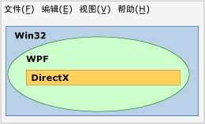

# 技术区概述Technology Regions Overview
如果在应用程序中使用多种呈现技术（例如 WPF、Win32 或 DirectX），则这些呈现技术必须共享公共顶级窗口中的呈现区域。If multiple presentation technologies are used in an application, such as WPF, Win32, or DirectX, they must share the rendering areas within a common top-level window. 本主题介绍可能会对 WPF 互操作应用程序的呈现和输入造成影响的问题。This topic describes issues that might influence the presentation and input for your WPF interoperation application.  
  
## 区域Regions  
 在顶级窗口内，可以这么想：每个包含互操作应用程序某个技术的 HWND 都具有自己的区域（也称为“空域”）。Within a top-level window, you can conceptualize that each HWND that comprises one of the technologies of an interoperation application has its own region (also called "airspace"). 窗口内的每个像素都只属于一个特定 HWND，这构成了该 HWND 的区域。Each pixel within the window belongs to exactly one HWND, which constitutes the region of that HWND. （严格地说，如果有多个 [!INCLUDE[TLA2#tla_winclient](../../../../includes/tla2sharptla-winclient-md.md)] HWND，便会有多个 [!INCLUDE[TLA2#tla_winclient](../../../../includes/tla2sharptla-winclient-md.md)] 区域，但为了便于讨论，可以假定只有一个区域。）(Strictly speaking, there is more than one [!INCLUDE[TLA2#tla_winclient](../../../../includes/tla2sharptla-winclient-md.md)] region if there is more than one [!INCLUDE[TLA2#tla_winclient](../../../../includes/tla2sharptla-winclient-md.md)] HWND, but for purposes of this discussion, you can assume there is only one). 区域暗含了这样一层含义：应用程序生存期内尝试在该像素之上呈现的所有层或其他窗口都必须是同一呈现级技术的一部分。The region implies that all layers or other windows that attempt to render above that pixel during application lifetime must be part of the same render-level technology. 尝试在 [!INCLUDE[TLA2#tla_win32](../../../../includes/tla2sharptla-win32-md.md)] 上方呈现 [!INCLUDE[TLA2#tla_winclient](../../../../includes/tla2sharptla-winclient-md.md)] 像素会导致意外结果，应尽量通过互操作 [!INCLUDE[TLA2#tla_api#plural](../../../../includes/tla2sharptla-apisharpplural-md.md)] 禁止这种尝试。Attempting to render [!INCLUDE[TLA2#tla_winclient](../../../../includes/tla2sharptla-winclient-md.md)] pixels over [!INCLUDE[TLA2#tla_win32](../../../../includes/tla2sharptla-win32-md.md)] leads to undesirable results, and is disallowed as much as possible through the interoperation [!INCLUDE[TLA2#tla_api#plural](../../../../includes/tla2sharptla-apisharpplural-md.md)].  
  
### 区域示例Region Examples  
 下图显示一个混合使用 [!INCLUDE[TLA2#tla_win32](../../../../includes/tla2sharptla-win32-md.md)]、[!INCLUDE[TLA2#tla_dx](../../../../includes/tla2sharptla-dx-md.md)] 和 [!INCLUDE[TLA2#tla_winclient](../../../../includes/tla2sharptla-winclient-md.md)] 的应用程序。The following illustration shows an application that mixes [!INCLUDE[TLA2#tla_win32](../../../../includes/tla2sharptla-win32-md.md)], [!INCLUDE[TLA2#tla_dx](../../../../includes/tla2sharptla-dx-md.md)], and [!INCLUDE[TLA2#tla_winclient](../../../../includes/tla2sharptla-winclient-md.md)]. 每种技术都使用属于自己的且互不重叠的一组像素，因此不存在区域问题。Each technology uses its own separate, non-overlapping set of pixels, and there are no region issues.  
  
   
  
 假设此应用程序使用鼠标指针位置来创建想要在这三个区域中任一区域上方呈现的动画。Suppose that this application uses the mouse pointer position to create an animation that attempts to render over any of these three regions. 无论动画本身采用哪一种技术，该技术都会与其他两种技术的区域发生冲突。No matter which technology was responsible for the animation itself, that technology would violate the region of the other two. 下图演示在一个 Win32 区域上呈现 WPF 圆形的尝试。The following illustration shows an attempt to render a WPF circle over a Win32 region.  
  
   
  
 如果尝试在不同技术间使用透明度/Alpha 混合，也会发生冲突。Another violation is if you try to use transparency/alpha blending between different technologies.  在下图中，[!INCLUDE[TLA2#tla_winclient](../../../../includes/tla2sharptla-winclient-md.md)] 框与 [!INCLUDE[TLA2#tla_win32](../../../../includes/tla2sharptla-win32-md.md)] 和 [!INCLUDE[TLA2#tla_dx](../../../../includes/tla2sharptla-dx-md.md)] 区域存在冲突。In the following illustration, the [!INCLUDE[TLA2#tla_winclient](../../../../includes/tla2sharptla-winclient-md.md)] box violates the [!INCLUDE[TLA2#tla_win32](../../../../includes/tla2sharptla-win32-md.md)] and [!INCLUDE[TLA2#tla_dx](../../../../includes/tla2sharptla-dx-md.md)] regions. 因为该 [!INCLUDE[TLA2#tla_winclient](../../../../includes/tla2sharptla-winclient-md.md)] 框中的像素是半透明的，所以它们必须由 [!INCLUDE[TLA2#tla_dx](../../../../includes/tla2sharptla-dx-md.md)] 和 [!INCLUDE[TLA2#tla_winclient](../../../../includes/tla2sharptla-winclient-md.md)] 共同拥有，但这是不可能的。Because pixels in that [!INCLUDE[TLA2#tla_winclient](../../../../includes/tla2sharptla-winclient-md.md)] box are semi-transparent, they would have to be owned jointly by both [!INCLUDE[TLA2#tla_dx](../../../../includes/tla2sharptla-dx-md.md)] and [!INCLUDE[TLA2#tla_winclient](../../../../includes/tla2sharptla-winclient-md.md)], which is not possible.  因此，这是另一种冲突情况，且不可生成。So this is another violation and cannot be built.  
  
   
  
 前面三个示例使用矩形区域，但也可以使用其他形状。The previous three examples used rectangular regions, but different shapes are possible.  例如，区域可以具有一个孔。For example, a region can have a hole. 下图显示了一个带有矩形孔的 [!INCLUDE[TLA2#tla_win32](../../../../includes/tla2sharptla-win32-md.md)] 区域，其大小为 [!INCLUDE[TLA2#tla_winclient](../../../../includes/tla2sharptla-winclient-md.md)] 和 [!INCLUDE[TLA2#tla_dx](../../../../includes/tla2sharptla-dx-md.md)] 区域的总大小。The following illustration shows a [!INCLUDE[TLA2#tla_win32](../../../../includes/tla2sharptla-win32-md.md)] region with a rectangular hole this is the size of the [!INCLUDE[TLA2#tla_winclient](../../../../includes/tla2sharptla-winclient-md.md)] and [!INCLUDE[TLA2#tla_dx](../../../../includes/tla2sharptla-dx-md.md)] regions combined.  
  
   
  
 区域也可以完全不是矩形，或可以是可由 [!INCLUDE[TLA2#tla_win32](../../../../includes/tla2sharptla-win32-md.md)] HRGN（区域）描述的任何形状。Regions can also be completely nonrectangular, or any shape describable by a [!INCLUDE[TLA2#tla_win32](../../../../includes/tla2sharptla-win32-md.md)] HRGN (region).  
  
   
  
## 透明度和顶级窗口Transparency and Top-Level Windows  
 Windows 中的窗口管理器实际上仅处理 [!INCLUDE[TLA2#tla_win32](../../../../includes/tla2sharptla-win32-md.md)] HWND。The window manager in Windows only really processes [!INCLUDE[TLA2#tla_win32](../../../../includes/tla2sharptla-win32-md.md)] HWNDs. 因此，每个[!INCLUDE[TLA2#tla_winclient](../../../../includes/tla2sharptla-winclient-md.md)]<xref:System.Windows.Window>是 HWND。Therefore, every [!INCLUDE[TLA2#tla_winclient](../../../../includes/tla2sharptla-winclient-md.md)] <xref:System.Windows.Window> is an HWND. <xref:System.Windows.Window> HWND 必须遵守任何 HWND 的一般规则。The <xref:System.Windows.Window> HWND must abide by the general rules for any HWND. 在该 HWND 内，[!INCLUDE[TLA2#tla_winclient](../../../../includes/tla2sharptla-winclient-md.md)] 代码可以执行整个 [!INCLUDE[TLA2#tla_winclient](../../../../includes/tla2sharptla-winclient-md.md)] [!INCLUDE[TLA2#tla_api#plural](../../../../includes/tla2sharptla-apisharpplural-md.md)] 支持的任何操作。Within that HWND, [!INCLUDE[TLA2#tla_winclient](../../../../includes/tla2sharptla-winclient-md.md)] code can do whatever the overall [!INCLUDE[TLA2#tla_winclient](../../../../includes/tla2sharptla-winclient-md.md)] [!INCLUDE[TLA2#tla_api#plural](../../../../includes/tla2sharptla-apisharpplural-md.md)] support. 但是，为实现与桌面上其他 HWND 的交互，[!INCLUDE[TLA2#tla_winclient](../../../../includes/tla2sharptla-winclient-md.md)] 必须遵循 [!INCLUDE[TLA2#tla_win32](../../../../includes/tla2sharptla-win32-md.md)] 处理和呈现规则。But for interactions with other HWNDs on the desktop, [!INCLUDE[TLA2#tla_winclient](../../../../includes/tla2sharptla-winclient-md.md)] must abide by [!INCLUDE[TLA2#tla_win32](../../../../includes/tla2sharptla-win32-md.md)] processing and rendering rules.  [!INCLUDE[TLA2#tla_winclient](../../../../includes/tla2sharptla-winclient-md.md)] 通过使用 [!INCLUDE[TLA2#tla_win32](../../../../includes/tla2sharptla-win32-md.md)] [!INCLUDE[TLA2#tla_api#plural](../../../../includes/tla2sharptla-apisharpplural-md.md)] 来支持非矩形窗口，HRGN 用于非矩形窗口，分层窗口用于每像素 Alpha。 supports non-rectangular windows by using [!INCLUDE[TLA2#tla_win32](../../../../includes/tla2sharptla-win32-md.md)] [!INCLUDE[TLA2#tla_api#plural](../../../../includes/tla2sharptla-apisharpplural-md.md)]—HRGNs for non-rectangular windows, and layered windows for a per-pixel alpha.  
  
 不支持常量 Alpha 和颜色键。Constant alpha and color keys are not supported.  [!INCLUDE[TLA2#tla_win32](../../../../includes/tla2sharptla-win32-md.md)] 分层窗口的功能因平台而异。 layered window capabilities vary by platform.  
  
 分层窗口可通过指定要应用于窗口中每个像素的 Alpha 值来使整个窗口呈现为半透明状。Layered windows can make the entire window translucent (semi-transparent) by specifying an alpha value to apply to every pixel in the window.  （[!INCLUDE[TLA2#tla_win32](../../../../includes/tla2sharptla-win32-md.md)] 实际上支持每像素 Alpha，但这在实际的程序中很难应用，因为在此模式下需要自行绘制任何子 HWND，包括对话框和下拉列表）。([!INCLUDE[TLA2#tla_win32](../../../../includes/tla2sharptla-win32-md.md)] in fact supports per-pixel alpha, but this is very difficult to use in practical programs because in this mode you would need to draw any child HWND yourself, including dialogs and dropdowns).  
  
 [!INCLUDE[TLA2#tla_winclient](../../../../includes/tla2sharptla-winclient-md.md)] 支持 HRGN；但是，对于此功能，没有相应的托管 [!INCLUDE[TLA2#tla_api#plural](../../../../includes/tla2sharptla-apisharpplural-md.md)]。 supports HRGNs; however, there are no managed [!INCLUDE[TLA2#tla_api#plural](../../../../includes/tla2sharptla-apisharpplural-md.md)] for this functionality. 您可以使用平台调用和<xref:System.Windows.Interop.HwndSource>来调用相关[!INCLUDE[TLA2#tla_win32](../../../../includes/tla2sharptla-win32-md.md)] [!INCLUDE[TLA2#tla_api#plural](../../../../includes/tla2sharptla-apisharpplural-md.md)]。You can use platform invoke and <xref:System.Windows.Interop.HwndSource> to call the relevant [!INCLUDE[TLA2#tla_win32](../../../../includes/tla2sharptla-win32-md.md)] [!INCLUDE[TLA2#tla_api#plural](../../../../includes/tla2sharptla-apisharpplural-md.md)]. 有关详细信息，请参阅[从托管代码调用本机函数](/cpp/dotnet/calling-native-functions-from-managed-code)。For more information, see [Calling Native Functions from Managed Code](/cpp/dotnet/calling-native-functions-from-managed-code).  
  
 [!INCLUDE[TLA2#tla_winclient](../../../../includes/tla2sharptla-winclient-md.md)] 分层窗口在不同操作系统上具有不同的功能。 layered windows have different capabilities on different operating systems. 这是因为 [!INCLUDE[TLA2#tla_winclient](../../../../includes/tla2sharptla-winclient-md.md)] 使用 [!INCLUDE[TLA2#tla_dx](../../../../includes/tla2sharptla-dx-md.md)] 进行呈现，而分层窗口主要用于 [!INCLUDE[TLA2#tla_gdi](../../../../includes/tla2sharptla-gdi-md.md)] 呈现，而非 [!INCLUDE[TLA2#tla_dx](../../../../includes/tla2sharptla-dx-md.md)] 呈现。This is because [!INCLUDE[TLA2#tla_winclient](../../../../includes/tla2sharptla-winclient-md.md)] uses [!INCLUDE[TLA2#tla_dx](../../../../includes/tla2sharptla-dx-md.md)] to render, and layered windows were primarily designed for [!INCLUDE[TLA2#tla_gdi](../../../../includes/tla2sharptla-gdi-md.md)] rendering, not [!INCLUDE[TLA2#tla_dx](../../../../includes/tla2sharptla-dx-md.md)] rendering.  
  
-   [!INCLUDE[TLA2#tla_winclient](../../../../includes/tla2sharptla-winclient-md.md)] 支持 [!INCLUDE[TLA#tla_longhorn](../../../../includes/tlasharptla-longhorn-md.md)] 及更高版本上的硬件加速分层窗口。 supports hardware accelerated layered windows on [!INCLUDE[TLA#tla_longhorn](../../../../includes/tlasharptla-longhorn-md.md)] and later. [!INCLUDE[TLA2#tla_winxp](../../../../includes/tla2sharptla-winxp-md.md)] 上的硬件加速分层窗口需要 [!INCLUDE[TLA#tla_dx](../../../../includes/tlasharptla-dx-md.md)] 的支持，所以该功能将取决于计算机上的 [!INCLUDE[TLA#tla_dx](../../../../includes/tlasharptla-dx-md.md)] 的版本。Hardware accelerated layered windows on [!INCLUDE[TLA2#tla_winxp](../../../../includes/tla2sharptla-winxp-md.md)] require support from [!INCLUDE[TLA#tla_dx](../../../../includes/tlasharptla-dx-md.md)], so the capabilities will depend on the version of [!INCLUDE[TLA#tla_dx](../../../../includes/tlasharptla-dx-md.md)] on that machine.  
  
-   [!INCLUDE[TLA2#tla_winclient](../../../../includes/tla2sharptla-winclient-md.md)] 不支持透明度颜色键，因为 [!INCLUDE[TLA2#tla_winclient](../../../../includes/tla2sharptla-winclient-md.md)] 无法保证准确呈现所请求的颜色，尤其当呈现采用了硬件加速时更是如此。 does not support transparency color keys, because [!INCLUDE[TLA2#tla_winclient](../../../../includes/tla2sharptla-winclient-md.md)] cannot guarantee to render the exact color you requested, particularly when rendering is hardware-accelerated.  
  
-   如果应用程序在 [!INCLUDE[TLA2#tla_winxp](../../../../includes/tla2sharptla-winxp-md.md)] 上运行，则 [!INCLUDE[TLA2#tla_dx](../../../../includes/tla2sharptla-dx-md.md)] 图面之上的分层窗口会在 [!INCLUDE[TLA2#tla_dx](../../../../includes/tla2sharptla-dx-md.md)] 应用程序呈现时闪烁。If your application is running on [!INCLUDE[TLA2#tla_winxp](../../../../includes/tla2sharptla-winxp-md.md)], layered windows on top of [!INCLUDE[TLA2#tla_dx](../../../../includes/tla2sharptla-dx-md.md)] surfaces flicker when the [!INCLUDE[TLA2#tla_dx](../../../../includes/tla2sharptla-dx-md.md)] application renders.  （实际的呈现顺序是：[!INCLUDE[TLA#tla_gdi](../../../../includes/tlasharptla-gdi-md.md)] 隐藏分层窗口，然后 [!INCLUDE[TLA2#tla_dx](../../../../includes/tla2sharptla-dx-md.md)] 进行绘制，之后 [!INCLUDE[TLA#tla_gdi](../../../../includes/tlasharptla-gdi-md.md)] 重新显示分层窗口。）(The actual rendering sequence is that [!INCLUDE[TLA#tla_gdi](../../../../includes/tlasharptla-gdi-md.md)] hides the layered window, then [!INCLUDE[TLA2#tla_dx](../../../../includes/tla2sharptla-dx-md.md)] draws, and then [!INCLUDE[TLA#tla_gdi](../../../../includes/tlasharptla-gdi-md.md)] puts the layered window back).  非 [!INCLUDE[TLA2#tla_winclient](../../../../includes/tla2sharptla-winclient-md.md)] 分层窗口也有此限制。Non-[!INCLUDE[TLA2#tla_winclient](../../../../includes/tla2sharptla-winclient-md.md)] layered windows also have this limitation.  
  
## 另请参阅See Also  
 [WPF 和 Win32 互操作WPF and Win32 Interoperation](../../../../docs/framework/wpf/advanced/wpf-and-win32-interoperation.md)  
 [演练：在 Win32 中托管 WPF 时钟Walkthrough: Hosting a WPF Clock in Win32](../../../../docs/framework/wpf/advanced/walkthrough-hosting-a-wpf-clock-in-win32.md)  
 [在 WPF 中承载 Win32 内容Hosting Win32 Content in WPF](../../../../docs/framework/wpf/advanced/hosting-win32-content-in-wpf.md)
