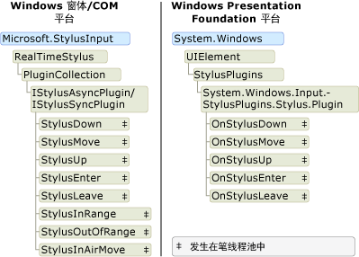

# Ink 对象模型：Windows 窗体和 COM 与 WPF 之比较

有实质上是支持数字墨迹的三个平台： Tablet PC Windows 窗体平台、 Tablet PC COM 平台和 Windows Presentation Foundation (WPF) 平台。  类似的对象模型，但该对象的模型的 Windows 窗体和 COM 平台共享[!INCLUDE[TLA2#tla_wpf](../../../../includes/tla2sharptla-wpf-md.md)]平台具有显著差异。  本主题讨论了在高级别的差异，以便使用了一个对象模型的开发人员可以更好地了解其他。  
  
## 在应用程序中启用墨迹  
 所有三个平台都附带了对象和使应用程序以接收来自 tablet 笔输入控件。  Windows 窗体和 COM 平台附带[Microsoft.Ink.InkPicture](https://msdn.microsoft.com/library/aa514604.aspx)， [Microsoft.Ink.InkEdit](https://msdn.microsoft.com/library/ms835842.aspx)， [Microsoft.Ink.InkOverlay](https://msdn.microsoft.com/library/ms833057.aspx)和[Microsoft.Ink.InkCollector](https://msdn.microsoft.com/library/ms836493.aspx)类。  [Microsoft.Ink.InkPicture](https://msdn.microsoft.com/library/aa514604.aspx)并[Microsoft.Ink.InkEdit](https://msdn.microsoft.com/library/ms835842.aspx)是可以添加的控件的应用程序来收集墨迹。  [Microsoft.Ink.InkOverlay](https://msdn.microsoft.com/library/ms833057.aspx)并[Microsoft.Ink.InkCollector](https://msdn.microsoft.com/library/ms836493.aspx)可以附加到现有的窗口墨迹启用 windows 和自定义控件。  
  
 WPF 平台包括<xref:System.Windows.Controls.InkCanvas>控件。  您可以添加<xref:System.Windows.Controls.InkCanvas>到你的应用程序并立即开始收集墨迹。 使用<xref:System.Windows.Controls.InkCanvas>，用户可以复制、 选择和重设大小墨迹。  你可以添加到其他控件<xref:System.Windows.Controls.InkCanvas>，用户可以通过这些控件中、 太手写和。  可以通过添加创建手写功能的自定义控件<xref:System.Windows.Controls.InkPresenter>和收集其触笔接触点。  
  
 下表列出了在何处了解有关启用应用程序中的手写内容的详细信息：  
  
|若要执行此操作...|在 WPF 平台上...|在 Windows 窗体/COM 平台上...|  
|-----------------|--------------------------|------------------------------------------|  
|向应用程序添加的手写功能的控件|请参阅[墨迹入门](../../../../docs/framework/wpf/advanced/getting-started-with-ink.md)。|请参阅[自动声明窗体示例](/windows/desktop/tablet/auto-claims-form-sample)|  
|启用自定义控件上的墨迹|请参阅[创建墨迹输入控件](../../../../docs/framework/wpf/advanced/creating-an-ink-input-control.md)。|请参阅[墨迹剪贴板示例](/windows/desktop/tablet/ink-clipboard-sample)。|  
  
## 墨迹数据  
 Windows 窗体和 COM 平台上[Microsoft.Ink.InkCollector](https://msdn.microsoft.com/library/ms836493.aspx)， [Microsoft.Ink.InkOverlay](https://msdn.microsoft.com/library/ms833057.aspx)， [Microsoft.Ink.InkEdit](https://msdn.microsoft.com/library/ms835842.aspx)，和[Microsoft.Ink.InkPicture](https://msdn.microsoft.com/library/aa514604.aspx)每个公开[Microsoft.Ink.Ink](https://msdn.microsoft.com/library/aa515768.aspx?displayProperty=nameWithType)对象。 [Microsoft.Ink.Ink](https://msdn.microsoft.com/library/aa515768.aspx)对象的一个或多个包含的数据[Microsoft.Ink.Stroke](https://msdn.microsoft.com/library/ms827842.aspx?displayProperty=nameWithType)对象，并公开公共方法和属性来管理和处理这些笔画。  [Microsoft.Ink.Ink](https://msdn.microsoft.com/library/aa515768.aspx)对象管理包含; 的笔画的生存期[Microsoft.Ink.Ink](https://msdn.microsoft.com/library/aa515768.aspx)对象用于创建和删除它所拥有的笔画。  每个[Microsoft.Ink.Stroke](https://msdn.microsoft.com/library/ms827842.aspx)已在其父级中是唯一的标识符[Microsoft.Ink.Ink](https://msdn.microsoft.com/library/aa515768.aspx)对象。  
  
 在 WPF 平台上，<xref:System.Windows.Ink.Stroke?displayProperty=nameWithType>类拥有并管理自己的生存期。 一组<xref:System.Windows.Ink.Stroke>中可以一起收集对象<xref:System.Windows.Ink.StrokeCollection>，其中提供常见的手写内容的方法的数据管理操作如命中测试、 擦除、 转换和序列化手写内容。 一个<xref:System.Windows.Ink.Stroke>可以属于零、 一个或多个<xref:System.Windows.Ink.StrokeCollection>上任何对象提供时间。  而不是让[Microsoft.Ink.Ink](https://msdn.microsoft.com/library/aa515768.aspx?displayProperty=nameWithType)对象，<xref:System.Windows.Controls.InkCanvas>并<xref:System.Windows.Controls.InkPresenter>包含<xref:System.Windows.Ink.StrokeCollection?displayProperty=nameWithType>。  
  
 以下两个插图将墨迹数据对象模型进行比较。  Windows 窗体和 COM 平台上[Microsoft.Ink.Ink](https://msdn.microsoft.com/library/aa515768.aspx?displayProperty=nameWithType)对象约束的生存期[Microsoft.Ink.Stroke](https://msdn.microsoft.com/library/ms827842.aspx?displayProperty=nameWithType)对象以及属于各个笔画的笔针数据包。  两个或多个笔画可以引用相同[Microsoft.Ink.DrawingAttributes](https://msdn.microsoft.com/library/ms837931.aspx?displayProperty=nameWithType)对象，如以下插图所示。  
  
   
  
 上[!INCLUDE[TLA2#tla_winclient](../../../../includes/tla2sharptla-winclient-md.md)]，则每个<xref:System.Windows.Ink.Stroke?displayProperty=nameWithType>是公共语言运行时对象存在，只要必须对它的引用。  每个<xref:System.Windows.Ink.Stroke>引用<xref:System.Windows.Input.StylusPointCollection>和<xref:System.Windows.Ink.DrawingAttributes?displayProperty=nameWithType>对象，也是公共语言运行时对象。  
  
   
  
 下表比较了如何完成一些常见的任务上[!INCLUDE[TLA2#tla_wpf](../../../../includes/tla2sharptla-wpf-md.md)]平台和 Windows 窗体和 COM 的平台。  
  
|任务|Windows Presentation Foundation|Windows 窗体和 COM|  
|----------|-------------------------------------|---------------------------|  
|将手写内容保存|<xref:System.Windows.Ink.StrokeCollection.Save%2A>|[Microsoft.Ink.Ink.Save](https://technet.microsoft.com/library/security/microsoft.ink.ink.save(v=vs.90))|  
|加载手写内容|创建<xref:System.Windows.Ink.StrokeCollection>与<xref:System.Windows.Ink.StrokeCollection.%23ctor%2A>构造函数。|[Microsoft.Ink.Ink.Load](https://msdn.microsoft.com/library/microsoft.ink.ink.load(v=vs.90).aspx)|  
|命中的测试|<xref:System.Windows.Ink.StrokeCollection.HitTest%2A>|[Microsoft.Ink.Ink.HitTest](https://msdn.microsoft.com/library/aa515934.aspx)|  
|复制墨迹|<xref:System.Windows.Controls.InkCanvas.CopySelection%2A>|[Microsoft.Ink.Ink.ClipboardCopy](https://msdn.microsoft.com/library/microsoft.ink.ink.clipboardcopy(v=vs.100).aspx)|  
|粘贴墨迹|<xref:System.Windows.Controls.InkCanvas.Paste%2A>|[Microsoft.Ink.Ink.ClipboardPaste](https://msdn.microsoft.com/library/microsoft.ink.ink.clipboardpaste(v=vs.100).aspx)|  
|访问自定义属性上的笔画集合|<xref:System.Windows.Ink.StrokeCollection.AddPropertyData%2A> (在内部存储和访问通过属性<xref:System.Windows.Ink.StrokeCollection.AddPropertyData%2A>， <xref:System.Windows.Ink.StrokeCollection.RemovePropertyData%2A>，和<xref:System.Windows.Ink.StrokeCollection.ContainsPropertyData%2A>)|使用[Microsoft.Ink.Ink.ExtendedProperties](https://msdn.microsoft.com/library/microsoft.ink.ink.extendedproperties(v=vs.100).aspx)|  
  
### 平台之间共享墨迹  
 尽管平台墨迹数据的不同的对象模型，但共享平台之间的数据是非常简单。 下面的示例将手写内容保存从 Windows 窗体应用程序，并将手写内容加载到 Windows Presentation Foundation 应用程序。  
  
 [!code-csharp[WinFormWPFInk#UsingWinforms](../../../../samples/snippets/csharp/VS_Snippets_Wpf/WinformWPFInk/CSharp/Program.cs#usingwinforms)]
 [!code-vb[WinFormWPFInk#UsingWinforms](../../../../samples/snippets/visualbasic/VS_Snippets_Wpf/WinformWPFInk/VisualBasic/Module1.vb#usingwinforms)]  
[!code-csharp[WinFormWPFInk#SaveWinforms](../../../../samples/snippets/csharp/VS_Snippets_Wpf/WinformWPFInk/CSharp/Program.cs#savewinforms)]
[!code-vb[WinFormWPFInk#SaveWinforms](../../../../samples/snippets/visualbasic/VS_Snippets_Wpf/WinformWPFInk/VisualBasic/Module1.vb#savewinforms)]  
  
 [!code-csharp[WinFormWPFInk#UsingWPF](../../../../samples/snippets/csharp/VS_Snippets_Wpf/WinformWPFInk/CSharp/Program.cs#usingwpf)]
 [!code-vb[WinFormWPFInk#UsingWPF](../../../../samples/snippets/visualbasic/VS_Snippets_Wpf/WinformWPFInk/VisualBasic/Module1.vb#usingwpf)]  
[!code-csharp[WinFormWPFInk#LoadWPF](../../../../samples/snippets/csharp/VS_Snippets_Wpf/WinformWPFInk/CSharp/Program.cs#loadwpf)]
[!code-vb[WinFormWPFInk#LoadWPF](../../../../samples/snippets/visualbasic/VS_Snippets_Wpf/WinformWPFInk/VisualBasic/Module1.vb#loadwpf)]  
  
 下面的示例将手写内容保存从 Windows Presentation Foundation 应用程序，并将手写内容加载到 Windows 窗体应用程序。  
  
 [!code-csharp[WinFormWPFInk#UsingWPF](../../../../samples/snippets/csharp/VS_Snippets_Wpf/WinformWPFInk/CSharp/Program.cs#usingwpf)]
 [!code-vb[WinFormWPFInk#UsingWPF](../../../../samples/snippets/visualbasic/VS_Snippets_Wpf/WinformWPFInk/VisualBasic/Module1.vb#usingwpf)]  
[!code-csharp[WinFormWPFInk#SaveWPF](../../../../samples/snippets/csharp/VS_Snippets_Wpf/WinformWPFInk/CSharp/Program.cs#savewpf)]
[!code-vb[WinFormWPFInk#SaveWPF](../../../../samples/snippets/visualbasic/VS_Snippets_Wpf/WinformWPFInk/VisualBasic/Module1.vb#savewpf)]  
  
 [!code-csharp[WinFormWPFInk#UsingWinforms](../../../../samples/snippets/csharp/VS_Snippets_Wpf/WinformWPFInk/CSharp/Program.cs#usingwinforms)]
 [!code-vb[WinFormWPFInk#UsingWinforms](../../../../samples/snippets/visualbasic/VS_Snippets_Wpf/WinformWPFInk/VisualBasic/Module1.vb#usingwinforms)]  
[!code-csharp[WinFormWPFInk#LoadWinforms](../../../../samples/snippets/csharp/VS_Snippets_Wpf/WinformWPFInk/CSharp/Program.cs#loadwinforms)]
[!code-vb[WinFormWPFInk#LoadWinforms](../../../../samples/snippets/visualbasic/VS_Snippets_Wpf/WinformWPFInk/VisualBasic/Module1.vb#loadwinforms)]
## 从 Tablet 笔事件  
 [Microsoft.Ink.InkOverlay](https://msdn.microsoft.com/library/ms833057.aspx)， [Microsoft.Ink.InkCollector](https://msdn.microsoft.com/library/ms836493.aspx)，并[Microsoft.Ink.InkPicture](https://msdn.microsoft.com/library/aa514604.aspx)平台上的 Windows 窗体和 COM 接收事件时用户输入笔数据。  [Microsoft.Ink.InkOverlay](https://msdn.microsoft.com/library/ms833057.aspx)或[Microsoft.Ink.InkCollector](https://msdn.microsoft.com/library/ms836493.aspx)附加到一个窗口或控件，并可以订阅由 tablet 输入数据引发的事件。  这些事件发生时的线程取决于是否使用笔、 鼠标，引发的事件或以编程方式。  关于线程处理与这些事件相关的详细信息，请参阅[线程处理的一般注意事项](/windows/desktop/tablet/general-threading-considerations)并[线程上激发事件可以](/windows/desktop/tablet/threads-on-which-an-event-can-fire)。  
  
 在 Windows Presentation Foundation 平台上，<xref:System.Windows.UIElement>类具有笔输入的事件。 这意味着每个控件都公开完整的触笔事件集。  在触笔事件具有隧道/浮升事件对，并始终发生在应用程序线程。  有关详细信息，请参阅[路由事件概述](../../../../docs/framework/wpf/advanced/routed-events-overview.md)。  
  
 下图显示了将引发触笔事件的类的对象模型进行比较。 Windows Presentation Foundation 对象模型仅显示浮升事件，不隧道事件对应项。  
  
   
  
## 笔数据  
 所有三个平台为您提供截获和处理来自 tablet 笔的数据的方法。  在 Windows 窗体和 COM 的平台上，这通过创建[Microsoft.StylusInput.RealTimeStylus](https://msdn.microsoft.com/library/microsoft.stylusinput.realtimestylus(v=vs.100).aspx)、 将窗口或控件附加到它，以及创建实现的类[Microsoft.StylusInput.IStylusSyncPlugin](https://msdn.microsoft.com/library/microsoft.stylusinput.istylussyncplugin(v=vs.100).aspx)或[Microsoft.StylusInput.IStylusAsyncPlugin](https://msdn.microsoft.com/library/microsoft.stylusinput.istylusasyncplugin(v=vs.100).aspx)接口。 随后将自定义插件添加到插件的集合[Microsoft.StylusInput.RealTimeStylus](https://msdn.microsoft.com/library/microsoft.stylusinput.realtimestylus(v=vs.100).aspx)。 有关此对象模型的详细信息，请参阅[StylusInput Api 的体系结构](/windows/desktop/tablet/architecture-of-the-stylusinput-apis)。  
  
 上[!INCLUDE[TLA2#tla_wpf](../../../../includes/tla2sharptla-wpf-md.md)]平台<xref:System.Windows.UIElement>类公开一系列插件，在设计上与类似[Microsoft.StylusInput.RealTimeStylus](https://msdn.microsoft.com/library/microsoft.stylusinput.realtimestylus(v=vs.100).aspx)。  若要截获笔数据，创建继承自类<xref:System.Windows.Input.StylusPlugIns.StylusPlugIn>并向其中添加对象<xref:System.Windows.UIElement.StylusPlugIns%2A>的集合<xref:System.Windows.UIElement>。 有关这种交互的详细信息，请参阅[截获触笔输入](../../../../docs/framework/wpf/advanced/intercepting-input-from-the-stylus.md)。  
  
 在所有平台上，线程池接收墨迹数据通过触笔事件，并将其发送到应用程序线程。  关于线程处理 COM 和 Windows 平台上的详细信息，请参阅[线程处理注意事项 StylusInput Api](/windows/desktop/tablet/threading-considerations-for-the-stylusinput-apis)。  有关在 Windows 演示文稿软件线程处理的详细信息，请参阅[墨迹线程模型](../../../../docs/framework/wpf/advanced/the-ink-threading-model.md)。  
  
 下图比较了接收在笔线程池上的笔数据的类的对象模型。  
  
 
