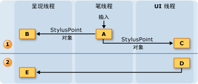
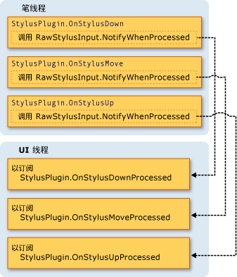

# 墨迹线程处理模型
Tablet PC 上的墨迹看上去很像是用普通的笔和纸书写出来的，这是它的优点之一。  为了实现此功能，触笔采用比鼠标快很多的速度来收集输入数据，从而实现用户边书写边呈现墨迹。  由于应用程序的用户界面 \(UI\) 线程可能被阻止，因此它不适合收集笔数据和呈现墨迹。  为了解决此问题，[!INCLUDE[TLA2#tla_winclient](../../../../includes/tla2sharptla-winclient-md.md)] 应用程序在用户书写墨迹时使用了两个额外的线程。  
  
 以下列表描述了参与收集和呈现数字墨迹的线程：  
  
-   笔线程 \- 接收触笔输入的线程。  （实际上，这是一个线程池，但本主题将其称为笔线程。）  
  
-   应用程序用户界面线程 \- 控制应用程序用户界面的线程。  
  
-   动态呈现线程 \- 在用户书写笔画时呈现墨迹的线程。  如 Window Presentation Foundation [线程处理模型](../../../../docs/framework/wpf/advanced/threading-model.md)中所述，动态呈现线程不同于呈现应用程序的其他 UI 元素的线程。  
  
 无论应用程序使用的是 <xref:System.Windows.Controls.InkCanvas> 还是与[创建墨迹输入控件](../../../../docs/framework/wpf/advanced/creating-an-ink-input-control.md)中的控件类似的自定义控件，墨迹模型都是相同的。  虽然本主题基于 <xref:System.Windows.Controls.InkCanvas> 讨论线程处理，但在创建自定义控件时，这些概念同样适用。  
  
## 线程处理概述  
 下图说明了用户书写笔画时的线程处理模型：  
  
   
  
1.  用户书写笔画时发生的操作  
  
    1.  当用户书写笔画时，触笔接触点参与到笔线程。  触笔插件（包括 <xref:System.Windows.Input.StylusPlugIns.DynamicRenderer>）接受笔线程上的触笔接触点，并在 <xref:System.Windows.Controls.InkCanvas> 接收触笔接触点之前有机会对它们进行修改。  
  
    2.  <xref:System.Windows.Input.StylusPlugIns.DynamicRenderer> 呈现动态呈现线程上的触笔接触点。  此操作与上一个步骤同时发生。  
  
    3.  <xref:System.Windows.Controls.InkCanvas> 接收 UI 线程上的触笔接触点。  
  
2.  用户结束笔画后发生的操作  
  
    1.  在用户书写完笔画时，<xref:System.Windows.Controls.InkCanvas> 将创建一个 <xref:System.Windows.Ink.Stroke> 对象，并将其添加到 <xref:System.Windows.Controls.InkPresenter>，这样可以静态呈现笔画。  
  
    2.  UI 线程通知 <xref:System.Windows.Input.StylusPlugIns.DynamicRenderer> 笔画是以静态方式呈现的，因此 <xref:System.Windows.Input.StylusPlugIns.DynamicRenderer> 将移除笔画的可视化表示形式。  
  
## 墨迹收集和触笔插件  
 每个 <xref:System.Windows.UIElement> 都具有 <xref:System.Windows.Input.StylusPlugIns.StylusPlugInCollection>。  <xref:System.Windows.Input.StylusPlugIns.StylusPlugInCollection> 中的 <xref:System.Windows.Input.StylusPlugIns.StylusPlugIn> 对象接收笔线程上的触笔接触点并可以对其进行修改。  <xref:System.Windows.Input.StylusPlugIns.StylusPlugIn> 对象按照触笔接触点在 <xref:System.Windows.Input.StylusPlugIns.StylusPlugInCollection> 中的顺序来接收它们。  
  
 下图说明了一个假想的场景，其中 <xref:System.Windows.UIElement> 的 <xref:System.Windows.UIElement.StylusPlugIns%2A> 集合依次包含 `stylusPlugin1`、一个 <xref:System.Windows.Input.StylusPlugIns.DynamicRenderer> 和 `stylusPlugin2`。  
  
   
  
 在上图中，将发生以下行为：  
  
1.  `StylusPlugin1` 修改 x 和 y 的值。  
  
2.  <xref:System.Windows.Input.StylusPlugIns.DynamicRenderer> 接收已修改的触笔接触点并将它们呈现在动态呈现线程上。  
  
3.  `StylusPlugin2` 接收已修改的触笔接触点，并进一步修改 x 和 y 的值。  
  
4.  应用程序收集触笔接触点，当用户书写完笔画后，应用程序将静态呈现笔画。  
  
 假设 `stylusPlugin1` 将触笔接触点限制在一个矩形中，`stylusPlugin2` 将触笔接触点向右平移。  在上述情况中，<xref:System.Windows.Input.StylusPlugIns.DynamicRenderer> 接收受限制的触笔接触点，但不接收转换后的触笔接触点。  当用户书写笔画时，笔画呈现在矩形范围内，但在用户提起笔之前，不会对笔画进行平移。  
  
### 使用触笔插件在 UI 线程上执行操作  
 因为无法对笔线程执行准确的命中测试，所以某些元素有时可能会接收拟由其他元素接收的触笔接触点。  如果需要确保在执行某个操作之前正确发送输入，请订阅 <xref:System.Windows.Input.StylusPlugIns.StylusPlugIn.OnStylusDownProcessed%2A>、<xref:System.Windows.Input.StylusPlugIns.StylusPlugIn.OnStylusMoveProcessed%2A> 或 <xref:System.Windows.Input.StylusPlugIns.StylusPlugIn.OnStylusUpProcessed%2A> 方法，并在这些方法中执行该操作。  在执行了准确的命中测试之后，应用程序线程将调用这些方法。  若要订阅这些方法，请在笔线程上执行的方法中调用 <xref:System.Windows.Input.StylusPlugIns.RawStylusInput.NotifyWhenProcessed%2A> 方法。  
  
 下图说明了笔线程和 UI 线程之间在 <xref:System.Windows.Input.StylusPlugIns.StylusPlugIn> 的触笔事件方面的关系。  
  
   
  
## 呈现墨迹  
 当用户书写笔画时，<xref:System.Windows.Input.StylusPlugIns.DynamicRenderer> 将在单独的线程上呈现墨迹，因此，即使 UI 线程正忙，墨迹看上去仍然像是从笔中“流出”的。  <xref:System.Windows.Input.StylusPlugIns.DynamicRenderer> 在收集触笔接触点时将在动态呈现线程上构建一个可视化树。  用户书写完笔画时，<xref:System.Windows.Input.StylusPlugIns.DynamicRenderer> 请求获悉应用程序进行下一次呈现过程的时间。  应用程序完成下一次呈现过程后，<xref:System.Windows.Input.StylusPlugIns.DynamicRenderer> 将清理它的可视化树。  下图阐释此过程。  
  
   
  
1.  用户开始书写笔画。  
  
    1.  <xref:System.Windows.Input.StylusPlugIns.DynamicRenderer> 创建可视化树。  
  
2.  用户正在书写笔画。  
  
    1.  <xref:System.Windows.Input.StylusPlugIns.DynamicRenderer> 构建可视化树。  
  
3.  用户结束笔画。  
  
    1.  <xref:System.Windows.Controls.InkPresenter> 将笔画添加到其可视化树中。  
  
    2.  媒体集成层 \(MIL\) 静态呈现笔画。  
  
    3.  <xref:System.Windows.Input.StylusPlugIns.DynamicRenderer> 清理可视化树。