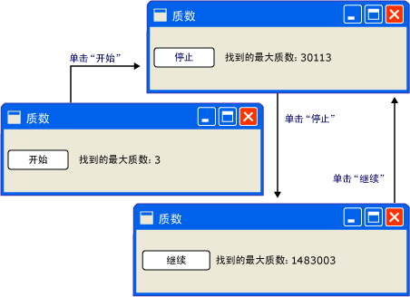
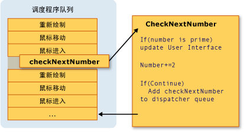
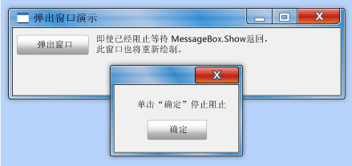
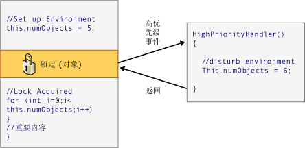

# 线程处理模型
[!INCLUDE[TLA#tla_winclient](../../../../includes/tlasharptla-winclient-md.md)] 旨在帮助开发人员处理复杂的线程处理问题。 因此，大多数[!INCLUDE[TLA2#tla_winclient](../../../../includes/tla2sharptla-winclient-md.md)]开发人员不需要编写一个接口，使用多个线程。 由于多线程程序既复杂又难以调试，因此当存在单线程解决方案时，应避免使用多线程程序。  
  
 无论程度而设计，但是，否[!INCLUDE[TLA2#tla_ui](../../../../includes/tla2sharptla-ui-md.md)]framework 曾经将能够为每个排序的问题提供一个单线程的解决方案。 [!INCLUDE[TLA2#tla_winclient](../../../../includes/tla2sharptla-winclient-md.md)] 接近，但仍存在其中多个线程来提高的情况下[!INCLUDE[TLA#tla_ui](../../../../includes/tlasharptla-ui-md.md)]响应能力或应用程序的性能。 基于上文所述的背景材料，本文对上述情况进行探讨，然后通过对一些低级别的细节进行讨论作出总结。  
  

  
> [!NOTE]
>  本主题讨论使用线程处理<xref:System.Windows.Threading.Dispatcher.BeginInvoke%2A>异步调用的方法。 你还可以通过调用进行异步调用<xref:System.Windows.Threading.Dispatcher.InvokeAsync%2A>方法，它采用<xref:System.Action>或<xref:System.Func%601>作为参数。  <xref:System.Windows.Threading.Dispatcher.InvokeAsync%2A>方法返回<xref:System.Windows.Threading.DispatcherOperation>或<xref:System.Windows.Threading.DispatcherOperation%601>，它具有<xref:System.Windows.Threading.DispatcherOperation.Task%2A>属性。 你可以使用`await`使用关键字<xref:System.Windows.Threading.DispatcherOperation>或关联<xref:System.Threading.Tasks.Task>。 如果你需要同步等待<xref:System.Threading.Tasks.Task>返回<xref:System.Windows.Threading.DispatcherOperation>或<xref:System.Windows.Threading.DispatcherOperation%601>，调用<xref:System.Windows.Threading.TaskExtensions.DispatcherOperationWait%2A>扩展方法。  调用<xref:System.Threading.Tasks.Task.Wait%2A?displayProperty=nameWithType>将导致死锁。 有关使用<xref:System.Threading.Tasks.Task>若要执行异步操作，请参阅任务并行。  <xref:System.Windows.Threading.Dispatcher.Invoke%2A>方法还有采用重载<xref:System.Action>或<xref:System.Func%601>作为参数。  你可以使用<xref:System.Windows.Threading.Dispatcher.Invoke%2A>方法来进行同步调用通过在委托中，传入<xref:System.Action>或<xref:System.Func%601>。  
  
   
## 概述和调度程序  
 通常情况下，[!INCLUDE[TLA2#tla_winclient](../../../../includes/tla2sharptla-winclient-md.md)]两个线程启动的应用程序： 一个用于处理呈现和另一个用于管理[!INCLUDE[TLA2#tla_ui](../../../../includes/tla2sharptla-ui-md.md)]。 呈现线程有效地隐藏在后台运行[!INCLUDE[TLA2#tla_ui](../../../../includes/tla2sharptla-ui-md.md)]线程接收输入、 处理事件、 绘制屏幕，并运行应用程序代码。 大多数应用程序使用单个[!INCLUDE[TLA2#tla_ui](../../../../includes/tla2sharptla-ui-md.md)]线程，但在某些情况下也最佳同时使用多个。 我们将稍后通过示例对此进行讨论。  
  
 [!INCLUDE[TLA2#tla_ui](../../../../includes/tla2sharptla-ui-md.md)]线程队列工作项内对象称为<xref:System.Windows.Threading.Dispatcher>。 <xref:System.Windows.Threading.Dispatcher> 基于优先级选择工作项，并运行每一个工作项直到完成。  每个[!INCLUDE[TLA2#tla_ui](../../../../includes/tla2sharptla-ui-md.md)]线程都必须具有至少一个<xref:System.Windows.Threading.Dispatcher>，和每个<xref:System.Windows.Threading.Dispatcher>可以在恰好一个线程中执行工作项。  
  
 为生成响应、 用户友好应用程序的作用在于最大限度地<xref:System.Windows.Threading.Dispatcher>通过将工作项保持小的吞吐量。 这样，工作项永远不会获得陈旧坐在<xref:System.Windows.Threading.Dispatcher>等待处理的队列。 输入和响应间任何可察觉的延迟都会让用户不满。  
  
 如何则[!INCLUDE[TLA2#tla_winclient](../../../../includes/tla2sharptla-winclient-md.md)]应用程序应以处理大操作？ 如果代码涉及大型计算，或需要查询某些远程服务器上的数据库，应该怎么办？ 通常情况下，答案是处理中单独的线程，这样的大操作[!INCLUDE[TLA2#tla_ui](../../../../includes/tla2sharptla-ui-md.md)]线程可以自由地在工作项<xref:System.Windows.Threading.Dispatcher>队列。 完成大操作时，它可以报告其结果返回到[!INCLUDE[TLA2#tla_ui](../../../../includes/tla2sharptla-ui-md.md)]线程以进行显示。  
  
 从历史上看，[!INCLUDE[TLA#tla_mswin](../../../../includes/tlasharptla-mswin-md.md)]允许[!INCLUDE[TLA2#tla_ui](../../../../includes/tla2sharptla-ui-md.md)]只能由创建它们的线程访问的元素。 这意味着，负责长时间运行任务的后台线程无法在任务完成时更新文本框。 [!INCLUDE[TLA#tla_mswin](../../../../includes/tlasharptla-mswin-md.md)] 这样做是为了确保的完整性[!INCLUDE[TLA2#tla_ui](../../../../includes/tla2sharptla-ui-md.md)]组件。 如果在绘制过程中后台线程更新了列表框的内容，则此列表框看起来可能会很奇怪。  
  
 [!INCLUDE[TLA2#tla_winclient](../../../../includes/tla2sharptla-winclient-md.md)] 具有内置互相排斥机制，此机制能强制执行这种协调。 中的大多数类[!INCLUDE[TLA2#tla_winclient](../../../../includes/tla2sharptla-winclient-md.md)]派生自<xref:System.Windows.Threading.DispatcherObject>。 在构造，<xref:System.Windows.Threading.DispatcherObject>存储到的引用<xref:System.Windows.Threading.Dispatcher>链接到当前正在运行的线程。 实际上，<xref:System.Windows.Threading.DispatcherObject>将创建它的线程与相关联。 在程序执行期间<xref:System.Windows.Threading.DispatcherObject>可以调用它的公共<xref:System.Windows.Threading.DispatcherObject.VerifyAccess%2A>方法。 <xref:System.Windows.Threading.DispatcherObject.VerifyAccess%2A> 检查<xref:System.Windows.Threading.Dispatcher>与当前线程关联，并将其到<xref:System.Windows.Threading.Dispatcher>构造过程中存储的引用。 如果不匹配，<xref:System.Windows.Threading.DispatcherObject.VerifyAccess%2A>引发异常。 <xref:System.Windows.Threading.DispatcherObject.VerifyAccess%2A> 用于进行调用属于每个方法的开头<xref:System.Windows.Threading.DispatcherObject>。  
  
 如果只有一个线程可以修改[!INCLUDE[TLA2#tla_ui](../../../../includes/tla2sharptla-ui-md.md)]，如何执行后台线程与用户交互？ 后台线程可以要求[!INCLUDE[TLA2#tla_ui](../../../../includes/tla2sharptla-ui-md.md)]线程来执行其代表的操作。 这是通过注册与工作项<xref:System.Windows.Threading.Dispatcher>的[!INCLUDE[TLA2#tla_ui](../../../../includes/tla2sharptla-ui-md.md)]线程。 <xref:System.Windows.Threading.Dispatcher>类提供两种方法来注册工作项：<xref:System.Windows.Threading.Dispatcher.Invoke%2A>和<xref:System.Windows.Threading.Dispatcher.BeginInvoke%2A>。 这两种方法都计划一个用于执行的委托。 <xref:System.Windows.Threading.Dispatcher.Invoke%2A> 是的同步调用 – 也就是说，它不返回直到[!INCLUDE[TLA2#tla_ui](../../../../includes/tla2sharptla-ui-md.md)]线程实际完成执行委托。 <xref:System.Windows.Threading.Dispatcher.BeginInvoke%2A> 是异步的将立即返回。  
  
 <xref:System.Windows.Threading.Dispatcher>按优先级别的元素其队列中进行排序。 有可能时添加一个元素到指定的十个级别<xref:System.Windows.Threading.Dispatcher>队列。 在中维护这些优先级<xref:System.Windows.Threading.DispatcherPriority>枚举。 有关详细信息<xref:System.Windows.Threading.DispatcherPriority>在找不到级别[!INCLUDE[TLA2#tla_winfxsdk](../../../../includes/tla2sharptla-winfxsdk-md.md)]文档。  
  
   
## 实际线程：示例  
  
   
### 具有长时间运行计算的单线程应用程序  
 大多数[!INCLUDE[TLA#tla_gui#plural](../../../../includes/tlasharptla-guisharpplural-md.md)]花费大部分其时间处于空闲状态等待在响应用户交互中生成的事件。 使用小心编程时，此空闲时间可用建设性，而不会影响的响应能力[!INCLUDE[TLA2#tla_ui](../../../../includes/tla2sharptla-ui-md.md)]。 [!INCLUDE[TLA2#tla_winclient](../../../../includes/tla2sharptla-winclient-md.md)]线程处理模型不允许输入以中断操作中发生的情况[!INCLUDE[TLA2#tla_ui](../../../../includes/tla2sharptla-ui-md.md)]线程。 这意味着你必须确保以返回到<xref:System.Windows.Threading.Dispatcher>定期到挂起的输入的事件，然后进行陈旧的进程。  
  
 请看下面的示例：  
  
   
  
 这个简单的应用程序从 3 开始向上计数以搜索质数。 当用户单击**启动**按钮，开始执行搜索。 当程序查找到一个质数时，它将根据其发现内容更新用户界面。 用户可随时停止搜索。  
  
 尽管十分简单，但对质数的搜索可以永远持续下去，这会带来一些问题。  如果我们处理整个搜索按钮的 click 事件处理程序内，我们从不会赋予[!INCLUDE[TLA2#tla_ui](../../../../includes/tla2sharptla-ui-md.md)]线程一个机会处理其他事件。 [!INCLUDE[TLA2#tla_ui](../../../../includes/tla2sharptla-ui-md.md)]将无法响应输入或处理消息。 它将永远不会重绘，也永远不会响应按钮单击。  
  
 可以在单独的线程中搜索质数，但这样的话，我们需要处理一些同步问题。 通过单线程方法，可以直接更新列出所找到的最大质数的标签。  
  
 如果我们分解成易于管理多个块的计算的任务时，我们可以定期返回到<xref:System.Windows.Threading.Dispatcher>，处理的事件。 我们能否[!INCLUDE[TLA2#tla_winclient](../../../../includes/tla2sharptla-winclient-md.md)]重绘和处理输入的机会。  
  
 拆分计算和事件处理之间的处理时间的最好办法是管理计算从<xref:System.Windows.Threading.Dispatcher>。 通过使用<xref:System.Windows.Threading.Dispatcher.BeginInvoke%2A>方法，我们可以计划中的质数检查的同一队列[!INCLUDE[TLA2#tla_ui](../../../../includes/tla2sharptla-ui-md.md)]从中提取事件。 在我们的示例中，一次仅计划一个质数检查。 完成质数检查后，立即计划下一个检查。 此检查之后才继续挂起[!INCLUDE[TLA2#tla_ui](../../../../includes/tla2sharptla-ui-md.md)]在处理事件。  
  
   
  
 [!INCLUDE[TLA#tla_word](../../../../includes/tlasharptla-word-md.md)] 通过此机制完成拼写检查。 在后台使用的空闲时间执行了拼写检查[!INCLUDE[TLA2#tla_ui](../../../../includes/tla2sharptla-ui-md.md)]线程。 我们来看一看代码。  
  
 下列示例显示了创建用户界面的 XAML。  
  
 [!code-xaml[ThreadingPrimeNumbers#ThreadingPrimeNumberXAML](../../../../samples/snippets/csharp/VS_Snippets_Wpf/ThreadingPrimeNumbers/CSharp/Window1.xaml#threadingprimenumberxaml)]  
  
 以下示例显示了代码隐藏。  
  
 [!code-csharp[ThreadingPrimeNumbers#ThreadingPrimeNumberCodeBehind](../../../../samples/snippets/csharp/VS_Snippets_Wpf/ThreadingPrimeNumbers/CSharp/Window1.xaml.cs#threadingprimenumbercodebehind)]
 [!code-vb[ThreadingPrimeNumbers#ThreadingPrimeNumberCodeBehind](../../../../samples/snippets/visualbasic/VS_Snippets_Wpf/ThreadingPrimeNumbers/visualbasic/mainwindow.xaml.vb#threadingprimenumbercodebehind)]  
  
 下面的示例演示的事件处理程序<xref:System.Windows.Controls.Button>。  
  
 [!code-csharp[ThreadingPrimeNumbers#ThreadingPrimeNumberStartOrStop](../../../../samples/snippets/csharp/VS_Snippets_Wpf/ThreadingPrimeNumbers/CSharp/Window1.xaml.cs#threadingprimenumberstartorstop)]
 [!code-vb[ThreadingPrimeNumbers#ThreadingPrimeNumberStartOrStop](../../../../samples/snippets/visualbasic/VS_Snippets_Wpf/ThreadingPrimeNumbers/visualbasic/mainwindow.xaml.vb#threadingprimenumberstartorstop)]  
  
 除了上更新的文本<xref:System.Windows.Controls.Button>，此处理程序是负责计划通过将添加到委托的第一项的质数检查<xref:System.Windows.Threading.Dispatcher>队列。 此事件处理程序完成其工作后, 一段时间内<xref:System.Windows.Threading.Dispatcher>将选择执行此委托。  
  
 如前文所述，<xref:System.Windows.Threading.Dispatcher.BeginInvoke%2A>是<xref:System.Windows.Threading.Dispatcher>成员用来安排执行的委托。 在这种情况下，我们选择<xref:System.Windows.Threading.DispatcherPriority.SystemIdle>优先级。 <xref:System.Windows.Threading.Dispatcher>仅当不没有要处理任何重要事件时，将执行此委托。 [!INCLUDE[TLA2#tla_ui](../../../../includes/tla2sharptla-ui-md.md)] 响应能力比数字检查更重要。 我们还传递了一个表示数字检查例程的新委托。  
  
 [!code-csharp[ThreadingPrimeNumbers#ThreadingPrimeNumberCheckNextNumber](../../../../samples/snippets/csharp/VS_Snippets_Wpf/ThreadingPrimeNumbers/CSharp/Window1.xaml.cs#threadingprimenumberchecknextnumber)]
 [!code-vb[ThreadingPrimeNumbers#ThreadingPrimeNumberCheckNextNumber](../../../../samples/snippets/visualbasic/VS_Snippets_Wpf/ThreadingPrimeNumbers/visualbasic/mainwindow.xaml.vb#threadingprimenumberchecknextnumber)]  
  
 此方法检查下一个奇数是否是质数。 如果它是质数，此方法直接更新`bigPrime`<xref:System.Windows.Controls.TextBlock>以反映其发现。 可以如此操作的原因是，该计算发生在用于创建组件的相同线程中。 如果选择使用单独的线程进行计算，我们需要使用更复杂的同步机制，并执行中的更新[!INCLUDE[TLA2#tla_ui](../../../../includes/tla2sharptla-ui-md.md)]线程。 我们将在下一步中演示这种情况。  
  
 此示例的完整源代码，请参阅[长时间运行计算示例的单线程应用程序](http://go.microsoft.com/fwlink/?LinkID=160038)  
  
   
### 使用后台线程处理阻塞操作  
 在图形应用程序中处理阻塞操作可能很困难。 我们不希望从事件处理程序调用阻塞方法，因为应用程序可能看上去冻结。 我们可以使用一个单独的线程来处理这些操作，但操作完成后，我们必须与同步[!INCLUDE[TLA2#tla_ui](../../../../includes/tla2sharptla-ui-md.md)]线程因为我们不能直接修改[!INCLUDE[TLA2#tla_gui](../../../../includes/tla2sharptla-gui-md.md)]从我们的工作线程。 我们可以使用<xref:System.Windows.Threading.Dispatcher.Invoke%2A>或<xref:System.Windows.Threading.Dispatcher.BeginInvoke%2A>要插入到的委托<xref:System.Windows.Threading.Dispatcher>的[!INCLUDE[TLA2#tla_ui](../../../../includes/tla2sharptla-ui-md.md)]线程。 最终，这些委托将执行有权修改[!INCLUDE[TLA2#tla_ui](../../../../includes/tla2sharptla-ui-md.md)]元素。  
  
 在本例中，我们模拟了一个检索天气预报的远程过程调用。 我们使用单独的工作线程来执行此调用，并我们计划中的更新方法<xref:System.Windows.Threading.Dispatcher>的[!INCLUDE[TLA2#tla_ui](../../../../includes/tla2sharptla-ui-md.md)]线程在完成后。  
  
   
  
 [!code-csharp[ThreadingWeatherForecast#ThreadingWeatherCodeBehind](../../../../samples/snippets/csharp/VS_Snippets_Wpf/ThreadingWeatherForecast/CSharp/Window1.xaml.cs#threadingweathercodebehind)]
 [!code-vb[ThreadingWeatherForecast#ThreadingWeatherCodeBehind](../../../../samples/snippets/visualbasic/VS_Snippets_Wpf/ThreadingWeatherForecast/visualbasic/window1.xaml.vb#threadingweathercodebehind)]  
  
 以下是一些需要注意的详细信息。  
  
-   创建按钮处理程序  
  
     [!code-csharp[ThreadingWeatherForecast#ThreadingWeatherButtonHandler](../../../../samples/snippets/csharp/VS_Snippets_Wpf/ThreadingWeatherForecast/CSharp/Window1.xaml.cs#threadingweatherbuttonhandler)]
     [!code-vb[ThreadingWeatherForecast#ThreadingWeatherButtonHandler](../../../../samples/snippets/visualbasic/VS_Snippets_Wpf/ThreadingWeatherForecast/visualbasic/window1.xaml.vb#threadingweatherbuttonhandler)]  
  
 单击按钮时，会显示时钟绘图并开始对其进行动画处理。 禁用该按钮。 我们调用`FetchWeatherFromServer`新线程，然后我们方法返回，允许<xref:System.Windows.Threading.Dispatcher>处理事件时我们将等待收集天气预报。  
  
-   获取天气  
  
     [!code-csharp[ThreadingWeatherForecast#ThreadingWeatherFetchWeather](../../../../samples/snippets/csharp/VS_Snippets_Wpf/ThreadingWeatherForecast/CSharp/Window1.xaml.cs#threadingweatherfetchweather)]
     [!code-vb[ThreadingWeatherForecast#ThreadingWeatherFetchWeather](../../../../samples/snippets/visualbasic/VS_Snippets_Wpf/ThreadingWeatherForecast/visualbasic/window1.xaml.vb#threadingweatherfetchweather)]  
  
 为简便起见，本例中没有任何网络代码。 通过使新线程进入休眠状态四秒钟，模拟网络访问的延迟。 在此时间，原始[!INCLUDE[TLA2#tla_ui](../../../../includes/tla2sharptla-ui-md.md)]线程时仍运行并对事件作出响应。 为了对此进行演示，我们让动画保持运行状态，最小化和最大化按钮也继续工作。  
  
 当完成时延迟，并且我们已随机选择我们天气预报时，这是时间来报告回[!INCLUDE[TLA2#tla_ui](../../../../includes/tla2sharptla-ui-md.md)]线程。 我们执行此操作通过计划调用`UpdateUserInterface`中[!INCLUDE[TLA2#tla_ui](../../../../includes/tla2sharptla-ui-md.md)]线程使用此线程的<xref:System.Windows.Threading.Dispatcher>。 将描述天气的字符串传递给此计划方法调用。  
  
-   更新 [!INCLUDE[TLA2#tla_ui](../../../../includes/tla2sharptla-ui-md.md)]  
  
     [!code-csharp[ThreadingWeatherForecast#ThreadingWeatherUpdateUI](../../../../samples/snippets/csharp/VS_Snippets_Wpf/ThreadingWeatherForecast/CSharp/Window1.xaml.cs#threadingweatherupdateui)]
     [!code-vb[ThreadingWeatherForecast#ThreadingWeatherUpdateUI](../../../../samples/snippets/visualbasic/VS_Snippets_Wpf/ThreadingWeatherForecast/visualbasic/window1.xaml.vb#threadingweatherupdateui)]  
  
 当<xref:System.Windows.Threading.Dispatcher>中[!INCLUDE[TLA2#tla_ui](../../../../includes/tla2sharptla-ui-md.md)]线程有时间时，它会执行的计划的调用`UpdateUserInterface`。 此方法停止时钟动画，并选择一张映像用于描述天气。 它将显示此映像，并还原“获取预报”按钮。  
  
   
### 多窗口、多线程  
 某些[!INCLUDE[TLA2#tla_winclient](../../../../includes/tla2sharptla-winclient-md.md)]应用程序需要多个顶级窗口。 它是完全可以接受一个线程 /<xref:System.Windows.Threading.Dispatcher>组合来管理多个时段，但有时多个线程执行的更好的作业。 尤其当这些窗口中的某一个将有可能要独占线程时，更是如此。  
  
 [!INCLUDE[TLA#tla_mswin](../../../../includes/tlasharptla-mswin-md.md)] 资源管理器以这种方式工作。 每个新资源管理器窗口都属于原始进程，但它是在独立线程的控件下创建的。  
  
 通过使用[!INCLUDE[TLA2#tla_winclient](../../../../includes/tla2sharptla-winclient-md.md)]<xref:System.Windows.Controls.Frame>控件，我们可以显示网页。 我们可以轻松地创建一个简单[!INCLUDE[TLA2#tla_ie](../../../../includes/tla2sharptla-ie-md.md)]替换。 让我们从一个重要功能开始：打开新资源管理器窗口的能力。 当用户单击“新建窗口”按钮时，我们将在单独的线程中启动窗口的副本。 这样一来，在其中一个窗口中的长时间运行或阻塞操作将不会锁定其他窗口。  
  
 在实际情况下，Web 浏览器模型自身拥有复杂的线程模型。 由于大多数读者都熟悉它，所以我们选择它。  
  
 以下示例显示了代码。  
  
 [!code-xaml[ThreadingMultipleBrowsers#ThreadingMultiBrowserXAML](../../../../samples/snippets/csharp/VS_Snippets_Wpf/ThreadingMultipleBrowsers/CSharp/Window1.xaml#threadingmultibrowserxaml)]  
  
 [!code-csharp[ThreadingMultipleBrowsers#ThreadingMultiBrowserCodeBehind](../../../../samples/snippets/csharp/VS_Snippets_Wpf/ThreadingMultipleBrowsers/CSharp/Window1.xaml.cs#threadingmultibrowsercodebehind)]
 [!code-vb[ThreadingMultipleBrowsers#ThreadingMultiBrowserCodeBehind](../../../../samples/snippets/visualbasic/VS_Snippets_Wpf/ThreadingMultipleBrowsers/VisualBasic/Window1.xaml.vb#threadingmultibrowsercodebehind)]  
  
 此代码中的以下线程段对我们来说是最有趣的：  
  
 [!code-csharp[ThreadingMultipleBrowsers#ThreadingMultiBrowserNewWindow](../../../../samples/snippets/csharp/VS_Snippets_Wpf/ThreadingMultipleBrowsers/CSharp/Window1.xaml.cs#threadingmultibrowsernewwindow)]
 [!code-vb[ThreadingMultipleBrowsers#ThreadingMultiBrowserNewWindow](../../../../samples/snippets/visualbasic/VS_Snippets_Wpf/ThreadingMultipleBrowsers/VisualBasic/Window1.xaml.vb#threadingmultibrowsernewwindow)]  
  
 当单击“新建窗口”按钮时，将调用该方法。 它创建了一个新线程，并以异步方式启动。  
  
 [!code-csharp[ThreadingMultipleBrowsers#ThreadingMultiBrowserThreadStart](../../../../samples/snippets/csharp/VS_Snippets_Wpf/ThreadingMultipleBrowsers/CSharp/Window1.xaml.cs#threadingmultibrowserthreadstart)]
 [!code-vb[ThreadingMultipleBrowsers#ThreadingMultiBrowserThreadStart](../../../../samples/snippets/visualbasic/VS_Snippets_Wpf/ThreadingMultipleBrowsers/VisualBasic/Window1.xaml.vb#threadingmultibrowserthreadstart)]  
  
 此方法是新线程的起点。 我们在此线程的控件下创建了一个新窗口。 [!INCLUDE[TLA2#tla_winclient](../../../../includes/tla2sharptla-winclient-md.md)] 自动创建一个新<xref:System.Windows.Threading.Dispatcher>来管理新线程。 我们所要做，以使该窗口功能是启动<xref:System.Windows.Threading.Dispatcher>。  
  
   
## 技术详细信息和疑难点  
  
### 使用线程处理编写组件  
 Microsoft.NET Framework 开发指南描述如何组件可以公开向其客户端的异步行为的模式 (请参阅[基于事件的异步模式概述](../../../../docs/standard/asynchronous-programming-patterns/event-based-asynchronous-pattern-overview.md))。 例如，假设我们想要打包`FetchWeatherFromServer`方法划分为可重用、 非图形的组件。 以下标准的 Microsoft.NET Framework 模式，它看起来应如下所示。  
  
 [!code-csharp[CommandingOverviewSnippets#ThreadingArticleWeatherComponent1](../../../../samples/snippets/csharp/VS_Snippets_Wpf/CommandingOverviewSnippets/CSharp/Window1.xaml.cs#threadingarticleweathercomponent1)]
 [!code-vb[CommandingOverviewSnippets#ThreadingArticleWeatherComponent1](../../../../samples/snippets/visualbasic/VS_Snippets_Wpf/CommandingOverviewSnippets/visualbasic/window1.xaml.vb#threadingarticleweathercomponent1)]  
  
 `GetWeatherAsync` 将使用上述的技术之一（如创建后台线程）来以异步方式工作，而非阻止调用线程。  
  
 此模式的最重要的部分之一调用*MethodName* `Completed`方法调用在同一线程*MethodName* `Async`方法的开头。 你可以使用执行这类情况的操作[!INCLUDE[TLA2#tla_winclient](../../../../includes/tla2sharptla-winclient-md.md)]非常轻松，通过将存储<xref:System.Windows.Threading.Dispatcher.CurrentDispatcher%2A>-但然后非图形组件无法只能用在[!INCLUDE[TLA2#tla_winclient](../../../../includes/tla2sharptla-winclient-md.md)]应用程序，不在[!INCLUDE[TLA#tla_winforms](../../../../includes/tlasharptla-winforms-md.md)]或[!INCLUDE[TLA#tla_aspnet](../../../../includes/tlasharptla-aspnet-md.md)]程序。  
  
 <xref:System.Windows.Threading.DispatcherSynchronizationContext>类满足这一需要 — 它看作的简化版本<xref:System.Windows.Threading.Dispatcher>适用于其他[!INCLUDE[TLA2#tla_ui](../../../../includes/tla2sharptla-ui-md.md)]以及框架。  
  
 [!code-csharp[CommandingOverviewSnippets#ThreadingArticleWeatherComponent2](../../../../samples/snippets/csharp/VS_Snippets_Wpf/CommandingOverviewSnippets/CSharp/Window1.xaml.cs#threadingarticleweathercomponent2)]
 [!code-vb[CommandingOverviewSnippets#ThreadingArticleWeatherComponent2](../../../../samples/snippets/visualbasic/VS_Snippets_Wpf/CommandingOverviewSnippets/visualbasic/window1.xaml.vb#threadingarticleweathercomponent2)]  
  
### 嵌套泵  
 有时不能完全锁定[!INCLUDE[TLA2#tla_ui](../../../../includes/tla2sharptla-ui-md.md)]线程。 让我们考虑<xref:System.Windows.MessageBox.Show%2A>方法<xref:System.Windows.MessageBox>类。 <xref:System.Windows.MessageBox.Show%2A> 没有返回直到用户单击确定按钮。 但是，它却会创建一个窗口，该窗口为了获得交互性而必须具有消息循环。 在等待用户单击“确定”时，原始应用程序窗口将不会响应用户的输入。 但是，它将继续处理绘制消息。 当被覆盖和被显示时，原始窗口将重绘其本身。  
  
   
  
 一些线程必须负责消息框窗口。 [!INCLUDE[TLA2#tla_winclient](../../../../includes/tla2sharptla-winclient-md.md)] 可以为消息框窗口创建新线程，但此线程无法在原始窗口中绘制禁用的元素（请回忆之前所讨论的互相排斥）。 相反，[!INCLUDE[TLA2#tla_winclient](../../../../includes/tla2sharptla-winclient-md.md)]使用嵌套的消息处理系统。 <xref:System.Windows.Threading.Dispatcher>类包括一个称为特殊方法<xref:System.Windows.Threading.Dispatcher.PushFrame%2A>，它用于存储应用程序的当前执行点然后开始新的消息循环。 嵌套的消息循环完成时，将在原始后恢复执行<xref:System.Windows.Threading.Dispatcher.PushFrame%2A>调用。  
  
 在这种情况下，<xref:System.Windows.Threading.Dispatcher.PushFrame%2A>维护对的调用的程序上下文<xref:System.Windows.MessageBox>。<xref:System.Windows.MessageBox.Show%2A>，并开始新的消息循环，以重新绘制背景窗口并处理输入消息框窗口。 当用户单击确定，并清除弹出窗口中时，嵌套的循环退出，控件将在调用后恢复<xref:System.Windows.MessageBox.Show%2A>。  
  
### 过时的路由事件  
 中的路由的事件系统[!INCLUDE[TLA2#tla_winclient](../../../../includes/tla2sharptla-winclient-md.md)]引发事件时通知整个树。  
  
 [!code-xaml[InputOvw#ThreadingArticleStaticRoutedEvent](../../../../samples/snippets/csharp/VS_Snippets_Wpf/InputOvw/CSharp/Page1.xaml#threadingarticlestaticroutedevent)]  
  
 椭圆，通过按下鼠标左键时`handler2`执行。 后`handler2`完成，该事件传递到<xref:System.Windows.Controls.Canvas>对象，后者使用`handler1`以对其进行处理。 仅当发生这种情况`handler2`不显式标记事件对象为已处理。  
  
 可能的`handler2`需要大量的时间来处理此事件。 `handler2` 可能使用<xref:System.Windows.Threading.Dispatcher.PushFrame%2A>开始小时数不返回嵌套的消息循环。 如果`handler2`不事件为已处理此消息循环时完成的标记，则即使非常陈旧，树向上传递的事件。  
  
### 重新进入和锁定  
 锁定机制[!INCLUDE[TLA#tla_clr](../../../../includes/tlasharptla-clr-md.md)]完全相同的行为不可能想象一个; 某个用户可能希望完全停止操作，请求锁定时的线程。 实际上，该线程将继续接收和处理高优先级的消息。 这样有助于防止死锁，并使接口最低限度地响应，但这样做有可能引入细微 bug。  大多数情况下无需知道任何有关此操作，但在极少数情况下 (通常涉及[!INCLUDE[TLA2#tla_win32](../../../../includes/tla2sharptla-win32-md.md)]窗口消息或 COM STA 组件)，这可能需要了解。  
  
 大多数接口不构建与记住的线程安全性，因为开发人员在假设的[!INCLUDE[TLA2#tla_ui](../../../../includes/tla2sharptla-ui-md.md)]多个线程从不访问。 在此情况下，单线程，可能会意外情况下，使环境更改导致这些错误效果<xref:System.Windows.Threading.DispatcherObject>互相排斥机制应该解决。 请看下面的伪代码：  
  
   
  
 大多数情况下，正确的操作，但有中的时间[!INCLUDE[TLA2#tla_winclient](../../../../includes/tla2sharptla-winclient-md.md)]其中此类意外的重新进入确实会导致问题。 因此，在某些关键时刻，[!INCLUDE[TLA2#tla_winclient](../../../../includes/tla2sharptla-winclient-md.md)]调用<xref:System.Windows.Threading.Dispatcher.DisableProcessing%2A>，其更改为使用该线程的锁指令[!INCLUDE[TLA2#tla_winclient](../../../../includes/tla2sharptla-winclient-md.md)]非重入锁，而不是常规[!INCLUDE[TLA2#tla_clr](../../../../includes/tla2sharptla-clr-md.md)]锁。  
  
 那么，为什么未[!INCLUDE[TLA2#tla_clr](../../../../includes/tla2sharptla-clr-md.md)]团队选择此行为？ 它与 COM STA 对象和完成线程有关。 当一个对象进行垃圾回收，其`Finalize`方法不在专用终结器线程上运行[!INCLUDE[TLA2#tla_ui](../../../../includes/tla2sharptla-ui-md.md)]线程。 其中存在问题，因为 COM STA 对象上创建[!INCLUDE[TLA2#tla_ui](../../../../includes/tla2sharptla-ui-md.md)]线程可以仅释放上[!INCLUDE[TLA2#tla_ui](../../../../includes/tla2sharptla-ui-md.md)]线程。 [!INCLUDE[TLA2#tla_clr](../../../../includes/tla2sharptla-clr-md.md)]的等效<xref:System.Windows.Threading.Dispatcher.BeginInvoke%2A>(在这种情况下使用 Win32 的`SendMessage`)。 但是，如果[!INCLUDE[TLA2#tla_ui](../../../../includes/tla2sharptla-ui-md.md)]线程处于忙碌状态、 终结器线程将停止，无法释放 COM STA 对象，这种结构造成严重的内存泄漏。 因此[!INCLUDE[TLA2#tla_clr](../../../../includes/tla2sharptla-clr-md.md)]团队进行严格的调用来使锁的工作方式一样。  
  
 有关任务[!INCLUDE[TLA2#tla_winclient](../../../../includes/tla2sharptla-winclient-md.md)]是为了避免意外的重新进入不重新引入内存泄漏，这正是我们避免阻塞无处不在可重入性。  
  
## 请参阅  
 [具有长时间运行计算的单线程应用程序示例](http://go.microsoft.com/fwlink/?LinkID=160038)
