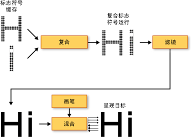
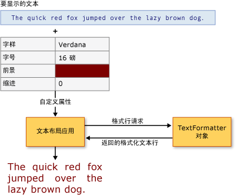

# WPF 中的版式
本主题介绍 [!INCLUDE[TLA2#tla_winclient](../../../../includes/tla2sharptla-winclient-md.md)] 的主要版式功能。 这些功能包括改进的文本呈现质量和性能、[!INCLUDE[TLA#tla_opentype](../../../../includes/tlasharptla-opentype-md.md)] 版式支持、增强的国际文本、增强的字体支持和新的文本应用程序编程接口 (API)。  
  

  
   
## 改进的文本质量和性能  
 [!INCLUDE[TLA2#tla_winclient](../../../../includes/tla2sharptla-winclient-md.md)] 中的文本通过 [!INCLUDE[TLA#tla_ct](../../../../includes/tlasharptla-ct-md.md)] 技术呈现，该技术增强了文本的清晰度和可读性。 [!INCLUDE[TLA2#tla_ct](../../../../includes/tla2sharptla-ct-md.md)] 是一种由 [!INCLUDE[TLA#tla_ms](../../../../includes/tlasharptla-ms-md.md)] 开发的软件技术，可提高现有 LCD（液晶显示器，如笔记本电脑屏幕、Pocket PC 屏幕和平板显示器）上文本的可读性。 [!INCLUDE[TLA2#tla_ct](../../../../includes/tla2sharptla-ct-md.md)] 使用亚像素呈现技术，通过将字符对齐到像素的小数部分，以更高的保真度显示文本的真实形状。 超高的分辨率增加了文本显示中细节的清晰度，使其更便于长时间阅读。 [!INCLUDE[TLA2#tla_winclient](../../../../includes/tla2sharptla-winclient-md.md)] 中 [!INCLUDE[TLA2#tla_ct](../../../../includes/tla2sharptla-ct-md.md)] 的另一个改进是可以朝 Y 轴方向抗锯齿，使文本字符中平缓曲线的顶端和底端变得平滑。 有关 [!INCLUDE[TLA2#tla_ct](../../../../includes/tla2sharptla-ct-md.md)] 功能的详细信息，请参阅 [ClearType 概述](../../../../docs/framework/wpf/advanced/cleartype-overview.md)。  
  
   
采用 ClearType y 向抗锯齿的文本  
  
 所有文本呈现管道都可以在 [!INCLUDE[TLA2#tla_winclient](../../../../includes/tla2sharptla-winclient-md.md)] 中实现硬件加速，前提是计算机满足所需硬件的最低要求。 不能使用硬件执行加速的呈现会退回软件呈现。 硬件加速会影响文本呈现管道的所有阶段 - 从存储单个字形、将字形组成字形串、应用效果，到向最终显示输出应用 [!INCLUDE[TLA2#tla_ct](../../../../includes/tla2sharptla-ct-md.md)] 混合算法。 有关硬件加速的详细信息，请参阅[图形呈现层](../../../../docs/framework/wpf/advanced/graphics-rendering-tiers.md)。  
  
   
文本呈现管线示意图  
  
 此外，动画文本（无论是按字符还是按字形进行动画处理）可充分利用由 [!INCLUDE[TLA2#tla_winclient](../../../../includes/tla2sharptla-winclient-md.md)] 启用的图形硬件功能。 因此，可生成平滑的文本动画。  
  
   
## 丰富的版式  
 [!INCLUDE[TLA2#tla_opentype](../../../../includes/tla2sharptla-opentype-md.md)] 字体格式是 [!INCLUDE[TLA#tla_truetype](../../../../includes/tlasharptla-truetype-md.md)] 字体格式的扩展。 [!INCLUDE[TLA2#tla_opentype](../../../../includes/tla2sharptla-opentype-md.md)] 字体格式由 [!INCLUDE[TLA#tla_ms](../../../../includes/tlasharptla-ms-md.md)] 和 Adobe 共同开发，可提供多种高级版式功能。 <xref:System.Windows.Documents.Typography>对象公开的许多高级功能[!INCLUDE[TLA2#tla_opentype](../../../../includes/tla2sharptla-opentype-md.md)]字体，例如样式替代项和连接形式花体。 [!INCLUDE[TLA2#tla_lhsdk](../../../../includes/tla2sharptla-lhsdk-md.md)] 提供了一组具有丰富特色的 [!INCLUDE[TLA2#tla_opentype](../../../../includes/tla2sharptla-opentype-md.md)] 字体示例，如 Pericles 和 Pescadero 字体。 有关详细信息，请参阅[示例 OpenType 字体包](../../../../docs/framework/wpf/advanced/sample-opentype-font-pack.md)。  
  
 Pericles [!INCLUDE[TLA2#tla_opentype](../../../../includes/tla2sharptla-opentype-md.md)] 字体包含其他字形，可为标准自行集提供样式备用项。 以下文本显示样式备用字形。  
  
   
使用 OpenType 样式备用标志符号的文本  
  
 花体是使用精美修饰的装饰性字形，通常与书法相关。 以下文本显示 Pescadero 字体的标准和花体字形。  
  
   
使用 OpenType 标准和花体连字的文本  
  
 有关 [!INCLUDE[TLA2#tla_opentype](../../../../includes/tla2sharptla-opentype-md.md)] 功能的详细信息，请参阅 [OpenType 字体功能](../../../../docs/framework/wpf/advanced/opentype-font-features.md)。  
  
   
## 增强的国际文本支持  
 [!INCLUDE[TLA2#tla_winclient](../../../../includes/tla2sharptla-winclient-md.md)] 通过提供下列功能来提供增强的国际文本支持：  
  
-   使用自适应测量功能，在所有书写系统中实现自动行距调整。  
  
-   对国际文本的广泛支持。 有关详细信息，请参阅 [WPF 的全球化](../../../../docs/framework/wpf/advanced/globalization-for-wpf.md)。  
  
-   根据不同的语言进行分行、连字和对齐。  
  
   
## 增强的字体支持  
 [!INCLUDE[TLA2#tla_winclient](../../../../includes/tla2sharptla-winclient-md.md)] 通过提供下列功能来提供增强的字体支持：  
  
-   所有文本均采用 Unicode。 字体行为和选择不再需要字符集或代码页。  
  
-   字体行为与全局设置（如系统区域设置）无关。  
  
-   单独<xref:System.Windows.FontWeight>， <xref:System.Windows.FontStretch>，和<xref:System.Windows.FontStyle>用于定义类型<xref:System.Windows.Media.FontFamily>。 因此其灵活性高于 [!INCLUDE[TLA#tla_win32](../../../../includes/tlasharptla-win32-md.md)] 编程（在这种编程环境中，使用斜体和粗体的布尔组合来定义字体系列）。  
  
-   在处理书写方向（横向与纵向）时不受字体名称的影响。  
  
-   使用复合字体技术，在可移植 [!INCLUDE[TLA#tla_xml](../../../../includes/tlasharptla-xml-md.md)] 文件中链接和回退字体。 使用复合字体可以构造全面的多语言字体。 复合字体还提供一种可避免显示缺失字形的机制。 有关详细信息，请参阅中的备注部分<xref:System.Windows.Media.FontFamily>类。  
  
-   使用一组单语言字体，根据复合字体生成国际字体。 在开发多语言字体时，该功能可节省资源成本。  
  
-   在文档中嵌入复合字体，从而能够提供文档可移植性。 有关详细信息，请参阅中的备注部分<xref:System.Windows.Media.FontFamily>类。  
  
   
## 新的文本应用程序编程接口 (API)  
 [!INCLUDE[TLA2#tla_winclient](../../../../includes/tla2sharptla-winclient-md.md)] 提供了多种文本 [!INCLUDE[TLA2#tla_api#plural](../../../../includes/tla2sharptla-apisharpplural-md.md)]供开发人员在其应用程序中包括文本时使用。 这些 [!INCLUDE[TLA2#tla_api#plural](../../../../includes/tla2sharptla-apisharpplural-md.md)] 分为以下三类：  
  
-   **布局和用户界面**。 [!INCLUDE[TLA#tla_gui](../../../../includes/tlasharptla-gui-md.md)] 常见的文本控件。  
  
-   **轻量文本绘制**。 可直接在对象上绘制文本。  
  
-   **高级文本格式设置**。 可实现自定义文本引擎。  
  
### 布局和用户界面  
 在功能，文本的最高级别[!INCLUDE[TLA2#tla_api#plural](../../../../includes/tla2sharptla-apisharpplural-md.md)]提供常见[!INCLUDE[TLA#tla_ui](../../../../includes/tlasharptla-ui-md.md)]控件如<xref:System.Windows.Controls.Label>， <xref:System.Windows.Controls.TextBlock>，和<xref:System.Windows.Controls.TextBox>。 这些控件提供应用程序中的基本 [!INCLUDE[TLA2#tla_ui](../../../../includes/tla2sharptla-ui-md.md)] 元素，并提供一种表示文本和与文本交互的简便方法。 控件如<xref:System.Windows.Controls.RichTextBox>和<xref:System.Windows.Controls.PasswordBox>启用更高级或专用文本处理。 和类，如<xref:System.Windows.Documents.TextRange>， <xref:System.Windows.Documents.TextSelection>，和<xref:System.Windows.Documents.TextPointer>启用有用的文本操作。 这些[!INCLUDE[TLA2#tla_ui](../../../../includes/tla2sharptla-ui-md.md)]控件提供属性，如<xref:System.Windows.Controls.Control.FontFamily%2A>， <xref:System.Windows.Controls.Control.FontSize%2A>，和<xref:System.Windows.Controls.Control.FontStyle%2A>，使您能够控制用于呈现文本的字体。  
  
#### 使用位图效果、转换和文本效果  
 通过 [!INCLUDE[TLA2#tla_winclient](../../../../includes/tla2sharptla-winclient-md.md)]，可以借助位图效果、转换和文本效果等功能，来创建悦目的文本用法。 下面的示例演示了应用于文本的典型类型的投影效果。  
  
   
使用了投影的文本  
  
 下面的示例演示了应用于文本的投影效果和噪音。  
  
   
使用了投影和噪音的文本  
  
 下面的示例演示了应用于文本的外发光效果。  
  
   
使用外发光效果的文本  
  
 以下示例显示了应用于文本的模糊效果。  
  
   
使用模糊效果的文本  
  
 下面的示例演示沿 X 轴放大 150% 得到第二行文本，沿 Y 轴放大 150% 得到第三行文本。  
  
   
使用 ScaleTransform 的文本  
  
 以下示例演示沿 X 轴倾斜的文本。  
  
   
使用 SkewTransform 的文本  
  
 A<xref:System.Windows.Media.TextEffect>对象是一个帮助器对象，您可以将文本数据视为一个或多个组中的文本字符串的字符。 下面的示例演示发生旋转的单个字符。 每个字符都将以 1 秒为间隔单独旋转。  
  
   
旋转文本效果动画的示例  
  
#### 使用流文档  
 除了常见[!INCLUDE[TLA2#tla_ui](../../../../includes/tla2sharptla-ui-md.md)]控件，[!INCLUDE[TLA2#tla_winclient](../../../../includes/tla2sharptla-winclient-md.md)]提供文本表示形式的布局控件 —<xref:System.Windows.Documents.FlowDocument>元素。 <xref:System.Windows.Documents.FlowDocument>元素，结合<xref:System.Windows.Controls.DocumentViewer>元素，提供了一个控件，用于为大量使用不同的布局要求的文本。 布局控件提供对高级版式通过访问<xref:System.Windows.Documents.Typography>对象和其他与字体相关属性[!INCLUDE[TLA2#tla_ui](../../../../includes/tla2sharptla-ui-md.md)]控件。  
  
 下面的示例演示文本内容中承载<xref:System.Windows.Controls.FlowDocumentReader>，后者提供搜索、 导航、 分页和内容缩放支持。  
  
   
FlowDocumentReader 中承载的文本  
  
 有关详细信息，请参阅 [WPF 中的文档](../../../../docs/framework/wpf/advanced/documents-in-wpf.md)。  
  
### 轻量文本绘制  
 你可以直接绘制文本[!INCLUDE[TLA2#tla_winclient](../../../../includes/tla2sharptla-winclient-md.md)]通过使用对象<xref:System.Windows.Media.DrawingContext.DrawText%2A>方法<xref:System.Windows.Media.DrawingContext>对象。 若要使用此方法，你可以创建<xref:System.Windows.Media.FormattedText>对象。 使用该对象可以绘制多行文本，可对文本中的每个字符单独设置格式。 功能<xref:System.Windows.Media.FormattedText>对象包含的许多 DrawText 标志 Win32 API 中的功能。 此外，<xref:System.Windows.Media.FormattedText>对象包含如省略号支持，在其中省略号显示文本超出界限时的功能。 下面的示例演示应用多种格式的文本，其中第二个和第三个单词应用了线性渐变。  
  
   
使用 FormattedText 对象显示的文本  
  
 你可以将转换到的格式化的文本<xref:System.Windows.Media.Geometry>对象，使你可以创建其他类型的直观地关注的文本。 例如，你可以创建<xref:System.Windows.Media.Geometry>对象基于轮廓的文本字符串。  
  
   
使用线性渐变画笔的文本轮廓  
  
 以下示例说明了几种通过修改已转换文本的笔划、填充和突出显示来创建悦目的视觉效果的方法。  
  
   
将笔划和填充设置为不同颜色的示例  
  
   
笔划应用了图像画笔的示例  
  
   
笔划和突出显示应用了图像画笔的示例  
  
 有关详细信息<xref:System.Windows.Media.FormattedText>对象，请参阅[绘制格式的文本](../../../../docs/framework/wpf/advanced/drawing-formatted-text.md)。  
  
### 高级文本格式设置  
 在最高级级别的文本[!INCLUDE[TLA2#tla_api#plural](../../../../includes/tla2sharptla-apisharpplural-md.md)]，[!INCLUDE[TLA2#tla_winclient](../../../../includes/tla2sharptla-winclient-md.md)]让你能够通过创建自定义文本布局<xref:System.Windows.Media.TextFormatting.TextFormatter>对象中和其他类型<xref:System.Windows.Media.TextFormatting>命名空间。 <xref:System.Windows.Media.TextFormatting.TextFormatter>和关联的类允许你以实现自定义文本布局，以支持你自己的字符格式，段落样式的定义换行规则和其他布局功能国际文本。 只有在极少数情况下才需要重写 [!INCLUDE[TLA2#tla_winclient](../../../../includes/tla2sharptla-winclient-md.md)] 文本布局支持的默认实现。 但是，如果要创建文本编辑控件或应用程序，则可能需要非默认的 [!INCLUDE[TLA2#tla_winclient](../../../../includes/tla2sharptla-winclient-md.md)] 实现。  
  
 与传统的文本不同[!INCLUDE[TLA#tla_api](../../../../includes/tlasharptla-api-md.md)]、<xref:System.Windows.Media.TextFormatting.TextFormatter>与通过回调方法的一组文本布局客户端交互。 它要求客户端提供这些方法的实现中<xref:System.Windows.Media.TextFormatting.TextSource>类。 下图说明了客户端应用程序之间的文本布局交互和<xref:System.Windows.Media.TextFormatting.TextFormatter>。  
  
   
应用程序和 TextFormatter 之间的交互  
  
 有关创建自定义文本布局的详细信息，请参阅[高级文本格式设置](../../../../docs/framework/wpf/advanced/advanced-text-formatting.md)。  
  
## 另请参阅  
 <xref:System.Windows.Media.FormattedText>  
 <xref:System.Windows.Media.TextFormatting.TextFormatter>  
 [ClearType 概述](../../../../docs/framework/wpf/advanced/cleartype-overview.md)  
 [OpenType 字体功能](../../../../docs/framework/wpf/advanced/opentype-font-features.md)  
 [绘制格式化文本](../../../../docs/framework/wpf/advanced/drawing-formatted-text.md)  
 [高级文本格式设置](../../../../docs/framework/wpf/advanced/advanced-text-formatting.md)  
 [“文本”](../../../../docs/framework/wpf/advanced/optimizing-performance-text.md)  
 [Microsoft 版式](http://www.microsoft.com/typography/default.mspx)
