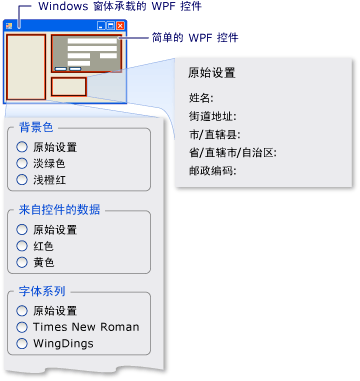

# <a name="walkthrough-hosting-a-wpf-composite-control-in-windows-forms"></a><span data-ttu-id="9e6da-102">演练：在 Windows 窗体中承载 WPF 复合控件</span><span class="sxs-lookup"><span data-stu-id="9e6da-102">Walkthrough: Hosting a WPF Composite Control in Windows Forms</span></span>
[!INCLUDE[TLA#tla_winclient](../../../../includes/tlasharptla-winclient-md.md)]<span data-ttu-id="9e6da-103"> 提供了用于创建应用程序的丰富环境。</span><span class="sxs-lookup"><span data-stu-id="9e6da-103"> provides a rich environment for creating applications.</span></span> <span data-ttu-id="9e6da-104">但是，当你有大量的投资[!INCLUDE[TLA#tla_winforms](../../../../includes/tlasharptla-winforms-md.md)]的代码，它可更有效地扩展现有[!INCLUDE[TLA#tla_winforms](../../../../includes/tlasharptla-winforms-md.md)]与应用程序[!INCLUDE[TLA2#tla_winclient](../../../../includes/tla2sharptla-winclient-md.md)]而不是从头开始重新编写。</span><span class="sxs-lookup"><span data-stu-id="9e6da-104">However, when you have a substantial investment in [!INCLUDE[TLA#tla_winforms](../../../../includes/tlasharptla-winforms-md.md)] code, it can be more effective to extend your existing [!INCLUDE[TLA#tla_winforms](../../../../includes/tlasharptla-winforms-md.md)] application with [!INCLUDE[TLA2#tla_winclient](../../../../includes/tla2sharptla-winclient-md.md)] rather than to rewrite it from scratch.</span></span> <span data-ttu-id="9e6da-105">常见方案是在你想要嵌入一个或多个控件实现与[!INCLUDE[TLA2#tla_winclient](../../../../includes/tla2sharptla-winclient-md.md)]Windows 窗体应用程序中。</span><span class="sxs-lookup"><span data-stu-id="9e6da-105">A common scenario is when you want to embed one or more controls implemented with [!INCLUDE[TLA2#tla_winclient](../../../../includes/tla2sharptla-winclient-md.md)] within your Windows Forms application.</span></span> <span data-ttu-id="9e6da-106">有关自定义 WPF 控件的详细信息，请参阅[控件自定义](../../../../docs/framework/wpf/controls/control-customization.md)。</span><span class="sxs-lookup"><span data-stu-id="9e6da-106">For more information about customizing WPF controls, see [Control Customization](../../../../docs/framework/wpf/controls/control-customization.md).</span></span>  
  
 <span data-ttu-id="9e6da-107">本演练将引导你通过应用程序承载[!INCLUDE[TLA2#tla_winclient](../../../../includes/tla2sharptla-winclient-md.md)]复合控件，可在 Windows 窗体应用程序中执行数据输入。</span><span class="sxs-lookup"><span data-stu-id="9e6da-107">This walkthrough steps you through an application that hosts a [!INCLUDE[TLA2#tla_winclient](../../../../includes/tla2sharptla-winclient-md.md)] composite control to perform data-entry in a Windows Forms application.</span></span> <span data-ttu-id="9e6da-108">复合控件打包在一个 DLL 中。</span><span class="sxs-lookup"><span data-stu-id="9e6da-108">The composite control is packaged in a DLL.</span></span> <span data-ttu-id="9e6da-109">此常规步骤可扩展到更复杂的应用程序和控件。</span><span class="sxs-lookup"><span data-stu-id="9e6da-109">This general procedure can be extended to more complex applications and controls.</span></span> <span data-ttu-id="9e6da-110">本演练可在外观和功能几乎完全相同[演练： 承载 Windows 窗体复合控件在 WPF](../../../../docs/framework/wpf/advanced/walkthrough-hosting-a-windows-forms-composite-control-in-wpf.md)。</span><span class="sxs-lookup"><span data-stu-id="9e6da-110">This walkthrough is designed to be nearly identical in appearance and functionality to [Walkthrough: Hosting a Windows Forms Composite Control in WPF](../../../../docs/framework/wpf/advanced/walkthrough-hosting-a-windows-forms-composite-control-in-wpf.md).</span></span> <span data-ttu-id="9e6da-111">主要区别在于承载方案是相反的。</span><span class="sxs-lookup"><span data-stu-id="9e6da-111">The primary difference is that the hosting scenario is reversed.</span></span>  
  
 <span data-ttu-id="9e6da-112">本演练分为两个部分。</span><span class="sxs-lookup"><span data-stu-id="9e6da-112">The walkthrough is divided into two sections.</span></span> <span data-ttu-id="9e6da-113">第一个部分简要介绍的实现[!INCLUDE[TLA2#tla_winclient](../../../../includes/tla2sharptla-winclient-md.md)]复合控件。</span><span class="sxs-lookup"><span data-stu-id="9e6da-113">The first section briefly describes the implementation of the [!INCLUDE[TLA2#tla_winclient](../../../../includes/tla2sharptla-winclient-md.md)] composite control.</span></span> <span data-ttu-id="9e6da-114">第二部分详细讨论了如何承载 Windows 窗体应用程序中的复合控件，通过控件，接收事件并访问某些控件的属性。</span><span class="sxs-lookup"><span data-stu-id="9e6da-114">The second section discusses in detail how to host the composite control in a Windows Forms application, receive events from the control, and access some of the control’s properties.</span></span>  
  
 <span data-ttu-id="9e6da-115">本演练涉及以下任务：</span><span class="sxs-lookup"><span data-stu-id="9e6da-115">Tasks illustrated in this walkthrough include:</span></span>  
  
-   <span data-ttu-id="9e6da-116">实现 WPF 复合控件。</span><span class="sxs-lookup"><span data-stu-id="9e6da-116">Implementing the WPF composite control.</span></span>  
  
-   <span data-ttu-id="9e6da-117">实现 Windows 窗体主机应用程序。</span><span class="sxs-lookup"><span data-stu-id="9e6da-117">Implementing the Windows Forms host application.</span></span>  
  
 <span data-ttu-id="9e6da-118">本演练的任务的完整代码清单，请参阅[承载 Windows 窗体示例中的 WPF 复合控件](http://go.microsoft.com/fwlink/?LinkID=159996)。</span><span class="sxs-lookup"><span data-stu-id="9e6da-118">For a complete code listing of the tasks illustrated in this walkthrough, see [Hosting a WPF Composite Control in Windows Forms Sample](http://go.microsoft.com/fwlink/?LinkID=159996).</span></span>  
  
## <a name="prerequisites"></a><span data-ttu-id="9e6da-119">系统必备</span><span class="sxs-lookup"><span data-stu-id="9e6da-119">Prerequisites</span></span>  
 <span data-ttu-id="9e6da-120">你需要以下组件来完成本演练：</span><span class="sxs-lookup"><span data-stu-id="9e6da-120">You need the following components to complete this walkthrough:</span></span>  
  
-   [!INCLUDE[vs_dev10_long](../../../../includes/vs-dev10-long-md.md)]<span data-ttu-id="9e6da-121">。</span><span class="sxs-lookup"><span data-stu-id="9e6da-121">.</span></span>  
  
## <a name="implementing-the-wpf-composite-control"></a><span data-ttu-id="9e6da-122">实现 WPF 复合控件</span><span class="sxs-lookup"><span data-stu-id="9e6da-122">Implementing the WPF Composite Control</span></span>  
 <span data-ttu-id="9e6da-123">[!INCLUDE[TLA2#tla_winclient](../../../../includes/tla2sharptla-winclient-md.md)]此示例中使用的复合控件是一种简单的数据输入表单，采用用户的名称和地址。</span><span class="sxs-lookup"><span data-stu-id="9e6da-123">The [!INCLUDE[TLA2#tla_winclient](../../../../includes/tla2sharptla-winclient-md.md)] composite control used in this example is a simple data-entry form that takes the user's name and address.</span></span> <span data-ttu-id="9e6da-124">当用户单击两个按钮的其中一个以指示任务已完成时，该控件会引发将该信息返回给主机的自定义事件。</span><span class="sxs-lookup"><span data-stu-id="9e6da-124">When the user clicks one of two buttons to indicate that the task is finished, the control raises a custom event to return that information to the host.</span></span> <span data-ttu-id="9e6da-125">下图显示呈现的控件。</span><span class="sxs-lookup"><span data-stu-id="9e6da-125">The following illustration shows the rendered control.</span></span>  
  
 <span data-ttu-id="9e6da-126"></span><span class="sxs-lookup"><span data-stu-id="9e6da-126"></span></span>  
<span data-ttu-id="9e6da-127">WPF 复合控件</span><span class="sxs-lookup"><span data-stu-id="9e6da-127">WPF composite control</span></span>  
  
### <a name="creating-the-project"></a><span data-ttu-id="9e6da-128">创建项目</span><span class="sxs-lookup"><span data-stu-id="9e6da-128">Creating the Project</span></span>  
 <span data-ttu-id="9e6da-129">启动项目：</span><span class="sxs-lookup"><span data-stu-id="9e6da-129">To start the project:</span></span>  
  
1.  <span data-ttu-id="9e6da-130">启动[!INCLUDE[TLA#tla_visualstu](../../../../includes/tlasharptla-visualstu-md.md)]，并打开**新项目**对话框。</span><span class="sxs-lookup"><span data-stu-id="9e6da-130">Launch [!INCLUDE[TLA#tla_visualstu](../../../../includes/tlasharptla-visualstu-md.md)], and open the **New Project** dialog box.</span></span>  
  
2.  <span data-ttu-id="9e6da-131">在 Visual C# 和 Windows 类别中，选择**WPF 用户控件库**模板。</span><span class="sxs-lookup"><span data-stu-id="9e6da-131">In Visual C# and the Windows category, select the **WPF User Control Library** template.</span></span>  
  
3.  <span data-ttu-id="9e6da-132">将新项目命名为 `MyControls`。</span><span class="sxs-lookup"><span data-stu-id="9e6da-132">Name the new project `MyControls`.</span></span>  
  
4.  <span data-ttu-id="9e6da-133">对于位置，指定将方便地命名的顶级文件夹，如`WindowsFormsHostingWpfControl`。</span><span class="sxs-lookup"><span data-stu-id="9e6da-133">For the location, specify a conveniently named top-level folder, such as `WindowsFormsHostingWpfControl`.</span></span> <span data-ttu-id="9e6da-134">随后，将主机应用程序放在此文件夹中。</span><span class="sxs-lookup"><span data-stu-id="9e6da-134">Later, you will put the host application in this folder.</span></span>  
  
5.  <span data-ttu-id="9e6da-135">单击“确定”，创建项目。</span><span class="sxs-lookup"><span data-stu-id="9e6da-135">Click **OK** to create the project.</span></span> <span data-ttu-id="9e6da-136">默认项目包含一个名为的单个控件`UserControl1`。</span><span class="sxs-lookup"><span data-stu-id="9e6da-136">The default project contains a single control named `UserControl1`.</span></span>  
  
6.  <span data-ttu-id="9e6da-137">在解决方案资源管理器，重命名`UserControl1`到`MyControl1`。</span><span class="sxs-lookup"><span data-stu-id="9e6da-137">In Solution Explorer, rename `UserControl1` to `MyControl1`.</span></span>  
  
 <span data-ttu-id="9e6da-138">项目应具有对以下系统 DLL 的引用。</span><span class="sxs-lookup"><span data-stu-id="9e6da-138">Your project should have references to the following system DLLs.</span></span> <span data-ttu-id="9e6da-139">如果默认未包含其中任何 DLL，请将它们添加到项目中。</span><span class="sxs-lookup"><span data-stu-id="9e6da-139">If any of these DLLs are not included by default, add them to your project.</span></span>  
  
-   <span data-ttu-id="9e6da-140">PresentationCore</span><span class="sxs-lookup"><span data-stu-id="9e6da-140">PresentationCore</span></span>  
  
-   <span data-ttu-id="9e6da-141">PresentationFramework</span><span class="sxs-lookup"><span data-stu-id="9e6da-141">PresentationFramework</span></span>  
  
-   <span data-ttu-id="9e6da-142">系统</span><span class="sxs-lookup"><span data-stu-id="9e6da-142">System</span></span>  
  
-   <span data-ttu-id="9e6da-143">WindowsBase</span><span class="sxs-lookup"><span data-stu-id="9e6da-143">WindowsBase</span></span>  
  
### <a name="creating-the-user-interface"></a><span data-ttu-id="9e6da-144">创建用户界面</span><span class="sxs-lookup"><span data-stu-id="9e6da-144">Creating the User Interface</span></span>  
 <span data-ttu-id="9e6da-145">[!INCLUDE[TLA#tla_ui](../../../../includes/tlasharptla-ui-md.md)]复合控件实现与[!INCLUDE[TLA#tla_xaml](../../../../includes/tlasharptla-xaml-md.md)]。</span><span class="sxs-lookup"><span data-stu-id="9e6da-145">The [!INCLUDE[TLA#tla_ui](../../../../includes/tlasharptla-ui-md.md)] for the composite control is implemented with [!INCLUDE[TLA#tla_xaml](../../../../includes/tlasharptla-xaml-md.md)].</span></span> <span data-ttu-id="9e6da-146">复合控件[!INCLUDE[TLA2#tla_ui](../../../../includes/tla2sharptla-ui-md.md)]包含五个<xref:System.Windows.Controls.TextBox>元素。</span><span class="sxs-lookup"><span data-stu-id="9e6da-146">The composite control [!INCLUDE[TLA2#tla_ui](../../../../includes/tla2sharptla-ui-md.md)] consists of five <xref:System.Windows.Controls.TextBox> elements.</span></span> <span data-ttu-id="9e6da-147">每个<xref:System.Windows.Controls.TextBox>元素都有一个相关<xref:System.Windows.Controls.TextBlock>用作标签的元素。</span><span class="sxs-lookup"><span data-stu-id="9e6da-147">Each <xref:System.Windows.Controls.TextBox> element has an associated <xref:System.Windows.Controls.TextBlock> element that serves as a label.</span></span> <span data-ttu-id="9e6da-148">有两个<xref:System.Windows.Controls.Button>元素在底部，**确定**和**取消**。</span><span class="sxs-lookup"><span data-stu-id="9e6da-148">There are two <xref:System.Windows.Controls.Button> elements at the bottom, **OK** and **Cancel**.</span></span> <span data-ttu-id="9e6da-149">当用户单击任一按钮时，该控件会引发将信息返回给主机的自定义事件。</span><span class="sxs-lookup"><span data-stu-id="9e6da-149">When the user clicks either button, the control raises a custom event to return the information to the host.</span></span>  
  
#### <a name="basic-layout"></a><span data-ttu-id="9e6da-150">基本布局</span><span class="sxs-lookup"><span data-stu-id="9e6da-150">Basic Layout</span></span>  
 <span data-ttu-id="9e6da-151">各种[!INCLUDE[TLA2#tla_ui](../../../../includes/tla2sharptla-ui-md.md)]元素包含在<xref:System.Windows.Controls.Grid>元素。</span><span class="sxs-lookup"><span data-stu-id="9e6da-151">The various [!INCLUDE[TLA2#tla_ui](../../../../includes/tla2sharptla-ui-md.md)] elements are contained in a <xref:System.Windows.Controls.Grid> element.</span></span> <span data-ttu-id="9e6da-152">你可以使用<xref:System.Windows.Controls.Grid>要排列在很大程度的复合的内容控件相同方式你可以使用`Table`中 HTML 元素。</span><span class="sxs-lookup"><span data-stu-id="9e6da-152">You can use <xref:System.Windows.Controls.Grid> to arrange the contents of the composite control in much the same way you would use a `Table` element in HTML.</span></span> [!INCLUDE[TLA2#tla_winclient](../../../../includes/tla2sharptla-winclient-md.md)]<span data-ttu-id="9e6da-153"> 此外具有<xref:System.Windows.Documents.Table>元素，但<xref:System.Windows.Controls.Grid>是更轻量和更好地适用于简单布局任务。</span><span class="sxs-lookup"><span data-stu-id="9e6da-153"> also has a <xref:System.Windows.Documents.Table> element, but <xref:System.Windows.Controls.Grid> is more lightweight and better suited for simple layout tasks.</span></span>  
  
 <span data-ttu-id="9e6da-154">以下 XAML 演示基本布局。</span><span class="sxs-lookup"><span data-stu-id="9e6da-154">The following XAML shows the basic layout.</span></span> <span data-ttu-id="9e6da-155">此 XAML 通过指定的列数定义控件的整体结构和中的行<xref:System.Windows.Controls.Grid>元素。</span><span class="sxs-lookup"><span data-stu-id="9e6da-155">This XAML defines the overall structure of the control by specifying the number of columns and rows in the <xref:System.Windows.Controls.Grid> element.</span></span>  
  
 <span data-ttu-id="9e6da-156">在 MyControl1.xaml 中，将现有 XAML 替换为以下 XAML。</span><span class="sxs-lookup"><span data-stu-id="9e6da-156">In MyControl1.xaml, replace the existing XAML with the following XAML.</span></span>  
  
 [!code-xaml[WindowsFormsHostingWpfControl#101](../../../../samples/snippets/csharp/VS_Snippets_Wpf/WindowsFormsHostingWpfControl/CSharp/MyControls/Page1.xaml#101)]  
[!code-xaml[WindowsFormsHostingWpfControl#102](../../../../samples/snippets/csharp/VS_Snippets_Wpf/WindowsFormsHostingWpfControl/CSharp/MyControls/Page1.xaml#102)]  
  
#### <a name="adding-textblock-and-textbox-elements-to-the-grid"></a><span data-ttu-id="9e6da-157">向 Grid 添加 TextBlock 和 TextBox 元素</span><span class="sxs-lookup"><span data-stu-id="9e6da-157">Adding TextBlock and TextBox Elements to the Grid</span></span>  
 <span data-ttu-id="9e6da-158">你将放置[!INCLUDE[TLA2#tla_ui](../../../../includes/tla2sharptla-ui-md.md)]通过设置元素的网格中的元素<xref:System.Windows.Controls.Grid.RowProperty>和<xref:System.Windows.Controls.Grid.ColumnProperty>到合适的行和列号属性。</span><span class="sxs-lookup"><span data-stu-id="9e6da-158">You place a [!INCLUDE[TLA2#tla_ui](../../../../includes/tla2sharptla-ui-md.md)] element in the grid by setting the element's <xref:System.Windows.Controls.Grid.RowProperty> and <xref:System.Windows.Controls.Grid.ColumnProperty> attributes to the appropriate row and column number.</span></span> <span data-ttu-id="9e6da-159">请记住行号和列号是从零开始的。</span><span class="sxs-lookup"><span data-stu-id="9e6da-159">Remember that row and column numbering are zero-based.</span></span> <span data-ttu-id="9e6da-160">你可以通过设置跨多个列的元素及其<xref:System.Windows.Controls.Grid.ColumnSpanProperty>属性。</span><span class="sxs-lookup"><span data-stu-id="9e6da-160">You can have an element span multiple columns by setting its <xref:System.Windows.Controls.Grid.ColumnSpanProperty> attribute.</span></span> <span data-ttu-id="9e6da-161">有关详细信息<xref:System.Windows.Controls.Grid>元素，请参阅[创建网格元素](../../../../docs/framework/wpf/controls/how-to-create-a-grid-element.md)。</span><span class="sxs-lookup"><span data-stu-id="9e6da-161">For more information about <xref:System.Windows.Controls.Grid> elements, see [Create a Grid Element](../../../../docs/framework/wpf/controls/how-to-create-a-grid-element.md).</span></span>  
  
 <span data-ttu-id="9e6da-162">下面的 XAML 演示复合控件<xref:System.Windows.Controls.TextBox>和<xref:System.Windows.Controls.TextBlock>元素使用其<xref:System.Windows.Controls.Grid.RowProperty>和<xref:System.Windows.Controls.Grid.ColumnProperty>设置在网格中正确放置元素的属性。</span><span class="sxs-lookup"><span data-stu-id="9e6da-162">The following XAML shows the composite control’s <xref:System.Windows.Controls.TextBox> and <xref:System.Windows.Controls.TextBlock> elements with their <xref:System.Windows.Controls.Grid.RowProperty> and <xref:System.Windows.Controls.Grid.ColumnProperty> attributes, which are set to place the elements properly in the grid.</span></span>  
  
 <span data-ttu-id="9e6da-163">在 MyControl1.xaml，添加以下 XAML 在<xref:System.Windows.Controls.Grid>元素。</span><span class="sxs-lookup"><span data-stu-id="9e6da-163">In MyControl1.xaml, add the following XAML within the <xref:System.Windows.Controls.Grid> element.</span></span>  
  
 [!code-xaml[WindowsFormsHostingWpfControl#103](../../../../samples/snippets/csharp/VS_Snippets_Wpf/WindowsFormsHostingWpfControl/CSharp/MyControls/Page1.xaml#103)]  
  
#### <a name="styling-the-ui-elements"></a><span data-ttu-id="9e6da-164">设置 UI 元素的样式</span><span class="sxs-lookup"><span data-stu-id="9e6da-164">Styling the UI Elements</span></span>  
 <span data-ttu-id="9e6da-165">数据输入窗体上的许多元素外观相似，这意味着它们对于其若干属性具有相同的设置。</span><span class="sxs-lookup"><span data-stu-id="9e6da-165">Many of the elements on the data-entry form have a similar appearance, which means that they have identical settings for several of their properties.</span></span> <span data-ttu-id="9e6da-166">而不是单独设置每个元素的属性，使用上面的 XAML<xref:System.Windows.Style>元素可定义为类的元素的标准属性设置。</span><span class="sxs-lookup"><span data-stu-id="9e6da-166">Rather than setting each element's attributes separately, the previous XAML uses <xref:System.Windows.Style> elements to define standard property settings for classes of elements.</span></span> <span data-ttu-id="9e6da-167">这种方法可以降低控件的复杂性，并使你能够通过单个样式特性更改多个元素的外观。</span><span class="sxs-lookup"><span data-stu-id="9e6da-167">This approach reduces the complexity of the control and enables you to change the appearance of multiple elements through a single style attribute.</span></span>  
  
 <span data-ttu-id="9e6da-168"><xref:System.Windows.Style>元素包含在<xref:System.Windows.Controls.Grid>元素的<xref:System.Windows.FrameworkElement.Resources%2A>属性，因此它们可以由该控件中的所有元素。</span><span class="sxs-lookup"><span data-stu-id="9e6da-168">The <xref:System.Windows.Style> elements are contained in the <xref:System.Windows.Controls.Grid> element's <xref:System.Windows.FrameworkElement.Resources%2A> property, so they can be used by all elements in the control.</span></span> <span data-ttu-id="9e6da-169">如果对样式进行命名，你将其应用于元素通过添加<xref:System.Windows.Style>元素设置为样式的名称。</span><span class="sxs-lookup"><span data-stu-id="9e6da-169">If a style is named, you apply it to an element by adding a <xref:System.Windows.Style> element set to the style's name.</span></span> <span data-ttu-id="9e6da-170">未命名的样式将成为该元素的默认样式。</span><span class="sxs-lookup"><span data-stu-id="9e6da-170">Styles that are not named become the default style for the element.</span></span> <span data-ttu-id="9e6da-171">有关详细信息[!INCLUDE[TLA2#tla_winclient](../../../../includes/tla2sharptla-winclient-md.md)]样式，请参阅[样式和模板化](../../../../docs/framework/wpf/controls/styling-and-templating.md)。</span><span class="sxs-lookup"><span data-stu-id="9e6da-171">For more information about [!INCLUDE[TLA2#tla_winclient](../../../../includes/tla2sharptla-winclient-md.md)] styles, see [Styling and Templating](../../../../docs/framework/wpf/controls/styling-and-templating.md).</span></span>  
  
 <span data-ttu-id="9e6da-172">下面的 XAML 演示<xref:System.Windows.Style>复合控件的元素。</span><span class="sxs-lookup"><span data-stu-id="9e6da-172">The following XAML shows the <xref:System.Windows.Style> elements for the composite control.</span></span> <span data-ttu-id="9e6da-173">若要查看样式如何应用于元素，请参阅前一个 XAML。</span><span class="sxs-lookup"><span data-stu-id="9e6da-173">To see how the styles are applied to elements, see the previous XAML.</span></span> <span data-ttu-id="9e6da-174">例如，最后一个<xref:System.Windows.Controls.TextBlock>元素具有`inlineText`样式和最后一个<xref:System.Windows.Controls.TextBox>元素使用默认样式。</span><span class="sxs-lookup"><span data-stu-id="9e6da-174">For example, the last <xref:System.Windows.Controls.TextBlock> element has the `inlineText` style, and the last <xref:System.Windows.Controls.TextBox> element uses the default style.</span></span>  
  
 <span data-ttu-id="9e6da-175">在 MyControl1.xaml，添加以下 XAML 紧后面<xref:System.Windows.Controls.Grid>开始元素。</span><span class="sxs-lookup"><span data-stu-id="9e6da-175">In MyControl1.xaml, add the following XAML just after the <xref:System.Windows.Controls.Grid> start element.</span></span>  
  
 [!code-xaml[WindowsFormsHostingWpfControl#104](../../../../samples/snippets/csharp/VS_Snippets_Wpf/WindowsFormsHostingWpfControl/CSharp/MyControls/Page1.xaml#104)]  
  
#### <a name="adding-the-ok-and-cancel-buttons"></a><span data-ttu-id="9e6da-176">添加“确定”和“取消”按钮</span><span class="sxs-lookup"><span data-stu-id="9e6da-176">Adding the OK and Cancel Buttons</span></span>  
 <span data-ttu-id="9e6da-177">复合控件上的最后一个元素均**确定**和**取消**<xref:System.Windows.Controls.Button>占用的最后一行的前两个列的元素<xref:System.Windows.Controls.Grid>。</span><span class="sxs-lookup"><span data-stu-id="9e6da-177">The final elements on the composite control are the **OK** and **Cancel**<xref:System.Windows.Controls.Button> elements, which occupy the first two columns of the last row of the <xref:System.Windows.Controls.Grid>.</span></span> <span data-ttu-id="9e6da-178">这些元素使用常见的事件处理程序中， `ButtonClicked`，也是默认值<xref:System.Windows.Controls.Button>在上面的 XAML 中定义的样式。</span><span class="sxs-lookup"><span data-stu-id="9e6da-178">These elements use a common event handler, `ButtonClicked`, and the default <xref:System.Windows.Controls.Button> style defined in the previous XAML.</span></span>  
  
 <span data-ttu-id="9e6da-179">在 MyControl1.xaml，最后的后面添加以下 XAML<xref:System.Windows.Controls.TextBox>元素。</span><span class="sxs-lookup"><span data-stu-id="9e6da-179">In MyControl1.xaml, add the following XAML after the last <xref:System.Windows.Controls.TextBox> element.</span></span> <span data-ttu-id="9e6da-180">[!INCLUDE[TLA2#tla_xaml](../../../../includes/tla2sharptla-xaml-md.md)]复合控件的一部分现已完成。</span><span class="sxs-lookup"><span data-stu-id="9e6da-180">The [!INCLUDE[TLA2#tla_xaml](../../../../includes/tla2sharptla-xaml-md.md)] part of the composite control is now complete.</span></span>  
  
 [!code-xaml[WindowsFormsHostingWpfControl#105](../../../../samples/snippets/csharp/VS_Snippets_Wpf/WindowsFormsHostingWpfControl/CSharp/MyControls/Page1.xaml#105)]  
  
### <a name="implementing-the-code-behind-file"></a><span data-ttu-id="9e6da-181">实现代码隐藏文件</span><span class="sxs-lookup"><span data-stu-id="9e6da-181">Implementing the Code-Behind File</span></span>  
 <span data-ttu-id="9e6da-182">代码隐藏文件，MyControl1.xaml.cs，实现三个重要任务：</span><span class="sxs-lookup"><span data-stu-id="9e6da-182">The code-behind file, MyControl1.xaml.cs, implements three essential tasks:</span></span>
  
1.  <span data-ttu-id="9e6da-183">处理用户单击其中一个按钮时发生的事件。</span><span class="sxs-lookup"><span data-stu-id="9e6da-183">Handles the event that occurs when the user clicks one of the buttons.</span></span>  
  
2.  <span data-ttu-id="9e6da-184">检索的数据从<xref:System.Windows.Controls.TextBox>元素，并将它们打包在自定义事件自变量对象中。</span><span class="sxs-lookup"><span data-stu-id="9e6da-184">Retrieves the data from the <xref:System.Windows.Controls.TextBox> elements, and packages it in a custom event argument object.</span></span>  
  
3.  <span data-ttu-id="9e6da-185">引发自定义`OnButtonClick`事件，这将告知用户已完成，并将数据传递回主机的主机。</span><span class="sxs-lookup"><span data-stu-id="9e6da-185">Raises the custom `OnButtonClick` event, which notifies the host that the user is finished and passes the data back to the host.</span></span>  
  
 <span data-ttu-id="9e6da-186">该控件还公开多个可用来更改外观的颜色和字体属性。</span><span class="sxs-lookup"><span data-stu-id="9e6da-186">The control also exposes a number of color and font properties that enable you to change the appearance.</span></span> <span data-ttu-id="9e6da-187">与不同<xref:System.Windows.Forms.Integration.WindowsFormsHost>类，该类用于承载 Windows 窗体控件<xref:System.Windows.Forms.Integration.ElementHost>类公开控件的<xref:System.Windows.Controls.Panel.Background%2A>仅属性。</span><span class="sxs-lookup"><span data-stu-id="9e6da-187">Unlike the <xref:System.Windows.Forms.Integration.WindowsFormsHost> class, which is used to host a Windows Forms control, the <xref:System.Windows.Forms.Integration.ElementHost> class exposes the control’s <xref:System.Windows.Controls.Panel.Background%2A> property only.</span></span> <span data-ttu-id="9e6da-188">若要维护此代码示例以及中所述的示例之间的相似性[演练： 承载 Windows 窗体复合控件在 WPF](../../../../docs/framework/wpf/advanced/walkthrough-hosting-a-windows-forms-composite-control-in-wpf.md)，控件可直接公开其余属性。</span><span class="sxs-lookup"><span data-stu-id="9e6da-188">To maintain the similarity between this code example and the example discussed in [Walkthrough: Hosting a Windows Forms Composite Control in WPF](../../../../docs/framework/wpf/advanced/walkthrough-hosting-a-windows-forms-composite-control-in-wpf.md), the control exposes the remaining properties directly.</span></span>  
  
#### <a name="the-basic-structure-of-the-code-behind-file"></a><span data-ttu-id="9e6da-189">代码隐藏文件的基本结构</span><span class="sxs-lookup"><span data-stu-id="9e6da-189">The Basic Structure of the Code-Behind File</span></span>  
 <span data-ttu-id="9e6da-190">代码隐藏文件包含单个命名空间， `MyControls`，其中将包含两个类，`MyControl1`和`MyControlEventArgs`。</span><span class="sxs-lookup"><span data-stu-id="9e6da-190">The code-behind file consists of a single namespace, `MyControls`, which will contain two classes, `MyControl1` and `MyControlEventArgs`.</span></span>  
  
```  
namespace MyControls  
{  
  public partial class MyControl1 : Grid  
  {  
    //...  
  }  
  public class MyControlEventArgs : EventArgs  
  {  
    //...  
  }  
}  
```  
  
 <span data-ttu-id="9e6da-191">第一个类， `MyControl1`，是分部类，包含实现的功能的代码[!INCLUDE[TLA2#tla_ui](../../../../includes/tla2sharptla-ui-md.md)]MyControl1.xaml 中定义。</span><span class="sxs-lookup"><span data-stu-id="9e6da-191">The first class, `MyControl1`, is a partial class containing the code that implements the functionality of the [!INCLUDE[TLA2#tla_ui](../../../../includes/tla2sharptla-ui-md.md)] defined in MyControl1.xaml.</span></span> <span data-ttu-id="9e6da-192">分析 MyControl1.xaml 时，[!INCLUDE[TLA2#tla_xaml](../../../../includes/tla2sharptla-xaml-md.md)]转换为相同的分部类，以及两个分部类合并以形成已编译的控件。</span><span class="sxs-lookup"><span data-stu-id="9e6da-192">When MyControl1.xaml is parsed, the [!INCLUDE[TLA2#tla_xaml](../../../../includes/tla2sharptla-xaml-md.md)] is converted to the same partial class, and the two partial classes are merged to form the compiled control.</span></span> <span data-ttu-id="9e6da-193">出于此原因，代码隐藏文件中的类名必须与分配给 MyControl1.xaml 的类名相匹配，并且它必须继承自控件的根元素。</span><span class="sxs-lookup"><span data-stu-id="9e6da-193">For this reason, the class name in the code-behind file must match the class name assigned to MyControl1.xaml, and it must inherit from the root element of the control.</span></span> <span data-ttu-id="9e6da-194">第二个类， `MyControlEventArgs`，是事件自变量类，用于将数据发送回主机。</span><span class="sxs-lookup"><span data-stu-id="9e6da-194">The second class, `MyControlEventArgs`, is an event arguments class that is used to send the data back to the host.</span></span>  
  
 <span data-ttu-id="9e6da-195">打开 MyControl1.xaml.cs。</span><span class="sxs-lookup"><span data-stu-id="9e6da-195">Open MyControl1.xaml.cs.</span></span> <span data-ttu-id="9e6da-196">更改现有的类声明，以便它具有以下名称并继承自<xref:System.Windows.Controls.Grid>。</span><span class="sxs-lookup"><span data-stu-id="9e6da-196">Change the existing class declaration so that it has the following name and inherits from <xref:System.Windows.Controls.Grid>.</span></span>  
  
 [!code-csharp[WindowsFormsHostingWpfControl#21](../../../../samples/snippets/csharp/VS_Snippets_Wpf/WindowsFormsHostingWpfControl/CSharp/MyControls/Page1.xaml.cs#21)]  
  
#### <a name="initializing-the-control"></a><span data-ttu-id="9e6da-197">初始化控件</span><span class="sxs-lookup"><span data-stu-id="9e6da-197">Initializing the Control</span></span>  
 <span data-ttu-id="9e6da-198">下面的代码实现几个基本任务：</span><span class="sxs-lookup"><span data-stu-id="9e6da-198">The following code implements several basic tasks:</span></span>  
  
-   <span data-ttu-id="9e6da-199">声明一个私有事件`OnButtonClick`，和其关联的委托， `MyControlEventHandler`。</span><span class="sxs-lookup"><span data-stu-id="9e6da-199">Declares a private event, `OnButtonClick`, and its associated delegate, `MyControlEventHandler`.</span></span>  
  
-   <span data-ttu-id="9e6da-200">创建几个存储用户数据的私有全局变量。</span><span class="sxs-lookup"><span data-stu-id="9e6da-200">Creates several private global variables that store the user's data.</span></span> <span data-ttu-id="9e6da-201">此数据通过相应的属性公开。</span><span class="sxs-lookup"><span data-stu-id="9e6da-201">This data is exposed through corresponding properties.</span></span>  
  
-   <span data-ttu-id="9e6da-202">实现一个处理程序， `Init`，为该控件的<xref:System.Windows.FrameworkElement.Loaded>事件。</span><span class="sxs-lookup"><span data-stu-id="9e6da-202">Implements a handler, `Init`, for the control’s <xref:System.Windows.FrameworkElement.Loaded> event.</span></span> <span data-ttu-id="9e6da-203">此处理程序通过向全局变量分配 MyControl1.xaml 中定义的值来对它们进行初始化。</span><span class="sxs-lookup"><span data-stu-id="9e6da-203">This handler initializes the global variables by assigning them the values defined in MyControl1.xaml.</span></span> <span data-ttu-id="9e6da-204">若要执行此操作，它使用<xref:System.Windows.FrameworkElement.Name%2A>分配给典型<xref:System.Windows.Controls.TextBlock>元素， `nameLabel`，若要访问该元素的属性设置。</span><span class="sxs-lookup"><span data-stu-id="9e6da-204">To do this, it uses the <xref:System.Windows.FrameworkElement.Name%2A> assigned to a typical <xref:System.Windows.Controls.TextBlock> element, `nameLabel`, to access that element's property settings.</span></span>  
  
 <span data-ttu-id="9e6da-205">删除现有的构造函数，并添加以下代码你`MyControl1`类。</span><span class="sxs-lookup"><span data-stu-id="9e6da-205">Delete the existing constructor and add the following code to your `MyControl1` class.</span></span>  
  
 [!code-csharp[WindowsFormsHostingWpfControl#11](../../../../samples/snippets/csharp/VS_Snippets_Wpf/WindowsFormsHostingWpfControl/CSharp/MyControls/Page1.xaml.cs#11)]  
  
#### <a name="handling-the-buttons-click-events"></a><span data-ttu-id="9e6da-206">处理按钮的单击事件</span><span class="sxs-lookup"><span data-stu-id="9e6da-206">Handling the Buttons' Click Events</span></span>  
 <span data-ttu-id="9e6da-207">用户表明数据输入任务已完成通过单击**确定**按钮或**取消**按钮。</span><span class="sxs-lookup"><span data-stu-id="9e6da-207">The user indicates that the data-entry task is finished by clicking either the **OK** button or the **Cancel** button.</span></span> <span data-ttu-id="9e6da-208">这两个按钮将使用相同<xref:System.Windows.Controls.Primitives.ButtonBase.Click>事件处理程序， `ButtonClicked`。</span><span class="sxs-lookup"><span data-stu-id="9e6da-208">Both buttons use the same <xref:System.Windows.Controls.Primitives.ButtonBase.Click> event handler, `ButtonClicked`.</span></span> <span data-ttu-id="9e6da-209">两个按钮具有名称、`btnOK`或`btnCancel`，这样的要确定哪个按钮被单击通过检查的值的处理程序`sender`自变量。</span><span class="sxs-lookup"><span data-stu-id="9e6da-209">Both buttons have a name, `btnOK` or `btnCancel`, that enables the handler to determine which button was clicked by examining the value of the `sender` argument.</span></span> <span data-ttu-id="9e6da-210">该处理程序执行以下任务：</span><span class="sxs-lookup"><span data-stu-id="9e6da-210">The handler does the following:</span></span>  
  
-   <span data-ttu-id="9e6da-211">创建`MyControlEventArgs`包含中的数据的对象<xref:System.Windows.Controls.TextBox>元素。</span><span class="sxs-lookup"><span data-stu-id="9e6da-211">Creates a `MyControlEventArgs` object that contains the data from the <xref:System.Windows.Controls.TextBox> elements.</span></span>  
  
-   <span data-ttu-id="9e6da-212">如果用户单击**取消**按钮，集`MyControlEventArgs`对象的`IsOK`属性`false`。</span><span class="sxs-lookup"><span data-stu-id="9e6da-212">If the user clicked the **Cancel** button, sets the `MyControlEventArgs` object's `IsOK` property to `false`.</span></span>  
  
-   <span data-ttu-id="9e6da-213">引发`OnButtonClick`事件以指示到主机，用户已完成，并且传回收集的数据。</span><span class="sxs-lookup"><span data-stu-id="9e6da-213">Raises the `OnButtonClick` event to indicate to the host that the user is finished, and passes back the collected data.</span></span>  
  
 <span data-ttu-id="9e6da-214">以下代码添加到你`MyControl1`类后,`Init`方法。</span><span class="sxs-lookup"><span data-stu-id="9e6da-214">Add the following code to your `MyControl1` class, after the `Init` method.</span></span>  
  
 [!code-csharp[WindowsFormsHostingWpfControl#12](../../../../samples/snippets/csharp/VS_Snippets_Wpf/WindowsFormsHostingWpfControl/CSharp/MyControls/Page1.xaml.cs#12)]  
  
#### <a name="creating-properties"></a><span data-ttu-id="9e6da-215">创建属性</span><span class="sxs-lookup"><span data-stu-id="9e6da-215">Creating Properties</span></span>  
 <span data-ttu-id="9e6da-216">类的其余部分只是公开对应于前面所述的全局变量的属性。</span><span class="sxs-lookup"><span data-stu-id="9e6da-216">The remainder of the class simply exposes properties that correspond to the global variables discussed previously.</span></span> <span data-ttu-id="9e6da-217">当属性更改时，set 访问器会通过更改对应的元素属性并更新基础全局变量来修改控件的外观。</span><span class="sxs-lookup"><span data-stu-id="9e6da-217">When a property changes, the set accessor modifies the appearance of the control by changing the corresponding element properties and updating the underlying global variables.</span></span>  
  
 <span data-ttu-id="9e6da-218">以下代码添加到你`MyControl1`类。</span><span class="sxs-lookup"><span data-stu-id="9e6da-218">Add the following code to your `MyControl1` class.</span></span>  
  
 [!code-csharp[WindowsFormsHostingWpfControl#13](../../../../samples/snippets/csharp/VS_Snippets_Wpf/WindowsFormsHostingWpfControl/CSharp/MyControls/Page1.xaml.cs#13)]  
  
#### <a name="sending-the-data-back-to-the-host"></a><span data-ttu-id="9e6da-219">将数据发送回主机</span><span class="sxs-lookup"><span data-stu-id="9e6da-219">Sending the Data Back to the Host</span></span>  
 <span data-ttu-id="9e6da-220">文件中的最后一个组件是`MyControlEventArgs`类，用于将收集的数据发送回主机。</span><span class="sxs-lookup"><span data-stu-id="9e6da-220">The final component in the file is the `MyControlEventArgs` class, which is used to send the collected data back to the host.</span></span>  
  
 <span data-ttu-id="9e6da-221">以下代码添加到你`MyControls`命名空间。</span><span class="sxs-lookup"><span data-stu-id="9e6da-221">Add the following code to your `MyControls` namespace.</span></span> <span data-ttu-id="9e6da-222">该实现非常简单明了，因而不再进一步讨论。</span><span class="sxs-lookup"><span data-stu-id="9e6da-222">The implementation is straightforward, and is not discussed further.</span></span>  
  
 [!code-csharp[WindowsFormsHostingWpfControl#14](../../../../samples/snippets/csharp/VS_Snippets_Wpf/WindowsFormsHostingWpfControl/CSharp/MyControls/Page1.xaml.cs#14)]  
  
 <span data-ttu-id="9e6da-223">生成解决方案。</span><span class="sxs-lookup"><span data-stu-id="9e6da-223">Build the solution.</span></span> <span data-ttu-id="9e6da-224">生成将产生一个名为 MyControls.dll 的 DLL。</span><span class="sxs-lookup"><span data-stu-id="9e6da-224">The build will produce a DLL named MyControls.dll.</span></span>  
  
<a name="winforms_host_section"></a>   
## <a name="implementing-the-windows-forms-host-application"></a><span data-ttu-id="9e6da-225">实现 Windows 窗体主机应用程序</span><span class="sxs-lookup"><span data-stu-id="9e6da-225">Implementing the Windows Forms Host Application</span></span>  
 <span data-ttu-id="9e6da-226">Windows 窗体主机应用程序使用<xref:System.Windows.Forms.Integration.ElementHost>到主机的对象[!INCLUDE[TLA2#tla_winclient](../../../../includes/tla2sharptla-winclient-md.md)]复合控件。</span><span class="sxs-lookup"><span data-stu-id="9e6da-226">The Windows Forms host application uses an <xref:System.Windows.Forms.Integration.ElementHost> object to host the [!INCLUDE[TLA2#tla_winclient](../../../../includes/tla2sharptla-winclient-md.md)] composite control.</span></span> <span data-ttu-id="9e6da-227">该应用程序处理`OnButtonClick`事件，以接收来自复合控件的数据。</span><span class="sxs-lookup"><span data-stu-id="9e6da-227">The application handles the `OnButtonClick` event to receive the data from the composite control.</span></span> <span data-ttu-id="9e6da-228">该应用程序还具有一组可用于修改控件外观的选项按钮。</span><span class="sxs-lookup"><span data-stu-id="9e6da-228">The application also has a set of option buttons that you can use to modify the control’s appearance.</span></span> <span data-ttu-id="9e6da-229">下图显示应用程序。</span><span class="sxs-lookup"><span data-stu-id="9e6da-229">The following illustration shows the application.</span></span>  
  
 <span data-ttu-id="9e6da-230"></span><span class="sxs-lookup"><span data-stu-id="9e6da-230"></span></span>  
<span data-ttu-id="9e6da-231">Windows 窗体应用程序中承载的 WPF 复合控件</span><span class="sxs-lookup"><span data-stu-id="9e6da-231">WPF composite control hosted in a Windows Forms application</span></span>  
  
### <a name="creating-the-project"></a><span data-ttu-id="9e6da-232">创建项目</span><span class="sxs-lookup"><span data-stu-id="9e6da-232">Creating the Project</span></span>  
 <span data-ttu-id="9e6da-233">启动项目：</span><span class="sxs-lookup"><span data-stu-id="9e6da-233">To start the project:</span></span>  
  
1.  <span data-ttu-id="9e6da-234">启动[!INCLUDE[TLA2#tla_visualstu](../../../../includes/tla2sharptla-visualstu-md.md)]，并打开**新项目**对话框。</span><span class="sxs-lookup"><span data-stu-id="9e6da-234">Launch [!INCLUDE[TLA2#tla_visualstu](../../../../includes/tla2sharptla-visualstu-md.md)], and open the **New Project** dialog box.</span></span>  
  
2.  <span data-ttu-id="9e6da-235">在 Visual C# 和 Windows 类别中，选择**Windows 窗体应用程序**模板。</span><span class="sxs-lookup"><span data-stu-id="9e6da-235">In Visual C# and the Windows category, select  the **Windows Forms Application** template.</span></span>  
  
3.  <span data-ttu-id="9e6da-236">将新项目命名为 `WFHost`。</span><span class="sxs-lookup"><span data-stu-id="9e6da-236">Name the new project `WFHost`.</span></span>  
  
4.  <span data-ttu-id="9e6da-237">对于位置，指定包含 MyControls 项目的同一顶层文件夹。</span><span class="sxs-lookup"><span data-stu-id="9e6da-237">For the location, specify the same top-level folder that contains the MyControls project.</span></span>  
  
5.  <span data-ttu-id="9e6da-238">单击“确定”，创建项目。</span><span class="sxs-lookup"><span data-stu-id="9e6da-238">Click **OK** to create the project.</span></span>  
  
 <span data-ttu-id="9e6da-239">你还需要将引用添加到包含 DLL`MyControl1`和其他程序集。</span><span class="sxs-lookup"><span data-stu-id="9e6da-239">You also need to add references to the DLL that contains `MyControl1` and other assemblies.</span></span>  
  
1.  <span data-ttu-id="9e6da-240">右键单击解决方案资源管理器中的项目名称并选择**添加引用**。</span><span class="sxs-lookup"><span data-stu-id="9e6da-240">Right-click the project name in Solution Explorer, and select **Add Reference**.</span></span>  
  
2.  <span data-ttu-id="9e6da-241">单击**浏览**选项卡，然后浏览到包含 MyControls.dll 的文件夹。</span><span class="sxs-lookup"><span data-stu-id="9e6da-241">Click the **Browse** tab, and browse to the folder that contains MyControls.dll.</span></span> <span data-ttu-id="9e6da-242">在本演练中，此文件夹位于 MyControls\bin\Debug。</span><span class="sxs-lookup"><span data-stu-id="9e6da-242">For this walkthrough, this folder is MyControls\bin\Debug.</span></span>  
  
3.  <span data-ttu-id="9e6da-243">选择 MyControls.dll，，然后单击**确定**。</span><span class="sxs-lookup"><span data-stu-id="9e6da-243">Select MyControls.dll, and then click **OK**.</span></span>  
  
4.  <span data-ttu-id="9e6da-244">添加对下列程序集的引用。</span><span class="sxs-lookup"><span data-stu-id="9e6da-244">Add references to the following assemblies.</span></span>  
  
    -   <span data-ttu-id="9e6da-245">PresentationCore</span><span class="sxs-lookup"><span data-stu-id="9e6da-245">PresentationCore</span></span>  
  
    -   <span data-ttu-id="9e6da-246">PresentationFramework</span><span class="sxs-lookup"><span data-stu-id="9e6da-246">PresentationFramework</span></span>  
  
    -   <span data-ttu-id="9e6da-247">System.Xaml</span><span class="sxs-lookup"><span data-stu-id="9e6da-247">System.Xaml</span></span>  
  
    -   <span data-ttu-id="9e6da-248">WindowsBase</span><span class="sxs-lookup"><span data-stu-id="9e6da-248">WindowsBase</span></span>  
  
    -   <span data-ttu-id="9e6da-249">WindowsFormsIntegration</span><span class="sxs-lookup"><span data-stu-id="9e6da-249">WindowsFormsIntegration</span></span>  
  
### <a name="implementing-the-user-interface-for-the-application"></a><span data-ttu-id="9e6da-250">实现应用程序的用户界面</span><span class="sxs-lookup"><span data-stu-id="9e6da-250">Implementing the User Interface for the Application</span></span>  
 <span data-ttu-id="9e6da-251">Windows 窗体应用程序的 UI 包含若干个与 WPF 复合控件进行交互的控件。</span><span class="sxs-lookup"><span data-stu-id="9e6da-251">The UI for the Windows Form application contains several controls to interact with the WPF composite control.</span></span>  
  
1.  <span data-ttu-id="9e6da-252">在 Windows 窗体设计器中打开 Form1。</span><span class="sxs-lookup"><span data-stu-id="9e6da-252">Open Form1 in the Windows Form Designer.</span></span>  
  
2.  <span data-ttu-id="9e6da-253">放大窗体以适应控件。</span><span class="sxs-lookup"><span data-stu-id="9e6da-253">Enlarge the form to accommodate the controls.</span></span>  
  
3.  <span data-ttu-id="9e6da-254">在窗体的右上角，添加<xref:System.Windows.Forms.Panel?displayProperty=nameWithType>控件以容纳[!INCLUDE[TLA2#tla_winclient](../../../../includes/tla2sharptla-winclient-md.md)]复合控件。</span><span class="sxs-lookup"><span data-stu-id="9e6da-254">In the upper-right corner of the form, add a <xref:System.Windows.Forms.Panel?displayProperty=nameWithType> control to hold the [!INCLUDE[TLA2#tla_winclient](../../../../includes/tla2sharptla-winclient-md.md)] composite control.</span></span>  
  
4.  <span data-ttu-id="9e6da-255">添加以下<xref:System.Windows.Forms.GroupBox?displayProperty=nameWithType>到窗体控件。</span><span class="sxs-lookup"><span data-stu-id="9e6da-255">Add the following <xref:System.Windows.Forms.GroupBox?displayProperty=nameWithType> controls to the form.</span></span>  
  
    |<span data-ttu-id="9e6da-256">名称</span><span class="sxs-lookup"><span data-stu-id="9e6da-256">Name</span></span>|<span data-ttu-id="9e6da-257">Text</span><span class="sxs-lookup"><span data-stu-id="9e6da-257">Text</span></span>|  
    |----------|----------|  
    |<span data-ttu-id="9e6da-258">groupBox1</span><span class="sxs-lookup"><span data-stu-id="9e6da-258">groupBox1</span></span>|<span data-ttu-id="9e6da-259">背景色</span><span class="sxs-lookup"><span data-stu-id="9e6da-259">Background Color</span></span>|  
    |<span data-ttu-id="9e6da-260">groupBox2</span><span class="sxs-lookup"><span data-stu-id="9e6da-260">groupBox2</span></span>|<span data-ttu-id="9e6da-261">前景色</span><span class="sxs-lookup"><span data-stu-id="9e6da-261">Foreground Color</span></span>|  
    |<span data-ttu-id="9e6da-262">groupBox3</span><span class="sxs-lookup"><span data-stu-id="9e6da-262">groupBox3</span></span>|<span data-ttu-id="9e6da-263">字号</span><span class="sxs-lookup"><span data-stu-id="9e6da-263">Font Size</span></span>|  
    |<span data-ttu-id="9e6da-264">groupBox4</span><span class="sxs-lookup"><span data-stu-id="9e6da-264">groupBox4</span></span>|<span data-ttu-id="9e6da-265">字体系列</span><span class="sxs-lookup"><span data-stu-id="9e6da-265">Font Family</span></span>|  
    |<span data-ttu-id="9e6da-266">groupBox5</span><span class="sxs-lookup"><span data-stu-id="9e6da-266">groupBox5</span></span>|<span data-ttu-id="9e6da-267">字形</span><span class="sxs-lookup"><span data-stu-id="9e6da-267">Font Style</span></span>|  
    |<span data-ttu-id="9e6da-268">groupBox6</span><span class="sxs-lookup"><span data-stu-id="9e6da-268">groupBox6</span></span>|<span data-ttu-id="9e6da-269">字体粗细</span><span class="sxs-lookup"><span data-stu-id="9e6da-269">Font Weight</span></span>|  
    |<span data-ttu-id="9e6da-270">groupBox7</span><span class="sxs-lookup"><span data-stu-id="9e6da-270">groupBox7</span></span>|<span data-ttu-id="9e6da-271">来自控件的数据</span><span class="sxs-lookup"><span data-stu-id="9e6da-271">Data from control</span></span>|  
  
5.  <span data-ttu-id="9e6da-272">添加以下<xref:System.Windows.Forms.RadioButton?displayProperty=nameWithType>控件添加到<xref:System.Windows.Forms.GroupBox?displayProperty=nameWithType>控件。</span><span class="sxs-lookup"><span data-stu-id="9e6da-272">Add the following <xref:System.Windows.Forms.RadioButton?displayProperty=nameWithType> controls to the <xref:System.Windows.Forms.GroupBox?displayProperty=nameWithType> controls.</span></span>  
  
    |<span data-ttu-id="9e6da-273">GroupBox</span><span class="sxs-lookup"><span data-stu-id="9e6da-273">GroupBox</span></span>|<span data-ttu-id="9e6da-274">名称</span><span class="sxs-lookup"><span data-stu-id="9e6da-274">Name</span></span>|<span data-ttu-id="9e6da-275">Text</span><span class="sxs-lookup"><span data-stu-id="9e6da-275">Text</span></span>|  
    |--------------|----------|----------|  
    |<span data-ttu-id="9e6da-276">groupBox1</span><span class="sxs-lookup"><span data-stu-id="9e6da-276">groupBox1</span></span>|<span data-ttu-id="9e6da-277">radioBackgroundOriginal</span><span class="sxs-lookup"><span data-stu-id="9e6da-277">radioBackgroundOriginal</span></span>|<span data-ttu-id="9e6da-278">原始</span><span class="sxs-lookup"><span data-stu-id="9e6da-278">Original</span></span>|  
    |<span data-ttu-id="9e6da-279">groupBox1</span><span class="sxs-lookup"><span data-stu-id="9e6da-279">groupBox1</span></span>|<span data-ttu-id="9e6da-280">radioBackgroundLightGreen</span><span class="sxs-lookup"><span data-stu-id="9e6da-280">radioBackgroundLightGreen</span></span>|<span data-ttu-id="9e6da-281">LightGreen</span><span class="sxs-lookup"><span data-stu-id="9e6da-281">LightGreen</span></span>|  
    |<span data-ttu-id="9e6da-282">groupBox1</span><span class="sxs-lookup"><span data-stu-id="9e6da-282">groupBox1</span></span>|<span data-ttu-id="9e6da-283">radioBackgroundLightSalmon</span><span class="sxs-lookup"><span data-stu-id="9e6da-283">radioBackgroundLightSalmon</span></span>|<span data-ttu-id="9e6da-284">LightSalmon</span><span class="sxs-lookup"><span data-stu-id="9e6da-284">LightSalmon</span></span>|  
    |<span data-ttu-id="9e6da-285">groupBox2</span><span class="sxs-lookup"><span data-stu-id="9e6da-285">groupBox2</span></span>|<span data-ttu-id="9e6da-286">radioForegroundOriginal</span><span class="sxs-lookup"><span data-stu-id="9e6da-286">radioForegroundOriginal</span></span>|<span data-ttu-id="9e6da-287">原始</span><span class="sxs-lookup"><span data-stu-id="9e6da-287">Original</span></span>|  
    |<span data-ttu-id="9e6da-288">groupBox2</span><span class="sxs-lookup"><span data-stu-id="9e6da-288">groupBox2</span></span>|<span data-ttu-id="9e6da-289">radioForegroundRed</span><span class="sxs-lookup"><span data-stu-id="9e6da-289">radioForegroundRed</span></span>|<span data-ttu-id="9e6da-290">红色</span><span class="sxs-lookup"><span data-stu-id="9e6da-290">Red</span></span>|  
    |<span data-ttu-id="9e6da-291">groupBox2</span><span class="sxs-lookup"><span data-stu-id="9e6da-291">groupBox2</span></span>|<span data-ttu-id="9e6da-292">radioForegroundYellow</span><span class="sxs-lookup"><span data-stu-id="9e6da-292">radioForegroundYellow</span></span>|<span data-ttu-id="9e6da-293">黄色</span><span class="sxs-lookup"><span data-stu-id="9e6da-293">Yellow</span></span>|  
    |<span data-ttu-id="9e6da-294">groupBox3</span><span class="sxs-lookup"><span data-stu-id="9e6da-294">groupBox3</span></span>|<span data-ttu-id="9e6da-295">radioSizeOriginal</span><span class="sxs-lookup"><span data-stu-id="9e6da-295">radioSizeOriginal</span></span>|<span data-ttu-id="9e6da-296">原始</span><span class="sxs-lookup"><span data-stu-id="9e6da-296">Original</span></span>|  
    |<span data-ttu-id="9e6da-297">groupBox3</span><span class="sxs-lookup"><span data-stu-id="9e6da-297">groupBox3</span></span>|<span data-ttu-id="9e6da-298">radioSizeTen</span><span class="sxs-lookup"><span data-stu-id="9e6da-298">radioSizeTen</span></span>|<span data-ttu-id="9e6da-299">10</span><span class="sxs-lookup"><span data-stu-id="9e6da-299">10</span></span>|  
    |<span data-ttu-id="9e6da-300">groupBox3</span><span class="sxs-lookup"><span data-stu-id="9e6da-300">groupBox3</span></span>|<span data-ttu-id="9e6da-301">radioSizeTwelve</span><span class="sxs-lookup"><span data-stu-id="9e6da-301">radioSizeTwelve</span></span>|<span data-ttu-id="9e6da-302">12</span><span class="sxs-lookup"><span data-stu-id="9e6da-302">12</span></span>|  
    |<span data-ttu-id="9e6da-303">groupBox4</span><span class="sxs-lookup"><span data-stu-id="9e6da-303">groupBox4</span></span>|<span data-ttu-id="9e6da-304">radioFamilyOriginal</span><span class="sxs-lookup"><span data-stu-id="9e6da-304">radioFamilyOriginal</span></span>|<span data-ttu-id="9e6da-305">原始</span><span class="sxs-lookup"><span data-stu-id="9e6da-305">Original</span></span>|  
    |<span data-ttu-id="9e6da-306">groupBox4</span><span class="sxs-lookup"><span data-stu-id="9e6da-306">groupBox4</span></span>|<span data-ttu-id="9e6da-307">radioFamilyTimes</span><span class="sxs-lookup"><span data-stu-id="9e6da-307">radioFamilyTimes</span></span>|<span data-ttu-id="9e6da-308">宋体, Times New Roman</span><span class="sxs-lookup"><span data-stu-id="9e6da-308">Times New Roman</span></span>|  
    |<span data-ttu-id="9e6da-309">groupBox4</span><span class="sxs-lookup"><span data-stu-id="9e6da-309">groupBox4</span></span>|<span data-ttu-id="9e6da-310">radioFamilyWingDings</span><span class="sxs-lookup"><span data-stu-id="9e6da-310">radioFamilyWingDings</span></span>|<span data-ttu-id="9e6da-311">WingDings</span><span class="sxs-lookup"><span data-stu-id="9e6da-311">WingDings</span></span>|  
    |<span data-ttu-id="9e6da-312">groupBox5</span><span class="sxs-lookup"><span data-stu-id="9e6da-312">groupBox5</span></span>|<span data-ttu-id="9e6da-313">radioStyleOriginal</span><span class="sxs-lookup"><span data-stu-id="9e6da-313">radioStyleOriginal</span></span>|<span data-ttu-id="9e6da-314">普通</span><span class="sxs-lookup"><span data-stu-id="9e6da-314">Normal</span></span>|  
    |<span data-ttu-id="9e6da-315">groupBox5</span><span class="sxs-lookup"><span data-stu-id="9e6da-315">groupBox5</span></span>|<span data-ttu-id="9e6da-316">radioStyleItalic</span><span class="sxs-lookup"><span data-stu-id="9e6da-316">radioStyleItalic</span></span>|<span data-ttu-id="9e6da-317">斜体</span><span class="sxs-lookup"><span data-stu-id="9e6da-317">Italic</span></span>|  
    |<span data-ttu-id="9e6da-318">groupBox6</span><span class="sxs-lookup"><span data-stu-id="9e6da-318">groupBox6</span></span>|<span data-ttu-id="9e6da-319">radioWeightOriginal</span><span class="sxs-lookup"><span data-stu-id="9e6da-319">radioWeightOriginal</span></span>|<span data-ttu-id="9e6da-320">原始</span><span class="sxs-lookup"><span data-stu-id="9e6da-320">Original</span></span>|  
    |<span data-ttu-id="9e6da-321">groupBox6</span><span class="sxs-lookup"><span data-stu-id="9e6da-321">groupBox6</span></span>|<span data-ttu-id="9e6da-322">radioWeightBold</span><span class="sxs-lookup"><span data-stu-id="9e6da-322">radioWeightBold</span></span>|<span data-ttu-id="9e6da-323">粗体</span><span class="sxs-lookup"><span data-stu-id="9e6da-323">Bold</span></span>|  
  
6.  <span data-ttu-id="9e6da-324">添加以下<xref:System.Windows.Forms.Label?displayProperty=nameWithType>到最后一个控制<xref:System.Windows.Forms.GroupBox?displayProperty=nameWithType>。</span><span class="sxs-lookup"><span data-stu-id="9e6da-324">Add the following <xref:System.Windows.Forms.Label?displayProperty=nameWithType> controls to the last <xref:System.Windows.Forms.GroupBox?displayProperty=nameWithType>.</span></span> <span data-ttu-id="9e6da-325">这些控件显示返回的数据[!INCLUDE[TLA2#tla_winclient](../../../../includes/tla2sharptla-winclient-md.md)]复合控件。</span><span class="sxs-lookup"><span data-stu-id="9e6da-325">These controls display the data returned by the [!INCLUDE[TLA2#tla_winclient](../../../../includes/tla2sharptla-winclient-md.md)] composite control.</span></span>  
  
    |<span data-ttu-id="9e6da-326">GroupBox</span><span class="sxs-lookup"><span data-stu-id="9e6da-326">GroupBox</span></span>|<span data-ttu-id="9e6da-327">名称</span><span class="sxs-lookup"><span data-stu-id="9e6da-327">Name</span></span>|<span data-ttu-id="9e6da-328">文本</span><span class="sxs-lookup"><span data-stu-id="9e6da-328">Text</span></span>|  
    |--------------|----------|----------|  
    |<span data-ttu-id="9e6da-329">groupBox7</span><span class="sxs-lookup"><span data-stu-id="9e6da-329">groupBox7</span></span>|<span data-ttu-id="9e6da-330">lblName</span><span class="sxs-lookup"><span data-stu-id="9e6da-330">lblName</span></span>|<span data-ttu-id="9e6da-331">姓名:</span><span class="sxs-lookup"><span data-stu-id="9e6da-331">Name:</span></span>|  
    |<span data-ttu-id="9e6da-332">groupBox7</span><span class="sxs-lookup"><span data-stu-id="9e6da-332">groupBox7</span></span>|<span data-ttu-id="9e6da-333">lblAddress</span><span class="sxs-lookup"><span data-stu-id="9e6da-333">lblAddress</span></span>|<span data-ttu-id="9e6da-334">街道地址:</span><span class="sxs-lookup"><span data-stu-id="9e6da-334">Street Address:</span></span>|  
    |<span data-ttu-id="9e6da-335">groupBox7</span><span class="sxs-lookup"><span data-stu-id="9e6da-335">groupBox7</span></span>|<span data-ttu-id="9e6da-336">lblCity</span><span class="sxs-lookup"><span data-stu-id="9e6da-336">lblCity</span></span>|<span data-ttu-id="9e6da-337">市/县:</span><span class="sxs-lookup"><span data-stu-id="9e6da-337">City:</span></span>|  
    |<span data-ttu-id="9e6da-338">groupBox7</span><span class="sxs-lookup"><span data-stu-id="9e6da-338">groupBox7</span></span>|<span data-ttu-id="9e6da-339">lblState</span><span class="sxs-lookup"><span data-stu-id="9e6da-339">lblState</span></span>|<span data-ttu-id="9e6da-340">省/自治区/直辖市:</span><span class="sxs-lookup"><span data-stu-id="9e6da-340">State:</span></span>|  
    |<span data-ttu-id="9e6da-341">groupBox7</span><span class="sxs-lookup"><span data-stu-id="9e6da-341">groupBox7</span></span>|<span data-ttu-id="9e6da-342">lblZip</span><span class="sxs-lookup"><span data-stu-id="9e6da-342">lblZip</span></span>|<span data-ttu-id="9e6da-343">邮政编码:</span><span class="sxs-lookup"><span data-stu-id="9e6da-343">Zip:</span></span>|  
  
### <a name="initializing-the-form"></a><span data-ttu-id="9e6da-344">初始化窗体</span><span class="sxs-lookup"><span data-stu-id="9e6da-344">Initializing the Form</span></span>  
 <span data-ttu-id="9e6da-345">通常在窗体的实现的宿主代码<xref:System.Windows.Forms.Form.Load>事件处理程序。</span><span class="sxs-lookup"><span data-stu-id="9e6da-345">You generally implement the hosting code in the form's <xref:System.Windows.Forms.Form.Load> event handler.</span></span> <span data-ttu-id="9e6da-346">下面的代码演示<xref:System.Windows.Forms.Form.Load>事件处理程序中，处理程序[!INCLUDE[TLA2#tla_winclient](../../../../includes/tla2sharptla-winclient-md.md)]复合控件<xref:System.Windows.FrameworkElement.Loaded>事件，并使用更高版本的几个全局变量的声明。</span><span class="sxs-lookup"><span data-stu-id="9e6da-346">The following code shows the <xref:System.Windows.Forms.Form.Load> event handler, a handler for the [!INCLUDE[TLA2#tla_winclient](../../../../includes/tla2sharptla-winclient-md.md)] composite control’s <xref:System.Windows.FrameworkElement.Loaded> event, and declarations for several global variables that are used later.</span></span>  
  
 <span data-ttu-id="9e6da-347">在 Windows 窗体设计器中，双击窗体创建<xref:System.Windows.Forms.Form.Load>事件处理程序。</span><span class="sxs-lookup"><span data-stu-id="9e6da-347">In the Windows Forms Designer, double-click the form to create a <xref:System.Windows.Forms.Form.Load> event handler.</span></span> <span data-ttu-id="9e6da-348">在 Form1.cs 顶部，添加以下`using`语句。</span><span class="sxs-lookup"><span data-stu-id="9e6da-348">At the top of Form1.cs, add the following `using` statements.</span></span>  
  
 [!code-csharp[WindowsFormsHostingWpfControl#10](../../../../samples/snippets/csharp/VS_Snippets_Wpf/WindowsFormsHostingWpfControl/CSharp/WFHost/Form1.cs#10)]  
  
 <span data-ttu-id="9e6da-349">现有的内容替换`Form1`类替换为以下代码。</span><span class="sxs-lookup"><span data-stu-id="9e6da-349">Replace the contents of the existing `Form1` class with the following code.</span></span>  
  
 [!code-csharp[WindowsFormsHostingWpfControl#2](../../../../samples/snippets/csharp/VS_Snippets_Wpf/WindowsFormsHostingWpfControl/CSharp/WFHost/Form1.cs#2)]  
  
 <span data-ttu-id="9e6da-350">`Form1_Load`方法在前面的代码演示承载的一般过程[!INCLUDE[TLA2#tla_winclient](../../../../includes/tla2sharptla-winclient-md.md)]控件：</span><span class="sxs-lookup"><span data-stu-id="9e6da-350">The `Form1_Load` method in the preceding code shows the general procedure for hosting a [!INCLUDE[TLA2#tla_winclient](../../../../includes/tla2sharptla-winclient-md.md)] control:</span></span>  
  
1.  <span data-ttu-id="9e6da-351">创建一个新<xref:System.Windows.Forms.Integration.ElementHost>对象。</span><span class="sxs-lookup"><span data-stu-id="9e6da-351">Create a new <xref:System.Windows.Forms.Integration.ElementHost> object.</span></span>  
  
2.  <span data-ttu-id="9e6da-352">设置控件的<xref:System.Windows.Forms.Control.Dock%2A>属性<xref:System.Windows.Forms.DockStyle.Fill?displayProperty=nameWithType>。</span><span class="sxs-lookup"><span data-stu-id="9e6da-352">Set the control's <xref:System.Windows.Forms.Control.Dock%2A> property to <xref:System.Windows.Forms.DockStyle.Fill?displayProperty=nameWithType>.</span></span>  
  
3.  <span data-ttu-id="9e6da-353">添加<xref:System.Windows.Forms.Integration.ElementHost>控制转移到<xref:System.Windows.Forms.Panel>控件的<xref:System.Windows.Forms.Control.Controls%2A>集合。</span><span class="sxs-lookup"><span data-stu-id="9e6da-353">Add the <xref:System.Windows.Forms.Integration.ElementHost> control to the <xref:System.Windows.Forms.Panel> control's <xref:System.Windows.Forms.Control.Controls%2A> collection.</span></span>  
  
4.  <span data-ttu-id="9e6da-354">创建的实例[!INCLUDE[TLA2#tla_winclient](../../../../includes/tla2sharptla-winclient-md.md)]控件。</span><span class="sxs-lookup"><span data-stu-id="9e6da-354">Create an instance of the [!INCLUDE[TLA2#tla_winclient](../../../../includes/tla2sharptla-winclient-md.md)] control.</span></span>  
  
5.  <span data-ttu-id="9e6da-355">通过将分配到控件承载窗体上的该复合控件<xref:System.Windows.Forms.Integration.ElementHost>控件的<xref:System.Windows.Forms.Integration.ElementHost.Child%2A>属性。</span><span class="sxs-lookup"><span data-stu-id="9e6da-355">Host the composite control on the form by assigning the control to the <xref:System.Windows.Forms.Integration.ElementHost> control's <xref:System.Windows.Forms.Integration.ElementHost.Child%2A> property.</span></span>  
  
 <span data-ttu-id="9e6da-356">中的其余两个行`Form1_Load`方法将处理程序附加到两个控件事件：</span><span class="sxs-lookup"><span data-stu-id="9e6da-356">The remaining two lines in the `Form1_Load` method attach handlers to two control events:</span></span>  
  
-   <span data-ttu-id="9e6da-357">`OnButtonClick` 是一个自定义事件，当用户单击由复合控件激发**确定**或**取消**按钮。</span><span class="sxs-lookup"><span data-stu-id="9e6da-357">`OnButtonClick` is a custom event that is fired by the composite control when the user clicks the **OK** or **Cancel** button.</span></span> <span data-ttu-id="9e6da-358">处理该事件可获取用户的响应并收集用户指定的任何数据。</span><span class="sxs-lookup"><span data-stu-id="9e6da-358">You handle the event to get the user's response and to collect any data that the user specified.</span></span>  
  
-   <span data-ttu-id="9e6da-359"><xref:System.Windows.FrameworkElement.Loaded> 是由引发一个标准事件[!INCLUDE[TLA2#tla_winclient](../../../../includes/tla2sharptla-winclient-md.md)]控制时将其完全加载。</span><span class="sxs-lookup"><span data-stu-id="9e6da-359"><xref:System.Windows.FrameworkElement.Loaded> is a standard event that is raised by a [!INCLUDE[TLA2#tla_winclient](../../../../includes/tla2sharptla-winclient-md.md)] control when it is fully loaded.</span></span> <span data-ttu-id="9e6da-360">此处使用该事件是因为本示例需要使用控件中的属性初始化几个全局变量。</span><span class="sxs-lookup"><span data-stu-id="9e6da-360">The event is used here because the example needs to initialize several global variables using properties from the control.</span></span> <span data-ttu-id="9e6da-361">窗体的次<xref:System.Windows.Forms.Form.Load>事件，该控件并不完全加载和这些值仍会设置为`null`。</span><span class="sxs-lookup"><span data-stu-id="9e6da-361">At the time of the form's <xref:System.Windows.Forms.Form.Load> event, the control is not fully loaded and those values are still set to `null`.</span></span> <span data-ttu-id="9e6da-362">你需要等待控件的<xref:System.Windows.FrameworkElement.Loaded>事件发生之前可以访问这些属性。</span><span class="sxs-lookup"><span data-stu-id="9e6da-362">You need to wait until the control’s <xref:System.Windows.FrameworkElement.Loaded> event occurs before you can access those properties.</span></span>  
  
 <span data-ttu-id="9e6da-363"><xref:System.Windows.FrameworkElement.Loaded>事件处理程序显示在前面的代码。</span><span class="sxs-lookup"><span data-stu-id="9e6da-363">The <xref:System.Windows.FrameworkElement.Loaded> event handler is shown in the preceding code.</span></span> <span data-ttu-id="9e6da-364">`OnButtonClick`在下一节中讨论处理程序。</span><span class="sxs-lookup"><span data-stu-id="9e6da-364">The `OnButtonClick` handler is discussed in the next section.</span></span>  
  
### <a name="handling-onbuttonclick"></a><span data-ttu-id="9e6da-365">处理 OnButtonClick</span><span class="sxs-lookup"><span data-stu-id="9e6da-365">Handling OnButtonClick</span></span>  
 <span data-ttu-id="9e6da-366">`OnButtonClick`事件发生在用户单击时**确定**或**取消**按钮。</span><span class="sxs-lookup"><span data-stu-id="9e6da-366">The `OnButtonClick` event occurs when the user clicks the **OK** or **Cancel** button.</span></span>  
  
 <span data-ttu-id="9e6da-367">事件处理程序检查事件自变量的`IsOK`字段，以确定被单击的按钮。</span><span class="sxs-lookup"><span data-stu-id="9e6da-367">The event handler checks the event argument's `IsOK` field to determine which button was clicked.</span></span> <span data-ttu-id="9e6da-368">`lbl`*数据*变量对应于<xref:System.Windows.Forms.Label>前面所述的控件。</span><span class="sxs-lookup"><span data-stu-id="9e6da-368">The `lbl`*data* variables correspond to the <xref:System.Windows.Forms.Label> controls that were discussed earlier.</span></span> <span data-ttu-id="9e6da-369">如果用户单击**确定**按钮，从控件的数据<xref:System.Windows.Controls.TextBox>控件分配给对应<xref:System.Windows.Forms.Label>控件。</span><span class="sxs-lookup"><span data-stu-id="9e6da-369">If the user clicks the **OK** button, the data from the control’s <xref:System.Windows.Controls.TextBox> controls is assigned to the corresponding <xref:System.Windows.Forms.Label> control.</span></span> <span data-ttu-id="9e6da-370">如果用户单击**取消**、<xref:System.Windows.Forms.Label.Text%2A>值设置为默认字符串。</span><span class="sxs-lookup"><span data-stu-id="9e6da-370">If the user clicks **Cancel**, the <xref:System.Windows.Forms.Label.Text%2A> values are set to the default strings.</span></span>  
  
 <span data-ttu-id="9e6da-371">添加下面的按钮单击事件处理程序代码与`Form1`类。</span><span class="sxs-lookup"><span data-stu-id="9e6da-371">Add the following button click event handler code to the `Form1` class.</span></span>  
  
 [!code-csharp[WindowsFormsHostingWpfControl#3](../../../../samples/snippets/csharp/VS_Snippets_Wpf/WindowsFormsHostingWpfControl/CSharp/WFHost/Form1.cs#3)]  
  
 <span data-ttu-id="9e6da-372">生成并运行应用程序。</span><span class="sxs-lookup"><span data-stu-id="9e6da-372">Build and run the application.</span></span> <span data-ttu-id="9e6da-373">WPF 复合控件中添加一些文本，然后单击**确定**。</span><span class="sxs-lookup"><span data-stu-id="9e6da-373">Add some text in the WPF composite control and then click **OK**.</span></span> <span data-ttu-id="9e6da-374">文本将显示在标签中。</span><span class="sxs-lookup"><span data-stu-id="9e6da-374">The text appears in the labels.</span></span> <span data-ttu-id="9e6da-375">此时，尚未添加代码来处理单选按钮。</span><span class="sxs-lookup"><span data-stu-id="9e6da-375">At this point, code has not been added to handle the radio buttons.</span></span>  
  
### <a name="modifying-the-appearance-of-the-control"></a><span data-ttu-id="9e6da-376">修改控件的外观</span><span class="sxs-lookup"><span data-stu-id="9e6da-376">Modifying the Appearance of the Control</span></span>  
 <span data-ttu-id="9e6da-377"><xref:System.Windows.Forms.RadioButton>表单上的控件将使用户能够更改[!INCLUDE[TLA2#tla_winclient](../../../../includes/tla2sharptla-winclient-md.md)]复合控件的前景色和背景颜色以及多个字体属性。</span><span class="sxs-lookup"><span data-stu-id="9e6da-377">The <xref:System.Windows.Forms.RadioButton> controls on the form will enable the user to change the [!INCLUDE[TLA2#tla_winclient](../../../../includes/tla2sharptla-winclient-md.md)] composite control’s foreground and background colors as well as several font properties.</span></span> <span data-ttu-id="9e6da-378">通过公开的背景色<xref:System.Windows.Forms.Integration.ElementHost>对象。</span><span class="sxs-lookup"><span data-stu-id="9e6da-378">The background color is exposed by the <xref:System.Windows.Forms.Integration.ElementHost> object.</span></span> <span data-ttu-id="9e6da-379">其余属性作为控件的自定义属性公开。</span><span class="sxs-lookup"><span data-stu-id="9e6da-379">The remaining properties are exposed as custom properties of the control.</span></span>  
  
 <span data-ttu-id="9e6da-380">双击每个<xref:System.Windows.Forms.RadioButton>要创建的窗体上控件<xref:System.Windows.Forms.RadioButton.CheckedChanged>事件处理程序。</span><span class="sxs-lookup"><span data-stu-id="9e6da-380">Double-click each <xref:System.Windows.Forms.RadioButton> control on the form to create <xref:System.Windows.Forms.RadioButton.CheckedChanged> event handlers.</span></span> <span data-ttu-id="9e6da-381">替换<xref:System.Windows.Forms.RadioButton.CheckedChanged>事件处理程序替换为以下代码。</span><span class="sxs-lookup"><span data-stu-id="9e6da-381">Replace the <xref:System.Windows.Forms.RadioButton.CheckedChanged> event handlers with the following code.</span></span>  
  
 [!code-csharp[WindowsFormsHostingWpfControl#4](../../../../samples/snippets/csharp/VS_Snippets_Wpf/WindowsFormsHostingWpfControl/CSharp/WFHost/Form1.cs#4)]  
  
 <span data-ttu-id="9e6da-382">生成并运行应用程序。</span><span class="sxs-lookup"><span data-stu-id="9e6da-382">Build and run the application.</span></span> <span data-ttu-id="9e6da-383">单击不同的单选按钮来查看在 WPF 复合控件上的效果。</span><span class="sxs-lookup"><span data-stu-id="9e6da-383">Click the different radio buttons to see the effect on the WPF composite control.</span></span>  
  
## <a name="see-also"></a><span data-ttu-id="9e6da-384">请参阅</span><span class="sxs-lookup"><span data-stu-id="9e6da-384">See Also</span></span>  
 <xref:System.Windows.Forms.Integration.ElementHost>  
 <xref:System.Windows.Forms.Integration.WindowsFormsHost>  
 [<span data-ttu-id="9e6da-385">WPF 设计器</span><span class="sxs-lookup"><span data-stu-id="9e6da-385">WPF Designer</span></span>](http://msdn.microsoft.com/library/c6c65214-8411-4e16-b254-163ed4099c26)  
 [<span data-ttu-id="9e6da-386">演练：在 WPF 中托管 Windows 窗体复合控件</span><span class="sxs-lookup"><span data-stu-id="9e6da-386">Walkthrough: Hosting a Windows Forms Composite Control in WPF</span></span>](../../../../docs/framework/wpf/advanced/walkthrough-hosting-a-windows-forms-composite-control-in-wpf.md)  
 [<span data-ttu-id="9e6da-387">演练：在 Windows 窗体中承载 3-D WPF 复合控件</span><span class="sxs-lookup"><span data-stu-id="9e6da-387">Walkthrough: Hosting a 3-D WPF Composite Control in Windows Forms</span></span>](../../../../docs/framework/wpf/advanced/walkthrough-hosting-a-3-d-wpf-composite-control-in-windows-forms.md)
