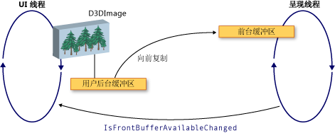

# WPF 和 Direct3D9 互操作WPF and Direct3D9 Interoperation
可以在 Windows Presentation Foundation (WPF) 应用程序中包含 Direct3D9 内容。You can include Direct3D9 content in a Windows Presentation Foundation (WPF) application. 本主题介绍如何创建 Direct3D9 内容，以便它有效地与 WPF 互操作。This topic describes how to create Direct3D9 content so that it efficiently interoperates with WPF.  
  
> [!NOTE]
>  在 WPF 中使用 Direct3D9 内容，还需要考虑到性能。When using Direct3D9 content in WPF, you also need to think about performance. 有关如何优化性能的详细信息，请参阅[Direct3D9 和 WPF 互操作性的性能注意事项](performance-considerations-for-direct3d9-and-wpf-interoperability.md)。For more information about how to optimize for performance, see [Performance Considerations for Direct3D9 and WPF Interoperability](performance-considerations-for-direct3d9-and-wpf-interoperability.md).  
  
## 显示缓冲区Display Buffers  
 <xref:System.Windows.Interop.D3DImage>类管理两个显示缓冲区，称为*后台缓冲区*并且*前台缓冲区*。The <xref:System.Windows.Interop.D3DImage> class manages two display buffers, which are called the *back buffer* and the *front buffer*. 后台缓冲区是 Direct3D9 图面。The back buffer is your Direct3D9 surface. 对后台缓冲区的更改复制前滚到前台缓冲区调用时<xref:System.Windows.Interop.D3DImage.Unlock%2A>方法。Changes to the back buffer are copied forward to the front buffer when you call the <xref:System.Windows.Interop.D3DImage.Unlock%2A> method.  
  
 下图显示后台缓冲区和前台缓冲区之间的关系。The following illustration shows the relationship between the back buffer and the front buffer.  
  
   
  
## 创建 Direct3D9 设备Direct3D9 Device Creation  
 若要呈现 Direct3D9 内容，必须创建 Direct3D9 设备。To render Direct3D9 content, you must create a Direct3D9 device. 有两个可用于创建设备的 Direct3D9 对象`IDirect3D9`和`IDirect3D9Ex`。There are two Direct3D9 objects that you can use to create a device, `IDirect3D9` and `IDirect3D9Ex`. 使用这些对象创建`IDirect3DDevice9`和`IDirect3DDevice9Ex`设备，分别。Use these objects to create `IDirect3DDevice9` and `IDirect3DDevice9Ex` devices, respectively.  
  
 通过调用以下方法之一创建一个设备。Create a device by calling one of the following methods.  
  
- `IDirect3D9 * Direct3DCreate9(UINT SDKVersion);`  
  
- `HRESULT Direct3DCreate9Ex(UINT SDKVersion, IDirect3D9Ex **ppD3D);`  
  
 在 Windows Vista 或更高版本操作系统上，使用`Direct3DCreate9Ex`与配置为使用 Windows 显示驱动程序模型 (WDDM) 显示的方法。On Windows Vista or later operating system, use the `Direct3DCreate9Ex` method with a display that is configured to use the Windows Display Driver Model (WDDM). 使用`Direct3DCreate9`任何其他平台上的方法。Use the `Direct3DCreate9` method on any other platform.  
  
### Direct3DCreate9Ex 方法的可用性Availability of the Direct3DCreate9Ex method  
 D3d9.dll 具有`Direct3DCreate9Ex`仅在 Windows Vista 或更高版本操作系统上的方法。The d3d9.dll has the `Direct3DCreate9Ex` method only on Windows Vista or later operating system. 如果直接链接在 Windows XP 上的函数，你的应用程序加载失败。If you directly link the function on Windows XP, your application fails to load. 若要确定是否`Direct3DCreate9Ex`支持方法、 加载 DLL 和查找进程的地址。To determine whether the `Direct3DCreate9Ex` method is supported, load the DLL and look for the proc address. 下面的代码演示如何为测试`Direct3DCreate9Ex`方法。The following code shows how to test for the `Direct3DCreate9Ex` method. 有关完整的代码示例，请参阅[演练：创建在 WPF 中承载的 Direct3D9 内容](walkthrough-creating-direct3d9-content-for-hosting-in-wpf.md)。For a full code example, see [Walkthrough: Creating Direct3D9 Content for Hosting in WPF](walkthrough-creating-direct3d9-content-for-hosting-in-wpf.md).  
  
 [!code-cpp[System.Windows.Interop.D3DImage#RendererManager_EnsureD3DObjects](~/samples/snippets/cpp/VS_Snippets_Wpf/System.Windows.Interop.D3DImage/cpp/renderermanager.cpp#renderermanager_ensured3dobjects)]  
  
### HWND 创建HWND Creation  
 创建设备需要 HWND。Creating a device requires an HWND. 一般情况下，您创建 Direct3D9 使用虚拟 HWND。In general, you create a dummy HWND for Direct3D9 to use. 下面的代码示例演示如何创建虚拟 HWND。The following code example shows how to create a dummy HWND.  
  
 [!code-cpp[System.Windows.Interop.D3DImage#RendererManager_EnsureHWND](~/samples/snippets/cpp/VS_Snippets_Wpf/System.Windows.Interop.D3DImage/cpp/renderermanager.cpp#renderermanager_ensurehwnd)]  
  
### 存在参数Present Parameters  
 创建设备还需要`D3DPRESENT_PARAMETERS`结构，但只有几个参数非常重要。Creating a device also requires a `D3DPRESENT_PARAMETERS` struct, but only a few parameters are important. 这些参数会选择最大程度减少内存占用量。These parameters are chosen to minimize the memory footprint.  
  
 设置`BackBufferHeight`和`BackBufferWidth`字段为 1。Set the `BackBufferHeight` and `BackBufferWidth` fields to 1. 将它们设置为 0 会导致它们被设置为该 HWND 的尺寸。Setting them to 0 causes them to be set to the dimensions of the HWND.  
  
 始终设置`D3DCREATE_MULTITHREADED`和`D3DCREATE_FPU_PRESERVE`标记以避免损坏了用于通过 Direct3D9 并防止 Direct3D9 更改 FPU 设置。Always set the `D3DCREATE_MULTITHREADED` and `D3DCREATE_FPU_PRESERVE` flags to prevent corrupting memory used by Direct3D9 and to prevent Direct3D9 from changing FPU settings.  
  
 下面的代码演示如何初始化`D3DPRESENT_PARAMETERS`结构。The following code shows how to initialize the `D3DPRESENT_PARAMETERS` struct.  
  
 [!code-cpp[System.Windows.Interop.D3DImage#Renderer_Init](~/samples/snippets/cpp/VS_Snippets_Wpf/System.Windows.Interop.D3DImage/cpp/renderer.cpp#renderer_init)]  
  
## 创建后台缓冲区呈现器目标Creating the Back Buffer Render Target  
 若要显示在 Direct3D9 内容<xref:System.Windows.Interop.D3DImage>，创建 Direct3D9 面并将其分配通过调用<xref:System.Windows.Interop.D3DImage.SetBackBuffer%2A>方法。To display Direct3D9 content in a <xref:System.Windows.Interop.D3DImage>, you create a Direct3D9 surface and assign it by calling the <xref:System.Windows.Interop.D3DImage.SetBackBuffer%2A> method.  
  
### 验证适配器支持Verifying Adapter Support  
 创建图面之前, 验证所有适配器都支持所需的图面属性。Before creating a surface, verify that all adapters support the surface properties you require. 即使您呈现到只有一个适配器，可能会在系统中任何适配器上显示 WPF 窗口。Even if you render to only one adapter, the WPF window may be displayed on any adapter in the system. 您应始终编写处理多适配器配置的 Direct3D9 代码和您应检查所有适配器的支持，因为 WPF 可能移动之间的可用适配器的图面。You should always write Direct3D9 code that handles multi-adapter configurations, and you should check all adapters for support, because WPF might move the surface among the available adapters.  
  
 下面的代码示例演示如何检查 Direct3D9 的系统上的所有适配器都支持。The following code example shows how to check all adapters on the system for Direct3D9 support.  
  
 [!code-cpp[System.Windows.Interop.D3DImage#RendererManager_TestSurfaceSettings](~/samples/snippets/cpp/VS_Snippets_Wpf/System.Windows.Interop.D3DImage/cpp/renderermanager.cpp#renderermanager_testsurfacesettings)]  
  
### 创建在图面Creating the Surface  
 创建图面之前, 请确认设备功能，在目标操作系统上支持良好的性能。Before creating a surface, verify that the device capabilities support good performance on the target operating system. 有关详细信息，请参阅[Direct3D9 和 WPF 互操作性的性能注意事项](performance-considerations-for-direct3d9-and-wpf-interoperability.md)。For more information, see [Performance Considerations for Direct3D9 and WPF Interoperability](performance-considerations-for-direct3d9-and-wpf-interoperability.md).  
  
 如果你已验证设备功能，可以创建在图面。When you have verified device capabilities, you can create the surface. 下面的代码示例演示如何创建呈现器目标。The following code example shows how to create the render target.  
  
 [!code-cpp[System.Windows.Interop.D3DImage#Renderer_CreateSurface](~/samples/snippets/cpp/VS_Snippets_Wpf/System.Windows.Interop.D3DImage/cpp/renderer.cpp#renderer_createsurface)]  
  
### WDDMWDDM  
 在 Windows Vista 和更高版本的操作系统，已配置为使用 WDDM，可以创建呈现器目标纹理，并将传递到在级别 0 面<xref:System.Windows.Interop.D3DImage.SetBackBuffer%2A>方法。On Windows Vista and later operating systems, which are configured to use the WDDM, you can create a render target texture and pass the level 0 surface to the <xref:System.Windows.Interop.D3DImage.SetBackBuffer%2A> method. 不建议使用此方法在 Windows XP 上因为不能创建可锁定的呈现目标纹理，并会降低性能。This approach is not recommended on Windows XP, because you cannot create a lockable render target texture and performance will be reduced.  
  
## 处理设备状态Handling Device State  
 <xref:System.Windows.Interop.D3DImage>类管理两个显示缓冲区，称为*后台缓冲区*并且*前台缓冲区*。The <xref:System.Windows.Interop.D3DImage> class manages two display buffers, which are called the *back buffer* and the *front buffer*. 后台缓冲区是 Direct3D 图面。The back buffer is your Direct3D surface.  对后台缓冲区的更改复制前滚到前台缓冲区调用时<xref:System.Windows.Interop.D3DImage.Unlock%2A>方法，其中显示在硬件。Changes to the back buffer are copied forward to the front buffer when you call the <xref:System.Windows.Interop.D3DImage.Unlock%2A> method, where it is displayed on the hardware. 有时，前台缓冲区变得不可用。Occasionally, the front buffer becomes unavailable. 缺乏可用性可能引起屏幕锁定、 全屏独占 Direct3D 应用程序、 用户切换或其他系统活动。This lack of availability can be caused by screen locking, full-screen exclusive Direct3D applications, user-switching, or other system activities. 在 WPF 应用程序时出现这种情况，通过处理通知<xref:System.Windows.Interop.D3DImage.IsFrontBufferAvailableChanged>事件。When this occurs, your WPF application is notified by handling the <xref:System.Windows.Interop.D3DImage.IsFrontBufferAvailableChanged> event.  你的应用程序到前台缓冲区变得不可用的响应方式取决于是否启用了 WPF 回退到软件呈现。How your application responds to the front buffer becoming unavailable depends on whether WPF is enabled to fall back to software rendering. <xref:System.Windows.Interop.D3DImage.SetBackBuffer%2A>方法具有一个重载采用一个参数，指定是否 WPF 回退到软件呈现。The <xref:System.Windows.Interop.D3DImage.SetBackBuffer%2A> method has an overload that takes a parameter that specifies whether WPF falls back to software rendering.  
  
 当您调用<xref:System.Windows.Interop.D3DImage.SetBackBuffer%28System.Windows.Interop.D3DResourceType%2CSystem.IntPtr%29>重载或调用<xref:System.Windows.Interop.D3DImage.SetBackBuffer%28System.Windows.Interop.D3DResourceType%2CSystem.IntPtr%2CSystem.Boolean%29>重载，并`enableSoftwareFallback`参数设置为`false`，呈现系统时前台缓冲区变得不可用和没有释放其对后台缓冲区的引用显示。When you call the <xref:System.Windows.Interop.D3DImage.SetBackBuffer%28System.Windows.Interop.D3DResourceType%2CSystem.IntPtr%29> overload or call the <xref:System.Windows.Interop.D3DImage.SetBackBuffer%28System.Windows.Interop.D3DResourceType%2CSystem.IntPtr%2CSystem.Boolean%29> overload with the `enableSoftwareFallback` parameter set to `false`, the rendering system releases its reference to the back buffer when the front buffer becomes unavailable and nothing is displayed. 呈现系统前台缓冲区再次可用时，会引发<xref:System.Windows.Interop.D3DImage.IsFrontBufferAvailableChanged>事件，以通知在 WPF 应用程序。When the front buffer is available again, the rendering system raises the <xref:System.Windows.Interop.D3DImage.IsFrontBufferAvailableChanged> event to notify your WPF application.  可以创建的事件处理程序<xref:System.Windows.Interop.D3DImage.IsFrontBufferAvailableChanged>重启再次使用有效的 Direct3D 图面呈现的事件。You can create an event handler for the <xref:System.Windows.Interop.D3DImage.IsFrontBufferAvailableChanged> event to restart rendering again with a valid Direct3D surface. 若要重新启动呈现，必须调用<xref:System.Windows.Interop.D3DImage.SetBackBuffer%2A>。To restart rendering, you must call <xref:System.Windows.Interop.D3DImage.SetBackBuffer%2A>.  
  
 当您调用<xref:System.Windows.Interop.D3DImage.SetBackBuffer%28System.Windows.Interop.D3DResourceType%2CSystem.IntPtr%2CSystem.Boolean%29>重载，并`enableSoftwareFallback`参数设置为`true`，呈现系统保留对后台缓冲区的引用时前台缓冲区变得不可用，因此无需调用<xref:System.Windows.Interop.D3DImage.SetBackBuffer%2A>时前面再次可用时缓冲区。When you call the <xref:System.Windows.Interop.D3DImage.SetBackBuffer%28System.Windows.Interop.D3DResourceType%2CSystem.IntPtr%2CSystem.Boolean%29> overload with the `enableSoftwareFallback` parameter set to `true`, the rendering system retains its reference to the back buffer when the front buffer becomes unavailable, so there is no need to call <xref:System.Windows.Interop.D3DImage.SetBackBuffer%2A> when the front buffer is available again.  
  
 当启用软件呈现时，可能存在的用户的设备变得不可用，但呈现系统将保留的引用的 Direct3D 图面。When software rendering is enabled, there may be situations where the user’s device becomes unavailable, but the rendering system retains a reference to the Direct3D surface. 若要检查的 Direct3D9 设备是否不可用，请调用`TestCooperativeLevel`方法。To check whether a Direct3D9 device is unavailable, call the `TestCooperativeLevel` method. 若要检查的 Direct3D9Ex 设备调用`CheckDeviceState`方法，因为`TestCooperativeLevel`方法已弃用，并始终返回成功。To check a Direct3D9Ex devices call the `CheckDeviceState` method, because the `TestCooperativeLevel` method is deprecated and always returns success. 如果用户设备已变为不可用，则调用<xref:System.Windows.Interop.D3DImage.SetBackBuffer%2A>释放对后台缓冲区的 WPF 的引用。If the user device has become unavailable, call <xref:System.Windows.Interop.D3DImage.SetBackBuffer%2A> to release WPF’s reference to the back buffer.  如果你需要重置你的设备，则调用<xref:System.Windows.Interop.D3DImage.SetBackBuffer%2A>与`backBuffer`参数设置为`null`，然后调用<xref:System.Windows.Interop.D3DImage.SetBackBuffer%2A>再次使用`backBuffer`设置为有效的 Direct3D 图面。If you need to reset your device, call <xref:System.Windows.Interop.D3DImage.SetBackBuffer%2A> with the `backBuffer` parameter set to `null`, and then call <xref:System.Windows.Interop.D3DImage.SetBackBuffer%2A> again with `backBuffer` set to a valid Direct3D surface.  
  
 调用`Reset`方法仅当实现多适配器支持从无效的设备中恢复。Call the `Reset` method to recover from an invalid device only if you implement multi-adapter support. 否则为释放所有 Direct3D9 接口并完全重新创建它们。Otherwise, release all Direct3D9 interfaces and re-create them completely. 如果适配器布局已发生更改，更改之前创建的 Direct3D9 对象不会更新。If the adapter layout has changed, Direct3D9 objects created before the change are not updated.  
  
## 处理调整大小Handling Resizing  
 如果<xref:System.Windows.Interop.D3DImage>将显示最适宜的分辨率以外其固有尺寸，则图像会根据当前<xref:System.Windows.Media.RenderOptions.BitmapScalingMode%2A>，只不过<xref:System.Windows.Media.Effects.SamplingMode.Bilinear>替换为<xref:System.Windows.Media.BitmapScalingMode.Fant>。If a <xref:System.Windows.Interop.D3DImage> is displayed at a resolution other than its native size, it is scaled according to the current <xref:System.Windows.Media.RenderOptions.BitmapScalingMode%2A>, except that <xref:System.Windows.Media.Effects.SamplingMode.Bilinear> is substituted for <xref:System.Windows.Media.BitmapScalingMode.Fant>.  
  
 如果需要更高的保真度，您必须创建一个新图面时的容器<xref:System.Windows.Interop.D3DImage>更改大小。If you require higher fidelity, you must create a new surface when the container of the <xref:System.Windows.Interop.D3DImage> changes size.  
  
 有三种方法可以处理调整大小。There are three possible approaches to handle resizing.  
  
- 参与布局系统时，并创建新的图面大小发生更改。Participate in the layout system and create a new surface when the size changes. 不要创建太多应用层，因为可能会用完可用抵或视频内存碎片。Do not create too many surfaces, because you may exhaust or fragment video memory.  
  
- 等待，直到固定时间内创建新的图面从未发生调整大小事件。Wait until a resize event has not occurred for a fixed period of time to create the new surface.  
  
- 创建<xref:System.Windows.Threading.DispatcherTimer>，用于检查每秒钟多次容器维度。Create a <xref:System.Windows.Threading.DispatcherTimer> that checks the container dimensions several times per second.  
  
## 多监视器优化Multi-monitor Optimization  
 呈现系统移动时，可能导致性能显著降低<xref:System.Windows.Interop.D3DImage>到另一个监视器。Significantly reduced performance can result when the rendering system moves a <xref:System.Windows.Interop.D3DImage> to another monitor.  
  
 在上 WDDM，只要这些监视器上相同的视频卡上，并使用`Direct3DCreate9Ex`，就不会在性能下降。On WDDM, as long as the monitors are on the same video card and you use `Direct3DCreate9Ex`, there is no reduction in performance. 如果监视器位于不同的视频卡上，性能会下降。If the monitors are on separate video cards, performance is reduced. 在 Windows XP 中，会始终会降低性能。On Windows XP, performance is always reduced.  
  
 当<xref:System.Windows.Interop.D3DImage>将移到另一个监视器，您可以创建新的图面上相应的适配器，以还原良好的性能。When the <xref:System.Windows.Interop.D3DImage> moves to another monitor, you can create a new surface on the corresponding adapter to restore good performance.  
  
 若要避免对性能产生影响，编写专门为多监视器情况的代码。To avoid the performance penalty, write code specifically for the multi-monitor case. 以下列表显示了一种方法来编写多监视器的代码。The following list shows one way to write multi-monitor code.  
  
1. 找到的一点<xref:System.Windows.Interop.D3DImage>中使用的屏幕空间`Visual.ProjectToScreen`方法。Find a point of the <xref:System.Windows.Interop.D3DImage> in screen space with the `Visual.ProjectToScreen` method.  
  
2. 使用`MonitorFromPoint`GDI 方法查找的监视器的显示该点。Use the `MonitorFromPoint` GDI method to find the monitor that is displaying the point.  
  
3. 使用`IDirect3D9::GetAdapterMonitor`法查找哪个 Direct3D9 适配器监视器已打开。Use the `IDirect3D9::GetAdapterMonitor` method to find which Direct3D9 adapter the monitor is on.  
  
4. 如果适配器不是与后台缓冲区的适配器相同，新的监视器上创建新的后台缓冲区，并将其分配给<xref:System.Windows.Interop.D3DImage>后台缓冲区。If the adapter is not the same as the adapter with the back buffer, create a new back buffer on the new monitor and assign it to the <xref:System.Windows.Interop.D3DImage> back buffer.  
  
> [!NOTE]
>  如果<xref:System.Windows.Interop.D3DImage>跨多台监视器，性能将会很慢，除非在 WDDM 的情况下和`IDirect3D9Ex`同一适配器上。If the <xref:System.Windows.Interop.D3DImage> straddles monitors, performance will be slow, except in the case of WDDM and `IDirect3D9Ex` on the same adapter. 没有方法在这种情况下提高性能。There is no way to improve performance in this situation.  
  
 下面的代码示例演示如何查找当前的监视器。The following code example shows how to find the current monitor.  
  
 [!code-cpp[System.Windows.Interop.D3DImage#RendererManager_SetAdapter](~/samples/snippets/cpp/VS_Snippets_Wpf/System.Windows.Interop.D3DImage/cpp/renderermanager.cpp#renderermanager_setadapter)]  
  
 更新监视器时<xref:System.Windows.Interop.D3DImage>容器的大小或位置更改或更新使用监视器`DispatcherTimer`每秒几次更新。Update the monitor when the <xref:System.Windows.Interop.D3DImage> container's size or position changes, or update the monitor by using a `DispatcherTimer` that updates a few times per second.  
  
## WPF 软件呈现WPF Software Rendering  
 在以下情况下的软件中的 UI 线程中的 WPF 呈现以同步方式。WPF renders synchronously on the UI thread in software in the following situations.  
  
- 打印Printing  
  
- <xref:System.Windows.Media.Effects.BitmapEffect>  
  
- <xref:System.Windows.Media.Imaging.RenderTargetBitmap>  
  
 当发生以下情况之一时，呈现系统调用<xref:System.Windows.Interop.D3DImage.CopyBackBuffer%2A>方法将复制到软件的硬件缓冲区。When one of these situations occurs, the rendering system calls the <xref:System.Windows.Interop.D3DImage.CopyBackBuffer%2A> method to copy the hardware buffer to software. 默认实现将调用`GetRenderTargetData`方法与您的图面。The default implementation calls the `GetRenderTargetData` method with your surface. 因为此调用发生在锁定/解锁模式之外，则可能会失败。Because this call occurs outside of the Lock/Unlock pattern, it may fail. 在这种情况下，`CopyBackBuffer`方法将返回`null`和不显示任何图像。In this case, the `CopyBackBuffer` method returns `null` and no image is displayed.  
  
 您可以重写<xref:System.Windows.Interop.D3DImage.CopyBackBuffer%2A>方法，调用基实现中，如果它返回`null`，可以返回占位符<xref:System.Windows.Media.Imaging.BitmapSource>。You can override the <xref:System.Windows.Interop.D3DImage.CopyBackBuffer%2A> method, call the base implementation, and if it returns `null`, you can return a placeholder <xref:System.Windows.Media.Imaging.BitmapSource>.  
  
 此外可以实现自己的软件呈现，而不是调用基实现。You can also implement your own software rendering instead of calling the base implementation.  
  
> [!NOTE]
>  如果在软件中，完全呈现 WPF<xref:System.Windows.Interop.D3DImage>没有显示，因为 WPF 没有前台缓冲区。If WPF is rendering completely in software, <xref:System.Windows.Interop.D3DImage> is not shown because WPF does not have a front buffer.  
  
## 请参阅See also

- <xref:System.Windows.Interop.D3DImage>
- [Direct3D9 和 WPF 互操作性的性能注意事项Performance Considerations for Direct3D9 and WPF Interoperability](performance-considerations-for-direct3d9-and-wpf-interoperability.md)
- [演练：创建在 WPF 中承载的 Direct3D9 内容Walkthrough: Creating Direct3D9 Content for Hosting in WPF](walkthrough-creating-direct3d9-content-for-hosting-in-wpf.md)
- [演练：在 WPF 中承载 Direct3D9 内容Walkthrough: Hosting Direct3D9 Content in WPF](walkthrough-hosting-direct3d9-content-in-wpf.md)
