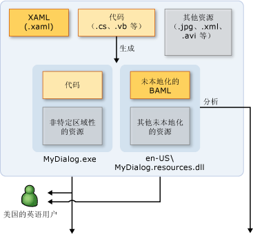
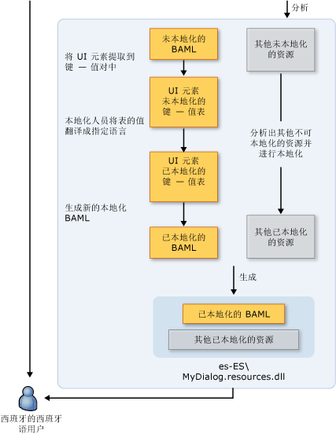

# WPF 全球化和本地化概述
当你将自己的产品限制为只能通过一种语言使用时，便将潜在的客户群限制为全球 65 亿人口中的一小部分。 如果想让自己的应用程序被全球用户所接受，那么对产品进行经济而有效的本地化将是赢得更多客户的最好、最经济的方法。  
  
 本文概述了全球化和本地化[!INCLUDE[TLA#tla_winclient](../../../../includes/tlasharptla-winclient-md.md)]。 全球化是指设计和开发在多个地点执行的应用程序。 例如，全球化支持适用于不同区域性用户的本地化用户界面和区域数据。 [!INCLUDE[TLA2#tla_winclient](../../../../includes/tla2sharptla-winclient-md.md)] 提供了全球化的设计功能，包括自动布局、 附属程序集和本地化的特性和注释。
  
 本地化是针对应用程序所支持的特定区域性将应用程序资源转换为本地化版本的过程。 当中进行本地化[!INCLUDE[TLA2#tla_winclient](../../../../includes/tla2sharptla-winclient-md.md)]，使用中的 Api<xref:System.Windows.Markup.Localizer>命名空间。 这些 Api 支持[LocBaml 工具示例](https://go.microsoft.com/fwlink/?LinkID=160016)命令行工具。 有关如何生成和使用 LocBaml 的信息，请参阅[本地化应用程序](../../../../docs/framework/wpf/advanced/how-to-localize-an-application.md)。    
  
## 在 WPF 中进行全球化和本地化的最佳做法  
 充分利用内置于的全球化和本地化功能[!INCLUDE[TLA2#tla_winclient](../../../../includes/tla2sharptla-winclient-md.md)]按照 UI 设计和本部分提供的本地化相关的技巧。  
  
### WPF UI 设计的最佳做法  
 设计时[!INCLUDE[TLA2#tla_winclient](../../../../includes/tla2sharptla-winclient-md.md)]– 基于[!INCLUDE[TLA2#tla_ui](../../../../includes/tla2sharptla-ui-md.md)]，请考虑实施这些最佳做法：  
  
-   编写你[!INCLUDE[TLA2#tla_ui](../../../../includes/tla2sharptla-ui-md.md)]中[!INCLUDE[TLA2#tla_xaml](../../../../includes/tla2sharptla-xaml-md.md)]; 避免创建[!INCLUDE[TLA2#tla_ui](../../../../includes/tla2sharptla-ui-md.md)]在代码中。 在创建时你[!INCLUDE[TLA2#tla_ui](../../../../includes/tla2sharptla-ui-md.md)]通过使用[!INCLUDE[TLA2#tla_xaml](../../../../includes/tla2sharptla-xaml-md.md)]，通过内置的本地化 Api 公开。  
  
-   避免使用绝对位置和固定的大小进行布局的内容;相反，使用相对或自动大小调整。
  
    -   使用<xref:System.Windows.Window.SizeToContent%2A>; 并将宽度和高度设置为`Auto`。  
  
    -   避免使用<xref:System.Windows.Controls.Canvas>布置[!INCLUDE[TLA2#tla_ui](../../../../includes/tla2sharptla-ui-md.md)]s。  
  
    -   使用<xref:System.Windows.Controls.Grid>及其大小共享功能。  
  
-   在边距中提供额外的空间，因为本地化文本通常需要更多空间。 额外空间为可能会延伸的字符预留了余地。  
  
-   启用<xref:System.Windows.Controls.TextBlock.TextWrapping%2A>上<xref:System.Windows.Controls.TextBlock>以避免剪裁。
  
-   设置**xml: lang**属性。 此属性描述特定元素及其子元素的区域性。 此属性的值更改中的许多功能的行为[!INCLUDE[TLA2#tla_winclient](../../../../includes/tla2sharptla-winclient-md.md)]。 例如，它可以更改断字、拼写检查、数字替换、复杂脚本成型和字体回退的行为。 请参阅[WPF 的全球化](../../../../docs/framework/wpf/advanced/globalization-for-wpf.md)有关设置的详细信息[xml: lang 处理在 XAML 中](../../../../docs/framework/xaml-services/xml-lang-handling-in-xaml.md)。  
  
-   创建自定义复合字体，以获取更好地控制用于不同语言的字体。 默认情况下，[!INCLUDE[TLA2#tla_winclient](../../../../includes/tla2sharptla-winclient-md.md)]使用 windows\fonts 目录中的 GlobalUserInterface.composite 字体。  
  
-   当创建导航应用程序可能本地化区域性中的显示的文本从右到左格式时，显式设置<xref:System.Windows.FlowDirection>的每个页，以确保页面不会继承<xref:System.Windows.FlowDirection>从<xref:System.Windows.Navigation.NavigationWindow>。  
  
-   创建托管浏览器之外的独立导航应用程序时，设置<xref:System.Windows.Application.StartupUri%2A>将初始应用程序<xref:System.Windows.Navigation.NavigationWindow>而不是到页面 (例如， `<Application StartupUri="NavigationWindow.xaml">`)。 此设计使您可以更改<xref:System.Windows.FlowDirection>窗口和导航栏。 有关详细信息和示例，请参阅[全球化主页示例](https://go.microsoft.com/fwlink/?LinkID=159990)。  
  
### WPF 本地化的最佳做法  
 进行本地化时[!INCLUDE[TLA2#tla_winclient](../../../../includes/tla2sharptla-winclient-md.md)]– 基于应用程序，请考虑实施下列最佳做法：  
  
-   使用本地化注释为本地化人员提供额外的上下文。  
  
-   使用本地化特性控制本地化，而不是选择性地省略<xref:System.Windows.Markup.Localizer.BamlLocalizableResourceKey.Uid%2A>元素上的属性。 请参阅[本地化特性和注释](../../../../docs/framework/wpf/advanced/localization-attributes-and-comments.md)有关详细信息。  
  
-   使用**msbuild /t: updateuid**并 **/t: checkuid**添加和检查<xref:System.Windows.Markup.Localizer.BamlLocalizableResourceKey.Uid%2A>中的属性在[!INCLUDE[TLA2#tla_xaml](../../../../includes/tla2sharptla-xaml-md.md)]。 使用<xref:System.Windows.Markup.Localizer.BamlLocalizableResourceKey.Uid%2A>属性，用于开发和本地化之间跟踪更改。 <xref:System.Windows.Markup.Localizer.BamlLocalizableResourceKey.Uid%2A> 属性可帮助您对新的开发更改进行本地化。 如果你手动添加<xref:System.Windows.Markup.Localizer.BamlLocalizableResourceKey.Uid%2A>属性设置为[!INCLUDE[TLA2#tla_ui](../../../../includes/tla2sharptla-ui-md.md)]，该任务是通常会比较繁重并且准确性较低。  
  
    -   请勿编辑或更改<xref:System.Windows.Markup.Localizer.BamlLocalizableResourceKey.Uid%2A>后开始进行本地化的属性。  
  
    -   不要使用重复<xref:System.Windows.Markup.Localizer.BamlLocalizableResourceKey.Uid%2A>属性 （使用复制和粘贴命令时，请记住此提示）。  
  
    -   设置`UltimateResourceFallback`assemblyinfo.* 若要指定合适的回退语言中的位置 (例如， `[assembly: NeutralResourcesLanguage("en-US",   UltimateResourceFallbackLocation.Satellite)]`)。  
  
         如果您决定通过省略主程序集中添加源语言`<UICulture>`在项目文件中标记中，设置`UltimateResourceFallback`与主程序集而不是附属项的位置 (例如， `[assembly: NeutralResourcesLanguage("en-US", UltimateResourceFallbackLocation.MainAssembly)]`)。  
  
   
## 对 WPF 应用程序进行本地化  
 进行本地化时[!INCLUDE[TLA2#tla_winclient](../../../../includes/tla2sharptla-winclient-md.md)]应用程序中，有几个选项。 例如，将可本地化资源绑定到应用程序中[!INCLUDE[TLA2#tla_xml](../../../../includes/tla2sharptla-xml-md.md)]文件，在 resx 表中存储可本地化的文本，或者让本地化人员使用[!INCLUDE[TLA#tla_xaml](../../../../includes/tlasharptla-xaml-md.md)]文件。 本部分介绍使用 XAML，可提供的好处的 BAML 形式的本地化工作流：  
  
-   可以在生成之后进行本地化。  
  
-   可以从较旧版本 XAML 的 BAML 形式更新到本地化的较新版本 XAML 的 BAML 形式，以便在开发的同时进行本地化。  
  
-   你可以验证原始源元素和语义在编译时由于 XAML 的 BAML 形式的已编译的形式[!INCLUDE[TLA2#tla_xaml](../../../../includes/tla2sharptla-xaml-md.md)]。  
  
### 本地化生成过程  
 开发时[!INCLUDE[TLA2#tla_winclient](../../../../includes/tla2sharptla-winclient-md.md)]应用程序中，本地化的生成过程如下所示：  
  
-   开发人员创建，并将其全球化[!INCLUDE[TLA2#tla_winclient](../../../../includes/tla2sharptla-winclient-md.md)]应用程序。 在项目文件中，开发人员设置`<UICulture>en-US</UICulture>`，以便编译应用程序时，会生成非特定于语言的主程序集。 此程序集具有一个附属 .resources.dll 文件，其中包含所有可本地化的资源。 （可选） 在主程序集中保留源语言，因为我们本地化[!INCLUDE[TLA2#tla_api#plural](../../../../includes/tla2sharptla-apisharpplural-md.md)]支持从主程序集进行提取。  
  
-   该文件编译为在生成时[!INCLUDE[TLA2#tla_xaml](../../../../includes/tla2sharptla-xaml-md.md)]转换为 XAML 的 BAML 形式。 区域性非特定`MyDialog.exe`和区域性相关 （英语）`MyDialog.resources.dll`向说英语的客户发布文件。  
  
### 本地化工作流  
 本地化过程开始后未本地化`MyDialog.resources.dll`生成文件。 [!INCLUDE[TLA2#tla_ui](../../../../includes/tla2sharptla-ui-md.md)]元素和属性在原始[!INCLUDE[TLA2#tla_xaml](../../../../includes/tla2sharptla-xaml-md.md)]通过使用从键-值对 XAML 的 BAML 形式提取[!INCLUDE[TLA2#tla_api#plural](../../../../includes/tla2sharptla-apisharpplural-md.md)]下<xref:System.Windows.Markup.Localizer>。 本地化人员使用键/值对来对应用程序进行本地化。 在本地化完成之后，可以从新值生成一个新的 .resource.dll。  
  
 键 / 值对的键是`x:Uid`位于由开发人员在原始值[!INCLUDE[TLA2#tla_xaml](../../../../includes/tla2sharptla-xaml-md.md)]。 这些`x:Uid`值启用[!INCLUDE[TLA2#tla_api](../../../../includes/tla2sharptla-api-md.md)]来跟踪和合并在本地化过程发生在开发人员和本地化人员之间的更改。 例如，如果开发人员更改[!INCLUDE[TLA2#tla_ui](../../../../includes/tla2sharptla-ui-md.md)]本地化人员开始进行本地化之后，可以合并将开发更改与已完成的本地化工作，以便使最小的翻译工作将丢失。  
  
 下图显示了一个基于 XAML 的 BAML 形式的典型本地化工作流。 此关系图假设开发人员以英语编写应用程序。 开发人员创建 WPF 应用程序并将其全球化。 在项目文件中，开发人员设置`<UICulture>en-US</UICulture>`，以便在生成，语言的非特定语言主程序集获取生成的附属项。 包含所有可本地化资源的 resources.dll。 或者，因为 WPF 本地化 API 支持从主程序集进行提取，所以还可以保留主程序集中的源语言。 生成过程结束之后，XAML 会编译为 BAML。 将向说英语的客户提供非特定区域性的 MyDialog.exe.resources.dll。  
  
   
  
   
  
   
## WPF 本地化示例  
 本部分包含本地化的应用程序，以帮助你了解如何生成和本地化示例[!INCLUDE[TLA2#tla_winclient](../../../../includes/tla2sharptla-winclient-md.md)]应用程序。  
  
#### “运行”对话框示例  
 下图显示的输出**运行**对话框示例。  
  
 **英语：**  
  
   
  
 **德语：**  
  
   
  
 **设计全球化“运行”对话框**  
  
 此示例将生成**运行**通过使用对话框[!INCLUDE[TLA2#tla_winclient](../../../../includes/tla2sharptla-winclient-md.md)]和[!INCLUDE[TLA2#tla_xaml](../../../../includes/tla2sharptla-xaml-md.md)]。 此对话框等效于**运行**对话框中，可从[!INCLUDE[TLA#tla_win](../../../../includes/tlasharptla-win-md.md)]开始菜单。  
  
 生成全球化对话框的一些要点包括：  
  
 **自动布局**  
  
 *在 Window1.xaml 中：*  
  
 `<Window SizeToContent="WidthAndHeight">`  
  
 以前的 Window 属性会根据内容大小自动调整窗口大小。 此属性可以防止窗口切断在本地化之后大小增加的内容；它还可以在内容由于本地化而大小减小时删除不必要的空格。  
  
 `<Grid x:Uid="Grid_1">`  
  
 <xref:System.Windows.Markup.Localizer.BamlLocalizableResourceKey.Uid%2A> 为了使所需属性[!INCLUDE[TLA2#tla_winclient](../../../../includes/tla2sharptla-winclient-md.md)]本地化[!INCLUDE[TLA2#tla_api#plural](../../../../includes/tla2sharptla-apisharpplural-md.md)]才能正常工作。  
  
 它们由[!INCLUDE[TLA2#tla_winclient](../../../../includes/tla2sharptla-winclient-md.md)]本地化[!INCLUDE[TLA2#tla_api#plural](../../../../includes/tla2sharptla-apisharpplural-md.md)]之间的开发和本地化的跟踪更改[!INCLUDE[TLA#tla_ui](../../../../includes/tlasharptla-ui-md.md)]。 <xref:System.Windows.Markup.Localizer.BamlLocalizableResourceKey.Uid%2A> 属性，你可以合并的较新版本[!INCLUDE[TLA2#tla_ui](../../../../includes/tla2sharptla-ui-md.md)]与较早本地化[!INCLUDE[TLA2#tla_ui](../../../../includes/tla2sharptla-ui-md.md)]。 您将添加<xref:System.Windows.Markup.Localizer.BamlLocalizableResourceKey.Uid%2A>属性通过运行**msbuild /t: updateuid RunDialog.csproj**命令行界面中。 这是添加的建议的方法<xref:System.Windows.Markup.Localizer.BamlLocalizableResourceKey.Uid%2A>属性因为手动添加它们是通常比较费时并且准确性较低。 你可以检查是否<xref:System.Windows.Markup.Localizer.BamlLocalizableResourceKey.Uid%2A>属性正确设置通过运行**msbuild /t: checkuid RunDialog.csproj**。  
  
 [!INCLUDE[TLA2#tla_ui](../../../../includes/tla2sharptla-ui-md.md)]通过使用结构化<xref:System.Windows.Controls.Grid>控件，它是针对如何利用自动布局非常有用的控件中[!INCLUDE[TLA2#tla_winclient](../../../../includes/tla2sharptla-winclient-md.md)]。 请注意，对话框拆分成三行五列。 没有一种行和列定义具有固定的大小;因此，[!INCLUDE[TLA2#tla_ui](../../../../includes/tla2sharptla-ui-md.md)]定位每个单元中的元素可以适应增加和减少的大小在本地化过程。  
  
 [!code-xaml[GlobalizationRunDialog#GridColumnDef](../../../../samples/snippets/csharp/VS_Snippets_Wpf/GlobalizationRunDialog/CS/Window1.xaml#gridcolumndef)]  
  
 前两列位置**打开：** 标签并<xref:System.Windows.Controls.ComboBox>放置的 10%[!INCLUDE[TLA2#tla_ui](../../../../includes/tla2sharptla-ui-md.md)]总宽度。  
  
 [!code-xaml[GlobalizationRunDialog#GridColumnDef2](../../../../samples/snippets/csharp/VS_Snippets_Wpf/GlobalizationRunDialog/CS/Window1.xaml#gridcolumndef2)]  
  
 请注意，该示例使用的共享大小调整功能<xref:System.Windows.Controls.Grid>。 最后三列通过将自身放置在同一个充分利用这<xref:System.Windows.Controls.DefinitionBase.SharedSizeGroup%2A>。 正如属性名称所示，此属性允许不同的列采用相同大小。 因此如果"浏览..."获取已本地化为较长的字符串"Durchsuchen..."，所有按钮都增加而不是让小型的"确定"按钮和一个极大的"Durchsuchen..."按钮的宽度。  
  
 **Xml:lang**  
  
 `Xml:lang="en-US"`  
  
 请注意[xml: lang 处理在 XAML 中](../../../../docs/framework/xaml-services/xml-lang-handling-in-xaml.md)放置在根元素处[!INCLUDE[TLA2#tla_ui](../../../../includes/tla2sharptla-ui-md.md)]。 此属性描述给定元素及其子元素的区域性。 此值由多个功能[!INCLUDE[TLA2#tla_winclient](../../../../includes/tla2sharptla-winclient-md.md)]，应在本地化过程相应地更改。 此值会更改在断字以及对字词进行拼写检查时所使用的字典。 它还会影响数字的显示以及字体回退系统选择所用字体的方式。 最后，该属性会影响数值的显示方式，形成在复杂脚本中编写文本的方式。 默认值为“en-US”。  
  
 **生成附属资源程序集**  
  
 *在 .csproj 中：*  
  
 `<UICulture>en-US</UICulture>`  
  
 请注意，增加的`UICulture`值。 当此项设置为有效<xref:System.Globalization.CultureInfo>值，如 EN-US，生成项目将在其中生成具有所有可本地化资源的附属程序集。  
  
 `<Resource Include="RunIcon.JPG">`  
  
 `<Localizable>False</Localizable>`  
  
 `</Resource>`  
  
 `RunIcon.JPG`不需要进行本地化，因为它应显示相同的所有区域性。 `Localizable` 设置为`false`，以便它将保留在语言非特定语言主程序集而不是附属程序集。 所有不可编译资源的默认值是`Localizable`设置为`true`。  
  
 **本地化“运行”对话框**  
  
 **分析**  
  
 生成应用程序之后，对其进行本地化的第一步是将可本地化的资源从附属程序集中分析出来。 对于本主题的目的，使用的示例 LocBaml 工具，可以在中找到[LocBaml 工具示例](https://go.microsoft.com/fwlink/?LinkID=160016)。 请注意，LocBaml 只是一个示例工具，用于帮助你了解有关如何生成适合你的本地化过程的本地化工具的入门知识。 使用 LocBaml 可以运行以下命令以分析： **LocBaml/rundialog.resources.dll /out:** 生成"RunDialog.resources.dll.CSV"文件。  
  
 **本地化**  
  
 使用你喜欢的支持 Unicode 的 CSV 编辑器来编辑此文件。 筛选掉本地化类别为“None”的所有项。 应看到下面的项：  
  
|资源键|本地化类别|“值”|  
|-|-|-| 
|Button_1:System.Windows.Controls.Button.$Content|Button|确定|  
|Button_2:System.Windows.Controls.Button.$Content|Button|取消|  
|Button_3:System.Windows.Controls.Button.$Content|Button|浏览...|  
|ComboBox_1:System.Windows.Controls.ComboBox.$Content|组合框||  
|TextBlock_1:System.Windows.Controls.TextBlock.$Content|Text|Windows 将根据您所输入的名称，为您打开相应的程序、文件夹、文档或 Internet 资源。|  
|TextBlock_2:System.Windows.Controls.TextBlock.$Content|Text|打开:|  
|Window_1:System.Windows.Window.Title|标题|运行|  
  
 将该应用程序本地化为德语版本需要进行下面的翻译：  
  
|资源键|本地化类别|“值”|  
|-|-|-| 
|Button_1:System.Windows.Controls.Button.$Content|Button|确定|  
|Button_2:System.Windows.Controls.Button.$Content|Button|Abbrechen|  
|Button_3:System.Windows.Controls.Button.$Content|Button|Durchsuchen…|  
|ComboBox_1:System.Windows.Controls.ComboBox.$Content|组合框||  
|TextBlock_1:System.Windows.Controls.TextBlock.$Content|Text|Geben Sie den Namen eines Programms, Ordners, Dokuments oder einer Internetresource an.|  
|TextBlock_2:System.Windows.Controls.TextBlock.$Content|Text|Öffnen:|  
|Window_1:System.Windows.Window.Title|标题|运行|  
  
 **生成**  
  
 本地化的最后一步涉及创建新进行本地化的附属程序集。 可以使用下面的 LocBaml 命令完成此操作：  
  
 **LocBaml.exe /generate RunDialog.resources.dll /trans:RunDialog.resources.dll.CSV /out: . /cul:de-DE**  
  
 在德语[!INCLUDE[TLA#tla_mswin](../../../../includes/tlasharptla-mswin-md.md)]，如果此 resources.dll 放置在主程序集旁边的 DE-DE 文件夹中，此资源会自动加载而不是 EN-US 文件夹中的一个。 如果没有德语版本的[!INCLUDE[TLA#tla_mswin](../../../../includes/tlasharptla-mswin-md.md)]若要测试这一点，请将区域性设置的任何区域性[!INCLUDE[TLA#tla_mswin](../../../../includes/tlasharptla-mswin-md.md)]使用 (即 EN-US)，并替换原始的 resources.dll。  
  
 **附属资源加载**  
  
|MyDialog.exe|en-US\MyDialog.resources.dll|de-DE\MyDialog.resources.dll|  
|------------------|------------------------------------|------------------------------------|  
|代码|原始英语版 BAML|本地化的 BAML|  
|非特定区域性资源|其他英语资源|已本地化为德语的其他资源|  
  
 .NET framework 会自动选择要加载根据应用程序的哪些附属资源程序集`Thread.CurrentThread.CurrentUICulture`。 此值默认为的区域性将[!INCLUDE[TLA#tla_mswin](../../../../includes/tlasharptla-mswin-md.md)]OS。 因此，如果您使用的德语[!INCLUDE[TLA#tla_mswin](../../../../includes/tlasharptla-mswin-md.md)]，则会加载 de-DE\MyDialog.resources.dll，如果您使用的英语[!INCLUDE[TLA#tla_mswin](../../../../includes/tlasharptla-mswin-md.md)]，则会加载 en-US\MyDialog.resources.dll。 通过在项目的 AssemblyInfo.* 中指定 NeutralResourcesLanguage，可以设置应用程序的最终回退资源。 例如，如果指定：  
  
 `[assembly: NeutralResourcesLanguage("en-US", UltimateResourceFallbackLocation.Satellite)]`  
  
 如果 de-DE\MyDialog.resources.dll 和 de\MyDialog.resources.dll 都不可用，则德语版 Windows 将使用 en-US\MyDialog.resources.dll。  
  
### Microsoft 沙特阿拉伯主页  
 下图显示了英语和阿拉伯语主页。 有关完整的示例生成这些图形，请参阅[全球化主页示例](https://go.microsoft.com/fwlink/?LinkID=159990)。  
  
 **英语：**  
  
   
  
 **阿拉伯语：**  
  
   
  
### 设计全球 Microsoft 主页  
 Microsoft 沙特阿拉伯网站的这个实体模型说明了针对从右向左布局语言提供的全球化功能。 希伯来语和阿拉伯语等语言具有从右到左阅读顺序，因此布局的[!INCLUDE[TLA2#tla_ui](../../../../includes/tla2sharptla-ui-md.md)]通常必须布局不是将英语等从左到右语言中，运行方式完全不同。 从从左到右布局语言本地化到从右到左布局语言可能相当困难，反之亦然。 [!INCLUDE[TLA2#tla_winclient](../../../../includes/tla2sharptla-winclient-md.md)] 可使此类本地化工作变得更容易。  
  
 **FlowDirection**  
  
 *Homepage.xaml:*  
  
 [!code-xaml[GlobalizationHomepage#Homepage](../../../../samples/snippets/csharp/VS_Snippets_Wpf/GlobalizationHomepage/CS/Homepage.xaml#homepage)]  
  
 请注意<xref:System.Windows.FrameworkElement.FlowDirection%2A>属性上的<xref:System.Windows.Controls.Page>。 更改此属性设置为<xref:System.Windows.FlowDirection.RightToLeft>将更改<xref:System.Windows.FrameworkElement.FlowDirection%2A>的<xref:System.Windows.Controls.Page>及其子元素，以便此布局[!INCLUDE[TLA2#tla_ui](../../../../includes/tla2sharptla-ui-md.md)]翻转成为从右到左，如所料，阿拉伯语用户。 一个可通过指定显式替代继承行为<xref:System.Windows.FrameworkElement.FlowDirection%2A>任何元素上。 <xref:System.Windows.FrameworkElement.FlowDirection%2A>属性是出现在任何<xref:System.Windows.FrameworkElement>或文档相关的元素并且具有隐式值<xref:System.Windows.FlowDirection.LeftToRight>。  
  
 观察，甚至背景渐变画笔了正确的翻转当根<xref:System.Windows.FrameworkElement.FlowDirection%2A>更改：  
  
 **FlowDirection="LeftToRight"**  
  
   
  
 **FlowDirection="RightToLeft"**  
  
   
  
 **避免对面板和控件使用固定维度**  
  
 请浏览 Homepage.xaml，注意，除了固定的宽度和高度指定的整个[!INCLUDE[TLA2#tla_ui](../../../../includes/tla2sharptla-ui-md.md)]在顶部<xref:System.Windows.Controls.DockPanel>，有其他固定的维度。 请勿使用固定尺寸，以防裁剪可能比源文本长的本地化文本。 [!INCLUDE[TLA2#tla_winclient](../../../../includes/tla2sharptla-winclient-md.md)] 面板和控件将根据其所包含的内容自动调整大小。 大多数控件还具有最小和最大尺寸，设置这些尺寸可以加强控制（例如 MinWidth= "20"）。 与<xref:System.Windows.Controls.Grid>，你还可以通过设置相对宽度和高度 * (例如 Width ="0.25\*") 或使用其单元格大小共享功能。  
  
 **本地化注释**  
  
 在很多情况下，内容可能不太明确，难以翻译。 开发人员或设计人员可通过本地化注释为本地化人员提供额外的上下文和注释。 例如，下面的 Localization.Comments 阐明了字符“|”的用法。  
  
 [!code-xaml[GlobalizationHomepage#LocalizationComment](../../../../samples/snippets/csharp/VS_Snippets_Wpf/GlobalizationHomepage/CS/Homepage.xaml#localizationcomment)]  
  
 此注释将成为与 TextBlock_1 的内容以及在使用 LocBaml 工具的情况下关联 (请参阅[本地化应用程序](../../../../docs/framework/wpf/advanced/how-to-localize-an-application.md))，可在输出.csv 文件的 TextBlock_1 行的第六列：  
  
|资源键|类别|可读性|可修改性|注释|“值”|  
|-|-|-|-|-|-|  
|TextBlock_1:System.Windows.Controls.TextBlock.$Content|Text|true|true|此字符用作装饰性规则。|&#124;|  
  
 使用下面的语法可以将注释放置在任何元素的内容或属性上：  
  
 [!code-xaml[GlobalizationHomepage#LocalizationCommentsProp](../../../../samples/snippets/csharp/VS_Snippets_Wpf/GlobalizationHomepage/CS/Homepage.xaml#localizationcommentsprop)]  
  
 **本地化特性**  
  
 通常，开发人员或本地化经理需要控制本地化人员能够阅读和修改的内容。 例如，可能不希望本地化人员翻译你公司的名称或法律用语。 [!INCLUDE[TLA2#tla_winclient](../../../../includes/tla2sharptla-winclient-md.md)] 提供了一些特性，使用这些特性可以设置元素的内容或属性（本地化工具可以使用这些内容或属性锁定、隐藏元素或对元素进行排序）的可读性、可修改性和类别。 有关详细信息，请参阅<xref:System.Windows.Localization.Attributes%2A>。 此示例中 LocBaml 工具仅输出这些特性的值。 [!INCLUDE[TLA2#tla_winclient](../../../../includes/tla2sharptla-winclient-md.md)] 控件对这些特性都使用默认值，但可以替代这些默认值。 例如，下面的示例重写的默认本地化特性`TextBlock_1`和为本地化人员设置的内容可读，但不可修改。  
  
 [!code-xaml[LocalizationComAtt#LocalizationAttributes](../../../../samples/snippets/csharp/VS_Snippets_Wpf/LocalizationComAtt/CSharp/Attributes.xaml#localizationattributes)]  
  
 除了可读性和可修改性特性之外[!INCLUDE[TLA2#tla_winclient](../../../../includes/tla2sharptla-winclient-md.md)]提供了常见 UI 类别的枚举 (<xref:System.Windows.LocalizationCategory>) 可用于为本地化人员提供更多上下文。 [!INCLUDE[TLA2#tla_winclient](../../../../includes/tla2sharptla-winclient-md.md)]中，可以重写平台控件的默认类别[!INCLUDE[TLA2#tla_xaml](../../../../includes/tla2sharptla-xaml-md.md)]以及：  
  
 [!code-xaml[LocalizationComAtt#LocalizationAttributesOverridden](../../../../samples/snippets/csharp/VS_Snippets_Wpf/LocalizationComAtt/CSharp/Attributes.xaml#localizationattributesoverridden)]  
  
 默认本地化特性[!INCLUDE[TLA2#tla_winclient](../../../../includes/tla2sharptla-winclient-md.md)]提供可以还通过代码进行替代，以便可以正确设置自定义控件的合适的默认值。 例如：  
  
 `[Localizability(Readability = Readability.Readable, Modifiability=Modifiability.Unmodifiable, LocalizationCategory.None)]`  
  
 `public class CorporateLogo: TextBlock`  
  
 `{`  
  
 `…`  
  
 `..`  
  
 `.`  
  
 `}`  
  
 实例中设置特定特性[!INCLUDE[TLA2#tla_xaml](../../../../includes/tla2sharptla-xaml-md.md)]将优先于自定义控件上的代码中设置的值。 有关特性和注释的详细信息，请参阅[本地化特性和注释](../../../../docs/framework/wpf/advanced/localization-attributes-and-comments.md)。  
  
 **字体回退和复合字体**  
  
 如果指定不支持给定的码位范围的字体[!INCLUDE[TLA2#tla_winclient](../../../../includes/tla2sharptla-winclient-md.md)]会自动回退到一个通过使用位于 windows\fonts 目录中的 Global User Interface.compositefont 来实现。 复合字体与任何其他字体的用法相同，通过设置元素的 FontFamily（例如 FontFamily= "Global User Interface"）可以显式使用复合字体。 通过创建你自己的复合字体并指定针对特定代码点范围和语言所使用的字体，可以指定你自己的字体回退首选项。  
  
 有关复合字体的详细信息请参阅<xref:System.Windows.Media.FontFamily>。  
  
 **本地化 Microsoft 主页**  
  
 可以按照“运行”对话框示例中的相同步骤对此应用程序进行本地化。 阿拉伯语的本地化的.csv 文件，供你在[全球化主页示例](https://go.microsoft.com/fwlink/?LinkID=159990)。
