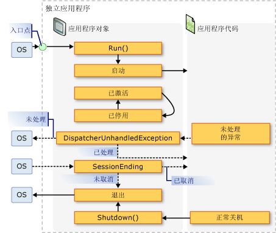
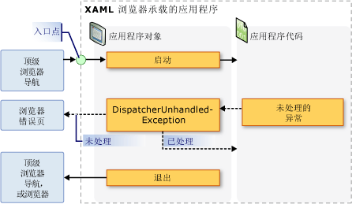

# <a name="application-management-overview"></a>应用程序管理概述
所有应用程序都可能会共享一组适用于实现和管理应用程序的常见功能。 本主题提供中的功能的概述<xref:System.Windows.Application>用于创建和管理应用程序的类。  
   
  
## <a name="the-application-class"></a>Application 类  
 在[!INCLUDE[TLA2#tla_wpf](../../../../includes/tla2sharptla-wpf-md.md)]，常见的应用程序范围的功能封装在<xref:System.Windows.Application>类。 <xref:System.Windows.Application>类包括以下功能：  
  
-   对应用程序的生存期进行跟踪并与之进行交互。  
  
-   检索和处理命令行参数。  
  
-   检测和响应未经处理的异常。  
  
-   共享应用程序范围的属性和资源。  
  
-   管理独立应用程序中的窗口。  
  
-   跟踪和管理导航。  
  
<a name="The_Application_Class"></a>   
## <a name="how-to-perform-common-tasks-using-the-application-class"></a>如何使用 Application 类执行常见任务  
 如果你不感兴趣的详细信息的所有<xref:System.Windows.Application>类下, 表列出了一些常见任务的<xref:System.Windows.Application>和如何完成它们。 通过查看相关的 API 和主题，可以找到详细信息和示例代码。  
  
|任务|方法|  
|----------|--------------|  
|获取表示当前应用程序的对象|使用 <xref:System.Windows.Application.Current%2A?displayProperty=nameWithType> 属性。|  
|将启动屏幕添加到应用程序中|请参阅[WPF 应用程序中添加初始屏幕](../../../../docs/framework/wpf/app-development/how-to-add-a-splash-screen-to-a-wpf-application.md)。|  
|启动应用程序|使用 <xref:System.Windows.Application.Run%2A?displayProperty=nameWithType> 方法。|  
|停止应用程序|使用<xref:System.Windows.Application.Shutdown%2A>方法<xref:System.Windows.Application.Current%2A?displayProperty=nameWithType>对象。|  
|从命令行获取参数|处理<xref:System.Windows.Application.Startup?displayProperty=nameWithType>事件并使用<xref:System.Windows.StartupEventArgs.Args%2A?displayProperty=nameWithType>属性。 有关示例，请参阅<xref:System.Windows.Application.Startup?displayProperty=nameWithType>事件。|  
|获取和设置应用程序退出代码|设置<xref:System.Windows.ExitEventArgs.ApplicationExitCode%2A?displayProperty=nameWithType>中的属性<xref:System.Windows.Application.Exit?displayProperty=nameWithType>事件处理程序或调用<xref:System.Windows.Application.Shutdown%2A>方法并传入一个整数。|  
|检测和响应未经处理的异常|处理<xref:System.Windows.Application.DispatcherUnhandledException>事件。|  
|获取和设置应用程序范围的资源|使用 <xref:System.Windows.Application.Resources%2A?displayProperty=nameWithType> 属性。|  
|使用应用程序范围的资源字典|请参阅[使用应用程序范围的资源字典](../../../../docs/framework/wpf/app-development/how-to-use-an-application-scope-resource-dictionary.md)。|  
|获取和设置应用程序范围的属性|使用 <xref:System.Windows.Application.Properties%2A?displayProperty=nameWithType> 属性。|  
|获取和保存应用程序的状态|请参阅[持久保存和还原应用程序作用域属性在应用程序会话之间](../../../../docs/framework/wpf/app-development/persist-and-restore-application-scope-properties.md)。|  
|管理非代码数据文件，包括资源文件、内容文件和源站点文件。|请参阅[WPF 应用程序资源、 内容和数据文件](../../../../docs/framework/wpf/app-development/wpf-application-resource-content-and-data-files.md)。|  
|管理独立应用程序中的窗口|请参阅 [WPF 窗口概述](../../../../docs/framework/wpf/app-development/wpf-windows-overview.md)。|  
|跟踪和管理导航|请参阅[导航概述](../../../../docs/framework/wpf/app-development/navigation-overview.md)。|  
  
<a name="The_Application_Definition"></a>   
## <a name="the-application-definition"></a>应用程序定义  
 若要使用的功能<xref:System.Windows.Application>类，则必须实现应用程序定义。 A[!INCLUDE[TLA2#tla_wpf](../../../../includes/tla2sharptla-wpf-md.md)]应用程序定义是派生自的类<xref:System.Windows.Application>并且配置了一种特殊[!INCLUDE[TLA#tla_msbuild](../../../../includes/tlasharptla-msbuild-md.md)]设置。  
  
### <a name="implementing-an-application-definition"></a>实现应用程序定义  
 典型[!INCLUDE[TLA2#tla_wpf](../../../../includes/tla2sharptla-wpf-md.md)]使用标记和代码隐藏实现应用程序定义。 因此，可以使用标记以声明方式设置应用程序的属性、资源和注册事件，同时还能处理事件并在代码隐藏中实现特定于应用程序的行为。  
  
 以下示例演示了如何使用标记和代码隐藏来实现应用程序定义：  
  
 [!code-xaml[ApplicationSnippets#ApplicationXAML](../../../../samples/snippets/csharp/VS_Snippets_Wpf/ApplicationSnippets/CSharp/App.xaml#applicationxaml)]  
  
 [!code-csharp[ApplicationSnippets#ApplicationCODEBEHIND](../../../../samples/snippets/csharp/VS_Snippets_Wpf/ApplicationSnippets/CSharp/App.xaml.cs#applicationcodebehind)]
 [!code-vb[ApplicationSnippets#ApplicationCODEBEHIND](../../../../samples/snippets/visualbasic/VS_Snippets_Wpf/ApplicationSnippets/visualbasic/application.xaml.vb#applicationcodebehind)]  
  
 要允许标记文件和代码隐藏文件协同工作，需要进行以下配置：  
  
-   在标记中，`Application`元素必须包含`x:Class`属性。 当生成应用程序，是否存在`x:Class`文件会导致在标记中[!INCLUDE[TLA2#tla_msbuild](../../../../includes/tla2sharptla-msbuild-md.md)]创建`partial`派生自的类<xref:System.Windows.Application>并具有指定名称`x:Class`属性。 这需要添加[!INCLUDE[TLA2#tla_xml](../../../../includes/tla2sharptla-xml-md.md)]命名空间声明[!INCLUDE[TLA2#tla_xaml](../../../../includes/tla2sharptla-xaml-md.md)]架构 ( `xmlns:x="http://schemas.microsoft.com/winfx/2006/xaml"` )。  
  
-   代码隐藏文件中的类必须`partial`类具有相同名称指定的`x:Class`属性在标记中，必须派生自<xref:System.Windows.Application>。 这样，要与之关联的代码隐藏文件`partial`时生成应用程序为标记文件生成的类 (请参阅[生成 WPF 应用程序](../../../../docs/framework/wpf/app-development/building-a-wpf-application-wpf.md))。  
  
> [!NOTE]
>  在创建新的 WPF 应用程序项目或 WPF 浏览器应用程序项目使用[!INCLUDE[TLA#tla_visualstu](../../../../includes/tlasharptla-visualstu-md.md)]，应用程序定义包含默认情况下，使用标记和代码隐藏定义。  
  
 至少要有这段代码，才能实现应用程序定义。 但是，其他[!INCLUDE[TLA2#tla_msbuild](../../../../includes/tla2sharptla-msbuild-md.md)]需要对之前生成并运行应用程序的应用程序定义配置。  
  
### <a name="configuring-the-application-definition-for-msbuild"></a>针对 MSBuild 配置应用程序定义  
 独立应用程序和[!INCLUDE[TLA#tla_xbap#plural](../../../../includes/tlasharptla-xbapsharpplural-md.md)]需要特定级别的基础结构的实现，才能运行。 在该基础结构中，入口点是最重要的一个部分。 当用户启动某个应用程序时，操作系统会调用入口点，这是一个为人熟知的应用程序启动函数。  
  
 通常，开发者需要自行编写其中的部分或全部代码（具体取决于所采用的技术）。 但是，[!INCLUDE[TLA2#tla_wpf](../../../../includes/tla2sharptla-wpf-md.md)]为您生成此代码，当你的应用程序定义的标记文件被配置为[!INCLUDE[TLA2#tla_msbuild](../../../../includes/tla2sharptla-msbuild-md.md)]`ApplicationDefinition`项，如在下面的示例所示[!INCLUDE[TLA2#tla_msbuild](../../../../includes/tla2sharptla-msbuild-md.md)]项目文件：  
  
```xml  
<Project   
  DefaultTargets="Build"  
                        xmlns="http://schemas.microsoft.com/developer/msbuild/2003">  
  ...  
  <ApplicationDefinition Include="App.xaml" />  
  <Compile Include="App.xaml.cs" />  
  ...  
</Project>  
```  
  
 原因代码隐藏文件包含代码，则将其标记为[!INCLUDE[TLA2#tla_msbuild](../../../../includes/tla2sharptla-msbuild-md.md)]`Compile`项，按原样正常。  
  
 这些应用程序[!INCLUDE[TLA2#tla_msbuild](../../../../includes/tla2sharptla-msbuild-md.md)]标记和代码隐藏文件的应用程序定义的配置导致[!INCLUDE[TLA2#tla_msbuild](../../../../includes/tla2sharptla-msbuild-md.md)]生成代码，如下所示：  
  
 [!code-csharp[AppDefAugSnippets#AppDefAugCODE1](../../../../samples/snippets/csharp/VS_Snippets_Wpf/AppDefAugSnippets/CSharp/App.cs#appdefaugcode1)]
 [!code-vb[AppDefAugSnippets#AppDefAugCODE1](../../../../samples/snippets/visualbasic/VS_Snippets_Wpf/AppDefAugSnippets/VisualBasic/App.vb#appdefaugcode1)]  
[!code-csharp[AppDefAugSnippets#AppDefAugCODE2](../../../../samples/snippets/csharp/VS_Snippets_Wpf/AppDefAugSnippets/CSharp/App.cs#appdefaugcode2)]
[!code-vb[AppDefAugSnippets#AppDefAugCODE2](../../../../samples/snippets/visualbasic/VS_Snippets_Wpf/AppDefAugSnippets/VisualBasic/App.vb#appdefaugcode2)]  
  
 生成的代码可以增强为应用程序定义与其他基础结构代码，其中包括入口点方法`Main`。 <xref:System.STAThreadAttribute>特性应用于`Main`方法，则指示主[!INCLUDE[TLA2#tla_ui](../../../../includes/tla2sharptla-ui-md.md)]线程[!INCLUDE[TLA2#tla_wpf](../../../../includes/tla2sharptla-wpf-md.md)]应用程序是一个 STA 线程，即需要[!INCLUDE[TLA2#tla_wpf](../../../../includes/tla2sharptla-wpf-md.md)]应用程序。 调用时，`Main`创建的新实例`App`之前调用`InitializeComponent`在标记中实现的方法来注册的事件和设置的属性。 因为`InitializeComponent`生成为你，你不需要显式调用`InitializeComponent`从应用程序定义一样<xref:System.Windows.Controls.Page>和<xref:System.Windows.Window>实现。 最后，<xref:System.Windows.Application.Run%2A>调用方法来启动应用程序。  
  
<a name="Getting_the_Current_Application"></a>   
## <a name="getting-the-current-application"></a>获取当前应用程序  
 因为的功能<xref:System.Windows.Application>类共享跨应用程序，可能存在的一个实例<xref:System.Windows.Application>每个类<xref:System.AppDomain>。 若要强制执行此操作，请<xref:System.Windows.Application>类实现为 singleton 类 (请参阅[实现 C# 中的单一实例](http://go.microsoft.com/fwlink/?LinkId=100567))，它创建其自身的单个实例，并提供对共享访问，它与`static` <xref:System.Windows.Application.Current%2A>属性。  
  
 下面的代码演示如何获取对引用<xref:System.Windows.Application>当前对象<xref:System.AppDomain>。  
  
 [!code-csharp[ApplicationManagementOverviewSnippets#GetCurrentAppCODE](../../../../samples/snippets/csharp/VS_Snippets_Wpf/ApplicationManagementOverviewSnippets/CSharp/MainWindow.xaml.cs#getcurrentappcode)]
 [!code-vb[ApplicationManagementOverviewSnippets#GetCurrentAppCODE](../../../../samples/snippets/visualbasic/VS_Snippets_Wpf/ApplicationManagementOverviewSnippets/VisualBasic/MainWindow.xaml.vb#getcurrentappcode)]  
  
 <xref:System.Windows.Application.Current%2A>返回的实例的引用<xref:System.Windows.Application>类。 如果你想对引用你<xref:System.Windows.Application>派生的类的值必须转换<xref:System.Windows.Application.Current%2A>属性，如下面的示例中所示。  
  
 [!code-csharp[ApplicationManagementOverviewSnippets#GetSTCurrentAppCODE](../../../../samples/snippets/csharp/VS_Snippets_Wpf/ApplicationManagementOverviewSnippets/CSharp/MainWindow.xaml.cs#getstcurrentappcode)]
 [!code-vb[ApplicationManagementOverviewSnippets#GetSTCurrentAppCODE](../../../../samples/snippets/visualbasic/VS_Snippets_Wpf/ApplicationManagementOverviewSnippets/VisualBasic/MainWindow.xaml.vb#getstcurrentappcode)]  
  
 你可以检查的值<xref:System.Windows.Application.Current%2A>生存期内随时<xref:System.Windows.Application>对象。 但是，检查时要小心。 后<xref:System.Windows.Application>实例化类时，没有段时间内的状态<xref:System.Windows.Application>对象不一致。 在此期间，<xref:System.Windows.Application>正在执行的各种的初始化任务所需的代码来运行，包括建立应用程序基础结构、 设置属性，以及注册事件。 如果你尝试使用<xref:System.Windows.Application>对象在此期间，你的代码可能具有意外的结果，尤其是当它依赖于各种<xref:System.Windows.Application>属性设置。  
  
 当<xref:System.Windows.Application>完成其初始化工作，其生存期内真正开始。  
  
<a name="Application_Lifetime"></a>   
## <a name="application-lifetime"></a>应用程序生存期  
 生存期[!INCLUDE[TLA2#tla_wpf](../../../../includes/tla2sharptla-wpf-md.md)]应用程序标记由通过引发的几个事件<xref:System.Windows.Application>让你知道你的应用程序启动时，何时激活和停用，并已关闭。  
  
  
<a name="Splash_Screen"></a>   
### <a name="splash-screen"></a>初始屏幕  
 从开始[!INCLUDE[net_v35SP1_short](../../../../includes/net-v35sp1-short-md.md)]，你可以指定要在启动窗口中，使用图像或*初始屏幕*。 <xref:System.Windows.SplashScreen>类可以轻松地加载你的应用程序时显示启动窗口。 <xref:System.Windows.SplashScreen>窗口将创建和显示之前<xref:System.Windows.Application.Run%2A>调用。 有关详细信息，请参阅[应用程序启动时间](../../../../docs/framework/wpf/advanced/application-startup-time.md)和[WPF 应用程序中添加初始屏幕](../../../../docs/framework/wpf/app-development/how-to-add-a-splash-screen-to-a-wpf-application.md)。  
  
<a name="Starting_an_Application"></a>   
### <a name="starting-an-application"></a>启动应用程序  
 后<xref:System.Windows.Application.Run%2A>称为和应用程序时初始化、 应用程序已准备好运行。 此刻表示当<xref:System.Windows.Application.Startup>引发事件：  
  
 [!code-csharp[ApplicationStartupSnippets#StartupCODEBEHIND1](../../../../samples/snippets/csharp/VS_Snippets_Wpf/ApplicationStartupSnippets/CSharp/App.xaml.cs#startupcodebehind1)]
 [!code-vb[ApplicationStartupSnippets#StartupCODEBEHIND1](../../../../samples/snippets/visualbasic/VS_Snippets_Wpf/ApplicationStartupSnippets/visualbasic/application.xaml.vb#startupcodebehind1)]  
[!code-csharp[ApplicationStartupSnippets#StartupCODEBEHIND2](../../../../samples/snippets/csharp/VS_Snippets_Wpf/ApplicationStartupSnippets/CSharp/App.xaml.cs#startupcodebehind2)]
[!code-vb[ApplicationStartupSnippets#StartupCODEBEHIND2](../../../../samples/snippets/visualbasic/VS_Snippets_Wpf/ApplicationStartupSnippets/visualbasic/application.xaml.vb#startupcodebehind2)]  
  
 在此点应用程序的生存期中，最常见的做法是以显示[!INCLUDE[TLA2#tla_ui](../../../../includes/tla2sharptla-ui-md.md)]。  
  
<a name="Showing_a_User_Interface"></a>   
### <a name="showing-a-user-interface"></a>显示用户界面  
 大多数独立[!INCLUDE[TLA2#tla_mswin](../../../../includes/tla2sharptla-mswin-md.md)]应用程序打开<xref:System.Windows.Window>它们是什么时候运行。 <xref:System.Windows.Application.Startup>事件处理程序是一个位置，从中你可以执行此操作，如以下代码所示。  
  
 [!code-xaml[AppShowWindowHardSnippets#StartupEventMARKUP](../../../../samples/snippets/csharp/VS_Snippets_Wpf/AppShowWindowHardSnippets/CSharp/App.xaml#startupeventmarkup)]  
  
 [!code-csharp[AppShowWindowHardSnippets#StartupEventCODEBEHIND](../../../../samples/snippets/csharp/VS_Snippets_Wpf/AppShowWindowHardSnippets/CSharp/App.xaml.cs#startupeventcodebehind)]
 [!code-vb[AppShowWindowHardSnippets#StartupEventCODEBEHIND](../../../../samples/snippets/visualbasic/VS_Snippets_Wpf/AppShowWindowHardSnippets/VisualBasic/Application.xaml.vb#startupeventcodebehind)]  
  
> [!NOTE]
>  第一个<xref:System.Windows.Window>要实例化在独立的应用程序变得主应用程序窗口默认情况下。 这<xref:System.Windows.Window>对象由引用<xref:System.Windows.Application.MainWindow%2A?displayProperty=nameWithType>属性。 值<xref:System.Windows.Application.MainWindow%2A>属性可以以编程方式更改，如果第一个不同的窗口实例化<xref:System.Windows.Window>应主窗口。  
  
 当[!INCLUDE[TLA2#tla_xbap](../../../../includes/tla2sharptla-xbap-md.md)]首次启动，它将很可能导航到<xref:System.Windows.Controls.Page>。 以下代码对此进行了演示。  
  
 [!code-xaml[XBAPAppStartupSnippets#StartupXBAPMARKUP](../../../../samples/snippets/csharp/VS_Snippets_Wpf/XBAPAppStartupSnippets/CSharp/App.xaml#startupxbapmarkup)]  
  
 [!code-csharp[XBAPAppStartupSnippets#StartupXBAPCODEBEHIND](../../../../samples/snippets/csharp/VS_Snippets_Wpf/XBAPAppStartupSnippets/CSharp/App.xaml.cs#startupxbapcodebehind)]
 [!code-vb[XBAPAppStartupSnippets#StartupXBAPCODEBEHIND](../../../../samples/snippets/visualbasic/VS_Snippets_Wpf/XBAPAppStartupSnippets/VisualBasic/Application.xaml.vb#startupxbapcodebehind)]  
  
 如果你处理<xref:System.Windows.Application.Startup>以便只打开<xref:System.Windows.Window>或导航到<xref:System.Windows.Controls.Page>，你可以设置`StartupUri`特性，在标记中。  
  
 下面的示例演示如何使用<xref:System.Windows.Application.StartupUri%2A>的独立应用程序，以打开<xref:System.Windows.Window>。  
  
 [!code-xaml[ApplicationManagementOverviewSnippets#OverviewStartupUriMARKUP](../../../../samples/snippets/csharp/VS_Snippets_Wpf/ApplicationManagementOverviewSnippets/CSharp/App.xaml#overviewstartupurimarkup)]  
  
 下面的示例演示如何使用<xref:System.Windows.Application.StartupUri%2A>从[!INCLUDE[TLA2#tla_xbap](../../../../includes/tla2sharptla-xbap-md.md)]以导航到<xref:System.Windows.Controls.Page>。  
  
 [!code-xaml[PageSnippets#XBAPStartupUriMARKUP](../../../../samples/snippets/csharp/VS_Snippets_Wpf/PageSnippets/CSharp/App.xaml#xbapstartupurimarkup)]  
  
 此标记的效果等同于用于打开窗口的上一段代码。  
  
> [!NOTE]
>  导航窗格的详细信息，请参阅[导航概述](../../../../docs/framework/wpf/app-development/navigation-overview.md)。  
  
 你需要处理<xref:System.Windows.Application.Startup>事件以打开<xref:System.Windows.Window>如果你需要使用非默认构造函数，其进行实例化或你需要设置其属性或订阅其事件之前显示它，或需要处理任何命令行参数，当启动应用程序时提供。  
  
<a name="Processing_Command_Line_Arguments"></a>   
### <a name="processing-command-line-arguments"></a>处理命令行参数  
 在[!INCLUDE[TLA2#tla_mswin](../../../../includes/tla2sharptla-mswin-md.md)]，可以从命令提示符或桌面启动独立应用程序。 在这两种情况下，命令行参数都可以传递至应用程序。 以下示例展示了一个通过单个命令行参数“/StartMinimized”来启动的应用程序：  
  
 `wpfapplication.exe /StartMinimized`  
  
 在应用程序初始化期间[!INCLUDE[TLA2#tla_wpf](../../../../includes/tla2sharptla-wpf-md.md)]检索从操作系统的命令行自变量并将它们传递到<xref:System.Windows.Application.Startup>事件处理程序通过<xref:System.Windows.StartupEventArgs.Args%2A>属性<xref:System.Windows.StartupEventArgs>参数。 可以使用如下代码来检索和存储命令行参数。  
  
 [!code-xaml[ApplicationStartupSnippets#HandleStartupXAML](../../../../samples/snippets/csharp/VS_Snippets_Wpf/ApplicationStartupSnippets/CSharp/App.xaml#handlestartupxaml)]  
  
 [!code-csharp[ApplicationStartupSnippets#HandleStartupCODEBEHIND](../../../../samples/snippets/csharp/VS_Snippets_Wpf/ApplicationStartupSnippets/CSharp/App.xaml.cs#handlestartupcodebehind)]
 [!code-vb[ApplicationStartupSnippets#HandleStartupCODEBEHIND](../../../../samples/snippets/visualbasic/VS_Snippets_Wpf/ApplicationStartupSnippets/visualbasic/application.xaml.vb#handlestartupcodebehind)]  
  
 这段代码处理<xref:System.Windows.Application.Startup>以检查是否**/StartMinimized**提供命令行自变量; 如果是这样，它将打开主窗口中的以<xref:System.Windows.WindowState>的<xref:System.Windows.WindowState.Minimized>。 请注意，因为<xref:System.Windows.Window.WindowState%2A>必须以编程方式设置主属性<xref:System.Windows.Window>必须在代码中显式打开。  
  
 [!INCLUDE[TLA2#tla_xbap#plural](../../../../includes/tla2sharptla-xbapsharpplural-md.md)]无法检索和处理命令行自变量，因为程序启动时使用[!INCLUDE[TLA#tla_clickonce](../../../../includes/tlasharptla-clickonce-md.md)]部署 (请参阅[部署的 WPF 应用](../../../../docs/framework/wpf/app-development/deploying-a-wpf-application-wpf.md))。 但是，它们可以检索和处理来自用于启动它们的 URL 的查询字符串参数。  
  
<a name="Application_Activation_and_Deactivation"></a>   
### <a name="application-activation-and-deactivation"></a>应用程序激活和停用  
 [!INCLUDE[TLA2#tla_mswin](../../../../includes/tla2sharptla-mswin-md.md)] 允许用户在应用程序间切换。 最常见的方法是使用 ALT + TAB 键组合。 仅将应用程序切换到，如果它具有可见<xref:System.Windows.Window>，用户可选择。 当前所选<xref:System.Windows.Window>是*活动窗口*(也称为*前景窗口*) 且<xref:System.Windows.Window>接收用户输入。 活动窗口的应用程序是*活动应用程序*(或*前台应用程序*)。 应用程序会在以下情况下变为活动应用程序：  
  
-   它将启动并显示<xref:System.Windows.Window>。  
  
-   用户通过选择从另一个应用程序切换<xref:System.Windows.Window>应用程序中。  
  
 你可以检测应用程序通过处理变为活动状态时<xref:System.Windows.Application.Activated?displayProperty=nameWithType>事件。  
  
 同样地，应用程序会在以下情况下变为非活动状态：  
  
-   用户从当前应用程序切换到另一应用程序。  
  
-   应用程序关闭后。  
  
 你可以检测在应用程序通过处理变为非活动状态时<xref:System.Windows.Application.Deactivated?displayProperty=nameWithType>事件。  
  
 下面的代码演示如何处理<xref:System.Windows.Application.Activated>和<xref:System.Windows.Application.Deactivated>事件，以确定应用程序是否处于活动状态。  
  
 [!code-xaml[ApplicationActivationSnippets#DetectActivationStateXAML](../../../../samples/snippets/csharp/VS_Snippets_Wpf/ApplicationActivationSnippets/CSharp/App.xaml#detectactivationstatexaml)]  
  
 [!code-csharp[ApplicationActivationSnippets#DetectActivationStateCODEBEHIND](../../../../samples/snippets/csharp/VS_Snippets_Wpf/ApplicationActivationSnippets/CSharp/App.xaml.cs#detectactivationstatecodebehind)]
 [!code-vb[ApplicationActivationSnippets#DetectActivationStateCODEBEHIND](../../../../samples/snippets/visualbasic/VS_Snippets_Wpf/ApplicationActivationSnippets/visualbasic/application.xaml.vb#detectactivationstatecodebehind)]  
  
 A<xref:System.Windows.Window>还可以激活和停用。 有关更多信息，请参见<xref:System.Windows.Window.Activated?displayProperty=nameWithType>和<xref:System.Windows.Window.Deactivated?displayProperty=nameWithType>。  
  
> [!NOTE]
>  既不<xref:System.Windows.Application.Activated?displayProperty=nameWithType>也不<xref:System.Windows.Application.Deactivated?displayProperty=nameWithType>为引发[!INCLUDE[TLA2#tla_xbap#plural](../../../../includes/tla2sharptla-xbapsharpplural-md.md)]。  
  
<a name="Application_Shutdown"></a>   
### <a name="application-shutdown"></a>应用程序关闭  
 应用程序的生存期会在其关闭时结束，出现这一情况可能是因为：  
  
-   用户关闭每个<xref:System.Windows.Window>。  
  
-   用户关闭主<xref:System.Windows.Window>。  
  
-   用户结束[!INCLUDE[TLA2#tla_mswin](../../../../includes/tla2sharptla-mswin-md.md)]通过注销或关闭的会话。  
  
-   满足了特定于应用程序的条件。  
  
 若要帮助你管理应用程序关闭<xref:System.Windows.Application>提供<xref:System.Windows.Application.Shutdown%2A>方法，<xref:System.Windows.Application.ShutdownMode%2A>属性，与<xref:System.Windows.Application.SessionEnding>和<xref:System.Windows.Application.Exit>事件。  
  
> [!NOTE]
>  <xref:System.Windows.Application.Shutdown%2A>仅可以从具有应用程序调用<xref:System.Security.Permissions.UIPermission>。 独立[!INCLUDE[TLA2#tla_wpf](../../../../includes/tla2sharptla-wpf-md.md)]应用程序始终具有此权限。 但是，[!INCLUDE[TLA2#tla_xbap#plural](../../../../includes/tla2sharptla-xbapsharpplural-md.md)]在 Internet 区域部分信任安全沙箱中运行不这样做。  
  
#### <a name="shutdown-mode"></a>关闭模式  
 大多数应用程序会在所有窗口都关闭后或在主窗口关闭后关闭。 但是，有时，应用程序会在何时关闭取决于特定于应用程序的其他条件。 你可以指定在其下你的应用程序将关闭的情况下通过设置的条件<xref:System.Windows.Application.ShutdownMode%2A>与以下项之一<xref:System.Windows.ShutdownMode>枚举值：  
  
-   <xref:System.Windows.ShutdownMode.OnLastWindowClose>  
  
-   <xref:System.Windows.ShutdownMode.OnMainWindowClose>  
  
-   <xref:System.Windows.ShutdownMode.OnExplicitShutdown>  
  
 默认值<xref:System.Windows.Application.ShutdownMode%2A>是<xref:System.Windows.ShutdownMode.OnLastWindowClose>，这意味着应用程序时自动关闭用户关闭应用程序中的最后一个窗口。 但是，如果你的应用程序，应关闭主窗口关闭时，[!INCLUDE[TLA2#tla_wpf](../../../../includes/tla2sharptla-wpf-md.md)]自动执行，如果你设置<xref:System.Windows.Application.ShutdownMode%2A>到<xref:System.Windows.ShutdownMode.OnMainWindowClose>。 这在下面的示例中显示。  
  
 [!code-xaml[ApplicationShutdownModeSnippets#OnMainWindowCloseMARKUP](../../../../samples/snippets/csharp/VS_Snippets_Wpf/ApplicationShutdownModeSnippets/CS/Page1.xaml#onmainwindowclosemarkup)]  
  
 当你有特定于应用程序关闭条件时，您设置<xref:System.Windows.Application.ShutdownMode%2A>到<xref:System.Windows.ShutdownMode.OnExplicitShutdown>。 在这种情况下，它是你有责任关闭应用程序的情况下通过显式调用<xref:System.Windows.Application.Shutdown%2A>方法; 否则，你的应用程序将继续运行即使关闭所有的窗口。 请注意，<xref:System.Windows.Application.Shutdown%2A>时隐式调用<xref:System.Windows.Application.ShutdownMode%2A>是<xref:System.Windows.ShutdownMode.OnLastWindowClose>或<xref:System.Windows.ShutdownMode.OnMainWindowClose>。  
  
> [!NOTE]
>  <xref:System.Windows.Application.ShutdownMode%2A>可以设置从[!INCLUDE[TLA2#tla_xbap](../../../../includes/tla2sharptla-xbap-md.md)]，但它将被忽略;[!INCLUDE[TLA2#tla_xbap](../../../../includes/tla2sharptla-xbap-md.md)]始终关闭的情况下在浏览器中，或浏览器承载导航离开时[!INCLUDE[TLA2#tla_xbap](../../../../includes/tla2sharptla-xbap-md.md)]已关闭。 有关详细信息，请参阅[导航概述](../../../../docs/framework/wpf/app-development/navigation-overview.md)。  
  
#### <a name="session-ending"></a>会话结束  
 描述了关闭条件<xref:System.Windows.Application.ShutdownMode%2A>属性是特定于应用程序。 不过，在某些情况下，应用程序可能会因外部条件而关闭。 用户结束时发生的最常见的外部条件[!INCLUDE[TLA2#tla_mswin](../../../../includes/tla2sharptla-mswin-md.md)]会话通过执行以下操作：  
  
-   注销  
  
-   关闭  
  
-   重新启动  
  
-   休眠  
  
 若要检测[!INCLUDE[TLA2#tla_mswin](../../../../includes/tla2sharptla-mswin-md.md)]会话结束，你可以处理<xref:System.Windows.Application.SessionEnding>事件，如下面的示例中所示。  
  
 [!code-xaml[ApplicationSessionEndingSnippets#HandlingSessionEndingXAML](../../../../samples/snippets/csharp/VS_Snippets_Wpf/ApplicationSessionEndingSnippets/CSharp/App.xaml#handlingsessionendingxaml)]  
  
 [!code-csharp[ApplicationSessionEndingSnippets#HandlingSessionEndingCODEBEHIND](../../../../samples/snippets/csharp/VS_Snippets_Wpf/ApplicationSessionEndingSnippets/CSharp/App.xaml.cs#handlingsessionendingcodebehind)]
 [!code-vb[ApplicationSessionEndingSnippets#HandlingSessionEndingCODEBEHIND](../../../../samples/snippets/visualbasic/VS_Snippets_Wpf/ApplicationSessionEndingSnippets/visualbasic/application.xaml.vb#handlingsessionendingcodebehind)]  
  
 在此示例中，代码检查<xref:System.Windows.SessionEndingCancelEventArgs.ReasonSessionEnding%2A>属性来确定如何[!INCLUDE[TLA2#tla_mswin](../../../../includes/tla2sharptla-mswin-md.md)]结束会话。 它会根据该值向用户显示确认消息。 如果用户不希望会话结束，该代码将设置<xref:System.ComponentModel.CancelEventArgs.Cancel%2A>到`true`以防止[!INCLUDE[TLA2#tla_mswin](../../../../includes/tla2sharptla-mswin-md.md)]从结束的会话。  
  
> [!NOTE]
>  <xref:System.Windows.Application.SessionEnding>不会引发[!INCLUDE[TLA2#tla_xbap#plural](../../../../includes/tla2sharptla-xbapsharpplural-md.md)]。  
  
#### <a name="exit"></a>Exit  
 应用程序在关闭时可能需要执行一些最终处理，如保持应用程序状态。 对于这些情况下，你就可以处理<xref:System.Windows.Application.Exit>事件。  
  
 [!code-xaml[HOWTOApplicationModelSnippets#PersistRestoreAppScopePropertiesXAML1](../../../../samples/snippets/csharp/VS_Snippets_Wpf/HOWTOApplicationModelSnippets/CSharp/App.xaml#persistrestoreappscopepropertiesxaml1)]  
[!code-xaml[HOWTOApplicationModelSnippets#PersistRestoreAppScopePropertiesXAML2](../../../../samples/snippets/csharp/VS_Snippets_Wpf/HOWTOApplicationModelSnippets/CSharp/App.xaml#persistrestoreappscopepropertiesxaml2)]  
  
 [!code-csharp[HOWTOApplicationModelSnippets#PersistAppScopePropertiesCODEBEHIND1](../../../../samples/snippets/csharp/VS_Snippets_Wpf/HOWTOApplicationModelSnippets/CSharp/App.xaml.cs#persistappscopepropertiescodebehind1)]
 [!code-vb[HOWTOApplicationModelSnippets#PersistAppScopePropertiesCODEBEHIND1](../../../../samples/snippets/visualbasic/VS_Snippets_Wpf/HOWTOApplicationModelSnippets/visualbasic/application.xaml.vb#persistappscopepropertiescodebehind1)]  
[!code-csharp[HOWTOApplicationModelSnippets#PersistAppScopePropertiesCODEBEHIND2](../../../../samples/snippets/csharp/VS_Snippets_Wpf/HOWTOApplicationModelSnippets/CSharp/App.xaml.cs#persistappscopepropertiescodebehind2)]
[!code-vb[HOWTOApplicationModelSnippets#PersistAppScopePropertiesCODEBEHIND2](../../../../samples/snippets/visualbasic/VS_Snippets_Wpf/HOWTOApplicationModelSnippets/visualbasic/application.xaml.vb#persistappscopepropertiescodebehind2)]  
  
 有关完整示例，请参阅[保留和还原应用程序作用域属性跨应用程序会话](../../../../docs/framework/wpf/app-development/persist-and-restore-application-scope-properties.md)。  
  
 <xref:System.Windows.Application.Exit>可以由两个独立应用程序和[!INCLUDE[TLA2#tla_xbap#plural](../../../../includes/tla2sharptla-xbapsharpplural-md.md)]。 有关[!INCLUDE[TLA2#tla_xbap#plural](../../../../includes/tla2sharptla-xbapsharpplural-md.md)]，<xref:System.Windows.Application.Exit>时在以下情况下引发：  
  
-   [!INCLUDE[TLA2#tla_xbap](../../../../includes/tla2sharptla-xbap-md.md)]离开。  
  
-   在[!INCLUDE[TLA2#tla_ie7](../../../../includes/tla2sharptla-ie7-md.md)]，当选项卡承载[!INCLUDE[TLA2#tla_xbap](../../../../includes/tla2sharptla-xbap-md.md)]已关闭。  
  
-   关闭浏览器时。  
  
#### <a name="exit-code"></a>退出代码  
 在大多数情况下，应用程序由操作系统根据用户的请求来启动。 但是，应用程序也可由另一应用程序启动，以执行某项特定任务。 当被启动的应用程序关闭时，执行启动操作的应用程序可能想要了解导致被启动应用程序关闭的条件。 在这些情况下，[!INCLUDE[TLA2#tla_mswin](../../../../includes/tla2sharptla-mswin-md.md)]允许应用程序在关闭返回应用程序退出代码。 默认情况下，[!INCLUDE[TLA2#tla_wpf](../../../../includes/tla2sharptla-wpf-md.md)]应用程序返回的退出代码值为 0。  
  
> [!NOTE]
>  当你调试从[!INCLUDE[TLA2#tla_visualstu](../../../../includes/tla2sharptla-visualstu-md.md)]，应用程序退出代码所示**输出**窗口应用程序关闭时，将类似于以下的消息中：  
>   
>  `The program '[5340] AWPFApp.vshost.exe: Managed' has exited with code 0 (0x0).`  
>   
>  打开**输出**通过单击窗口**输出**上**视图**菜单。  
  
 若要更改的退出代码，你可以调用<xref:System.Windows.Application.Shutdown%28System.Int32%29>超负荷运转，这样便可以接受整数自变量为退出代码：  
  
 [!code-csharp[ApplicationExitSnippets#AppExitCODE](../../../../samples/snippets/csharp/VS_Snippets_Wpf/ApplicationExitSnippets/CSharp/MainWindow.xaml.cs#appexitcode)]
 [!code-vb[ApplicationExitSnippets#AppExitCODE](../../../../samples/snippets/visualbasic/VS_Snippets_Wpf/ApplicationExitSnippets/visualbasic/mainwindow.xaml.vb#appexitcode)]  
  
 你可以检测的值，退出代码，并更改它，处理<xref:System.Windows.Application.Exit>事件。 <xref:System.Windows.Application.Exit>事件处理程序传递<xref:System.Windows.ExitEventArgs>它提供了访问的退出代码与<xref:System.Windows.ExitEventArgs.ApplicationExitCode%2A>属性。 有关详细信息，请参阅<xref:System.Windows.Application.Exit>。  
  
> [!NOTE]
>  你可以在两个独立应用程序中设置的退出代码和[!INCLUDE[TLA2#tla_xbap#plural](../../../../includes/tla2sharptla-xbapsharpplural-md.md)]。 但是，退出代码值对于，将忽略[!INCLUDE[TLA2#tla_xbap#plural](../../../../includes/tla2sharptla-xbapsharpplural-md.md)]。  
  
<a name="Unhandled_Exceptions"></a>   
### <a name="unhandled-exceptions"></a>未经处理的异常  
 有时，应用程序可能会在异常条件下关闭，如引发意外异常时。 在这种情况下，应用程序可能没有可用于检测和处理异常的代码。 这类异常就是未经处理的异常；应用程序会在关闭之前显示一个与下图所示内容类似的通知。  
  
   
  
 从用户体验的角度来看，应用程序最好通过执行以下部分或全部操作来避免这种默认行为：  
  
-   显示对用户友好的信息。  
  
-   尝试让应用程序保持运行。  
  
-   录制中的详细、 开发人员友好异常信息[!INCLUDE[TLA2#tla_mswin](../../../../includes/tla2sharptla-mswin-md.md)]事件日志。  
  
 实现此支持取决于是否能够检测到未经处理的异常，这是什么<xref:System.Windows.Application.DispatcherUnhandledException>为引发事件。  
  
 [!code-xaml[ApplicationDispatcherUnhandledExceptionSnippets#HandleDispatcherUnhandledExceptionXAML](../../../../samples/snippets/csharp/VS_Snippets_Wpf/ApplicationDispatcherUnhandledExceptionSnippets/CSharp/App.xaml#handledispatcherunhandledexceptionxaml)]  
  
 [!code-csharp[ApplicationDispatcherUnhandledExceptionSnippets#HandleDispatcherUnhandledExceptionCODEBEHIND1](../../../../samples/snippets/csharp/VS_Snippets_Wpf/ApplicationDispatcherUnhandledExceptionSnippets/CSharp/App.xaml.cs#handledispatcherunhandledexceptioncodebehind1)]
 [!code-vb[ApplicationDispatcherUnhandledExceptionSnippets#HandleDispatcherUnhandledExceptionCODEBEHIND1](../../../../samples/snippets/visualbasic/VS_Snippets_Wpf/ApplicationDispatcherUnhandledExceptionSnippets/visualbasic/application.xaml.vb#handledispatcherunhandledexceptioncodebehind1)]  
[!code-csharp[ApplicationDispatcherUnhandledExceptionSnippets#HandleDispatcherUnhandledExceptionCODEBEHIND2](../../../../samples/snippets/csharp/VS_Snippets_Wpf/ApplicationDispatcherUnhandledExceptionSnippets/CSharp/App.xaml.cs#handledispatcherunhandledexceptioncodebehind2)]
[!code-vb[ApplicationDispatcherUnhandledExceptionSnippets#HandleDispatcherUnhandledExceptionCODEBEHIND2](../../../../samples/snippets/visualbasic/VS_Snippets_Wpf/ApplicationDispatcherUnhandledExceptionSnippets/visualbasic/application.xaml.vb#handledispatcherunhandledexceptioncodebehind2)]  
  
 <xref:System.Windows.Application.DispatcherUnhandledException>事件处理程序传递<xref:System.Windows.Threading.DispatcherUnhandledExceptionEventArgs>包含有关未经处理的异常，包括异常本身的上下文信息的参数 (<xref:System.Windows.Threading.DispatcherUnhandledExceptionEventArgs.Exception%2A?displayProperty=nameWithType>)。 这些信息可用来确定如何处理异常。  
  
 当处理<xref:System.Windows.Application.DispatcherUnhandledException>，应设置<xref:System.Windows.Threading.DispatcherUnhandledExceptionEventArgs.Handled%2A?displayProperty=nameWithType>属性`true`; 否则为[!INCLUDE[TLA2#tla_wpf](../../../../includes/tla2sharptla-wpf-md.md)]仍会考虑要未处理的异常并将恢复到前面所述的默认行为。 如果引发未处理的异常和任一<xref:System.Windows.Application.DispatcherUnhandledException>不处理事件，或在处理此事件和<xref:System.Windows.Threading.DispatcherUnhandledExceptionEventArgs.Handled%2A>设置为`false`，应用程序立即关闭。 此外，没有其他<xref:System.Windows.Application>引发事件。 因此，你需要以处理<xref:System.Windows.Application.DispatcherUnhandledException>如果应用程序的应用程序关闭之前，必须运行的代码。  
  
 正如下一节所述，虽然应用程序可能会因未经处理的异常而关闭，但通常都是应用户请求而关闭的。  
  
<a name="Application_Lifetime_Events"></a>   
### <a name="application-lifetime-events"></a>应用程序生存期事件  
 独立应用程序和[!INCLUDE[TLA2#tla_xbap#plural](../../../../includes/tla2sharptla-xbapsharpplural-md.md)]不具有完全相同的生存期。 下图展示了独立应用程序生存期内的各个关键事件及其引发顺序。  
  
   
  
 同样下, 图是关键事件的生存期内的[!INCLUDE[TLA2#tla_xbap](../../../../includes/tla2sharptla-xbap-md.md)]，并显示引发它们时的序列。  
  
   
  
## <a name="see-also"></a>请参阅  
 <xref:System.Windows.Application>  
 [WPF 窗口概述](../../../../docs/framework/wpf/app-development/wpf-windows-overview.md)  
 [导航概述](../../../../docs/framework/wpf/app-development/navigation-overview.md)  
 [WPF 应用程序资源、内容和数据文件](../../../../docs/framework/wpf/app-development/wpf-application-resource-content-and-data-files.md)  
 [WPF 中的 Pack URI](../../../../docs/framework/wpf/app-development/pack-uris-in-wpf.md)  
 [应用程序模型： 操作指南主题](http://msdn.microsoft.com/library/76771b09-3688-4d1c-8818-9b3f4cf39a30)  
 [应用程序开发](../../../../docs/framework/wpf/app-development/index.md)
