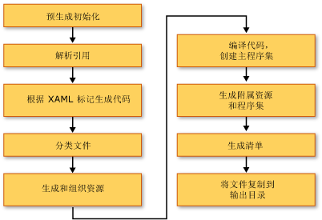

# <a name="building-a-wpf-application-wpf"></a>生成 WPF 应用程序 (WPF)
Windows Presentation Foundation (WPF) 应用程序可以生成为.NET Framework 可执行文件 (.exe)、 库 (.dll) 或这两种类型的程序集的组合。 本主题将介绍如何生成 [!INCLUDE[TLA2#tla_wpf](../../../../includes/tla2sharptla-wpf-md.md)] 应用程序，并对生成过程中的各个关键步骤进行说明。  

<a name="Building_a_WPF_Application_using_Command_Line"></a>   
## <a name="building-a-wpf-application"></a>生成 WPF 应用程序  
 WPF 应用程序可通过以下方式编译：  
  
- 命令行。 应用程序必须只包含代码（并非 XAML）和一个应用程序定义文件。 有关详细信息，请参阅[在命令行上使用 csc.exe 生成](~/docs/csharp/language-reference/compiler-options/command-line-building-with-csc-exe.md)或[从命令行生成 (Visual Basic)](~/docs/visual-basic/reference/command-line-compiler/building-from-the-command-line.md)。  
  
- Microsoft 生成引擎 (MSBuild)。 除了代码和 XAML 文件之外，应用程序还必须包含一个 MSBuild 项目文件。 有关详细信息，请参阅“MSBuild”。  
  
- Visual Studio。 Visual Studio 是一个集成式开发环境，可编译使用 MSBuild 生成的 WPF 应用程序，并包含可用于创建 UI 的可视化设计器。 有关详细信息，请参阅[编写和管理代码使用 Visual Studio](/visualstudio/ide/index-writing-code)并[在 Visual Studio 中设计 XAML](/visualstudio/designers/designing-xaml-in-visual-studio)。  
  
<a name="The_Windows_Presentation_Foundation_Build_Pipeline"></a>   
## <a name="wpf-build-pipeline"></a>WPF 生成管道  
 在生成 [!INCLUDE[TLA2#tla_wpf](../../../../includes/tla2sharptla-wpf-md.md)] 项目时，会组合调用特定于语言的目标和特定于 [!INCLUDE[TLA2#tla_wpf](../../../../includes/tla2sharptla-wpf-md.md)] 的目标。 执行这些目标的进程被称为生成管道，相关的关键步骤已显示在下图中。  
  
   
  
<a name="Pre_Build_Initializations"></a>   
### <a name="pre-build-initializations"></a>预生成初始化  
 在生成之前，[!INCLUDE[TLA2#tla_msbuild](../../../../includes/tla2sharptla-msbuild-md.md)] 会先确定重要工具和库的相应位置，其中包括：  
  
- .NET Framework 中。  
  
- [!INCLUDE[TLA2#tla_wcsdk](../../../../includes/tla2sharptla-wcsdk-md.md)] 目录。  
  
- [!INCLUDE[TLA2#tla_wpf](../../../../includes/tla2sharptla-wpf-md.md)] 引用程序集的位置。  
  
- 程序集搜索路径的属性。  
  
 [!INCLUDE[TLA2#tla_msbuild](../../../../includes/tla2sharptla-msbuild-md.md)] 首先会在引用程序集目录 (%ProgramFiles%\Reference Assemblies\Microsoft\Framework\v3.0\\) 中搜索程序集。 在执行这个步骤时，生成进程还会初始化各种属性和项组，并执行所有必要的清理工作。  
  
<a name="Resolving_references"></a>   
### <a name="resolving-references"></a>解析引用  
 生成进程会查找并绑定生成应用程序项目所需的程序集。 这个逻辑包含在 `ResolveAssemblyReference` 任务中。 在项目文件中声明为 `Reference` 的所有程序集会连同有关搜索路径的信息以及系统上已安装的程序集的元数据一并提供给任务。 该任务会查找程序集，并使用已安装的程序集的元数据来筛选出那些无需显示在输出清单中的核心 [!INCLUDE[TLA2#tla_wpf](../../../../includes/tla2sharptla-wpf-md.md)] 程序集。 这么做可以避免 ClickOnce 清单中出现冗余信息。 例如，由于 PresentationFramework.dll 可以被视为代表应用程序生成和有关[!INCLUDE[TLA2#tla_wpf](../../../../includes/tla2sharptla-wpf-md.md)]而且以来所有[!INCLUDE[TLA2#tla_wpf](../../../../includes/tla2sharptla-wpf-md.md)]程序集位于.NET Framework 的每台计算机上的相同位置安装，没有无需在清单中包含所有.NET Framework 引用程序集上的所有信息。  
  
<a name="Markup_Compilation___Pass_1"></a>   
### <a name="markup-compilationpass-1"></a>标记编译 - 第 1 次传递  
 这个步骤会分析并编译 [!INCLUDE[TLA2#tla_xaml](../../../../includes/tla2sharptla-xaml-md.md)] 文件，这样运行时便无需再花时间来分析 [!INCLUDE[TLA2#tla_xml](../../../../includes/tla2sharptla-xml-md.md)] 并验证属性值。 编译型 [!INCLUDE[TLA2#tla_xaml](../../../../includes/tla2sharptla-xaml-md.md)] 文件会进行预标记，因此其在运行时的加载速度应该要远高于 [!INCLUDE[TLA2#tla_xaml](../../../../includes/tla2sharptla-xaml-md.md)] 文件的加载速度。  
  
 这个步骤会针对属于 `Page` 生成项的每一个 [!INCLUDE[TLA2#tla_xaml](../../../../includes/tla2sharptla-xaml-md.md)] 文件完成以下活动：  
  
1. 由标记编译器对 [!INCLUDE[TLA2#tla_xaml](../../../../includes/tla2sharptla-xaml-md.md)] 文件进行分析。  
  
2. 创建编译型 [!INCLUDE[TLA2#tla_xaml](../../../../includes/tla2sharptla-xaml-md.md)] 并将其复制到 obj\Release 文件夹。  
  
3. 创建 CodeDOM 型新分部类并将其复制到 obj\Release 文件夹。  
  
 另外，还会针对每一个 [!INCLUDE[TLA2#tla_xaml](../../../../includes/tla2sharptla-xaml-md.md)] 文件生成特定于语言的代码文件。 例如，对于 Visual Basic 项目中的 Page1.xaml 页面，Page1.g.vb 生成;对于 C# 项目中的 Page1.xaml 页面，会生成 Page1.g.cs。 文件名中的“.g”表明文件包含的是生成的代码，这些代码针对标记文件的顶级元素（如 `Page` 或 `Window`）进行了分部类声明。 使用声明该类`partial`C# 中的修饰符 (`Extends`在 Visual Basic 中) 以指示该类在其他位置的另一个声明，通常在代码隐藏文件 page1.xaml.cs。  
  
 分部类扩展自相应的基类 (如<xref:System.Windows.Controls.Page>页面)，并实现<xref:System.Windows.Markup.IComponentConnector?displayProperty=nameWithType>接口。 <xref:System.Windows.Markup.IComponentConnector>接口具有用于初始化组件和连接的名称和其内容中的元素上的事件的方法。 因此，生成的代码文件中都包含如下所示的方法实现：  
  
```csharp  
public void InitializeComponent() {  
    if (_contentLoaded) {  
        return;  
    }  
    _contentLoaded = true;  
    System.Uri resourceLocater =   
        new System.Uri(  
            "window1.xaml",   
            System.UriKind.RelativeOrAbsolute);  
    System.Windows.Application.LoadComponent(this, resourceLocater);  
}  
```  
  
```vb  
Public Sub InitializeComponent() _  
  
    If _contentLoaded Then  
        Return  
    End If  
  
    _contentLoaded = True  
    Dim resourceLocater As System.Uri = _  
        New System.Uri("mainwindow.xaml", System.UriKind.Relative)  
  
    System.Windows.Application.LoadComponent(Me, resourceLocater)  
  
End Sub  
```  
  
 默认情况下，运行在同一个标记编译<xref:System.AppDomain>作为[!INCLUDE[TLA2#tla_msbuild](../../../../includes/tla2sharptla-msbuild-md.md)]引擎。 这可以显著提高性能。 此行为可通过 `AlwaysCompileMarkupFilesInSeparateDomain` 属性来切换。 这一优点是： 通过卸载单独卸载所有引用程序集<xref:System.AppDomain>。  
  
<a name="Pass_2_of_Markup_Compilation"></a>   
### <a name="markup-compilationpass-2"></a>标记编译 - 第 2 次传递  
 并非所有 [!INCLUDE[TLA2#tla_xaml](../../../../includes/tla2sharptla-xaml-md.md)] 页面都会在标记编译的第 1 次传递过程中完成编译。 包含本地定义类型引用（引用同一项目中其他位置的代码所定义的类型）的 [!INCLUDE[TLA2#tla_xaml](../../../../includes/tla2sharptla-xaml-md.md)] 文件就不会在此期间进行编译。 这是因为这些本地定义的类型仅存在于源中，并且尚未编译。 分析器会采用试探法来确定文件是否已编译，而这一操作会涉及在标记文件中查找 `x:Name` 之类的项。 如果找到此类实例，标记文件的编译将会推迟，直至代码文件完成编译；在代码文件完成编译后，标记文件会在第二次标记编译传递期间得到处理。  
  
<a name="File_Classification"></a>   
### <a name="file-classification"></a>文件分类  
 生成进程会根据输出文件将被置于哪个应用程序集中，将输出文件放入不同的资源组。 在典型的非本地化应用程序中，所有被标记为 `Resource` 的数据文件都会置于主程序集（可执行文件或库）中。 如果在项目中设置了 `UICulture`，则所有编译型 [!INCLUDE[TLA2#tla_xaml](../../../../includes/tla2sharptla-xaml-md.md)] 文件以及那些专门标记为特定于语言的资源会置于附属资源程序集中。 此外，所有中性语言资源都会置于主程序集中。 生成进程会在执行这个步骤时确定放置位置。  
  
 项目文件中的 `ApplicationDefinition`、`Page` 和 `Resource` 生成操作可以使用 `Localizable` 元数据（可接受的值为 `true` 和 `false`）来扩充，该元数据会指明文件是特定于语言的文件还是中性语言文件。  
  
<a name="Core_Compilation"></a>   
### <a name="core-compilation"></a>内核编译  
 内核编译步骤涉及代码文件的编译。 这要由特定于语言的目标文件 Microsoft.CSharp.targets 和 Microsoft.VisualBasic.targets 中的逻辑来协调。 如果试探法确定标记编译器只需要进行一次传递，则会生成主程序集。 但是，如果项目中的一个或多个 [!INCLUDE[TLA2#tla_xaml](../../../../includes/tla2sharptla-xaml-md.md)] 文件引用了本地定义的类型，则会生成一个临时的.dll 文件，最终的应用程序集则可能会在标记编译的第二次传递完成后再创建。  
  
<a name="Manifest_generation"></a>   
### <a name="manifest-generation"></a>清单生成  
 生成进程的最后一步是：在所有应用程序集和内容文件都准备就绪后，为应用程序生成 [!INCLUDE[TLA2#tla_clickonce](../../../../includes/tla2sharptla-clickonce-md.md)] 清单。  
  
 部署清单文件可描述部署模型：当前版本、更新行为、发布服务器标识以及数字签名。 该清单应由负责处理部署的管理员来编写。 对于 [!INCLUDE[TLA#tla_xbap#plural](../../../../includes/tlasharptla-xbapsharpplural-md.md)]，这个文件的扩展名为 .xbap；对于已安装的应用程序，扩展名则为 .application。 前者受 `HostInBrowser` 项目属性支配，因此清单会将应用程序标识为由浏览器承载。  
  
 应用程序清单（一个 .exe.manifest 文件）可描述应用程序集和依赖库，并列出应用程序所需的权限。 该文件应由应用程序开发者编写。 为了启动 [!INCLUDE[TLA2#tla_clickonce](../../../../includes/tla2sharptla-clickonce-md.md)] 应用程序，用户会打开该应用程序的部署清单文件。  
  
 对于 [!INCLUDE[TLA2#tla_xbap#plural](../../../../includes/tla2sharptla-xbapsharpplural-md.md)]，始终会创建这些清单文件。 对于已安装的应用程序，这些文件不会创建，除非在项目文件中为 `GenerateManifests` 属性指定值 `true`。  
  
 [!INCLUDE[TLA2#tla_xbap#plural](../../../../includes/tla2sharptla-xbapsharpplural-md.md)] 获取这些权限分配给典型 Internet 区域应用程序之上的两个额外权限：<xref:System.Security.Permissions.WebBrowserPermission>和<xref:System.Security.Permissions.MediaPermission>。 [!INCLUDE[TLA2#tla_wpf](../../../../includes/tla2sharptla-wpf-md.md)] 生成系统会在应用程序清单中声明这些权限。  
  
<a name="Incremental_Build_Support"></a>   
## <a name="incremental-build-support"></a>增量生成支持  
 [!INCLUDE[TLA2#tla_wpf](../../../../includes/tla2sharptla-wpf-md.md)] 生成系统可以为增量生成提供支持。 该系统能以非常智能化的方式来检测对标记或代码所做的各种更改，而且只会编译那些受到更改操作影响的项目。 增量生成机制会使用以下文件：  
  
- $(*AssemblyName*)_MarkupCompiler.Cache 文件，用于维护当前的编译器状态。  
  
- $(*AssemblyName*)_MarkupCompiler.lref 文件，用于缓存引用了本地定义类型的 [!INCLUDE[TLA2#tla_xaml](../../../../includes/tla2sharptla-xaml-md.md)] 文件。  
  
 下面显示了一组用于控制增量生成的规则：  
  
- 文件是生成系统检测更改时的最小单位。 因此，对于代码文件，生成系统无法判断类型是否已更改或者是否添加了代码。 对于项目文件也是如此。  
  
- 增量生成机制必须确定 [!INCLUDE[TLA2#tla_xaml](../../../../includes/tla2sharptla-xaml-md.md)] 页面是定义了一个类，还是使用了其他类。  
  
- 如果 `Reference` 条目发生变化，则会重新编译所有页面。  
  
- 如果代码文件发生变化，则会重新编译引用了本地定义类型的所有页面。  
  
- 如果 [!INCLUDE[TLA2#tla_xaml](../../../../includes/tla2sharptla-xaml-md.md)] 文件发生变化：  
  
    - 如果 [!INCLUDE[TLA2#tla_xaml](../../../../includes/tla2sharptla-xaml-md.md)] 在项目中被声明为 `Page`：如果 [!INCLUDE[TLA2#tla_xaml](../../../../includes/tla2sharptla-xaml-md.md)] 没有引用本地定义的类型，则会重新编译 [!INCLUDE[TLA2#tla_xaml](../../../../includes/tla2sharptla-xaml-md.md)] 以及包含本地引用的所有 [!INCLUDE[TLA2#tla_xaml](../../../../includes/tla2sharptla-xaml-md.md)] 页面；如果 [!INCLUDE[TLA2#tla_xaml](../../../../includes/tla2sharptla-xaml-md.md)] 包含本地引用，则会重新编译包含本地引用的所有 [!INCLUDE[TLA2#tla_xaml](../../../../includes/tla2sharptla-xaml-md.md)] 页面。  
  
    - 如果[!INCLUDE[TLA2#tla_xaml](../../../../includes/tla2sharptla-xaml-md.md)]被声明为`ApplicationDefinition`项目中： 重新编译所有[!INCLUDE[TLA2#tla_xaml](../../../../includes/tla2sharptla-xaml-md.md)]页面 (原因： 每个[!INCLUDE[TLA2#tla_xaml](../../../../includes/tla2sharptla-xaml-md.md)]具有对引用<xref:System.Windows.Application>可能已更改的类型)。  
  
- 如果项目文件将代码文件声明为应用程序定义，而不是 [!INCLUDE[TLA2#tla_xaml](../../../../includes/tla2sharptla-xaml-md.md)] 文件：  
  
    - 检查项目文件中的 `ApplicationClassName` 值是不是发生了变化（是不是有新的应用程序类型？）。 如果是，则重新编译整个应用程序。  
  
    - 否则，重新编译包含本地引用的所有 [!INCLUDE[TLA2#tla_xaml](../../../../includes/tla2sharptla-xaml-md.md)] 页面。  
  
- 如果项目文件发生变化：应用前面的所有规则，并确认哪些内容需要重新编译。 以下属性发生变化会触发全面的重新编译：`AssemblyName`、`IntermediateOutputPath`、`RootNamespace` 和 `HostInBrowser`。  
  
 可能会出现以下重新编译情形：  
  
- 重新编译整个应用程序。  
  
- 仅重新编译那些引用了本地定义类型的 [!INCLUDE[TLA2#tla_xaml](../../../../includes/tla2sharptla-xaml-md.md)] 文件。  
  
- 不会重新编译任何内容（如果项目未发生任何变化）。  
  
## <a name="see-also"></a>请参阅

- [部署 WPF 应用程序](deploying-a-wpf-application-wpf.md)
- [WPF MSBuild 参考](/visualstudio/msbuild/wpf-msbuild-reference)
- [WPF 中的 Pack URI](pack-uris-in-wpf.md)
- [WPF 应用程序资源、内容和数据文件](wpf-application-resource-content-and-data-files.md)
