# 导航概述
Windows Presentation Foundation (WPF) 支持两种类型的应用程序可以使用的浏览器样式导航： 独立应用程序和[!INCLUDE[TLA#tla_xbap#plural](../../../../includes/tlasharptla-xbapsharpplural-md.md)]。 对包内容的导航窗格中，[!INCLUDE[TLA2#tla_wpf](../../../../includes/tla2sharptla-wpf-md.md)]提供了<xref:System.Windows.Controls.Page>类。 可以从一个导航<xref:System.Windows.Controls.Page>到另一个以声明方式，通过使用<xref:System.Windows.Documents.Hyperlink>，或以编程方式使用<xref:System.Windows.Navigation.NavigationService>。 [!INCLUDE[TLA2#tla_wpf](../../../../includes/tla2sharptla-wpf-md.md)] 使用日志记住从其导航和导航回它们的页。  
  
 <xref:System.Windows.Controls.Page><xref:System.Windows.Documents.Hyperlink>， <xref:System.Windows.Navigation.NavigationService>，和日志组成的核心部分提供的导航支持[!INCLUDE[TLA2#tla_wpf](../../../../includes/tla2sharptla-wpf-md.md)]。 本概述探讨这些功能的详细信息，然后介绍高级的导航支持，包括导航到松散[!INCLUDE[TLA#tla_xaml](../../../../includes/tlasharptla-xaml-md.md)]文件，[!INCLUDE[TLA#tla_html](../../../../includes/tlasharptla-html-md.md)]文件和对象。  
  
> [!NOTE]
>  在本主题中，术语"浏览器"仅指可以托管的浏览器[!INCLUDE[TLA2#tla_wpf](../../../../includes/tla2sharptla-wpf-md.md)]应用程序，当前包括[!INCLUDE[TLA#tla_ie](../../../../includes/tlasharptla-ie-md.md)]和 Firefox。 在特定[!INCLUDE[TLA2#tla_wpf](../../../../includes/tla2sharptla-wpf-md.md)]功能仅受特定浏览器，浏览器版本引用。  
   
     
## WPF 应用程序中的导航  
 本主题概述中的键导航功能[!INCLUDE[TLA2#tla_wpf](../../../../includes/tla2sharptla-wpf-md.md)]。 这些功能可供这两个独立应用程序和[!INCLUDE[TLA2#tla_xbap#plural](../../../../includes/tla2sharptla-xbapsharpplural-md.md)]，但本主题介绍了它们的上下文中[!INCLUDE[TLA2#tla_xbap](../../../../includes/tla2sharptla-xbap-md.md)]。  
  
> [!NOTE]
>  本主题不讨论如何生成和部署[!INCLUDE[TLA2#tla_xbap#plural](../../../../includes/tla2sharptla-xbapsharpplural-md.md)]。 有关详细信息[!INCLUDE[TLA2#tla_xbap#plural](../../../../includes/tla2sharptla-xbapsharpplural-md.md)]，请参阅[WPF XAML 浏览器应用程序概述](../../../../docs/framework/wpf/app-development/wpf-xaml-browser-applications-overview.md)。  
  
 本节解释并演示导航的以下方面：  
  
-   [实现页](#CreatingAXAMLPage)  
  
-   [配置起始页](#Configuring_a_Start_Page)  
  
-   [配置主机窗口的标题、宽度和高度](#ConfiguringAXAMLPage)  
  
-   [超链接导航](#NavigatingBetweenXAMLPages)  
  
-   [片段导航](#FragmentNavigation)  
  
-   [导航服务](#NavigationService)  
  
-   [使用导航服务以编程方式导航](#Programmatic_Navigation_with_the_Navigation_Service)  
  
-   [导航生存期](#Navigation_Lifetime)  
  
-   [使用日志记住导航](#NavigationHistory)  
  
-   [页生存期和日志](#PageLifetime)  
  
-   [保留导航历史记录的内容状态](#RetainingContentStateWithNavigationHistory)  
  
-   [Cookie](#Cookies)  
  
-   [结构化导航](#Structured_Navigation)  
  
   
### 实现页  
 在中[!INCLUDE[TLA2#tla_wpf](../../../../includes/tla2sharptla-wpf-md.md)]，可以导航到多个内容类型，包括.NET Framework 对象、 自定义对象、 枚举值、 用户控件[!INCLUDE[TLA2#tla_xaml](../../../../includes/tla2sharptla-xaml-md.md)]文件，和[!INCLUDE[TLA#tla_html](../../../../includes/tlasharptla-html-md.md)]文件。 但是，你会发现打包内容最常见和最简便方法是使用<xref:System.Windows.Controls.Page>。 此外，<xref:System.Windows.Controls.Page>实现特定于导航的功能来增强外观并简化开发。  
  
 使用<xref:System.Windows.Controls.Page>，你可以以声明方式实现的导航页[!INCLUDE[TLA2#tla_xaml](../../../../includes/tla2sharptla-xaml-md.md)]通过使用如下所示的标记内容。  
  
 [!code-xaml[NavigationOverviewSnippets#Page1XAML](../../../../samples/snippets/csharp/VS_Snippets_Wpf/NavigationOverviewSnippets/CSharp/Page1.xaml#page1xaml)]  
  
 一个<xref:System.Windows.Controls.Page>中实现[!INCLUDE[TLA2#tla_xaml](../../../../includes/tla2sharptla-xaml-md.md)]标记已`Page`作为其根元素和需要[!INCLUDE[TLA2#tla_wpf](../../../../includes/tla2sharptla-wpf-md.md)][!INCLUDE[TLA#tla_xml](../../../../includes/tlasharptla-xml-md.md)]命名空间声明。 `Page`元素包含你想要导航到并显示的内容。 通过设置添加内容`Page.Content`属性元素，如以下标记所示。  
  
 [!code-xaml[NavigationOverviewSnippets#Page2XAML](../../../../samples/snippets/csharp/VS_Snippets_Wpf/NavigationOverviewSnippets/CSharp/Page2.xaml#page2xaml)]  
  
 `Page.Content` 只能包含一个子元素，在前面的实例中，内容是一个单独的字符串“Hello, Page!”。 在实践中，您通常将使用布局控件作为子元素 (请参阅[布局](../../../../docs/framework/wpf/advanced/layout.md)) 来包含并创建你的内容。  
  
 子元素`Page`元素的内容被视为<xref:System.Windows.Controls.Page>，因此，您不必使用显式`Page.Content`声明。 以下标记和前面的示例在声明上是等效的。  
  
 [!code-xaml[NavigationOverviewSnippets#Page3XAML](../../../../samples/snippets/csharp/VS_Snippets_Wpf/NavigationOverviewSnippets/CSharp/Page3.xaml#page3xaml)]  
  
 在这种情况下，`Page.Content`会自动设置的子元素的`Page`元素。 有关详细信息，请参阅 [WPF 内容模型](../../../../docs/framework/wpf/controls/wpf-content-model.md)。  
  
 仅标记<xref:System.Windows.Controls.Page>对显示内容很有用。 但是，<xref:System.Windows.Controls.Page>还可以显示允许用户与页面进行交互的控件，它可以通过处理事件和调用应用程序逻辑来响应用户交互。 交互式<xref:System.Windows.Controls.Page>如下面的示例中所示，通过使用标记和代码隐藏的组合实现。  
  
 [!code-xaml[XBAPAppDefSnippets#HomePageMARKUP](../../../../samples/snippets/csharp/VS_Snippets_Wpf/XBAPAppDefSnippets/CSharp/HomePage.xaml#homepagemarkup)]  
  
 [!code-csharp[XBAPAppDefSnippets#HomePageCODEBEHIND](../../../../samples/snippets/csharp/VS_Snippets_Wpf/XBAPAppDefSnippets/CSharp/HomePage.xaml.cs#homepagecodebehind)]
 [!code-vb[XBAPAppDefSnippets#HomePageCODEBEHIND](../../../../samples/snippets/visualbasic/VS_Snippets_Wpf/XBAPAppDefSnippets/VisualBasic/HomePage.xaml.vb#homepagecodebehind)]  
  
 要允许标记文件和代码隐藏文件协同工作，需要进行以下配置：  
  
-   在标记中，`Page`元素必须包括`x:Class`属性。 应用程序生成时，是否存在`x:Class`在标记文件会导致[!INCLUDE[TLA#tla_msbuild](../../../../includes/tlasharptla-msbuild-md.md)]来创建`partial`派生的类<xref:System.Windows.Controls.Page>并且具有指定的名称`x:Class`属性。 这需要添加[!INCLUDE[TLA2#tla_xml](../../../../includes/tla2sharptla-xml-md.md)]命名空间声明[!INCLUDE[TLA2#tla_xaml](../../../../includes/tla2sharptla-xaml-md.md)]架构 ( `xmlns:x="http://schemas.microsoft.com/winfx/2006/xaml"` )。 生成`partial`类实现`InitializeComponent`，调用它来注册事件并设置属性的标记中实现。  
  
-   在代码隐藏中，类必须是`partial`具有相同名称指定的类`x:Class`属性在标记中，并且它必须派生自<xref:System.Windows.Controls.Page>。 这允许要与之关联的代码隐藏文件`partial`生成应用程序时，为标记文件生成的类 (请参阅[构建 WPF 应用程序](../../../../docs/framework/wpf/app-development/building-a-wpf-application-wpf.md))。  
  
-   在代码隐藏<xref:System.Windows.Controls.Page>类必须实现构造函数调用`InitializeComponent`方法。 `InitializeComponent` 实现由标记文件中生成的`partial`类，以注册事件和设置在标记中定义的属性。  
  
> [!NOTE]
>  添加一个新<xref:System.Windows.Controls.Page>到你的项目使用[!INCLUDE[TLA#tla_visualstu](../../../../includes/tlasharptla-visualstu-md.md)]，则<xref:System.Windows.Controls.Page>使用标记和代码隐藏实现，它包括必要的配置来创建作为标记和代码隐藏文件之间的关联此处所述。  
  
 一旦您有<xref:System.Windows.Controls.Page>，可以导航到它。 若要指定第一个<xref:System.Windows.Controls.Page>应用程序导航到，您需要配置开始<xref:System.Windows.Controls.Page>。  
  
   
### 配置起始页  
 [!INCLUDE[TLA2#tla_xbap#plural](../../../../includes/tla2sharptla-xbapsharpplural-md.md)] 需要一定数量的应用程序结构以在浏览器中托管。 在中[!INCLUDE[TLA2#tla_wpf](../../../../includes/tla2sharptla-wpf-md.md)]，则<xref:System.Windows.Application>类是建立所需应用程序基础结构应用程序定义的一部分 (请参阅[应用程序管理概述](../../../../docs/framework/wpf/app-development/application-management-overview.md))。  
  
 应用程序定义通常与标记文件配置为使用标记和代码隐藏实现[!INCLUDE[TLA2#tla_msbuild](../../../../includes/tla2sharptla-msbuild-md.md)]`ApplicationDefinition`项。 以下是有关应用程序定义[!INCLUDE[TLA2#tla_xbap](../../../../includes/tla2sharptla-xbap-md.md)]。  
  
 [!code-xaml[XBAPAppDefSnippets#XBAPApplicationDefinitionMARKUP](../../../../samples/snippets/csharp/VS_Snippets_Wpf/XBAPAppDefSnippets/CSharp/App.xaml#xbapapplicationdefinitionmarkup)]  
  
 [!code-csharp[XBAPAppDefSnippets#XBAPApplicationDefinitionCODEBEHIND](../../../../samples/snippets/csharp/VS_Snippets_Wpf/XBAPAppDefSnippets/CSharp/App.xaml.cs#xbapapplicationdefinitioncodebehind)]
 [!code-vb[XBAPAppDefSnippets#XBAPApplicationDefinitionCODEBEHIND](../../../../samples/snippets/visualbasic/VS_Snippets_Wpf/XBAPAppDefSnippets/VisualBasic/Application.xaml.vb#xbapapplicationdefinitioncodebehind)]  
  
 [!INCLUDE[TLA2#tla_xbap](../../../../includes/tla2sharptla-xbap-md.md)]可以使用其应用程序定义指定起始<xref:System.Windows.Controls.Page>，即<xref:System.Windows.Controls.Page>时，自动加载[!INCLUDE[TLA2#tla_xbap](../../../../includes/tla2sharptla-xbap-md.md)]启动。 执行此操作通过设置<xref:System.Windows.Application.StartupUri%2A>具有属性[!INCLUDE[TLA#tla_uri](../../../../includes/tlasharptla-uri-md.md)]的所需<xref:System.Windows.Controls.Page>。  
  
> [!NOTE]
>  在大多数情况下，<xref:System.Windows.Controls.Page>被编译到或使用应用程序部署。 在这些情况下， [!INCLUDE[TLA2#tla_uri](../../../../includes/tla2sharptla-uri-md.md)] ，用于标识<xref:System.Windows.Controls.Page>是一个包[!INCLUDE[TLA2#tla_uri](../../../../includes/tla2sharptla-uri-md.md)]，即[!INCLUDE[TLA2#tla_uri](../../../../includes/tla2sharptla-uri-md.md)]符合*pack*方案。 包[!INCLUDE[TLA2#tla_uri#plural](../../../../includes/tla2sharptla-urisharpplural-md.md)]讨论了中进一步[WPF 中的 Pack Uri](../../../../docs/framework/wpf/app-development/pack-uris-in-wpf.md)。 也可使用 http 方案导航到内容，这将在以下内容中讨论。  
  
 可以设置<xref:System.Windows.Application.StartupUri%2A>以声明方式在标记中，如下面的示例中所示。  
  
 [!code-xaml[NavigationOverviewSnippets#XBAPApplicationDefinitionMARKUP](../../../../samples/snippets/csharp/VS_Snippets_Wpf/NavigationOverviewSnippets/CSharp/App.xaml#xbapapplicationdefinitionmarkup)]  
  
 在此示例中，`StartupUri`属性设置的相对 pack[!INCLUDE[TLA2#tla_uri](../../../../includes/tla2sharptla-uri-md.md)]标识 HomePage.xaml。 当[!INCLUDE[TLA2#tla_xbap](../../../../includes/tla2sharptla-xbap-md.md)]是启动，HomePage.xaml 自动导航到并显示。 下图显示了这一点[!INCLUDE[TLA2#tla_xbap](../../../../includes/tla2sharptla-xbap-md.md)]从 Web 服务器中启动。  
  
 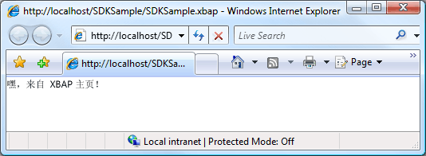  
  
> [!NOTE]
>  有关开发和部署的详细信息[!INCLUDE[TLA2#tla_xbap#plural](../../../../includes/tla2sharptla-xbapsharpplural-md.md)]，请参阅[WPF XAML 浏览器应用程序概述](../../../../docs/framework/wpf/app-development/wpf-xaml-browser-applications-overview.md)并[部署 WPF 应用程序](../../../../docs/framework/wpf/app-development/deploying-a-wpf-application-wpf.md)。  
  
   
### 配置主机窗口的标题、宽度和高度  
 您可能已经注意到从上图中的一件事是浏览器和选项卡面板的标题是[!INCLUDE[TLA2#tla_uri](../../../../includes/tla2sharptla-uri-md.md)]为[!INCLUDE[TLA2#tla_xbap](../../../../includes/tla2sharptla-xbap-md.md)]。 除了长，标题既没什么吸引力也没什么帮助。 出于此原因，<xref:System.Windows.Controls.Page>提供了一种方法，以便通过设置来更改标题<xref:System.Windows.Controls.Page.WindowTitle%2A>属性。 此外，可以通过设置配置的宽度和高度的浏览器窗口<xref:System.Windows.Controls.Page.WindowWidth%2A>和<xref:System.Windows.Controls.Page.WindowHeight%2A>分别。  
  
 <xref:System.Windows.Controls.Page.WindowTitle%2A><xref:System.Windows.Controls.Page.WindowWidth%2A>，和<xref:System.Windows.Controls.Page.WindowHeight%2A>可设置，以声明方式在标记中，如以下示例所示。  
  
 [!code-xaml[NavigationOverviewSnippets#HomePageMARKUP](../../../../samples/snippets/csharp/VS_Snippets_Wpf/NavigationOverviewSnippets/CSharp/HomePage.xaml#homepagemarkup)]  
  
 结果如下图所示。  
  
   
  
   
### 超链接导航  
 典型[!INCLUDE[TLA2#tla_xbap](../../../../includes/tla2sharptla-xbap-md.md)]包含多页。 导航到另一个页面中的最简单方法是使用<xref:System.Windows.Documents.Hyperlink>。 您可以以声明方式添加<xref:System.Windows.Documents.Hyperlink>到<xref:System.Windows.Controls.Page>通过使用`Hyperlink`元素，以下标记所示。  
  
 [!code-xaml[NavigationOverviewSnippets#HyperlinkXAML1](../../../../samples/snippets/csharp/VS_Snippets_Wpf/NavigationOverviewSnippets/CSharp/PageWithHyperlink.xaml#hyperlinkxaml1)]  
[!code-xaml[NavigationOverviewSnippets#HyperlinkXAML2](../../../../samples/snippets/csharp/VS_Snippets_Wpf/NavigationOverviewSnippets/CSharp/PageWithHyperlink.xaml#hyperlinkxaml2)]  
[!code-xaml[NavigationOverviewSnippets#HyperlinkXAML3](../../../../samples/snippets/csharp/VS_Snippets_Wpf/NavigationOverviewSnippets/CSharp/PageWithHyperlink.xaml#hyperlinkxaml3)]  
  
 一个`Hyperlink`元素具有以下要求：  
  
-   包[!INCLUDE[TLA2#tla_uri](../../../../includes/tla2sharptla-uri-md.md)]的<xref:System.Windows.Controls.Page>以导航到，所指定的`NavigateUri`属性。  
  
-   内容，用户可以单击初始化导航，如文本和图像 (内容的`Hyperlink`元素可以包含，请参阅<xref:System.Windows.Documents.Hyperlink>)。  
  
 下图显示[!INCLUDE[TLA2#tla_xbap](../../../../includes/tla2sharptla-xbap-md.md)]与<xref:System.Windows.Controls.Page>具有<xref:System.Windows.Documents.Hyperlink>。  
  
   
  
 如您所料，单击<xref:System.Windows.Documents.Hyperlink>会导致[!INCLUDE[TLA2#tla_xbap](../../../../includes/tla2sharptla-xbap-md.md)]以导航到<xref:System.Windows.Controls.Page>由标识`NavigateUri`属性。 此外，[!INCLUDE[TLA2#tla_xbap](../../../../includes/tla2sharptla-xbap-md.md)]前添加一个条目<xref:System.Windows.Controls.Page>到中的最新页列表[!INCLUDE[TLA2#tla_ie](../../../../includes/tla2sharptla-ie-md.md)]。 如下图所示。  
  
 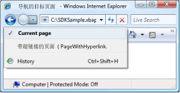  
  
 除了支持从一个导航<xref:System.Windows.Controls.Page>到另一个，<xref:System.Windows.Documents.Hyperlink>还支持片段导航。  
  
   
### 片段导航  
 *片段导航*是当前的内容片段中导航<xref:System.Windows.Controls.Page>或另一个<xref:System.Windows.Controls.Page>。 在[!INCLUDE[TLA2#tla_wpf](../../../../includes/tla2sharptla-wpf-md.md)]，内容片段是命名元素所包含的内容。 命名的元素是具有的元素，其`Name`属性设置。 以下标记显示了名为`TextBlock`元素，其中包含内容片段。  
  
 [!code-xaml[NavigationOverviewSnippets#PageWithContentFragmentsMARKUP1](../../../../samples/snippets/csharp/VS_Snippets_Wpf/NavigationOverviewSnippets/CSharp/PageWithFragments.xaml#pagewithcontentfragmentsmarkup1)]  
[!code-xaml[NavigationOverviewSnippets#PageWithContentFragmentsMARKUP2](../../../../samples/snippets/csharp/VS_Snippets_Wpf/NavigationOverviewSnippets/CSharp/PageWithFragments.xaml#pagewithcontentfragmentsmarkup2)]  
[!code-xaml[NavigationOverviewSnippets#PageWithContentFragmentsMARKUP3](../../../../samples/snippets/csharp/VS_Snippets_Wpf/NavigationOverviewSnippets/CSharp/PageWithFragments.xaml#pagewithcontentfragmentsmarkup3)]  
  
 有关<xref:System.Windows.Documents.Hyperlink>导航到内容片段`NavigateUri`属性必须包括以下：  
  
-   [!INCLUDE[TLA2#tla_uri](../../../../includes/tla2sharptla-uri-md.md)]的<xref:System.Windows.Controls.Page>以导航到的内容片段。  
  
-   “#”字符。  
  
-   在元素的名称<xref:System.Windows.Controls.Page>，其中包含内容片段。  
  
 片段[!INCLUDE[TLA2#tla_uri](../../../../includes/tla2sharptla-uri-md.md)]采用以下格式。  
  
 *PageURI* `#` *ElementName*  
  
 以下举例说明了`Hyperlink`，它配置为导航到内容片段。  
  
 [!code-xaml[NavigationOverviewSnippets#PageThatNavigatesXAML1](../../../../samples/snippets/csharp/VS_Snippets_Wpf/NavigationOverviewSnippets/CSharp/PageThatNavigatesToFragment.xaml#pagethatnavigatesxaml1)]  
[!code-xaml[NavigationOverviewSnippets#PageThatNavigatesXAML2](../../../../samples/snippets/csharp/VS_Snippets_Wpf/NavigationOverviewSnippets/CSharp/PageThatNavigatesToFragment.xaml#pagethatnavigatesxaml2)]  
[!code-xaml[NavigationOverviewSnippets#PageThatNavigatesXAML3](../../../../samples/snippets/csharp/VS_Snippets_Wpf/NavigationOverviewSnippets/CSharp/PageThatNavigatesToFragment.xaml#pagethatnavigatesxaml3)]  
  
> [!NOTE]
>  本部分介绍中的默认片段导航实现[!INCLUDE[TLA2#tla_wpf](../../../../includes/tla2sharptla-wpf-md.md)]。 [!INCLUDE[TLA2#tla_wpf](../../../../includes/tla2sharptla-wpf-md.md)] 此外允许您实现您自己的片段导航方案的一部分，需要处理<xref:System.Windows.Navigation.NavigationService.FragmentNavigation?displayProperty=nameWithType>事件。  
  
> [!IMPORTANT]
>  您可以导航到片段中松散[!INCLUDE[TLA2#tla_xaml](../../../../includes/tla2sharptla-xaml-md.md)]页 (仅标记[!INCLUDE[TLA2#tla_xaml](../../../../includes/tla2sharptla-xaml-md.md)]文件的工具`Page`作为根元素) 才可以通过浏览页面[!INCLUDE[TLA2#tla_http](../../../../includes/tla2sharptla-http-md.md)]。  
>   
>  但是，松散[!INCLUDE[TLA2#tla_xaml](../../../../includes/tla2sharptla-xaml-md.md)]页可以导航到自己的片段。  
  
   
### 导航服务  
 虽然<xref:System.Windows.Documents.Hyperlink>允许用户导航初始化到特定<xref:System.Windows.Controls.Page>，查找并下载该页的工作由执行<xref:System.Windows.Navigation.NavigationService>类。 从根本上来说，<xref:System.Windows.Navigation.NavigationService>提供的功能处理导航请求代表客户端代码，如<xref:System.Windows.Documents.Hyperlink>。 此外，<xref:System.Windows.Navigation.NavigationService>实现更高级别的支持来跟踪并影响导航需求。  
  
 当<xref:System.Windows.Documents.Hyperlink>单击时，[!INCLUDE[TLA2#tla_wpf](../../../../includes/tla2sharptla-wpf-md.md)]调用<xref:System.Windows.Navigation.NavigationService.Navigate%2A?displayProperty=nameWithType>查找和下载<xref:System.Windows.Controls.Page>指定的包在[!INCLUDE[TLA2#tla_uri](../../../../includes/tla2sharptla-uri-md.md)]。 下载<xref:System.Windows.Controls.Page>转换为其根对象是已下载的实例的对象树<xref:System.Windows.Controls.Page>。 对根目录的引用<xref:System.Windows.Controls.Page>对象存储在<xref:System.Windows.Navigation.NavigationService.Content%2A?displayProperty=nameWithType>属性。 包[!INCLUDE[TLA2#tla_uri](../../../../includes/tla2sharptla-uri-md.md)]导航到的内容存储在<xref:System.Windows.Navigation.NavigationService.Source%2A?displayProperty=nameWithType>属性，而<xref:System.Windows.Navigation.NavigationService.CurrentSource%2A?displayProperty=nameWithType>存储 pack[!INCLUDE[TLA2#tla_uri](../../../../includes/tla2sharptla-uri-md.md)]导航到的最后一页。  
  
> [!NOTE]
>  很可能[!INCLUDE[TLA2#tla_wpf](../../../../includes/tla2sharptla-wpf-md.md)]应用程序有多个当前处于活动状态<xref:System.Windows.Navigation.NavigationService>。 有关详细信息，请参阅[导航主机](#Navigation_Hosts)本主题中更高版本。  
  
   
### 使用导航服务以编程方式导航  
 无需了解的有关<xref:System.Windows.Navigation.NavigationService>如果在标记中使用以声明方式实现导航<xref:System.Windows.Documents.Hyperlink>，因为<xref:System.Windows.Documents.Hyperlink>使用<xref:System.Windows.Navigation.NavigationService>代表你。 这意味着，只要的直接或间接父级<xref:System.Windows.Documents.Hyperlink>是导航主机 (请参阅[导航主机](#Navigation_Hosts))，<xref:System.Windows.Documents.Hyperlink>将能够查找并使用导航主机导航服务来处理导航请求。  
  
 但是，有些情况需要使用<xref:System.Windows.Navigation.NavigationService>直接，其中包括：  
  
-   当需要进行实例化<xref:System.Windows.Controls.Page>使用非默认构造函数。  
  
-   当需要进行设置的属性<xref:System.Windows.Controls.Page>导航到它之前。  
  
-   当<xref:System.Windows.Controls.Page>，需要以导航到只能确定在运行时。  
  
 在这些情况下，您需要编写代码来以编程方式通过调用启动导航<xref:System.Windows.Navigation.NavigationService.Navigate%2A>方法的<xref:System.Windows.Navigation.NavigationService>对象。 这就需要获取对引用<xref:System.Windows.Navigation.NavigationService>。  
  
#### 获取对 NavigationService 的引用  
 中介绍的原因[导航宿主](#Navigation_Hosts)部分中，[!INCLUDE[TLA2#tla_wpf](../../../../includes/tla2sharptla-wpf-md.md)]应用程序可以有多个<xref:System.Windows.Navigation.NavigationService>。 这意味着你的代码需要一种方法，以查找<xref:System.Windows.Navigation.NavigationService>，这通常是<xref:System.Windows.Navigation.NavigationService>，导航到当前<xref:System.Windows.Controls.Page>。 可以获取对的引用<xref:System.Windows.Navigation.NavigationService>通过调用`static`<xref:System.Windows.Navigation.NavigationService.GetNavigationService%2A?displayProperty=nameWithType>方法。 若要获取<xref:System.Windows.Navigation.NavigationService>，导航到特定<xref:System.Windows.Controls.Page>，可传递到引用<xref:System.Windows.Controls.Page>作为参数的<xref:System.Windows.Navigation.NavigationService.GetNavigationService%2A>方法。 下面的代码演示如何获取<xref:System.Windows.Navigation.NavigationService>当前<xref:System.Windows.Controls.Page>。  
  
 [!code-csharp[NavigationOverviewSnippets#GetNSCODEBEHIND1](../../../../samples/snippets/csharp/VS_Snippets_Wpf/NavigationOverviewSnippets/CSharp/GetNSPage.xaml.cs#getnscodebehind1)]  
[!code-csharp[NavigationOverviewSnippets#GetNSCODEBEHIND2](../../../../samples/snippets/csharp/VS_Snippets_Wpf/NavigationOverviewSnippets/CSharp/GetNSPage.xaml.cs#getnscodebehind2)]
[!code-vb[NavigationOverviewSnippets#GetNSCODEBEHIND2](../../../../samples/snippets/visualbasic/VS_Snippets_Wpf/NavigationOverviewSnippets/VisualBasic/GetNSPage.xaml.vb#getnscodebehind2)]  
  
 作为查找的快捷方式<xref:System.Windows.Navigation.NavigationService>有关<xref:System.Windows.Controls.Page>，<xref:System.Windows.Controls.Page>实现<xref:System.Windows.Controls.Page.NavigationService%2A>属性。 这在下面的示例中显示。  
  
 [!code-csharp[NavigationOverviewSnippets#GetNSShortcutCODEBEHIND1](../../../../samples/snippets/csharp/VS_Snippets_Wpf/NavigationOverviewSnippets/CSharp/GetNSPageShortCut.xaml.cs#getnsshortcutcodebehind1)]  
[!code-csharp[NavigationOverviewSnippets#GetNSShortcutCODEBEHIND2](../../../../samples/snippets/csharp/VS_Snippets_Wpf/NavigationOverviewSnippets/CSharp/GetNSPageShortCut.xaml.cs#getnsshortcutcodebehind2)]
[!code-vb[NavigationOverviewSnippets#GetNSShortcutCODEBEHIND2](../../../../samples/snippets/visualbasic/VS_Snippets_Wpf/NavigationOverviewSnippets/VisualBasic/GetNSPageShortCut.xaml.vb#getnsshortcutcodebehind2)]  
  
> [!NOTE]
>  一个<xref:System.Windows.Controls.Page>只能获取对其<xref:System.Windows.Navigation.NavigationService>时<xref:System.Windows.Controls.Page>引发<xref:System.Windows.FrameworkElement.Loaded>事件。  
  
#### 以编程方式导航到页对象  
 下面的示例演示如何使用<xref:System.Windows.Navigation.NavigationService>若要以编程方式导航到<xref:System.Windows.Controls.Page>。 以编程方式导航是必需的因为<xref:System.Windows.Controls.Page>，它是要导航到可以仅使用实例化一个单一的非默认构造函数。 <xref:System.Windows.Controls.Page>具有非默认构造函数所示的以下标记和代码。  
  
 [!code-xaml[NavigationOverviewSnippets#PageWithNonDefaultConstructorXAML](../../../../samples/snippets/csharp/VS_Snippets_Wpf/NavigationOverviewSnippets/CSharp/PageWithNonDefaultConstructor.xaml#pagewithnondefaultconstructorxaml)]  
  
 [!code-csharp[NavigationOverviewSnippets#PageWithNonDefaultConstructorCODEBEHIND](../../../../samples/snippets/csharp/VS_Snippets_Wpf/NavigationOverviewSnippets/CSharp/PageWithNonDefaultConstructor.xaml.cs#pagewithnondefaultconstructorcodebehind)]
 [!code-vb[NavigationOverviewSnippets#PageWithNonDefaultConstructorCODEBEHIND](../../../../samples/snippets/visualbasic/VS_Snippets_Wpf/NavigationOverviewSnippets/VisualBasic/PageWithNonDefaultConstructor.xaml.vb#pagewithnondefaultconstructorcodebehind)]  
  
 <xref:System.Windows.Controls.Page>导航到<xref:System.Windows.Controls.Page>具有非默认构造函数所示的以下标记和代码。  
  
 [!code-xaml[NavigationOverviewSnippets#NSNavigationPageXAML](../../../../samples/snippets/csharp/VS_Snippets_Wpf/NavigationOverviewSnippets/CSharp/NSNavigationPage.xaml#nsnavigationpagexaml)]  
  
 [!code-csharp[NavigationOverviewSnippets#NSNavigationPageCODEBEHIND](../../../../samples/snippets/csharp/VS_Snippets_Wpf/NavigationOverviewSnippets/CSharp/NSNavigationPage.xaml.cs#nsnavigationpagecodebehind)]
 [!code-vb[NavigationOverviewSnippets#NSNavigationPageCODEBEHIND](../../../../samples/snippets/visualbasic/VS_Snippets_Wpf/NavigationOverviewSnippets/VisualBasic/NSNavigationPage.xaml.vb#nsnavigationpagecodebehind)]  
  
 当<xref:System.Windows.Documents.Hyperlink>对此<xref:System.Windows.Controls.Page>是单击，启动了导航是通过实例化<xref:System.Windows.Controls.Page>导航到使用非默认构造函数和调用<xref:System.Windows.Navigation.NavigationService.Navigate%2A?displayProperty=nameWithType>方法。 <xref:System.Windows.Navigation.NavigationService.Navigate%2A> 接受对对象的引用的<xref:System.Windows.Navigation.NavigationService>将导航到，而不是一个包[!INCLUDE[TLA2#tla_uri](../../../../includes/tla2sharptla-uri-md.md)]。  
  
#### 使用 Pack URI 以编程方式导航  
 如果你需要构建 pack[!INCLUDE[TLA2#tla_uri](../../../../includes/tla2sharptla-uri-md.md)]以编程方式 (当只能确定 pack[!INCLUDE[TLA2#tla_uri](../../../../includes/tla2sharptla-uri-md.md)]在运行时，例如)，可以使用<xref:System.Windows.Navigation.NavigationService.Navigate%2A?displayProperty=nameWithType>方法。 这在下面的示例中显示。  
  
 [!code-xaml[NavigationOverviewSnippets#NSUriNavigationPageXAML](../../../../samples/snippets/csharp/VS_Snippets_Wpf/NavigationOverviewSnippets/CSharp/NSUriNavigationPage.xaml#nsurinavigationpagexaml)]  
  
 [!code-csharp[NavigationOverviewSnippets#NSUriNavigationPageCODEBEHIND](../../../../samples/snippets/csharp/VS_Snippets_Wpf/NavigationOverviewSnippets/CSharp/NSUriNavigationPage.xaml.cs#nsurinavigationpagecodebehind)]
 [!code-vb[NavigationOverviewSnippets#NSUriNavigationPageCODEBEHIND](../../../../samples/snippets/visualbasic/VS_Snippets_Wpf/NavigationOverviewSnippets/VisualBasic/NSUriNavigationPage.xaml.vb#nsurinavigationpagecodebehind)]  
  
#### 刷新当前页  
 一个<xref:System.Windows.Controls.Page>不会下载它，如果它具有相同的包[!INCLUDE[TLA2#tla_uri](../../../../includes/tla2sharptla-uri-md.md)]的包[!INCLUDE[TLA2#tla_uri](../../../../includes/tla2sharptla-uri-md.md)]存储在<xref:System.Windows.Navigation.NavigationService.Source%2A?displayProperty=nameWithType>属性。 若要强制[!INCLUDE[TLA2#tla_wpf](../../../../includes/tla2sharptla-wpf-md.md)]若要再次下载当前页，可以调用<xref:System.Windows.Navigation.NavigationService.Refresh%2A?displayProperty=nameWithType>方法，如以下示例所示。  
  
 [!code-xaml[NavigationOverviewSnippets#NSRefreshNavigationPageXAML1](../../../../samples/snippets/csharp/VS_Snippets_Wpf/NavigationOverviewSnippets/CSharp/NSRefreshNavigationPage.xaml#nsrefreshnavigationpagexaml1)]  
  
 [!code-csharp[NavigationOverviewSnippets#NSRefreshNavigationPageCODEBEHIND1](../../../../samples/snippets/csharp/VS_Snippets_Wpf/NavigationOverviewSnippets/CSharp/NSRefreshNavigationPage.xaml.cs#nsrefreshnavigationpagecodebehind1)]
 [!code-vb[NavigationOverviewSnippets#NSRefreshNavigationPageCODEBEHIND1](../../../../samples/snippets/visualbasic/VS_Snippets_Wpf/NavigationOverviewSnippets/VisualBasic/NSRefreshNavigationPage.xaml.vb#nsrefreshnavigationpagecodebehind1)]  
[!code-csharp[NavigationOverviewSnippets#NSRefreshNavigationPageCODEBEHIND2](../../../../samples/snippets/csharp/VS_Snippets_Wpf/NavigationOverviewSnippets/CSharp/NSRefreshNavigationPage.xaml.cs#nsrefreshnavigationpagecodebehind2)]
[!code-vb[NavigationOverviewSnippets#NSRefreshNavigationPageCODEBEHIND2](../../../../samples/snippets/visualbasic/VS_Snippets_Wpf/NavigationOverviewSnippets/VisualBasic/NSRefreshNavigationPage.xaml.vb#nsrefreshnavigationpagecodebehind2)]  
  
   
### 导航生存期  
 如你所见，有很多方法初始化导航。 发起导航，并导航时，可以跟踪并影响导航使用由实现的以下事件时<xref:System.Windows.Navigation.NavigationService>:  
  
-   <xref:System.Windows.Navigation.NavigationService.Navigating>。 请求新导航时发生。 可用于取消导航。  
  
-   <xref:System.Windows.Navigation.NavigationService.NavigationProgress>。 在下载过程中定期发生，用于提供定位进度信息。  
  
-   <xref:System.Windows.Navigation.NavigationService.Navigated>。 已定位并下载页时发生。  
  
-   <xref:System.Windows.Navigation.NavigationService.NavigationStopped>。 停止导航时发生 (通过调用<xref:System.Windows.Navigation.NavigationService.StopLoading%2A>)，或当前导航正在进行时在请求新导航。  
  
-   <xref:System.Windows.Navigation.NavigationService.NavigationFailed>。 在导航到所需内容的同时遇到错误时发生。  
  
-   <xref:System.Windows.Navigation.NavigationService.LoadCompleted>。 导航到的内容已加载和分析，并开始呈现时发生。  
  
-   <xref:System.Windows.Navigation.NavigationService.FragmentNavigation>。 导航到内容片段开始时发生，具体如何发生如下所述：  
  
    -   立即，如果所需片段位于当前内容中。  
  
    -   源内容加载之后，如果所需片段在不同内容中。  
  
 引发导航事件的顺序如下图所示。  
  
 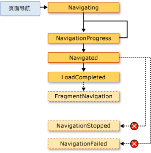  
  
 一般情况下，<xref:System.Windows.Controls.Page>不关心这些事件。 很有可能，应用程序而言，与之和，出于此原因，会引发这些事件还通过<xref:System.Windows.Application>类：  
  
-   <xref:System.Windows.Application.Navigating?displayProperty=nameWithType>  
  
-   <xref:System.Windows.Application.NavigationProgress?displayProperty=nameWithType>  
  
-   <xref:System.Windows.Application.Navigated?displayProperty=nameWithType>  
  
-   <xref:System.Windows.Application.NavigationFailed?displayProperty=nameWithType>  
  
-   <xref:System.Windows.Application.NavigationStopped?displayProperty=nameWithType>  
  
-   <xref:System.Windows.Application.LoadCompleted?displayProperty=nameWithType>  
  
-   <xref:System.Windows.Application.FragmentNavigation?displayProperty=nameWithType>  
  
 每次<xref:System.Windows.Navigation.NavigationService>引发事件时，<xref:System.Windows.Application>类引发相应事件。 <xref:System.Windows.Controls.Frame> 和<xref:System.Windows.Navigation.NavigationWindow>提供相同的事件来检测其各自的范围内的导航。  
  
 在某些情况下，<xref:System.Windows.Controls.Page>可能会对这些事件感兴趣。 例如，<xref:System.Windows.Controls.Page>可能会处理<xref:System.Windows.Navigation.NavigationService.Navigating?displayProperty=nameWithType>事件以确定是否取消导航从其自身。 这在下面的示例中显示。  
  
 [!code-xaml[NavigationOverviewSnippets#CancelNavigationPageXAML](../../../../samples/snippets/csharp/VS_Snippets_Wpf/NavigationOverviewSnippets/CSharp/CancelNavigationPage.xaml#cancelnavigationpagexaml)]  
  
 [!code-csharp[NavigationOverviewSnippets#CancelNavigationPageCODEBEHIND](../../../../samples/snippets/csharp/VS_Snippets_Wpf/NavigationOverviewSnippets/CSharp/CancelNavigationPage.xaml.cs#cancelnavigationpagecodebehind)]
 [!code-vb[NavigationOverviewSnippets#CancelNavigationPageCODEBEHIND](../../../../samples/snippets/visualbasic/VS_Snippets_Wpf/NavigationOverviewSnippets/VisualBasic/CancelNavigationPage.xaml.vb#cancelnavigationpagecodebehind)]  
  
 如果您使用中的导航事件注册一个处理程序<xref:System.Windows.Controls.Page>，如前面的示例，必须同时取消注册事件处理程序。 如果不这样做，可能与如何相关的副作用[!INCLUDE[TLA2#tla_wpf](../../../../includes/tla2sharptla-wpf-md.md)]记住<xref:System.Windows.Controls.Page>使用日志导航。  
  
   
### 使用日志记住导航  
 [!INCLUDE[TLA2#tla_wpf](../../../../includes/tla2sharptla-wpf-md.md)] 使用两个堆栈来记住导航过的页：后退堆栈和前进堆栈。 当您导航从当前<xref:System.Windows.Controls.Page>到新<xref:System.Windows.Controls.Page>或前进到现有<xref:System.Windows.Controls.Page>，当前<xref:System.Windows.Controls.Page>添加到*back 堆栈*。 当您导航从当前<xref:System.Windows.Controls.Page>于前一<xref:System.Windows.Controls.Page>，当前<xref:System.Windows.Controls.Page>添加到*前进堆栈*。 后退堆栈、前进堆栈和管理它们的功能统称为日志。 后退堆栈和前进堆栈中的每一项是的一个实例<xref:System.Windows.Navigation.JournalEntry>类，并被称为*日记条目*。  
  
#### 从 Internet Explorer 导航日志  
 从概念上讲，日志的操作相同的方式**回**并**向前**中的按钮[!INCLUDE[TLA2#tla_ie](../../../../includes/tla2sharptla-ie-md.md)]执行操作。 这些在下图中显示。  
  
   
  
 有关[!INCLUDE[TLA2#tla_xbap#plural](../../../../includes/tla2sharptla-xbapsharpplural-md.md)]由承载[!INCLUDE[TLA2#tla_ie](../../../../includes/tla2sharptla-ie-md.md)]，[!INCLUDE[TLA2#tla_wpf](../../../../includes/tla2sharptla-wpf-md.md)]将日志集成到导航[!INCLUDE[TLA2#tla_ui](../../../../includes/tla2sharptla-ui-md.md)]的[!INCLUDE[TLA2#tla_ie](../../../../includes/tla2sharptla-ie-md.md)]。 这使用户能够导航中的页面[!INCLUDE[TLA2#tla_xbap](../../../../includes/tla2sharptla-xbap-md.md)]通过使用**回**，**转发**，和**最新页**中的按钮[!INCLUDE[TLA2#tla_ie](../../../../includes/tla2sharptla-ie-md.md)]。 日志未集成到[!INCLUDE[TLA2#tla_ie6](../../../../includes/tla2sharptla-ie6-md.md)]同样适用于[!INCLUDE[TLA2#tla_ie7](../../../../includes/tla2sharptla-ie7-md.md)]或 Internet Explorer 8。 相反，[!INCLUDE[TLA2#tla_wpf](../../../../includes/tla2sharptla-wpf-md.md)]呈现一个替代导航[!INCLUDE[TLA2#tla_ui](../../../../includes/tla2sharptla-ui-md.md)]。  
  
> [!IMPORTANT]
>  在中[!INCLUDE[TLA2#tla_ie](../../../../includes/tla2sharptla-ie-md.md)]中，当用户导航离开并返回到[!INCLUDE[TLA2#tla_xbap](../../../../includes/tla2sharptla-xbap-md.md)]，只有不保持活动状态的页的日记条目保留在日志。 有关使页保持活动状态的讨论，请参阅[页生存期和日志](#PageLifetime)本主题中更高版本。  
  
 默认情况下，每个文本<xref:System.Windows.Controls.Page>中显示**最新网页**系列[!INCLUDE[TLA2#tla_ie](../../../../includes/tla2sharptla-ie-md.md)]是[!INCLUDE[TLA2#tla_uri](../../../../includes/tla2sharptla-uri-md.md)]为<xref:System.Windows.Controls.Page>。 很多情况下这对用户并没有什么特殊的意义。 幸运的是，可以使用以下选项更改文本：  
  
1.  附加`JournalEntry.Name`属性值。  
  
2.  `Page.Title`属性值。  
  
3.  `Page.WindowTitle`属性值和[!INCLUDE[TLA2#tla_uri](../../../../includes/tla2sharptla-uri-md.md)]当前<xref:System.Windows.Controls.Page>。  
  
4.  当前 [!INCLUDE[TLA2#tla_uri](../../../../includes/tla2sharptla-uri-md.md)] 的 <xref:System.Windows.Controls.Page>。 (默认)  
  
 选项列出的顺序和查找文本的优先级顺序一致。 例如，如果`JournalEntry.Name`，则将忽略其他值。  
  
 下面的示例使用`Page.Title`特性来更改日志条目显示的文本。  
  
 [!code-xaml[NavigationOverviewSnippets#PageTitleMARKUP1](../../../../samples/snippets/csharp/VS_Snippets_Wpf/NavigationOverviewSnippets/CSharp/PageWithTitle.xaml#pagetitlemarkup1)]  
[!code-xaml[NavigationOverviewSnippets#PageTitleMARKUP2](../../../../samples/snippets/csharp/VS_Snippets_Wpf/NavigationOverviewSnippets/CSharp/PageWithTitle.xaml#pagetitlemarkup2)]  
  
 [!code-csharp[NavigationOverviewSnippets#PageTitleCODEBEHIND1](../../../../samples/snippets/csharp/VS_Snippets_Wpf/NavigationOverviewSnippets/CSharp/PageWithTitle.xaml.cs#pagetitlecodebehind1)]
 [!code-vb[NavigationOverviewSnippets#PageTitleCODEBEHIND1](../../../../samples/snippets/visualbasic/VS_Snippets_Wpf/NavigationOverviewSnippets/VisualBasic/PageWithTitle.xaml.vb#pagetitlecodebehind1)]  
[!code-csharp[NavigationOverviewSnippets#PageTitleCODEBEHIND2](../../../../samples/snippets/csharp/VS_Snippets_Wpf/NavigationOverviewSnippets/CSharp/PageWithTitle.xaml.cs#pagetitlecodebehind2)]
[!code-vb[NavigationOverviewSnippets#PageTitleCODEBEHIND2](../../../../samples/snippets/visualbasic/VS_Snippets_Wpf/NavigationOverviewSnippets/VisualBasic/PageWithTitle.xaml.vb#pagetitlecodebehind2)]  
  
#### 使用 WPF 导航日志  
 用户可以通过使用导航日记**回**，**向前**，和**最新页**中[!INCLUDE[TLA2#tla_ie](../../../../includes/tla2sharptla-ie-md.md)]，还可导航同时使用日志提供的声明性和编程机制[!INCLUDE[TLA2#tla_wpf](../../../../includes/tla2sharptla-wpf-md.md)]。 若要执行此操作的原因之一是提供自定义导航[!INCLUDE[TLA2#tla_ui#plural](../../../../includes/tla2sharptla-uisharpplural-md.md)]在页面中。  
  
 您可以使用公开的导航命令以声明方式添加日志导航支持<xref:System.Windows.Input.NavigationCommands>。 下面的示例演示如何使用`BrowseBack`导航命令。  
  
 [!code-xaml[NavigationOverviewSnippets#NavigationCommandsPageXAML1](../../../../samples/snippets/csharp/VS_Snippets_Wpf/NavigationOverviewSnippets/CSharp/NavigationCommandsPage.xaml#navigationcommandspagexaml1)]  
[!code-xaml[NavigationOverviewSnippets#NavigationCommandsPageXAML2](../../../../samples/snippets/csharp/VS_Snippets_Wpf/NavigationOverviewSnippets/CSharp/NavigationCommandsPage.xaml#navigationcommandspagexaml2)]  
[!code-xaml[NavigationOverviewSnippets#NavigationCommandsPageXAML3](../../../../samples/snippets/csharp/VS_Snippets_Wpf/NavigationOverviewSnippets/CSharp/NavigationCommandsPage.xaml#navigationcommandspagexaml3)]  
[!code-xaml[NavigationOverviewSnippets#NavigationCommandsPageXAML4](../../../../samples/snippets/csharp/VS_Snippets_Wpf/NavigationOverviewSnippets/CSharp/NavigationCommandsPage.xaml#navigationcommandspagexaml4)]  
  
 您可以使用的以下成员之一以编程方式导航日志<xref:System.Windows.Navigation.NavigationService>类：  
  
-   <xref:System.Windows.Navigation.NavigationService.GoBack%2A>  
  
-   <xref:System.Windows.Navigation.NavigationService.GoForward%2A>  
  
-   <xref:System.Windows.Navigation.NavigationService.CanGoBack%2A>  
  
-   <xref:System.Windows.Navigation.NavigationService.CanGoForward%2A>  
  
 此外可以以编程方式，如中所述操作日记[保留导航历史记录的内容状态](#RetainingContentStateWithNavigationHistory)本主题中更高版本。  
  
   
### 页生存期和日志  
 请考虑[!INCLUDE[TLA2#tla_xbap](../../../../includes/tla2sharptla-xbap-md.md)]利用包含丰富内容的多个页面，其中包括图形、 动画和媒体。 这类页的内存占用量可能相当大，尤其是使用视频和音频媒体的时候。 考虑到日志"记住"导航到，此类的页面[!INCLUDE[TLA2#tla_xbap](../../../../includes/tla2sharptla-xbap-md.md)]会快速消耗的内存量较大且明显。  
  
 出于此原因，日志的默认行为是存储<xref:System.Windows.Controls.Page>中每个日志条目而不是对引用的元数据<xref:System.Windows.Controls.Page>对象。 导航日记条目后，其<xref:System.Windows.Controls.Page>元数据用于创建指定的新实例<xref:System.Windows.Controls.Page>。 因此，每个<xref:System.Windows.Controls.Page>的导航已由下图所示的生存期。  
  
 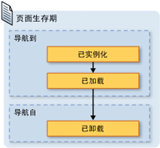  
  
 尽管使用默认的日志记录行为可以减少内存消耗，每个页面呈现性能可能会降低;呈现<xref:System.Windows.Controls.Page>可以很耗时，尤其当它有很多内容。 如果需要保留<xref:System.Windows.Controls.Page>实例在日志中，您可以绘制两种技术来执行此操作。 首先，您可以以编程方式导航到<xref:System.Windows.Controls.Page>对象通过调用<xref:System.Windows.Navigation.NavigationService.Navigate%2A?displayProperty=nameWithType>方法。  
  
 其次，您可以指定[!INCLUDE[TLA2#tla_wpf](../../../../includes/tla2sharptla-wpf-md.md)]保留的实例<xref:System.Windows.Controls.Page>中通过设置日志<xref:System.Windows.Controls.Page.KeepAlive%2A>属性设置为`true`(默认值是`false`)。 下面的示例中所示，可以设置<xref:System.Windows.Controls.Page.KeepAlive%2A>以声明方式在标记中。  
  
 [!code-xaml[NavigationOverviewSnippets#KeepAlivePageXAML](../../../../samples/snippets/csharp/VS_Snippets_Wpf/NavigationOverviewSnippets/CSharp/KeepAlivePage.xaml#keepalivepagexaml)]  
  
 生存期<xref:System.Windows.Controls.Page>，它是保持活动状态，是从一个不是略有不同。 第一次<xref:System.Windows.Controls.Page>保持导航到处于活动状态，就像实例化<xref:System.Windows.Controls.Page>不保持为活动状态。 但是，因为实例<xref:System.Windows.Controls.Page>保留在日志中，它永远不会再次实例化，只要它保留在日志中。 因此，如果<xref:System.Windows.Controls.Page>具有需要每次调用的初始化逻辑<xref:System.Windows.Controls.Page>导航时，您应将其从移动构造函数的处理程序到<xref:System.Windows.FrameworkElement.Loaded>事件。 下图中所示<xref:System.Windows.FrameworkElement.Loaded>并<xref:System.Windows.FrameworkElement.Unloaded>仍会每次都引发事件<xref:System.Windows.Controls.Page>分别导航到和从。  
  
 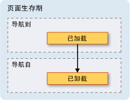  
  
 当<xref:System.Windows.Controls.Page>不是保持活动状态，不应执行下列操作之一：  
  
-   存储对它或它的任何部分的引用。  
  
-   将事件处理程序注册到并非由其实现的事件。  
  
 执行以下任一操作将创建引用，强制<xref:System.Windows.Controls.Page>要保留在内存中，即使已从日志中删除它。  
  
 一般情况下，您应优先使用默认值<xref:System.Windows.Controls.Page>行为，即不使<xref:System.Windows.Controls.Page>保持活动状态。 但是，这会存在将在下一节中讨论的状态影响。  
  
   
### 保留导航历史记录的内容状态  
 如果<xref:System.Windows.Controls.Page>不保持活动状态，并且具有从用户，如果用户导航离开并返回到，数据会发生什么情况收集数据的控件<xref:System.Windows.Controls.Page>？ 从用户体验角度，用户应该会希望看到他们以前输入的数据。 遗憾的是，因为的新实例<xref:System.Windows.Controls.Page>创建与每个导航栏中，数据都会收集，并且会丢失数据的控件。  
  
 幸运的是，该日志提供支持以记住跨数据<xref:System.Windows.Controls.Page>导航，包括控件的数据。 具体而言，每个日志条目<xref:System.Windows.Controls.Page>充当关联的临时容器<xref:System.Windows.Controls.Page>状态。 以下步骤概述了如何使用这种支持时<xref:System.Windows.Controls.Page>从导航到：  
  
1.  当前的条目<xref:System.Windows.Controls.Page>添加到日志。  
  
2.  状态<xref:System.Windows.Controls.Page>存储该页面，添加到后退堆栈的日志条目。  
  
3.  新<xref:System.Windows.Controls.Page>导航到。  
  
 当页面<xref:System.Windows.Controls.Page>是向后导航，使用日志，发生以下步骤：  
  
1.  <xref:System.Windows.Controls.Page>实例化 （back 堆栈上的最顶部日志条目）。  
  
2.  <xref:System.Windows.Controls.Page>是使用保存在一起的日记条目的状态刷新<xref:System.Windows.Controls.Page>。  
  
3.  <xref:System.Windows.Controls.Page>向后导航。  
  
 [!INCLUDE[TLA2#tla_wpf](../../../../includes/tla2sharptla-wpf-md.md)] 在中使用以下控件时将自动使用这种支持<xref:System.Windows.Controls.Page>:  
  
-   <xref:System.Windows.Controls.CheckBox>  
  
-   <xref:System.Windows.Controls.ComboBox>  
  
-   <xref:System.Windows.Controls.Expander>  
  
-   <xref:System.Windows.Controls.Frame>  
  
-   <xref:System.Windows.Controls.ListBox>  
  
-   <xref:System.Windows.Controls.ListBoxItem>  
  
-   <xref:System.Windows.Controls.MenuItem>  
  
-   <xref:System.Windows.Controls.ProgressBar>  
  
-   <xref:System.Windows.Controls.RadioButton>  
  
-   <xref:System.Windows.Controls.Slider>  
  
-   <xref:System.Windows.Controls.TabControl>  
  
-   <xref:System.Windows.Controls.TabItem>  
  
-   <xref:System.Windows.Controls.TextBox>  
  
 如果<xref:System.Windows.Controls.Page>使用这些控件，输入的数据会记住跨<xref:System.Windows.Controls.Page>导航，如所示**喜爱的颜色**<xref:System.Windows.Controls.ListBox>下图中。  
  
   
  
 当<xref:System.Windows.Controls.Page>具有未列出的在上述列表中，控件或当状态存储在自定义对象，您需要自己编写代码，从而使日志来记住跨状态<xref:System.Windows.Controls.Page>导航。  
  
 如果您需要记住小段状态跨<xref:System.Windows.Controls.Page>导航，您可以使用依赖关系属性 (请参阅<xref:System.Windows.DependencyProperty>) 配置了<xref:System.Windows.FrameworkPropertyMetadata.Journal%2A?displayProperty=nameWithType>元数据的标志。  
  
 如果状态，你<xref:System.Windows.Controls.Page>需要跨导航记住包含多个数据段，您可能会发现它更少的代码密集型将状态封装在一个类并实现<xref:System.Windows.Navigation.IProvideCustomContentState>接口。  
  
 如果需要不同状态中的单个导航<xref:System.Windows.Controls.Page>，而无需从导航<xref:System.Windows.Controls.Page>本身，可以使用<xref:System.Windows.Navigation.IProvideCustomContentState>和<xref:System.Windows.Navigation.NavigationService.AddBackEntry%2A?displayProperty=nameWithType>。  
  
   
### Cookie  
 另一个的方式[!INCLUDE[TLA2#tla_wpf](../../../../includes/tla2sharptla-wpf-md.md)]应用程序可以将数据存储是使用 cookie，创建、 更新和删除通过<xref:System.Windows.Application.SetCookie%2A>和<xref:System.Windows.Application.GetCookie%2A>方法。 可以在中创建的 cookie [!INCLUDE[TLA2#tla_wpf](../../../../includes/tla2sharptla-wpf-md.md)] cookie 一样，其他类型的 Web 应用程序使用; cookie 是任意客户端计算机上应用程序期间或在不同的应用程序会话存储的数据片段。 Cookie 数据通常采用以下格式的名称/值对的形式。  
  
 *Name* `=` *Value*  
  
 当将数据传递给<xref:System.Windows.Application.SetCookie%2A>，连同<xref:System.Uri>cookie 在内存中，创建的应为其设置 cookie 的位置，并且仅可为当前应用程序会话的持续时间。 此类 cookie 称为*会话 cookie*。  
  
 要跨应用程序会话存储 cookie，必须使用以下格式将到期日期添加到 cookie。  
  
 *NAME* `=` *VALUE* `; expires=DAY, DD-MMM-YYYY HH:MM:SS GMT`  
  
 到期日期使用 cookie 存储在当前[!INCLUDE[TLA#tla_mswin](../../../../includes/tlasharptla-mswin-md.md)]在 cookie 过期之前安装的 Temporary Internet Files 文件夹。 此类 cookie 称为*持久性 cookie*因为它在应用程序会话之间保留。  
  
 通过调用检索会话和持久性 cookie<xref:System.Windows.Application.GetCookie%2A>方法，传递<xref:System.Uri>其中与设置 cookie 的位置的<xref:System.Windows.Application.SetCookie%2A>方法。  
  
 以下是一些在支持 cookie 的方式[!INCLUDE[TLA2#tla_wpf](../../../../includes/tla2sharptla-wpf-md.md)]:  
  
-   [!INCLUDE[TLA2#tla_wpf](../../../../includes/tla2sharptla-wpf-md.md)] 独立应用程序和[!INCLUDE[TLA2#tla_xbap#plural](../../../../includes/tla2sharptla-xbapsharpplural-md.md)]都可以创建和管理 cookie。  
  
-   创建的 cookie[!INCLUDE[TLA2#tla_xbap](../../../../includes/tla2sharptla-xbap-md.md)]可以从浏览器访问。  
  
-   来自相同域的 [!INCLUDE[TLA2#tla_xbap#plural](../../../../includes/tla2sharptla-xbapsharpplural-md.md)] 可以创建和共享 cookie。  
  
-   [!INCLUDE[TLA2#tla_xbap#plural](../../../../includes/tla2sharptla-xbapsharpplural-md.md)] 和[!INCLUDE[TLA2#tla_html](../../../../includes/tla2sharptla-html-md.md)]同一个域中的页面可以创建和共享 cookie。  
  
-   调度 cookie 时[!INCLUDE[TLA2#tla_xbap#plural](../../../../includes/tla2sharptla-xbapsharpplural-md.md)]和宽松[!INCLUDE[TLA2#tla_xaml](../../../../includes/tla2sharptla-xaml-md.md)]页发出 Web 请求。  
  
-   顶级[!INCLUDE[TLA2#tla_xbap#plural](../../../../includes/tla2sharptla-xbapsharpplural-md.md)]和[!INCLUDE[TLA2#tla_xbap#plural](../../../../includes/tla2sharptla-xbapsharpplural-md.md)]托管在 IFRAME 可以访问 cookie。  
  
-   中的 cookie 支持[!INCLUDE[TLA2#tla_wpf](../../../../includes/tla2sharptla-wpf-md.md)]是相同的所有支持的浏览器。  
  
-   在中[!INCLUDE[TLA2#tla_ie](../../../../includes/tla2sharptla-ie-md.md)]，于 cookie 的 P3P 策略遵循[!INCLUDE[TLA2#tla_wpf](../../../../includes/tla2sharptla-wpf-md.md)]，特别是涉及第一方和第三方[!INCLUDE[TLA2#tla_xbap#plural](../../../../includes/tla2sharptla-xbapsharpplural-md.md)]。  
  
   
### 结构化导航  
 如果你需要将数据从一个传递<xref:System.Windows.Controls.Page>到另一个，您可以将数据作为参数传递给非默认构造函数的<xref:System.Windows.Controls.Page>。 请注意，是否使用此方法，则必须保持<xref:System.Windows.Controls.Page>处于活动状态; 如果不是，下次导航到<xref:System.Windows.Controls.Page>，[!INCLUDE[TLA2#tla_wpf](../../../../includes/tla2sharptla-wpf-md.md)]重新实例化<xref:System.Windows.Controls.Page>使用默认构造函数。  
  
 或者，你<xref:System.Windows.Controls.Page>可以实现需要传递的数据设置的属性。 事情就变得复杂，但是，当<xref:System.Windows.Controls.Page>需要将数据传回给<xref:System.Windows.Controls.Page>，导航到它。 问题是导航本身并不保证的支持机制<xref:System.Windows.Controls.Page>后从导航将返回到。 实质上，导航不支持调用/返回语义。 若要解决此问题，请[!INCLUDE[TLA2#tla_wpf](../../../../includes/tla2sharptla-wpf-md.md)]提供了<xref:System.Windows.Navigation.PageFunction%601>类，该类可以用于确保<xref:System.Windows.Controls.Page>以可预测和结构化方式返回到。 有关详细信息，请参阅[结构化导航概述](../../../../docs/framework/wpf/app-development/structured-navigation-overview.md)。  
  
   
## NavigationWindow 类  
 到目前为止，你已全面了解最有可能用可导航内容生成应用程序的导航服务。 这些服务所述的上下文[!INCLUDE[TLA2#tla_xbap#plural](../../../../includes/tla2sharptla-xbapsharpplural-md.md)]，但它们并不局限于[!INCLUDE[TLA2#tla_xbap#plural](../../../../includes/tla2sharptla-xbapsharpplural-md.md)]。 现代操作系统和 Windows 应用程序充分利用现代用户将浏览器样式导航并入独立应用程序的浏览器体验。 常见示例包括：  
  
-   **Word 同义词库**:导航字选择。  
  
-   **文件资源管理器**:文件和文件夹导航。  
  
-   **向导**:细分复杂的任务分为多页，可以在它们之间导航。 例如，Windows 组件向导处理添加和删除 Windows 功能。  
  
 若要将浏览器样式导航并入独立应用程序，可以使用<xref:System.Windows.Navigation.NavigationWindow>类。 <xref:System.Windows.Navigation.NavigationWindow> 派生自<xref:System.Windows.Window>并将其扩展具有相同支持进行导航的[!INCLUDE[TLA2#tla_xbap#plural](../../../../includes/tla2sharptla-xbapsharpplural-md.md)]提供。 可以使用<xref:System.Windows.Navigation.NavigationWindow>作为独立应用程序中任一的主窗口或对话框之类的次窗口。  
  
 若要实现<xref:System.Windows.Navigation.NavigationWindow>，如同处理中的大多数顶级类[!INCLUDE[TLA2#tla_wpf](../../../../includes/tla2sharptla-wpf-md.md)](<xref:System.Windows.Window>， <xref:System.Windows.Controls.Page>，依此类推)，使用标记和代码隐藏的组合。 这在下面的示例中显示。  
  
 [!code-xaml[IntroToNavNavigationWindowSnippets#NavigationWindowMARKUP](../../../../samples/snippets/csharp/VS_Snippets_Wpf/IntroToNavNavigationWindowSnippets/CSharp/MainWindow.xaml#navigationwindowmarkup)]  
  
 [!code-csharp[IntroToNavNavigationWindowSnippets#NavigationWindowCODEBEHIND](../../../../samples/snippets/csharp/VS_Snippets_Wpf/IntroToNavNavigationWindowSnippets/CSharp/MainWindow.xaml.cs#navigationwindowcodebehind)]
 [!code-vb[IntroToNavNavigationWindowSnippets#NavigationWindowCODEBEHIND](../../../../samples/snippets/visualbasic/VS_Snippets_Wpf/IntroToNavNavigationWindowSnippets/VisualBasic/MainWindow.xaml.vb#navigationwindowcodebehind)]  
  
 此代码将创建<xref:System.Windows.Navigation.NavigationWindow>自动导航到<xref:System.Windows.Controls.Page>(HomePage.xaml) 时<xref:System.Windows.Navigation.NavigationWindow>打开。 如果<xref:System.Windows.Navigation.NavigationWindow>是主应用程序窗口中，可以使用`StartupUri`属性启动。 这在以下标记中显示。  
  
 [!code-xaml[IntroToNavNavigationWindowSnippets#AppLaunchNavWindow](../../../../samples/snippets/csharp/VS_Snippets_Wpf/IntroToNavNavigationWindowSnippets/CSharp/App.xaml#applaunchnavwindow)]  
  
 下图显示<xref:System.Windows.Navigation.NavigationWindow>作为独立的应用程序的主窗口。  
  
   
  
 从图中，可以看到<xref:System.Windows.Navigation.NavigationWindow>具有标题，即使它不设置<xref:System.Windows.Navigation.NavigationWindow>前面的示例中的实现代码。 相反，使用设置标题<xref:System.Windows.Controls.Page.WindowTitle%2A>属性，以下代码所示。  
  
 [!code-xaml[IntroToNavNavigationWindowSnippets#HomePageMARKUP1](../../../../samples/snippets/csharp/VS_Snippets_Wpf/IntroToNavNavigationWindowSnippets/CSharp/HomePage.xaml#homepagemarkup1)]  
[!code-xaml[IntroToNavNavigationWindowSnippets#HomePageMARKUP2](../../../../samples/snippets/csharp/VS_Snippets_Wpf/IntroToNavNavigationWindowSnippets/CSharp/HomePage.xaml#homepagemarkup2)]  
  
 设置<xref:System.Windows.Controls.Page.WindowWidth%2A>并<xref:System.Windows.Controls.Page.WindowHeight%2A>属性还会影响<xref:System.Windows.Navigation.NavigationWindow>。  
  
 通常情况下，您实现您自己<xref:System.Windows.Navigation.NavigationWindow>当需要进行自定义其行为或外观。 如果没有执行上述操作，则可以使用快捷方式。 如果指定的包[!INCLUDE[TLA2#tla_uri](../../../../includes/tla2sharptla-uri-md.md)]的<xref:System.Windows.Controls.Page>作为<xref:System.Windows.Application.StartupUri%2A>独立的应用程序，在<xref:System.Windows.Application>会自动创建<xref:System.Windows.Navigation.NavigationWindow>主机到<xref:System.Windows.Controls.Page>。 以下标记显示如何实现此功能。  
  
 [!code-xaml[IntroToNavNavigationWindowSnippets#AppLaunchPage](../../../../samples/snippets/csharp/VS_Snippets_Wpf/IntroToNavNavigationWindowSnippets/CSharp/AnotherApp.xaml#applaunchpage)]  
  
 如果希望类似对话框是一个辅助应用程序窗口<xref:System.Windows.Navigation.NavigationWindow>，可以在下面的示例中使用代码以将其打开。  
  
 [!code-csharp[IntroToNavNavigationWindowSnippets#CreateNWDialogBox](../../../../samples/snippets/csharp/VS_Snippets_Wpf/IntroToNavNavigationWindowSnippets/CSharp/DialogOwnerWindow.xaml.cs#createnwdialogbox)]
 [!code-vb[IntroToNavNavigationWindowSnippets#CreateNWDialogBox](../../../../samples/snippets/visualbasic/VS_Snippets_Wpf/IntroToNavNavigationWindowSnippets/VisualBasic/DialogOwnerWindow.xaml.vb#createnwdialogbox)]  
  
 下图显示结果。  
  
   
  
 正如您所看到的<xref:System.Windows.Navigation.NavigationWindow>将显示[!INCLUDE[TLA2#tla_ie](../../../../includes/tla2sharptla-ie-md.md)]-样式**回**并**向前**按钮，允许用户导航日志。 这些按钮提供相同的用户体验，如下图所示。  
  
   
  
 如果您的页面提供自己的日志导航支持和 UI，则可以隐藏**回**和**向前**情况下显示的按钮<xref:System.Windows.Navigation.NavigationWindow>的值设置<xref:System.Windows.Navigation.NavigationWindow.ShowsNavigationUI%2A>属性设置为`false`.  
  
 或者，可以使用自定义项中的支持[!INCLUDE[TLA2#tla_wpf](../../../../includes/tla2sharptla-wpf-md.md)]来替换[!INCLUDE[TLA2#tla_ui](../../../../includes/tla2sharptla-ui-md.md)]的<xref:System.Windows.Navigation.NavigationWindow>本身。  
  
   
## 框架类  
 这两个浏览器和<xref:System.Windows.Navigation.NavigationWindow>是该主机可导航内容的窗口。 在某些情况下，应用程序具有无需整个窗口托管的内容。 相反，此类内容在其他内容中托管。 您可以通过使用可导航内容插入到其他内容<xref:System.Windows.Controls.Frame>类。 <xref:System.Windows.Controls.Frame> 提供了相同的支持<xref:System.Windows.Navigation.NavigationWindow>和[!INCLUDE[TLA2#tla_xbap#plural](../../../../includes/tla2sharptla-xbapsharpplural-md.md)]。  
  
 下面的示例演示如何添加<xref:System.Windows.Controls.Frame>到<xref:System.Windows.Controls.Page>以声明方式使用`Frame`元素。  
  
 [!code-xaml[NavigationOverviewSnippets#FrameHostPageXAML1](../../../../samples/snippets/csharp/VS_Snippets_Wpf/NavigationOverviewSnippets/CSharp/FrameHostPage.xaml#framehostpagexaml1)]  
[!code-xaml[NavigationOverviewSnippets#FrameHostPageXAML2](../../../../samples/snippets/csharp/VS_Snippets_Wpf/NavigationOverviewSnippets/CSharp/FrameHostPage.xaml#framehostpagexaml2)]  
[!code-xaml[NavigationOverviewSnippets#FrameHostPageXAML3](../../../../samples/snippets/csharp/VS_Snippets_Wpf/NavigationOverviewSnippets/CSharp/FrameHostPage.xaml#framehostpagexaml3)]  
  
 此标记将设置`Source`的属性`Frame`元素的 pack[!INCLUDE[TLA2#tla_uri](../../../../includes/tla2sharptla-uri-md.md)]有关<xref:System.Windows.Controls.Page>的<xref:System.Windows.Controls.Frame>最初应导航到。 下图显示[!INCLUDE[TLA2#tla_xbap](../../../../includes/tla2sharptla-xbap-md.md)]与<xref:System.Windows.Controls.Page>具有<xref:System.Windows.Controls.Frame>的具有多页间导航。  
  
 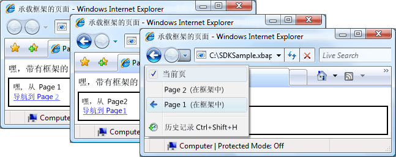  
  
 不只需使用<xref:System.Windows.Controls.Frame>的内容中<xref:System.Windows.Controls.Page>。 它也是很常见承载<xref:System.Windows.Controls.Frame>的内容中<xref:System.Windows.Window>。  
  
 默认情况下，<xref:System.Windows.Controls.Frame>仅在缺少其他日志中使用它自己的日志。 如果<xref:System.Windows.Controls.Frame>是内部承载的内容的一部分<xref:System.Windows.Navigation.NavigationWindow>或[!INCLUDE[TLA2#tla_xbap](../../../../includes/tla2sharptla-xbap-md.md)]，<xref:System.Windows.Controls.Frame>使用属于日志<xref:System.Windows.Navigation.NavigationWindow>或[!INCLUDE[TLA2#tla_xbap](../../../../includes/tla2sharptla-xbap-md.md)]。 有时，不过，<xref:System.Windows.Controls.Frame>可能需要负责它自己的日志。 若要执行此操作的原因之一是允许通过托管的页内的日志导航<xref:System.Windows.Controls.Frame>。 这由下图说明。  
  
 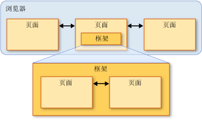  
  
 在这种情况下，你可以配置<xref:System.Windows.Controls.Frame>通过设置使用自己的日记<xref:System.Windows.Controls.Frame.JournalOwnership%2A>的属性<xref:System.Windows.Controls.Frame>到<xref:System.Windows.Navigation.JournalOwnership.OwnsJournal>。 这在以下标记中显示。  
  
 [!code-xaml[NavigationOverviewSnippets#FrameHostPageOwnJournalXAML1](../../../../samples/snippets/csharp/VS_Snippets_Wpf/NavigationOverviewSnippets/CSharp/FrameHostPageOwnJournal.xaml#framehostpageownjournalxaml1)]  
[!code-xaml[NavigationOverviewSnippets#FrameHostPageOwnJournalXAML2](../../../../samples/snippets/csharp/VS_Snippets_Wpf/NavigationOverviewSnippets/CSharp/FrameHostPageOwnJournal.xaml#framehostpageownjournalxaml2)]  
[!code-xaml[NavigationOverviewSnippets#FrameHostPageOwnJournalXAML3](../../../../samples/snippets/csharp/VS_Snippets_Wpf/NavigationOverviewSnippets/CSharp/FrameHostPageOwnJournal.xaml#framehostpageownjournalxaml3)]  
  
 下图说明了中导航的效果<xref:System.Windows.Controls.Frame>使用它自己的日志。  
  
 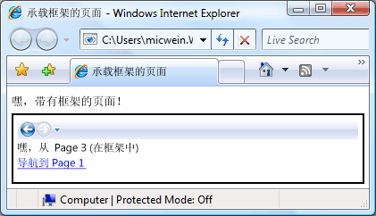  
  
 请注意，日志条目显示此导航[!INCLUDE[TLA2#tla_ui](../../../../includes/tla2sharptla-ui-md.md)]中<xref:System.Windows.Controls.Frame>，而不是通过[!INCLUDE[TLA2#tla_ie](../../../../includes/tla2sharptla-ie-md.md)]。  
  
> [!NOTE]
>  如果<xref:System.Windows.Controls.Frame>是在托管的内容的一部分<xref:System.Windows.Window>，<xref:System.Windows.Controls.Frame>使用它自己的日志，并继而显示自己的导航[!INCLUDE[TLA2#tla_ui](../../../../includes/tla2sharptla-ui-md.md)]。  
  
 如果你的用户体验需要<xref:System.Windows.Controls.Frame>而不显示在导航窗格中提供自己的日记[!INCLUDE[TLA2#tla_ui](../../../../includes/tla2sharptla-ui-md.md)]，可以隐藏导航[!INCLUDE[TLA2#tla_ui](../../../../includes/tla2sharptla-ui-md.md)]通过设置<xref:System.Windows.Controls.Frame.NavigationUIVisibility%2A>到<xref:System.Windows.Visibility.Hidden>。 这在以下标记中显示。  
  
 [!code-xaml[NavigationOverviewSnippets#FrameHostPageHidesUIXAML1](../../../../samples/snippets/csharp/VS_Snippets_Wpf/NavigationOverviewSnippets/CSharp/FrameHostPageOwnHiddenJournal.xaml#framehostpagehidesuixaml1)]  
[!code-xaml[NavigationOverviewSnippets#FrameHostPageHidesUIXAML2](../../../../samples/snippets/csharp/VS_Snippets_Wpf/NavigationOverviewSnippets/CSharp/FrameHostPageOwnHiddenJournal.xaml#framehostpagehidesuixaml2)]  
[!code-xaml[NavigationOverviewSnippets#FrameHostPageHidesUIXAML3](../../../../samples/snippets/csharp/VS_Snippets_Wpf/NavigationOverviewSnippets/CSharp/FrameHostPageOwnHiddenJournal.xaml#framehostpagehidesuixaml3)]  
  
   
## 导航主机  
 <xref:System.Windows.Controls.Frame> 和<xref:System.Windows.Navigation.NavigationWindow>是称为导航主机的类。 一个*导航主机*是一个类，可以导航到并显示内容。 若要实现此目的，每个导航主机都使用其自己<xref:System.Windows.Navigation.NavigationService>和日志。 导航主机的基本构造在下图中显示。  
  
   
  
 实际上，这允许<xref:System.Windows.Navigation.NavigationWindow>和<xref:System.Windows.Controls.Frame>若要提供同一导航支持的[!INCLUDE[TLA2#tla_xbap](../../../../includes/tla2sharptla-xbap-md.md)]托管在浏览器中时。  
  
 除了使用以外<xref:System.Windows.Navigation.NavigationService>和一个日志，导航主机实现相同的成员的<xref:System.Windows.Navigation.NavigationService>实现。 这由下图说明。  
  
 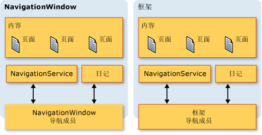  
  
 这就允许直接对它们进行导航支持编程。 如果你需要提供自定义导航，可以考虑这[!INCLUDE[TLA2#tla_ui](../../../../includes/tla2sharptla-ui-md.md)]有关<xref:System.Windows.Controls.Frame>托管在<xref:System.Windows.Window>。 此外，这两种类型实现附加的与导航相关的成员，包括`BackStack`(<xref:System.Windows.Navigation.NavigationWindow.BackStack%2A?displayProperty=nameWithType>， <xref:System.Windows.Controls.Frame.BackStack%2A?displayProperty=nameWithType>) 和`ForwardStack`(<xref:System.Windows.Navigation.NavigationWindow.ForwardStack%2A?displayProperty=nameWithType>， <xref:System.Windows.Controls.Frame.ForwardStack%2A?displayProperty=nameWithType>)，这样便可以枚举中后的日志条目堆栈和前进堆栈，分别。  
  
 如之前提及，应用程序中可以存在不止一个日志。 下图提供何时可能发生这种情况的示例。  
  
   
  
   
## 导航到非 XAML 页内容  
 在本主题中，整个<xref:System.Windows.Controls.Page>和 pack[!INCLUDE[TLA2#tla_xbap#plural](../../../../includes/tla2sharptla-xbapsharpplural-md.md)]已用于演示的各种导航功能[!INCLUDE[TLA2#tla_wpf](../../../../includes/tla2sharptla-wpf-md.md)]。 但是， <xref:System.Windows.Controls.Page> ，它是编译到应用程序不是唯一的可导航到，内容和包类型[!INCLUDE[TLA2#tla_xbap#plural](../../../../includes/tla2sharptla-xbapsharpplural-md.md)]不识别的内容的唯一方法。  
  
 如本部分中所示，您可以导航到松散[!INCLUDE[TLA2#tla_xaml](../../../../includes/tla2sharptla-xaml-md.md)]文件，[!INCLUDE[TLA2#tla_html](../../../../includes/tla2sharptla-html-md.md)]文件和对象。  
  
   
### 导航到松散 XAML 文件  
 松散[!INCLUDE[TLA2#tla_xaml](../../../../includes/tla2sharptla-xaml-md.md)]文件是具有以下特征的文件：  
  
-   仅包含[!INCLUDE[TLA2#tla_xaml](../../../../includes/tla2sharptla-xaml-md.md)]（即无代码）。  
  
-   具有适当的命名空间声明。  
  
-   具有 .xaml 文件扩展名。  
  
 例如，考虑以下内容存储为松散[!INCLUDE[TLA2#tla_xaml](../../../../includes/tla2sharptla-xaml-md.md)]文件 Person.xaml。  
  
 [!code-xaml[NavigationOverviewSnippets#LooseXAML](../../../../samples/snippets/csharp/VS_Snippets_Wpf/NavigationOverviewSnippets/CSharp/Person.xaml#loosexaml)]  
  
 双击该文件时，浏览器打开、导航到并显示内容。 如下图所示。  
  
 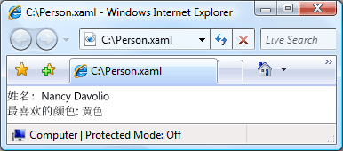  
  
 您可以显示松散[!INCLUDE[TLA2#tla_xaml](../../../../includes/tla2sharptla-xaml-md.md)]从以下文件：  
  
-   本地计算机上的网站、Intranet 或 Internet。  
  
-   一个[!INCLUDE[TLA#tla_unc](../../../../includes/tlasharptla-unc-md.md)]文件共享。  
  
-   本地磁盘。  
  
 松散[!INCLUDE[TLA2#tla_xaml](../../../../includes/tla2sharptla-xaml-md.md)]可以将文件添加到浏览器的收藏夹，也是浏览器的主页。  
  
> [!NOTE]
>  有关发布和启动松散[!INCLUDE[TLA2#tla_xaml](../../../../includes/tla2sharptla-xaml-md.md)]页，请参阅[部署 WPF 应用程序](../../../../docs/framework/wpf/app-development/deploying-a-wpf-application-wpf.md)。  
  
 松散的一个限制[!INCLUDE[TLA2#tla_xaml](../../../../includes/tla2sharptla-xaml-md.md)]是，只能托管可安全地在部分信任环境中运行的内容。 例如，`Window`不能为松散的根元素[!INCLUDE[TLA2#tla_xaml](../../../../includes/tla2sharptla-xaml-md.md)]文件。 有关详细信息，请参阅 [WPF 部分信任安全性](../../../../docs/framework/wpf/wpf-partial-trust-security.md)。  
  
   
### 通过使用框架导航到 HTML 文件  
 正如您所料，也可以导航到[!INCLUDE[TLA2#tla_html](../../../../includes/tla2sharptla-html-md.md)]。 您只需提供[!INCLUDE[TLA2#tla_uri](../../../../includes/tla2sharptla-uri-md.md)]使用 http 方案。 例如，以下[!INCLUDE[TLA2#tla_xaml](../../../../includes/tla2sharptla-xaml-md.md)]显示了<xref:System.Windows.Controls.Frame>导航到[!INCLUDE[TLA2#tla_html](../../../../includes/tla2sharptla-html-md.md)]页。  
  
 [!code-xaml[NavigationOverviewSnippets#FrameHtmlNavMARKUP](../../../../samples/snippets/csharp/VS_Snippets_Wpf/NavigationOverviewSnippets/CSharp/FrameHTMLNavPage.xaml#framehtmlnavmarkup)]  
  
 导航到[!INCLUDE[TLA2#tla_html](../../../../includes/tla2sharptla-html-md.md)]需要特殊权限。 例如，您不能从导航[!INCLUDE[TLA2#tla_xbap](../../../../includes/tla2sharptla-xbap-md.md)]Internet 区域部分信任安全沙箱中运行。 有关详细信息，请参阅 [WPF 部分信任安全性](../../../../docs/framework/wpf/wpf-partial-trust-security.md)。  
  
   
### 通过使用 WebBrowser 控件导航到 HTML 文件  
 <xref:System.Windows.Controls.WebBrowser>控件支持[!INCLUDE[TLA2#tla_html](../../../../includes/tla2sharptla-html-md.md)]文档托管、 导航和脚本/托管代码互操作性。 有关详细信息有关<xref:System.Windows.Controls.WebBrowser>控件，请参阅<xref:System.Windows.Controls.WebBrowser>。  
  
 像<xref:System.Windows.Controls.Frame>，导航到[!INCLUDE[TLA2#tla_html](../../../../includes/tla2sharptla-html-md.md)]使用<xref:System.Windows.Controls.WebBrowser>需要特殊权限。 例如，从部分信任应用程序，您只能导航到[!INCLUDE[TLA2#tla_html](../../../../includes/tla2sharptla-html-md.md)]位于源站点。 有关详细信息，请参阅 [WPF 部分信任安全性](../../../../docs/framework/wpf/wpf-partial-trust-security.md)。  
  
   
### 导航到自定义对象  
 如果必须存储为自定义对象的数据，以显示该数据的一种方法是创建<xref:System.Windows.Controls.Page>绑定到这些对象的内容 (请参阅[数据绑定概述](../../../../docs/framework/wpf/data/data-binding-overview.md))。 如果无需创建整个页面而只要显示对象，则可以直接导航到它们。  
  
 请考虑`Person`在下面的代码中实现的类。  
  
 [!code-csharp[NavigateToObjectSnippets#PersonClassCODE](../../../../samples/snippets/csharp/VS_Snippets_Wpf/NavigateToObjectSnippets/CSharp/Person.cs#personclasscode)]
 [!code-vb[NavigateToObjectSnippets#PersonClassCODE](../../../../samples/snippets/visualbasic/VS_Snippets_Wpf/NavigateToObjectSnippets/VisualBasic/Person.vb#personclasscode)]  
  
 若要导航到它，请调用<xref:System.Windows.Navigation.NavigationWindow.Navigate%2A?displayProperty=nameWithType>方法，如以下代码所示。  
  
 [!code-xaml[NavigateToObjectSnippets#PageThatNavsToObject1](../../../../samples/snippets/csharp/VS_Snippets_Wpf/NavigateToObjectSnippets/CSharp/HomePage.xaml#pagethatnavstoobject1)]  
[!code-xaml[NavigateToObjectSnippets#PageThatNavsToObject2](../../../../samples/snippets/csharp/VS_Snippets_Wpf/NavigateToObjectSnippets/CSharp/HomePage.xaml#pagethatnavstoobject2)]  
[!code-xaml[NavigateToObjectSnippets#PageThatNavsToObject3](../../../../samples/snippets/csharp/VS_Snippets_Wpf/NavigateToObjectSnippets/CSharp/HomePage.xaml#pagethatnavstoobject3)]  
  
 [!code-csharp[NavigateToObjectSnippets#PageThatNavsToObjectCODEBEHIND](../../../../samples/snippets/csharp/VS_Snippets_Wpf/NavigateToObjectSnippets/CSharp/HomePage.xaml.cs#pagethatnavstoobjectcodebehind)]
 [!code-vb[NavigateToObjectSnippets#PageThatNavsToObjectCODEBEHIND](../../../../samples/snippets/visualbasic/VS_Snippets_Wpf/NavigateToObjectSnippets/VisualBasic/HomePage.xaml.vb#pagethatnavstoobjectcodebehind)]  
  
 下图显示结果。  
  
 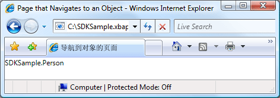  
  
 从此图可以看出，没有显示任何有用信息。 事实上，显示的值是返回值`ToString`方法**Person**对象; 默认情况下，这是唯一值的[!INCLUDE[TLA2#tla_wpf](../../../../includes/tla2sharptla-wpf-md.md)]可以使用来表示您的对象。 可以重写`ToString`方法以返回更有意义的信息，尽管它仍将只能是一个字符串值。 可以使用的一种利用演示功能的[!INCLUDE[TLA2#tla_wpf](../../../../includes/tla2sharptla-wpf-md.md)]是使用数据模板。 您可以实现一个数据模板的[!INCLUDE[TLA2#tla_wpf](../../../../includes/tla2sharptla-wpf-md.md)]可以将与特定类型的对象相关联。 下面的代码演示的数据模板`Person`对象。  
  
 [!code-xaml[NavigateToObjectSnippets#DataTemplateMARKUP](../../../../samples/snippets/csharp/VS_Snippets_Wpf/NavigateToObjectSnippets/CSharp/App.xaml#datatemplatemarkup)]  
  
 在这里，数据模板相关联`Person`通过使用类型`x:Type`中的标记扩展`DataType`属性。 数据模板然后将绑定`TextBlock`元素 (请参阅<xref:System.Windows.Controls.TextBlock>) 的属性`Person`类。 下图显示了更新后的外观`Person`对象。  
  
 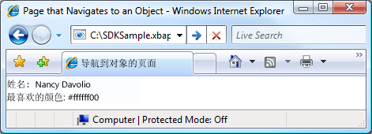  
  
 此技术的优势之一在于能够通过重复使用数据模板以在应用程序任意位置一致地显示对象而获得一致性。  
  
 有关数据模板的详细信息，请参阅[数据模板化概述](../../../../docs/framework/wpf/data/data-templating-overview.md)。  
  
   
## 安全性  
 [!INCLUDE[TLA2#tla_wpf](../../../../includes/tla2sharptla-wpf-md.md)] 导航支持允许[!INCLUDE[TLA2#tla_xbap#plural](../../../../includes/tla2sharptla-xbapsharpplural-md.md)]以导航到跨 Internet，而且它允许应用程序来承载第三方内容。 若要从有害行为影响，保护应用程序和用户[!INCLUDE[TLA2#tla_wpf](../../../../includes/tla2sharptla-wpf-md.md)]提供了各种中讨论的安全功能[安全](../../../../docs/framework/wpf/security-wpf.md)和[WPF 部分信任安全性](../../../../docs/framework/wpf/wpf-partial-trust-security.md)。  
  
## 请参阅
- <xref:System.Windows.Application.SetCookie%2A>
- <xref:System.Windows.Application.GetCookie%2A>
- [应用程序管理概述](../../../../docs/framework/wpf/app-development/application-management-overview.md)
- [WPF 中的 Pack URI](../../../../docs/framework/wpf/app-development/pack-uris-in-wpf.md)
- [结构化导航概述](../../../../docs/framework/wpf/app-development/structured-navigation-overview.md)
- [导航拓扑概述](../../../../docs/framework/wpf/app-development/navigation-topologies-overview.md)
- [帮助主题](../../../../docs/framework/wpf/app-development/navigation-how-to-topics.md)
- [部署 WPF 应用程序](../../../../docs/framework/wpf/app-development/deploying-a-wpf-application-wpf.md)
