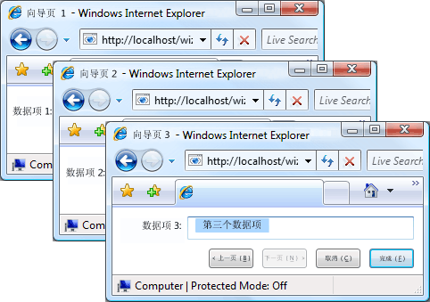
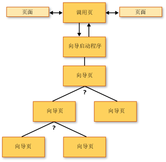
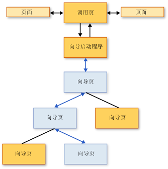
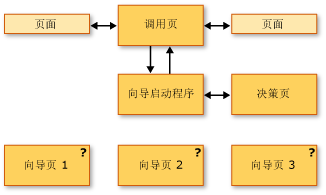
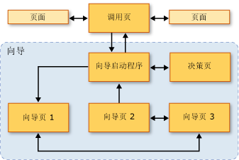

# 导航拓扑概述
 本概述介绍了 [!INCLUDE[TLA2#tla_wpf](../../../../includes/tla2sharptla-wpf-md.md)] 中的导航拓扑。  三个常见导航拓扑及示例将在随后讨论。  
  
> [!NOTE]
>  在阅读本主题之前，您应当熟悉使用页函数的 [!INCLUDE[TLA2#tla_wpf](../../../../includes/tla2sharptla-wpf-md.md)] 中的结构化导航的概念。  有关这些主题的更多信息，请参见[结构化导航概述](../../../../docs/framework/wpf/app-development/structured-navigation-overview.md)。  
  
 本主题包含以下各节：  
  
-   [导航拓扑](#Navigation_Topologies)  
  
-   [结构化导航拓扑](#Structured_Navigation_Topologies)  
  
-   [在固定线性拓扑中导航](#Navigation_over_a_Fixed_Linear_Topology)  
  
-   [在固定分层拓扑中动态导航](#Dynamic_Navigation_over_a_Fixed_Hierarchical_Topology)  
  
-   [在动态生成的拓扑中导航](#Navigation_over_a_Dynamically_Generated_Topology)  
  
   
## 导航拓扑  
 在 [!INCLUDE[TLA2#tla_wpf](../../../../includes/tla2sharptla-wpf-md.md)] 中，导航通常由页（<xref:System.Windows.Controls.Page>）和单击时导航到其他页的超链接（<xref:System.Windows.Documents.Hyperlink>）组成。  导航到的目标页由[!INCLUDE[TLA#tla_uri#plural](../../../../includes/tlasharptla-urisharpplural-md.md)] 标识（请参见[WPF 中的 Pack URI](../../../../docs/framework/wpf/app-development/pack-uris-in-wpf.md)）。  请考虑下面包含页、超链接和[!INCLUDE[TLA#tla_uri#plural](../../../../includes/tlasharptla-urisharpplural-md.md)] 的简单示例：  
  
 [!code-xml[NavigationTopologiesOverviewSnippets#Page1](../../../../samples/snippets/csharp/VS_Snippets_Wpf/NavigationTopologiesOverviewSnippets/CS/Page1.xaml#page1)]  
  
 [!code-xml[NavigationTopologiesOverviewSnippets#Page2](../../../../samples/snippets/csharp/VS_Snippets_Wpf/NavigationTopologiesOverviewSnippets/CS/Page2.xaml#page2)]  
  
 这些页以“导航拓扑”的形式排列，导航拓扑的结构由您在这些页之间导航的方式确定。  此特定导航拓扑适用于简单场合，虽然导航能要求更复杂的拓扑（其中的一些仅能在应用程序运行时定义）。  
  
 本主题讨论了三个常见的导航拓扑：“固定线性拓扑”、“固定分层拓扑”和“互动生成拓扑”。  每个导航拓扑使用一个示例进行演示，其 [!INCLUDE[TLA2#tla_ui](../../../../includes/tla2sharptla-ui-md.md)] 如下图所示：  
  
   
  
   
## 结构化导航拓扑  
 有两种广义类型的导航拓扑：  
  
-   **固定拓扑**：在编译时定义，在运行时不能更改。  固定拓扑用于以线性或层次顺序导航固定页序列。  
  
-   **动态拓扑**：在运行时根据从用户、应用程序或系统收集的输出进行定义。  如果可以在不同的序列中导航页，可以使用动态拓扑。  
  
 虽然使用页可以创建导航拓扑，但是这些示例使用页函数，因为它们提供附加支持，从而通过拓扑页简化对传递和返回数据的支持。  
  
   
## 在固定线性拓扑中导航  
 固定线性拓扑类似于向导的结构，即在固定序列中导航一个或多个向导页。  下图显示具有固定线性拓扑的向导的高级结构和流。  
  
   
  
 在固定线性拓扑中导航的典型行为包括：  
  
-   从调用页导航到启动程序页，启动程序页初始化向导并导航到第一个向导页。  启动程序页（没有 [!INCLUDE[TLA2#tla_ui](../../../../includes/tla2sharptla-ui-md.md)] 的 <xref:System.Windows.Navigation.PageFunction%601>）不是必需的，因为调用页可以直接调用第一个向导页。  但是，使用启动程序页可以简化向导初始化，特别是初始化比较复杂时。  
  
-   用户可以使用“后退”和“前进”按钮（或超链接）在页之间导航。  
  
-   用户可以使用日记在页之间导航。  
  
-   用户可以在任意向导页通过按下“取消”按钮来取消向导。  
  
-   用户可以在最后一个向导页通过按下“完成”按钮来接受向导。  
  
-   如果取消了向导，向导会返回合适的结果，但是不返回任何数据。  
  
-   如果用户接受向导，向导会返回合适的结果以及它收集的数据。  
  
-   向导完成（接受或取消）后，组成向导的页就会从日记中移除。  这使每个向导实例都相互独立，因而避免了可能的数据反常或状态反常。  
  
   
## 在固定分层拓扑中动态导航  
 在某些应用程序中，页允许导航到两个或更多其他页，如下图所示。  
  
   
  
 此结构称为固定分层拓扑，分层的序列通常在运行时由应用程序或用户确定。  运行时，允许导航到两页或更多其他页的分层中的每页收集所需的数据来确定导航到的页。  下图根据上图演示了若干种可能的导航序列中的一种。  
  
   
  
 即使固定分层结构中的页导航序列在运行时确定，用户的体验也与固定线性拓扑的体验一样。  
  
-   从调用页导航到启动程序页，启动程序页初始化向导并导航到第一个向导页。  启动程序页（没有 [!INCLUDE[TLA2#tla_ui](../../../../includes/tla2sharptla-ui-md.md)] 的 <xref:System.Windows.Navigation.PageFunction%601>）不是必需的，因为调用页可以直接调用第一个向导页。  但是，使用启动程序页可以简化向导初始化，特别是初始化比较复杂时。  
  
-   用户可以使用“后退”和“前进”按钮（或超链接）在页之间导航。  
  
-   用户可以使用日记在页之间导航。  
  
-   如果用户通过日记返回，那么用户可以更改导航序列。  
  
-   用户可以在任意向导页通过按下“取消”按钮来取消向导。  
  
-   用户可以在最后一个向导页通过按下“完成”按钮来接受向导。  
  
-   如果取消了向导，向导会返回合适的结果，但是不返回任何数据。  
  
-   如果用户接受向导，向导会返回合适的结果以及它收集的数据。  
  
-   向导完成（接受或取消）后，组成向导的页就会从日记中移除。  这使每个向导实例都相互独立，因而避免了可能的数据反常或状态反常。  
  
   
## 在动态生成的拓扑中导航  
 在某些应用程序中，两页或更多页的导航序列只能在运行时由用户、应用程序或外部数据确定。  下图演示了一组具有不确定导航序列的页。  
  
   
  
 接下来的图演示了在运行时由用户选择的导航序列。  
  
   
  
 该导航序列被称为动态生成的拓扑。  对于用户而言，与其他导航拓扑一样，用户体验与以前的拓扑是相同的：  
  
-   从调用页导航到启动程序页，启动程序页初始化向导并导航到第一个向导页。  启动程序页（没有 [!INCLUDE[TLA2#tla_ui](../../../../includes/tla2sharptla-ui-md.md)] 的 <xref:System.Windows.Navigation.PageFunction%601>）不是必需的，因为调用页可以直接调用第一个向导页。  但是，使用启动程序页可以简化向导初始化，特别是初始化比较复杂时。  
  
-   用户可以使用“后退”和“前进”按钮（或超链接）在页之间导航。  
  
-   用户可以使用日记在页之间导航。  
  
-   用户可以在任意向导页通过按下“取消”按钮来取消向导。  
  
-   用户可以在最后一个向导页通过按下“完成”按钮来接受向导。  
  
-   如果取消了向导，向导会返回合适的结果，但是不返回任何数据。  
  
-   如果用户接受向导，向导会返回合适的结果以及它收集的数据。  
  
-   向导完成（接受或取消）后，组成向导的页就会从日记中移除。  这使每个向导实例都相互独立，因而避免了可能的数据反常或状态反常。  
  
## 请参阅  
 <xref:System.Windows.Controls.Page>   
 <xref:System.Windows.Navigation.PageFunction%601>   
 <xref:System.Windows.Navigation.NavigationService>   
 [结构化导航概述](../../../../docs/framework/wpf/app-development/structured-navigation-overview.md)