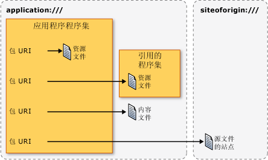

# <a name="pack-uris-in-wpf"></a>WPF 中的 Pack URI
在 Windows Presentation Foundation (WPF)[!INCLUDE[TLA#tla_uri#plural](../../../../includes/tlasharptla-urisharpplural-md.md)]用于标识和加载在许多方面，包括以下文件：  
  
-   指定[!INCLUDE[TLA#tla_ui](../../../../includes/tlasharptla-ui-md.md)]以显示应用程序第一次启动时。  
  
-   加载图像。  
  
-   导航到页。  
  
-   加载不可执行的数据文件。  
  
 此外，[!INCLUDE[TLA2#tla_uri#plural](../../../../includes/tla2sharptla-urisharpplural-md.md)]可用来标识和加载不同的位置，包括以下文件：  
  
-   当前程序集。  
  
-   引用的程序集。  
  
-   相对于程序集的某个位置。  
  
-   应用程序的源站点。  
  
 确定并从这些位置中，加载这些类型的文件提供一致的机制[!INCLUDE[TLA2#tla_wpf](../../../../includes/tla2sharptla-wpf-md.md)]利用的扩展性*pack URI 方案*。 本主题概述的方案，介绍如何构造包[!INCLUDE[TLA2#tla_uri#plural](../../../../includes/tla2sharptla-urisharpplural-md.md)]各种不同的方案，讨论绝对和相对[!INCLUDE[TLA2#tla_uri#plural](../../../../includes/tla2sharptla-urisharpplural-md.md)]和[!INCLUDE[TLA2#tla_uri](../../../../includes/tla2sharptla-uri-md.md)]解析，然后说明如何使用包[!INCLUDE[TLA2#tla_uri#plural](../../../../includes/tla2sharptla-urisharpplural-md.md)]从这两个标记和代码。  
  
  
<a name="The_Pack_URI_Scheme"></a>   
## <a name="the-pack-uri-scheme"></a>Pack URI 方案  
 包[!INCLUDE[TLA2#tla_uri](../../../../includes/tla2sharptla-uri-md.md)]所用的方案[开放式打包约定](http://go.microsoft.com/fwlink/?LinkID=71255)(OPC) 规范，描述用于组织和标识内容的模型。 此模型的关键要素是包和部件，其中*包*是一个逻辑容器，一个或多个逻辑*部件*。 下图阐释了此概念。  
  
   
  
 若要标识部件，OPC 规范利用 RFC 2396 的扩展性 (统一资源标识符 (URI): 泛型语法) 来定义包[!INCLUDE[TLA2#tla_uri](../../../../includes/tla2sharptla-uri-md.md)]方案。  
  
 通过指定的方案[!INCLUDE[TLA2#tla_uri](../../../../includes/tla2sharptla-uri-md.md)]定义按其前缀; http、 ftp 和文件是已知的示例。 包[!INCLUDE[TLA2#tla_uri](../../../../includes/tla2sharptla-uri-md.md)]方案为它的方案，使用"包"，并包含两个组件： 机构和路径。 下面是包的格式[!INCLUDE[TLA2#tla_uri](../../../../includes/tla2sharptla-uri-md.md)]。  
  
 包: / /*机构*/*路径*
  
 *机构*指定的一种通过，包含一部分的包时*路径*指定在包中的部件的位置。  
  
 下图阐释了此概念：  
  
   
  
 包和部件之间的关系类似于应用程序和文件之间的关系，其中应用程序（包）可以包含一个或多个文件（部件），包括：  
  
-   编译到本地程序集内的资源文件。  
  
-   编译到所引用的程序集内的资源文件。  
  
-   编译到引用程序集内的资源文件。  
  
-   内容文件。  
  
-   源站点文件。  
  
 若要访问这些类型的文件，[!INCLUDE[TLA2#tla_wpf](../../../../includes/tla2sharptla-wpf-md.md)]支持两种授权： 应用程序: / / 和 siteoforigin: / /。 application:/// 授权标识在编译时已知的应用程序数据文件，包括资源文件和内容文件。 siteoforigin:/// 授权标识源站点文件。 下图显示了每种授权的范围。  
  
   
  
> [!NOTE]
>  包的证书颁发机构部分[!INCLUDE[TLA2#tla_uri](../../../../includes/tla2sharptla-uri-md.md)]是一个嵌入式[!INCLUDE[TLA2#tla_uri](../../../../includes/tla2sharptla-uri-md.md)]，指向包，并且必须符合 RFC 2396。 另外，必须用字符“,”替换字符“/”，并且必须对保留字符（如“%”和“?”）进行转义。 有关详细信息，请参阅 OPC。  
  
 以下各节说明如何构造包[!INCLUDE[TLA2#tla_uri#plural](../../../../includes/tla2sharptla-urisharpplural-md.md)]结合了相应的路径将这两种授权，用于标识资源、 内容和源站点文件。  
  
<a name="Resource_File_Pack_URIs___Local_Assembly"></a>   
## <a name="resource-file-pack-uris"></a>资源文件 Pack URI  
 资源文件配置为[!INCLUDE[TLA2#tla_msbuild](../../../../includes/tla2sharptla-msbuild-md.md)]`Resource`项，并被编译到程序集。 [!INCLUDE[TLA2#tla_wpf](../../../../includes/tla2sharptla-wpf-md.md)] 支持包的构造[!INCLUDE[TLA2#tla_uri#plural](../../../../includes/tla2sharptla-urisharpplural-md.md)]可以用于标识资源文件编译到的本地程序集或编译到从本地程序集引用的程序集中。  
  
<a name="Local_Assembly_Resource_File"></a>   
### <a name="local-assembly-resource-file"></a>本地程序集资源文件  
 包[!INCLUDE[TLA2#tla_uri](../../../../includes/tla2sharptla-uri-md.md)]资源编译为本地的程序集的文件使用以下授权和路径：  
  
-   **授权**：application:///。  
  
-   **路径**：资源文件的名称，包括其相对于本地程序集项目文件夹根目录的路径。  
  
 下面的示例演示了包[!INCLUDE[TLA2#tla_uri](../../../../includes/tla2sharptla-uri-md.md)]为[!INCLUDE[TLA2#tla_xaml](../../../../includes/tla2sharptla-xaml-md.md)]位于本地程序集的项目文件夹的根目录中的资源文件。  
  
 `pack://application:,,,/ResourceFile.xaml`  
  
 下面的示例演示了包[!INCLUDE[TLA2#tla_uri](../../../../includes/tla2sharptla-uri-md.md)]为[!INCLUDE[TLA2#tla_xaml](../../../../includes/tla2sharptla-xaml-md.md)]位于本地程序集的项目文件夹的子文件夹中的资源文件。  
  
 `pack://application:,,,/Subfolder/ResourceFile.xaml`  
  
<a name="Resource_File_Pack_URIs___Referenced_Assembly"></a>   
### <a name="referenced-assembly-resource-file"></a>引用的程序集资源文件  
 包[!INCLUDE[TLA2#tla_uri](../../../../includes/tla2sharptla-uri-md.md)]资源编译到引用的程序集中的文件使用以下授权和路径：  
  
-   **授权**：application:///。  
  
-   **路径**：编译到所引用程序集内的资源文件的名称。 路径必须符合以下格式：  
  
     *程序集*{*;版本*] {*;PublicKey*]; 组件 /*路径*  
  
    -   **程序集短名称**：所引用的程序集的短名称。  
  
    -   **;版本** [可选]：所引用的包含资源文件的程序集的版本。 此部分在加载两个或多个具有相同短名称的引用程序集时使用。  
  
    -   **;公钥** [可选]：用于对引用程序集进行签名的公钥。 此部分在加载两个或多个具有相同短名称的引用程序集时使用。  
  
    -   **;组件**：指定所引用的程序集是从本地程序集引用的。  
  
    -   **/路径**：资源文件的名称，包括其相对于所引用程序集的项目文件夹根目录的路径。  
  
 下面的示例演示了包[!INCLUDE[TLA2#tla_uri](../../../../includes/tla2sharptla-uri-md.md)]为[!INCLUDE[TLA2#tla_xaml](../../../../includes/tla2sharptla-xaml-md.md)]位于被引用程序集的项目文件夹的根目录中的资源文件。  
  
 `pack://application:,,,/ReferencedAssembly;component/ResourceFile.xaml`  
  
 下面的示例演示了包[!INCLUDE[TLA2#tla_uri](../../../../includes/tla2sharptla-uri-md.md)]为[!INCLUDE[TLA2#tla_xaml](../../../../includes/tla2sharptla-xaml-md.md)]位于被引用程序集的项目文件夹的子文件夹中的资源文件。  
  
 `pack://application:,,,/ReferencedAssembly;component/Subfolder/ResourceFile.xaml`  
  
 下面的示例演示了包[!INCLUDE[TLA2#tla_uri](../../../../includes/tla2sharptla-uri-md.md)]为[!INCLUDE[TLA2#tla_xaml](../../../../includes/tla2sharptla-xaml-md.md)]位于根文件夹的引用、 特定于版本的程序集的项目文件夹中的资源文件。  
  
 `pack://application:,,,/ReferencedAssembly;v1.0.0.1;component/ResourceFile.xaml`  
  
 请注意，包[!INCLUDE[TLA2#tla_uri](../../../../includes/tla2sharptla-uri-md.md)]引用的程序集资源文件的语法可以仅用于应用程序: / / 机构。 例如，以下不支持在[!INCLUDE[TLA2#tla_wpf](../../../../includes/tla2sharptla-wpf-md.md)]。  
  
 `pack://siteoforigin:,,,/SomeAssembly;component/ResourceFile.xaml`  
  
<a name="Content_File_Pack_URIs"></a>   
## <a name="content-file-pack-uris"></a>内容文件 Pack URI  
 包[!INCLUDE[TLA2#tla_uri](../../../../includes/tla2sharptla-uri-md.md)]内容的文件使用以下授权和路径：  
  
-   **授权**：application:///。  
  
-   **路径**：内容文件的名称，包括其相对于应用程序的主可执行程序集的文件系统位置的路径。  
  
 下面的示例演示了包[!INCLUDE[TLA2#tla_uri](../../../../includes/tla2sharptla-uri-md.md)]为[!INCLUDE[TLA2#tla_xaml](../../../../includes/tla2sharptla-xaml-md.md)]位于可执行程序集所在的文件夹中的内容文件。  
  
 `pack://application:,,,/ContentFile.xaml`  
  
 下面的示例演示了包[!INCLUDE[TLA2#tla_uri](../../../../includes/tla2sharptla-uri-md.md)]为[!INCLUDE[TLA2#tla_xaml](../../../../includes/tla2sharptla-xaml-md.md)]位于相对于应用程序的可执行程序集的子文件夹中的内容文件。  
  
 `pack://application:,,,/Subfolder/ContentFile.xaml`  
  
> [!NOTE]
>  无法导航到 [!INCLUDE[TLA2#tla_html](../../../../includes/tla2sharptla-html-md.md)] 内容文件。 [!INCLUDE[TLA2#tla_uri](../../../../includes/tla2sharptla-uri-md.md)]方案仅支持导航到[!INCLUDE[TLA2#tla_html](../../../../includes/tla2sharptla-html-md.md)]位于在源站点的文件。  
  
<a name="The_siteoforigin_____Authority"></a>   
## <a name="site-of-origin-pack-uris"></a>源站点 Pack URI  
 包[!INCLUDE[TLA2#tla_uri](../../../../includes/tla2sharptla-uri-md.md)]为源站点的文件使用以下授权和路径：  
  
-   **授权**：siteoforigin:///。  
  
-   **路径**：源站点文件的名称，包括其相对于可执行程序集启动位置的路径。  
  
 下面的示例演示了包[!INCLUDE[TLA2#tla_uri](../../../../includes/tla2sharptla-uri-md.md)]为[!INCLUDE[TLA2#tla_xaml](../../../../includes/tla2sharptla-xaml-md.md)]的原始文件，存储在从中启动可执行程序集的位置的站点。  
  
 `pack://siteoforigin:,,,/SiteOfOriginFile.xaml`  
  
 下面的示例演示了包[!INCLUDE[TLA2#tla_uri](../../../../includes/tla2sharptla-uri-md.md)]为[!INCLUDE[TLA2#tla_xaml](../../../../includes/tla2sharptla-xaml-md.md)]的原始文件，存储在从中启动应用程序的可执行程序集位置相对的子文件夹的站点。  
  
 `pack://siteoforigin:,,,/Subfolder/SiteOfOriginFile.xaml`  
  
<a name="Page_Files"></a>   
## <a name="page-files"></a>页面文件  
 [!INCLUDE[TLA2#tla_xaml](../../../../includes/tla2sharptla-xaml-md.md)] 配置为的文件[!INCLUDE[TLA2#tla_msbuild](../../../../includes/tla2sharptla-msbuild-md.md)]`Page`项被编译到程序集资源文件的方式相同。 因此， [!INCLUDE[TLA2#tla_msbuild](../../../../includes/tla2sharptla-msbuild-md.md)] `Page`项可以使用包来识别[!INCLUDE[TLA2#tla_uri#plural](../../../../includes/tla2sharptla-urisharpplural-md.md)]资源文件。  
  
 类型的[!INCLUDE[TLA2#tla_xaml](../../../../includes/tla2sharptla-xaml-md.md)]通常被配置为的文件[!INCLUDE[TLA2#tla_msbuild](../../../../includes/tla2sharptla-msbuild-md.md)]`Page`项具有作为其根元素下列项之一：  
  
-   <xref:System.Windows.Window?displayProperty=nameWithType>  
  
-   <xref:System.Windows.Controls.Page?displayProperty=nameWithType>  
  
-   <xref:System.Windows.Navigation.PageFunction%601?displayProperty=nameWithType>  
  
-   <xref:System.Windows.ResourceDictionary?displayProperty=nameWithType>  
  
-   <xref:System.Windows.Documents.FlowDocument?displayProperty=nameWithType>  
  
-   <xref:System.Windows.Controls.UserControl?displayProperty=nameWithType>  
  
<a name="Absolute_vs_Relative_Pack_URIs"></a>   
## <a name="absolute-vs-relative-pack-uris"></a>绝对与相对 Pack URI  
 完全限定的包[!INCLUDE[TLA2#tla_uri](../../../../includes/tla2sharptla-uri-md.md)]包括方案、 机构和路径，且将其视为绝对包[!INCLUDE[TLA2#tla_uri](../../../../includes/tla2sharptla-uri-md.md)]。 作为开发人员，简化[!INCLUDE[TLA2#tla_xaml](../../../../includes/tla2sharptla-xaml-md.md)]元素通常允许您设置相应的特性与相对包[!INCLUDE[TLA2#tla_uri](../../../../includes/tla2sharptla-uri-md.md)]，其中包括仅的路径。  
  
 例如，考虑具有以下绝对 pack[!INCLUDE[TLA2#tla_uri](../../../../includes/tla2sharptla-uri-md.md)]本地程序集中的资源文件。  
  
 `pack://application:,,,/ResourceFile.xaml`  
  
 相对包[!INCLUDE[TLA2#tla_uri](../../../../includes/tla2sharptla-uri-md.md)]引用此资源的文件将如下所示。  
  
 `/ResourceFile.xaml`  
  
> [!NOTE]
>  源站点文件不与程序集相关联，因为它们可以仅指将使用绝对包[!INCLUDE[TLA2#tla_uri#plural](../../../../includes/tla2sharptla-urisharpplural-md.md)]。  
  
 默认情况下，相对 pack[!INCLUDE[TLA2#tla_uri](../../../../includes/tla2sharptla-uri-md.md)]被视为相对于的标记或包含引用的代码的位置。 但是，如果使用前导反斜杠，则将相对 pack[!INCLUDE[TLA2#tla_uri](../../../../includes/tla2sharptla-uri-md.md)]引用被视为相对于根的应用程序。 例如，假设具有以下项目结构。  
  
 `App.xaml`  
  
 `Page2.xaml`  
  
 `\SubFolder`  
  
 `+ Page1.xaml`  
  
 `+ Page2.xaml`  
  
 如果 Page1.xaml 包含[!INCLUDE[TLA2#tla_uri](../../../../includes/tla2sharptla-uri-md.md)]引用*根*\SubFolder\Page2.xaml，该引用可以使用以下相对包[!INCLUDE[TLA2#tla_uri](../../../../includes/tla2sharptla-uri-md.md)]。  
  
 `Page2.xaml`  
  
 如果 Page1.xaml 包含[!INCLUDE[TLA2#tla_uri](../../../../includes/tla2sharptla-uri-md.md)]引用*根*\Page2.xaml，该引用可以使用以下相对包[!INCLUDE[TLA2#tla_uri](../../../../includes/tla2sharptla-uri-md.md)]。  
  
 `/Page2.xaml`  
  
<a name="Pack_URI_Resolution"></a>   
## <a name="pack-uri-resolution"></a>Pack URI 解析  
 包的格式[!INCLUDE[TLA2#tla_uri#plural](../../../../includes/tla2sharptla-urisharpplural-md.md)]变得更为包可能[!INCLUDE[TLA2#tla_uri#plural](../../../../includes/tla2sharptla-urisharpplural-md.md)]对于不同类型的文件看起来都相同。 例如，考虑具有以下绝对 pack [!INCLUDE[TLA2#tla_uri](../../../../includes/tla2sharptla-uri-md.md)]。  
  
 `pack://application:,,,/ResourceOrContentFile.xaml`  
  
 此绝对包[!INCLUDE[TLA2#tla_uri](../../../../includes/tla2sharptla-uri-md.md)]引用了中的本地程序集的资源文件或内容文件。 同样适用于以下相对[!INCLUDE[TLA2#tla_uri](../../../../includes/tla2sharptla-uri-md.md)]。  
  
 `/ResourceOrContentFile.xaml`  
  
 若要确定的一种文件包[!INCLUDE[TLA2#tla_uri](../../../../includes/tla2sharptla-uri-md.md)]指的是，[!INCLUDE[TLA2#tla_wpf](../../../../includes/tla2sharptla-wpf-md.md)]解析[!INCLUDE[TLA2#tla_uri#plural](../../../../includes/tla2sharptla-urisharpplural-md.md)]本地程序集和通过使用以下启发式技术的内容文件中的资源文件：  
  
1.  探测的程序集元数据<xref:System.Windows.Resources.AssemblyAssociatedContentFileAttribute>匹配包属性[!INCLUDE[TLA2#tla_uri](../../../../includes/tla2sharptla-uri-md.md)]。  
  
2.  如果<xref:System.Windows.Resources.AssemblyAssociatedContentFileAttribute>找到属性时，包的路径[!INCLUDE[TLA2#tla_uri](../../../../includes/tla2sharptla-uri-md.md)]引用的内容文件。  
  
3.  如果<xref:System.Windows.Resources.AssemblyAssociatedContentFileAttribute>未找到属性，探测被编译到的本地程序集的一组资源文件。  
  
4.  如果匹配的包的路径的资源文件[!INCLUDE[TLA2#tla_uri](../../../../includes/tla2sharptla-uri-md.md)]找到，则包的路径[!INCLUDE[TLA2#tla_uri](../../../../includes/tla2sharptla-uri-md.md)]引用的资源文件。  
  
5.  如果未找到资源，则内部创建<xref:System.Uri>无效。  
  
 [!INCLUDE[TLA2#tla_uri](../../../../includes/tla2sharptla-uri-md.md)] 解决方法不适用于[!INCLUDE[TLA2#tla_uri#plural](../../../../includes/tla2sharptla-urisharpplural-md.md)]，请参阅以下：  
  
-   内容中引用的程序集的文件： 这些文件类型不受[!INCLUDE[TLA2#tla_wpf](../../../../includes/tla2sharptla-wpf-md.md)]。  
  
-   在引用程序集中嵌入文件：[!INCLUDE[TLA2#tla_uri#plural](../../../../includes/tla2sharptla-urisharpplural-md.md)]标识这些是唯一的因为它们包含这两个引用的程序集的名称和`;component`后缀。  
  
-   源站点文件：[!INCLUDE[TLA2#tla_uri#plural](../../../../includes/tla2sharptla-urisharpplural-md.md)]标识这些是唯一的因为它们是可以由包的唯一文件[!INCLUDE[TLA2#tla_uri#plural](../../../../includes/tla2sharptla-urisharpplural-md.md)]包含 siteoforigin: / / 机构。  
  
 包的一种简化形式[!INCLUDE[TLA2#tla_uri](../../../../includes/tla2sharptla-uri-md.md)]解析，则允许被让代码在一定程度上独立的资源和内容的文件的位置。 例如，如果你有一个资源文件在本地重新配置为内容文件，包的程序集中[!INCLUDE[TLA2#tla_uri](../../../../includes/tla2sharptla-uri-md.md)]资源保持相同，可使用包的代码一样[!INCLUDE[TLA2#tla_uri](../../../../includes/tla2sharptla-uri-md.md)]。  
  
<a name="Programming_with_Pack_URIs"></a>   
## <a name="programming-with-pack-uris"></a>使用 Pack URI 编程  
 许多[!INCLUDE[TLA2#tla_wpf](../../../../includes/tla2sharptla-wpf-md.md)]类实现的属性进行设置的包[!INCLUDE[TLA2#tla_uri#plural](../../../../includes/tla2sharptla-urisharpplural-md.md)]，包括：  
  
-   <xref:System.Windows.Application.StartupUri%2A?displayProperty=nameWithType>  
  
-   <xref:System.Windows.Controls.Frame.Source%2A?displayProperty=nameWithType>  
  
-   <xref:System.Windows.Navigation.NavigationWindow.Source%2A?displayProperty=nameWithType>  
  
-   <xref:System.Windows.Documents.Hyperlink.NavigateUri%2A?displayProperty=nameWithType>  
  
-   <xref:System.Windows.Window.Icon%2A?displayProperty=nameWithType>  
  
-   <xref:System.Windows.Controls.Image.Source%2A?displayProperty=nameWithType>  
  
 可以从标记和代码中设置这些属性。 本节演示这两种设置方式的基本构造，然后演示通用方案示例。  
  
<a name="Using_Pack_URIs_in_Markup"></a>   
### <a name="using-pack-uris-in-markup"></a>在标记中使用 Pack URI  
 包[!INCLUDE[TLA2#tla_uri](../../../../includes/tla2sharptla-uri-md.md)]通过设置具有包的属性元素标记中指定[!INCLUDE[TLA2#tla_uri](../../../../includes/tla2sharptla-uri-md.md)]。 例如：  
  
 `<element attribute="pack://application:,,,/File.xaml" />`  
  
 表 1 说明各种绝对 pack[!INCLUDE[TLA2#tla_uri#plural](../../../../includes/tla2sharptla-urisharpplural-md.md)]可以在标记中指定。  
  
 表 1：标记中的绝对 Pack URI  
  
|文件|绝对包 [!INCLUDE[TLA2#tla_uri](../../../../includes/tla2sharptla-uri-md.md)]|  
|----------|-------------------------------------------------------------------------------------------------------------------------|  
|资源文件 - 本地程序集|`"pack://application:,,,/ResourceFile.xaml"`|  
|子文件夹中的资源文件 - 本地程序集|`"pack://application:,,,/Subfolder/ResourceFile.xaml"`|  
|资源文件 - 引用的程序集|`"pack://application:,,,/ReferencedAssembly;component/ResourceFile.xaml"`|  
|所引用程序集的子文件夹中的资源文件|`"pack://application:,,,/ReferencedAssembly;component/Subfolder/ResourceFile.xaml"`|  
|所引用版本化程序集中的资源文件|`"pack://application:,,,/ReferencedAssembly;v1.0.0.0;component/ResourceFile.xaml"`|  
|内容文件|`"pack://application:,,,/ContentFile.xaml"`|  
|子文件夹中的内容文件|`"pack://application:,,,/Subfolder/ContentFile.xaml"`|  
|源站点文件|`"pack://siteoforigin:,,,/SOOFile.xaml"`|  
|子文件夹中的源站点文件|`"pack://siteoforigin:,,,/Subfolder/SOOFile.xaml"`|  
  
 表 2 演示了各种相对 pack[!INCLUDE[TLA2#tla_uri#plural](../../../../includes/tla2sharptla-urisharpplural-md.md)]可以在标记中指定。  
  
 表 2：标记中的相对 Pack URI  
  
|文件|相对包 [!INCLUDE[TLA2#tla_uri](../../../../includes/tla2sharptla-uri-md.md)]|  
|----------|-------------------------------------------------------------------------------------------------------------------------|  
|本地程序集内的资源文件|`"/ResourceFile.xaml"`|  
|本地程序集的子文件夹中的资源文件|`"/Subfolder/ResourceFile.xaml"`|  
|所引用程序集内的资源文件|`"/ReferencedAssembly;component/ResourceFile.xaml"`|  
|所引用程序集的子文件夹中的资源文件|`"/ReferencedAssembly;component/Subfolder/ResourceFile.xaml"`|  
|内容文件|`"/ContentFile.xaml"`|  
|子文件夹中的内容文件|`"/Subfolder/ContentFile.xaml"`|  
  
<a name="Using_Pack_URIs_in_Code"></a>   
### <a name="using-pack-uris-in-code"></a>在代码中使用 Pack URI  
 指定的包[!INCLUDE[TLA2#tla_uri](../../../../includes/tla2sharptla-uri-md.md)]方法是实例化的代码中<xref:System.Uri>类并传递包[!INCLUDE[TLA2#tla_uri](../../../../includes/tla2sharptla-uri-md.md)]作为参数传递给构造函数。 下面的示例说明了这一点。  
  
```csharp  
Uri uri = new Uri("pack://application:,,,/File.xaml");  
```  
  
 默认情况下，<xref:System.Uri>类会视为包[!INCLUDE[TLA2#tla_uri#plural](../../../../includes/tla2sharptla-urisharpplural-md.md)]为绝对。 因此，将引发异常的实例时<xref:System.Uri>与相对包创建类[!INCLUDE[TLA2#tla_uri](../../../../includes/tla2sharptla-uri-md.md)]。  
  
```csharp  
Uri uri = new Uri("/File.xaml");  
```  
  
 幸运的是，<xref:System.Uri.%23ctor%28System.String%2CSystem.UriKind%29>重载<xref:System.Uri>类构造函数接受类型的参数<xref:System.UriKind>以便您可以指定是否将包[!INCLUDE[TLA2#tla_uri](../../../../includes/tla2sharptla-uri-md.md)]是绝对或相对。  
  
```csharp  
// Absolute URI (default)  
Uri absoluteUri = new Uri("pack://application:,,,/File.xaml", UriKind.Absolute);  
// Relative URI  
Uri relativeUri = new Uri("/File.xaml",   
                        UriKind.Relative);  
```  
  
 只应指定<xref:System.UriKind.Absolute>或<xref:System.UriKind.Relative>确定何时提供的包[!INCLUDE[TLA2#tla_uri](../../../../includes/tla2sharptla-uri-md.md)]是一个或另一个。 如果你不知道的一种包[!INCLUDE[TLA2#tla_uri](../../../../includes/tla2sharptla-uri-md.md)]，使用，如当用户输入包[!INCLUDE[TLA2#tla_uri](../../../../includes/tla2sharptla-uri-md.md)]在运行时，使用<xref:System.UriKind.RelativeOrAbsolute>相反。  
  
```csharp  
// Relative or Absolute URI provided by user via a text box  
TextBox userProvidedUriTextBox = new TextBox();  
Uri uri = new Uri(userProvidedUriTextBox.Text, UriKind.RelativeOrAbsolute);  
```  
  
 表 3 所示的各种相对 pack[!INCLUDE[TLA2#tla_uri#plural](../../../../includes/tla2sharptla-urisharpplural-md.md)]可以在代码中指定使用<xref:System.Uri?displayProperty=nameWithType>。  
  
 表 3：代码中的绝对 Pack URI  
  
|文件|绝对包 [!INCLUDE[TLA2#tla_uri](../../../../includes/tla2sharptla-uri-md.md)]|  
|----------|-------------------------------------------------------------------------------------------------------------------------|  
|资源文件 - 本地程序集|`Uri uri = new Uri("pack://application:,,,/ResourceFile.xaml", UriKind.Absolute);`|  
|子文件夹中的资源文件 - 本地程序集|`Uri uri = new Uri("pack://application:,,,/Subfolder/ResourceFile.xaml", UriKind.Absolute);`|  
|资源文件 - 引用的程序集|`Uri uri = new Uri("pack://application:,,,/ReferencedAssembly;component/ResourceFile.xaml", UriKind.Absolute);`|  
|所引用程序集的子文件夹中的资源文件|`Uri uri = new Uri("pack://application:,,,/ReferencedAssembly;component/Subfolder/ResourceFile.xaml", UriKind.Absolute);`|  
|所引用版本化程序集中的资源文件|`Uri uri = new Uri("pack://application:,,,/ReferencedAssembly;v1.0.0.0;component/ResourceFile.xaml", UriKind.Absolute);`|  
|内容文件|`Uri uri = new Uri("pack://application:,,,/ContentFile.xaml", UriKind.Absolute);`|  
|子文件夹中的内容文件|`Uri uri = new Uri("pack://application:,,,/Subfolder/ContentFile.xaml", UriKind.Absolute);`|  
|源站点文件|`Uri uri = new Uri("pack://siteoforigin:,,,/SOOFile.xaml", UriKind.Absolute);`|  
|子文件夹中的源站点文件|`Uri uri = new Uri("pack://siteoforigin:,,,/Subfolder/SOOFile.xaml", UriKind.Absolute);`|  
  
 表 4 显示的各种相对 pack[!INCLUDE[TLA2#tla_uri#plural](../../../../includes/tla2sharptla-urisharpplural-md.md)]可以指定在代码中使用<xref:System.Uri?displayProperty=nameWithType>。  
  
 表 4：代码中的相对 Pack URI  
  
|文件|相对包 [!INCLUDE[TLA2#tla_uri](../../../../includes/tla2sharptla-uri-md.md)]|  
|----------|-------------------------------------------------------------------------------------------------------------------------|  
|资源文件 - 本地程序集|`Uri uri = new Uri("/ResourceFile.xaml", UriKind.Relative);`|  
|子文件夹中的资源文件 - 本地程序集|`Uri uri = new Uri("/Subfolder/ResourceFile.xaml", UriKind.Relative);`|  
|资源文件 - 引用的程序集|`Uri uri = new Uri("/ReferencedAssembly;component/ResourceFile.xaml", UriKind.Relative);`|  
|子文件夹中的资源文件 - 引用的程序集|`Uri uri = new Uri("/ReferencedAssembly;component/Subfolder/ResourceFile.xaml", UriKind.Relative);`|  
|内容文件|`Uri uri = new Uri("/ContentFile.xaml", UriKind.Relative);`|  
|子文件夹中的内容文件|`Uri uri = new Uri("/Subfolder/ContentFile.xaml", UriKind.Relative);`|  
  
<a name="Common_Pack_URI_Scenarios"></a>   
### <a name="common-pack-uri-scenarios"></a>常见 Pack URI 方案  
 前面几节讨论了如何构造包[!INCLUDE[TLA2#tla_uri#plural](../../../../includes/tla2sharptla-urisharpplural-md.md)]来标识资源、 内容和源站点文件。 在[!INCLUDE[TLA2#tla_wpf](../../../../includes/tla2sharptla-wpf-md.md)]、 中有许多种情况下，使用这些构造和以下部分介绍几种常见用法。  
  
<a name="Specifying_the_UI_to_Show_when_an_Application_Starts"></a>   
#### <a name="specifying-the-ui-to-show-when-an-application-starts"></a>指定当应用程序启动时显示的 UI  
 <xref:System.Windows.Application.StartupUri%2A> 指定第一个[!INCLUDE[TLA2#tla_ui](../../../../includes/tla2sharptla-ui-md.md)]时显示[!INCLUDE[TLA2#tla_wpf](../../../../includes/tla2sharptla-wpf-md.md)]启动应用程序。 对于独立应用程序，[!INCLUDE[TLA2#tla_ui](../../../../includes/tla2sharptla-ui-md.md)]可以是一个窗口，如下面的示例中所示。  
  
 [!code-xaml[PackURIOverviewSnippets#StartupUriWindow](../../../../samples/snippets/csharp/VS_Snippets_Wpf/PackURIOverviewSnippets/CS/Copy of App.xaml#startupuriwindow)]  
  
 独立应用程序和[!INCLUDE[TLA#tla_xbap#plural](../../../../includes/tlasharptla-xbapsharpplural-md.md)]还可以指定页初始 UI 中，如下面的示例中所示。  
  
 [!code-xaml[PackURIOverviewSnippets#StartupUriPage](../../../../samples/snippets/csharp/VS_Snippets_Wpf/PackURIOverviewSnippets/CS/App.xaml#startupuripage)]  
  
 如果应用程序是一个独立应用程序和与指定了一个页面<xref:System.Windows.Application.StartupUri%2A>，[!INCLUDE[TLA2#tla_wpf](../../../../includes/tla2sharptla-wpf-md.md)]打开<xref:System.Windows.Navigation.NavigationWindow>以承载该页面。 有关[!INCLUDE[TLA2#tla_xbap#plural](../../../../includes/tla2sharptla-xbapsharpplural-md.md)]，在主机浏览器中显示的页。  
  
<a name="Navigating_to_a_Page"></a>   
#### <a name="navigating-to-a-page"></a>导航到页面  
 下面的示例演示如何导航到页面。  
  
 [!code-xaml[NavigationOverviewSnippets#HyperlinkXAML1](../../../../samples/snippets/csharp/VS_Snippets_Wpf/NavigationOverviewSnippets/CSharp/PageWithHyperlink.xaml#hyperlinkxaml1)]  
[!code-xaml[NavigationOverviewSnippets#HyperlinkXAML2](../../../../samples/snippets/csharp/VS_Snippets_Wpf/NavigationOverviewSnippets/CSharp/PageWithHyperlink.xaml#hyperlinkxaml2)]  
[!code-xaml[NavigationOverviewSnippets#HyperlinkXAML3](../../../../samples/snippets/csharp/VS_Snippets_Wpf/NavigationOverviewSnippets/CSharp/PageWithHyperlink.xaml#hyperlinkxaml3)]  
  
 有关详细信息中导航的各种方法[!INCLUDE[TLA2#tla_wpf](../../../../includes/tla2sharptla-wpf-md.md)]，请参阅[导航概述](../../../../docs/framework/wpf/app-development/navigation-overview.md)。  
  
<a name="Specifying_a_Window_Icon"></a>   
#### <a name="specifying-a-window-icon"></a>指定窗口图标  
 下面的示例演示如何使用 URI 指定窗口的图标。  
  
 [!code-xaml[WindowIconSnippets#WindowIconSetXAML](../../../../samples/snippets/xaml/VS_Snippets_Wpf/WindowIconSnippets/XAML/MainWindow.xaml#windowiconsetxaml)]  
  
 有关详细信息，请参阅<xref:System.Windows.Window.Icon%2A>。  
  
<a name="Loading_Image__Audio__and_Video_Files"></a>   
#### <a name="loading-image-audio-and-video-files"></a>加载图像、音频和视频文件  
 [!INCLUDE[TLA2#tla_wpf](../../../../includes/tla2sharptla-wpf-md.md)] 允许应用程序使用广泛的媒体类型，您可以标识和加载包与所有这些[!INCLUDE[TLA2#tla_uri#plural](../../../../includes/tla2sharptla-urisharpplural-md.md)]，下面的示例中所示。  
  
 [!code-xaml[MediaPlayerVideoSample#VideoPackURIAtSOO](../../../../samples/snippets/csharp/VS_Snippets_Wpf/MediaPlayerVideoSample/CS/HomePage.xaml#videopackuriatsoo)]  
  
 [!code-xaml[MediaPlayerAudioSample#AudioPackURIAtSOO](../../../../samples/snippets/csharp/VS_Snippets_Wpf/MediaPlayerAudioSample/CS/HomePage.xaml#audiopackuriatsoo)]  
  
 [!code-xaml[ImageSample#ImagePackURIContent](../../../../samples/snippets/csharp/VS_Snippets_Wpf/ImageSample/CS/HomePage.xaml#imagepackuricontent)]  
  
 使用媒体内容的详细信息，请参阅[图形和多媒体](../../../../docs/framework/wpf/graphics-multimedia/index.md)。  
  
<a name="Loading_a_Resource_Dictionary_from_the_Site_of_Origin"></a>   
#### <a name="loading-a-resource-dictionary-from-the-site-of-origin"></a>从源站点加载资源字典  
 资源字典 (<xref:System.Windows.ResourceDictionary>) 可以用于支持应用程序主题。 创建和管理主题的一种方式是将多个主题创建为位于应用程序源站点的资源字典。 这样，在添加和更新主题时将无需重新编译和重新部署应用程序。 这些资源字典可以标识和加载使用包[!INCLUDE[TLA2#tla_uri#plural](../../../../includes/tla2sharptla-urisharpplural-md.md)]，下面的示例所示。  
  
 [!code-xaml[ResourceDictionarySnippets#ResourceDictionaryPackURI](../../../../samples/snippets/csharp/VS_Snippets_Wpf/ResourceDictionarySnippets/CS/App.xaml#resourcedictionarypackuri)]  
  
 有关中的主题概述[!INCLUDE[TLA2#tla_wpf](../../../../includes/tla2sharptla-wpf-md.md)]，请参阅[样式和模板化](../../../../docs/framework/wpf/controls/styling-and-templating.md)。  
  
## <a name="see-also"></a>请参阅  
 [WPF 应用程序资源、内容和数据文件](../../../../docs/framework/wpf/app-development/wpf-application-resource-content-and-data-files.md)
