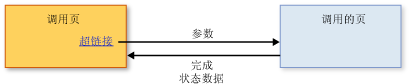

# 结构化导航概述Structured Navigation Overview
可以通过承载的内容[!INCLUDE[TLA#tla_xbap](../../../../includes/tlasharptla-xbap-md.md)]、 一个<xref:System.Windows.Controls.Frame>，或<xref:System.Windows.Navigation.NavigationWindow>组成可以标识包的页面[!INCLUDE[TLA#tla_uri#plural](../../../../includes/tlasharptla-urisharpplural-md.md)]和导航到超链接的。Content that can be hosted by an [!INCLUDE[TLA#tla_xbap](../../../../includes/tlasharptla-xbap-md.md)], a <xref:System.Windows.Controls.Frame>, or a <xref:System.Windows.Navigation.NavigationWindow> is composed of pages that can be identified by pack [!INCLUDE[TLA#tla_uri#plural](../../../../includes/tlasharptla-urisharpplural-md.md)] and navigated to by hyperlinks. 页面的结构以及导航页面的方式（通过超链接来定义）称为导航拓扑。The structure of pages and the ways in which they can be navigated, as defined by hyperlinks, is known as a navigation topology. 此类拓扑适合各种应用程序类型，尤其适合在文档之间导航的应用程序类型。Such a topology suits a variety of application types, particularly those that navigate through documents. 对于此类应用程序，用户可以从一个页面导航到另一个页面，并且其中任一页面都无需了解另一页面的任何信息。For such applications, the user can navigate from one page to another page without either page needing to know anything about the other.  
  
 但是，对于其他类型的应用程序，在其页面之间导航时，确实需要了解这些页面信息。However, other types of applications have pages that do need to know when they have been navigated between. 例如，假设一个人力资源应用程序，它具有一个列出组织中所有员工的页面，即“员工列表”页。For example, consider a human resources application that has one page to list all the employees in an organization—the "List Employees" page. 此页还允许用户通过单击超链接添加新员工。This page could also allow users to add a new employee by clicking a hyperlink. 单击超链接后，页面会导航到“添加员工”页以收集新员工的详细信息，并将其返回到“员工列表”页以创建新员工并更新列表。When clicked, the page navigates to an "Add an Employee" page to gather the new employee's details and return them to the "List Employees" page to create the new employee and update the list. 这种样式的导航与调用方法来执行某些处理并返回值（称为结构化编程）类似。This style of navigation is similar to calling a method to perform some processing and return a value, which is known as structured programming. 同样，这种样式的导航称为*结构化导航*。As such, this style of navigation is known as *structured navigation*.  
  
 <xref:System.Windows.Controls.Page>类未实现对结构化导航的支持。The <xref:System.Windows.Controls.Page> class doesn't implement support for structured navigation. 相反，<xref:System.Windows.Navigation.PageFunction%601>类派生自<xref:System.Windows.Controls.Page>并将其扩展具有所需的结构化导航的基本构造。Instead, the <xref:System.Windows.Navigation.PageFunction%601> class derives from <xref:System.Windows.Controls.Page> and extends it with the basic constructs required for structured navigation. 本主题演示如何建立结构化的导航使用<xref:System.Windows.Navigation.PageFunction%601>。This topic shows how to establish structured navigation using <xref:System.Windows.Navigation.PageFunction%601>.  
  
 
  
   
## 结构化导航Structured Navigation  
 在结构化导航中，当一个页面调用另一个页面时需要以下部分或全部行为：When one page calls another page in a structured navigation, some or all of the following behaviors are required:  
  
-   调用页导航到被调用页，并且可以选择性地传递被调用页所需的参数。The calling page navigates to the called page, optionally passing parameters required by the called page.  
  
-   当用户已使用完调用页时，被调用页将专门返回到调用页，并且可以：The called page, when a user has completed using the calling page, returns specifically to the calling page, optionally:  
  
    -   返回描述调用页是如何完成（例如，用户按的是“确定”按钮还是“取消”按钮）的状态信息。Returning state information that describes how the calling page was completed (for example, whether a user pressed an OK button or a Cancel button).  
  
    -   返回从用户那里收集的数据（例如，新员工的详细信息）。Returning that data that was collected from the user (for example, new employee details).  
  
-   当调用页返回到被调用页时，被调用页会从导航历史记录中删除，以便将被调用页的一个实例与另一个实例隔离开。When the calling page returns to the called page, the called page is removed from navigation history to isolate one instance of a called page from another.  
  
 下图阐释了这些行为。These behaviors are illustrated by the following figure.  
  
   
  
 您可以通过使用实现这些行为<xref:System.Windows.Navigation.PageFunction%601>作为被调用页。You can implement these behaviors by using a <xref:System.Windows.Navigation.PageFunction%601> as the called page.  
  
   
## 使用 PageFunction 进行结构化导航Structured Navigation with PageFunction  
 本主题演示如何实现包含一个结构化导航的基本机制<xref:System.Windows.Navigation.PageFunction%601>。This topic shows how to implement the basic mechanics of structured navigation involving a single <xref:System.Windows.Navigation.PageFunction%601>. 在此示例中，<xref:System.Windows.Controls.Page>调用<xref:System.Windows.Navigation.PageFunction%601>若要获取<xref:System.String>用户值，并将其返回。In this sample, a <xref:System.Windows.Controls.Page> calls a <xref:System.Windows.Navigation.PageFunction%601> to get a <xref:System.String> value from the user and return it.  
  
### 创建调用页Creating a Calling Page  
 调用页<xref:System.Windows.Navigation.PageFunction%601>可以是<xref:System.Windows.Controls.Page>或<xref:System.Windows.Navigation.PageFunction%601>。The page that calls a <xref:System.Windows.Navigation.PageFunction%601> can be either a <xref:System.Windows.Controls.Page> or a <xref:System.Windows.Navigation.PageFunction%601>. 在此示例中，它是<xref:System.Windows.Controls.Page>，如下面的代码中所示。In this example, it is a <xref:System.Windows.Controls.Page>, as shown in the following code.  
  
 [!code-xaml[StructuredNavigationSample#CallingPageDefaultMARKUP1](~/samples/snippets/csharp/VS_Snippets_Wpf/StructuredNavigationSample/CSharp/CallingPage.xaml#callingpagedefaultmarkup1)]  
[!code-xaml[StructuredNavigationSample#CallingPageDefaultMARKUP2](~/samples/snippets/csharp/VS_Snippets_Wpf/StructuredNavigationSample/CSharp/CallingPage.xaml#callingpagedefaultmarkup2)]  
  
 [!code-csharp[StructuredNavigationSample#CallingPageDefaultCODEBEHIND1](~/samples/snippets/csharp/VS_Snippets_Wpf/StructuredNavigationSample/CSharp/CallingPage.xaml.cs#callingpagedefaultcodebehind1)]
 [!code-vb[StructuredNavigationSample#CallingPageDefaultCODEBEHIND1](~/samples/snippets/visualbasic/VS_Snippets_Wpf/StructuredNavigationSample/VisualBasic/CallingPage.xaml.vb#callingpagedefaultcodebehind1)]  
[!code-csharp[StructuredNavigationSample#CallingPageDefaultCODEBEHIND2](~/samples/snippets/csharp/VS_Snippets_Wpf/StructuredNavigationSample/CSharp/CallingPage.xaml.cs#callingpagedefaultcodebehind2)]
[!code-vb[StructuredNavigationSample#CallingPageDefaultCODEBEHIND2](~/samples/snippets/visualbasic/VS_Snippets_Wpf/StructuredNavigationSample/VisualBasic/CallingPage.xaml.vb#callingpagedefaultcodebehind2)]  
[!code-csharp[StructuredNavigationSample#CallingPageDefaultCODEBEHIND3](~/samples/snippets/csharp/VS_Snippets_Wpf/StructuredNavigationSample/CSharp/CallingPage.xaml.cs#callingpagedefaultcodebehind3)]
[!code-vb[StructuredNavigationSample#CallingPageDefaultCODEBEHIND3](~/samples/snippets/visualbasic/VS_Snippets_Wpf/StructuredNavigationSample/VisualBasic/CallingPage.xaml.vb#callingpagedefaultcodebehind3)]  
  
### 创建要调用的页函数Creating a Page Function to Call  
 因为调用页可以使用被调用的页收集并返回从用户数据<xref:System.Windows.Navigation.PageFunction%601>作为其类型参数指定的被调用的页将返回的值类型的泛型类实现。Because the calling page can use the called page to collect and return data from the user, <xref:System.Windows.Navigation.PageFunction%601> is implemented as a generic class whose type argument specifies the type of the value that the called page will return. 下面的代码演示实现被调用页上，使用<xref:System.Windows.Navigation.PageFunction%601>，它将返回<xref:System.String>。The following code shows the initial implementation of the called page, using a <xref:System.Windows.Navigation.PageFunction%601>, which returns a <xref:System.String>.  
  
 [!code-xaml[StructuredNavigationSample#CalledPageFunctionMARKUP](~/samples/snippets/csharp/VS_Snippets_Wpf/StructuredNavigationSample/CSharp/CalledPageFunction.xaml#calledpagefunctionmarkup)]  
  
 [!code-csharp[StructuredNavigationSample#CalledPageFunctionCODEBEHIND1](~/samples/snippets/csharp/VS_Snippets_Wpf/StructuredNavigationSample/CSharp/CalledPageFunction.xaml.cs#calledpagefunctioncodebehind1)]
 [!code-vb[StructuredNavigationSample#CalledPageFunctionCODEBEHIND1](~/samples/snippets/visualbasic/VS_Snippets_Wpf/StructuredNavigationSample/VisualBasic/CalledPageFunction.xaml.vb#calledpagefunctioncodebehind1)]  
[!code-csharp[StructuredNavigationSample#CalledPageFunctionCODEBEHIND2](~/samples/snippets/csharp/VS_Snippets_Wpf/StructuredNavigationSample/CSharp/CalledPageFunction.xaml.cs#calledpagefunctioncodebehind2)]
[!code-vb[StructuredNavigationSample#CalledPageFunctionCODEBEHIND2](~/samples/snippets/visualbasic/VS_Snippets_Wpf/StructuredNavigationSample/VisualBasic/CalledPageFunction.xaml.vb#calledpagefunctioncodebehind2)]  
  
 声明<xref:System.Windows.Navigation.PageFunction%601>类似于声明<xref:System.Windows.Controls.Page>添加了类型自变量。The declaration of a <xref:System.Windows.Navigation.PageFunction%601> is similar to the declaration of a <xref:System.Windows.Controls.Page> with the addition of the type arguments. 从代码示语例中可以看出，在 [!INCLUDE[TLA2#tla_xaml](../../../../includes/tla2sharptla-xaml-md.md)] 标记和代码隐藏中均指定了类型自变量，前者使用 `x:TypeArguments` 属性，后者使用标准的泛型类型参数语法。As you can see from the code example, the type arguments are specified in both [!INCLUDE[TLA2#tla_xaml](../../../../includes/tla2sharptla-xaml-md.md)] markup, using the `x:TypeArguments` attribute, and code-behind, using standard generic type argument syntax.  
  
 不必仅使用 [!INCLUDE[dnprdnshort](../../../../includes/dnprdnshort-md.md)] 类作为类型自变量。You don't have to use only [!INCLUDE[dnprdnshort](../../../../includes/dnprdnshort-md.md)] classes as type arguments. 一个<xref:System.Windows.Navigation.PageFunction%601>无法调用以收集抽象化为自定义类型的特定于域的数据。A <xref:System.Windows.Navigation.PageFunction%601> could be called to gather domain-specific data that is abstracted as a custom type. 下面的代码演示如何使用自定义类型的类型参数作为<xref:System.Windows.Navigation.PageFunction%601>。The following code shows how to use a custom type as a type argument for a <xref:System.Windows.Navigation.PageFunction%601>.  
  
 [!code-csharp[CustomTypePageFunctionSnippets#CustomTypeCODE1](~/samples/snippets/csharp/VS_Snippets_Wpf/CustomTypePageFunctionSnippets/CSharp/CustomType.cs#customtypecode1)]
 [!code-vb[CustomTypePageFunctionSnippets#CustomTypeCODE1](~/samples/snippets/visualbasic/VS_Snippets_Wpf/CustomTypePageFunctionSnippets/VisualBasic/CustomType.vb#customtypecode1)]  
[!code-csharp[CustomTypePageFunctionSnippets#CustomTypeCODE2](~/samples/snippets/csharp/VS_Snippets_Wpf/CustomTypePageFunctionSnippets/CSharp/CustomType.cs#customtypecode2)]
[!code-vb[CustomTypePageFunctionSnippets#CustomTypeCODE2](~/samples/snippets/visualbasic/VS_Snippets_Wpf/CustomTypePageFunctionSnippets/VisualBasic/CustomType.vb#customtypecode2)]  
  
 [!code-xaml[CustomTypePageFunctionSnippets#CustomTypePageFunctionMARKUP1](~/samples/snippets/csharp/VS_Snippets_Wpf/CustomTypePageFunctionSnippets/CSharp/CustomTypePageFunction.xaml#customtypepagefunctionmarkup1)]  
[!code-xaml[CustomTypePageFunctionSnippets#CustomTypePageFunctionMARKUP2](~/samples/snippets/csharp/VS_Snippets_Wpf/CustomTypePageFunctionSnippets/CSharp/CustomTypePageFunction.xaml#customtypepagefunctionmarkup2)]  
  
 [!code-csharp[CustomTypePageFunctionSnippets#CustomTypePageFunctionCODEBEHIND1](~/samples/snippets/csharp/VS_Snippets_Wpf/CustomTypePageFunctionSnippets/CSharp/CustomTypePageFunction.xaml.cs#customtypepagefunctioncodebehind1)]
 [!code-vb[CustomTypePageFunctionSnippets#CustomTypePageFunctionCODEBEHIND1](~/samples/snippets/visualbasic/VS_Snippets_Wpf/CustomTypePageFunctionSnippets/VisualBasic/CustomTypePageFunction.xaml.vb#customtypepagefunctioncodebehind1)]  
[!code-csharp[CustomTypePageFunctionSnippets#CustomTypePageFunctionCODEBEHIND2](~/samples/snippets/csharp/VS_Snippets_Wpf/CustomTypePageFunctionSnippets/CSharp/CustomTypePageFunction.xaml.cs#customtypepagefunctioncodebehind2)]
[!code-vb[CustomTypePageFunctionSnippets#CustomTypePageFunctionCODEBEHIND2](~/samples/snippets/visualbasic/VS_Snippets_Wpf/CustomTypePageFunctionSnippets/VisualBasic/CustomTypePageFunction.xaml.vb#customtypepagefunctioncodebehind2)]  
  
 类型参数<xref:System.Windows.Navigation.PageFunction%601>为以下各节所述调用页与被调用的页之间的通信奠定了基础。The type arguments for the <xref:System.Windows.Navigation.PageFunction%601> provide the foundation for the communication between a calling page and the called page, which are discussed in the following sections.  
  
 正如您将看到的使用的声明标识的类型<xref:System.Windows.Navigation.PageFunction%601>发挥着重要作用中返回数据从<xref:System.Windows.Navigation.PageFunction%601>向调用页。As you'll see, the type that is identified with the declaration of a <xref:System.Windows.Navigation.PageFunction%601> plays an important role in returning data from a <xref:System.Windows.Navigation.PageFunction%601> to the calling page.  
  
### 调用 PageFunction 和传递参数Calling a PageFunction and Passing Parameters  
 若要调用一个页面，调用页必须实例化被调用的页并导航到该使用<xref:System.Windows.Navigation.NavigationService.Navigate%2A>方法。To call a page, the calling page must instantiate the called page and navigate to it using the <xref:System.Windows.Navigation.NavigationService.Navigate%2A> method. 这使得调用页可以将初始数据传递给被调用页，例如，被调用页收集的数据的默认值。This allows the calling page to pass initial data to the called page, such as default values for the data being gathered by the called page.  
  
 下面的代码演示使用非默认构造函数从调用页接受参数的被调用页。The following code shows the called page with a non-default constructor to accept parameters from the calling page.  
  
 [!code-csharp[StructuredNavigationSample#AcceptsInitialDataCODEBEHIND1](~/samples/snippets/csharp/VS_Snippets_Wpf/StructuredNavigationSample/CSharp/CalledPageFunction.xaml.cs#acceptsinitialdatacodebehind1)]
 [!code-vb[StructuredNavigationSample#AcceptsInitialDataCODEBEHIND1](~/samples/snippets/visualbasic/VS_Snippets_Wpf/StructuredNavigationSample/VisualBasic/CalledPageFunction.xaml.vb#acceptsinitialdatacodebehind1)]  
[!code-csharp[StructuredNavigationSample#AcceptsInitialDataCODEBEHIND2](~/samples/snippets/csharp/VS_Snippets_Wpf/StructuredNavigationSample/CSharp/CalledPageFunction.xaml.cs#acceptsinitialdatacodebehind2)]
[!code-vb[StructuredNavigationSample#AcceptsInitialDataCODEBEHIND2](~/samples/snippets/visualbasic/VS_Snippets_Wpf/StructuredNavigationSample/VisualBasic/CalledPageFunction.xaml.vb#acceptsinitialdatacodebehind2)]  
[!code-csharp[StructuredNavigationSample#AcceptsInitialDataCODEBEHIND3](~/samples/snippets/csharp/VS_Snippets_Wpf/StructuredNavigationSample/CSharp/CalledPageFunction.xaml.cs#acceptsinitialdatacodebehind3)]
[!code-vb[StructuredNavigationSample#AcceptsInitialDataCODEBEHIND3](~/samples/snippets/visualbasic/VS_Snippets_Wpf/StructuredNavigationSample/VisualBasic/CalledPageFunction.xaml.vb#acceptsinitialdatacodebehind3)]  
[!code-csharp[StructuredNavigationSample#AcceptsInitialDataCODEBEHIND4](~/samples/snippets/csharp/VS_Snippets_Wpf/StructuredNavigationSample/CSharp/CalledPageFunction.xaml.cs#acceptsinitialdatacodebehind4)]
[!code-vb[StructuredNavigationSample#AcceptsInitialDataCODEBEHIND4](~/samples/snippets/visualbasic/VS_Snippets_Wpf/StructuredNavigationSample/VisualBasic/CalledPageFunction.xaml.vb#acceptsinitialdatacodebehind4)]  
  
 下面的代码演示调用页处理<xref:System.Windows.Documents.Hyperlink.Click>事件的<xref:System.Windows.Documents.Hyperlink>实例化被调用的页，并将其传递初始字符串值。The following code shows the calling page handling the <xref:System.Windows.Documents.Hyperlink.Click> event of the <xref:System.Windows.Documents.Hyperlink> to instantiate the called page and pass it an initial string value.  
  
 [!code-xaml[StructuredNavigationSample#PassingDataMARKUP2](~/samples/snippets/csharp/VS_Snippets_Wpf/StructuredNavigationSample/CSharp/CallingPage.xaml#passingdatamarkup2)]  
[!code-csharp[StructuredNavigationSample#PassingDataCODEBEHIND1](~/samples/snippets/csharp/VS_Snippets_Wpf/StructuredNavigationSample/CSharp/CallingPage.xaml.cs#passingdatacodebehind1)]
[!code-vb[StructuredNavigationSample#PassingDataCODEBEHIND1](~/samples/snippets/visualbasic/VS_Snippets_Wpf/StructuredNavigationSample/VisualBasic/CallingPage.xaml.vb#passingdatacodebehind1)]  
[!code-csharp[StructuredNavigationSample#PassingDataCODEBEHIND2](~/samples/snippets/csharp/VS_Snippets_Wpf/StructuredNavigationSample/CSharp/CallingPage.xaml.cs#passingdatacodebehind2)]
[!code-vb[StructuredNavigationSample#PassingDataCODEBEHIND2](~/samples/snippets/visualbasic/VS_Snippets_Wpf/StructuredNavigationSample/VisualBasic/CallingPage.xaml.vb#passingdatacodebehind2)]  
[!code-csharp[StructuredNavigationSample#PassingDataCODEBEHIND3](~/samples/snippets/csharp/VS_Snippets_Wpf/StructuredNavigationSample/CSharp/CallingPage.xaml.cs#passingdatacodebehind3)]
[!code-vb[StructuredNavigationSample#PassingDataCODEBEHIND3](~/samples/snippets/visualbasic/VS_Snippets_Wpf/StructuredNavigationSample/VisualBasic/CallingPage.xaml.vb#passingdatacodebehind3)]  
  
 不必向被调用页传递参数。You are not required to pass parameters to the called page. 可以执行以下操作：Instead, you could do the following:  
  
-   从调用页：From the calling page:  
  
    1.  实例化被调用<xref:System.Windows.Navigation.PageFunction%601>使用默认构造函数。Instantiate the called <xref:System.Windows.Navigation.PageFunction%601> using the default constructor.  
  
    2.  存储中的参数<xref:System.Windows.Application.Properties%2A>。Store the parameters in <xref:System.Windows.Application.Properties%2A>.  
  
    3.  导航到被调用<xref:System.Windows.Navigation.PageFunction%601>。Navigate to the called <xref:System.Windows.Navigation.PageFunction%601>.  
  
-   从被调用<xref:System.Windows.Navigation.PageFunction%601>:From the called <xref:System.Windows.Navigation.PageFunction%601>:  
  
    -   检索和使用存储在参数<xref:System.Windows.Application.Properties%2A>。Retrieve and use the parameters stored in <xref:System.Windows.Application.Properties%2A>.  
  
 但是，你不久就会看到，你仍然需要使用代码来实例化并导航到被调用页，以收集被调用页返回的数据。But, as you'll see shortly, you'll still need use code to instantiate and navigate to the called page to collect the data returned by the called page. 出于此原因，<xref:System.Windows.Navigation.PageFunction%601>需求保持活动状态; 否则为下次导航到<xref:System.Windows.Navigation.PageFunction%601>，[!INCLUDE[TLA2#tla_wpf](../../../../includes/tla2sharptla-wpf-md.md)]实例化<xref:System.Windows.Navigation.PageFunction%601>使用默认构造函数。For this reason, the <xref:System.Windows.Navigation.PageFunction%601> needs to be kept alive; otherwise, the next time you navigate to the <xref:System.Windows.Navigation.PageFunction%601>, [!INCLUDE[TLA2#tla_wpf](../../../../includes/tla2sharptla-wpf-md.md)] instantiates the <xref:System.Windows.Navigation.PageFunction%601> using the default constructor.  
  
 但是，在被调用页返回前，需要返回可以由调用页检索的数据。Before the called page can return, however, it needs to return data that can be retrieved by the calling page.  
  
### 将任务的任务结果和任务数据返回到调用页Returning Task Result and Task Data from a Task to a Calling Page  
 在用户使用完被调用页后（在本示例中通过按“确定”或“取消”按钮来表示），被调用页需要返回。Once the user has finished using the called page, signified in this example by pressing either the OK or Cancel buttons, the called page needs to return. 因为调用页已使用被调用页来从用户那里收集数据，所以调用页需要两种类型的信息：Since the calling page used the called page to collect data from the user, the calling page requires two types of information:  
  
1.  用户是否取消了被调用页（在此示例中通过按“确定”或“取消”按钮）。Whether the user canceled the called page (by pressing either the OK button or the Cancel button in this example). 这使得调用页可以确定是否处理调用页从用户那里收集的数据。This allows the calling page to determine whether to process the data that the calling page gathered from the user.  
  
2.  用户提供的数据。The data that was provided by the user.  
  
 若要返回的信息，<xref:System.Windows.Navigation.PageFunction%601>实现<xref:System.Windows.Navigation.PageFunction%601.OnReturn%2A>方法。To return information, <xref:System.Windows.Navigation.PageFunction%601> implements the <xref:System.Windows.Navigation.PageFunction%601.OnReturn%2A> method. 下面的代码演示如何调用它。The following code shows how to call it.  
  
 [!code-csharp[StructuredNavigationSample#ReturnCODEBEHIND1](~/samples/snippets/csharp/VS_Snippets_Wpf/StructuredNavigationSample/CSharp/CalledPageFunction.xaml.cs#returncodebehind1)]
 [!code-vb[StructuredNavigationSample#ReturnCODEBEHIND1](~/samples/snippets/visualbasic/VS_Snippets_Wpf/StructuredNavigationSample/VisualBasic/CalledPageFunction.xaml.vb#returncodebehind1)]  
[!code-csharp[StructuredNavigationSample#ReturnCODEBEHIND2](~/samples/snippets/csharp/VS_Snippets_Wpf/StructuredNavigationSample/CSharp/CalledPageFunction.xaml.cs#returncodebehind2)]
[!code-vb[StructuredNavigationSample#ReturnCODEBEHIND2](~/samples/snippets/visualbasic/VS_Snippets_Wpf/StructuredNavigationSample/VisualBasic/CalledPageFunction.xaml.vb#returncodebehind2)]  
  
 在此示例中，如果用户按“取消”按钮，则会向调用页返回 `null` 值。In this example, if a user presses the Cancel button, a value of `null` is returned to the calling page. 如果按“确定”按钮，则返回用户提供的字符串值。If the OK button is pressed instead, the string value provided by the user is returned. <xref:System.Windows.Navigation.PageFunction%601.OnReturn%2A> 是`protected virtual`调用以向调用页返回数据的方法。<xref:System.Windows.Navigation.PageFunction%601.OnReturn%2A> is a `protected virtual` method that you call to return your data to the calling page. 你的数据需要打包的泛型实例中<xref:System.Windows.Navigation.ReturnEventArgs%601>类型，其类型参数指定的类型值<xref:System.Windows.Navigation.ReturnEventArgs%601.Result%2A>返回。Your data needs to be packaged in an instance of the generic <xref:System.Windows.Navigation.ReturnEventArgs%601> type, whose type argument specifies the type of value that <xref:System.Windows.Navigation.ReturnEventArgs%601.Result%2A> returns. 这样一来，在声明时<xref:System.Windows.Navigation.PageFunction%601>使用特定类型自变量，即指明<xref:System.Windows.Navigation.PageFunction%601>将返回指定的类型参数的类型的实例。In this way, when you declare a <xref:System.Windows.Navigation.PageFunction%601> with a particular type argument, you are stating that a <xref:System.Windows.Navigation.PageFunction%601> will return an instance of the type that is specified by the type argument. 在此示例中，类型参数和返回值，因此，属于类型<xref:System.String>。In this example, the type argument and, consequently, the return value is of type <xref:System.String>.  
  
 当<xref:System.Windows.Navigation.PageFunction%601.OnReturn%2A>调用时，调用页需要某种方法来接收的返回值<xref:System.Windows.Navigation.PageFunction%601>。When <xref:System.Windows.Navigation.PageFunction%601.OnReturn%2A> is called, the calling page needs some way of receiving the return value of the <xref:System.Windows.Navigation.PageFunction%601>. 出于此原因，<xref:System.Windows.Navigation.PageFunction%601>实现<xref:System.Windows.Navigation.PageFunction%601.Return>调用页来处理的事件。For this reason, <xref:System.Windows.Navigation.PageFunction%601> implements the <xref:System.Windows.Navigation.PageFunction%601.Return> event for calling pages to handle. 当<xref:System.Windows.Navigation.PageFunction%601.OnReturn%2A>调用时，<xref:System.Windows.Navigation.PageFunction%601.Return>引发，以便调用页可以向注册<xref:System.Windows.Navigation.PageFunction%601.Return>来接收通知。When <xref:System.Windows.Navigation.PageFunction%601.OnReturn%2A> is called, <xref:System.Windows.Navigation.PageFunction%601.Return> is raised, so the calling page can register with <xref:System.Windows.Navigation.PageFunction%601.Return> to receive the notification.  
  
 [!code-csharp[StructuredNavigationSample#ProcessResultCODEBEHIND1](~/samples/snippets/csharp/VS_Snippets_Wpf/StructuredNavigationSample/CSharp/CallingPage.xaml.cs#processresultcodebehind1)]
 [!code-vb[StructuredNavigationSample#ProcessResultCODEBEHIND1](~/samples/snippets/visualbasic/VS_Snippets_Wpf/StructuredNavigationSample/VisualBasic/CallingPage.xaml.vb#processresultcodebehind1)]  
[!code-csharp[StructuredNavigationSample#ProcessResultCODEBEHIND2](~/samples/snippets/csharp/VS_Snippets_Wpf/StructuredNavigationSample/CSharp/CallingPage.xaml.cs#processresultcodebehind2)]
[!code-vb[StructuredNavigationSample#ProcessResultCODEBEHIND2](~/samples/snippets/visualbasic/VS_Snippets_Wpf/StructuredNavigationSample/VisualBasic/CallingPage.xaml.vb#processresultcodebehind2)]  
  
### 当任务完成时删除任务页Removing Task Pages When a Task Completes  
 当被调用页返回，并且用户未取消被调用页时，调用页将处理由用户提供并且从被调用页返回的数据。When a called page returns, and the user didn't cancel the called page, the calling page will process the data that was provided by the user and also returned from the called page. 这种方式的数据采集通常是独立的活动；当被调用页返回时，调用页需要创建并导航到新的调用页来捕获更多数据。Data acquisition in this way is usually an isolated activity; when the called page returns, the calling page needs to create and navigate to a new calling page to capture more data.  
  
 不过，除非已从日志中删除被调用页，否则用户将能够向后导航到调用页的上一个实例。However, unless a called page is removed from the journal, a user will be able to navigate back to a previous instance of the calling page. 是否<xref:System.Windows.Navigation.PageFunction%601>保留在日志由<xref:System.Windows.Navigation.PageFunctionBase.RemoveFromJournal%2A>属性。Whether a <xref:System.Windows.Navigation.PageFunction%601> is retained in the journal is determined by the <xref:System.Windows.Navigation.PageFunctionBase.RemoveFromJournal%2A> property. 默认情况下，页函数会自动删除何时<xref:System.Windows.Navigation.PageFunction%601.OnReturn%2A>称为，因为<xref:System.Windows.Navigation.PageFunctionBase.RemoveFromJournal%2A>设置为`true`。By default, a page function is automatically removed when <xref:System.Windows.Navigation.PageFunction%601.OnReturn%2A> is called because <xref:System.Windows.Navigation.PageFunctionBase.RemoveFromJournal%2A> is set to `true`. 若要导航历史记录中后保留页函数<xref:System.Windows.Navigation.PageFunction%601.OnReturn%2A>调用时，设置<xref:System.Windows.Navigation.PageFunctionBase.RemoveFromJournal%2A>到`false`。To keep a page function in navigation history after <xref:System.Windows.Navigation.PageFunction%601.OnReturn%2A> is called, set <xref:System.Windows.Navigation.PageFunctionBase.RemoveFromJournal%2A> to `false`.  
  
   
## 其他类型的结构化导航Other Types of Structured Navigation  
 本主题说明了最基本的用法<xref:System.Windows.Navigation.PageFunction%601>以支持调用/返回结构化导航。This topic illustrates the most basic use of a <xref:System.Windows.Navigation.PageFunction%601> to support call/return structured navigation. 这一基础使你能够创建更复杂的结构化导航类型。This foundation provides you with the ability to create more complex types of structured navigation.  
  
 例如，有时调用页需要多个页面来从用户那里收集足够的数据或者执行任务。For example, sometimes multiple pages are required by a calling page to gather enough data from a user or to perform a task. 多个页面的使用称为“向导”。The use of multiple pages is referred to as a "wizard".  
  
 在其他情况下，应用程序可能具有依赖于结构化导航来有效操作的复杂导航拓扑。In other cases, applications may have complex navigation topologies that depend on structured navigation to operate effectively. 有关详细信息，请参阅[导航拓扑概述](navigation-topologies-overview.md)。For more information, see [Navigation Topologies Overview](navigation-topologies-overview.md).  
  
## 请参阅See also
- <xref:System.Windows.Navigation.PageFunction%601>
- <xref:System.Windows.Navigation.NavigationService>
- [导航拓扑概述Navigation Topologies Overview](navigation-topologies-overview.md)
