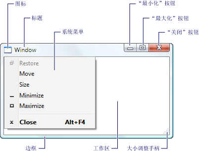
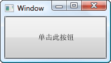
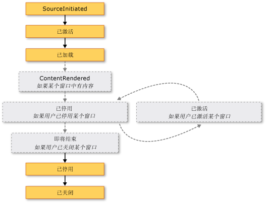
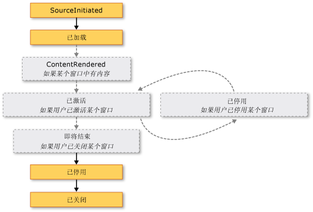

# <a name="wpf-windows-overview"></a><span data-ttu-id="4aeda-102">WPF Windows 概述</span><span class="sxs-lookup"><span data-stu-id="4aeda-102">WPF Windows Overview</span></span>
<span data-ttu-id="4aeda-103">用户通过窗口与 [!INCLUDE[TLA#tla_wpf](../../../../includes/tlasharptla-wpf-md.md)] 独立应用程序交互。</span><span class="sxs-lookup"><span data-stu-id="4aeda-103">Users interact with [!INCLUDE[TLA#tla_wpf](../../../../includes/tlasharptla-wpf-md.md)] standalone applications through windows.</span></span> <span data-ttu-id="4aeda-104">窗口的主要用途是托管使数据可视化并使用户能够与数据交互的内容。</span><span class="sxs-lookup"><span data-stu-id="4aeda-104">The primary purpose of a window is to host content that visualizes data and enables users to interact with data.</span></span> <span data-ttu-id="4aeda-105">独立[!INCLUDE[TLA2#tla_wpf](../../../../includes/tla2sharptla-wpf-md.md)]应用程序通过提供其自己的 windows<xref:System.Windows.Window>类。</span><span class="sxs-lookup"><span data-stu-id="4aeda-105">Standalone [!INCLUDE[TLA2#tla_wpf](../../../../includes/tla2sharptla-wpf-md.md)] applications provide their own windows by using the <xref:System.Windows.Window> class.</span></span> <span data-ttu-id="4aeda-106">本主题介绍<xref:System.Windows.Window>之前涵盖创建和管理 windows 独立应用程序中的基础知识。</span><span class="sxs-lookup"><span data-stu-id="4aeda-106">This topic introduces <xref:System.Windows.Window> before covering the fundamentals of creating and managing windows in standalone applications.</span></span>  
  
> [!NOTE]
>  <span data-ttu-id="4aeda-107">浏览器承载[!INCLUDE[TLA2#tla_wpf](../../../../includes/tla2sharptla-wpf-md.md)]应用程序，包括[!INCLUDE[TLA#tla_xbap#plural](../../../../includes/tlasharptla-xbapsharpplural-md.md)]和松散[!INCLUDE[TLA#tla_xaml](../../../../includes/tlasharptla-xaml-md.md)]页，未提供它们自己的窗口。</span><span class="sxs-lookup"><span data-stu-id="4aeda-107">Browser-hosted [!INCLUDE[TLA2#tla_wpf](../../../../includes/tla2sharptla-wpf-md.md)] applications, including [!INCLUDE[TLA#tla_xbap#plural](../../../../includes/tlasharptla-xbapsharpplural-md.md)] and loose [!INCLUDE[TLA#tla_xaml](../../../../includes/tlasharptla-xaml-md.md)] pages, don't provide their own windows.</span></span> <span data-ttu-id="4aeda-108">相反，由提供的窗口中承载它们[!INCLUDE[TLA#tla_iegeneric](../../../../includes/tlasharptla-iegeneric-md.md)]。</span><span class="sxs-lookup"><span data-stu-id="4aeda-108">Instead, they are hosted in windows provided by [!INCLUDE[TLA#tla_iegeneric](../../../../includes/tlasharptla-iegeneric-md.md)].</span></span> <span data-ttu-id="4aeda-109">请参阅[WPF XAML 浏览器应用程序概述](../../../../docs/framework/wpf/app-development/wpf-xaml-browser-applications-overview.md)。</span><span class="sxs-lookup"><span data-stu-id="4aeda-109">See [WPF XAML Browser Applications Overview](../../../../docs/framework/wpf/app-development/wpf-xaml-browser-applications-overview.md).</span></span>  
  
  
<a name="TheWindowClass"></a>   
## <a name="the-window-class"></a><span data-ttu-id="4aeda-110">窗口类</span><span class="sxs-lookup"><span data-stu-id="4aeda-110">The Window Class</span></span>  
 <span data-ttu-id="4aeda-111">下图展示了窗口的构成部分。</span><span class="sxs-lookup"><span data-stu-id="4aeda-111">The following figure illustrates the constituent parts of a window.</span></span>  
  
 <span data-ttu-id="4aeda-112"></span><span class="sxs-lookup"><span data-stu-id="4aeda-112"></span></span>  
  
 <span data-ttu-id="4aeda-113">窗口分为两个区域：非工作区和工作区。</span><span class="sxs-lookup"><span data-stu-id="4aeda-113">A window is divided into two areas: the non-client area and client area.</span></span>  
  
 <span data-ttu-id="4aeda-114">*非工作区*的一个窗口由[!INCLUDE[TLA2#tla_wpf](../../../../includes/tla2sharptla-wpf-md.md)]和包括的组成部分窗口所共有的大多数窗口，其中包括：</span><span class="sxs-lookup"><span data-stu-id="4aeda-114">The *non-client area* of a window is implemented by [!INCLUDE[TLA2#tla_wpf](../../../../includes/tla2sharptla-wpf-md.md)] and includes the parts of a window that are common to most windows, including the following:</span></span>  
  
-   <span data-ttu-id="4aeda-115">边框。</span><span class="sxs-lookup"><span data-stu-id="4aeda-115">A border.</span></span>  
  
-   <span data-ttu-id="4aeda-116">标题栏。</span><span class="sxs-lookup"><span data-stu-id="4aeda-116">A title bar.</span></span>  
  
-   <span data-ttu-id="4aeda-117">图标。</span><span class="sxs-lookup"><span data-stu-id="4aeda-117">An icon.</span></span>  
  
-   <span data-ttu-id="4aeda-118">“最小化”、“最大化”和“还原”按钮。</span><span class="sxs-lookup"><span data-stu-id="4aeda-118">Minimize, Maximize, and Restore buttons.</span></span>  
  
-   <span data-ttu-id="4aeda-119">“关闭”按钮。</span><span class="sxs-lookup"><span data-stu-id="4aeda-119">A Close button.</span></span>  
  
-   <span data-ttu-id="4aeda-120">“系统”菜单，其中包含允许用户最小化、最大化、还原、移动和关闭窗口以及重设窗口大小的菜单项。</span><span class="sxs-lookup"><span data-stu-id="4aeda-120">A System menu with menu items that allow users to minimize, maximize, restore, move, resize, and close a window.</span></span>  
  
 <span data-ttu-id="4aeda-121">*客户端区域*窗口是窗口的非工作区的区域和开发人员用于添加特定于应用程序的内容，如菜单栏、 工具和控件。</span><span class="sxs-lookup"><span data-stu-id="4aeda-121">The *client area* of a window is the area within a window's non-client area and is used by developers to add application-specific content, such as menu bars, tool bars, and controls.</span></span>  
  
 <span data-ttu-id="4aeda-122">在[!INCLUDE[TLA2#tla_wpf](../../../../includes/tla2sharptla-wpf-md.md)]，包装一个窗口<xref:System.Windows.Window>类，该类用于执行以下操作：</span><span class="sxs-lookup"><span data-stu-id="4aeda-122">In [!INCLUDE[TLA2#tla_wpf](../../../../includes/tla2sharptla-wpf-md.md)], a window is encapsulated by the <xref:System.Windows.Window> class that you use to do the following:</span></span>  
  
-   <span data-ttu-id="4aeda-123">显示窗口。</span><span class="sxs-lookup"><span data-stu-id="4aeda-123">Display a window.</span></span>  
  
-   <span data-ttu-id="4aeda-124">配置窗口的大小、位置和外观。</span><span class="sxs-lookup"><span data-stu-id="4aeda-124">Configure the size, position, and appearance of a window.</span></span>  
  
-   <span data-ttu-id="4aeda-125">托管特定于应用程序的内容。</span><span class="sxs-lookup"><span data-stu-id="4aeda-125">Host application-specific content.</span></span>  
  
-   <span data-ttu-id="4aeda-126">管理窗口的生存期。</span><span class="sxs-lookup"><span data-stu-id="4aeda-126">Manage the lifetime of a window.</span></span>  
  
<a name="DefiningAWindow"></a>   
## <a name="implementing-a-window"></a><span data-ttu-id="4aeda-127">实现窗口</span><span class="sxs-lookup"><span data-stu-id="4aeda-127">Implementing a Window</span></span>  
 <span data-ttu-id="4aeda-128">典型的窗口的实现包含外观和行为，其中*外观*定义用户看到一个窗口的样子和*行为*定义窗口的作用与用户进行交互的方式使用它。</span><span class="sxs-lookup"><span data-stu-id="4aeda-128">The implementation of a typical window comprises both appearance and behavior, where *appearance* defines how a window looks to users and *behavior* defines the way a window functions as users interact with it.</span></span> <span data-ttu-id="4aeda-129">在[!INCLUDE[TLA2#tla_wpf](../../../../includes/tla2sharptla-wpf-md.md)]、 可以实现的外观和行为的窗口中使用代码或[!INCLUDE[TLA2#tla_xaml](../../../../includes/tla2sharptla-xaml-md.md)]标记。</span><span class="sxs-lookup"><span data-stu-id="4aeda-129">In [!INCLUDE[TLA2#tla_wpf](../../../../includes/tla2sharptla-wpf-md.md)], you can implement the appearance and behavior of a window using either code or [!INCLUDE[TLA2#tla_xaml](../../../../includes/tla2sharptla-xaml-md.md)] markup.</span></span>  
  
 <span data-ttu-id="4aeda-130">一般情况下，但是，一个窗口的外观实现使用[!INCLUDE[TLA2#tla_xaml](../../../../includes/tla2sharptla-xaml-md.md)]标记，其行为实现和使用代码隐藏，如下面的示例中所示。</span><span class="sxs-lookup"><span data-stu-id="4aeda-130">In general, however, the appearance of a window is implemented using [!INCLUDE[TLA2#tla_xaml](../../../../includes/tla2sharptla-xaml-md.md)] markup, and its behavior is implemented using code-behind, as shown in the following example.</span></span>  
  
 [!code-xaml[WindowsOverviewSnippets#MarkupAndCodeBehindWindowMARKUP](../../../../samples/snippets/csharp/VS_Snippets_Wpf/WindowsOverviewSnippets/CSharp/MarkupAndCodeBehindWindow.xaml#markupandcodebehindwindowmarkup)]  
  
 [!code-csharp[WindowsOverviewSnippets#MarkupAndCodeBehindWindowCODEBEHIND](../../../../samples/snippets/csharp/VS_Snippets_Wpf/WindowsOverviewSnippets/CSharp/MarkupAndCodeBehindWindow.xaml.cs#markupandcodebehindwindowcodebehind)]
 [!code-vb[WindowsOverviewSnippets#MarkupAndCodeBehindWindowCODEBEHIND](../../../../samples/snippets/visualbasic/VS_Snippets_Wpf/WindowsOverviewSnippets/VisualBasic/MarkupAndCodeBehindWindow.xaml.vb#markupandcodebehindwindowcodebehind)]  
  
 <span data-ttu-id="4aeda-131">若要启用[!INCLUDE[TLA2#tla_xaml](../../../../includes/tla2sharptla-xaml-md.md)]标记文件和代码隐藏文件配合工作，需要以下项：</span><span class="sxs-lookup"><span data-stu-id="4aeda-131">To enable a [!INCLUDE[TLA2#tla_xaml](../../../../includes/tla2sharptla-xaml-md.md)] markup file and code-behind file to work together, the following are required:</span></span>  
  
-   <span data-ttu-id="4aeda-132">在标记中，`Window`元素必须包含`x:Class`属性。</span><span class="sxs-lookup"><span data-stu-id="4aeda-132">In markup, the `Window` element must include the `x:Class` attribute.</span></span> <span data-ttu-id="4aeda-133">当生成应用程序，是否存在`x:Class`文件会导致在标记中[!INCLUDE[TLA#tla_msbuild](../../../../includes/tlasharptla-msbuild-md.md)]创建`partial`派生自的类<xref:System.Windows.Window>并具有指定名称`x:Class`属性。</span><span class="sxs-lookup"><span data-stu-id="4aeda-133">When the application is built, the existence of `x:Class` in the markup file causes [!INCLUDE[TLA#tla_msbuild](../../../../includes/tlasharptla-msbuild-md.md)] to create a `partial` class that derives from <xref:System.Windows.Window> and has the name that is specified by the `x:Class` attribute.</span></span> <span data-ttu-id="4aeda-134">这需要添加[!INCLUDE[TLA2#tla_xml](../../../../includes/tla2sharptla-xml-md.md)]命名空间声明[!INCLUDE[TLA2#tla_xaml](../../../../includes/tla2sharptla-xaml-md.md)]架构 ( `xmlns:x="http://schemas.microsoft.com/winfx/2006/xaml"` )。</span><span class="sxs-lookup"><span data-stu-id="4aeda-134">This requires the addition of an [!INCLUDE[TLA2#tla_xml](../../../../includes/tla2sharptla-xml-md.md)] namespace declaration for the [!INCLUDE[TLA2#tla_xaml](../../../../includes/tla2sharptla-xaml-md.md)] schema ( `xmlns:x="http://schemas.microsoft.com/winfx/2006/xaml"` ).</span></span> <span data-ttu-id="4aeda-135">生成`partial`类实现`InitializeComponent`方法，调用以注册事件，并设置在标记中实现的属性。</span><span class="sxs-lookup"><span data-stu-id="4aeda-135">The generated `partial` class implements the `InitializeComponent` method, which is called to register the events and set the properties that are implemented in markup.</span></span>  
  
-   <span data-ttu-id="4aeda-136">代码隐藏文件中的类必须`partial`类具有相同名称指定的`x:Class`属性标记，且必须派生自<xref:System.Windows.Window>。</span><span class="sxs-lookup"><span data-stu-id="4aeda-136">In code-behind, the class must be a `partial` class with the same name that is specified by the `x:Class` attribute in markup, and it must derive from <xref:System.Windows.Window>.</span></span> <span data-ttu-id="4aeda-137">这样，要与之关联的代码隐藏文件`partial`时生成应用程序为标记文件生成的类 (请参阅[生成 WPF 应用程序](../../../../docs/framework/wpf/app-development/building-a-wpf-application-wpf.md))。</span><span class="sxs-lookup"><span data-stu-id="4aeda-137">This allows the code-behind file to be associated with the `partial` class that is generated for the markup file when the application is built (see [Building a WPF Application](../../../../docs/framework/wpf/app-development/building-a-wpf-application-wpf.md)).</span></span>  
  
-   <span data-ttu-id="4aeda-138">代码隐藏文件中<xref:System.Windows.Window>类必须实现的构造函数的调用`InitializeComponent`方法。</span><span class="sxs-lookup"><span data-stu-id="4aeda-138">In code-behind, the <xref:System.Windows.Window> class must implement a constructor that calls the `InitializeComponent` method.</span></span> <span data-ttu-id="4aeda-139">`InitializeComponent` 实现通过标记文件的生成`partial`类注册事件和设置在标记中定义的属性。</span><span class="sxs-lookup"><span data-stu-id="4aeda-139">`InitializeComponent` is implemented by the markup file's generated `partial` class to register events and set properties that are defined in markup.</span></span>  
  
> [!NOTE]
>  <span data-ttu-id="4aeda-140">添加新<xref:System.Windows.Window>到你的项目使用[!INCLUDE[TLA#tla_visualstu](../../../../includes/tlasharptla-visualstu-md.md)]、<xref:System.Windows.Window>使用标记和代码隐藏实现，并包括必需的配置，以便创建为标记和代码隐藏文件之间的关联此处所述。</span><span class="sxs-lookup"><span data-stu-id="4aeda-140">When you add a new <xref:System.Windows.Window> to your project by using [!INCLUDE[TLA#tla_visualstu](../../../../includes/tlasharptla-visualstu-md.md)], the <xref:System.Windows.Window> is implemented using both markup and code-behind, and includes the necessary configuration to create the association between the markup and code-behind files as described here.</span></span>  
  
 <span data-ttu-id="4aeda-141">进行此配置之后，你可以专注于定义中的窗口的外观[!INCLUDE[TLA2#tla_xaml](../../../../includes/tla2sharptla-xaml-md.md)]标记和代码隐藏文件中实现其行为。</span><span class="sxs-lookup"><span data-stu-id="4aeda-141">With this configuration in place, you can focus on defining the appearance of the window in [!INCLUDE[TLA2#tla_xaml](../../../../includes/tla2sharptla-xaml-md.md)] markup and implementing its behavior in code-behind.</span></span> <span data-ttu-id="4aeda-142">下面的示例演示具有按钮，在中实现的窗口[!INCLUDE[TLA2#tla_xaml](../../../../includes/tla2sharptla-xaml-md.md)]标记，并为按钮的事件处理程序<xref:System.Windows.Controls.Primitives.ButtonBase.Click>代码隐藏文件中实现的事件。</span><span class="sxs-lookup"><span data-stu-id="4aeda-142">The following example shows a window with a button, implemented in [!INCLUDE[TLA2#tla_xaml](../../../../includes/tla2sharptla-xaml-md.md)] markup, and an event handler for the button's <xref:System.Windows.Controls.Primitives.ButtonBase.Click> event, implemented in code-behind.</span></span>  
  
 [!code-xaml[WindowsOverviewWindowWithButtonSnippets#MarkupAndCodeBehindWindowMARKUP](../../../../samples/snippets/csharp/VS_Snippets_Wpf/WindowsOverviewWindowWithButtonSnippets/CSharp/MarkupAndCodeBehindWindow.xaml#markupandcodebehindwindowmarkup)]  
  
 [!code-csharp[WindowsOverviewWindowWithButtonSnippets#MarkupAndCodeBehindWindowCODEBEHIND](../../../../samples/snippets/csharp/VS_Snippets_Wpf/WindowsOverviewWindowWithButtonSnippets/CSharp/MarkupAndCodeBehindWindow.xaml.cs#markupandcodebehindwindowcodebehind)]
 [!code-vb[WindowsOverviewWindowWithButtonSnippets#MarkupAndCodeBehindWindowCODEBEHIND](../../../../samples/snippets/visualbasic/VS_Snippets_Wpf/WindowsOverviewWindowWithButtonSnippets/VisualBasic/MarkupAndCodeBehindWindow.xaml.vb#markupandcodebehindwindowcodebehind)]  
  
<a name="ConfiguringWindowForMSBuild"></a>   
## <a name="configuring-a-window-definition-for-msbuild"></a><span data-ttu-id="4aeda-143">为 MSBuild 配置窗口定义</span><span class="sxs-lookup"><span data-stu-id="4aeda-143">Configuring a Window Definition for MSBuild</span></span>  
 <span data-ttu-id="4aeda-144">如何实现你的窗口确定如何为配置[!INCLUDE[TLA2#tla_msbuild](../../../../includes/tla2sharptla-msbuild-md.md)]。</span><span class="sxs-lookup"><span data-stu-id="4aeda-144">How you implement your window determines how it is configured for [!INCLUDE[TLA2#tla_msbuild](../../../../includes/tla2sharptla-msbuild-md.md)].</span></span> <span data-ttu-id="4aeda-145">窗口定义同时使用[!INCLUDE[TLA2#tla_xaml](../../../../includes/tla2sharptla-xaml-md.md)]标记和代码隐藏：</span><span class="sxs-lookup"><span data-stu-id="4aeda-145">For a window that is defined using both [!INCLUDE[TLA2#tla_xaml](../../../../includes/tla2sharptla-xaml-md.md)] markup and code-behind:</span></span>  
  
-   [!INCLUDE[TLA2#tla_xaml](../../../../includes/tla2sharptla-xaml-md.md)]<span data-ttu-id="4aeda-146"> 标记文件配置为[!INCLUDE[TLA2#tla_msbuild](../../../../includes/tla2sharptla-msbuild-md.md)]`Page`项。</span><span class="sxs-lookup"><span data-stu-id="4aeda-146"> markup files are configured as [!INCLUDE[TLA2#tla_msbuild](../../../../includes/tla2sharptla-msbuild-md.md)]`Page` items.</span></span>  
  
-   <span data-ttu-id="4aeda-147">代码隐藏文件配置为[!INCLUDE[TLA2#tla_msbuild](../../../../includes/tla2sharptla-msbuild-md.md)]`Compile`项。</span><span class="sxs-lookup"><span data-stu-id="4aeda-147">Code-behind files are configured as [!INCLUDE[TLA2#tla_msbuild](../../../../includes/tla2sharptla-msbuild-md.md)]`Compile` items.</span></span>  
  
 <span data-ttu-id="4aeda-148">这如下所示[!INCLUDE[TLA2#tla_msbuild](../../../../includes/tla2sharptla-msbuild-md.md)]项目文件。</span><span class="sxs-lookup"><span data-stu-id="4aeda-148">This is shown in the following [!INCLUDE[TLA2#tla_msbuild](../../../../includes/tla2sharptla-msbuild-md.md)] project file.</span></span>  
  
```xml  
<Project ...  
                xmlns="http://schemas.microsoft.com/developer/msbuild/2003">  
    ...  
    <Page Include="MarkupAndCodeBehindWindow.xaml" />  
    <Compile Include=" MarkupAndCodeBehindWindow.xaml.cs" />  
    ...  
</Project>  
```  
  
 <span data-ttu-id="4aeda-149">有关构建[!INCLUDE[TLA2#tla_wpf](../../../../includes/tla2sharptla-wpf-md.md)]应用程序，请参阅[生成 WPF 应用程序](../../../../docs/framework/wpf/app-development/building-a-wpf-application-wpf.md)。</span><span class="sxs-lookup"><span data-stu-id="4aeda-149">For information about building [!INCLUDE[TLA2#tla_wpf](../../../../includes/tla2sharptla-wpf-md.md)] applications, see [Building a WPF Application](../../../../docs/framework/wpf/app-development/building-a-wpf-application-wpf.md).</span></span>  
  
<a name="WindowLifetime"></a>   
## <a name="window-lifetime"></a><span data-ttu-id="4aeda-150">窗口生存期</span><span class="sxs-lookup"><span data-stu-id="4aeda-150">Window Lifetime</span></span>  
 <span data-ttu-id="4aeda-151">与所有类一样，窗口也有生存期，开始于首次实例化窗口，在这之后将打开、激活、停用直至最终关闭窗口。</span><span class="sxs-lookup"><span data-stu-id="4aeda-151">As with any class, a window has a lifetime that begins when it is first instantiated, after which it is opened, activated and deactivated, and eventually closed.</span></span>  
  
  
<a name="Opening_a_Window"></a>   
### <a name="opening-a-window"></a><span data-ttu-id="4aeda-152">打开窗口</span><span class="sxs-lookup"><span data-stu-id="4aeda-152">Opening a Window</span></span>  
 <span data-ttu-id="4aeda-153">若要打开窗口，首先要创建窗口实例，下面的示例演示此操作。</span><span class="sxs-lookup"><span data-stu-id="4aeda-153">To open a window, you first create an instance of it, which is demonstrated in the following example.</span></span>  
  
 [!code-xaml[WindowsOverviewStartupEventSnippets#AppMARKUP](../../../../samples/snippets/csharp/VS_Snippets_Wpf/WindowsOverviewStartupEventSnippets/CSharp/App.xaml#appmarkup)]  
  
 [!code-csharp[WindowsOverviewStartupEventSnippets#AppCODEBEHIND](../../../../samples/snippets/csharp/VS_Snippets_Wpf/WindowsOverviewStartupEventSnippets/CSharp/App.xaml.cs#appcodebehind)]  
  
 <span data-ttu-id="4aeda-154">在此示例中，`MarkupAndCodeBehindWindow`实例化应用程序启动时，出现这种情况时<xref:System.Windows.Application.Startup>引发事件。</span><span class="sxs-lookup"><span data-stu-id="4aeda-154">In this example, the `MarkupAndCodeBehindWindow` is instantiated when the application starts, which occurs when the <xref:System.Windows.Application.Startup> event is raised.</span></span>  
  
 <span data-ttu-id="4aeda-155">实例化一个窗口时，对它的引用自动添加到由管理的 windows 列表<xref:System.Windows.Application>对象 (请参阅<xref:System.Windows.Application.Windows%2A?displayProperty=nameWithType>)。</span><span class="sxs-lookup"><span data-stu-id="4aeda-155">When a window is instantiated, a reference to it is automatically added to a list of windows that is managed by the <xref:System.Windows.Application> object (see <xref:System.Windows.Application.Windows%2A?displayProperty=nameWithType>).</span></span> <span data-ttu-id="4aeda-156">此外，要实例化的第一个窗口，默认情况下，将由<xref:System.Windows.Application>作为主应用程序窗口 (请参阅<xref:System.Windows.Application.MainWindow%2A?displayProperty=nameWithType>)。</span><span class="sxs-lookup"><span data-stu-id="4aeda-156">Additionally, the first window to be instantiated is, by default, set by <xref:System.Windows.Application> as the main application window (see <xref:System.Windows.Application.MainWindow%2A?displayProperty=nameWithType>).</span></span>  
  
 <span data-ttu-id="4aeda-157">通过调用最后打开此窗口<xref:System.Windows.Window.Show%2A>方法; 的结果显示在下图。</span><span class="sxs-lookup"><span data-stu-id="4aeda-157">The window is finally opened by calling the <xref:System.Windows.Window.Show%2A> method; the result is shown in the following figure.</span></span>  
  
 <span data-ttu-id="4aeda-158"></span><span class="sxs-lookup"><span data-stu-id="4aeda-158"></span></span>  
  
 <span data-ttu-id="4aeda-159">通过调用打开一个窗口<xref:System.Windows.Window.Show%2A>是无模式窗口中，这意味着应用程序会在允许用户激活同一个应用程序中的其他窗口的模式下运行。</span><span class="sxs-lookup"><span data-stu-id="4aeda-159">A window that is opened by calling <xref:System.Windows.Window.Show%2A> is a modeless window, which means that the application operates in a mode that allows users to activate other windows in the same application.</span></span>  
  
> [!NOTE]
>  <span data-ttu-id="4aeda-160"><xref:System.Windows.Window.ShowDialog%2A> 调用以模式方式打开窗口，如对话框。</span><span class="sxs-lookup"><span data-stu-id="4aeda-160"><xref:System.Windows.Window.ShowDialog%2A> is called to open windows such as dialog boxes modally.</span></span> <span data-ttu-id="4aeda-161">请参阅[对话框概述](../../../../docs/framework/wpf/app-development/dialog-boxes-overview.md)有关详细信息。</span><span class="sxs-lookup"><span data-stu-id="4aeda-161">See [Dialog Boxes Overview](../../../../docs/framework/wpf/app-development/dialog-boxes-overview.md) for more information.</span></span>  
  
 <span data-ttu-id="4aeda-162">当<xref:System.Windows.Window.Show%2A>是调用，窗口执行初始化工作之前它显示的用于建立这样一来接收用户输入的基础结构。</span><span class="sxs-lookup"><span data-stu-id="4aeda-162">When <xref:System.Windows.Window.Show%2A> is called, a window performs initialization work before it is shown to establish infrastructure that allows it to receive user input.</span></span> <span data-ttu-id="4aeda-163">初始化窗口时，<xref:System.Windows.Window.SourceInitialized>引发事件和显示的窗口。</span><span class="sxs-lookup"><span data-stu-id="4aeda-163">When the window is initialized, the <xref:System.Windows.Window.SourceInitialized> event is raised and the window is shown.</span></span>  
  
 <span data-ttu-id="4aeda-164">作为快捷方式，<xref:System.Windows.Application.StartupUri%2A>可以设置为指定第一个应用程序启动时自动打开的窗口。</span><span class="sxs-lookup"><span data-stu-id="4aeda-164">As a shortcut, <xref:System.Windows.Application.StartupUri%2A> can be set to specify the first window that is opened automatically when an application starts.</span></span>  
  
 [!code-xaml[WindowsOverviewSnippets#ApplicationStartupUriMARKUP](../../../../samples/snippets/csharp/VS_Snippets_Wpf/WindowsOverviewSnippets/CSharp/App.xaml#applicationstartupurimarkup)]  
  
 <span data-ttu-id="4aeda-165">当应用程序启动时，指定的值的窗口<xref:System.Windows.Application.StartupUri%2A>打开以无模式方式; 在内部，打开窗口时通过调用其<xref:System.Windows.Window.Show%2A>方法。</span><span class="sxs-lookup"><span data-stu-id="4aeda-165">When the application starts, the window specified by the value of <xref:System.Windows.Application.StartupUri%2A> is opened modelessly; internally, the window is opened by calling its <xref:System.Windows.Window.Show%2A> method.</span></span>  
  
<a name="Ownership"></a>   
#### <a name="window-ownership"></a><span data-ttu-id="4aeda-166">窗口所有权</span><span class="sxs-lookup"><span data-stu-id="4aeda-166">Window Ownership</span></span>  
 <span data-ttu-id="4aeda-167">通过打开一个窗口<xref:System.Windows.Window.Show%2A>方法不具有与窗口创建它的隐式关系; 用户可以与独立于另一个，这意味着两个窗口中可以执行以下任一窗口进行交互：</span><span class="sxs-lookup"><span data-stu-id="4aeda-167">A window that is opened by using the <xref:System.Windows.Window.Show%2A> method does not have an implicit relationship with the window that created it; users can interact with either window independently of the other, which means that either window can do the following:</span></span>  
  
-   <span data-ttu-id="4aeda-168">覆盖另 (除非一窗口具有其<xref:System.Windows.Window.Topmost%2A>属性设置为`true`)。</span><span class="sxs-lookup"><span data-stu-id="4aeda-168">Cover the other (unless one of the windows has its <xref:System.Windows.Window.Topmost%2A> property set to `true`).</span></span>  
  
-   <span data-ttu-id="4aeda-169">在不影响另一个窗口的情况下最小化、最大化和还原。</span><span class="sxs-lookup"><span data-stu-id="4aeda-169">Be minimized, maximized, and restored without affecting the other.</span></span>  
  
 <span data-ttu-id="4aeda-170">某些窗口要求与打开它们的窗口保持某种关系。</span><span class="sxs-lookup"><span data-stu-id="4aeda-170">Some windows require a relationship with the window that opens them.</span></span> <span data-ttu-id="4aeda-171">例如，[!INCLUDE[TLA#tla_ide](../../../../includes/tlasharptla-ide-md.md)]应用程序可能会打开属性窗口和工具窗口的典型行为是介绍创建它们的窗口。</span><span class="sxs-lookup"><span data-stu-id="4aeda-171">For example, an [!INCLUDE[TLA#tla_ide](../../../../includes/tlasharptla-ide-md.md)] application may open property windows and tool windows whose typical behavior is to cover the window that creates them.</span></span> <span data-ttu-id="4aeda-172">此外，此类窗口应始终与创建它们的窗口一起关闭、最小化、最大化和还原。</span><span class="sxs-lookup"><span data-stu-id="4aeda-172">Furthermore, such windows should always close, minimize, maximize, and restore in concert with the window that created them.</span></span> <span data-ttu-id="4aeda-173">可以通过使一个窗口建立这种关系*自己*另一个，并通过设置<xref:System.Windows.Window.Owner%2A>属性*拥有窗口*引用*所有者窗口*。</span><span class="sxs-lookup"><span data-stu-id="4aeda-173">Such a relationship can be established by making one window *own* another, and is achieved by setting the <xref:System.Windows.Window.Owner%2A> property of the *owned window* with a reference to the *owner window*.</span></span> <span data-ttu-id="4aeda-174">这在下面的示例中显示。</span><span class="sxs-lookup"><span data-stu-id="4aeda-174">This is shown in the following example.</span></span>  
  
 [!code-csharp[WindowOwnerOwnedWindowsSnippets#SetWindowOwnerCODE](../../../../samples/snippets/csharp/VS_Snippets_Wpf/WindowOwnerOwnedWindowsSnippets/CSharp/MainWindow.xaml.cs#setwindowownercode)]
 [!code-vb[WindowOwnerOwnedWindowsSnippets#SetWindowOwnerCODE](../../../../samples/snippets/visualbasic/VS_Snippets_Wpf/WindowOwnerOwnedWindowsSnippets/visualbasic/mainwindow.xaml.vb#setwindowownercode)]  
  
 <span data-ttu-id="4aeda-175">建立所有权后：</span><span class="sxs-lookup"><span data-stu-id="4aeda-175">After ownership is established:</span></span>  
  
-   <span data-ttu-id="4aeda-176">拥有的窗口可以通过检查的值引用其所有者窗口其<xref:System.Windows.Window.Owner%2A>属性。</span><span class="sxs-lookup"><span data-stu-id="4aeda-176">The owned window can reference its owner window by inspecting the value of its <xref:System.Windows.Window.Owner%2A> property.</span></span>  
  
-   <span data-ttu-id="4aeda-177">所有者窗口可以发现它通过检查的值所拥有的所有 windows 其<xref:System.Windows.Window.OwnedWindows%2A>属性。</span><span class="sxs-lookup"><span data-stu-id="4aeda-177">The owner window can discover all the windows it owns by inspecting the value of its <xref:System.Windows.Window.OwnedWindows%2A> property.</span></span>  
  
<a name="Preventing"></a>   
#### <a name="preventing-window-activation"></a><span data-ttu-id="4aeda-178">防止窗口激活</span><span class="sxs-lookup"><span data-stu-id="4aeda-178">Preventing Window Activation</span></span>  
 <span data-ttu-id="4aeda-179">有一些的情形其中 windows 应不显示时激活，如 Internet messenger 样式应用程序的对话窗口或电子邮件应用程序的通知窗口。</span><span class="sxs-lookup"><span data-stu-id="4aeda-179">There are scenarios where windows should not be activated when shown, such as conversation windows of an Internet messenger-style application or notification windows of an email application.</span></span>  
  
 <span data-ttu-id="4aeda-180">如果你的应用程序具有一个窗口，在显示时，不应被激活，则可以设置其<xref:System.Windows.Window.ShowActivated%2A>属性`false`之前调用<xref:System.Windows.Window.Show%2A>第一次的方法。</span><span class="sxs-lookup"><span data-stu-id="4aeda-180">If your application has a window that shouldn't be activated when shown, you can set its <xref:System.Windows.Window.ShowActivated%2A> property to `false` before calling the <xref:System.Windows.Window.Show%2A> method for the first time.</span></span> <span data-ttu-id="4aeda-181">结果是：</span><span class="sxs-lookup"><span data-stu-id="4aeda-181">As a consequence:</span></span>  
  
-   <span data-ttu-id="4aeda-182">不会激活窗口。</span><span class="sxs-lookup"><span data-stu-id="4aeda-182">The window is not activated.</span></span>  
  
-   <span data-ttu-id="4aeda-183">窗口的<xref:System.Windows.Window.Activated>不会引发事件。</span><span class="sxs-lookup"><span data-stu-id="4aeda-183">The window's <xref:System.Windows.Window.Activated> event is not raised.</span></span>  
  
-   <span data-ttu-id="4aeda-184">当前激活的窗口保持激活状态。</span><span class="sxs-lookup"><span data-stu-id="4aeda-184">The currently activated window remains activated.</span></span>  
  
 <span data-ttu-id="4aeda-185">但是，只要用户通过单击工作区或非工作区激活了窗口，窗口就会变为激活状态。</span><span class="sxs-lookup"><span data-stu-id="4aeda-185">The window will become activated, however, as soon as the user activates it by clicking either the client or non-client area.</span></span> <span data-ttu-id="4aeda-186">这种情况下：</span><span class="sxs-lookup"><span data-stu-id="4aeda-186">In this case:</span></span>  
  
-   <span data-ttu-id="4aeda-187">已激活窗口。</span><span class="sxs-lookup"><span data-stu-id="4aeda-187">The window is activated.</span></span>  
  
-   <span data-ttu-id="4aeda-188">窗口的<xref:System.Windows.Window.Activated>引发事件。</span><span class="sxs-lookup"><span data-stu-id="4aeda-188">The window's <xref:System.Windows.Window.Activated> event is raised.</span></span>  
  
-   <span data-ttu-id="4aeda-189">停用之前激活的窗口。</span><span class="sxs-lookup"><span data-stu-id="4aeda-189">The previously activated window is deactivated.</span></span>  
  
-   <span data-ttu-id="4aeda-190">窗口的<xref:System.Windows.Window.Deactivated>和<xref:System.Windows.Window.Activated>按预期方式响应用户操作，随后会引发事件。</span><span class="sxs-lookup"><span data-stu-id="4aeda-190">The window's <xref:System.Windows.Window.Deactivated> and <xref:System.Windows.Window.Activated> events are subsequently raised as expected in response to user actions.</span></span>  
  
<a name="Window_Activation"></a>   
### <a name="window-activation"></a><span data-ttu-id="4aeda-191">窗口激活</span><span class="sxs-lookup"><span data-stu-id="4aeda-191">Window Activation</span></span>  
 <span data-ttu-id="4aeda-192">当首次打开一个窗口时，它将变为活动窗口 (除非它还会显示<xref:System.Windows.Window.ShowActivated%2A>设置为`false`)。</span><span class="sxs-lookup"><span data-stu-id="4aeda-192">When a window is first opened, it becomes the active window (unless it is shown with <xref:System.Windows.Window.ShowActivated%2A> set to `false`).</span></span> <span data-ttu-id="4aeda-193">*活动窗口*是当前是否正在捕获用户输入，如键击和鼠标单击的窗口。</span><span class="sxs-lookup"><span data-stu-id="4aeda-193">The *active window* is the window that is currently capturing user input, such as key strokes and mouse clicks.</span></span> <span data-ttu-id="4aeda-194">当一个窗口变为活动状态时，它会发出<xref:System.Windows.Window.Activated>事件。</span><span class="sxs-lookup"><span data-stu-id="4aeda-194">When a window becomes active, it raises the <xref:System.Windows.Window.Activated> event.</span></span>  
  
> [!NOTE]
>  <span data-ttu-id="4aeda-195">当首次打开一个窗口时，<xref:System.Windows.FrameworkElement.Loaded>和<xref:System.Windows.Window.ContentRendered>之后才引发事件<xref:System.Windows.Window.Activated>引发事件。</span><span class="sxs-lookup"><span data-stu-id="4aeda-195">When a window is first opened, the <xref:System.Windows.FrameworkElement.Loaded> and <xref:System.Windows.Window.ContentRendered> events are raised only after the <xref:System.Windows.Window.Activated> event is raised.</span></span> <span data-ttu-id="4aeda-196">这一点，窗口可以有效地考虑时打开<xref:System.Windows.Window.ContentRendered>引发。</span><span class="sxs-lookup"><span data-stu-id="4aeda-196">With this in mind, a window can effectively be considered opened when <xref:System.Windows.Window.ContentRendered> is raised.</span></span>  
  
 <span data-ttu-id="4aeda-197">某个窗口成为活动窗口后，用户可以在同一应用程序内激活其他窗口，或者激活其他应用程序。</span><span class="sxs-lookup"><span data-stu-id="4aeda-197">After a window becomes active, a user can activate another window in the same application, or activate another application.</span></span> <span data-ttu-id="4aeda-198">当发生这种情况时，当前处于活动状态窗口变为停用，并且引发<xref:System.Windows.Window.Deactivated>事件。</span><span class="sxs-lookup"><span data-stu-id="4aeda-198">When that happens, the currently active window becomes deactivated and raises the <xref:System.Windows.Window.Deactivated> event.</span></span> <span data-ttu-id="4aeda-199">同样，当用户选择当前已停用的窗口，窗口再次变得频繁和<xref:System.Windows.Window.Activated>引发。</span><span class="sxs-lookup"><span data-stu-id="4aeda-199">Likewise, when the user selects a currently deactivated window, the window becomes active again and <xref:System.Windows.Window.Activated> is raised.</span></span>  
  
 <span data-ttu-id="4aeda-200">若要处理的一个常见原因<xref:System.Windows.Window.Activated>和<xref:System.Windows.Window.Deactivated>是启用和禁用只能运行一个窗口处于活动状态时的功能。</span><span class="sxs-lookup"><span data-stu-id="4aeda-200">One common reason to handle <xref:System.Windows.Window.Activated> and <xref:System.Windows.Window.Deactivated> is to enable and disable functionality that can only run when a window is active.</span></span> <span data-ttu-id="4aeda-201">例如，一些窗口显示需要用户持续输入或关注的交互式内容，这些内容包括游戏和视频播放器。</span><span class="sxs-lookup"><span data-stu-id="4aeda-201">For example, some windows display interactive content that requires constant user input or attention, including games and video players.</span></span> <span data-ttu-id="4aeda-202">下面的示例是一个简化的视频播放器，演示了如何处理<xref:System.Windows.Window.Activated>和<xref:System.Windows.Window.Deactivated>来实现此行为。</span><span class="sxs-lookup"><span data-stu-id="4aeda-202">The following example is a simplified video player that demonstrates how to handle <xref:System.Windows.Window.Activated> and <xref:System.Windows.Window.Deactivated> to implement this behavior.</span></span>  
  
 [!code-xaml[WindowsOverviewSnippets#ActivationDeactivationMARKUP](../../../../samples/snippets/csharp/VS_Snippets_Wpf/WindowsOverviewSnippets/CSharp/CustomMediaPlayerWindow.xaml#activationdeactivationmarkup)]  
  
 [!code-csharp[WindowsOverviewSnippets#ActivationDeactivationCODEBEHIND](../../../../samples/snippets/csharp/VS_Snippets_Wpf/WindowsOverviewSnippets/CSharp/CustomMediaPlayerWindow.xaml.cs#activationdeactivationcodebehind)]
 [!code-vb[WindowsOverviewSnippets#ActivationDeactivationCODEBEHIND](../../../../samples/snippets/visualbasic/VS_Snippets_Wpf/WindowsOverviewSnippets/VisualBasic/CustomMediaPlayerWindow.xaml.vb#activationdeactivationcodebehind)]  
  
 <span data-ttu-id="4aeda-203">停用某个窗口后，其他类型的应用程序可能仍会在后台运行代码。</span><span class="sxs-lookup"><span data-stu-id="4aeda-203">Other types of applications may still run code in the background when a window is deactivated.</span></span> <span data-ttu-id="4aeda-204">例如，在用户使用其他应用程序时，邮件客户端可能会继续轮询邮件服务器。</span><span class="sxs-lookup"><span data-stu-id="4aeda-204">For example, a mail client may continue polling the mail server while the user is using other applications.</span></span> <span data-ttu-id="4aeda-205">类似的应用程序在主窗口停用时，通常将提供不同或其他的行为。</span><span class="sxs-lookup"><span data-stu-id="4aeda-205">Applications like these often provide different or additional behavior while the main window is deactivated.</span></span> <span data-ttu-id="4aeda-206">对于邮件程序，这可能意味着将新邮件项添加到收件箱和将通知图标添加到系统任务栏。</span><span class="sxs-lookup"><span data-stu-id="4aeda-206">With respect to the mail program, this may mean both adding the new mail item to the inbox and adding a notification icon to the system tray.</span></span> <span data-ttu-id="4aeda-207">在邮件窗口未处于活动状态，可通过检查来确定时，才需要显示通知图标<xref:System.Windows.Window.IsActive%2A>属性。</span><span class="sxs-lookup"><span data-stu-id="4aeda-207">A notification icon need only be displayed when the mail window isn't active, which can be determined by inspecting the <xref:System.Windows.Window.IsActive%2A> property.</span></span>  
  
 <span data-ttu-id="4aeda-208">如果后台任务完成后，一个窗口可能想要更紧急通知用户，通过调用<xref:System.Windows.Window.Activate%2A>方法。</span><span class="sxs-lookup"><span data-stu-id="4aeda-208">If a background task completes, a window may want to notify the user more urgently by calling <xref:System.Windows.Window.Activate%2A> method.</span></span> <span data-ttu-id="4aeda-209">如果在用户交互与另一个应用程序激活时<xref:System.Windows.Window.Activate%2A>窗口的任务栏按钮闪烁的调用。</span><span class="sxs-lookup"><span data-stu-id="4aeda-209">If the user is interacting with another application activated when <xref:System.Windows.Window.Activate%2A> is called, the window's taskbar button flashes.</span></span> <span data-ttu-id="4aeda-210">如果用户与当前的应用程序交互，则调用<xref:System.Windows.Window.Activate%2A>将将该窗口调到前台。</span><span class="sxs-lookup"><span data-stu-id="4aeda-210">If a user is interacting with the current application, calling <xref:System.Windows.Window.Activate%2A> will bring the window to the foreground.</span></span>  
  
> [!NOTE]
>  <span data-ttu-id="4aeda-211">你可以处理应用程序作用域激活使用<xref:System.Windows.Application.Activated?displayProperty=nameWithType>和<xref:System.Windows.Application.Deactivated?displayProperty=nameWithType>事件。</span><span class="sxs-lookup"><span data-stu-id="4aeda-211">You can handle application-scope activation using the <xref:System.Windows.Application.Activated?displayProperty=nameWithType> and <xref:System.Windows.Application.Deactivated?displayProperty=nameWithType> events.</span></span>  
  
<a name="Closing_a_Window"></a>   
### <a name="closing-a-window"></a><span data-ttu-id="4aeda-212">关闭窗口</span><span class="sxs-lookup"><span data-stu-id="4aeda-212">Closing a Window</span></span>  
 <span data-ttu-id="4aeda-213">窗口的生存期在用户关闭它时终止。</span><span class="sxs-lookup"><span data-stu-id="4aeda-213">The life of a window starts coming to an end when a user closes it.</span></span> <span data-ttu-id="4aeda-214">可以使用非工作区中的元素关闭窗口，这些元素包括：</span><span class="sxs-lookup"><span data-stu-id="4aeda-214">A window can be closed by using elements in the non-client area, including the following:</span></span>  
  
-   <span data-ttu-id="4aeda-215">**关闭**项**系统**菜单。</span><span class="sxs-lookup"><span data-stu-id="4aeda-215">The **Close** item of the **System** menu.</span></span>  
  
-   <span data-ttu-id="4aeda-216">按 ALT+F4。</span><span class="sxs-lookup"><span data-stu-id="4aeda-216">Pressing ALT+F4.</span></span>  
  
-   <span data-ttu-id="4aeda-217">按**关闭**按钮。</span><span class="sxs-lookup"><span data-stu-id="4aeda-217">Pressing the **Close** button.</span></span>  
  
 <span data-ttu-id="4aeda-218">可以向工作区提供其他关闭窗口的机制，较为常见的机制包括：</span><span class="sxs-lookup"><span data-stu-id="4aeda-218">You can provide additional mechanisms to the client area to close a window, the more common of which include the following:</span></span>  
  
-   <span data-ttu-id="4aeda-219">**退出**中项**文件**菜单通常用于主应用程序窗口。</span><span class="sxs-lookup"><span data-stu-id="4aeda-219">An **Exit** item in the **File** menu, typically for main application windows.</span></span>  
  
-   <span data-ttu-id="4aeda-220">A**关闭**中项**文件**菜单上，通常出现在辅助应用程序窗口。</span><span class="sxs-lookup"><span data-stu-id="4aeda-220">A **Close** item in the **File** menu, typically on a secondary application window.</span></span>  
  
-   <span data-ttu-id="4aeda-221">A**取消**按钮，通常出现在一个模式对话框。</span><span class="sxs-lookup"><span data-stu-id="4aeda-221">A **Cancel** button, typically on a modal dialog box.</span></span>  
  
-   <span data-ttu-id="4aeda-222">A**关闭**按钮，通常出现在无模式对话框。</span><span class="sxs-lookup"><span data-stu-id="4aeda-222">A **Close** button, typically on a modeless dialog box.</span></span>  
  
 <span data-ttu-id="4aeda-223">若要关闭窗口以响应其中一种自定义机制，你需要调用<xref:System.Windows.Window.Close%2A>方法。</span><span class="sxs-lookup"><span data-stu-id="4aeda-223">To close a window in response to one of these custom mechanisms, you need to call the <xref:System.Windows.Window.Close%2A> method.</span></span> <span data-ttu-id="4aeda-224">下面的示例实现能够通过选择关闭窗口**退出**上**文件**菜单。</span><span class="sxs-lookup"><span data-stu-id="4aeda-224">The following example implements the ability to close a window by choosing the **Exit** on the **File** menu.</span></span>  
  
 [!code-xaml[WindowsOverviewSnippets#WindowWithFileExitMARKUP](../../../../samples/snippets/csharp/VS_Snippets_Wpf/WindowsOverviewSnippets/CSharp/WindowWithFileExit.xaml#windowwithfileexitmarkup)]  
  
 [!code-csharp[WindowsOverviewSnippets#WindowWithFileExitCODEBEHIND](../../../../samples/snippets/csharp/VS_Snippets_Wpf/WindowsOverviewSnippets/CSharp/WindowWithFileExit.xaml.cs#windowwithfileexitcodebehind)]
 [!code-vb[WindowsOverviewSnippets#WindowWithFileExitCODEBEHIND](../../../../samples/snippets/visualbasic/VS_Snippets_Wpf/WindowsOverviewSnippets/VisualBasic/WindowWithFileExit.xaml.vb#windowwithfileexitcodebehind)]  
  
 <span data-ttu-id="4aeda-225">当一个窗口关闭时，它会引发两个事件：<xref:System.Windows.Window.Closing>和<xref:System.Windows.Window.Closed>。</span><span class="sxs-lookup"><span data-stu-id="4aeda-225">When a window closes, it raises two events: <xref:System.Windows.Window.Closing> and <xref:System.Windows.Window.Closed>.</span></span>  
  
 <span data-ttu-id="4aeda-226"><xref:System.Windows.Window.Closing> 该窗口将关闭，并且它提供一种机制，闭包可以防止通过哪个窗口前引发。</span><span class="sxs-lookup"><span data-stu-id="4aeda-226"><xref:System.Windows.Window.Closing> is raised before the window closes, and it provides a mechanism by which window closure can be prevented.</span></span> <span data-ttu-id="4aeda-227">阻止窗口关闭的一个常见原因是窗口内容包含修改的数据。</span><span class="sxs-lookup"><span data-stu-id="4aeda-227">One common reason to prevent window closure is if window content contains modified data.</span></span> <span data-ttu-id="4aeda-228">在此情况下，<xref:System.Windows.Window.Closing>可以处理事件以确定是否数据有问题，如果是这样，让用户继续关闭窗口而不保存数据还是取消关闭窗口。</span><span class="sxs-lookup"><span data-stu-id="4aeda-228">In this situation, the <xref:System.Windows.Window.Closing> event can be handled to determine whether data is dirty and, if so, to ask the user whether to either continue closing the window without saving the data or to cancel window closure.</span></span> <span data-ttu-id="4aeda-229">下面的示例演示处理的重要方面<xref:System.Windows.Window.Closing>。</span><span class="sxs-lookup"><span data-stu-id="4aeda-229">The following example shows the key aspects of handling <xref:System.Windows.Window.Closing>.</span></span>  
  
 [!code-csharp[WindowClosingSnippets](../../../../samples/snippets/csharp/VS_Snippets_Wpf/WindowClosingSnippets/CSharp/DataWindow.xaml.cs)]
 [!code-vb[WindowClosingSnippets](../../../../samples/snippets/visualbasic/VS_Snippets_Wpf/WindowClosingSnippets/visualbasic/datawindow.xaml.vb)]  
 
  
 <span data-ttu-id="4aeda-230"><xref:System.Windows.Window.Closing>事件处理程序传递<xref:System.ComponentModel.CancelEventArgs>，该类实现`Boolean`<xref:System.ComponentModel.CancelEventArgs.Cancel%2A>属性设置为`true`可以阻止不能关闭窗口。</span><span class="sxs-lookup"><span data-stu-id="4aeda-230">The <xref:System.Windows.Window.Closing> event handler is passed a <xref:System.ComponentModel.CancelEventArgs>, which implements the `Boolean`<xref:System.ComponentModel.CancelEventArgs.Cancel%2A> property that you set to `true` to prevent a window from closing.</span></span>  
  
 <span data-ttu-id="4aeda-231">如果<xref:System.Windows.Window.Closing>未被处理，或处理但在不取消，将关闭此窗口。</span><span class="sxs-lookup"><span data-stu-id="4aeda-231">If <xref:System.Windows.Window.Closing> is not handled, or it is handled but not canceled, the window will close.</span></span> <span data-ttu-id="4aeda-232">只需一个窗口真正关闭之前，<xref:System.Windows.Window.Closed>引发。</span><span class="sxs-lookup"><span data-stu-id="4aeda-232">Just before a window actually closes, <xref:System.Windows.Window.Closed> is raised.</span></span> <span data-ttu-id="4aeda-233">此时，无法阻止窗口关闭。</span><span class="sxs-lookup"><span data-stu-id="4aeda-233">At this point, a window cannot be prevented from closing.</span></span>  
  
> [!NOTE]
>  <span data-ttu-id="4aeda-234">可以将应用程序配置为主要的应用程序窗口关闭时自动关闭 (请参阅<xref:System.Windows.Application.MainWindow%2A>) 或最后一个窗口关闭。</span><span class="sxs-lookup"><span data-stu-id="4aeda-234">An application can be configured to shut down automatically when either the main application window closes (see <xref:System.Windows.Application.MainWindow%2A>) or the last window closes.</span></span> <span data-ttu-id="4aeda-235">有关详细信息，请参阅<xref:System.Windows.Application.ShutdownMode%2A>。</span><span class="sxs-lookup"><span data-stu-id="4aeda-235">For details, see <xref:System.Windows.Application.ShutdownMode%2A>.</span></span>  
  
 <span data-ttu-id="4aeda-236">尽管可以通过在非客户端和客户端区域中提供的机制显式关闭窗口，窗口可能还会隐式由于关闭应用程序的其他部分中的行为或[!INCLUDE[TLA#tla_mswin](../../../../includes/tlasharptla-mswin-md.md)]，其中包括：</span><span class="sxs-lookup"><span data-stu-id="4aeda-236">While a window can be explicitly closed through mechanisms provided in the non-client and client areas, a window can also be implicitly closed as a result of behavior in other parts of the application or [!INCLUDE[TLA#tla_mswin](../../../../includes/tlasharptla-mswin-md.md)], including the following:</span></span>  
  
-   <span data-ttu-id="4aeda-237">用户注销或关闭 Windows。</span><span class="sxs-lookup"><span data-stu-id="4aeda-237">A user logs off or shuts down Windows.</span></span>  
  
-   <span data-ttu-id="4aeda-238">窗口的所有者关闭 (请参阅<xref:System.Windows.Window.Owner%2A>)。</span><span class="sxs-lookup"><span data-stu-id="4aeda-238">A window's owner closes (see <xref:System.Windows.Window.Owner%2A>).</span></span>  
  
-   <span data-ttu-id="4aeda-239">关闭应用程序主窗口和<xref:System.Windows.Application.ShutdownMode%2A>是<xref:System.Windows.ShutdownMode.OnMainWindowClose>。</span><span class="sxs-lookup"><span data-stu-id="4aeda-239">The main application window is closed and <xref:System.Windows.Application.ShutdownMode%2A> is <xref:System.Windows.ShutdownMode.OnMainWindowClose>.</span></span>  
  
-   <span data-ttu-id="4aeda-240">调用 <xref:System.Windows.Application.Shutdown%2A>。</span><span class="sxs-lookup"><span data-stu-id="4aeda-240"><xref:System.Windows.Application.Shutdown%2A> is called.</span></span>  
  
> [!NOTE]
>  <span data-ttu-id="4aeda-241">窗口在关闭后无法重新打开。</span><span class="sxs-lookup"><span data-stu-id="4aeda-241">A window cannot be reopened after it is closed.</span></span>  
  
<a name="Window_Lifetime_Events"></a>   
### <a name="window-lifetime-events"></a><span data-ttu-id="4aeda-242">窗口生存期事件</span><span class="sxs-lookup"><span data-stu-id="4aeda-242">Window Lifetime Events</span></span>  
 <span data-ttu-id="4aeda-243">下图显示窗口生存期中的主体事件的顺序。</span><span class="sxs-lookup"><span data-stu-id="4aeda-243">The following illustration shows the sequence of the principal events in the lifetime of a window.</span></span>  
  
 <span data-ttu-id="4aeda-244"></span><span class="sxs-lookup"><span data-stu-id="4aeda-244"></span></span>  
  
 <span data-ttu-id="4aeda-245">下图显示的生存期内的一个窗口，其中会显示为未激活的主体的事件的顺序 (<xref:System.Windows.Window.ShowActivated%2A>设置为`false`显示窗口之前)。</span><span class="sxs-lookup"><span data-stu-id="4aeda-245">The following illustration shows the sequence of the principal events in the lifetime of a window that is shown without activation (<xref:System.Windows.Window.ShowActivated%2A> is set to `false` before the window is shown).</span></span>  
  
 <span data-ttu-id="4aeda-246"></span><span class="sxs-lookup"><span data-stu-id="4aeda-246"></span></span>  
  
<a name="WindowLocation"></a>   
## <a name="window-location"></a><span data-ttu-id="4aeda-247">窗口位置</span><span class="sxs-lookup"><span data-stu-id="4aeda-247">Window Location</span></span>  
 <span data-ttu-id="4aeda-248">当窗口打开时，它在相对于桌面的 x 和 y 维度中有一个位置。</span><span class="sxs-lookup"><span data-stu-id="4aeda-248">While a window is open, it has a location in the x and y dimensions relative to the desktop.</span></span> <span data-ttu-id="4aeda-249">可通过检查来确定此位置<xref:System.Windows.Window.Left%2A>和<xref:System.Windows.Window.Top%2A>属性，分别。</span><span class="sxs-lookup"><span data-stu-id="4aeda-249">This location can be determined by inspecting the <xref:System.Windows.Window.Left%2A> and <xref:System.Windows.Window.Top%2A> properties, respectively.</span></span> <span data-ttu-id="4aeda-250">设置这些属性可以更改窗口的位置。</span><span class="sxs-lookup"><span data-stu-id="4aeda-250">You can set these properties to change the location of the window.</span></span>  
  
 <span data-ttu-id="4aeda-251">你还可以指定的初始位置<xref:System.Windows.Window>第一次出现时通过设置<xref:System.Windows.Window.WindowStartupLocation%2A>具有以下项之一属性<xref:System.Windows.WindowStartupLocation>枚举值：</span><span class="sxs-lookup"><span data-stu-id="4aeda-251">You can also specify the initial location of a <xref:System.Windows.Window> when it first appears by setting the <xref:System.Windows.Window.WindowStartupLocation%2A> property with one of the following <xref:System.Windows.WindowStartupLocation> enumeration values:</span></span>  
  
-   <span data-ttu-id="4aeda-252"><xref:System.Windows.WindowStartupLocation.CenterOwner>（默认值）</span><span class="sxs-lookup"><span data-stu-id="4aeda-252"><xref:System.Windows.WindowStartupLocation.CenterOwner> (default)</span></span>  
  
-   <xref:System.Windows.WindowStartupLocation.CenterScreen>  
  
-   <xref:System.Windows.WindowStartupLocation.Manual>  
  
 <span data-ttu-id="4aeda-253">如果启动位置指定为<xref:System.Windows.WindowStartupLocation.Manual>，和<xref:System.Windows.Window.Left%2A>和<xref:System.Windows.Window.Top%2A>尚未设置属性，<xref:System.Windows.Window>将要求的位置的 Windows 中显示。</span><span class="sxs-lookup"><span data-stu-id="4aeda-253">If the startup location is specified as <xref:System.Windows.WindowStartupLocation.Manual>, and the <xref:System.Windows.Window.Left%2A> and <xref:System.Windows.Window.Top%2A> properties have not been set, <xref:System.Windows.Window> will ask Windows for a location to appear in.</span></span>  
  
<a name="Topmost_Windows_and_Z_Order"></a>   
### <a name="topmost-windows-and-z-order"></a><span data-ttu-id="4aeda-254">最顶层窗口和 Z 顺序</span><span class="sxs-lookup"><span data-stu-id="4aeda-254">Topmost Windows and Z-Order</span></span>  
 <span data-ttu-id="4aeda-255">除了有 x 和 y 位置外，窗口还在 z 维度中有一个位置，该位置确定窗口相对于其他窗口的垂直位置。</span><span class="sxs-lookup"><span data-stu-id="4aeda-255">Besides having an x and y location, a window also has a location in the z dimension, which determines its vertical position with respect to other windows.</span></span> <span data-ttu-id="4aeda-256">它称为窗口的 z 顺序，并且有两种类型：正常 z 顺序和最顶层 z 顺序。</span><span class="sxs-lookup"><span data-stu-id="4aeda-256">This is known as the window's z-order, and there are two types: normal z-order and topmost z-order.</span></span> <span data-ttu-id="4aeda-257">在窗口的位置*正常的 z 顺序*由或不是当前处于活动状态。</span><span class="sxs-lookup"><span data-stu-id="4aeda-257">The location of a window in the *normal z-order* is determined by whether it is currently active or not.</span></span> <span data-ttu-id="4aeda-258">默认情况下，窗口位于正常 z 顺序中。</span><span class="sxs-lookup"><span data-stu-id="4aeda-258">By default, a window is located in the normal z-order.</span></span> <span data-ttu-id="4aeda-259">在窗口的位置*最顶层的 z 顺序*也由或不是当前处于活动状态。</span><span class="sxs-lookup"><span data-stu-id="4aeda-259">The location of a window in the *topmost z-order* is also determined by whether it is currently active or not.</span></span> <span data-ttu-id="4aeda-260">此外，最顶层 z 顺序中的窗口始终位于正常 z 顺序中的窗口之上。</span><span class="sxs-lookup"><span data-stu-id="4aeda-260">Furthermore, windows in the topmost z-order are always located above windows in the normal z-order.</span></span> <span data-ttu-id="4aeda-261">窗口位于最顶层的 z 顺序通过设置其<xref:System.Windows.Window.Topmost%2A>属性`true`。</span><span class="sxs-lookup"><span data-stu-id="4aeda-261">A window is located in the topmost z-order by setting its <xref:System.Windows.Window.Topmost%2A> property to `true`.</span></span>  
  
 [!code-xaml[WindowsOverviewSnippets#TopmostWindowMARKUP1](../../../../samples/snippets/csharp/VS_Snippets_Wpf/WindowsOverviewSnippets/CSharp/TopmostWindow.xaml#topmostwindowmarkup1)]  
  
 <span data-ttu-id="4aeda-262">在每个 z 顺序中，当前的活动窗口显示在同一 z 顺序中所有其他窗口之上。</span><span class="sxs-lookup"><span data-stu-id="4aeda-262">Within each z-order, the currently active window appears above all other windows in the same z-order.</span></span>  
  
<a name="WindowSize"></a>   
## <a name="window-size"></a><span data-ttu-id="4aeda-263">窗口大小</span><span class="sxs-lookup"><span data-stu-id="4aeda-263">Window Size</span></span>  
 <span data-ttu-id="4aeda-264">除了具有桌面位置，之外时，窗口具有由多个属性，包括各种的宽度和高度属性的大小和<xref:System.Windows.Window.SizeToContent%2A>。</span><span class="sxs-lookup"><span data-stu-id="4aeda-264">Besides having a desktop location, a window has a size that is determined by several properties, including the various width and height properties and <xref:System.Windows.Window.SizeToContent%2A>.</span></span>  
  
 <span data-ttu-id="4aeda-265"><xref:System.Windows.FrameworkElement.MinWidth%2A><xref:System.Windows.FrameworkElement.Width%2A>，和<xref:System.Windows.FrameworkElement.MaxWidth%2A>用于管理的一个窗口可以在其生存期内，并且配置了，如以下示例所示的宽度范围。</span><span class="sxs-lookup"><span data-stu-id="4aeda-265"><xref:System.Windows.FrameworkElement.MinWidth%2A>, <xref:System.Windows.FrameworkElement.Width%2A>, and <xref:System.Windows.FrameworkElement.MaxWidth%2A> are used to manage the range of widths that a window can have during its lifetime, and are configured as shown in the following example.</span></span>  
  
 [!code-xaml[WindowsOverviewSnippets#WidthWindowMARKUP1](../../../../samples/snippets/csharp/VS_Snippets_Wpf/WindowsOverviewSnippets/CSharp/WidthWindow.xaml#widthwindowmarkup1)]  
  
 <span data-ttu-id="4aeda-266">窗口高度由<xref:System.Windows.FrameworkElement.MinHeight%2A>， <xref:System.Windows.FrameworkElement.Height%2A>，和<xref:System.Windows.FrameworkElement.MaxHeight%2A>，并在下面的示例所示配置。</span><span class="sxs-lookup"><span data-stu-id="4aeda-266">Window height is managed by <xref:System.Windows.FrameworkElement.MinHeight%2A>, <xref:System.Windows.FrameworkElement.Height%2A>, and <xref:System.Windows.FrameworkElement.MaxHeight%2A>, and are configured as shown in the following example.</span></span>  
  
 [!code-xaml[WindowsOverviewSnippets#HeightWindowMARKUP1](../../../../samples/snippets/csharp/VS_Snippets_Wpf/WindowsOverviewSnippets/CSharp/HeightWindow.xaml#heightwindowmarkup1)]  
  
 <span data-ttu-id="4aeda-267">由于各种宽度值和高度值各自指定了一个范围，所以大小可调整大小的窗口的宽度和高度可以是相应维度中指定范围内的任何值。</span><span class="sxs-lookup"><span data-stu-id="4aeda-267">Because the various width values and height values each specify a range, it is possible for the width and height of a resizable window to be anywhere within the specified range for the respective dimension.</span></span> <span data-ttu-id="4aeda-268">若要检测其当前的宽度和高度，检查<xref:System.Windows.FrameworkElement.ActualWidth%2A>和<xref:System.Windows.FrameworkElement.ActualHeight%2A>分别。</span><span class="sxs-lookup"><span data-stu-id="4aeda-268">To detect its current width and height, inspect <xref:System.Windows.FrameworkElement.ActualWidth%2A> and <xref:System.Windows.FrameworkElement.ActualHeight%2A>, respectively.</span></span>  
  
 <span data-ttu-id="4aeda-269">如果你想要的宽度和你的窗口的高度以适应窗口大小的大小的内容，则可以使用<xref:System.Windows.Window.SizeToContent%2A>属性，它具有以下值：</span><span class="sxs-lookup"><span data-stu-id="4aeda-269">If you'd like the width and height of your window to have a size that fits to the size of the window's content, you can use the <xref:System.Windows.Window.SizeToContent%2A> property, which has the following values:</span></span>  
  
-   <span data-ttu-id="4aeda-270"><xref:System.Windows.SizeToContent.Manual>。</span><span class="sxs-lookup"><span data-stu-id="4aeda-270"><xref:System.Windows.SizeToContent.Manual>.</span></span> <span data-ttu-id="4aeda-271">不起作用（默认值）。</span><span class="sxs-lookup"><span data-stu-id="4aeda-271">No effect (default).</span></span>  
  
-   <span data-ttu-id="4aeda-272"><xref:System.Windows.SizeToContent.Width>。</span><span class="sxs-lookup"><span data-stu-id="4aeda-272"><xref:System.Windows.SizeToContent.Width>.</span></span> <span data-ttu-id="4aeda-273">适应内容宽度，具有相同的效果与设置同时<xref:System.Windows.FrameworkElement.MinWidth%2A>和<xref:System.Windows.FrameworkElement.MaxWidth%2A>到内容的宽度。</span><span class="sxs-lookup"><span data-stu-id="4aeda-273">Fit to content width, which has the same effect as setting both <xref:System.Windows.FrameworkElement.MinWidth%2A> and <xref:System.Windows.FrameworkElement.MaxWidth%2A> to the width of the content.</span></span>  
  
-   <span data-ttu-id="4aeda-274"><xref:System.Windows.SizeToContent.Height>。</span><span class="sxs-lookup"><span data-stu-id="4aeda-274"><xref:System.Windows.SizeToContent.Height>.</span></span> <span data-ttu-id="4aeda-275">适应内容的高度，具有相同的效果与设置同时<xref:System.Windows.FrameworkElement.MinHeight%2A>和<xref:System.Windows.FrameworkElement.MaxHeight%2A>到内容的高度。</span><span class="sxs-lookup"><span data-stu-id="4aeda-275">Fit to content height, which has the same effect as setting both <xref:System.Windows.FrameworkElement.MinHeight%2A> and <xref:System.Windows.FrameworkElement.MaxHeight%2A> to the height of the content.</span></span>  
  
-   <span data-ttu-id="4aeda-276"><xref:System.Windows.SizeToContent.WidthAndHeight>。</span><span class="sxs-lookup"><span data-stu-id="4aeda-276"><xref:System.Windows.SizeToContent.WidthAndHeight>.</span></span> <span data-ttu-id="4aeda-277">适应内容宽度和高度，具有相同的效果与设置同时<xref:System.Windows.FrameworkElement.MinHeight%2A>和<xref:System.Windows.FrameworkElement.MaxHeight%2A>到的内容，并设置这两个高度<xref:System.Windows.FrameworkElement.MinWidth%2A>和<xref:System.Windows.FrameworkElement.MaxWidth%2A>到内容的宽度。</span><span class="sxs-lookup"><span data-stu-id="4aeda-277">Fit to content width and height, which has the same effect as setting both <xref:System.Windows.FrameworkElement.MinHeight%2A> and <xref:System.Windows.FrameworkElement.MaxHeight%2A> to the height of the content, and setting both <xref:System.Windows.FrameworkElement.MinWidth%2A> and <xref:System.Windows.FrameworkElement.MaxWidth%2A> to the width of the content.</span></span>  
  
 <span data-ttu-id="4aeda-278">以下示例显示了一个窗口，它在第一次显示时即自动调整垂直方向和水平方向上的大小以适应内容。</span><span class="sxs-lookup"><span data-stu-id="4aeda-278">The following example shows a window that automatically sizes to fit its content, both vertically and horizontally, when first shown.</span></span>  
  
 [!code-xaml[WindowsOverviewSnippets#SizeToContentWindowMARKUP1](../../../../samples/snippets/csharp/VS_Snippets_Wpf/WindowsOverviewSnippets/CSharp/SizeToContentWindow.xaml#sizetocontentwindowmarkup1)]  
  
 <span data-ttu-id="4aeda-279">下面的示例演示如何设置<xref:System.Windows.Window.SizeToContent%2A>代码中用于指定如何调整窗口大小以适应其内容的属性。</span><span class="sxs-lookup"><span data-stu-id="4aeda-279">The following example shows how to set the <xref:System.Windows.Window.SizeToContent%2A> property in code to specify how a window resizes to fit its content    .</span></span>
  
 [!code-csharp[HOWTOWindowManagementSnippets#SetWindowSizeToContentPropertyCODE](../../../../samples/snippets/csharp/VS_Snippets_Wpf/HOWTOWindowManagementSnippets/CSharp/MainWindow.xaml.cs#setwindowsizetocontentpropertycode)]
 [!code-vb[HOWTOWindowManagementSnippets#SetWindowSizeToContentPropertyCODE](../../../../samples/snippets/visualbasic/VS_Snippets_Wpf/HOWTOWindowManagementSnippets/visualbasic/mainwindow.xaml.vb#setwindowsizetocontentpropertycode)]  
  
<a name="OrderOfPrecedence"></a>   
## <a name="order-of-precedence-for-sizing-properties"></a><span data-ttu-id="4aeda-280">大小调整属性的优先级顺序</span><span class="sxs-lookup"><span data-stu-id="4aeda-280">Order of Precedence for Sizing Properties</span></span>  
 <span data-ttu-id="4aeda-281">从根本上说，窗口的各种大小属性可以结合使用，以定义可调整大小的窗口的宽度和高度范围。</span><span class="sxs-lookup"><span data-stu-id="4aeda-281">Essentially, the various sizes properties of a window combine to define the range of width and height for a resizable window.</span></span> <span data-ttu-id="4aeda-282">若要确保有效范围内会保留，<xref:System.Windows.Window>使用下面的优先级顺序的大小属性的值的计算结果。</span><span class="sxs-lookup"><span data-stu-id="4aeda-282">To ensure a valid range is maintained, <xref:System.Windows.Window> evaluates the values of the size properties using the following orders of precedence.</span></span>  
  
 <span data-ttu-id="4aeda-283">**对于高度属性：**</span><span class="sxs-lookup"><span data-stu-id="4aeda-283">**For Height Properties:**</span></span>  
  
1.  <xref:System.Windows.FrameworkElement.MinHeight%2A?displayProperty=nameWithType> >  
  
2.  <xref:System.Windows.FrameworkElement.MaxHeight%2A?displayProperty=nameWithType> >  
  
3.  <xref:System.Windows.SizeToContent.Height?displayProperty=nameWithType>/<xref:System.Windows.SizeToContent.WidthAndHeight?displayProperty=nameWithType> >  
  
4.  <xref:System.Windows.FrameworkElement.Height%2A?displayProperty=nameWithType>  
  
 <span data-ttu-id="4aeda-284">**对于宽度属性：**</span><span class="sxs-lookup"><span data-stu-id="4aeda-284">**For Width Properties:**</span></span>  
  
1.  <xref:System.Windows.FrameworkElement.MinWidth%2A?displayProperty=nameWithType> >  
  
2.  <xref:System.Windows.FrameworkElement.MaxWidth%2A?displayProperty=nameWithType> >  
  
3.  <xref:System.Windows.SizeToContent.Width?displayProperty=nameWithType>/<xref:System.Windows.SizeToContent.WidthAndHeight?displayProperty=nameWithType> >  
  
4.  <xref:System.Windows.FrameworkElement.Width%2A?displayProperty=nameWithType>  
  
 <span data-ttu-id="4aeda-285">优先顺序还可以确定窗口的大小，它最大化时，管理与<xref:System.Windows.Window.WindowState%2A>属性。</span><span class="sxs-lookup"><span data-stu-id="4aeda-285">The order of precedence can also determine the size of a window when it is maximized, which is managed with the <xref:System.Windows.Window.WindowState%2A> property.</span></span>  
  
<a name="WindowState"></a>   
## <a name="window-state"></a><span data-ttu-id="4aeda-286">窗口状态</span><span class="sxs-lookup"><span data-stu-id="4aeda-286">Window State</span></span>  
 <span data-ttu-id="4aeda-287">可调整大小的窗口在生存期中拥有三种状态：正常、最小化和最大化。</span><span class="sxs-lookup"><span data-stu-id="4aeda-287">During the lifetime of a resizable window, it can have three states: normal, minimized, and maximized.</span></span> <span data-ttu-id="4aeda-288">使用窗口*正常*状态是一个窗口的默认状态。</span><span class="sxs-lookup"><span data-stu-id="4aeda-288">A window with a *normal* state is the default state of a window.</span></span> <span data-ttu-id="4aeda-289">这种状态下的窗口允许用户使用重设大小手柄或边框移动窗口和重设其大小（前提是大小可以重设）。</span><span class="sxs-lookup"><span data-stu-id="4aeda-289">A window with this state allows a user to move and resize it by using a resize grip or the border, if it is resizable.</span></span>  
  
 <span data-ttu-id="4aeda-290">与窗口*最小化*状态将折叠到其任务栏按钮如果<xref:System.Windows.Window.ShowInTaskbar%2A>设置为`true`; 否则为它折叠为它可以并且将本身重新定位到桌面的左下角的最小可能大小。</span><span class="sxs-lookup"><span data-stu-id="4aeda-290">A window with a *minimized* state collapses to its task bar button if <xref:System.Windows.Window.ShowInTaskbar%2A> is set to `true`; otherwise, it collapses to the smallest possible size it can be and relocates itself to the bottom-left corner of the desktop.</span></span> <span data-ttu-id="4aeda-291">虽然不在任务栏显示的最小化窗口可以在桌面上四处拖动，但这两种类型的最小化窗口都不可以使用边框或重设大小手柄重设窗口大小。</span><span class="sxs-lookup"><span data-stu-id="4aeda-291">Neither type of minimized window can be resized using a border or resize grip, although a minimized window that isn't shown in the task bar can be dragged around the desktop.</span></span>  
  
 <span data-ttu-id="4aeda-292">使用窗口*最大化*状态扩展可以是，仅将一样大的最大大小为其<xref:System.Windows.FrameworkElement.MaxWidth%2A>， <xref:System.Windows.FrameworkElement.MaxHeight%2A>，和<xref:System.Windows.Window.SizeToContent%2A>属性指定。</span><span class="sxs-lookup"><span data-stu-id="4aeda-292">A window with a *maximized* state expands to the maximum size it can be, which will only be as large as its <xref:System.Windows.FrameworkElement.MaxWidth%2A>, <xref:System.Windows.FrameworkElement.MaxHeight%2A>, and <xref:System.Windows.Window.SizeToContent%2A> properties dictate.</span></span> <span data-ttu-id="4aeda-293">与最小化窗口一样，最大化窗口无法使用重设大小手柄或通过拖动边框来重设大小。</span><span class="sxs-lookup"><span data-stu-id="4aeda-293">Like a minimized window, a maximized window cannot be resized by using a resize grip or by dragging the border.</span></span>  
  
> [!NOTE]
>  <span data-ttu-id="4aeda-294">值<xref:System.Windows.Window.Top%2A>， <xref:System.Windows.Window.Left%2A>， <xref:System.Windows.FrameworkElement.Width%2A>，和<xref:System.Windows.FrameworkElement.Height%2A>窗口的属性甚至当当前最大化或最小化窗口时，才始终表示的正常状态的值。</span><span class="sxs-lookup"><span data-stu-id="4aeda-294">The values of the <xref:System.Windows.Window.Top%2A>, <xref:System.Windows.Window.Left%2A>, <xref:System.Windows.FrameworkElement.Width%2A>, and <xref:System.Windows.FrameworkElement.Height%2A> properties of a window always represent the values for the normal state, even when the window is currently maximized or minimized.</span></span>  
  
 <span data-ttu-id="4aeda-295">可以通过设置配置的窗口状态其<xref:System.Windows.Window.WindowState%2A>属性，它可以具有以下之一<xref:System.Windows.WindowState>枚举值：</span><span class="sxs-lookup"><span data-stu-id="4aeda-295">The state of a window can be configured by setting its <xref:System.Windows.Window.WindowState%2A> property, which can have one of the following <xref:System.Windows.WindowState> enumeration values:</span></span>  
  
-   <span data-ttu-id="4aeda-296"><xref:System.Windows.WindowState.Normal>（默认值）</span><span class="sxs-lookup"><span data-stu-id="4aeda-296"><xref:System.Windows.WindowState.Normal> (default)</span></span>  
  
-   <xref:System.Windows.WindowState.Maximized>  
  
-   <xref:System.Windows.WindowState.Minimized>  
  
 <span data-ttu-id="4aeda-297">以下示例显示如何创建在打开时最大化显示的窗口。</span><span class="sxs-lookup"><span data-stu-id="4aeda-297">The following example shows how to create a window that is shown as maximized when it opens.</span></span>  
  
 [!code-xaml[WindowsOverviewSnippets#WindowStateWindowMARKUP1](../../../../samples/snippets/csharp/VS_Snippets_Wpf/WindowsOverviewSnippets/CSharp/WindowStateWindow.xaml#windowstatewindowmarkup1)]  
  
 <span data-ttu-id="4aeda-298">一般情况下，应设置<xref:System.Windows.Window.WindowState%2A>配置一个窗口的初始状态。</span><span class="sxs-lookup"><span data-stu-id="4aeda-298">In general, you should set <xref:System.Windows.Window.WindowState%2A> to configure the initial state of a window.</span></span> <span data-ttu-id="4aeda-299">显示可调整大小的窗口后，用户可以按窗口标题栏上的“最小化”、“最大化”和“还原”按钮来更改窗口状态。</span><span class="sxs-lookup"><span data-stu-id="4aeda-299">Once a resizable window is shown, users can press the minimize, maximize, and restore buttons on the window's title bar to change the window state.</span></span>  
  
<a name="WindowAppearance"></a>   
## <a name="window-appearance"></a><span data-ttu-id="4aeda-300">窗口外观</span><span class="sxs-lookup"><span data-stu-id="4aeda-300">Window Appearance</span></span>  
 <span data-ttu-id="4aeda-301">通过将特定于窗口的内容（例如按钮、标签和文本框）添加到窗口的工作区可以更改它的外观。</span><span class="sxs-lookup"><span data-stu-id="4aeda-301">You change the appearance of the client area of a window by adding window-specific content to it, such as buttons, labels, and text boxes.</span></span> <span data-ttu-id="4aeda-302">若要配置非工作区中，<xref:System.Windows.Window>提供多个属性，其中包括<xref:System.Windows.Window.Icon%2A>设置窗口的图标和<xref:System.Windows.Window.Title%2A>以设置窗口的标题。</span><span class="sxs-lookup"><span data-stu-id="4aeda-302">To configure the non-client area, <xref:System.Windows.Window> provides several properties, which include <xref:System.Windows.Window.Icon%2A> to set a window's icon and <xref:System.Windows.Window.Title%2A> to set its title.</span></span>  
  
 <span data-ttu-id="4aeda-303">还可以通过配置窗口的重设大小模式、窗口样式，以及窗口是否显示为桌面任务栏中的按钮，更改非工作区边框的外观和行为。</span><span class="sxs-lookup"><span data-stu-id="4aeda-303">You can also change the appearance and behavior of non-client area border by configuring a window's resize mode, window style, and whether it appears as a button in the desktop task bar.</span></span>  
  
  
<a name="Resize_Mode"></a>   
### <a name="resize-mode"></a><span data-ttu-id="4aeda-304">重设大小模式</span><span class="sxs-lookup"><span data-stu-id="4aeda-304">Resize Mode</span></span>  
 <span data-ttu-id="4aeda-305">具体取决于<xref:System.Windows.Window.WindowStyle%2A>属性，可以控制如何 （和如果） 用户可以调整窗口大小。</span><span class="sxs-lookup"><span data-stu-id="4aeda-305">Depending on the <xref:System.Windows.Window.WindowStyle%2A> property, you can control how (and if) users can resize the window.</span></span> <span data-ttu-id="4aeda-306">窗口样式的选择会影响是否用户可以调整窗口大小通过拖动鼠标，带有其边框是否**最小化**，**最大化**，和**调整大小**按钮显示在非工作区中，并且，如果它们会出现，是否启用它们。</span><span class="sxs-lookup"><span data-stu-id="4aeda-306">The choice of window style affects whether a user can resize the window by dragging its border with the mouse, whether the **Minimize**, **Maximize**, and **Resize** buttons appear on the non-client area, and, if they do appear, whether they are enabled.</span></span>  
  
 <span data-ttu-id="4aeda-307">你可以配置如何调整窗口大小通过设置其<xref:System.Windows.Window.ResizeMode%2A>属性，它可以是以下之一<xref:System.Windows.ResizeMode>枚举值：</span><span class="sxs-lookup"><span data-stu-id="4aeda-307">You can configure how a window resizes by setting its <xref:System.Windows.Window.ResizeMode%2A> property, which can be one of the following <xref:System.Windows.ResizeMode> enumeration values:</span></span>  
  
-   <xref:System.Windows.ResizeMode.NoResize>  
  
-   <xref:System.Windows.ResizeMode.CanMinimize>  
  
-   <span data-ttu-id="4aeda-308"><xref:System.Windows.ResizeMode.CanResize>（默认值）</span><span class="sxs-lookup"><span data-stu-id="4aeda-308"><xref:System.Windows.ResizeMode.CanResize> (default)</span></span>  
  
-   <xref:System.Windows.ResizeMode.CanResizeWithGrip>  
  
 <span data-ttu-id="4aeda-309">与<xref:System.Windows.Window.WindowStyle%2A>，窗口的大小调整模式不太可能在其生存期内，这意味着，你将很可能将其与更改[!INCLUDE[TLA2#tla_xaml](../../../../includes/tla2sharptla-xaml-md.md)]标记。</span><span class="sxs-lookup"><span data-stu-id="4aeda-309">As with <xref:System.Windows.Window.WindowStyle%2A>, the resize mode of a window is unlikely to change during its lifetime, which means that you'll most likely set it from [!INCLUDE[TLA2#tla_xaml](../../../../includes/tla2sharptla-xaml-md.md)] markup.</span></span>  
  
 [!code-xaml[WindowsOverviewSnippets#ResizeModeWindowMARKUP1](../../../../samples/snippets/csharp/VS_Snippets_Wpf/WindowsOverviewSnippets/CSharp/ResizeModeWindow.xaml#resizemodewindowmarkup1)]  
  
 <span data-ttu-id="4aeda-310">请注意，你可以检测是否最大化窗口、 最小化，或通过检查还原<xref:System.Windows.Window.WindowState%2A>属性。</span><span class="sxs-lookup"><span data-stu-id="4aeda-310">Note that you can detect whether a window is maximized, minimized, or restored by inspecting the <xref:System.Windows.Window.WindowState%2A> property.</span></span>  
  
<a name="Window_Style"></a>   
### <a name="window-style"></a><span data-ttu-id="4aeda-311">窗口样式</span><span class="sxs-lookup"><span data-stu-id="4aeda-311">Window Style</span></span>  
 <span data-ttu-id="4aeda-312">从窗口非工作区公开的边框适用于大多数应用程序。</span><span class="sxs-lookup"><span data-stu-id="4aeda-312">The border that is exposed from the non-client area of a window is suitable for most applications.</span></span> <span data-ttu-id="4aeda-313">但是，有时候会需要不同类型的边框，或者根本不需要边框，具体取决于窗口类型。</span><span class="sxs-lookup"><span data-stu-id="4aeda-313">However, there are circumstances where different types of borders are needed, or no borders are needed at all, depending on the type of window.</span></span>  
  
 <span data-ttu-id="4aeda-314">若要控制何种类型的边框窗口获取，则将设置其<xref:System.Windows.Window.WindowStyle%2A>具有以下值之一属性<xref:System.Windows.WindowStyle>枚举：</span><span class="sxs-lookup"><span data-stu-id="4aeda-314">To control what type of border a window gets, you set its <xref:System.Windows.Window.WindowStyle%2A> property with one of the following values of the <xref:System.Windows.WindowStyle> enumeration:</span></span>  
  
-   <xref:System.Windows.WindowStyle.None>  
  
-   <span data-ttu-id="4aeda-315"><xref:System.Windows.WindowStyle.SingleBorderWindow>（默认值）</span><span class="sxs-lookup"><span data-stu-id="4aeda-315"><xref:System.Windows.WindowStyle.SingleBorderWindow> (default)</span></span>  
  
-   <xref:System.Windows.WindowStyle.ThreeDBorderWindow>  
  
-   <xref:System.Windows.WindowStyle.ToolWindow>  
  
 <span data-ttu-id="4aeda-316">下图显示了这些窗口样式的效果。</span><span class="sxs-lookup"><span data-stu-id="4aeda-316">The effect of these window styles are illustrated in the following figure.</span></span>  
  
 <span data-ttu-id="4aeda-317"></span><span class="sxs-lookup"><span data-stu-id="4aeda-317"></span></span>  
  
 <span data-ttu-id="4aeda-318">你可以设置<xref:System.Windows.Window.WindowStyle%2A>使用[!INCLUDE[TLA2#tla_xaml](../../../../includes/tla2sharptla-xaml-md.md)]标记或代码; 因为它是不太可能更改窗口的生命周期内，你将很可能将其配置使用[!INCLUDE[TLA2#tla_xaml](../../../../includes/tla2sharptla-xaml-md.md)]标记。</span><span class="sxs-lookup"><span data-stu-id="4aeda-318">You can set <xref:System.Windows.Window.WindowStyle%2A> using either [!INCLUDE[TLA2#tla_xaml](../../../../includes/tla2sharptla-xaml-md.md)] markup or code; because it is unlikely to change during the lifetime of a window, you will most likely configure it using [!INCLUDE[TLA2#tla_xaml](../../../../includes/tla2sharptla-xaml-md.md)] markup.</span></span>  
  
 [!code-xaml[WindowsOverviewSnippets#WindowStyleWindowMARKUP1](../../../../samples/snippets/csharp/VS_Snippets_Wpf/WindowsOverviewSnippets/CSharp/WindowStyleWindow.xaml#windowstylewindowmarkup1)]  
  
#### <a name="non-rectangular-window-style"></a><span data-ttu-id="4aeda-319">非矩形窗口样式</span><span class="sxs-lookup"><span data-stu-id="4aeda-319">Non-Rectangular Window Style</span></span>  
 <span data-ttu-id="4aeda-320">还有一些情况下的边框样式，<xref:System.Windows.Window.WindowStyle%2A>允许你有不能满足需求。</span><span class="sxs-lookup"><span data-stu-id="4aeda-320">There are also situations where the border styles that <xref:System.Windows.Window.WindowStyle%2A> allows you to have are not sufficient.</span></span> <span data-ttu-id="4aeda-321">例如，你可能想要创建非矩形边框的应用程序与创建[!INCLUDE[TLA#tla_wmp](../../../../includes/tlasharptla-wmp-md.md)]使用。</span><span class="sxs-lookup"><span data-stu-id="4aeda-321">For example, you may want to create an application with a non-rectangular border, like [!INCLUDE[TLA#tla_wmp](../../../../includes/tlasharptla-wmp-md.md)] uses.</span></span>  
  
 <span data-ttu-id="4aeda-322">下图中显示的对话气泡框就是一个例子。</span><span class="sxs-lookup"><span data-stu-id="4aeda-322">For example, consider the speech bubble window shown in the following figure.</span></span>  
  
 <span data-ttu-id="4aeda-323"></span><span class="sxs-lookup"><span data-stu-id="4aeda-323"></span></span>  
  
 <span data-ttu-id="4aeda-324">可以通过设置创建此类型的窗口<xref:System.Windows.Window.WindowStyle%2A>属性<xref:System.Windows.WindowStyle.None>，并通过使用特殊支持<xref:System.Windows.Window>对透明度。</span><span class="sxs-lookup"><span data-stu-id="4aeda-324">This type of window can be created by setting the <xref:System.Windows.Window.WindowStyle%2A> property to <xref:System.Windows.WindowStyle.None>, and by using special support that <xref:System.Windows.Window> has for transparency.</span></span>  
  
 [!code-xaml[WindowsOverviewSnippets#TransparentWindowMARKUP1](../../../../samples/snippets/csharp/VS_Snippets_Wpf/WindowsOverviewSnippets/CSharp/TransparentWindow.xaml#transparentwindowmarkup1)]  
  
 <span data-ttu-id="4aeda-325">多个值组合起来可以指示窗口呈现完全透明的效果。</span><span class="sxs-lookup"><span data-stu-id="4aeda-325">This combination of values instructs the window to render completely transparent.</span></span> <span data-ttu-id="4aeda-326">在这种状态下，无法使用窗口的非工作区修饰（“关闭”菜单，“最小化”、“最大化”和“还原”按钮等）。</span><span class="sxs-lookup"><span data-stu-id="4aeda-326">In this state, the window's non-client area adornments (the Close menu, Minimize, Maximize, and Restore buttons, and so on) cannot be used.</span></span> <span data-ttu-id="4aeda-327">因此，需要提供自己的修饰。</span><span class="sxs-lookup"><span data-stu-id="4aeda-327">Consequently, you need to provide your own.</span></span>  
  
<a name="Task_Bar_Presence"></a>   
### <a name="task-bar-presence"></a><span data-ttu-id="4aeda-328">任务栏显示</span><span class="sxs-lookup"><span data-stu-id="4aeda-328">Task Bar Presence</span></span>  
 <span data-ttu-id="4aeda-329">窗口的默认外观包括任务栏按钮，如下图中所示。</span><span class="sxs-lookup"><span data-stu-id="4aeda-329">The default appearance of a window includes a task bar button, like the one shown in the following figure.</span></span>  
  
 <span data-ttu-id="4aeda-330"></span><span class="sxs-lookup"><span data-stu-id="4aeda-330"></span></span>  
  
 <span data-ttu-id="4aeda-331">某些类型的 windows 不具有任务栏按钮，如消息框和对话框 (请参阅[对话框概述](../../../../docs/framework/wpf/app-development/dialog-boxes-overview.md))。</span><span class="sxs-lookup"><span data-stu-id="4aeda-331">Some types of windows don't have a task bar button, such as message boxes and dialog boxes (see [Dialog Boxes Overview](../../../../docs/framework/wpf/app-development/dialog-boxes-overview.md)).</span></span> <span data-ttu-id="4aeda-332">你可以控制是否通过设置显示窗口任务栏按钮<xref:System.Windows.Window.ShowInTaskbar%2A>属性 (`true`默认情况下)。</span><span class="sxs-lookup"><span data-stu-id="4aeda-332">You can control whether the task bar button for a window is shown by setting the <xref:System.Windows.Window.ShowInTaskbar%2A> property (`true` by default).</span></span>  
  
 [!code-xaml[WindowsOverviewSnippets#ShowInTaskbarWindowMARKUP1](../../../../samples/snippets/csharp/VS_Snippets_Wpf/WindowsOverviewSnippets/CSharp/ShowInTaskbarWindow.xaml#showintaskbarwindowmarkup1)]  
  
<a name="SecurityConsiderations"></a>   
## <a name="security-considerations"></a><span data-ttu-id="4aeda-333">安全注意事项</span><span class="sxs-lookup"><span data-stu-id="4aeda-333">Security Considerations</span></span>  
 <span data-ttu-id="4aeda-334"><xref:System.Windows.Window> 需要`UnmanagedCode`要实例化的安全权限。</span><span class="sxs-lookup"><span data-stu-id="4aeda-334"><xref:System.Windows.Window> requires `UnmanagedCode` security permission to be instantiated.</span></span> <span data-ttu-id="4aeda-335">对于从本地计算机安装并启动的应用程序，此权限在授予应用程序的权限集中。</span><span class="sxs-lookup"><span data-stu-id="4aeda-335">For applications installed on and launched from the local machine, this falls within the set of permissions that are granted to the application.</span></span>  
  
 <span data-ttu-id="4aeda-336">但是，这位于之外的向从 Internet 或本地 intranet 区域使用启动的应用程序授予的权限集[!INCLUDE[TLA#tla_clickonce](../../../../includes/tlasharptla-clickonce-md.md)]。</span><span class="sxs-lookup"><span data-stu-id="4aeda-336">However, this falls outside the set of permissions granted to applications that are launched from the Internet or Local intranet zone using [!INCLUDE[TLA#tla_clickonce](../../../../includes/tlasharptla-clickonce-md.md)].</span></span> <span data-ttu-id="4aeda-337">因此，用户将收到[!INCLUDE[TLA2#tla_clickonce](../../../../includes/tla2sharptla-clickonce-md.md)]安全警告并且将需要提升的权限集为完全信任的应用程序。</span><span class="sxs-lookup"><span data-stu-id="4aeda-337">Consequently, users will receive a [!INCLUDE[TLA2#tla_clickonce](../../../../includes/tla2sharptla-clickonce-md.md)] security warning and will need to elevate the permission set for the application to full trust.</span></span>  
  
 <span data-ttu-id="4aeda-338">此外，[!INCLUDE[TLA2#tla_xbap#plural](../../../../includes/tla2sharptla-xbapsharpplural-md.md)]默认情况下无法显示窗口或对话框。</span><span class="sxs-lookup"><span data-stu-id="4aeda-338">Additionally, [!INCLUDE[TLA2#tla_xbap#plural](../../../../includes/tla2sharptla-xbapsharpplural-md.md)] cannot show windows or dialog boxes by default.</span></span> <span data-ttu-id="4aeda-339">独立应用程序安全注意事项的讨论，请参阅[WPF 安全策略 — 平台安全性](../../../../docs/framework/wpf/wpf-security-strategy-platform-security.md)。</span><span class="sxs-lookup"><span data-stu-id="4aeda-339">For a discussion on standalone application security considerations, see [WPF Security Strategy - Platform Security](../../../../docs/framework/wpf/wpf-security-strategy-platform-security.md).</span></span>  
  
<a name="Other_Types_of_Windows"></a>   
## <a name="other-types-of-windows"></a><span data-ttu-id="4aeda-340">其他类型的窗口</span><span class="sxs-lookup"><span data-stu-id="4aeda-340">Other Types of Windows</span></span>  
 <span data-ttu-id="4aeda-341"><xref:System.Windows.Navigation.NavigationWindow> 是一个窗口，旨在为承载可导航的内容。</span><span class="sxs-lookup"><span data-stu-id="4aeda-341"><xref:System.Windows.Navigation.NavigationWindow> is a window that is designed to host navigable content.</span></span> <span data-ttu-id="4aeda-342">有关详细信息，请参阅[导航概述](../../../../docs/framework/wpf/app-development/navigation-overview.md))。</span><span class="sxs-lookup"><span data-stu-id="4aeda-342">For more information, see [Navigation Overview](../../../../docs/framework/wpf/app-development/navigation-overview.md)).</span></span>  
  
 <span data-ttu-id="4aeda-343">对话框是通常用来收集用户信息以完成某项功能的窗口。</span><span class="sxs-lookup"><span data-stu-id="4aeda-343">Dialog boxes are windows that are often used to gather information from a user to complete a function.</span></span> <span data-ttu-id="4aeda-344">例如，当用户想要打开文件时，**打开文件**对话框中将通常显示应用程序以获取用户的文件名称。</span><span class="sxs-lookup"><span data-stu-id="4aeda-344">For example, when a user wants to open a file, the **Open File** dialog box is usually displayed by an application to get the file name from the user.</span></span> <span data-ttu-id="4aeda-345">有关详细信息，请参阅[对话框概述](../../../../docs/framework/wpf/app-development/dialog-boxes-overview.md)。</span><span class="sxs-lookup"><span data-stu-id="4aeda-345">For more information, see [Dialog Boxes Overview](../../../../docs/framework/wpf/app-development/dialog-boxes-overview.md).</span></span>  
  
## <a name="see-also"></a><span data-ttu-id="4aeda-346">请参阅</span><span class="sxs-lookup"><span data-stu-id="4aeda-346">See Also</span></span>  
 <xref:System.Windows.Window>  
 <xref:System.Windows.MessageBox>  
 <xref:System.Windows.Navigation.NavigationWindow>  
 <xref:System.Windows.Application>  
 [<span data-ttu-id="4aeda-347">对话框概述</span><span class="sxs-lookup"><span data-stu-id="4aeda-347">Dialog Boxes Overview</span></span>](../../../../docs/framework/wpf/app-development/dialog-boxes-overview.md)  
 [<span data-ttu-id="4aeda-348">生成 WPF 应用程序</span><span class="sxs-lookup"><span data-stu-id="4aeda-348">Building a WPF Application</span></span>](../../../../docs/framework/wpf/app-development/building-a-wpf-application-wpf.md)
