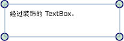

# 装饰器概述
装饰器是一种特殊类型的 <xref:System.Windows.FrameworkElement>，用于向用户提供可视化提示。  对于其他用户，装饰器可用于将功能控点添加到元素中或提供有关控件的状态信息。  
  
   
  
   
## 关于装饰器  
 <xref:System.Windows.Documents.Adorner> 是绑定到 <xref:System.Windows.UIElement> 的自定义 <xref:System.Windows.FrameworkElement>。  装饰器在 <xref:System.Windows.Documents.AdornerLayer> 中呈现，这是一个始终位于装饰元素或装饰元素集合上方的呈现图面。  装饰器的呈现独立于该装饰器所绑定到的 <xref:System.Windows.UIElement> 的呈现。  装饰器通常使用位于装饰元素左上部的标准 2\-D 坐标原点，相对于其绑定到的元素进行定位。  
  
 装饰器的常见应用包括：  
  
-   向 <xref:System.Windows.UIElement> 添加功能控点，使用这些控点，用户可以通过某种方式（调整大小、旋转、重新定位等等）操作元素。  
  
-   提供可视反馈以指示各种状态，或响应各种事件。  
  
-   在 <xref:System.Windows.UIElement> 上叠加视觉效果。  
  
-   从视觉上遮盖或重写 <xref:System.Windows.UIElement> 的一部分或全部。  
  
 [!INCLUDE[TLA#tla_winclient](../../../../includes/tlasharptla-winclient-md.md)] 为装饰视觉元素提供一个基本框架。  下表列出了装饰对象时使用的主要类型及其用途。  下面是几个用法示例。  
  
|||  
|-|-|  
|<xref:System.Windows.Documents.Adorner>|一个抽象基类，所有具体装饰器的实现都从该类继承。|  
|<xref:System.Windows.Documents.AdornerLayer>|一个类，表示一个或多个装饰元素的装饰器的呈现层。|  
|<xref:System.Windows.Documents.AdornerDecorator>|一个类，使装饰器层与元素集合相关联。|  
  
   
## 实现自定义装饰器  
 [!INCLUDE[TLA#tla_winclient](../../../../includes/tlasharptla-winclient-md.md)] 提供的装饰器框架主要用于支持创建自定义装饰器。  您可以通过实现一个从抽象 <xref:System.Windows.Documents.Adorner> 类继承的类来创建自定义装饰器。  
  
> [!NOTE]
>  <xref:System.Windows.Documents.Adorner> 的父级为 <xref:System.Windows.Documents.AdornerLayer>，它呈现的是 <xref:System.Windows.Documents.Adorner>，而不是正在装饰的元素。  
  
 下面的示例演示一个实现简单装饰器的类。  该示例装饰器使用圆简单地装饰 <xref:System.Windows.UIElement> 的各角。  
  
 [!code-csharp[Adorners_SimpleCircleAdorner#_SimpleCircleAdornerBody](../../../../samples/snippets/csharp/VS_Snippets_Wpf/Adorners_SimpleCircleAdorner/CSharp/Window1.xaml.cs#_simplecircleadornerbody)]
 [!code-vb[Adorners_SimpleCircleAdorner#_SimpleCircleAdornerBody](../../../../samples/snippets/visualbasic/VS_Snippets_Wpf/Adorners_SimpleCircleAdorner/VisualBasic/Window1.xaml.vb#_simplecircleadornerbody)]  
  
 下面的图像演示了应用于 <xref:System.Windows.Controls.TextBox> 的 SimpleCircleAdorner。  
  
   
  
   
## 装饰器的呈现行为  
 注意：装饰器不包括任何继承呈现行为，确保装饰器呈现是装饰器实施者的责任。  实现呈现行为的常见方式是重写 <xref:System.Windows.UIElement.OnRender%2A> 方法，并使用一个或多个 <xref:System.Windows.Media.DrawingContext> 对象来按需呈现装饰器的视觉效果（如上述示例所示）。  
  
> [!NOTE]
>  放置在装饰器层中的所有内容均呈现在您已设置的任何其余样式的顶部。  也就是说，装饰器始终以可见的方式位于顶部，无法使用 [z 顺序](GTMT)重写。  
  
   
## 事件和命中测试  
 装饰器就像任何其他 <xref:System.Windows.FrameworkElement> 一样接收输入事件。  因为装饰器的 [z 顺序](GTMT)总是高于它所装饰的元素，所以该装饰器接收可能适用于基础装饰元素的输入事件（例如 <xref:System.Windows.UIElement.Drop> 或 <xref:System.Windows.UIElement.MouseMove>）。  装饰器可以侦听某些输入事件，并通过重新引发这些事件将其传递给基础装饰元素。  
  
 若要对装饰器下的元素启用传递命中测试，请在装饰器上将命中测试 <xref:System.Windows.UIElement.IsHitTestVisible%2A> 的属性设置为 **false**。  有关命中测试的更多信息，请参见  
  
 [可视化层中的命中测试](../../../../docs/framework/wpf/graphics-multimedia/hit-testing-in-the-visual-layer.md).  
  
   
## 装饰单个 UIElement  
 若要将装饰器绑定到特定的 <xref:System.Windows.UIElement>，请按照以下步骤操作：  
  
1.  调用静态方法 <xref:System.Windows.Documents.AdornerLayer.GetAdornerLayer%2A>，为要装饰的 <xref:System.Windows.UIElement> 获得 <xref:System.Windows.Documents.AdornerLayer> 对象。  <xref:System.Windows.Documents.AdornerLayer.GetAdornerLayer%2A> 从指定的 <xref:System.Windows.UIElement> 开始沿着可视化树向上行进，返回它所发现的第一个装饰器层。  （如果未发现装饰器层，则该方法返回 Null。）  
  
2.  调用 <xref:System.Windows.Documents.AdornerLayer.Add%2A> 方法将装饰器绑定到目标 <xref:System.Windows.UIElement>。  
  
 以下示例将 SimpleCircleAdorner（如上所示）绑定到名为 *myTextBox* 的 <xref:System.Windows.Controls.TextBox>。  
  
 [!code-csharp[Adorners_SimpleCircleAdorner#_AdornSingleElement](../../../../samples/snippets/csharp/VS_Snippets_Wpf/Adorners_SimpleCircleAdorner/CSharp/Window1.xaml.cs#_adornsingleelement)]
 [!code-vb[Adorners_SimpleCircleAdorner#_AdornSingleElement](../../../../samples/snippets/visualbasic/VS_Snippets_Wpf/Adorners_SimpleCircleAdorner/VisualBasic/Window1.xaml.vb#_adornsingleelement)]  
  
> [!NOTE]
>  目前不支持使用[!INCLUDE[TLA#tla_xaml](../../../../includes/tlasharptla-xaml-md.md)] 将装饰器绑定到另一个元素。  
  
   
## 装饰面板的子级  
 若要将装饰器绑定到 <xref:System.Windows.Controls.Panel> 的子级，请按照下列步骤操作：  
  
1.  调用 `static` 方法 <xref:System.Windows.Documents.AdornerLayer.GetAdornerLayer%2A> 为要绑定其子级的元素查找一个装饰器层。  
  
2.  依次枚举父元素的子级并调用 <xref:System.Windows.Documents.AdornerLayer.Add%2A> 方法将装饰器绑定到每个子级元素。  
  
 以下示例将 SimpleCircleAdorner（如上所示）绑定到名为 *myStackPanel* 的 <xref:System.Windows.Controls.StackPanel> 的子级。  
  
 [!code-csharp[Adorners_SimpleCircleAdorner#_AdornChildren](../../../../samples/snippets/csharp/VS_Snippets_Wpf/Adorners_SimpleCircleAdorner/CSharp/Window1.xaml.cs#_adornchildren)]
 [!code-vb[Adorners_SimpleCircleAdorner#_AdornChildren](../../../../samples/snippets/visualbasic/VS_Snippets_Wpf/Adorners_SimpleCircleAdorner/VisualBasic/Window1.xaml.vb#_adornchildren)]  
  
## 请参阅  
 <xref:System.Windows.Media.AdornerHitTestResult>   
 [WPF 中的形状和基本绘图概述](../../../../docs/framework/wpf/graphics-multimedia/shapes-and-basic-drawing-in-wpf-overview.md)   
 [使用图像、绘图和 Visual 进行绘制](../../../../docs/framework/wpf/graphics-multimedia/painting-with-images-drawings-and-visuals.md)   
 [Drawing 对象概述](../../../../docs/framework/wpf/graphics-multimedia/drawing-objects-overview.md)   
 [帮助主题](../../../../docs/framework/wpf/controls/adorners-how-to-topics.md)