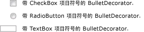

# BulletDecorator
<xref:System.Windows.Controls.Primitives.BulletDecorator> 有两个内容属性：<xref:System.Windows.Controls.Primitives.BulletDecorator.Bullet%2A>和<xref:System.Windows.Controls.Decorator.Child%2A>。 <xref:System.Windows.Controls.Primitives.BulletDecorator.Bullet%2A>属性定义<xref:System.Windows.UIElement>要用作项目符号。 <xref:System.Windows.Controls.Decorator.Child%2A>属性定义<xref:System.Windows.UIElement>直观地对齐带有项目符号。  
  
 下图显示的控件的使用示例<xref:System.Windows.Controls.Primitives.BulletDecorator>。  
  
   
  
## 参考  
 <xref:System.Windows.Controls.Primitives.BulletDecorator>
