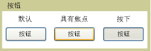

# Button
一个<xref:System.Windows.Controls.Button>控件响应用户输入从鼠标、 键盘、 触笔或其他输入的设备和引发<xref:System.Windows.Controls.Primitives.ButtonBase.Click>事件。 一个<xref:System.Windows.Controls.Button>是一个简单[!INCLUDE[TLA#tla_ui](../../../../includes/tlasharptla-ui-md.md)]组件，它可以包含简单内容，例如文本、，还可以包含复杂内容，例如图像和<xref:System.Windows.Controls.Panel>控件。  
  
   
  
## 本节内容  
 [创建包含图像的按钮](how-to-create-a-button-that-has-an-image.md)  
  
## 参考  
 <xref:System.Windows.Controls.Button>  
 <xref:System.Windows.Controls.Primitives.ButtonBase>  
 <xref:System.Windows.Controls.RadioButton>  
 <xref:System.Windows.Controls.Primitives.RepeatButton>
