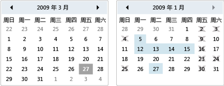

# Calendar
日历使用户能够使用可视日历显示来选择日期。  
  
 <xref:System.Windows.Controls.Calendar> 控件可以独立使用，也可用作 <xref:System.Windows.Controls.DatePicker> 控件的下拉部分。  有关更多信息，请参见<xref:System.Windows.Controls.DatePicker>。  
  
 下图显示了两个 <xref:System.Windows.Controls.Calendar> 控件，一个具有选择内容和无法选择的日期，一个没有。  
  
   
日历控件  
  
 下表提供了有关通常与 <xref:System.Windows.Controls.Calendar> 关联的任务的信息。  
  
|任务|实现|  
|--------|--------|  
|指定不可选择的日期。|使用 <xref:System.Windows.Controls.Calendar.BlackoutDates%2A> 属性。|  
|使 <xref:System.Windows.Controls.Calendar> 显示一个月、一整年或十年。|将 <xref:System.Windows.Controls.Calendar.DisplayMode%2A> 属性的值设置为月、年或十年。|  
|指定用户是否可以选择一个日期、一个日期范围或多个日期范围。|使用 <xref:System.Windows.Controls.Calendar.SelectionMode%2A>。|  
|指定 <xref:System.Windows.Controls.Calendar> 显示的日期范围。|使用 <xref:System.Windows.Controls.Calendar.DisplayDateStart%2A> 和 <xref:System.Windows.Controls.Calendar.DisplayDateEnd%2A> 属性。|  
|指定是否突出显示当前日期。|使用 <xref:System.Windows.Controls.Calendar.IsTodayHighlighted%2A> 属性。  默认情况下，<xref:System.Windows.Controls.Calendar.IsTodayHighlighted%2A> 为 `true`。|  
|更改 <xref:System.Windows.Controls.Calendar> 的大小。|使用 <xref:System.Windows.Controls.Viewbox> 或将 <xref:System.Windows.FrameworkElement.LayoutTransform%2A> 属性设置为 <xref:System.Windows.Media.ScaleTransform>。  请注意，如果设置 <xref:System.Windows.Controls.Calendar> 的 <xref:System.Windows.FrameworkElement.Width%2A> 和 <xref:System.Windows.FrameworkElement.Height%2A> 属性，则实际日历不更改其大小。|  
  
 <xref:System.Windows.Controls.Calendar> 控件使用鼠标或键盘提供基本导航功能。  下表总结了键盘导航。  
  
|组合键|<xref:System.Windows.Controls.Calendar.DisplayMode%2A>|操作|  
|---------|-----------------------------------------------------------------------------------------------------------------------------------------------------------|--------|  
|箭头|<xref:System.Windows.Controls.CalendarMode>|如果未将 <xref:System.Windows.Controls.Calendar.SelectionMode%2A> 属性设置为 <xref:System.Windows.Controls.CalendarSelectionMode>，则更改 <xref:System.Windows.Controls.Calendar.SelectedDate%2A> 属性。|  
|箭头|<xref:System.Windows.Controls.CalendarMode>|更改 <xref:System.Windows.Controls.Calendar.DisplayDate%2A> 属性中的月份。  请注意，<xref:System.Windows.Controls.Calendar.SelectedDate%2A> 不更改。|  
|箭头|<xref:System.Windows.Controls.CalendarMode>|更改 <xref:System.Windows.Controls.Calendar.DisplayDate%2A> 中的年。  请注意，<xref:System.Windows.Controls.Calendar.SelectedDate%2A> 不更改。|  
|Shift\+箭头|<xref:System.Windows.Controls.CalendarMode>|如果 <xref:System.Windows.Controls.Calendar.SelectionMode%2A> 未设置为 <xref:System.Windows.Controls.CalendarSelectionMode> 或 <xref:System.Windows.Controls.CalendarSelectionMode>，则扩展所选日期的范围。|  
|Home|<xref:System.Windows.Controls.CalendarMode>|将 <xref:System.Windows.Controls.Calendar.SelectedDate%2A> 更改为当前月的第一天。|  
|Home|<xref:System.Windows.Controls.CalendarMode>|将 <xref:System.Windows.Controls.Calendar.DisplayDate%2A> 中的月份更改为年的第一个月。  <xref:System.Windows.Controls.Calendar.SelectedDate%2A> 不会更改。|  
|Home|<xref:System.Windows.Controls.CalendarMode>|将 <xref:System.Windows.Controls.Calendar.DisplayDate%2A> 中的年更改为十年中的第一年。  <xref:System.Windows.Controls.Calendar.SelectedDate%2A> 不会更改。|  
|End|<xref:System.Windows.Controls.CalendarMode>|将 <xref:System.Windows.Controls.Calendar.SelectedDate%2A> 更改为当前月的最后一天。|  
|End|<xref:System.Windows.Controls.CalendarMode>|将 <xref:System.Windows.Controls.Calendar.DisplayDate%2A> 中的月份更改为年的最后一个月。  <xref:System.Windows.Controls.Calendar.SelectedDate%2A> 不会更改。|  
|End|<xref:System.Windows.Controls.CalendarMode>|将 <xref:System.Windows.Controls.Calendar.DisplayDate%2A> 中的年更改为十年中的最后一年。  <xref:System.Windows.Controls.Calendar.SelectedDate%2A> 不会更改。|  
|Ctrl\+向上键|任意|切换到下一个更大的 <xref:System.Windows.Controls.Calendar.DisplayMode%2A>。  如果 <xref:System.Windows.Controls.Calendar.DisplayMode%2A> 已经为 <xref:System.Windows.Controls.CalendarMode>，则不执行任何操作。|  
|Ctrl\+向下键|任意|切换到下一个更小的 <xref:System.Windows.Controls.Calendar.DisplayMode%2A>。  如果 <xref:System.Windows.Controls.Calendar.DisplayMode%2A> 已经为 <xref:System.Windows.Controls.CalendarMode>，则不执行任何操作。|  
|空格键或 Enter|<xref:System.Windows.Controls.CalendarMode> 或 <xref:System.Windows.Controls.CalendarMode>|将 <xref:System.Windows.Controls.Calendar.DisplayMode%2A> 切换到由聚焦项表示的 <xref:System.Windows.Controls.CalendarMode> 或 <xref:System.Windows.Controls.CalendarMode>。|  
  
## 请参阅  
 [控件](../../../../docs/framework/wpf/controls/index.md)   
 [样式设置和模板化](../../../../docs/framework/wpf/controls/styling-and-templating.md)