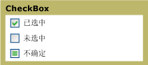

# CheckBoxCheckBox
你可以使用<xref:System.Windows.Controls.CheckBox>中[!INCLUDE[TLA#tla_ui](../../../../includes/tlasharptla-ui-md.md)]的应用程序以表示用户可以选择或清除的选项。You can use a <xref:System.Windows.Controls.CheckBox> in the [!INCLUDE[TLA#tla_ui](../../../../includes/tlasharptla-ui-md.md)] of your application to represent options that a user can select or clear. 你可以使用一个复选框，或可以组两个或多个复选框。You can use a single check box or you can group two or more check boxes.  
  
 下图显示的不同状态的<xref:System.Windows.Controls.CheckBox>。The following graphic shows the different states of a <xref:System.Windows.Controls.CheckBox>.  
  
   
处于其他状态的复选框控件CheckBox controls in different states  
  
## 参考Reference  
 <xref:System.Windows.Controls.CheckBox>  
  <xref:System.Windows.Controls.RadioButton>  
  <xref:System.Windows.Controls.Primitives.ButtonBase>  
  <xref:System.Windows.Controls.Primitives.RepeatButton>  
  
## 相关章节Related Sections
