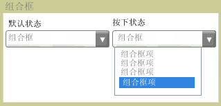

# 组合框
<xref:System.Windows.Controls.ComboBox>控件向用户提供选项的列表。 显示或隐藏控件展开或折叠列表。 在其默认状态下，列表处于折叠状态，仅显示一个选项。 用户单击按钮以查看选项的完整列表。  
  
 下图显示<xref:System.Windows.Controls.ComboBox>不同状态。  
  
   
折叠和展开  
  
## 参考  
 <xref:System.Windows.Controls.ComboBox>
