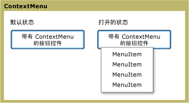

# ContextMenu
<xref:System.Windows.Controls.ContextMenu>允许控件显示<xref:System.Windows.Controls.Menu>特定于控件的上下文。 通常情况下，<xref:System.Windows.Controls.ContextMenu>中公开[!INCLUDE[TLA#tla_ui](../../../../includes/tlasharptla-ui-md.md)]通过鼠标右键按钮或键盘的菜单按钮。  
  
 下图说明了<xref:System.Windows.Controls.ContextMenu>中两个不同状态: 打开状态和的默认状态。 在默认状态下，该控件处于折叠状态。 通过菜单的父按下鼠标右键按钮时，控件将展开，并显示的菜单项。  
  
   
ContextMenu 处于其他状态  
  
## 本节内容  
 [ContextMenu 概述](../../../../docs/framework/wpf/controls/contextmenu-overview.md)  
  
## 参考  
 <xref:System.Windows.Controls.ContextMenu>  
  
## 相关章节
