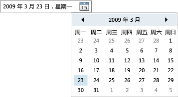

# DatePicker
<xref:System.Windows.Controls.DatePicker>控件允许用户通过下拉列表中键入文本字段，或选择日期<xref:System.Windows.Controls.Calendar>控件。  
  
 下图显示<xref:System.Windows.Controls.DatePicker>。  
  
   
DatePicker 控件  
  
 许多<xref:System.Windows.Controls.DatePicker>控件的属性是用于管理其内置<xref:System.Windows.Controls.Calendar>，和函数中的等效属性与相同<xref:System.Windows.Controls.Calendar>。 具体而言， <xref:System.Windows.Controls.DatePicker.IsTodayHighlighted%2A?displayProperty=nameWithType>， <xref:System.Windows.Controls.DatePicker.FirstDayOfWeek%2A?displayProperty=nameWithType>， <xref:System.Windows.Controls.DatePicker.BlackoutDates%2A?displayProperty=nameWithType>， <xref:System.Windows.Controls.DatePicker.DisplayDateStart%2A?displayProperty=nameWithType>， <xref:System.Windows.Controls.DatePicker.DisplayDateEnd%2A?displayProperty=nameWithType>， <xref:System.Windows.Controls.DatePicker.DisplayDate%2A?displayProperty=nameWithType>，以及<xref:System.Windows.Controls.DatePicker.SelectedDate%2A?displayProperty=nameWithType>属性函数完全相同其<xref:System.Windows.Controls.Calendar>对应项。 有关详细信息，请参阅 <xref:System.Windows.Controls.Calendar>。  
  
 用户可以直接在设置的文本字段中键入日期<xref:System.Windows.Controls.DatePicker.Text%2A>属性。 如果<xref:System.Windows.Controls.DatePicker>无法将输入的字符串转换为有效的日期，<xref:System.Windows.Controls.DatePicker.DateValidationError>将引发事件。 默认情况下，这会导致异常，但的事件处理程序<xref:System.Windows.Controls.DatePicker.DateValidationError>可以设置<xref:System.Windows.Controls.DatePickerDateValidationErrorEventArgs.ThrowException%2A>属性设置为`false`并防止引发异常。  
  
## 请参阅

- [Controls](index.md)
- [样式设置和模板化](styling-and-templating.md)
