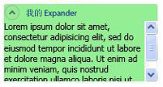

# Expander 概述
<xref:System.Windows.Controls.Expander>控件提供了一种方法来提供类似于一个窗口，并且包括一个标头的可展开区域中的内容。  
  
  
   
## 创建简单的 Expander  
 下面的示例演示如何创建一个简单<xref:System.Windows.Controls.Expander>控件。 此示例将创建<xref:System.Windows.Controls.Expander>看起来像前面的图示。  
  
 [!code-xaml[ExpanderExample#2](../../../../samples/snippets/csharp/VS_Snippets_Wpf/ExpanderExample/CSharp/Page1.xaml#2)]  
  
 <xref:System.Windows.Controls.ContentControl.Content%2A>并<xref:System.Windows.Controls.HeaderedContentControl.Header%2A>的<xref:System.Windows.Controls.Expander>还可以包含复杂内容，如<xref:System.Windows.Controls.RadioButton>和<xref:System.Windows.Controls.Image>对象。  
  
   
## 设置展开内容区域的方向  
 您可以设置的内容区域<xref:System.Windows.Controls.Expander>控件中的四个方向一个展开 (<xref:System.Windows.Controls.ExpandDirection.Down>， <xref:System.Windows.Controls.ExpandDirection.Up>， <xref:System.Windows.Controls.ExpandDirection.Left>，或<xref:System.Windows.Controls.ExpandDirection.Right>) 使用<xref:System.Windows.Controls.ExpandDirection>属性。 当内容区域处于折叠状态，仅<xref:System.Windows.Controls.Expander><xref:System.Windows.Controls.HeaderedContentControl.Header%2A>和及其切换按钮显示。 一个<xref:System.Windows.Controls.Button>显示方向箭头的控件用作一个切换按钮以展开或折叠内容区域。 展开后，<xref:System.Windows.Controls.Expander>尝试在类似于窗口的区域中显示其所有的内容。  
  
   
## 在面板中控制 Expander 的大小  
 如果<xref:System.Windows.Controls.Expander>控件是继承的布局控件内<xref:System.Windows.Controls.Panel>，如<xref:System.Windows.Controls.StackPanel>，没有指定<xref:System.Windows.FrameworkElement.Height%2A>上<xref:System.Windows.Controls.Expander>时<xref:System.Windows.Controls.Expander.ExpandDirection%2A>属性设置为<xref:System.Windows.Controls.ExpandDirection.Down>或<xref:System.Windows.Controls.ExpandDirection.Up>。 同样，不要指定<xref:System.Windows.FrameworkElement.Width%2A>上<xref:System.Windows.Controls.Expander>时<xref:System.Windows.Controls.Expander.ExpandDirection%2A>属性设置为<xref:System.Windows.Controls.ExpandDirection.Left>或<xref:System.Windows.Controls.ExpandDirection.Right>。  
  
 上设置大小维度时<xref:System.Windows.Controls.Expander>控件，显示展开的内容，方向<xref:System.Windows.Controls.Expander>控制内容使用和显示在其周围的边框区域。 即使内容已折叠，也会显示该边框。 若要设置展开内容区域的大小，设置大小维度上的内容<xref:System.Windows.Controls.Expander>，或如果你想要滚动功能，请在<xref:System.Windows.Controls.ScrollViewer>包含的内容。  
  
 当<xref:System.Windows.Controls.Expander>控件是中的最后一个元素<xref:System.Windows.Controls.DockPanel>，[!INCLUDE[TLA#tla_winclient](../../../../includes/tlasharptla-winclient-md.md)]将自动设置<xref:System.Windows.Controls.Expander>维度，以的其余区域相等<xref:System.Windows.Controls.DockPanel>。 若要防止此默认行为，设置<xref:System.Windows.Controls.DockPanel.LastChildFill%2A>上的属性<xref:System.Windows.Controls.DockPanel>对象传递给`false`，或请确保<xref:System.Windows.Controls.Expander>不是中的最后一个元素<xref:System.Windows.Controls.DockPanel>。  
  
   
## 创建可滚动内容  
 如果内容对于内容区域的大小太大，您可以封装的内容<xref:System.Windows.Controls.Expander>在<xref:System.Windows.Controls.ScrollViewer>为了提供可滚动内容。 <xref:System.Windows.Controls.Expander>控件不会自动提供滚动功能。 如下图所示<xref:System.Windows.Controls.Expander>控件，其中包含<xref:System.Windows.Controls.ScrollViewer>控件。  
  
 **ScrollViewer 中的 Expander**  
  
   
  
 在将<xref:System.Windows.Controls.Expander>控件中<xref:System.Windows.Controls.ScrollViewer>，请设置<xref:System.Windows.Controls.ScrollViewer>维度属性对应的方向<xref:System.Windows.Controls.Expander>内容的大小会打开<xref:System.Windows.Controls.Expander>内容区域。 例如，如果您设置<xref:System.Windows.Controls.Expander.ExpandDirection%2A>上的属性<xref:System.Windows.Controls.Expander>到<xref:System.Windows.Controls.ExpandDirection.Down>（内容区域向下展开），设置<xref:System.Windows.FrameworkElement.Height%2A>属性上的<xref:System.Windows.Controls.ScrollViewer>内容区域的必需高度控制。 如果在上内容本身，而是设置的高度维度<xref:System.Windows.Controls.ScrollViewer>无法识别此设置，因此，不提供可滚动内容。  
  
 下面的示例演示如何创建<xref:System.Windows.Controls.Expander>控件具有复杂内容并包含<xref:System.Windows.Controls.ScrollViewer>控件。 此示例将创建<xref:System.Windows.Controls.Expander>这是类似于本部分的开头图。  
  
 [!code-csharp[ExpanderRichContent#1](../../../../samples/snippets/csharp/VS_Snippets_Wpf/ExpanderRichContent/CSharp/Window1.xaml.cs#1)]
 [!code-vb[ExpanderRichContent#1](../../../../samples/snippets/visualbasic/VS_Snippets_Wpf/ExpanderRichContent/VisualBasic/Window1.xaml.vb#1)]
 [!code-xaml[ExpanderRichContent#1](../../../../samples/snippets/csharp/VS_Snippets_Wpf/ExpanderRichContent/CSharp/Window1.xaml#1)]  
  
   
## 使用对齐属性  
 可以通过设置对齐内容<xref:System.Windows.Controls.Control.HorizontalContentAlignment%2A>并<xref:System.Windows.Controls.Control.VerticalContentAlignment%2A>上的属性<xref:System.Windows.Controls.Expander>控件。 当设置这些属性时，对齐将同时应用于标头和展开的内容。  
  
## 请参阅
- <xref:System.Windows.Controls.Expander>
- <xref:System.Windows.Controls.ExpandDirection>
- [帮助主题](../../../../docs/framework/wpf/controls/expander-how-to-topics.md)
