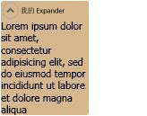

# Expander
<xref:System.Windows.Controls.Expander>允许用户查看标头和展开该标头以查看更多详细信息，或若要折叠到一个标头部分。  
  
 下图提供了此控件在其扩展的位置的一个示例。  
  
   
Expander 控件  
  
## 本节内容  
 [扩展器概述](expander-overview.md)  
 [帮助主题](expander-how-to-topics.md)  
  
## 参考  
 <xref:System.Windows.Controls.Expander>  
  
## 相关章节
