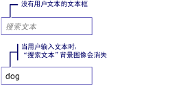

# 如何：在 TextBox 中添加水印How to: Add a Watermark to a TextBox
下面的示例演示如何帮助的可用性<xref:System.Windows.Controls.TextBox>通过显示说明性背景图像的内部<xref:System.Windows.Controls.TextBox>直到用户输入文本，此时删除映像。The following example shows how to aid usability of a <xref:System.Windows.Controls.TextBox> by displaying an explanatory background image inside of the <xref:System.Windows.Controls.TextBox> until the user inputs text, at which point the image is removed. 此外，背景图像重新还原如果用户删除其输入。In addition, the background image is restored again if the user removes their input. 请参阅下图。See illustration below.  
  
   
  
> [!NOTE]
>  在此示例中而不只操作使用的背景图像的原因<xref:System.Windows.Controls.TextBox.Text%2A>属性的<xref:System.Windows.Controls.TextBox>，是背景图像不会干扰数据绑定。The reason a background image is used in this example rather then simply manipulating the <xref:System.Windows.Controls.TextBox.Text%2A> property of <xref:System.Windows.Controls.TextBox>, is that a background image will not interfere with data binding.  
  
## 示例Example  
 [!code-xaml[TextBoxMiscSnippets_snip#TextBoxBackgroundExampleWholePage](~/samples/snippets/csharp/VS_Snippets_Wpf/TextBoxMiscSnippets_snip/csharp/textbox_with_background_image.xaml#textboxbackgroundexamplewholepage)]  
  
 [!code-csharp[TextBoxMiscSnippets_snip#TextBoxBackgroundCodeExampleWholePage](~/samples/snippets/csharp/VS_Snippets_Wpf/TextBoxMiscSnippets_snip/csharp/textbox_with_background_image.xaml.cs#textboxbackgroundcodeexamplewholepage)]
 [!code-vb[TextBoxMiscSnippets_snip#TextBoxBackgroundCodeExampleWholePage](~/samples/snippets/visualbasic/VS_Snippets_Wpf/TextBoxMiscSnippets_snip/visualbasic/textbox_with_background_image.xaml.vb#textboxbackgroundcodeexamplewholepage)]  
  
## 请参阅See also
- [TextBox 概述TextBox Overview](textbox-overview.md)
- [RichTextBox 概述RichTextBox Overview](richtextbox-overview.md)
