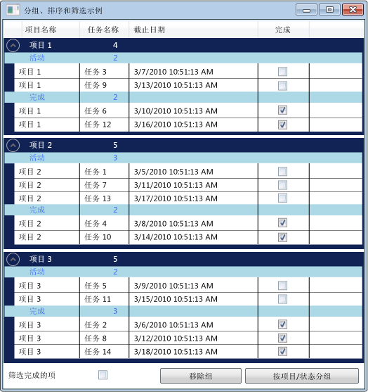

# 如何：分组、 排序和筛选的 DataGrid 控件中的数据How to: Group, sort, and filter data in the DataGrid control

通常很有用，若要查看中的数据<xref:System.Windows.Controls.DataGrid>分组、 排序和筛选的数据通过不同的方式。It is often useful to view data in a <xref:System.Windows.Controls.DataGrid> in different ways by grouping, sorting, and filtering the data. 若要进行分组、 排序和筛选器中的数据<xref:System.Windows.Controls.DataGrid>，你将其绑定到<xref:System.Windows.Data.CollectionView>支持这些函数。To group, sort, and filter the data in a <xref:System.Windows.Controls.DataGrid>, you bind it to a <xref:System.Windows.Data.CollectionView> that supports these functions. 然后可以使用中的数据<xref:System.Windows.Data.CollectionView>而不会影响基础数据源。You can then work with the data in the <xref:System.Windows.Data.CollectionView> without affecting the underlying source data. 集合视图中的更改会反映在<xref:System.Windows.Controls.DataGrid>用户界面 (UI)。The changes in the collection view are reflected in the <xref:System.Windows.Controls.DataGrid> user interface (UI).

<xref:System.Windows.Data.CollectionView>类提供了分组和排序功能，实现为数据源<xref:System.Collections.IEnumerable>接口。The <xref:System.Windows.Data.CollectionView> class provides grouping and sorting functionality for a data source that implements the <xref:System.Collections.IEnumerable> interface. <xref:System.Windows.Data.CollectionViewSource>类，可设置的属性<xref:System.Windows.Data.CollectionView>从 XAML。The <xref:System.Windows.Data.CollectionViewSource> class enables you to set the properties of a <xref:System.Windows.Data.CollectionView> from XAML.

在此示例中，一系列`Task`对象绑定到<xref:System.Windows.Data.CollectionViewSource>。In this example, a collection of `Task` objects is bound to a <xref:System.Windows.Data.CollectionViewSource>. <xref:System.Windows.Data.CollectionViewSource>用作<xref:System.Windows.Controls.ItemsControl.ItemsSource%2A>为<xref:System.Windows.Controls.DataGrid>。The <xref:System.Windows.Data.CollectionViewSource> is used as the <xref:System.Windows.Controls.ItemsControl.ItemsSource%2A> for the <xref:System.Windows.Controls.DataGrid>. 在执行分组、 排序和筛选<xref:System.Windows.Data.CollectionViewSource>，并显示在<xref:System.Windows.Controls.DataGrid>UI。Grouping, sorting, and filtering are performed on the <xref:System.Windows.Data.CollectionViewSource> and are displayed in the <xref:System.Windows.Controls.DataGrid> UI.

分组数据网格中的数据 Grouped data in a DataGrid

## CollectionViewSource 用作 ItemsSourceUsing a CollectionViewSource as an ItemsSource

为进行分组、 排序和筛选器中的数据<xref:System.Windows.Controls.DataGrid>控件，您将绑定<xref:System.Windows.Controls.DataGrid>到<xref:System.Windows.Data.CollectionView>支持这些函数。To group, sort, and filter data in a <xref:System.Windows.Controls.DataGrid> control, you bind the <xref:System.Windows.Controls.DataGrid> to a <xref:System.Windows.Data.CollectionView> that supports these functions. 在此示例中，<xref:System.Windows.Controls.DataGrid>绑定到<xref:System.Windows.Data.CollectionViewSource>，它提供有关这些函数<xref:System.Collections.Generic.List%601>的`Task`对象。In this example, the <xref:System.Windows.Controls.DataGrid> is bound to a <xref:System.Windows.Data.CollectionViewSource> that provides these functions for a <xref:System.Collections.Generic.List%601> of `Task` objects.

### 若要将 DataGrid 绑定到 CollectionViewSource，To bind a DataGrid to a CollectionViewSource

1. 创建的数据集合的实现<xref:System.Collections.IEnumerable>接口。Create a data collection that implements the <xref:System.Collections.IEnumerable> interface.

    如果您使用<xref:System.Collections.Generic.List%601>若要创建你的集合，应创建的新类继承自<xref:System.Collections.Generic.List%601>而不是实例化的实例<xref:System.Collections.Generic.List%601>。If you use <xref:System.Collections.Generic.List%601> to create your collection, you should create a new class that inherits from <xref:System.Collections.Generic.List%601> instead of instantiating an instance of <xref:System.Collections.Generic.List%601>. 这可以将数据绑定到 XAML 中的集合。This enables you to data bind to the collection in XAML.

    > [!NOTE]
    > 集合中的对象必须实现<xref:System.ComponentModel.INotifyPropertyChanged>已更改的接口和<xref:System.ComponentModel.IEditableObject>接口，以便<xref:System.Windows.Controls.DataGrid>以正确响应属性更改和编辑。The objects in the collection must implement the <xref:System.ComponentModel.INotifyPropertyChanged> changed interface and the <xref:System.ComponentModel.IEditableObject> interface in order for the <xref:System.Windows.Controls.DataGrid> to respond correctly to property changes and edits. 有关详细信息，请参阅[实现属性更改通知](../data/how-to-implement-property-change-notification.md)。For more information, see [Implement Property Change Notification](../data/how-to-implement-property-change-notification.md).

    [!code-csharp[DataGrid_GroupSortFilter#101](~/samples/snippets/csharp/VS_Snippets_Wpf/DataGrid_GroupSortFilter/CS/MainWindow.xaml.cs#101)]
    [!code-vb[DataGrid_GroupSortFilter#101](~/samples/snippets/visualbasic/VS_Snippets_Wpf/DataGrid_GroupSortFilter/VB/MainWindow.xaml.vb#101)]

2. 在 XAML 中，创建集合类的实例并设置[X:key 指令](../../xaml-services/x-key-directive.md)。In XAML, create an instance of the collection class and set the [x:Key Directive](../../xaml-services/x-key-directive.md).

3. 在 XAML 中，创建的实例<xref:System.Windows.Data.CollectionViewSource>类中，设置[X:key 指令](../../xaml-services/x-key-directive.md)，并将设置为你的集合类的实例<xref:System.Windows.Data.CollectionViewSource.Source%2A>。In XAML, create an instance of the <xref:System.Windows.Data.CollectionViewSource> class, set the [x:Key Directive](../../xaml-services/x-key-directive.md), and set the instance of your collection class as the <xref:System.Windows.Data.CollectionViewSource.Source%2A>.

    [!code-xaml[DataGrid_GroupSortFilter#201](~/samples/snippets/csharp/VS_Snippets_Wpf/DataGrid_GroupSortFilter/CS/WindowSnips1.xaml#201)]

4. 创建的实例<xref:System.Windows.Controls.DataGrid>类，并设置<xref:System.Windows.Controls.ItemsControl.ItemsSource%2A>属性设置为<xref:System.Windows.Data.CollectionViewSource>。Create an instance of the <xref:System.Windows.Controls.DataGrid> class, and set the <xref:System.Windows.Controls.ItemsControl.ItemsSource%2A> property to the <xref:System.Windows.Data.CollectionViewSource>.

    [!code-xaml[DataGrid_GroupSortFilter#002](~/samples/snippets/csharp/VS_Snippets_Wpf/DataGrid_GroupSortFilter/CS/MainWindow.xaml#002)]

5. 访问<xref:System.Windows.Data.CollectionViewSource>在代码中，使用<xref:System.Windows.Data.CollectionViewSource.GetDefaultView%2A>方法以获取对引用<xref:System.Windows.Data.CollectionViewSource>。To access the <xref:System.Windows.Data.CollectionViewSource> from your code, use the <xref:System.Windows.Data.CollectionViewSource.GetDefaultView%2A> method to get a reference to the <xref:System.Windows.Data.CollectionViewSource>.

    [!code-csharp[DataGrid_GroupSortFilter#102](~/samples/snippets/csharp/VS_Snippets_Wpf/DataGrid_GroupSortFilter/CS/MainWindow.xaml.cs#102)]
    [!code-vb[DataGrid_GroupSortFilter#102](~/samples/snippets/visualbasic/VS_Snippets_Wpf/DataGrid_GroupSortFilter/VB/MainWindow.xaml.vb#102)]

## 对数据网格中的项进行分组Grouping items in a DataGrid

若要指定项中的分组方式<xref:System.Windows.Controls.DataGrid>，则使用<xref:System.Windows.Data.PropertyGroupDescription>类型在源视图中的项进行分组。To specify how items are grouped in a <xref:System.Windows.Controls.DataGrid>, you use the <xref:System.Windows.Data.PropertyGroupDescription> type to group the items in the source view.

### 使用 XAML 的 DataGrid 中的项To group items in a DataGrid using XAML

1. 创建<xref:System.Windows.Data.PropertyGroupDescription>指定分组所依据的属性。Create a <xref:System.Windows.Data.PropertyGroupDescription> that specifies the property to group by. 在 XAML 或代码中，可以指定属性。You can specify the property in XAML or in code.

   1. 在 XAML 中，设置<xref:System.Windows.Data.PropertyGroupDescription.PropertyName%2A>分组所依据的属性的名称。In XAML, set the <xref:System.Windows.Data.PropertyGroupDescription.PropertyName%2A> to the name of the property to group by.

   2. 在代码中，将传递到构造函数分组依据的属性的名称。In code, pass the name of the property to group by to the constructor.

2. 添加<xref:System.Windows.Data.PropertyGroupDescription>到<xref:System.Windows.Data.CollectionViewSource.GroupDescriptions%2A?displayProperty=nameWithType>集合。Add the <xref:System.Windows.Data.PropertyGroupDescription> to the <xref:System.Windows.Data.CollectionViewSource.GroupDescriptions%2A?displayProperty=nameWithType> collection.

3. 添加的其他实例<xref:System.Windows.Data.PropertyGroupDescription>到<xref:System.Windows.Data.CollectionViewSource.GroupDescriptions%2A>集合添加更多级别的分组。Add additional instances of <xref:System.Windows.Data.PropertyGroupDescription> to the <xref:System.Windows.Data.CollectionViewSource.GroupDescriptions%2A> collection to add more levels of grouping.

    [!code-xaml[DataGrid_GroupSortFilter#012](~/samples/snippets/csharp/VS_Snippets_Wpf/DataGrid_GroupSortFilter/CS/MainWindow.xaml#012)]
    [!code-csharp[DataGrid_GroupSortFilter#112](~/samples/snippets/csharp/VS_Snippets_Wpf/DataGrid_GroupSortFilter/CS/MainWindow.xaml.cs#112)]
    [!code-vb[DataGrid_GroupSortFilter#112](~/samples/snippets/visualbasic/VS_Snippets_Wpf/DataGrid_GroupSortFilter/VB/MainWindow.xaml.vb#112)]

4. 若要删除某个组，请删除<xref:System.Windows.Data.PropertyGroupDescription>从<xref:System.Windows.Data.CollectionViewSource.GroupDescriptions%2A>集合。To remove a group, remove the <xref:System.Windows.Data.PropertyGroupDescription> from the <xref:System.Windows.Data.CollectionViewSource.GroupDescriptions%2A> collection.

5. 若要删除的所有组，请调用<xref:System.Collections.ObjectModel.Collection%601.Clear%2A>方法的<xref:System.Windows.Data.CollectionViewSource.GroupDescriptions%2A>集合。To remove all groups, call the <xref:System.Collections.ObjectModel.Collection%601.Clear%2A> method of the <xref:System.Windows.Data.CollectionViewSource.GroupDescriptions%2A> collection.

    [!code-csharp[DataGrid_GroupSortFilter#114](~/samples/snippets/csharp/VS_Snippets_Wpf/DataGrid_GroupSortFilter/CS/MainWindow.xaml.cs#114)]
    [!code-vb[DataGrid_GroupSortFilter#114](~/samples/snippets/visualbasic/VS_Snippets_Wpf/DataGrid_GroupSortFilter/VB/MainWindow.xaml.vb#114)]

项中的分组时<xref:System.Windows.Controls.DataGrid>，可以定义<xref:System.Windows.Controls.GroupStyle>，它指定每个组的外观。When items are grouped in the <xref:System.Windows.Controls.DataGrid>, you can define a <xref:System.Windows.Controls.GroupStyle> that specifies the appearance of each group. 您将应用<xref:System.Windows.Controls.GroupStyle>通过将其添加到<xref:System.Windows.Controls.ItemsControl.GroupStyle%2A>DataGrid 的集合。You apply the <xref:System.Windows.Controls.GroupStyle> by adding it to the <xref:System.Windows.Controls.ItemsControl.GroupStyle%2A> collection of the DataGrid. 如果有多个级别的分组，可以将不同的样式应用到每个分组级别。If you have multiple levels of grouping, you can apply different styles to each group level. 样式中定义的顺序应用。Styles are applied in the order in which they are defined. 例如，如果定义了两种样式，第一个将应用于顶级行组。For example, if you define two styles, the first will be applied to top level row groups. 第二个样式将应用于在第二个级别的所有行组和更低版本。The second style will be applied to all row groups at the second level and lower. <xref:System.Windows.FrameworkElement.DataContext%2A>的<xref:System.Windows.Controls.GroupStyle>是<xref:System.Windows.Data.CollectionViewGroup>组表示。The <xref:System.Windows.FrameworkElement.DataContext%2A> of the <xref:System.Windows.Controls.GroupStyle> is the <xref:System.Windows.Data.CollectionViewGroup> that the group represents.

### 若要更改的行组标题的外观To change the appearance of row group headers

1. 创建<xref:System.Windows.Controls.GroupStyle>定义行组的外观。Create a <xref:System.Windows.Controls.GroupStyle> that defines the appearance of the row group.

2. 将放<xref:System.Windows.Controls.GroupStyle>内`<DataGrid.GroupStyle>`标记。Put the <xref:System.Windows.Controls.GroupStyle> inside the `<DataGrid.GroupStyle>` tags.

    [!code-xaml[DataGrid_GroupSortFilter#003](~/samples/snippets/csharp/VS_Snippets_Wpf/DataGrid_GroupSortFilter/CS/MainWindow.xaml#003)]

## 数据网格中的项进行排序Sorting items in a DataGrid

若要指定项中的排序方式<xref:System.Windows.Controls.DataGrid>，则使用<xref:System.ComponentModel.SortDescription>类型在源视图中的项进行排序。To specify how items are sorted in a <xref:System.Windows.Controls.DataGrid>, you use the <xref:System.ComponentModel.SortDescription> type to sort the items in the source view.

### 数据网格中的项进行排序To sort items in a DataGrid

1. 创建<xref:System.ComponentModel.SortDescription>，它指定要作为排序依据的属性。Create a <xref:System.ComponentModel.SortDescription> that specifies the property to sort by. 在 XAML 或代码中，可以指定属性。You can specify the property in XAML or in code.

    1. 在 XAML 中，设置<xref:System.ComponentModel.SortDescription.PropertyName%2A>为要作为排序依据的属性的名称。In XAML, set the <xref:System.ComponentModel.SortDescription.PropertyName%2A> to the name of the property to sort by.

    2. 在代码中，传递要作为排序依据的属性名称和<xref:System.ComponentModel.ListSortDirection>到构造函数。In code, pass the name of the property to sort by and the <xref:System.ComponentModel.ListSortDirection> to the constructor.

2. 添加<xref:System.ComponentModel.SortDescription>到<xref:System.Windows.Data.CollectionViewSource.SortDescriptions%2A?displayProperty=nameWithType>集合。Add the <xref:System.ComponentModel.SortDescription> to the <xref:System.Windows.Data.CollectionViewSource.SortDescriptions%2A?displayProperty=nameWithType> collection.

3. 添加的其他实例<xref:System.ComponentModel.SortDescription>到<xref:System.Windows.Data.CollectionViewSource.SortDescriptions%2A>若要按其他属性的集合。Add additional instances of <xref:System.ComponentModel.SortDescription> to the <xref:System.Windows.Data.CollectionViewSource.SortDescriptions%2A> collection to sort by additional properties.

    [!code-xaml[DataGrid_GroupSortFilter#011](~/samples/snippets/csharp/VS_Snippets_Wpf/DataGrid_GroupSortFilter/CS/MainWindow.xaml#011)]
    [!code-csharp[DataGrid_GroupSortFilter#211](~/samples/snippets/csharp/VS_Snippets_Wpf/DataGrid_GroupSortFilter/CS/WindowSnips1.xaml.cs#211)]
    [!code-vb[DataGrid_GroupSortFilter#211](~/samples/snippets/visualbasic/VS_Snippets_Wpf/DataGrid_GroupSortFilter/VB/MainWindow.xaml.vb#211)]

## 筛选数据网格中的项Filtering items in a DataGrid

筛选器中的项<xref:System.Windows.Controls.DataGrid>使用<xref:System.Windows.Data.CollectionViewSource>，提供的处理程序中的筛选逻辑<xref:System.Windows.Data.CollectionViewSource.Filter?displayProperty=nameWithType>事件。To filter items in a <xref:System.Windows.Controls.DataGrid> using a <xref:System.Windows.Data.CollectionViewSource>, you provide the filtering logic in the handler for the <xref:System.Windows.Data.CollectionViewSource.Filter?displayProperty=nameWithType> event.

### 若要筛选数据网格中的项To filter items in a DataGrid

1. 添加的处理程序<xref:System.Windows.Data.CollectionViewSource.Filter?displayProperty=nameWithType>事件。Add a handler for the <xref:System.Windows.Data.CollectionViewSource.Filter?displayProperty=nameWithType> event.

2. 在<xref:System.Windows.Data.CollectionViewSource.Filter>事件处理程序，定义筛选逻辑。In the <xref:System.Windows.Data.CollectionViewSource.Filter> event handler, define the filtering logic.

    每次刷新该视图时，将应用筛选器。The filter will be applied every time the view is refreshed.

    [!code-xaml[DataGrid_GroupSortFilter#013](~/samples/snippets/csharp/VS_Snippets_Wpf/DataGrid_GroupSortFilter/CS/MainWindow.xaml#013)]
    [!code-csharp[DataGrid_GroupSortFilter#113](~/samples/snippets/csharp/VS_Snippets_Wpf/DataGrid_GroupSortFilter/CS/MainWindow.xaml.cs#113)]
    [!code-vb[DataGrid_GroupSortFilter#113](~/samples/snippets/visualbasic/VS_Snippets_Wpf/DataGrid_GroupSortFilter/VB/MainWindow.xaml.vb#113)]

或者，可以筛选中的项<xref:System.Windows.Controls.DataGrid>通过创建提供筛选逻辑和设置方法<xref:System.Windows.Data.CollectionView.Filter%2A?displayProperty=nameWithType>应用该筛选器的属性。Alternatively, you can filter items in a <xref:System.Windows.Controls.DataGrid> by creating a method that provides the filtering logic and setting the <xref:System.Windows.Data.CollectionView.Filter%2A?displayProperty=nameWithType> property to apply the filter. 若要查看此方法的示例，请参阅[视图中的筛选器数据](../data/how-to-filter-data-in-a-view.md)。To see an example of this method, see [Filter Data in a View](../data/how-to-filter-data-in-a-view.md).

## 示例Example

下面的示例演示分组、 排序和筛选`Task`中的数据<xref:System.Windows.Data.CollectionViewSource>并显示经过分组、 排序和筛选`Task`中的数据<xref:System.Windows.Controls.DataGrid>。The following example demonstrates grouping, sorting, and filtering `Task` data in a <xref:System.Windows.Data.CollectionViewSource> and displaying the grouped, sorted, and filtered `Task` data in a <xref:System.Windows.Controls.DataGrid>. <xref:System.Windows.Data.CollectionViewSource>用作<xref:System.Windows.Controls.ItemsControl.ItemsSource%2A>为<xref:System.Windows.Controls.DataGrid>。The <xref:System.Windows.Data.CollectionViewSource> is used as the <xref:System.Windows.Controls.ItemsControl.ItemsSource%2A> for the <xref:System.Windows.Controls.DataGrid>. 在执行分组、 排序和筛选<xref:System.Windows.Data.CollectionViewSource>，并显示在<xref:System.Windows.Controls.DataGrid>UI。Grouping, sorting, and filtering are performed on the <xref:System.Windows.Data.CollectionViewSource> and are displayed in the <xref:System.Windows.Controls.DataGrid> UI.

若要测试此示例中，你将需要调整 DGGroupSortFilterExample 名称以匹配你的项目名称。To test this example, you will need to adjust the DGGroupSortFilterExample name to match your project name. 如果使用的 Visual Basic，您需要更改的类名<xref:System.Windows.Window>所示。If you are using Visual Basic, you will need to change the class name for <xref:System.Windows.Window> to the following.

`<Window x:Class="MainWindow"`

[!code-xaml[DataGrid_GroupSortFilter#000](~/samples/snippets/csharp/VS_Snippets_Wpf/DataGrid_GroupSortFilter/CS/MainWindow.xaml#000)]
[!code-csharp[DataGrid_GroupSortFilter#100](~/samples/snippets/csharp/VS_Snippets_Wpf/DataGrid_GroupSortFilter/CS/MainWindow.xaml.cs#100)]
[!code-vb[DataGrid_GroupSortFilter#100](~/samples/snippets/visualbasic/VS_Snippets_Wpf/DataGrid_GroupSortFilter/VB/MainWindow.xaml.vb#100)]

## 请参阅See also

- [数据绑定概述Data Binding Overview](../data/data-binding-overview.md)
- [创建和绑定到 ObservableCollectionCreate and Bind to an ObservableCollection](../data/how-to-create-and-bind-to-an-observablecollection.md)
- [在视图中筛选数据Filter Data in a View](../data/how-to-filter-data-in-a-view.md)
- [在视图中对数据进行排序Sort Data in a View](../data/how-to-sort-data-in-a-view.md)
- [在 XAML 中使用视图对数据进行排序和分组Sort and Group Data Using a View in XAML](../data/how-to-sort-and-group-data-using-a-view-in-xaml.md)
